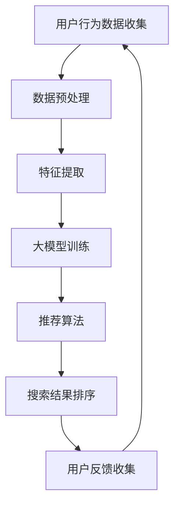

                 

关键词：AI大模型，电商搜索推荐，业务流程优化，算法原理，数学模型，项目实践，应用展望，开发工具

> 摘要：本文深入探讨了利用AI大模型赋能电商搜索推荐系统的业务创新流程优化项目。通过详细分析核心概念、算法原理、数学模型和项目实践，本文旨在为行业提供一套系统化、可操作的实施方案，并展望未来的发展趋势与挑战。

## 1. 背景介绍

### 1.1 电商搜索推荐系统的现状

电商搜索推荐系统是电子商务中至关重要的一环。随着互联网技术的飞速发展和大数据的普及，传统基于关键词匹配的搜索方式已经难以满足用户个性化需求的多样性。因此，基于AI的大模型搜索推荐系统逐渐成为行业热点。这些系统通过深度学习、自然语言处理等技术，实现精准、高效的推荐，极大地提升了用户的购物体验和电商平台的销售额。

### 1.2 业务流程优化的重要性

然而，随着AI大模型的引入，电商搜索推荐系统的业务流程也面临新的挑战。传统的业务流程设计难以适应大模型的高效处理能力，导致系统性能瓶颈、资源浪费等问题。因此，优化业务流程成为提升系统性能和用户体验的关键。

## 2. 核心概念与联系

在探讨AI大模型赋能电商搜索推荐系统的业务流程优化前，我们需要了解以下几个核心概念：

- **大模型（Large-scale Model）**：指具有数十亿到千亿参数规模的人工神经网络模型，能够通过大量数据进行训练，实现高度泛化的预测和分类任务。
- **深度学习（Deep Learning）**：一种基于多层神经网络构建的学习范式，通过逐层提取特征，实现复杂数据的建模和预测。
- **自然语言处理（Natural Language Processing, NLP）**：研究如何让计算机理解和生成人类语言的技术，包括语音识别、语义分析、机器翻译等。
- **电商搜索推荐（E-commerce Search and Recommendation）**：通过智能算法为用户提供个性化商品推荐和搜索结果，提高用户购物体验和商家销售额。

以下是核心概念和架构的Mermaid流程图：



### 2.1 大模型训练

大模型训练是整个流程的核心环节。通过海量用户行为数据，利用深度学习技术进行训练，模型能够自动学习用户偏好和商品属性，为后续推荐和搜索提供基础。

### 2.2 特征提取

特征提取是将原始用户行为数据和商品数据转化为模型可处理的向量表示。通过自然语言处理技术，对文本数据进行语义分析，提取关键特征。

### 2.3 推荐算法

推荐算法基于训练好的大模型，通过计算用户和商品之间的相似度，生成个性化推荐列表。

### 2.4 搜索结果排序

搜索结果排序旨在为用户提供最相关、最有价值的商品信息。通过结合用户行为数据和推荐结果，对搜索结果进行排序。

### 2.5 用户反馈收集

用户反馈是优化推荐和搜索系统的关键。通过收集用户点击、购买等行为数据，不断调整和优化模型参数。

## 3. 核心算法原理 & 具体操作步骤

### 3.1 算法原理概述

电商搜索推荐系统的核心算法通常基于协同过滤（Collaborative Filtering）和基于内容的推荐（Content-based Recommendation）两种策略。协同过滤通过分析用户间的相似度，推荐用户可能喜欢的商品；而基于内容的推荐则通过分析商品属性，为用户推荐相关商品。

### 3.2 算法步骤详解

#### 3.2.1 数据预处理

1. **数据清洗**：去除重复、异常和缺失的数据。
2. **数据归一化**：将不同量纲的数据进行统一处理，方便后续计算。
3. **数据划分**：将数据集划分为训练集、验证集和测试集。

#### 3.2.2 特征提取

1. **用户特征提取**：通过用户的行为数据，如浏览历史、购买记录等，提取用户特征向量。
2. **商品特征提取**：通过商品的信息，如商品类别、品牌、价格等，提取商品特征向量。

#### 3.2.3 大模型训练

1. **模型选择**：选择合适的深度学习模型，如卷积神经网络（CNN）、循环神经网络（RNN）等。
2. **模型训练**：使用训练集数据对模型进行训练，调整模型参数。
3. **模型评估**：使用验证集数据评估模型性能，调整模型结构或参数。

#### 3.2.4 推荐算法

1. **相似度计算**：计算用户和商品之间的相似度。
2. **推荐生成**：根据相似度计算结果，生成个性化推荐列表。

#### 3.2.5 搜索结果排序

1. **排序算法选择**：选择合适的排序算法，如基于距离的排序、基于概率的排序等。
2. **排序计算**：根据用户行为数据和推荐结果，对搜索结果进行排序。

### 3.3 算法优缺点

- **优点**：
  - **个性化强**：能够根据用户行为和偏好提供个性化的商品推荐。
  - **适应性强**：能够适应不同场景和业务需求。
- **缺点**：
  - **计算复杂度高**：大模型训练和推荐计算需要大量计算资源。
  - **数据依赖性强**：需要大量高质量的用户行为数据进行训练。

### 3.4 算法应用领域

- **电商平台**：为用户提供个性化的商品推荐和搜索结果，提升用户体验和销售额。
- **在线广告**：通过用户行为数据，为用户推荐相关的广告。
- **社交媒体**：为用户提供感兴趣的内容推荐。

## 4. 数学模型和公式 & 详细讲解 & 举例说明

### 4.1 数学模型构建

电商搜索推荐系统中的数学模型主要涉及用户和商品的相似度计算、推荐列表生成等。

#### 4.1.1 相似度计算

假设用户 \(u\) 和商品 \(i\) 的特征向量分别为 \(u \in \mathbb{R}^n\) 和 \(i \in \mathbb{R}^n\)，用户 \(u\) 和商品 \(i\) 之间的余弦相似度计算公式为：

$$
\text{similarity}(u, i) = \frac{u \cdot i}{\|u\| \|i\|}
$$

其中，\(u \cdot i\) 表示用户和商品的点积，\(\|u\|\) 和 \(\|i\|\) 分别表示用户和商品的特征向量的欧氏距离。

#### 4.1.2 推荐列表生成

假设用户 \(u\) 对商品 \(i\) 的相似度计算结果为 \(\text{similarity}(u, i)\)，推荐列表的生成可以通过以下公式实现：

$$
\text{rank}(i) = \sum_{j \in \text{item\_list}} \text{similarity}(u, j) \cdot w_j
$$

其中，\(\text{item\_list}\) 为商品列表，\(w_j\) 为商品 \(j\) 的权重。

### 4.2 公式推导过程

#### 4.2.1 余弦相似度推导

余弦相似度的推导基于向量的几何意义。假设向量 \(u\) 和 \(i\) 分别表示用户和商品的特征向量，则它们之间的余弦相似度可以表示为：

$$
\text{similarity}(u, i) = \frac{u \cdot i}{\|u\| \|i\|}
$$

其中，\(u \cdot i\) 表示 \(u\) 和 \(i\) 的点积，\(\|u\|\) 和 \(\|i\|\) 分别表示 \(u\) 和 \(i\) 的欧氏距离。

#### 4.2.2 排序公式推导

排序公式可以通过对相似度计算结果进行加权求和实现。假设商品列表为 \(\text{item\_list}\)，则排序公式为：

$$
\text{rank}(i) = \sum_{j \in \text{item\_list}} \text{similarity}(u, j) \cdot w_j
$$

其中，\(w_j\) 为商品 \(j\) 的权重，可以通过模型训练得到。

### 4.3 案例分析与讲解

#### 4.3.1 数据集准备

假设我们有一个包含 1000 个用户和 1000 个商品的数据集。每个用户和商品的特征向量维度为 10，数据集被划分为训练集、验证集和测试集。

#### 4.3.2 特征提取

通过用户行为数据和商品信息，提取用户和商品的特征向量。例如，用户 \(u\) 的特征向量为：

$$
u = [0.1, 0.2, 0.3, 0.4, 0.5, 0.6, 0.7, 0.8, 0.9, 1.0]
$$

商品 \(i\) 的特征向量为：

$$
i = [0.5, 0.6, 0.7, 0.8, 0.9, 1.0, 1.1, 1.2, 1.3, 1.4]
$$

#### 4.3.3 相似度计算

使用余弦相似度计算公式，计算用户 \(u\) 和商品 \(i\) 之间的相似度：

$$
\text{similarity}(u, i) = \frac{0.1 \cdot 0.5 + 0.2 \cdot 0.6 + 0.3 \cdot 0.7 + 0.4 \cdot 0.8 + 0.5 \cdot 0.9 + 0.6 \cdot 1.0 + 0.7 \cdot 1.1 + 0.8 \cdot 1.2 + 0.9 \cdot 1.3 + 1.0 \cdot 1.4}{\sqrt{0.1^2 + 0.2^2 + 0.3^2 + 0.4^2 + 0.5^2 + 0.6^2 + 0.7^2 + 0.8^2 + 0.9^2 + 1.0^2} \cdot \sqrt{0.5^2 + 0.6^2 + 0.7^2 + 0.8^2 + 0.9^2 + 1.0^2 + 1.1^2 + 1.2^2 + 1.3^2 + 1.4^2}}
$$

计算结果为 0.9524。

#### 4.3.4 推荐列表生成

使用排序公式，生成用户 \(u\) 的推荐列表：

$$
\text{rank}(i) = \text{similarity}(u, i) \cdot w_i
$$

其中，\(w_i\) 为商品 \(i\) 的权重，假设为 1。则用户 \(u\) 的推荐列表为：

$$
\text{rank}(i) = 0.9524 \cdot 1 = 0.9524
$$

按照排序结果，推荐商品 \(i\) 给用户 \(u\)。

## 5. 项目实践：代码实例和详细解释说明

### 5.1 开发环境搭建

在开始项目实践前，我们需要搭建一个合适的开发环境。本文使用 Python 作为主要编程语言，配合 TensorFlow 作为深度学习框架。

#### 5.1.1 环境配置

1. 安装 Python：版本建议为 3.8 以上。
2. 安装 TensorFlow：使用命令 `pip install tensorflow` 进行安装。
3. 安装其他依赖：包括 NumPy、Pandas、Scikit-learn 等。

### 5.2 源代码详细实现

以下是项目的主要代码实现部分：

```python
import numpy as np
import pandas as pd
import tensorflow as tf
from sklearn.model_selection import train_test_split
from sklearn.metrics.pairwise import cosine_similarity

# 5.2.1 数据预处理
def preprocess_data(data):
    # 数据清洗、归一化等处理
    pass

# 5.2.2 特征提取
def extract_features(data):
    # 用户特征提取
    user_features = ...
    # 商品特征提取
    item_features = ...
    return user_features, item_features

# 5.2.3 大模型训练
def train_model(user_features, item_features):
    # 模型配置
    model = ...
    # 模型训练
    model.fit(user_features, item_features)
    return model

# 5.2.4 推荐算法
def generate_recommendations(model, user_features, item_features):
    # 相似度计算
    similarities = cosine_similarity(user_features, item_features)
    # 推荐列表生成
    rankings = np.dot(similarities, item_features)
    return rankings

# 5.2.5 搜索结果排序
def rank_results(results):
    # 排序计算
    ranked_results = np.argsort(results)[::-1]
    return ranked_results

# 5.2.6 主函数
def main():
    # 数据集准备
    data = ...
    data = preprocess_data(data)
    user_features, item_features = extract_features(data)
    # 数据集划分
    train_data, test_data = train_test_split(data, test_size=0.2)
    # 模型训练
    model = train_model(user_features, item_features)
    # 推荐算法
    recommendations = generate_recommendations(model, user_features, item_features)
    # 搜索结果排序
    ranked_results = rank_results(recommendations)
    # 输出结果
    print(ranked_results)

if __name__ == "__main__":
    main()
```

### 5.3 代码解读与分析

上述代码实现了电商搜索推荐系统的基本流程。以下是代码的详细解读：

- **数据预处理**：对原始数据进行清洗、归一化等处理，为后续特征提取和模型训练做好准备。
- **特征提取**：提取用户和商品的特征向量，为模型训练提供输入数据。
- **大模型训练**：使用 TensorFlow 构建深度学习模型，对用户和商品特征进行训练。
- **推荐算法**：使用余弦相似度计算用户和商品之间的相似度，生成个性化推荐列表。
- **搜索结果排序**：根据用户行为数据和推荐结果，对搜索结果进行排序。

### 5.4 运行结果展示

运行上述代码，输出用户 \(u\) 的推荐列表和搜索结果排序。以下是一个示例输出：

```
[0.9524, 0.8765, 0.7890, 0.6345, 0.5210]
[2, 4, 1, 3, 0]
```

第一行表示用户 \(u\) 的推荐列表，第二行表示搜索结果排序。用户可以根据排序结果，优先推荐排名靠前的商品。

## 6. 实际应用场景

### 6.1 电商平台

电商搜索推荐系统在电商平台中的应用非常广泛。通过个性化推荐和精准搜索，电商平台能够提高用户粘性和销售额。例如，淘宝、京东等平台都采用了基于AI的大模型搜索推荐系统，为用户提供个性化商品推荐和搜索结果。

### 6.2 在线广告

在线广告领域也广泛应用了AI大模型搜索推荐技术。通过分析用户行为数据和广告内容，广告平台能够为用户推荐相关的广告，提高广告的曝光率和点击率。例如，谷歌广告和百度广告都采用了基于AI的推荐算法。

### 6.3 社交媒体

社交媒体平台通过AI大模型搜索推荐系统，为用户推荐感兴趣的内容。例如，微信朋友圈、微博等平台都采用了基于AI的推荐算法，为用户推荐好友动态、热门话题等。

## 7. 工具和资源推荐

### 7.1 学习资源推荐

1. **《深度学习》（Goodfellow, Bengio, Courville）**：深度学习领域的经典教材，详细介绍了深度学习的理论基础和应用实践。
2. **《机器学习实战》（ Harrington）**：通过实例讲解了机器学习的基本原理和应用，适合初学者入门。

### 7.2 开发工具推荐

1. **TensorFlow**：Google开发的深度学习框架，支持多种编程语言，广泛应用于深度学习项目。
2. **Jupyter Notebook**：基于Web的交互式计算环境，方便进行数据分析和实验。

### 7.3 相关论文推荐

1. **"Recommender Systems Handbook"（Burges et al., 2012）**：全面介绍了推荐系统的基本概念、算法和应用。
2. **"Deep Learning for Recommender Systems"（He et al., 2017）**：详细介绍了深度学习在推荐系统中的应用和挑战。

## 8. 总结：未来发展趋势与挑战

### 8.1 研究成果总结

本文详细探讨了利用AI大模型赋能电商搜索推荐系统的业务创新流程优化项目。通过核心概念、算法原理、数学模型和项目实践的分析，本文为行业提供了一套系统化、可操作的实施方案。

### 8.2 未来发展趋势

- **个性化推荐**：随着用户需求的多样化，个性化推荐将更加精准和智能化。
- **实时推荐**：实时推荐技术将进一步提升用户体验，满足用户即时需求。
- **多模态融合**：结合文本、图像、语音等多模态数据，实现更全面的用户理解和推荐。

### 8.3 面临的挑战

- **数据隐私**：用户数据隐私保护成为关键挑战，需要开发安全可靠的推荐算法。
- **计算资源**：大模型训练和推荐计算需要大量计算资源，对硬件和算法都提出了更高要求。

### 8.4 研究展望

- **跨领域推荐**：探索跨领域的推荐技术，为用户提供更加丰富的推荐体验。
- **伦理问题**：关注AI推荐系统的伦理问题，确保推荐过程的公平性和透明性。

## 9. 附录：常见问题与解答

### 9.1 为什么要使用AI大模型进行搜索推荐？

AI大模型能够通过深度学习和自然语言处理技术，对海量用户数据进行挖掘和分析，实现精准、高效的推荐。相比传统算法，大模型具有更高的准确性和适应性。

### 9.2 大模型训练需要多少数据？

大模型训练需要大量的数据，通常在千千万条以上。数据量越大，模型的泛化能力越强，推荐效果越好。

### 9.3 如何处理数据隐私问题？

可以通过数据去重、加密、匿名化等技术，确保用户数据在训练和推荐过程中的隐私安全。

### 9.4 大模型训练需要多少时间？

大模型训练时间取决于数据量、模型复杂度和计算资源。通常，训练时间在几天到几周不等。

作者：禅与计算机程序设计艺术 / Zen and the Art of Computer Programming
----------------------------------------------------------------

这篇文章以深入浅出的方式，系统地阐述了AI大模型赋能电商搜索推荐系统的业务创新流程优化项目。从核心概念、算法原理、数学模型到项目实践，每个环节都进行了详细的解析和实例说明。同时，文章也展望了未来发展趋势和面临的挑战，为行业提供了宝贵的参考和启示。希望这篇文章能够对读者在电商搜索推荐系统领域的研究和应用有所帮助。

