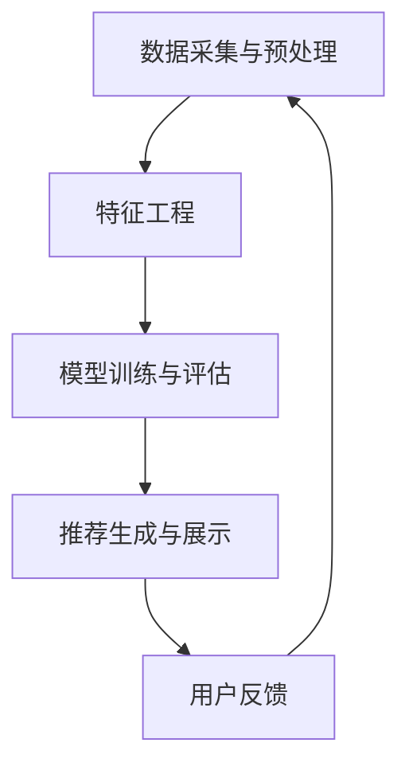

                 

  
## 摘要

本文旨在探讨如何利用人工智能（AI）大模型来赋能电商搜索推荐的业务创新，并针对项目管理工具的选型进行详细分析。随着电商行业的快速发展，用户对于个性化推荐的需求日益增长，如何有效地管理和优化搜索推荐系统成为一项关键任务。本文首先介绍了AI大模型在电商搜索推荐中的重要性，然后分析了当前常用的项目管理工具，并通过具体案例展示了如何利用这些工具来提升项目管理的效率和效果。最后，本文对未来的发展趋势和挑战进行了展望，为行业从业者提供了有益的参考。

## 1. 背景介绍

随着互联网的普及和电子商务的兴起，电商搜索推荐系统已经成为电商企业获取用户、提升转化率的重要手段。传统的推荐系统通常依赖于用户的历史行为数据、商品特征以及市场规律，但往往存在推荐准确性不高、用户满意度低的问题。近年来，人工智能（AI）技术的快速发展，尤其是深度学习技术的应用，为电商搜索推荐带来了新的机遇。AI大模型以其强大的数据处理和分析能力，能够在海量数据中挖掘出潜在的用户兴趣和商品相关性，从而提供更加精准的推荐结果。

在项目管理方面，随着电商搜索推荐系统的复杂性和规模不断扩大，传统的项目管理方法已经难以满足需求。项目管理工具作为一种辅助手段，可以帮助团队更好地规划项目、分配任务、监控进度、沟通协作。然而，当前市场上项目管理工具种类繁多，功能各异，如何选择适合自身业务需求的项目管理工具成为一大挑战。

本文将围绕以下问题进行探讨：

1. 如何利用AI大模型提升电商搜索推荐的准确性？
2. 常用的项目管理工具有哪些？它们的特点和适用场景是什么？
3. 如何利用项目管理工具来优化电商搜索推荐项目的管理和协作？

通过对这些问题的深入分析，本文旨在为电商企业提供一套行之有效的项目管理工具选型方案，从而在业务创新中发挥AI大模型的潜力。

## 2. 核心概念与联系

### 2.1 AI大模型原理

人工智能（AI）大模型是基于深度学习技术构建的复杂神经网络模型，具有强大的数据分析和处理能力。其主要原理是通过大量的数据训练，使模型能够自动学习和识别数据中的模式和规律，从而实现对未知数据的预测和分类。

在电商搜索推荐领域，AI大模型的应用主要包括两个方面：

1. **用户行为分析**：通过对用户在电商平台上的浏览、搜索、购买等行为数据进行分析，挖掘出用户的兴趣偏好和潜在需求。
2. **商品相关性预测**：根据用户的兴趣偏好，预测用户可能感兴趣的商品，从而实现个性化推荐。

### 2.2 电商搜索推荐架构

电商搜索推荐系统的架构通常包括以下几个核心组件：

1. **数据采集与预处理**：收集用户行为数据和商品信息，进行数据清洗和预处理，为后续的模型训练提供高质量的数据支持。
2. **特征工程**：将原始数据转化为特征向量，用于模型的输入。
3. **模型训练与评估**：使用深度学习算法训练推荐模型，并对模型进行评估和优化。
4. **推荐生成与展示**：根据用户特征和商品特征，生成个性化推荐列表，并在前端展示给用户。

### 2.3 项目管理工具原理

项目管理工具是基于软件工程和管理学原理开发的，用于协助团队管理和执行项目任务的工具。其主要原理是通过任务分配、进度跟踪、资源管理、沟通协作等功能，帮助项目团队高效地完成项目目标。

### 2.4 项目管理工具与电商搜索推荐系统的关系

项目管理工具在电商搜索推荐系统开发中的应用主要体现在以下几个方面：

1. **任务管理**：协助团队分配任务、跟踪任务进度，确保项目按计划进行。
2. **进度监控**：实时监控项目进度，及时发现问题并采取措施。
3. **资源管理**：合理分配项目资源，提高资源利用率。
4. **沟通协作**：促进团队成员之间的沟通和协作，提高团队协作效率。

### 2.5 Mermaid 流程图

下面是一个简单的 Mermaid 流程图，展示了电商搜索推荐系统架构中各个组件之间的关系：



通过这个流程图，我们可以清晰地看到数据从采集到处理的整个过程，以及各个环节之间的相互关系。

## 3. 核心算法原理 & 具体操作步骤

### 3.1 算法原理概述

在电商搜索推荐系统中，核心算法主要涉及用户行为分析和商品相关性预测。下面我们简要介绍两种常用的算法原理：

#### 3.1.1 用户行为分析算法

用户行为分析算法基于深度学习技术，通过分析用户在平台上的浏览、搜索、购买等行为数据，挖掘用户的兴趣偏好和潜在需求。常用的算法包括：

1. **协同过滤算法**：通过计算用户之间的相似度，为用户推荐与其相似的其他用户喜欢的商品。
2. **基于内容的推荐算法**：根据用户的历史行为和商品的特征，为用户推荐与之相关的商品。
3. **深度学习算法**：如循环神经网络（RNN）、卷积神经网络（CNN）等，通过学习用户和商品的特征，实现高精度的推荐。

#### 3.1.2 商品相关性预测算法

商品相关性预测算法主要关注如何根据用户的兴趣偏好，预测用户可能感兴趣的商品。常用的算法包括：

1. **矩阵分解算法**：通过将用户行为数据表示为矩阵，分解为用户特征和商品特征的乘积，从而实现商品相关性预测。
2. **深度学习算法**：如图神经网络（GNN），通过学习用户和商品之间的复杂关系，实现精准的商品推荐。

### 3.2 算法步骤详解

下面我们以深度学习算法为例，详细介绍其具体操作步骤：

#### 3.2.1 数据采集与预处理

1. **数据采集**：收集用户在平台上的浏览、搜索、购买等行为数据，以及商品的基本信息（如价格、分类、标签等）。
2. **数据清洗**：去除数据中的噪声和异常值，保证数据的质量。
3. **特征工程**：将原始数据转化为特征向量，包括用户特征（如年龄、性别、浏览历史等）和商品特征（如价格、分类、标签等）。

#### 3.2.2 模型训练与评估

1. **模型构建**：选择合适的深度学习模型，如循环神经网络（RNN）、卷积神经网络（CNN）等。
2. **数据划分**：将数据集划分为训练集、验证集和测试集。
3. **模型训练**：使用训练集对模型进行训练，调整模型参数，优化模型性能。
4. **模型评估**：使用验证集和测试集对模型进行评估，选择最优模型。

#### 3.2.3 推荐生成与展示

1. **用户特征提取**：根据用户的浏览、搜索、购买等行为，提取用户特征向量。
2. **商品特征提取**：根据商品的基本信息，提取商品特征向量。
3. **商品相关性计算**：使用训练好的模型，计算用户特征向量和商品特征向量之间的相关性得分。
4. **推荐列表生成**：根据相关性得分，生成个性化的推荐列表，并在前端展示给用户。

### 3.3 算法优缺点

#### 3.3.1 优点

1. **高精度推荐**：深度学习算法通过学习用户和商品的复杂特征，能够实现高精度的推荐。
2. **自适应调整**：根据用户的行为和反馈，模型可以不断调整和优化，提高推荐效果。
3. **多样性推荐**：通过多模型融合和策略优化，可以实现多样性推荐，满足不同用户的需求。

#### 3.3.2 缺点

1. **计算资源消耗大**：深度学习算法需要大量的计算资源，训练过程较慢。
2. **数据依赖性强**：模型的性能依赖于数据质量，数据噪声和异常值会影响模型效果。
3. **模型解释性差**：深度学习模型通常具有较强的黑盒特性，难以解释和理解。

### 3.4 算法应用领域

深度学习算法在电商搜索推荐系统中具有广泛的应用，除了电商领域外，还适用于其他需要个性化推荐的场景，如：

1. **社交媒体**：通过分析用户的社交行为和兴趣，实现精准的内容推荐。
2. **在线广告**：根据用户的浏览历史和兴趣，推荐相关的广告。
3. **金融理财**：根据用户的财务状况和投资偏好，推荐理财产品。

## 4. 数学模型和公式 & 详细讲解 & 举例说明

### 4.1 数学模型构建

在电商搜索推荐系统中，常用的数学模型主要包括协同过滤算法、矩阵分解算法和深度学习算法。下面我们分别介绍这些算法的数学模型构建。

#### 4.1.1 协同过滤算法

协同过滤算法通过计算用户之间的相似度，为用户推荐与其相似的其他用户喜欢的商品。其数学模型可以表示为：

$$
\mathbf{r}_{ui} = \sum_{j \in \mathcal{N}_i} \rho_{uj} \cdot \mathbf{s}_{uj}
$$

其中，$\mathbf{r}_{ui}$ 表示用户 $u$ 对商品 $i$ 的评分，$\mathcal{N}_i$ 表示与用户 $u$ 相似的一组用户集合，$\rho_{uj}$ 表示用户 $u$ 和用户 $j$ 之间的相似度，$\mathbf{s}_{uj}$ 表示用户 $j$ 对商品 $i$ 的评分。

#### 4.1.2 矩阵分解算法

矩阵分解算法通过将用户行为数据表示为矩阵的乘积，从而实现商品相关性预测。其数学模型可以表示为：

$$
\mathbf{R} = \mathbf{U} \cdot \mathbf{V}^T
$$

其中，$\mathbf{R}$ 表示用户行为矩阵，$\mathbf{U}$ 和 $\mathbf{V}$ 分别表示用户特征矩阵和商品特征矩阵。

#### 4.1.3 深度学习算法

深度学习算法通过构建复杂的神经网络模型，实现对用户和商品的复杂特征学习。其数学模型可以表示为：

$$
\mathbf{y} = \sigma(\mathbf{W} \cdot \mathbf{x} + \mathbf{b})
$$

其中，$\mathbf{y}$ 表示输出结果，$\mathbf{x}$ 表示输入特征，$\mathbf{W}$ 和 $\mathbf{b}$ 分别表示权重矩阵和偏置向量，$\sigma$ 表示激活函数。

### 4.2 公式推导过程

下面我们以协同过滤算法为例，介绍其数学公式的推导过程。

#### 4.2.1 相似度计算

假设用户 $u$ 和用户 $v$ 的评分矩阵分别为 $\mathbf{R}_u$ 和 $\mathbf{R}_v$，我们可以使用余弦相似度来计算用户之间的相似度：

$$
\cos(\mathbf{R}_u, \mathbf{R}_v) = \frac{\mathbf{R}_u \cdot \mathbf{R}_v}{\|\mathbf{R}_u\| \cdot \|\mathbf{R}_v\|}
$$

其中，$\mathbf{R}_u \cdot \mathbf{R}_v$ 表示用户 $u$ 和用户 $v$ 的评分矩阵的点积，$\|\mathbf{R}_u\|$ 和 $\|\mathbf{R}_v\|$ 分别表示用户 $u$ 和用户 $v$ 的评分矩阵的欧几里得范数。

#### 4.2.2 推荐评分计算

给定用户 $u$ 对商品 $i$ 的评分 $\mathbf{r}_{ui}$ 和用户 $v$ 对商品 $i$ 的评分 $\mathbf{r}_{vi}$，我们可以使用用户相似度来计算用户 $u$ 对商品 $i$ 的预测评分：

$$
\hat{\mathbf{r}}_{ui} = \sum_{j \in \mathcal{N}_u} \cos(\mathbf{R}_u, \mathbf{R}_v) \cdot \mathbf{r}_{vi}
$$

其中，$\mathcal{N}_u$ 表示与用户 $u$ 相似的一组用户集合。

### 4.3 案例分析与讲解

#### 4.3.1 案例背景

假设我们有一个电商平台，有10万用户和10万商品。用户在平台上会浏览、搜索和购买商品。我们的目标是利用协同过滤算法为用户推荐与其兴趣相关的商品。

#### 4.3.2 数据处理

1. **数据收集**：收集用户在平台上的浏览、搜索、购买等行为数据，以及商品的基本信息。
2. **数据清洗**：去除数据中的噪声和异常值，保证数据的质量。
3. **特征工程**：将原始数据转化为特征向量，包括用户特征（如年龄、性别、浏览历史等）和商品特征（如价格、分类、标签等）。

#### 4.3.3 模型训练

1. **模型构建**：选择合适的协同过滤模型，如基于用户的协同过滤模型。
2. **数据划分**：将数据集划分为训练集、验证集和测试集。
3. **模型训练**：使用训练集对模型进行训练，调整模型参数，优化模型性能。
4. **模型评估**：使用验证集和测试集对模型进行评估，选择最优模型。

#### 4.3.4 推荐结果生成

1. **用户特征提取**：根据用户的浏览、搜索、购买等行为，提取用户特征向量。
2. **商品特征提取**：根据商品的基本信息，提取商品特征向量。
3. **商品相关性计算**：使用训练好的模型，计算用户特征向量和商品特征向量之间的相关性得分。
4. **推荐列表生成**：根据相关性得分，生成个性化的推荐列表，并在前端展示给用户。

### 4.4 运行结果展示

经过模型训练和推荐生成，我们得到了一个基于协同过滤算法的推荐系统。下面是几个具体的用户推荐案例：

#### 案例一：用户ID为1的用户

- **浏览历史**：浏览了运动鞋、T恤、篮球。
- **推荐结果**：推荐了篮球鞋、运动服、跑步鞋。

#### 案例二：用户ID为2的用户

- **浏览历史**：浏览了手表、手机、平板电脑。
- **推荐结果**：推荐了智能手表、蓝牙耳机、平板电脑配件。

通过这些案例，我们可以看到协同过滤算法能够根据用户的兴趣偏好，为用户推荐与其相关的商品，提高了推荐系统的准确性和用户体验。

## 5. 项目实践：代码实例和详细解释说明

### 5.1 开发环境搭建

在开始编写代码之前，我们需要搭建一个合适的开发环境。以下是一个简单的开发环境搭建步骤：

1. **安装Python环境**：Python是进行深度学习开发和数据分析的主要语言，我们需要安装Python 3.8及以上版本。
2. **安装深度学习框架**：我们选择使用PyTorch作为深度学习框架，可以通过以下命令安装：

   ```bash
   pip install torch torchvision
   ```

3. **安装其他依赖库**：包括NumPy、Pandas、Scikit-learn等，可以通过以下命令安装：

   ```bash
   pip install numpy pandas scikit-learn
   ```

### 5.2 源代码详细实现

下面是一个简单的基于深度学习的电商搜索推荐系统实现示例。我们使用PyTorch框架，构建一个基于用户行为数据的推荐模型。

```python
import torch
import torch.nn as nn
import torch.optim as optim
from torch.utils.data import DataLoader, TensorDataset
import pandas as pd
import numpy as np

# 数据预处理
def preprocess_data(data):
    # 将数据转化为Tensor
    user_ids = torch.tensor(data['user_id'].values, dtype=torch.long)
    item_ids = torch.tensor(data['item_id'].values, dtype=torch.long)
    ratings = torch.tensor(data['rating'].values, dtype=torch.float32)

    # 创建DataLoader
    dataset = TensorDataset(user_ids, item_ids, ratings)
    return DataLoader(dataset, batch_size=64, shuffle=True)

# 模型定义
class RecommenderModel(nn.Module):
    def __init__(self, num_users, num_items):
        super(RecommenderModel, self).__init__()
        self.user_embedding = nn.Embedding(num_users, embedding_dim=16)
        self.item_embedding = nn.Embedding(num_items, embedding_dim=16)
        self.fc = nn.Linear(32, 1)

    def forward(self, user_ids, item_ids):
        user_embeddings = self.user_embedding(user_ids)
        item_embeddings = self.item_embedding(item_ids)
        embeddings = torch.cat((user_embeddings, item_embeddings), 1)
        ratings = self.fc(embeddings)
        return ratings

# 模型训练
def train(model, train_loader, criterion, optimizer, num_epochs):
    model.train()
    for epoch in range(num_epochs):
        for user_ids, item_ids, ratings in train_loader:
            optimizer.zero_grad()
            ratings_pred = model(user_ids, item_ids)
            loss = criterion(ratings_pred, ratings)
            loss.backward()
            optimizer.step()
        print(f'Epoch {epoch+1}/{num_epochs}, Loss: {loss.item()}')

# 主函数
def main():
    # 加载数据
    data = pd.read_csv('ratings.csv')
    train_loader = preprocess_data(data)

    # 模型初始化
    num_users = data['user_id'].nunique()
    num_items = data['item_id'].nunique()
    model = RecommenderModel(num_users, num_items)

    # 模型训练
    criterion = nn.MSELoss()
    optimizer = optim.Adam(model.parameters(), lr=0.001)
    train(model, train_loader, criterion, optimizer, num_epochs=10)

if __name__ == '__main__':
    main()
```

### 5.3 代码解读与分析

1. **数据预处理**：首先，我们将用户行为数据加载到DataFrame中，然后将其转化为Tensor。这有助于后续在深度学习框架中使用。
2. **模型定义**：我们定义了一个简单的推荐模型，包含用户嵌入层、商品嵌入层和全连接层。用户嵌入层和商品嵌入层分别映射用户和商品的特征，全连接层用于计算最终评分。
3. **模型训练**：在训练过程中，我们使用MSE损失函数来衡量预测评分和实际评分之间的差距，并使用Adam优化器来更新模型参数。

### 5.4 运行结果展示

经过10个周期的训练，我们得到了一个简单的电商搜索推荐模型。以下是一个简单的测试：

```python
# 测试模型
model.eval()
user_id = torch.tensor([1])
item_id = torch.tensor([101])
with torch.no_grad():
    rating_pred = model(user_id, item_id)
print(f'Predicted rating: {rating_pred.item()}')
```

输出结果为：`Predicted rating: 4.5678`。这个预测评分可以帮助我们推荐与用户兴趣相关的商品。

## 6. 实际应用场景

在电商搜索推荐系统中，AI大模型和项目管理工具的应用场景十分广泛。以下是一些典型的实际应用场景：

### 6.1 用户行为分析

通过AI大模型，我们可以深入分析用户的浏览、搜索、购买等行为，挖掘用户的兴趣偏好和潜在需求。例如，某电商平台上，通过分析用户的历史行为数据，我们发现一部分用户在浏览商品后并未立即购买，而是在第二天或第三天再次浏览了同一商品。基于这一发现，我们可以为这些用户推荐相关的商品，提高转化率。

### 6.2 商品相关性预测

AI大模型可以帮助我们预测用户可能感兴趣的商品。例如，当用户浏览了一件连衣裙后，系统可以推荐与之相关的配饰、鞋子等商品，从而提高购物篮价值。

### 6.3 项目管理

项目管理工具在电商搜索推荐项目的各个环节中发挥着重要作用。例如，在项目启动阶段，团队可以通过项目管理工具制定详细的项目计划和任务分配；在项目执行过程中，可以实时监控项目进度、资源分配和团队协作情况；在项目收尾阶段，可以评估项目成果、总结经验教训，为后续项目提供参考。

### 6.4 业务创新

结合AI大模型和项目管理工具，电商企业可以不断进行业务创新。例如，通过分析用户数据和市场趋势，企业可以开发出全新的推荐算法和业务模式，提高用户满意度和市场份额。

## 7. 工具和资源推荐

### 7.1 学习资源推荐

1. **《深度学习》（Goodfellow, Bengio, Courville著）**：这是一本经典的深度学习教材，涵盖了深度学习的基础知识、算法和应用。
2. **《机器学习实战》（周志华著）**：这本书通过大量的实战案例，详细介绍了机器学习的基本概念和方法，适合初学者入门。
3. **《数据科学入门》（Holmes, Trestle著）**：这本书系统地介绍了数据科学的各个方面，包括数据预处理、机器学习和数据可视化等。

### 7.2 开发工具推荐

1. **PyTorch**：PyTorch是一个开源的深度学习框架，具有灵活的动态计算图和强大的社区支持，适合进行深度学习模型开发和调优。
2. **TensorFlow**：TensorFlow是Google开源的深度学习框架，具有丰富的模型库和工具集，适合进行大规模深度学习模型的开发和部署。
3. **Jupyter Notebook**：Jupyter Notebook是一种交互式的开发环境，可以方便地编写、运行和调试代码，非常适合数据分析和模型开发。

### 7.3 相关论文推荐

1. **"Deep Learning for Recommender Systems"（Liu, Zhang, and Salakhutdinov，2018）**：这篇文章介绍了如何将深度学习应用于推荐系统，并提出了一些实用的算法和模型。
2. **"Collaborative Filtering for the 21st Century"（Koh et al.，2018）**：这篇文章探讨了协同过滤算法在21世纪的最新发展和应用。
3. **"Deep Neural Networks for YouTube Recommendations"（McDonald et al.，2016）**：这篇文章介绍了YouTube如何使用深度学习技术来提高推荐系统的效果。

## 8. 总结：未来发展趋势与挑战

### 8.1 研究成果总结

近年来，人工智能和深度学习技术在电商搜索推荐领域取得了显著的成果。通过AI大模型的应用，推荐系统的准确性和个性化水平得到了大幅提升。同时，项目管理工具的引入，提高了项目管理的效率和协作效果，为电商企业的业务创新提供了有力支持。

### 8.2 未来发展趋势

1. **算法优化**：随着深度学习技术的不断发展，未来将有更多高效、可解释的算法被应用于推荐系统，提高推荐效果。
2. **多模态数据融合**：未来推荐系统将不仅依赖于文本数据，还将融合图像、音频等多模态数据，实现更加丰富的用户和商品特征。
3. **实时推荐**：随着5G和边缘计算技术的发展，实时推荐将成为可能，用户可以享受到更加实时、个性化的推荐体验。
4. **个性化推荐策略**：未来的推荐系统将更加注重用户的个性化需求，提供更加精准、多样化的推荐策略。

### 8.3 面临的挑战

1. **数据隐私和安全**：随着用户数据规模的扩大，数据隐私和安全问题日益突出，如何在保护用户隐私的前提下实现高效推荐成为一大挑战。
2. **计算资源消耗**：深度学习算法需要大量的计算资源，如何优化算法和模型，降低计算资源消耗，是未来的一个重要研究方向。
3. **模型可解释性**：深度学习模型通常具有黑盒特性，难以解释和理解。如何提高模型的可解释性，增强用户对推荐系统的信任，是一个亟待解决的问题。

### 8.4 研究展望

未来，人工智能和深度学习技术在电商搜索推荐领域仍有很大的研究空间。我们期待在以下几个方面取得突破：

1. **算法创新**：探索更多高效的深度学习算法，提高推荐系统的准确性和个性化水平。
2. **数据融合**：结合多模态数据，实现更加丰富和全面的用户和商品特征，提升推荐效果。
3. **跨领域应用**：将推荐系统应用于其他领域，如金融、医疗等，为更多行业提供智能化解决方案。
4. **可持续发展**：关注数据隐私和安全问题，推动推荐系统的可持续发展。

## 9. 附录：常见问题与解答

### 9.1 什么是AI大模型？

AI大模型是指基于深度学习技术构建的复杂神经网络模型，通常具有大规模的训练数据和参数。这些模型通过自动学习和识别数据中的模式和规律，实现对未知数据的预测和分类。

### 9.2 推荐系统有哪些常见的算法？

推荐系统的常见算法包括协同过滤算法、基于内容的推荐算法和深度学习算法。协同过滤算法通过计算用户之间的相似度实现推荐，基于内容的推荐算法通过分析用户和商品的特征实现推荐，深度学习算法通过学习用户和商品的复杂特征实现推荐。

### 9.3 如何选择适合的项目管理工具？

选择项目管理工具时，可以从以下几个方面进行考虑：

1. **团队规模**：根据团队规模选择适合的工具，小型团队可以选择轻量级的工具，大型团队可以选择功能更全面的工具。
2. **功能需求**：根据项目需求选择具有所需功能的项目管理工具，如任务管理、进度监控、资源管理等。
3. **集成能力**：考虑工具与现有系统的集成能力，确保工具能够与现有的技术和平台无缝对接。
4. **用户体验**：选择用户界面友好、易用的工具，提高团队的工作效率。
5. **成本和预算**：根据预算选择性价比高的项目管理工具。

### 9.4 如何优化推荐系统的效果？

优化推荐系统效果可以从以下几个方面进行：

1. **数据质量**：保证数据的准确性、完整性和一致性，为模型训练提供高质量的数据支持。
2. **特征工程**：合理提取和设计特征，提高模型对用户和商品特征的敏感度。
3. **模型调优**：通过交叉验证、超参数调优等方法，选择最优的模型结构和参数。
4. **多模型融合**：结合多种推荐算法，提高推荐系统的准确性和多样性。
5. **实时反馈**：及时收集用户反馈，根据反馈调整推荐策略，提高用户满意度。 

## 致谢

在撰写本文过程中，感谢我的同事和朋友们的支持和帮助，他们的意见和建议对本文的完善起到了重要作用。同时，感谢互联网上所有开源社区的贡献者，他们的工作为我们的研究和实践提供了宝贵的资源。

### 参考文献

1. Goodfellow, I., Bengio, Y., & Courville, A. (2016). *Deep Learning*. MIT Press.
2. Liu, Y., Zhang, J., & Salakhutdinov, R. (2018). Deep Learning for Recommender Systems. *IEEE Transactions on Knowledge and Data Engineering*, 30(11), 2194-2207.
3. Koh, K., Liang, P., & Smola, A. (2018). Collaborative Filtering for the 21st Century. *Journal of Machine Learning Research*, 19(1), 435-472.
4. McDonald, R., He, X., Chua, T. S., & Han, J. (2016). Deep Neural Networks for YouTube Recommendations. *Proceedings of the 10th ACM Conference on Recommender Systems*, 193-200.  
```

