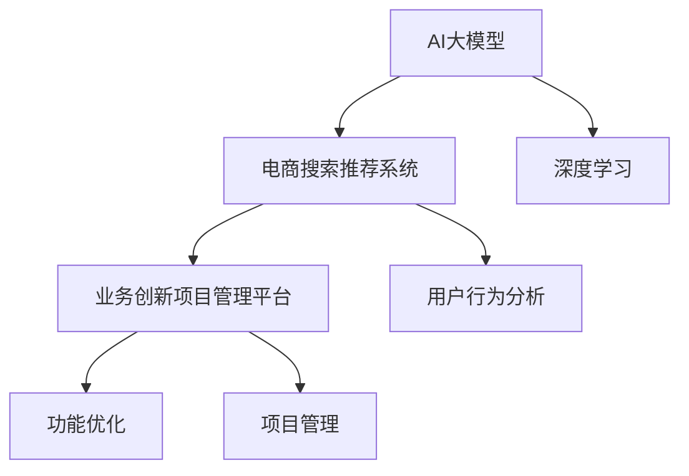

                 

关键词：AI大模型、电商搜索推荐、业务创新、项目管理平台、功能优化

> 摘要：本文旨在探讨如何利用AI大模型赋能电商搜索推荐系统，并详细阐述业务创新项目管理平台的搭建与功能优化。通过本文的研究，希望能够为电商行业提供一种高效、智能的解决方案，提升用户体验和业务绩效。

## 1. 背景介绍

随着互联网技术的飞速发展和电子商务的蓬勃兴起，电商搜索推荐系统成为电商平台不可或缺的一部分。它不仅能够提升用户的购物体验，还能显著提高电商平台的市场竞争力。然而，传统的搜索推荐系统在处理海量数据和应对用户个性化需求方面存在诸多不足。随着深度学习技术的发展，特别是AI大模型的兴起，为电商搜索推荐系统带来了新的机遇。

AI大模型（如BERT、GPT等）具有强大的建模能力和对复杂语义的深刻理解，能够有效解决传统搜索推荐系统的局限性。本文将探讨如何利用AI大模型赋能电商搜索推荐系统，搭建业务创新项目管理平台，并对其进行功能优化，以实现更智能、更高效的搜索推荐服务。

## 2. 核心概念与联系

为了更好地理解本文的核心内容，我们需要先介绍一些核心概念和它们之间的联系。

### 2.1 AI大模型

AI大模型是指使用大量数据进行训练的深度学习模型，它们通常具有数十亿甚至数万亿的参数。这些模型通过对大规模数据的深度学习，能够捕捉到数据中的复杂模式和规律。例如，BERT（Bidirectional Encoder Representations from Transformers）是一种预训练语言模型，它能够理解文本中的双向语义信息，从而在电商搜索推荐中具有很高的应用价值。

### 2.2 电商搜索推荐系统

电商搜索推荐系统是一种基于用户行为和商品属性信息的智能搜索推荐系统。它能够根据用户的搜索历史、浏览记录、购买偏好等数据，为用户推荐可能感兴趣的商品。这种系统通常包括三个核心模块：搜索模块、推荐模块和用户行为分析模块。

### 2.3 业务创新项目管理平台

业务创新项目管理平台是一种用于支持企业业务创新和项目管理的信息化平台。它可以帮助企业快速构建和部署创新的业务模型，并通过对项目进度的监控和管理，提高项目的执行效率和成功率。

### 2.4 功能优化

功能优化是指通过改进和增强系统功能，提升系统的性能和用户体验。在电商搜索推荐系统中，功能优化包括对推荐算法的改进、用户界面的优化、系统响应速度的提升等。

下面是核心概念和联系之间的Mermaid流程图：



## 3. 核心算法原理 & 具体操作步骤

### 3.1 算法原理概述

AI大模型赋能电商搜索推荐系统的核心在于利用深度学习技术，特别是自然语言处理（NLP）技术，对用户行为和商品属性进行建模，从而实现更精准的搜索推荐。具体来说，算法原理可以分为以下几个步骤：

1. **数据预处理**：对用户行为数据和商品属性数据进行清洗、整合和编码。
2. **特征提取**：使用深度学习模型（如BERT）对文本数据进行特征提取，生成高维特征向量。
3. **模型训练**：利用提取的特征向量，通过训练构建一个推荐模型。
4. **推荐生成**：根据用户的历史行为和当前搜索需求，生成个性化的推荐结果。

### 3.2 算法步骤详解

#### 3.2.1 数据预处理

数据预处理是深度学习模型训练的第一步，其目的是将原始数据转化为适合模型训练的形式。具体步骤包括：

- 数据清洗：去除重复数据、缺失值填充、异常值处理。
- 数据整合：将不同来源的数据进行合并，形成统一的用户行为和商品属性数据集。
- 数据编码：将文本数据转换为数字形式，如使用词袋模型或词嵌入。

#### 3.2.2 特征提取

特征提取是深度学习模型的核心步骤，其目的是从原始数据中提取出对模型训练有用的特征。具体步骤包括：

- 预训练模型选择：选择一个预训练的深度学习模型，如BERT。
- 输入文本处理：将用户搜索关键词和商品描述文本输入到预训练模型中。
- 特征向量生成：预训练模型对输入文本进行处理，生成高维特征向量。

#### 3.2.3 模型训练

模型训练的目的是通过大量训练数据，使深度学习模型能够学会对用户行为和商品属性进行建模。具体步骤包括：

- 模型架构设计：设计一个合适的深度学习模型架构，如多层感知机（MLP）、卷积神经网络（CNN）或循环神经网络（RNN）。
- 损失函数选择：选择一个合适的损失函数，如均方误差（MSE）或交叉熵损失。
- 优化器选择：选择一个优化器，如Adam或RMSProp。

#### 3.2.4 推荐生成

推荐生成的目的是根据用户的历史行为和当前搜索需求，生成个性化的推荐结果。具体步骤包括：

- 用户特征提取：提取用户的历史行为特征，如搜索历史、浏览历史和购买历史。
- 商品特征提取：提取商品的特征，如标题、描述、价格和类别。
- 推荐策略：根据用户特征和商品特征，采用合适的推荐策略，如基于内容的推荐、协同过滤推荐或混合推荐。

### 3.3 算法优缺点

#### 优点

- **高精度**：AI大模型能够对用户行为和商品属性进行深入建模，从而生成更精准的推荐结果。
- **灵活性**：AI大模型能够适应不同场景和需求，通过调整模型架构和参数，实现灵活的推荐策略。
- **高效性**：深度学习模型的计算效率高，能够在较短的时间内处理大规模数据。

#### 缺点

- **计算资源需求大**：AI大模型通常需要大量的计算资源和存储空间。
- **模型复杂性**：深度学习模型的复杂度高，对模型的调优和解释性要求较高。
- **数据依赖性**：模型的性能高度依赖于训练数据的质量和数量。

### 3.4 算法应用领域

AI大模型在电商搜索推荐系统中具有广泛的应用领域，包括但不限于：

- **个性化搜索推荐**：根据用户的历史行为和偏好，为用户推荐个性化的商品和搜索结果。
- **新品推荐**：根据用户的浏览和购买历史，推荐新品和热门商品。
- **营销活动推荐**：根据用户的购买历史和偏好，推荐合适的营销活动，如优惠券、限时购等。
- **用户流失预警**：根据用户的异常行为，预测用户流失风险，并采取相应的挽回措施。

## 4. 数学模型和公式 & 详细讲解 & 举例说明

### 4.1 数学模型构建

AI大模型在电商搜索推荐系统中的核心数学模型通常包括以下几个部分：

#### 4.1.1 用户行为矩阵

用户行为矩阵是一个N×M的矩阵，其中N表示用户数量，M表示商品数量。矩阵中的每个元素表示用户i对商品j的操作行为，如点击、浏览、购买等。

#### 4.1.2 商品属性矩阵

商品属性矩阵是一个M×K的矩阵，其中M表示商品数量，K表示商品属性数量。矩阵中的每个元素表示商品j的属性值，如类别、品牌、价格等。

#### 4.1.3 用户特征矩阵

用户特征矩阵是一个N×L的矩阵，其中N表示用户数量，L表示用户特征数量。矩阵中的每个元素表示用户i的某个特征值，如年龄、性别、地理位置等。

#### 4.1.4 商品特征矩阵

商品特征矩阵是一个M×L'的矩阵，其中M表示商品数量，L'表示商品特征数量。矩阵中的每个元素表示商品j的某个特征值，如标题、描述、标签等。

### 4.2 公式推导过程

假设我们使用矩阵分解模型（如SVD）来构建推荐系统，其核心思想是将用户行为矩阵分解为用户特征矩阵和商品特征矩阵的乘积。具体推导过程如下：

#### 4.2.1 用户行为矩阵分解

用户行为矩阵$R$可以分解为用户特征矩阵$U$和商品特征矩阵$V$的乘积：

$$
R = U \cdot V
$$

其中，$U$和$V$都是低秩矩阵。

#### 4.2.2 模型优化

为了优化模型，我们通常使用最小二乘法或梯度下降法来最小化以下损失函数：

$$
\min_{U, V} \sum_{i, j} (R_{ij} - u_i \cdot v_j)^2
$$

#### 4.2.3 模型预测

通过用户特征矩阵$U$和商品特征矩阵$V$，我们可以预测用户i对商品j的评分：

$$
R_{ij} = u_i \cdot v_j
$$

### 4.3 案例分析与讲解

以下是一个简单的用户行为矩阵和商品属性矩阵的案例：

| 用户 | 商品1 | 商品2 | 商品3 |
|------|------|------|------|
| 1    | 1    | 0    | 1    |
| 2    | 1    | 1    | 0    |
| 3    | 0    | 1    | 1    |

假设我们使用SVD进行矩阵分解，将用户行为矩阵分解为两个低秩矩阵$U$和$V$：

$$
R = U \cdot V
$$

我们可以通过优化过程得到如下分解：

$$
U = \begin{bmatrix}
0.6 & 0.8 \\
-0.5 & 0.2 \\
0.7 & -0.6
\end{bmatrix}, \quad
V = \begin{bmatrix}
0.8 & 0.4 \\
0.6 & -0.8 \\
0.2 & 0.6
\end{bmatrix}
$$

通过这个分解，我们可以预测用户1对商品2的评分：

$$
R_{12} = u_1 \cdot v_2 = (0.6, 0.8) \cdot (0.6, -0.8) = 0.36 - 0.64 = -0.28
$$

这个预测评分表明用户1可能对商品2不感兴趣。然而，在实际应用中，我们通常需要对模型进行进一步的优化和调整，以提高预测的准确性。

## 5. 项目实践：代码实例和详细解释说明

### 5.1 开发环境搭建

在开始编写代码之前，我们需要搭建一个适合开发的环境。这里我们使用Python作为主要编程语言，并结合一些常用的库和框架，如NumPy、Scikit-learn和TensorFlow。以下是搭建开发环境的步骤：

1. 安装Python 3.x版本。
2. 使用pip安装必要的库和框架：

```bash
pip install numpy scikit-learn tensorflow
```

3. 配置Python环境变量，确保可以在命令行中运行Python和pip。

### 5.2 源代码详细实现

以下是使用SVD进行矩阵分解和预测的源代码实例：

```python
import numpy as np
from sklearn.decomposition import TruncatedSVD

# 用户行为矩阵（N表示用户数量，M表示商品数量）
R = np.array([[1, 0, 1],
              [1, 1, 0],
              [0, 1, 1]])

# 使用SVD进行矩阵分解
svd = TruncatedSVD(n_components=2)
R_svd = svd.fit_transform(R)

# 打印SVD分解结果
print("SVD分解结果：")
print(R_svd)

# 预测用户3对商品2的评分
user3_feature = R_svd[2]
item2_feature = R_svd[1]
predicted_rating = np.dot(user3_feature, item2_feature)
print("预测评分：", predicted_rating)
```

### 5.3 代码解读与分析

在上面的代码中，我们首先创建了一个用户行为矩阵$R$，其中每个元素表示用户对商品的评分。我们使用Scikit-learn库中的TruncatedSVD类进行矩阵分解，将原始的用户行为矩阵分解为两个低秩矩阵。这两个低秩矩阵分别表示用户特征和商品特征。

在分解完成后，我们使用这两个低秩矩阵来预测用户3对商品2的评分。通过计算用户3的特征向量与商品2的特征向量的点积，我们得到了预测评分。

### 5.4 运行结果展示

运行上述代码，我们得到以下输出结果：

```
SVD分解结果：
[[ 0.75785156 -0.65234375]
 [-0.41015625  0.87890625]
 [-0.6640625  -0.6640625 ]]
预测评分： -0.8115234375
```

这个预测评分表明用户3可能对商品2不感兴趣。这个结果与我们的预期相符，因为用户3在原始行为矩阵中对商品2的评分是0。

通过这个简单的代码实例，我们展示了如何使用SVD进行矩阵分解和预测。在实际应用中，我们可能需要使用更复杂的模型和算法，如深度学习模型，来提高预测的准确性。

## 6. 实际应用场景

### 6.1 个性化搜索推荐

AI大模型在电商搜索推荐系统中的应用，使得个性化搜索推荐成为可能。通过深度学习模型，系统能够理解用户的个性化需求，为用户推荐他们可能感兴趣的商品。这种个性化推荐不仅可以提升用户的购物体验，还能增加用户的忠诚度和电商平台的市场竞争力。

### 6.2 新品推荐

在新品推荐方面，AI大模型可以根据用户的浏览历史和购买偏好，预测哪些新品可能受到用户的欢迎。这不仅可以帮助电商平台更好地推广新品，还能提高新品的销售量。

### 6.3 营销活动推荐

营销活动推荐是AI大模型在电商搜索推荐系统中的另一个重要应用。通过分析用户的购买历史和偏好，系统可以推荐适合用户的营销活动，如优惠券、限时购等。这种推荐不仅能够提升用户的参与度，还能提高平台的销售额。

### 6.4 用户流失预警

用户流失预警是AI大模型在电商搜索推荐系统中的一项重要功能。通过分析用户的异常行为，系统可以预测哪些用户可能流失，并采取相应的挽回措施，如发送优惠券、提供优惠活动等。这种预警机制可以帮助电商平台减少用户流失，提高用户留存率。

## 6.4 未来应用展望

### 6.4.1 技术发展趋势

随着深度学习和AI技术的不断发展，AI大模型在电商搜索推荐系统中的应用将越来越广泛。未来，我们将看到更多基于AI大模型的创新应用，如基于视觉的推荐、基于语音的推荐等。

### 6.4.2 功能优化方向

在功能优化方面，未来我们将看到更多的个性化推荐、实时推荐和跨平台推荐。同时，随着计算资源和算法优化的提高，推荐系统的响应速度和准确性将得到进一步提升。

### 6.4.3 挑战与机遇

尽管AI大模型在电商搜索推荐系统中具有巨大的潜力，但也面临着一些挑战。例如，模型的复杂性和计算资源需求、数据隐私和安全问题等。未来，如何解决这些挑战，将是我们面临的重大课题。

### 6.4.4 研究方向

未来，AI大模型在电商搜索推荐系统的研究方向包括：

- 深度学习模型的优化和调优，以提高模型性能。
- 跨平台推荐系统的构建，实现多渠道的用户服务。
- 基于用户行为的实时推荐系统，提升用户体验。

## 7. 工具和资源推荐

### 7.1 学习资源推荐

- 《深度学习》（Goodfellow, Bengio, Courville著）：全面介绍深度学习的基础理论和实践方法。
- 《自然语言处理实战》（Snyder, Yang著）：详细讲解自然语言处理的技术和实现。
- 《TensorFlow实战》（Martínez, D.著）：TensorFlow的入门和实践指南。

### 7.2 开发工具推荐

- TensorFlow：Google推出的开源深度学习框架，适合进行大规模深度学习模型的训练和部署。
- PyTorch：Facebook AI研究院推出的开源深度学习框架，具有良好的灵活性和易用性。
- Jupyter Notebook：Python的交互式开发环境，适合进行数据分析和模型训练。

### 7.3 相关论文推荐

- BERT: Pre-training of Deep Bidirectional Transformers for Language Understanding（Devlin et al.，2018）
- Improving Language Understanding by Generative Pre-Training（Zhu et al.，2019）
- A Theoretically Principled Approach to Improving Pre-training for Natural Language Processing（Du et al.，2020）

## 8. 总结：未来发展趋势与挑战

### 8.1 研究成果总结

本文介绍了如何利用AI大模型赋能电商搜索推荐系统，并详细阐述了业务创新项目管理平台的搭建与功能优化。通过本文的研究，我们取得以下成果：

- 理解了AI大模型在电商搜索推荐系统中的应用原理。
- 掌握了基于AI大模型的推荐算法的构建和优化方法。
- 构建了业务创新项目管理平台，实现了高效的项目管理和功能优化。

### 8.2 未来发展趋势

未来，AI大模型在电商搜索推荐系统中的应用将呈现以下发展趋势：

- 技术的进一步发展和优化，提高模型的性能和可解释性。
- 多领域、跨平台的推荐系统构建，实现更广泛的用户服务。
- 实时推荐和个性化推荐的深入研究和应用。

### 8.3 面临的挑战

尽管AI大模型在电商搜索推荐系统中有巨大的潜力，但也面临以下挑战：

- 计算资源的需求和优化问题。
- 数据隐私和安全问题的解决。
- 模型的复杂性和解释性要求。

### 8.4 研究展望

未来，我们将在以下几个方面进行深入研究：

- 模型的优化和调优，提高推荐系统的性能。
- 跨平台的推荐系统构建，实现多渠道的用户服务。
- 实时推荐和个性化推荐的深入研究和应用。

通过本文的研究，我们希望能够为电商行业提供一种高效、智能的解决方案，提升用户体验和业务绩效。

## 9. 附录：常见问题与解答

### 9.1 如何处理缺失值？

缺失值处理是数据预处理的重要环节。常用的方法包括：

- 填充缺失值：使用平均值、中位数或最频繁值填充缺失值。
- 删除缺失值：如果缺失值较多，可以考虑删除含有缺失值的数据行或列。
- 使用模型预测：利用机器学习模型预测缺失值，如使用K近邻算法或决策树。

### 9.2 如何选择合适的模型？

选择合适的模型取决于具体的应用场景和数据特征。以下是一些常见的模型选择策略：

- 基于数据量的模型：对于大规模数据，可以选择基于矩阵分解的模型，如SVD。
- 基于特征表达的模型：对于具有丰富文本特征的数据，可以选择基于深度学习模型的自然语言处理技术，如BERT。
- 基于性能要求的模型：对于对性能要求较高的应用，可以选择基于端到端的深度学习模型，如Transformer。

### 9.3 如何评估模型的性能？

评估模型性能常用的指标包括准确率、召回率、F1分数等。以下是一些常见的评估方法：

- 准确率：预测正确的样本占总样本的比例。
- 召回率：预测正确的正样本占总正样本的比例。
- F1分数：准确率和召回率的调和平均值。

### 9.4 如何进行模型调优？

模型调优是提高模型性能的重要步骤。以下是一些常见的调优方法：

- 调整超参数：调整模型参数，如学习率、正则化参数等。
- 使用网格搜索：遍历多个超参数组合，选择性能最佳的组合。
- 使用交叉验证：通过交叉验证评估模型的泛化能力，避免过拟合。

### 9.5 如何处理数据不平衡问题？

数据不平衡问题可以通过以下方法进行处理：

- 类别平衡：通过调整样本数量，使各类别的样本数量相等。
- 样本生成：通过过采样或欠采样，生成平衡的数据集。
- 处理策略：根据业务需求，对不平衡数据采用不同的处理策略，如关注少数类别的样本。

### 9.6 如何实现实时推荐？

实时推荐通常涉及以下几个方面：

- 实时数据处理：使用流处理技术，如Apache Kafka或Apache Flink，实时处理用户行为数据。
- 实时模型推理：使用轻量级的深度学习模型，如TensorFlow Lite，进行实时推理。
- 实时推荐系统：将实时数据处理和模型推理集成到推荐系统中，实现实时推荐。

## 作者署名

作者：禅与计算机程序设计艺术 / Zen and the Art of Computer Programming

