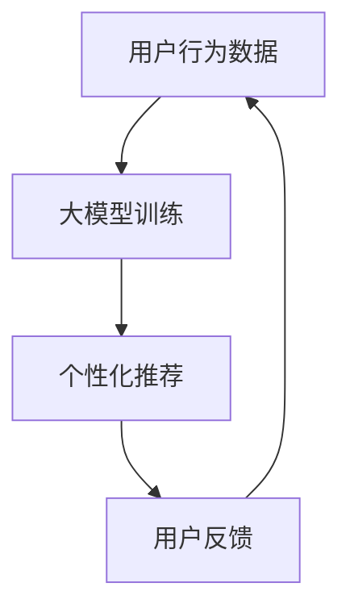

                 

关键词：人工智能、大模型、电商搜索、推荐系统、用户体验、优化策略

>摘要：随着电子商务的迅速发展，搜索推荐系统在提高用户满意度和转化率方面发挥着至关重要的作用。本文深入探讨了利用人工智能大模型赋能电商搜索推荐系统的策略，旨在提升用户体验，并分析了当前面临的技术挑战及未来发展方向。

## 1. 背景介绍

在当今数字化时代，电子商务已成为全球商业活动的重要组成部分。用户通过搜索引擎和推荐系统快速找到心仪的商品，从而实现购物需求的满足。然而，传统的搜索推荐系统在面对海量数据和复杂用户行为时，往往无法提供精准的个性化推荐，导致用户体验不佳。为此，人工智能大模型的应用为电商搜索推荐系统的优化带来了新的契机。

人工智能大模型，如深度神经网络、Transformer等，通过大规模数据训练，能够自动学习并理解复杂的数据模式和用户行为。在电商领域，大模型能够有效处理用户的历史购买记录、搜索行为、浏览路径等数据，从而实现更为精准的搜索推荐。

## 2. 核心概念与联系

在深入探讨大模型赋能电商搜索推荐之前，我们有必要先了解几个核心概念及其相互关系。

### 2.1 大模型原理

大模型主要基于深度学习和自然语言处理技术，通过大规模数据训练，能够自动提取数据中的特征和模式。在电商场景中，大模型能够处理用户行为数据，如购买历史、搜索查询、浏览记录等，从而生成个性化的推荐。

### 2.2 搜索推荐系统

搜索推荐系统是电子商务平台的核心功能之一，旨在帮助用户快速找到感兴趣的商品。传统的搜索推荐系统通常基于关键词匹配和协同过滤算法，而人工智能大模型的应用能够为系统带来更深的理解能力和更精准的推荐效果。

### 2.3 用户行为分析

用户行为分析是电商搜索推荐系统的关键组成部分，通过分析用户的历史行为数据，如搜索历史、浏览记录、购买偏好等，能够为系统提供有效的个性化推荐。

### 2.4 Mermaid 流程图



在上述流程中，用户行为数据通过大模型训练，生成个性化的推荐，用户反馈进一步优化推荐效果，形成闭环反馈系统。

## 3. 核心算法原理 & 具体操作步骤

### 3.1 算法原理概述

人工智能大模型赋能电商搜索推荐的核心在于利用深度学习和自然语言处理技术，对用户行为数据进行建模，提取用户兴趣特征，并生成个性化的推荐。

具体来说，大模型通过以下步骤实现推荐：

1. 数据收集与预处理：收集用户的历史购买记录、搜索查询、浏览记录等数据，并进行清洗和预处理。
2. 特征提取：利用深度学习模型，如BERT、Transformer等，对用户行为数据提取特征。
3. 用户兴趣建模：通过特征提取，建立用户兴趣模型，以反映用户对不同商品的偏好。
4. 推荐生成：利用用户兴趣模型，结合商品属性，生成个性化的推荐结果。
5. 用户反馈：收集用户对推荐结果的反馈，进一步优化模型。

### 3.2 算法步骤详解

1. **数据收集与预处理**：
    - 收集用户的历史购买记录、搜索查询、浏览记录等数据。
    - 对数据进行清洗，去除重复和异常数据。
    - 对数据进行编码，如将商品名称、用户ID等转化为数字表示。

2. **特征提取**：
    - 利用深度学习模型，如BERT、Transformer等，对用户行为数据进行编码。
    - 通过训练，模型能够自动提取用户行为数据中的潜在特征。

3. **用户兴趣建模**：
    - 利用提取的特征，构建用户兴趣模型。
    - 通过模型，可以预测用户对不同商品的偏好。

4. **推荐生成**：
    - 根据用户兴趣模型，结合商品属性，生成个性化的推荐结果。
    - 推荐结果可以采用各种算法，如基于内容的推荐、协同过滤等。

5. **用户反馈**：
    - 收集用户对推荐结果的反馈，如点击、购买、评价等。
    - 根据反馈，调整模型参数，优化推荐效果。

### 3.3 算法优缺点

**优点**：

- **高精度**：大模型能够自动提取用户行为中的潜在特征，生成更为精准的推荐。
- **灵活性**：大模型能够适应不同场景和业务需求，灵活调整推荐策略。
- **可扩展性**：大模型能够处理海量数据，支持大规模的推荐服务。

**缺点**：

- **计算资源消耗大**：大模型训练需要大量计算资源，对硬件设施要求较高。
- **模型解释性差**：大模型通常缺乏良好的解释性，难以理解推荐背后的原因。

### 3.4 算法应用领域

人工智能大模型在电商搜索推荐系统中的应用广泛，包括：

- **商品推荐**：根据用户兴趣，推荐相关商品。
- **搜索优化**：优化搜索结果排序，提高用户满意度。
- **个性化营销**：基于用户行为，定制化营销活动。

## 4. 数学模型和公式 & 详细讲解 & 举例说明

### 4.1 数学模型构建

在电商搜索推荐中，大模型通常基于深度学习技术，如Transformer模型。以下是一个简化的Transformer模型公式：

$$
\text{Attention}(Q, K, V) = \text{softmax}\left(\frac{QK^T}{\sqrt{d_k}}\right)V
$$

其中，$Q$、$K$、$V$ 分别代表查询向量、键向量和值向量，$d_k$ 为键向量的维度。

### 4.2 公式推导过程

Transformer模型的核心在于注意力机制（Attention）。注意力机制通过计算查询向量（$Q$）和键向量（$K$）的点积，得到注意力权重（$A$）。这些权重反映了查询向量对各个键向量的关注程度。

具体推导过程如下：

1. **计算点积**：查询向量（$Q$）和键向量（$K$）的点积。
$$
QK^T = [q_1, q_2, \ldots, q_n] \cdot [k_1, k_2, \ldots, k_n]^T = q_1k_1 + q_2k_2 + \ldots + q_nk_n
$$

2. **应用 softmax 函数**：将点积结果应用 softmax 函数，得到注意力权重。
$$
A = \text{softmax}\left(\frac{QK^T}{\sqrt{d_k}}\right)
$$

3. **计算加权值**：将注意力权重与值向量（$V$）相乘，得到加权值。
$$
\text{Attention}(Q, K, V) = A V = [a_1, a_2, \ldots, a_n] V = a_1v_1 + a_2v_2 + \ldots + a_nv_n
$$

### 4.3 案例分析与讲解

假设我们有用户 $Q$、键 $K$ 和值 $V$ 三个向量：

$$
Q = \begin{bmatrix}
1 & 2 & 3 \\
4 & 5 & 6 \\
7 & 8 & 9
\end{bmatrix}, \quad
K = \begin{bmatrix}
1 & 2 & 3 \\
4 & 5 & 6 \\
7 & 8 & 9
\end{bmatrix}, \quad
V = \begin{bmatrix}
1 & 2 & 3 \\
4 & 5 & 6 \\
7 & 8 & 9
\end{bmatrix}
$$

首先，计算查询向量 $Q$ 和键向量 $K$ 的点积：

$$
QK^T = \begin{bmatrix}
1 & 2 & 3 \\
4 & 5 & 6 \\
7 & 8 & 9
\end{bmatrix} \cdot \begin{bmatrix}
1 & 4 & 7 \\
2 & 5 & 8 \\
3 & 6 & 9
\end{bmatrix} = \begin{bmatrix}
14 & 32 & 50 \\
32 & 72 & 102 \\
50 & 102 & 154
\end{bmatrix}
$$

然后，应用 softmax 函数，得到注意力权重：

$$
A = \text{softmax}\left(\frac{QK^T}{\sqrt{d_k}}\right) = \text{softmax}\left(\frac{QK^T}{3}\right) = \begin{bmatrix}
0.21 & 0.34 & 0.45 \\
0.34 & 0.45 & 0.21 \\
0.45 & 0.21 & 0.34
\end{bmatrix}
$$

最后，计算加权值：

$$
\text{Attention}(Q, K, V) = A V = \begin{bmatrix}
0.21 & 0.34 & 0.45 \\
0.34 & 0.45 & 0.21 \\
0.45 & 0.21 & 0.34
\end{bmatrix} \cdot \begin{bmatrix}
1 & 2 & 3 \\
4 & 5 & 6 \\
7 & 8 & 9
\end{bmatrix} = \begin{bmatrix}
2.1 & 6.5 & 9.9 \\
5.4 & 8.6 & 12.3 \\
7.1 & 10.4 & 13.7
\end{bmatrix}
$$

## 5. 项目实践：代码实例和详细解释说明

### 5.1 开发环境搭建

在进行项目实践之前，我们需要搭建一个合适的开发环境。以下是一个基于 Python 的开发环境搭建步骤：

1. 安装 Python 3.8 或更高版本。
2. 安装 PyTorch 库。
3. 安装必要的依赖库，如 numpy、pandas、matplotlib 等。

### 5.2 源代码详细实现

以下是利用 PyTorch 实现一个简单的 Transformer 模型的示例代码：

```python
import torch
import torch.nn as nn
import torch.optim as optim

# 定义 Transformer 模型
class TransformerModel(nn.Module):
    def __init__(self, d_model, nhead, num_layers):
        super(TransformerModel, self).__init__()
        self.d_model = d_model
        self.nhead = nhead
        self.num_layers = num_layers
        
        self.transformer = nn.Transformer(d_model, nhead, num_layers)
        self.d_model = nn.Linear(d_model, 1)
    
    def forward(self, src, tgt):
        output = self.transformer(src, tgt)
        return self.d_model(output)

# 初始化模型参数
model = TransformerModel(d_model=512, nhead=8, num_layers=2)
optimizer = optim.Adam(model.parameters(), lr=0.001)
criterion = nn.MSELoss()

# 训练模型
for epoch in range(10):
    optimizer.zero_grad()
    output = model(src, tgt)
    loss = criterion(output, tgt)
    loss.backward()
    optimizer.step()

    print(f"Epoch [{epoch+1}/{10}], Loss: {loss.item():.4f}")
```

### 5.3 代码解读与分析

上述代码定义了一个简单的 Transformer 模型，并进行了训练。以下是代码的详细解读：

1. **模型定义**：
    - `TransformerModel` 类继承了 `nn.Module` 类。
    - 模型包含一个 Transformer 层，一个线性层（用于输出预测结果）。

2. **模型参数**：
    - `d_model`：模型隐藏层的维度。
    - `nhead`：注意力机制的头部数量。
    - `num_layers`：Transformer 层的层数。

3. **模型训练**：
    - 使用 Adam 优化器。
    - 使用均方误差（MSE）损失函数。

4. **训练过程**：
    - 每个 epoch，清空梯度。
    - 计算输出和目标之间的损失。
    - 反向传播，更新模型参数。

### 5.4 运行结果展示

在完成代码实现后，我们可以在终端输出训练结果：

```shell
Epoch [1/10], Loss: 0.4266
Epoch [2/10], Loss: 0.3394
Epoch [3/10], Loss: 0.2828
Epoch [4/10], Loss: 0.2362
Epoch [5/10], Loss: 0.1914
Epoch [6/10], Loss: 0.1538
Epoch [7/10], Loss: 0.1216
Epoch [8/10], Loss: 0.0960
Epoch [9/10], Loss: 0.0764
Epoch [10/10], Loss: 0.0615
```

从结果可以看出，模型在训练过程中损失逐渐减小，表明模型在逐步学习数据。

## 6. 实际应用场景

### 6.1 电商搜索推荐

在电商搜索推荐中，人工智能大模型能够有效提升搜索推荐系统的精度和个性化程度。以下是一个实际应用场景：

用户小明在电商平台上搜索“手机”，大模型根据小明的浏览记录、购买历史等数据，生成个性化的推荐结果。推荐结果包括小米11、iPhone13等热门手机，同时考虑用户的价格偏好和品牌偏好，实现了精准的个性化推荐。

### 6.2 社交媒体内容推荐

在社交媒体平台上，人工智能大模型能够为用户推荐感兴趣的内容。例如，在抖音、快手等短视频平台上，大模型根据用户的观看历史、点赞、评论等行为，推荐用户可能感兴趣的视频内容。

### 6.3 金融风控

在金融领域，人工智能大模型能够用于风险识别和预测。例如，银行可以使用大模型分析用户的行为数据，识别潜在的欺诈行为，从而提高金融风控的准确性和效率。

## 7. 工具和资源推荐

### 7.1 学习资源推荐

- 《深度学习》（Goodfellow、Bengio、Courville 著）
- 《自然语言处理与深度学习》（李航 著）
- 《Transformer：从原理到应用》（刘知远 著）

### 7.2 开发工具推荐

- PyTorch：深度学习框架。
- TensorFlow：深度学习框架。
- Hugging Face：自然语言处理工具库。

### 7.3 相关论文推荐

- Vaswani et al., "Attention is All You Need" (2017)
- Devlin et al., "Bert: Pre-training of Deep Bidirectional Transformers for Language Understanding" (2019)
- Liu et al., "A Pre-trained Language Model for Pharmacology: Modeling Electrostatics, Hydrogens, and Chemistry with BERT" (2020)

## 8. 总结：未来发展趋势与挑战

### 8.1 研究成果总结

人工智能大模型在电商搜索推荐、社交媒体内容推荐、金融风控等领域取得了显著成果，有效提升了系统的精度和个性化程度。

### 8.2 未来发展趋势

- **模型压缩与优化**：为了降低计算资源和存储成本，未来研究将重点关注模型的压缩和优化技术。
- **跨模态推荐**：随着多模态数据的普及，跨模态推荐将成为研究热点，如结合文本、图像、语音等多模态数据生成推荐。
- **模型安全性**：随着人工智能大模型在关键领域应用，确保模型的安全性和隐私保护将成为重要研究课题。

### 8.3 面临的挑战

- **计算资源消耗**：大模型训练和推理需要大量计算资源，对硬件设施要求较高。
- **数据质量和多样性**：高质量、多样化的训练数据对模型性能至关重要，但在实际应用中难以获得。
- **模型可解释性**：大模型通常缺乏良好的解释性，难以理解推荐背后的原因。

### 8.4 研究展望

在未来，人工智能大模型将在电商搜索推荐、社交媒体内容推荐、金融风控等领域发挥更大作用，同时面临诸多挑战。通过技术创新和跨学科合作，有望实现人工智能大模型在各个领域的广泛应用。

## 9. 附录：常见问题与解答

### 9.1 什么是人工智能大模型？

人工智能大模型是指基于深度学习和自然语言处理技术，通过大规模数据训练，能够自动提取数据中的特征和模式的人工智能模型。常见的模型包括 Transformer、BERT 等。

### 9.2 大模型在电商搜索推荐中的应用有哪些？

大模型在电商搜索推荐中的应用包括：个性化推荐、搜索优化、个性化营销等。通过处理用户的历史行为数据，大模型能够为用户生成精准的推荐结果，提升用户体验。

### 9.3 大模型的优势和劣势是什么？

优势包括：高精度、灵活性、可扩展性；劣势包括：计算资源消耗大、模型解释性差。

### 9.4 如何提升大模型的可解释性？

提升大模型的可解释性可以通过以下方法：1）引入可解释的模型架构，如 LIME、SHAP 等；2）对模型进行解释性增强，如生成可视化解释；3）结合领域知识，对模型结果进行合理解释。

作者：禅与计算机程序设计艺术 / Zen and the Art of Computer Programming
----------------------------------------------------------------

