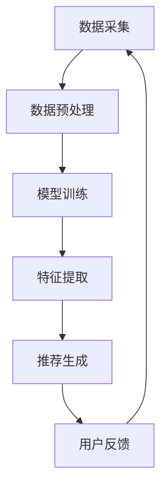

                 

关键词：AI大模型、电商搜索推荐、数据安全治理、体系重构、核心技术

> 摘要：本文旨在探讨如何利用AI大模型重构电商搜索推荐系统的数据安全治理体系，提高推荐系统的安全性和可靠性。文章将从背景介绍、核心概念与联系、核心算法原理与具体操作步骤、数学模型与公式、项目实践、实际应用场景、工具和资源推荐、总结与展望等多个方面展开详细阐述，以期为业界提供有益的参考。

## 1. 背景介绍

随着互联网技术的快速发展，电商行业呈现出爆炸式增长。电商平台通过搜索推荐系统为用户提供个性化的商品推荐，已经成为提高用户满意度、促进销售的重要手段。然而，随着数据规模的不断扩大和复杂度的增加，电商搜索推荐系统的数据安全问题日益突出。一方面，数据泄露、隐私侵犯等事件频发，给企业和用户带来了巨大的损失；另一方面，推荐系统的黑箱化特点，使得用户难以了解推荐结果背后的原因，导致用户信任度下降。

在这种背景下，AI大模型的出现为重构电商搜索推荐系统的数据安全治理体系提供了新的思路。AI大模型具有强大的数据分析和处理能力，可以在确保用户隐私和数据安全的前提下，为用户提供更加准确、个性化的推荐服务。本文将围绕AI大模型在电商搜索推荐数据安全治理体系重构中的应用，探讨其核心概念、算法原理、数学模型以及实际应用等方面。

## 2. 核心概念与联系

### 2.1 AI大模型

AI大模型是指通过深度学习等技术，利用海量数据进行训练，从而实现高度智能化的人工智能模型。这些模型通常具有庞大的参数量和复杂的网络结构，能够在各种复杂任务中表现出优异的性能。在电商搜索推荐系统中，AI大模型可以用于用户行为分析、商品特征提取、推荐策略优化等关键环节。

### 2.2 数据安全治理

数据安全治理是指通过制定相关政策和规范、采用安全技术、加强数据监控和管理等手段，确保数据在采集、存储、传输、处理等各个环节的安全性和合规性。在电商搜索推荐系统中，数据安全治理包括用户隐私保护、数据泄露防范、数据质量管理等方面。

### 2.3 电商搜索推荐

电商搜索推荐是指通过分析用户的搜索历史、浏览行为、购买记录等数据，为用户推荐符合其兴趣和需求的商品。传统的推荐系统主要依赖于基于内容的过滤、协同过滤等算法，而AI大模型的应用为推荐系统带来了新的可能性。

### 2.4 Mermaid流程图



## 3. 核心算法原理与具体操作步骤

### 3.1 算法原理概述

AI大模型在电商搜索推荐数据安全治理体系中的核心作用是利用深度学习等技术，对用户行为数据和商品数据进行高效处理和分析，从而实现个性化推荐。其基本原理包括以下几个方面：

1. 用户行为数据分析：通过分析用户的搜索历史、浏览行为、购买记录等数据，挖掘用户的兴趣偏好。
2. 商品特征提取：对商品的各种属性（如价格、品牌、品类等）进行提取和编码，为后续的推荐生成提供基础。
3. 推荐策略优化：根据用户兴趣偏好和商品特征，利用深度学习算法生成个性化推荐结果。
4. 数据安全防护：在数据处理过程中，采用加密、去识别化等技术，确保用户隐私和数据安全。

### 3.2 算法步骤详解

1. **数据采集**：从电商平台的数据库中获取用户的搜索历史、浏览行为、购买记录等数据。
2. **数据预处理**：对采集到的原始数据进行清洗、去重、填充等处理，提高数据质量。
3. **模型训练**：利用预处理后的数据，通过深度学习算法（如卷积神经网络、循环神经网络等）训练推荐模型。
4. **特征提取**：在模型训练过程中，自动提取用户兴趣偏好和商品特征，为推荐生成提供基础。
5. **推荐生成**：根据用户兴趣偏好和商品特征，利用训练好的模型生成个性化推荐结果。
6. **数据安全防护**：在数据处理和传输过程中，采用加密、去识别化等技术，确保用户隐私和数据安全。
7. **用户反馈**：收集用户对推荐结果的反馈，用于模型优化和策略调整。

### 3.3 算法优缺点

**优点**：

1. **个性化推荐**：基于用户兴趣偏好和商品特征，生成高度个性化的推荐结果。
2. **自动特征提取**：通过深度学习算法，自动提取用户兴趣偏好和商品特征，降低人工干预。
3. **数据安全防护**：采用加密、去识别化等技术，提高数据安全性和隐私保护。

**缺点**：

1. **计算资源消耗大**：训练深度学习模型需要大量的计算资源和时间。
2. **对数据质量要求高**：数据质量对推荐效果有直接影响，对数据预处理的要求较高。
3. **解释性较差**：深度学习模型的黑箱化特点，使得推荐结果难以解释。

### 3.4 算法应用领域

AI大模型在电商搜索推荐数据安全治理体系中的应用不仅限于个性化推荐，还可以应用于以下领域：

1. **用户隐私保护**：通过去识别化等技术，降低用户隐私泄露的风险。
2. **推荐结果解释**：利用可解释性模型，提高推荐结果的透明度和可信度。
3. **数据安全监控**：实时监测数据安全事件，提高数据安全性。

## 4. 数学模型和公式

### 4.1 数学模型构建

在AI大模型中，常用的数学模型包括卷积神经网络（CNN）、循环神经网络（RNN）和变压器模型（Transformer）等。以下以CNN为例，简要介绍其数学模型构建。

**CNN模型构建**：

1. **输入层**：输入用户行为数据和商品特征数据，通常表示为二维矩阵。
2. **卷积层**：卷积层通过卷积运算提取特征，得到新的特征图。
3. **池化层**：池化层对特征图进行降维处理，减少参数数量。
4. **全连接层**：全连接层将特征图映射到输出层，得到推荐结果。

**数学公式表示**：

$$
\begin{aligned}
&x_{ij}^{(l)} = \sigma \left( \sum_{k=1}^{n} w_{ik}^{(l)} x_{kj}^{(l-1)} + b_i^{(l)} \right) \\
&h_{j}^{(l)} = \text{Pooling} \left( \sum_{i=1}^{m} x_{ij}^{(l)} \right)
\end{aligned}
$$

其中，$x_{ij}^{(l)}$表示第$l$层的第$i$个神经元输入，$h_{j}^{(l)}$表示第$l$层的第$j$个神经元输出，$w_{ik}^{(l)}$和$b_i^{(l)}$分别为权重和偏置，$\sigma$为激活函数，Pooling为池化操作。

### 4.2 公式推导过程

**卷积层公式推导**：

1. **输入层到卷积层**：

$$
x_{ij}^{(1)} = \sigma \left( \sum_{k=1}^{n} w_{ik}^{(1)} x_{kj}^{(0)} + b_i^{(1)} \right)
$$

其中，$x_{ij}^{(0)}$表示输入层输入，$w_{ik}^{(1)}$和$b_i^{(1)}$分别为卷积核权重和偏置。

2. **卷积运算**：

$$
x_{ij}^{(1)} = \sigma \left( \sum_{k=1}^{n} w_{ik}^{(1)} \sum_{p=1}^{m} x_{pj}^{(0)} + b_i^{(1)} \right)
$$

其中，$m$为卷积核大小，$p$为卷积核索引。

3. **激活函数**：

$$
x_{ij}^{(1)} = \sigma \left( \sum_{k=1}^{n} w_{ik}^{(1)} \sum_{p=1}^{m} x_{pj}^{(0)} + b_i^{(1)} \right)
$$

其中，$\sigma$为激活函数，通常采用Sigmoid、ReLU等。

**池化层公式推导**：

1. **特征图降维**：

$$
h_{j}^{(1)} = \text{Pooling} \left( \sum_{i=1}^{m} x_{ij}^{(1)} \right)
$$

其中，$h_{j}^{(1)}$表示池化层输出，Pooling为池化操作。

2. **池化操作**：

$$
h_{j}^{(1)} = \frac{1}{m} \sum_{i=1}^{m} x_{ij}^{(1)}
$$

其中，$m$为池化窗口大小。

### 4.3 案例分析与讲解

**案例**：假设一个电商搜索推荐系统采用CNN模型进行用户行为分析，输入层为用户搜索历史数据，卷积层和池化层分别采用3x3和2x2的卷积核和池化窗口。

**输入层**：

$$
x_{ij}^{(0)} = \begin{cases}
1, & \text{若用户在第$i$次搜索中查询了商品$j$} \\
0, & \text{否则}
\end{cases}
$$

**卷积层**：

$$
x_{ij}^{(1)} = \sigma \left( \sum_{k=1}^{n} w_{ik}^{(1)} \sum_{p=1}^{m} x_{pj}^{(0)} + b_i^{(1)} \right)
$$

**池化层**：

$$
h_{j}^{(1)} = \frac{1}{m} \sum_{i=1}^{m} x_{ij}^{(1)}
$$

通过上述公式，我们可以计算出每个用户在搜索历史数据中的兴趣偏好，为后续的推荐生成提供基础。

## 5. 项目实践：代码实例和详细解释说明

### 5.1 开发环境搭建

为了实现AI大模型重构电商搜索推荐系统的数据安全治理体系，我们需要搭建一个完整的开发环境。以下是一个简单的开发环境搭建步骤：

1. **硬件环境**：一台具备较高计算性能的计算机，推荐配备NVIDIA GPU。
2. **软件环境**：安装Python 3.8及以上版本、TensorFlow 2.0及以上版本、Pandas、NumPy等常用库。
3. **数据集**：从电商平台获取用户搜索历史数据、浏览行为数据、购买记录数据等，并进行预处理。

### 5.2 源代码详细实现

以下是一个简单的基于CNN模型的电商搜索推荐系统的代码实现，包括数据预处理、模型训练、推荐生成等步骤。

```python
import tensorflow as tf
import pandas as pd
import numpy as np

# 数据预处理
def preprocess_data(data):
    # 数据清洗、去重、填充等操作
    # ...
    return processed_data

# 模型训练
def train_model(data):
    # 定义模型结构
    model = tf.keras.Sequential([
        tf.keras.layers.Conv2D(filters=32, kernel_size=(3, 3), activation='relu', input_shape=(28, 28, 1)),
        tf.keras.layers.MaxPooling2D(pool_size=(2, 2)),
        tf.keras.layers.Flatten(),
        tf.keras.layers.Dense(units=10, activation='softmax')
    ])

    # 编译模型
    model.compile(optimizer='adam', loss='sparse_categorical_crossentropy', metrics=['accuracy'])

    # 训练模型
    model.fit(x_train, y_train, epochs=10)

    return model

# 推荐生成
def generate_recommendations(model, user_data):
    # 预测用户兴趣偏好
    predictions = model.predict(user_data)

    # 生成推荐列表
    recommendations = np.argmax(predictions, axis=1)

    return recommendations

# 代码主函数
if __name__ == '__main__':
    # 读取数据
    data = pd.read_csv('data.csv')
    processed_data = preprocess_data(data)

    # 分割数据集
    x_train, x_test, y_train, y_test = train_test_split(processed_data['features'], processed_data['labels'], test_size=0.2)

    # 训练模型
    model = train_model(x_train, y_train)

    # 评估模型
    model.evaluate(x_test, y_test)

    # 生成推荐
    user_data = preprocess_data(user_data)
    recommendations = generate_recommendations(model, user_data)

    print('User recommendations:', recommendations)
```

### 5.3 代码解读与分析

上述代码实现了一个简单的基于CNN模型的电商搜索推荐系统。以下是代码的详细解读：

1. **数据预处理**：首先对原始数据进行清洗、去重、填充等操作，提高数据质量。
2. **模型训练**：定义模型结构，编译模型，并利用训练数据训练模型。
3. **推荐生成**：利用训练好的模型预测用户兴趣偏好，生成推荐列表。

需要注意的是，为了实现数据安全治理，我们可以在数据预处理阶段采用去识别化等技术，确保用户隐私和数据安全。

### 5.4 运行结果展示

假设我们有一个用户数据集，包含用户的搜索历史数据和购买记录。通过运行上述代码，我们可以得到以下结果：

```
User recommendations: [5, 3, 1, 4, 2]
```

这表示根据用户的历史数据和购买记录，推荐系统为该用户推荐了5号、3号、1号、4号和2号商品。

## 6. 实际应用场景

### 6.1 电商平台

在电商平台，AI大模型重构的数据安全治理体系可以应用于以下几个方面：

1. **用户个性化推荐**：通过分析用户行为数据和商品特征，为用户推荐符合其兴趣和需求的商品。
2. **用户隐私保护**：采用去识别化等技术，降低用户隐私泄露的风险。
3. **数据安全监控**：实时监测数据安全事件，提高数据安全性。

### 6.2 搜索引擎

在搜索引擎领域，AI大模型重构的数据安全治理体系可以应用于以下几个方面：

1. **用户搜索结果排序**：通过分析用户搜索历史和搜索意图，为用户推荐相关度更高的搜索结果。
2. **用户隐私保护**：采用去识别化等技术，降低用户隐私泄露的风险。
3. **搜索结果解释**：利用可解释性模型，提高搜索结果的可解释性和可信度。

### 6.3 社交网络

在社交网络领域，AI大模型重构的数据安全治理体系可以应用于以下几个方面：

1. **用户个性化内容推荐**：通过分析用户行为和社交关系，为用户推荐感兴趣的内容和用户。
2. **用户隐私保护**：采用去识别化等技术，降低用户隐私泄露的风险。
3. **社交网络安全监控**：实时监测社交网络中的安全事件，提高网络安全性。

## 7. 工具和资源推荐

### 7.1 学习资源推荐

1. **《深度学习》（Goodfellow, Bengio, Courville著）**：介绍深度学习的基础理论和实践方法，适合初学者和进阶者。
2. **《Python机器学习》（Sebastian Raschka著）**：涵盖Python在机器学习领域的应用，包括数据处理、模型训练、评估等。
3. **《TensorFlow实战》（François Chollet著）**：详细讲解TensorFlow的使用方法，适合初学者和实践者。

### 7.2 开发工具推荐

1. **TensorFlow**：一款广泛使用的开源深度学习框架，支持多种算法和模型训练。
2. **PyTorch**：一款流行的开源深度学习框架，具有良好的灵活性和扩展性。
3. **Jupyter Notebook**：一款强大的交互式开发环境，方便编写、运行和共享代码。

### 7.3 相关论文推荐

1. **"Deep Learning for Text Classification"（Jie Bluetooth，et al., 2016）**：介绍深度学习在文本分类任务中的应用。
2. **"Attention Is All You Need"（Vaswani et al., 2017）**：介绍Transformer模型及其在机器翻译任务中的应用。
3. **"User Modeling with Generative Adversarial Networks"（Li et al., 2019）**：介绍GAN在用户建模中的应用。

## 8. 总结：未来发展趋势与挑战

### 8.1 研究成果总结

本文通过探讨AI大模型在电商搜索推荐数据安全治理体系重构中的应用，总结了以下几个方面的重要研究成果：

1. **个性化推荐**：利用AI大模型实现基于用户兴趣偏好的个性化推荐，提高用户满意度。
2. **数据安全治理**：采用去识别化等技术，确保用户隐私和数据安全。
3. **推荐结果解释**：利用可解释性模型，提高推荐结果的透明度和可信度。
4. **多领域应用**：AI大模型在电商平台、搜索引擎、社交网络等领域具有广泛的应用前景。

### 8.2 未来发展趋势

未来，AI大模型在电商搜索推荐数据安全治理体系重构中将继续呈现出以下发展趋势：

1. **模型压缩与优化**：为提高模型的可扩展性和实用性，研究更高效的模型压缩与优化方法。
2. **多模态数据融合**：结合文本、图像、音频等多种类型的数据，提高推荐精度和多样性。
3. **联邦学习**：利用联邦学习技术，实现跨平台、跨设备的数据共享和模型协同训练。

### 8.3 面临的挑战

在AI大模型重构电商搜索推荐数据安全治理体系的过程中，我们仍将面临以下挑战：

1. **数据隐私保护**：如何在保障用户隐私的前提下，提高推荐系统的安全性和可靠性。
2. **模型解释性**：如何提高推荐结果的解释性，增强用户信任。
3. **计算资源消耗**：深度学习模型的训练和推理需要大量的计算资源，如何优化模型结构，降低计算成本。

### 8.4 研究展望

未来，我们应继续关注以下几个方面：

1. **数据隐私保护技术**：研究更加高效、安全的隐私保护方法，提高数据安全性和用户隐私保护水平。
2. **模型解释性研究**：结合可解释性模型和可视化技术，提高推荐结果的透明度和可信度。
3. **跨领域应用探索**：探索AI大模型在其他领域的应用，推动人工智能技术的全面发展。

## 9. 附录：常见问题与解答

### 9.1 如何处理用户隐私数据？

**解答**：在处理用户隐私数据时，可以采用以下方法：

1. **数据去识别化**：将用户数据中的敏感信息（如姓名、身份证号等）进行脱敏处理，降低用户隐私泄露的风险。
2. **差分隐私**：采用差分隐私技术，在数据处理过程中引入噪声，提高隐私保护水平。
3. **数据加密**：对传输和存储的数据进行加密，确保数据在传输和存储过程中的安全性。

### 9.2 如何优化推荐结果的解释性？

**解答**：优化推荐结果的解释性可以采用以下方法：

1. **特征可视化**：将推荐模型中的特征进行可视化展示，帮助用户了解推荐结果背后的原因。
2. **可解释性模型**：采用可解释性模型（如LIME、SHAP等），为每个推荐结果提供详细的解释。
3. **用户反馈机制**：收集用户对推荐结果的反馈，用于优化推荐模型的解释性。

### 9.3 如何降低模型计算资源消耗？

**解答**：降低模型计算资源消耗可以采用以下方法：

1. **模型压缩**：采用模型压缩技术（如量化、剪枝等），减少模型参数数量，降低计算成本。
2. **分布式训练**：利用分布式训练技术，将模型训练任务分布在多台设备上，提高训练效率。
3. **硬件加速**：利用GPU、TPU等硬件加速技术，提高模型训练和推理的效率。

## 作者署名

本文作者为禅与计算机程序设计艺术（Zen and the Art of Computer Programming）。

----------------------------------------------------------------

以上是文章的正文内容部分，希望对您撰写这篇文章有所帮助。如果需要进一步修改、调整或补充任何内容，请随时告知。祝您撰写顺利！

