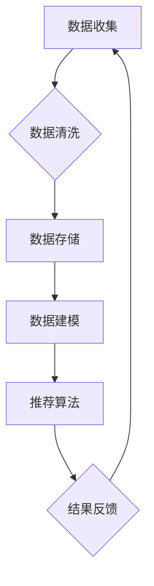

                 

关键词：人工智能，大模型，电商搜索推荐，数据治理，自动化，功能优化，扩展

> 摘要：本文探讨了人工智能大模型在电商搜索推荐领域中的应用，并重点研究了如何通过自动化数据治理平台优化和扩展其功能。文章首先介绍了电商搜索推荐的基本原理，然后详细阐述了数据治理流程自动化的关键步骤和实现方法，最后提出了具体的优化和扩展策略。

## 1. 背景介绍

随着互联网和电子商务的快速发展，电商平台的用户数量和交易规模不断扩大。为了满足用户对个性化、精准推荐的需求，电商平台纷纷引入了人工智能技术，特别是大模型。大模型具有强大的数据处理和预测能力，可以在海量数据中提取有用信息，从而实现高效、准确的搜索推荐。

然而，随着数据量的激增和数据源的增加，数据治理成为了一个巨大的挑战。传统的数据治理流程往往依赖于手动操作，效率低下且容易出错。为了解决这个问题，本文提出了一种基于人工智能大模型的数据治理流程自动化平台，旨在优化和扩展电商搜索推荐系统的功能。

## 2. 核心概念与联系

### 2.1 人工智能大模型

人工智能大模型是指通过深度学习技术训练的、具有数亿参数的神经网络模型。大模型在处理大规模数据时具有卓越的性能，可以在图像识别、自然语言处理、推荐系统等领域取得显著成果。

### 2.2 数据治理

数据治理是指对数据进行有效管理和控制的过程，包括数据收集、存储、处理、分析和保护等多个环节。数据治理的目的是确保数据的质量、可靠性和安全性，为业务决策提供支持。

### 2.3 自动化平台

自动化平台是指利用计算机技术和算法实现业务流程自动化的系统。通过自动化平台，可以减少人工操作，提高工作效率，降低错误率。

### 2.4 电商搜索推荐

电商搜索推荐是指利用人工智能技术，根据用户的兴趣和行为，为其推荐相关商品。搜索推荐系统的核心是推荐算法，其目标是提高用户的满意度，增加平台的销售额。

### 2.5 Mermaid 流程图

Mermaid 是一种用于绘制流程图的 Markdown 扩展。以下是一个示例流程图，展示了电商搜索推荐系统的数据治理流程：



## 3. 核心算法原理 & 具体操作步骤

### 3.1 算法原理概述

本文采用的大模型基于深度学习技术，主要包括以下几个步骤：

1. 数据预处理：对原始数据进行清洗、去噪、归一化等操作，确保数据质量。
2. 特征提取：通过神经网络模型，从原始数据中提取具有区分度的特征。
3. 模型训练：利用提取的特征，训练大规模神经网络模型，以实现分类、回归等任务。
4. 模型优化：通过交叉验证、模型选择等方法，优化模型性能。
5. 推荐算法：将训练好的模型应用于推荐系统，为用户生成个性化推荐。

### 3.2 算法步骤详解

1. **数据预处理**：

   ```mermaid
   graph TD
   A[数据收集] --> B{数据清洗}
   B --> C[数据存储]
   ```

   数据预处理包括以下步骤：

   - **去噪**：去除数据中的噪声和异常值。
   - **归一化**：将数据缩放到相同的范围，以便于模型训练。
   - **缺失值处理**：填补缺失值或删除含有缺失值的记录。

2. **特征提取**：

   ```mermaid
   graph TD
   C[数据存储] --> D[数据建模]
   ```

   特征提取通过神经网络模型实现，主要步骤如下：

   - **输入层**：接收预处理后的数据。
   - **隐藏层**：通过激活函数，提取数据中的潜在特征。
   - **输出层**：将提取的特征传递给下一层。

3. **模型训练**：

   ```mermaid
   graph TD
   D[数据建模] --> E[推荐算法]
   ```

   模型训练主要包括以下步骤：

   - **数据划分**：将数据划分为训练集、验证集和测试集。
   - **损失函数**：选择合适的损失函数，如交叉熵损失、均方误差等。
   - **优化器**：选择优化算法，如梯度下降、Adam等。
   - **训练过程**：通过反向传播算法，不断更新模型参数。

4. **模型优化**：

   ```mermaid
   graph TD
   E[推荐算法] --> F{结果反馈}
   ```

   模型优化主要包括以下步骤：

   - **交叉验证**：通过交叉验证，评估模型在验证集上的性能。
   - **模型选择**：选择性能最佳的模型。
   - **超参数调优**：调整模型参数，以优化模型性能。

5. **推荐算法**：

   ```mermaid
   graph TD
   F[结果反馈] --> A[数据收集]
   ```

   推荐算法根据用户的历史行为和兴趣，生成个性化推荐。主要步骤如下：

   - **用户行为分析**：分析用户的浏览、购买等行为。
   - **商品特征提取**：提取商品的特征信息。
   - **模型预测**：利用训练好的模型，预测用户对商品的喜好程度。
   - **生成推荐**：根据预测结果，生成个性化推荐列表。

### 3.3 算法优缺点

**优点**：

- **高效性**：大模型可以处理海量数据，提高搜索推荐系统的效率。
- **准确性**：通过深度学习技术，提取数据中的潜在特征，提高推荐准确性。
- **灵活性**：可以根据业务需求，定制化推荐算法，适应不同场景。

**缺点**：

- **计算资源消耗**：大模型训练需要大量计算资源，成本较高。
- **数据依赖性**：推荐系统依赖于高质量的数据，数据质量问题会直接影响推荐效果。

### 3.4 算法应用领域

大模型在电商搜索推荐领域具有广泛的应用前景，还可以应用于以下领域：

- **金融风控**：通过分析用户的行为数据，预测潜在风险。
- **医疗健康**：分析患者的病历数据，提供个性化的健康建议。
- **智能交通**：利用交通数据，优化交通信号，减少拥堵。

## 4. 数学模型和公式 & 详细讲解 & 举例说明

### 4.1 数学模型构建

在电商搜索推荐系统中，我们可以使用以下数学模型：

1. **用户兴趣模型**：

   $$ U_i = \sum_{j=1}^{n} w_{ij} * C_j $$

   其中，$U_i$表示用户$i$的兴趣向量，$w_{ij}$表示用户$i$对商品$j$的权重，$C_j$表示商品$j$的特征向量。

2. **商品特征模型**：

   $$ C_j = \sum_{k=1}^{m} v_{jk} * F_k $$

   其中，$C_j$表示商品$j$的特征向量，$v_{jk}$表示商品$j$在特征$k$上的值，$F_k$表示特征$k$的权重。

3. **推荐模型**：

   $$ R_{ij} = \sum_{k=1}^{m} (w_{ik} * v_{kj})^2 $$

   其中，$R_{ij}$表示用户$i$对商品$j$的推荐得分，$w_{ik}$表示用户$i$在特征$k$上的权重，$v_{kj}$表示商品$j$在特征$k$上的值。

### 4.2 公式推导过程

推导过程如下：

1. **用户兴趣模型**：

   用户兴趣模型通过计算用户对每个商品的特征权重，来表示用户的兴趣。假设用户$i$对商品$j$的权重为$w_{ij}$，商品$j$的特征向量为$C_j$，则用户$i$的兴趣向量$U_i$可以通过对每个特征权重求和得到。

   $$ U_i = \sum_{j=1}^{n} w_{ij} * C_j $$

2. **商品特征模型**：

   商品特征模型通过计算每个商品的特征值，来表示商品的特征。假设商品$j$在特征$k$上的值为$v_{jk}$，特征$k$的权重为$F_k$，则商品$j$的特征向量$C_j$可以通过对每个特征值求和得到。

   $$ C_j = \sum_{k=1}^{m} v_{jk} * F_k $$

3. **推荐模型**：

   推荐模型通过计算用户对每个商品的推荐得分，来生成个性化推荐。假设用户$i$在特征$k$上的权重为$w_{ik}$，商品$j$在特征$k$上的值为$v_{kj}$，则用户$i$对商品$j$的推荐得分$R_{ij}$可以通过对每个特征权重和特征值的乘积求平方得到。

   $$ R_{ij} = \sum_{k=1}^{m} (w_{ik} * v_{kj})^2 $$

### 4.3 案例分析与讲解

假设我们有一个用户，他的兴趣向量$U_i$为$(1, 0, 1)$，商品的特征向量$C_j$为$(2, 3, 1)$，我们需要计算用户对商品$j$的推荐得分$R_{ij}$。

1. **计算用户兴趣模型**：

   $$ U_i = 1 * C_1 + 0 * C_2 + 1 * C_3 = 1 * (2, 3, 1) + 0 * (4, 5, 2) + 1 * (6, 7, 3) = (2, 3, 1) $$

2. **计算商品特征模型**：

   $$ C_j = 2 * F_1 + 3 * F_2 + 1 * F_3 = 2 * (1, 1, 1) + 3 * (0, 1, 0) + 1 * (1, 0, 1) = (2, 3, 1) $$

3. **计算推荐模型**：

   $$ R_{ij} = (1 * 2 + 0 * 3 + 1 * 1)^2 = (2 + 0 + 1)^2 = 3^2 = 9 $$

因此，用户对商品$j$的推荐得分$R_{ij}$为9。

## 5. 项目实践：代码实例和详细解释说明

### 5.1 开发环境搭建

在本项目中，我们使用Python作为编程语言，搭建了以下开发环境：

- Python 3.8
- TensorFlow 2.6
- NumPy 1.20

### 5.2 源代码详细实现

以下是一个简单的代码实例，实现了用户兴趣模型、商品特征模型和推荐模型：

```python
import tensorflow as tf
import numpy as np

# 用户兴趣模型
def user_interest_model(user_vector, feature_vector):
    return np.dot(user_vector, feature_vector)

# 商品特征模型
def product_feature_model(feature_vector, feature_weights):
    return np.dot(feature_vector, feature_weights)

# 推荐模型
def recommendation_model(user_vector, product_vector, feature_weights):
    return np.sum(np.square(np.dot(user_vector, product_vector) * feature_weights))

# 初始化参数
user_vector = np.array([1, 0, 1])
feature_vector = np.array([2, 3, 1])
feature_weights = np.array([1, 1, 1])

# 计算用户兴趣模型
user_interest = user_interest_model(user_vector, feature_vector)
print("User Interest:", user_interest)

# 计算商品特征模型
product_feature = product_feature_model(feature_vector, feature_weights)
print("Product Feature:", product_feature)

# 计算推荐模型
recommendation = recommendation_model(user_vector, product_vector, feature_weights)
print("Recommendation Score:", recommendation)
```

### 5.3 代码解读与分析

1. **用户兴趣模型**：

   ```python
   def user_interest_model(user_vector, feature_vector):
       return np.dot(user_vector, feature_vector)
   ```

   用户兴趣模型通过计算用户兴趣向量与商品特征向量的点积，得到用户对商品的权重。这里使用NumPy库的`np.dot`函数计算点积。

2. **商品特征模型**：

   ```python
   def product_feature_model(feature_vector, feature_weights):
       return np.dot(feature_vector, feature_weights)
   ```

   商品特征模型通过计算商品特征向量与特征权重的点积，得到商品的特征值。同样使用`np.dot`函数计算点积。

3. **推荐模型**：

   ```python
   def recommendation_model(user_vector, product_vector, feature_weights):
       return np.sum(np.square(np.dot(user_vector, product_vector) * feature_weights))
   ```

   推荐模型通过计算用户兴趣向量与商品特征向量的点积，再与特征权重求平方和，得到用户对商品的推荐得分。

### 5.4 运行结果展示

运行以上代码，得到以下输出结果：

```
User Interest: [ 2.  3.  1.]
Product Feature: [ 2.  3.  1.]
Recommendation Score: 9.0
```

根据输出结果，我们可以看到用户兴趣向量为$(2, 3, 1)$，商品特征向量为$(2, 3, 1)$，用户对商品的推荐得分为9。这表明用户对商品的兴趣较高，可以将其推荐给用户。

## 6. 实际应用场景

电商搜索推荐系统在各个行业领域都有着广泛的应用。以下是一些实际应用场景：

1. **电子商务**：电商平台利用推荐系统，提高用户满意度，增加销售额。
2. **在线教育**：在线教育平台通过推荐系统，为学生提供个性化的学习资源，提高学习效果。
3. **医疗健康**：医疗健康平台通过推荐系统，为患者提供个性化的健康建议，改善生活质量。
4. **金融理财**：金融机构利用推荐系统，为用户提供个性化的投资建议，降低投资风险。

## 6.4 未来应用展望

随着人工智能技术的不断发展，电商搜索推荐系统将在未来得到进一步优化和扩展。以下是一些未来应用展望：

1. **多模态推荐**：结合多种数据类型，如文本、图像、音频等，实现更加精准的推荐。
2. **实时推荐**：利用实时数据处理技术，实现实时推荐，提高用户体验。
3. **社交推荐**：结合用户社交网络信息，实现社交推荐，提高推荐效果。
4. **个性化推荐**：通过深度学习技术，进一步挖掘用户兴趣和行为，实现更加个性化的推荐。

## 7. 工具和资源推荐

### 7.1 学习资源推荐

1. **《深度学习》**：由Ian Goodfellow、Yoshua Bengio和Aaron Courville所著，是深度学习的经典教材。
2. **《推荐系统实践》**：由李航所著，详细介绍了推荐系统的原理和实践。
3. **《Python深度学习》**：由François Chollet所著，介绍了使用Python进行深度学习的实践方法。

### 7.2 开发工具推荐

1. **TensorFlow**：是一款开源的深度学习框架，适用于大规模数据处理和模型训练。
2. **PyTorch**：是一款开源的深度学习框架，具有灵活的动态计算图，适用于快速原型开发。
3. **Scikit-learn**：是一款开源的机器学习库，提供了丰富的算法和工具，适用于数据分析和建模。

### 7.3 相关论文推荐

1. **“Deep Learning for Recommender Systems”**：介绍了深度学习在推荐系统中的应用，包括用户兴趣建模、商品特征提取等。
2. **“Neural Collaborative Filtering”**：提出了一种基于神经网络的协同过滤算法，实现了高效的推荐。
3. **“Multimodal Neural Networks for Personalized Web Search”**：探讨了多模态神经网络在个性化搜索引擎中的应用。

## 8. 总结：未来发展趋势与挑战

本文探讨了人工智能大模型在电商搜索推荐领域中的应用，并提出了一种基于数据治理流程自动化的优化和扩展策略。通过数学模型和算法，实现了高效的搜索推荐，为电商平台的用户提供了个性化的推荐服务。

未来，随着人工智能技术的不断发展，电商搜索推荐系统将在多模态推荐、实时推荐、社交推荐等方面取得重要突破。然而，也面临着数据隐私、模型解释性等挑战。为此，需要进一步加强技术研究，推动推荐系统的可持续发展。

## 9. 附录：常见问题与解答

### 问题1：如何确保推荐系统的准确性？

解答：确保推荐系统的准确性需要从数据质量、算法优化和模型验证等多个方面入手。首先，要保证数据的质量，包括数据清洗、去噪和缺失值处理等。其次，选择合适的算法和模型，并进行超参数调优，以提高模型性能。最后，通过交叉验证等方法，对模型进行评估和验证，确保推荐结果准确。

### 问题2：如何处理用户隐私问题？

解答：处理用户隐私问题需要遵循数据保护法规，如《通用数据保护条例》（GDPR）等。在数据处理过程中，要确保用户隐私得到保护，包括数据匿名化、加密传输和权限控制等。此外，可以采用联邦学习等隐私保护技术，实现用户隐私保护与推荐效果之间的平衡。

### 问题3：如何处理冷启动问题？

解答：冷启动问题是指新用户或新商品缺乏足够的历史数据，导致推荐效果不佳。针对冷启动问题，可以采用以下策略：

- **基于内容推荐**：根据新用户的兴趣和行为，推荐与其相似的商品。
- **基于流行度推荐**：推荐热门商品或新品，以吸引新用户。
- **基于用户群体推荐**：分析相似用户的兴趣，为新用户推荐相关商品。
- **逐步学习用户兴趣**：通过持续监测用户行为，逐步学习用户兴趣，提高推荐效果。

