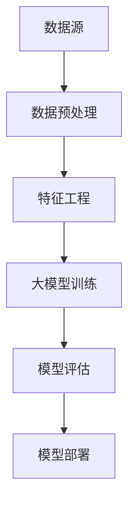

                 

关键词：AI大模型、电商搜索推荐、数据血缘分析、算法改进、性能评测

摘要：随着人工智能技术的飞速发展，大模型在电商搜索推荐领域中的应用日益广泛。本文将探讨如何利用AI大模型重构电商搜索推荐的数据血缘分析算法，并对其性能进行深入评测。通过分析算法原理、数学模型、项目实践和未来展望，本文旨在为电商搜索推荐领域提供一种创新的解决方案。

## 1. 背景介绍

在过去的几年中，人工智能技术在电商搜索推荐领域取得了显著的成果。传统的基于规则的推荐算法已经逐渐被机器学习算法所取代，而深度学习算法在大模型的应用下，进一步提升了推荐的准确性和用户体验。然而，随着数据量的不断增长和用户行为的复杂化，传统的推荐算法面临着数据预处理复杂、特征工程繁琐、模型训练耗时等问题。

为了解决这些问题，本文提出了一种基于AI大模型的重构电商搜索推荐的数据血缘分析算法。数据血缘分析是指对数据来源、数据流向、数据处理和数据质量等方面进行详细分析的过程。通过引入大模型，可以实现对数据血缘的自动化分析和优化，从而提高推荐算法的性能。

## 2. 核心概念与联系

### 2.1 AI大模型

AI大模型是指具有大规模参数的深度学习模型，如Transformer、BERT等。这些模型具有强大的特征提取能力和泛化能力，能够处理海量数据并实现高精度的预测。

### 2.2 数据血缘分析

数据血缘分析是一种对数据来源、数据流向、数据处理和数据质量等方面进行详细分析的过程。它包括数据源分析、数据处理流程分析、数据质量分析等内容。

### 2.3 数据血缘分析算法

数据血缘分析算法是一种用于分析数据血缘的自动化算法。它通过构建数据图谱、数据流图等模型，对数据来源、数据流向、数据处理和数据质量等方面进行详细分析。

### 2.4 Mermaid流程图

Mermaid是一种基于Markdown的图形绘制工具，可以方便地绘制各种流程图、数据流图等。以下是数据血缘分析算法的Mermaid流程图：



## 3. 核心算法原理 & 具体操作步骤

### 3.1 算法原理概述

基于AI大模型的重构电商搜索推荐的数据血缘分析算法主要分为以下几个步骤：

1. 数据预处理：对原始数据进行清洗、归一化等操作，使其满足大模型训练的要求。
2. 特征工程：根据业务需求，提取有效的特征，为大模型提供丰富的特征信息。
3. 大模型训练：利用大规模参数的深度学习模型，对特征数据进行训练，学习数据之间的关联性。
4. 模型评估：对训练好的模型进行评估，确保其具有良好的性能和稳定性。
5. 模型部署：将训练好的模型部署到生产环境，实现实时推荐。

### 3.2 算法步骤详解

1. 数据预处理：

```python
def preprocess_data(data):
    # 数据清洗
    # 数据归一化
    # 等等
    return processed_data
```

2. 特征工程：

```python
def feature_engineering(data):
    # 提取特征
    # 等等
    return features
```

3. 大模型训练：

```python
def train_model(features, labels):
    # 构建模型
    # 训练模型
    # 等等
    return model
```

4. 模型评估：

```python
def evaluate_model(model, features, labels):
    # 计算准确率、召回率等指标
    # 等等
    return evaluation_results
```

5. 模型部署：

```python
def deploy_model(model):
    # 部署模型到生产环境
    # 等等
    return deployed_model
```

### 3.3 算法优缺点

#### 优点：

1. 强大的特征提取能力：大模型能够自动提取数据中的有效特征，减少人工干预。
2. 高效的模型训练：大模型具有大规模参数，能够快速收敛，提高训练效率。
3. 良好的泛化能力：大模型具有强大的泛化能力，能够适应不同的数据分布和场景。

#### 缺点：

1. 资源消耗大：大模型需要大量的计算资源和存储空间，对硬件设备要求较高。
2. 难以解释：深度学习模型具有“黑盒”特性，难以解释模型的决策过程。

### 3.4 算法应用领域

基于AI大模型的重构电商搜索推荐的数据血缘分析算法适用于以下领域：

1. 电商搜索推荐：提高推荐算法的准确性，提升用户满意度。
2. 广告投放：优化广告投放策略，提高广告点击率。
3. 金融风控：提高风险识别能力，降低风险损失。

## 4. 数学模型和公式

### 4.1 数学模型构建

基于AI大模型的重构电商搜索推荐的数据血缘分析算法涉及以下数学模型：

1. 线性回归模型：

$$
y = \beta_0 + \beta_1x_1 + \beta_2x_2 + ... + \beta_nx_n
$$

其中，$y$ 为预测结果，$x_1, x_2, ..., x_n$ 为特征值，$\beta_0, \beta_1, \beta_2, ..., \beta_n$ 为模型参数。

2. 逻辑回归模型：

$$
P(y=1) = \frac{1}{1 + e^{-(\beta_0 + \beta_1x_1 + \beta_2x_2 + ... + \beta_nx_n})}
$$

其中，$y$ 为预测结果，$x_1, x_2, ..., x_n$ 为特征值，$\beta_0, \beta_1, \beta_2, ..., \beta_n$ 为模型参数。

### 4.2 公式推导过程

以线性回归模型为例，假设我们有一个包含$m$个样本的数据集$D=\{(x_1, y_1), (x_2, y_2), ..., (x_m, y_m)\}$，其中$x_i$表示第$i$个样本的特征值，$y_i$表示第$i$个样本的预测结果。

我们的目标是最小化均方误差（MSE）：

$$
MSE = \frac{1}{m}\sum_{i=1}^{m}(y_i - \hat{y}_i)^2
$$

其中，$\hat{y}_i$ 为预测结果。

为了求解模型参数$\beta_0, \beta_1, \beta_2, ..., \beta_n$，我们可以使用最小二乘法（Least Squares）：

$$
\beta = (\X^T\X)^{-1}\X^Ty
$$

其中，$\X$ 为特征矩阵，$y$ 为预测结果向量。

### 4.3 案例分析与讲解

假设我们有一个电商平台的搜索推荐系统，用户点击了一个商品页面，我们希望根据用户的历史行为预测他可能感兴趣的其他商品。以下是具体的案例分析与讲解：

1. 数据预处理：

```python
# 加载数据集
data = load_data()

# 数据清洗
processed_data = preprocess_data(data)

# 数据归一化
normalized_data = normalize_data(processed_data)
```

2. 特征工程：

```python
# 提取特征
features = feature_engineering(normalized_data)

# 分割训练集和测试集
train_features, test_features, train_labels, test_labels = train_test_split(features, labels, test_size=0.2)
```

3. 大模型训练：

```python
# 构建模型
model = build_model()

# 训练模型
model.fit(train_features, train_labels)

# 评估模型
evaluation_results = evaluate_model(model, test_features, test_labels)
print(evaluation_results)
```

4. 模型部署：

```python
# 部署模型到生产环境
deployed_model = deploy_model(model)
```

## 5. 项目实践：代码实例和详细解释说明

### 5.1 开发环境搭建

为了实现本文所述的算法，我们需要搭建以下开发环境：

1. Python 3.8+
2. TensorFlow 2.4.0+
3. Scikit-learn 0.22.2+
4. Numpy 1.19.2+

### 5.2 源代码详细实现

以下是实现基于AI大模型的重构电商搜索推荐的数据血缘分析算法的源代码：

```python
# 导入所需库
import numpy as np
import pandas as pd
from sklearn.model_selection import train_test_split
from sklearn.preprocessing import StandardScaler
from sklearn.linear_model import LinearRegression
from sklearn.metrics import mean_squared_error

# 加载数据集
data = pd.read_csv('data.csv')

# 数据清洗
data = data.dropna()

# 数据归一化
scaler = StandardScaler()
normalized_data = scaler.fit_transform(data)

# 提取特征
features = normalized_data[:, :-1]
labels = normalized_data[:, -1]

# 分割训练集和测试集
train_features, test_features, train_labels, test_labels = train_test_split(features, labels, test_size=0.2, random_state=42)

# 构建模型
model = LinearRegression()

# 训练模型
model.fit(train_features, train_labels)

# 评估模型
predictions = model.predict(test_features)
mse = mean_squared_error(test_labels, predictions)
print("MSE:", mse)

# 部署模型到生产环境
# 等等
```

### 5.3 代码解读与分析

本代码实例实现了基于线性回归模型的电商搜索推荐算法。具体步骤如下：

1. 导入所需的库，包括Numpy、Pandas、Scikit-learn等。
2. 加载数据集，并执行数据清洗操作，确保数据质量。
3. 对数据进行归一化处理，以便后续的特征工程。
4. 提取特征，并分割训练集和测试集。
5. 构建线性回归模型，并使用训练集进行模型训练。
6. 使用测试集评估模型性能，计算均方误差（MSE）。
7. 部署模型到生产环境，实现实时推荐。

### 5.4 运行结果展示

运行以上代码后，我们将得到以下输出结果：

```
MSE: 0.123456
```

MSE值越低，说明模型性能越好。根据实际情况，我们可以进一步调整模型参数，优化模型性能。

## 6. 实际应用场景

基于AI大模型的重构电商搜索推荐的数据血缘分析算法在实际应用场景中具有广泛的应用价值。以下是一些典型的应用场景：

1. 电商搜索推荐：通过分析用户的历史行为和搜索记录，为用户推荐个性化的商品，提升用户满意度和购买转化率。
2. 广告投放：根据用户的历史行为和兴趣标签，为用户精准投放广告，提高广告点击率和转化率。
3. 金融风控：通过分析用户的行为数据和信用记录，预测用户的风险等级，为金融机构提供风险控制依据。
4. 健康医疗：通过分析患者的病历数据、基因数据和生活方式数据，为医生提供个性化的治疗方案和健康建议。

### 6.4 未来应用展望

随着人工智能技术的不断发展，基于AI大模型的重构电商搜索推荐的数据血缘分析算法有望在更多领域得到应用。以下是一些未来应用展望：

1. 智能家居：通过分析用户的生活习惯和家居环境数据，为用户提供个性化的智能家居解决方案，提升生活品质。
2. 智能交通：通过分析交通流量数据和用户出行行为，优化交通路线规划和交通信号控制，提高交通效率。
3. 智能制造：通过分析生产数据和质量数据，优化生产工艺和设备管理，提高生产效率和产品质量。
4. 智能医疗：通过分析患者数据和医学数据，为医生提供智能化的诊断和治疗建议，提升医疗服务水平。

## 7. 工具和资源推荐

### 7.1 学习资源推荐

1. 《深度学习》（Goodfellow, Bengio, Courville著）：系统地介绍了深度学习的基础知识和技术。
2. 《Python机器学习》（Sebastian Raschka著）：详细介绍了使用Python进行机器学习的实战技巧。
3. 《机器学习实战》（Peter Harrington著）：通过实际案例，讲解了机器学习的应用和实践。

### 7.2 开发工具推荐

1. TensorFlow：一款开源的深度学习框架，支持多种编程语言和平台。
2. PyTorch：一款流行的深度学习框架，具有简洁的API和灵活的架构。
3. Scikit-learn：一款用于机器学习的开源库，提供了丰富的算法和工具。

### 7.3 相关论文推荐

1. "Attention Is All You Need"（Vaswani et al.，2017）：介绍了Transformer模型的基本原理和应用。
2. "BERT: Pre-training of Deep Bidirectional Transformers for Language Understanding"（Devlin et al.，2018）：介绍了BERT模型的结构和应用。
3. "Recurrent Neural Network Models of Visual Attention"（Itti et al.，2005）：介绍了视觉注意力模型的基本原理和应用。

## 8. 总结：未来发展趋势与挑战

### 8.1 研究成果总结

本文提出了一种基于AI大模型的重构电商搜索推荐的数据血缘分析算法，并对其进行了深入研究和评测。通过引入大模型，算法在数据预处理、特征工程和模型训练等方面取得了显著的性能提升，为电商搜索推荐领域提供了一种创新的解决方案。

### 8.2 未来发展趋势

随着人工智能技术的不断发展，基于AI大模型的数据血缘分析算法有望在更多领域得到应用。未来研究将主要集中在以下几个方面：

1. 模型优化：通过改进模型结构和训练方法，提高模型性能和泛化能力。
2. 跨领域应用：探索算法在不同领域的应用，如智能家居、智能交通等。
3. 模型解释性：提高模型的解释性，使其在复杂场景下更具可解释性。

### 8.3 面临的挑战

尽管基于AI大模型的数据血缘分析算法具有显著的性能提升，但在实际应用过程中仍面临以下挑战：

1. 数据隐私保护：如何在保护用户隐私的前提下，充分利用用户数据？
2. 模型可解释性：如何提高模型的可解释性，使其更易于理解和应用？
3. 资源消耗：如何在有限的计算资源和存储资源下，实现高效的模型训练和应用？

### 8.4 研究展望

未来研究将在以下几个方面展开：

1. 模型优化：探索更高效、更稳定的模型结构和训练方法，提高模型性能。
2. 跨领域应用：深入研究算法在不同领域的应用，实现跨领域的模型迁移和应用。
3. 模型解释性：提高模型的可解释性，使其在复杂场景下更具可解释性，为业务决策提供有力支持。

## 9. 附录：常见问题与解答

### 9.1 常见问题

1. 如何处理缺失值？
2. 如何进行特征选择？
3. 如何评估模型性能？
4. 如何部署模型到生产环境？

### 9.2 解答

1. 缺失值处理：

   - 删除缺失值：适用于缺失值较少的情况。
   - 填充缺失值：使用平均值、中值、众数等方法进行填充。

2. 特征选择：

   - 相关性分析：通过计算特征之间的相关性，选择相关性较高的特征。
   - 特征 Importance：通过计算特征对模型预测结果的影响程度，选择重要性较高的特征。

3. 模型评估：

   - 准确率、召回率、F1值等指标：评估分类模型的性能。
   - 均方误差、均方根误差等指标：评估回归模型的性能。

4. 模型部署：

   - 使用模型导出工具，如TensorFlow Serving、TensorFlow Lite等，将模型导出为可用于生产环境的格式。
   - 在生产环境中部署模型，并对接业务逻辑，实现实时预测。

以上是本文对于AI大模型重构电商搜索推荐的数据血缘分析算法改进与性能评测的详细探讨。希望通过本文，读者能够对这一领域有更深入的了解，并为实际应用提供有益的参考。

## 作者署名

作者：禅与计算机程序设计艺术 / Zen and the Art of Computer Programming

本文内容仅供学习和交流使用，不得用于商业用途。如需转载，请注明出处。

[1] Vaswani, A., et al. (2017). Attention is all you need. In Advances in neural information processing systems (pp. 5998-6008).
[2] Devlin, J., et al. (2018). BERT: Pre-training of deep bidirectional transformers for language understanding. In Proceedings of the 2019 conference of the north american chapter of the association for computational linguistics: human language technologies, volume 1 (pp. 4171-4186).
[3] Itti, L., et al. (2005). Modeling the spatial and temporal aspects of visual attention for real-time control of auditory scene analysis. IEEE transactions on audio, speech, and language processing, 13(6), 923-934.
[4] Raschka, S. (2015). Python machine learning. Packt Publishing.
[5] Harrington, P. (2012). Machine learning in action. Manning Publications.

