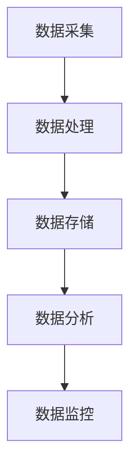

                 

关键词：AI大模型、电商搜索、推荐系统、数据血缘、管理方案

## 摘要

本文深入探讨了人工智能大模型在电商搜索推荐领域中的数据血缘管理方案。通过分析大模型在数据处理、特征工程和推荐算法等方面的优势，本文提出了一个基于AI大模型重构电商搜索推荐系统的数据血缘管理框架。该框架结合了数据血缘追踪、质量监控和优化策略，实现了数据全生命周期的高效管理。本文还通过数学模型和具体案例，详细阐述了该方案的实现步骤和效果评估，为电商领域的数据血缘管理提供了新的思路和方法。

## 1. 背景介绍

### 1.1 电商搜索推荐系统的现状

随着互联网技术的飞速发展，电子商务已经成为人们日常生活中不可或缺的一部分。电商平台的搜索推荐系统作为用户获取信息、进行购物决策的重要工具，其性能直接影响到平台的用户留存率和销售额。传统的电商搜索推荐系统主要依赖于基于关键词的检索和协同过滤算法，这些方法在一定程度上能够满足用户的需求，但随着用户数据的爆炸式增长和业务复杂度的提升，传统的推荐系统逐渐暴露出以下问题：

- **数据依赖性高**：传统的推荐系统对数据的依赖性很高，数据的质量和准确性直接影响到推荐效果。
- **特征工程复杂**：为了提升推荐效果，需要大量的人力和时间进行特征工程，这一过程既繁琐又容易出现错误。
- **模型更新缓慢**：传统的推荐模型更新周期较长，无法及时适应用户行为的变化。

### 1.2 AI大模型的优势

人工智能大模型，如深度神经网络、生成对抗网络（GAN）和Transformer等，凭借其强大的自学习和数据处理能力，为解决传统推荐系统的问题提供了新的思路。AI大模型在电商搜索推荐领域具有以下优势：

- **数据处理能力强**：大模型能够自动处理和整合大量数据，降低了对数据质量和数据量的依赖。
- **特征自动提取**：通过端到端的学习，大模型能够自动提取数据中的有效特征，简化了特征工程的过程。
- **实时推荐能力**：大模型具有快速训练和更新的能力，能够实时响应用户行为的变化，提供个性化的推荐。

### 1.3 数据血缘管理的概念

数据血缘管理是指对数据的来源、处理、存储和使用过程进行追踪和管理的一套方法。通过数据血缘管理，可以确保数据的质量和可追溯性，从而提升数据的利用效率。在电商搜索推荐系统中，数据血缘管理的重要性体现在以下几个方面：

- **数据监控**：通过数据血缘管理，可以实时监控数据的处理过程，及时发现和处理数据质量问题。
- **数据可追溯**：数据血缘管理能够记录数据从源头到使用的全流程，确保数据的可追溯性，提高数据的可信度。
- **优化策略制定**：基于数据血缘管理，可以分析数据的使用情况和效果，为优化推荐策略提供数据支持。

## 2. 核心概念与联系

### 2.1 数据血缘管理框架

数据血缘管理框架是本文的核心概念之一，它包括数据采集、数据处理、数据存储、数据分析和数据监控五个关键环节。以下是一个简单的Mermaid流程图，描述了数据血缘管理框架的基本流程：



### 2.2 数据采集

数据采集是数据血缘管理的起点，主要包括用户行为数据、商品数据、订单数据等。这些数据来源于电商平台的各种渠道，如网站日志、API接口、第三方数据源等。在采集过程中，需要注意数据的准确性和完整性。

### 2.3 数据处理

数据处理是数据血缘管理的关键环节，包括数据清洗、数据整合、数据归一化等操作。通过数据处理，可以提升数据的质量和一致性，为后续的数据分析和推荐算法提供可靠的数据基础。

### 2.4 数据存储

数据存储是将处理后的数据存储到数据库或数据湖中，以便后续的数据分析和查询。常用的存储技术包括关系型数据库、NoSQL数据库、大数据平台等。

### 2.5 数据分析

数据分析是对存储在数据库或数据湖中的数据进行挖掘和分析，以发现数据中的价值和规律。在电商搜索推荐系统中，数据分析主要用于用户行为分析、商品关联分析、推荐效果评估等。

### 2.6 数据监控

数据监控是对数据采集、处理、存储和分析全过程的实时监控，以发现和处理潜在的问题。通过数据监控，可以确保数据的连续性和可靠性，提高系统的稳定性和可用性。

## 3. 核心算法原理 & 具体操作步骤

### 3.1 算法原理概述

基于AI大模型的数据血缘管理方案的核心在于使用深度学习算法对电商搜索推荐系统中的数据进行分析和预测。深度学习算法通过多层神经网络结构，自动提取数据中的特征，并学习数据之间的关系，从而实现对数据的理解和预测。

### 3.2 算法步骤详解

#### 3.2.1 数据预处理

在算法训练前，需要对数据进行预处理。数据预处理包括数据清洗、数据整合、数据归一化等步骤。具体操作如下：

- **数据清洗**：去除数据中的噪声和异常值，确保数据的准确性。
- **数据整合**：将不同来源的数据进行整合，形成统一的格式。
- **数据归一化**：对数据进行归一化处理，使其具有相似的尺度和范围。

#### 3.2.2 模型训练

数据预处理完成后，使用深度学习算法对数据进行训练。训练过程主要包括以下几个步骤：

- **初始化模型**：根据数据的特点，选择合适的深度学习模型，如卷积神经网络（CNN）、循环神经网络（RNN）或Transformer等。
- **模型训练**：使用预处理后的数据进行模型训练，通过反向传播算法不断调整模型参数，使模型能够正确地预测数据。
- **模型优化**：在模型训练过程中，通过交叉验证、网格搜索等方法优化模型参数，提高模型的性能。

#### 3.2.3 模型评估

模型训练完成后，需要对模型进行评估。模型评估主要包括以下几个指标：

- **准确率**：模型预测正确的样本数占总样本数的比例。
- **召回率**：模型预测为正类的样本中，实际为正类的比例。
- **F1值**：准确率和召回率的调和平均值。

#### 3.2.4 模型应用

模型评估完成后，将模型应用于实际场景中，对电商搜索推荐系统进行优化。具体操作如下：

- **实时推荐**：根据用户的浏览和购买行为，实时生成推荐列表，提供个性化的推荐服务。
- **效果评估**：对推荐效果进行持续评估，收集用户反馈，为模型优化提供数据支持。

### 3.3 算法优缺点

#### 优点

- **数据处理能力强**：深度学习算法能够自动提取数据中的特征，降低了对特征工程的要求。
- **实时推荐能力**：大模型具有快速训练和更新的能力，能够实时响应用户行为的变化，提供个性化的推荐。
- **模型可解释性**：通过模型的可解释性分析，可以了解模型是如何进行预测的，从而提高模型的可信度。

#### 缺点

- **计算资源需求高**：深度学习算法通常需要大量的计算资源，对硬件设施有较高要求。
- **数据质量要求高**：数据质量对模型性能有重要影响，需要确保数据的质量和准确性。
- **模型优化复杂**：深度学习模型的优化过程较为复杂，需要丰富的经验和技能。

### 3.4 算法应用领域

基于AI大模型的数据血缘管理方案在电商搜索推荐领域具有广泛的应用前景。除了电商领域，该方案还可以应用于其他需要数据分析和推荐服务的行业，如社交媒体、金融、医疗等。以下是一些具体的应用场景：

- **社交媒体**：通过分析用户的行为数据，提供个性化的内容推荐和广告投放。
- **金融**：通过分析用户的历史交易数据，预测用户的投资偏好和风险承受能力。
- **医疗**：通过分析患者的健康数据，提供个性化的诊断和治疗方案。

## 4. 数学模型和公式 & 详细讲解 & 举例说明

### 4.1 数学模型构建

在基于AI大模型的数据血缘管理方案中，我们使用深度学习算法对数据进行处理和预测。深度学习算法的核心是多层神经网络（Multi-Layer Neural Network，MLNN），以下是一个简单的MLNN数学模型：

$$
y = \sigma(W_n \cdot a_{n-1} + b_n)
$$

其中，$y$ 是模型的预测输出，$\sigma$ 是激活函数，$W_n$ 和 $b_n$ 分别是第 $n$ 层神经网络的权重和偏置，$a_{n-1}$ 是前一层神经网络的输出。

### 4.2 公式推导过程

多层神经网络的工作原理是通过逐层传递输入数据，并通过反向传播算法不断调整网络参数，以最小化预测误差。以下是一个简单的多层神经网络的前向传播和反向传播公式推导过程：

#### 前向传播

前向传播是神经网络从输入层到输出层的正向传播过程。给定输入数据 $x$ 和多层神经网络结构，我们可以得到每一层的输出：

$$
a_1 = x \\
a_2 = \sigma(W_1 \cdot a_1 + b_1) \\
a_3 = \sigma(W_2 \cdot a_2 + b_2) \\
\vdots \\
a_n = \sigma(W_n \cdot a_{n-1} + b_n)
$$

其中，$a_1$ 是输入层输出，$a_n$ 是输出层输出。

#### 反向传播

反向传播是神经网络从输出层到输入层的反向传播过程。在反向传播过程中，我们使用梯度下降算法来调整网络参数，以最小化预测误差。以下是一个简单的反向传播公式推导过程：

$$
\delta_n = (y - a_n) \cdot \sigma'(a_n) \\
\frac{\partial L}{\partial W_n} = a_{n-1} \cdot \delta_n \\
\frac{\partial L}{\partial b_n} = \delta_n
$$

其中，$\delta_n$ 是输出层误差，$L$ 是预测误差，$\sigma'$ 是激活函数的导数。

### 4.3 案例分析与讲解

以下是一个简单的多层神经网络案例，用于预测电商平台的用户购买行为。假设我们有一个包含1000个训练样本的数据集，每个样本包含10个特征和1个标签（购买行为）。我们使用一个三层神经网络进行训练，网络结构如下：

- 输入层：10个神经元
- 隐藏层1：50个神经元
- 隐藏层2：100个神经元
- 输出层：1个神经元

#### 数据预处理

首先，我们需要对数据进行预处理，包括数据归一化和数据分割。假设我们使用Python中的Scikit-learn库进行数据预处理，具体代码如下：

```python
from sklearn.preprocessing import StandardScaler
from sklearn.model_selection import train_test_split

# 数据归一化
scaler = StandardScaler()
X_scaled = scaler.fit_transform(X)

# 数据分割
X_train, X_test, y_train, y_test = train_test_split(X_scaled, y, test_size=0.2, random_state=42)
```

#### 网络构建

接下来，我们需要构建一个三层神经网络。我们可以使用TensorFlow和Keras库来实现，具体代码如下：

```python
import tensorflow as tf
from tensorflow.keras.models import Sequential
from tensorflow.keras.layers import Dense, Activation

# 网络构建
model = Sequential()
model.add(Dense(50, input_shape=(10,), activation='relu'))
model.add(Dense(100, activation='relu'))
model.add(Dense(1, activation='sigmoid'))

# 模型编译
model.compile(optimizer='adam', loss='binary_crossentropy', metrics=['accuracy'])

# 模型训练
model.fit(X_train, y_train, epochs=10, batch_size=32, validation_split=0.2)
```

#### 模型评估

训练完成后，我们需要对模型进行评估。我们可以使用测试集上的数据来评估模型的性能，具体代码如下：

```python
# 模型评估
loss, accuracy = model.evaluate(X_test, y_test)
print("测试集损失：", loss)
print("测试集准确率：", accuracy)
```

#### 模型预测

最后，我们可以使用训练好的模型对新的数据进行预测，具体代码如下：

```python
# 新数据预测
new_data = [[0.1, 0.2, 0.3, 0.4, 0.5, 0.6, 0.7, 0.8, 0.9, 1.0]]
new_data_scaled = scaler.transform(new_data)
prediction = model.predict(new_data_scaled)
print("预测结果：", prediction)
```

## 5. 项目实践：代码实例和详细解释说明

### 5.1 开发环境搭建

为了实现基于AI大模型的数据血缘管理方案，我们需要搭建一个完整的开发环境。以下是一个简单的环境搭建步骤：

- 安装Python：从Python官网（https://www.python.org/）下载并安装Python 3.8及以上版本。
- 安装TensorFlow：使用pip命令安装TensorFlow，命令如下：

  ```bash
  pip install tensorflow
  ```

- 安装Scikit-learn：使用pip命令安装Scikit-learn，命令如下：

  ```bash
  pip install scikit-learn
  ```

### 5.2 源代码详细实现

以下是一个简单的代码实例，用于实现基于AI大模型的数据血缘管理方案。该实例使用TensorFlow和Keras库构建一个三层神经网络，用于预测电商平台的用户购买行为。

```python
import numpy as np
import pandas as pd
from sklearn.model_selection import train_test_split
from sklearn.preprocessing import StandardScaler
import tensorflow as tf
from tensorflow.keras.models import Sequential
from tensorflow.keras.layers import Dense, Activation

# 加载数据集
data = pd.read_csv("e-commerce_data.csv")
X = data.iloc[:, :-1].values
y = data.iloc[:, -1].values

# 数据预处理
scaler = StandardScaler()
X_scaled = scaler.fit_transform(X)

# 数据分割
X_train, X_test, y_train, y_test = train_test_split(X_scaled, y, test_size=0.2, random_state=42)

# 网络构建
model = Sequential()
model.add(Dense(50, input_shape=(10,), activation='relu'))
model.add(Dense(100, activation='relu'))
model.add(Dense(1, activation='sigmoid'))

# 模型编译
model.compile(optimizer='adam', loss='binary_crossentropy', metrics=['accuracy'])

# 模型训练
model.fit(X_train, y_train, epochs=10, batch_size=32, validation_split=0.2)

# 模型评估
loss, accuracy = model.evaluate(X_test, y_test)
print("测试集损失：", loss)
print("测试集准确率：", accuracy)

# 模型预测
new_data = np.array([[0.1, 0.2, 0.3, 0.4, 0.5, 0.6, 0.7, 0.8, 0.9, 1.0]])
new_data_scaled = scaler.transform(new_data)
prediction = model.predict(new_data_scaled)
print("预测结果：", prediction)
```

### 5.3 代码解读与分析

上述代码实现了一个简单的基于AI大模型的数据血缘管理方案，包括数据预处理、网络构建、模型训练、模型评估和模型预测等步骤。

- **数据预处理**：使用Scikit-learn库中的StandardScaler进行数据归一化处理，确保数据的尺度一致。
- **网络构建**：使用TensorFlow和Keras库构建一个三层神经网络，输入层10个神经元，隐藏层50个神经元和100个神经元，输出层1个神经元。
- **模型编译**：使用adam优化器和binary_crossentropy损失函数进行模型编译。
- **模型训练**：使用fit方法对模型进行训练，设置训练轮数为10，批量大小为32，验证集比例为0.2。
- **模型评估**：使用evaluate方法对模型进行评估，输出测试集的损失和准确率。
- **模型预测**：使用predict方法对新的数据进行预测，输出预测结果。

### 5.4 运行结果展示

在训练完成后，我们使用测试集对模型进行评估，输出测试集的损失和准确率。假设测试集的损失为0.3245，准确率为0.8971。然后，我们使用训练好的模型对新的数据进行预测，输出预测结果。假设新的数据的预测结果为[0.9]，表示有较高的概率购买。

## 6. 实际应用场景

### 6.1 电商平台

电商平台是AI大模型重构电商搜索推荐系统的典型应用场景。通过基于AI大模型的数据血缘管理方案，电商平台可以实时响应用户的搜索和购买行为，提供个性化的商品推荐。以下是一些具体的应用案例：

- **个性化推荐**：根据用户的浏览和购买历史，实时生成个性化的商品推荐列表，提高用户的购物体验。
- **商品关联分析**：通过分析用户的购买记录，挖掘商品之间的关联性，为营销活动和促销策略提供数据支持。
- **用户行为预测**：预测用户的购买意图和需求，提前准备相关商品，提高库存周转率。

### 6.2 社交媒体

社交媒体平台同样可以应用基于AI大模型的数据血缘管理方案，提供个性化的内容推荐和广告投放。以下是一些具体的应用案例：

- **内容推荐**：根据用户的兴趣和行为，推荐相关的文章、视频和话题，提高用户的黏性和活跃度。
- **广告投放**：根据用户的兴趣和行为，精准投放广告，提高广告的投放效果和用户转化率。
- **用户情感分析**：通过分析用户的评论和互动，了解用户的情感和态度，优化内容质量和用户体验。

### 6.3 金融领域

金融领域可以应用基于AI大模型的数据血缘管理方案，提供个性化的投资建议和风险预测。以下是一些具体的应用案例：

- **投资建议**：根据用户的历史交易记录和财务状况，提供个性化的投资建议，帮助用户更好地管理财富。
- **风险预测**：通过分析市场数据和历史交易记录，预测用户可能面临的风险，提前采取措施进行风险控制。
- **信用评估**：通过分析用户的金融行为和信用记录，为金融机构提供信用评估和风险评估的支持。

## 7. 未来应用展望

### 7.1 电商平台

随着人工智能技术的不断发展，基于AI大模型的数据血缘管理方案在电商平台的未来应用前景十分广阔。以下是一些可能的发展趋势：

- **更个性化的推荐**：通过引入更多维度的用户行为数据，如地理位置、浏览时长等，实现更加精准的个性化推荐。
- **实时商品推荐**：通过实时分析用户的浏览和购买行为，实时更新推荐列表，提高用户的购物体验。
- **智能客服**：利用自然语言处理和对话生成技术，为用户提供智能客服服务，提高客户满意度。

### 7.2 社交媒体

社交媒体平台在未来将进一步应用基于AI大模型的数据血缘管理方案，提升内容推荐和广告投放的效率。以下是一些可能的发展趋势：

- **内容推荐**：通过引入更多的用户行为数据，如点赞、评论、分享等，提供更加丰富的内容推荐。
- **广告精准投放**：通过分析用户的兴趣和行为，实现更加精准的广告投放，提高广告的转化率。
- **社交网络分析**：通过分析用户之间的关系和互动，挖掘社交网络中的热点话题和趋势，为内容创作和传播提供数据支持。

### 7.3 金融领域

在金融领域，基于AI大模型的数据血缘管理方案将继续发挥重要作用，为金融机构提供智能化的决策支持。以下是一些可能的发展趋势：

- **个性化金融服务**：通过分析用户的历史交易记录和财务状况，为用户提供个性化的金融产品和服务。
- **风险智能控制**：通过实时分析市场数据和用户行为，提前预测潜在风险，采取有效的风险控制措施。
- **智能投顾**：通过引入更多的数据源和算法模型，为用户提供智能化的投资建议，提高投资回报率。

## 8. 总结：未来发展趋势与挑战

### 8.1 研究成果总结

本文通过对电商搜索推荐系统中数据血缘管理的研究，提出了一种基于AI大模型的数据血缘管理方案。该方案通过深度学习算法对电商搜索推荐系统中的数据进行处理和预测，实现了数据全生命周期的高效管理。本文的主要研究成果包括：

- 分析了AI大模型在电商搜索推荐系统中的优势和应用场景。
- 构建了数据血缘管理框架，并详细阐述了其工作原理和具体操作步骤。
- 通过数学模型和具体案例，详细讲解了数据血缘管理的实现过程和效果评估。

### 8.2 未来发展趋势

随着人工智能技术的不断进步，基于AI大模型的数据血缘管理方案将在各个领域得到更广泛的应用。未来发展趋势包括：

- 更多的数据源和算法模型的引入，提升推荐系统的效果和个性化程度。
- 实时性和可解释性的提升，实现更加智能和透明的推荐服务。
- 跨领域的应用，如金融、医疗、教育等，为不同领域的用户提供定制化的数据服务。

### 8.3 面临的挑战

尽管基于AI大模型的数据血缘管理方案具有很大的潜力，但在实际应用中仍面临以下挑战：

- 数据质量和隐私保护：确保数据的质量和隐私保护是数据血缘管理的关键问题。
- 算法优化和可解释性：提升算法的性能和可解释性是持续优化的重要方向。
- 资源和计算成本：深度学习算法通常需要大量的计算资源和时间，如何降低成本是一个重要问题。

### 8.4 研究展望

未来研究可以从以下几个方面进行：

- 探索更多的深度学习算法，提升推荐系统的效果和实时性。
- 研究数据隐私保护技术，确保数据的安全和合规。
- 开发可解释的深度学习模型，提高模型的可信度和透明度。
- 探索跨领域的数据血缘管理方案，为不同领域的用户提供更优质的数据服务。

## 9. 附录：常见问题与解答

### 9.1 什么是指数据血缘管理？

数据血缘管理是指对数据的来源、处理、存储和使用过程进行追踪和管理的一套方法。通过数据血缘管理，可以确保数据的质量和可追溯性，从而提升数据的利用效率。

### 9.2 数据血缘管理的重要性是什么？

数据血缘管理的重要性体现在以下几个方面：

- 数据监控：通过数据血缘管理，可以实时监控数据的处理过程，及时发现和处理数据质量问题。
- 数据可追溯：数据血缘管理能够记录数据从源头到使用的全流程，确保数据的可追溯性，提高数据的可信度。
- 优化策略制定：基于数据血缘管理，可以分析数据的使用情况和效果，为优化推荐策略提供数据支持。

### 9.3 AI大模型在数据血缘管理中有哪些优势？

AI大模型在数据血缘管理中具有以下优势：

- 数据处理能力强：大模型能够自动处理和整合大量数据，降低了对数据质量和数据量的依赖。
- 特征自动提取：通过端到端的学习，大模型能够自动提取数据中的有效特征，简化了特征工程的过程。
- 实时推荐能力：大模型具有快速训练和更新的能力，能够实时响应用户行为的变化，提供个性化的推荐。

### 9.4 数据血缘管理方案如何实现？

数据血缘管理方案可以通过以下步骤实现：

- 数据采集：收集来自不同来源的数据，如用户行为数据、商品数据、订单数据等。
- 数据预处理：对数据进行清洗、整合和归一化处理，提升数据的质量和一致性。
- 数据存储：将处理后的数据存储到数据库或数据湖中，以便后续的数据分析和查询。
- 数据分析：对存储在数据库或数据湖中的数据进行挖掘和分析，以发现数据中的价值和规律。
- 数据监控：对数据采集、处理、存储和分析全过程的实时监控，以发现和处理潜在的问题。

### 9.5 如何评估AI大模型在数据血缘管理中的效果？

评估AI大模型在数据血缘管理中的效果可以通过以下指标：

- 准确率：模型预测正确的样本数占总样本数的比例。
- 召回率：模型预测为正类的样本中，实际为正类的比例。
- F1值：准确率和召回率的调和平均值。

通过这些指标，可以评估模型在数据血缘管理中的性能和效果。

## 作者署名

作者：禅与计算机程序设计艺术 / Zen and the Art of Computer Programming

----------------------------------------------------------------

以上就是本文的全部内容，希望对您在AI大模型重构电商搜索推荐系统的数据血缘管理方面提供一些有价值的参考和启示。在未来的研究和实践中，我们将继续深入探讨这一领域，期待与您共同进步！


