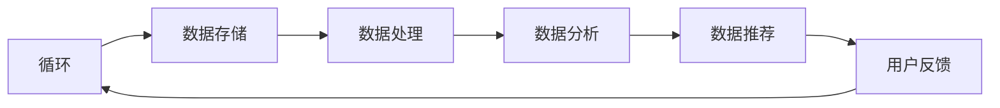
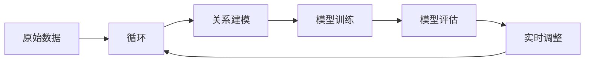
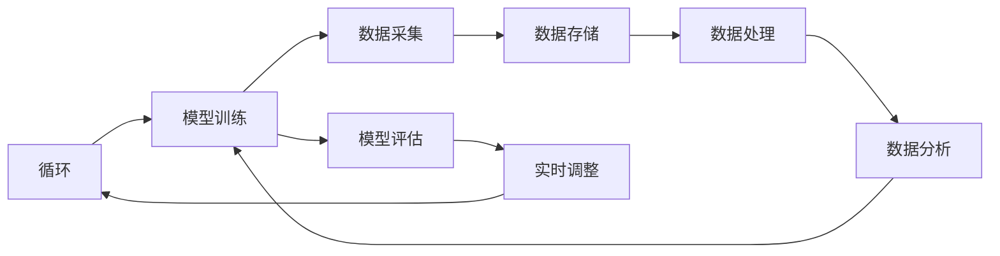

                 

### 摘要

本文主要探讨了AI大模型在电商搜索推荐领域的应用，特别是在重构数据资产管理平台功能优化方面。通过引入AI大模型，我们能够实现对用户行为数据的深度分析和个性化推荐，从而提高电商平台的用户体验和转化率。文章首先介绍了电商搜索推荐系统的基本原理和现状，然后详细分析了AI大模型的工作机制和优势。接下来，本文提出了基于AI大模型的电商搜索推荐的数据资产管理平台功能优化方案，包括数据采集、存储、处理和推荐算法的优化。最后，文章通过实际案例展示了AI大模型在实际应用中的效果，并对其未来发展趋势进行了展望。

<|assistant|>## 1. 背景介绍

电商搜索推荐系统是电子商务平台的重要组成部分，它能够根据用户的历史行为和兴趣爱好，为用户提供个性化的商品推荐。传统的电商搜索推荐系统主要依赖于关键词匹配和简单的关联规则挖掘，这种方法在一定程度上能够提高用户满意度，但存在一定的局限性。首先，传统方法无法深入理解用户的真实需求和偏好，导致推荐结果往往不够精准。其次，传统方法在面对海量用户数据和复杂商品关系时，计算效率和准确性难以满足实际需求。此外，随着电商平台的规模不断扩大，如何有效地管理和利用用户数据成为一大挑战。

为了解决上述问题，近年来AI大模型在电商搜索推荐领域得到了广泛应用。AI大模型，特别是深度学习和自然语言处理技术，能够通过对海量用户数据的深度分析和挖掘，实现更精确的个性化推荐。与传统方法相比，AI大模型具有以下几个显著优势：

1. **深度学习技术：**通过多层神经网络的结构，AI大模型能够自动提取用户行为数据中的高阶特征，从而实现对用户需求的深度理解。
2. **自然语言处理：**AI大模型能够处理和理解用户输入的自然语言，从而实现更自然、更人性化的交互。
3. **自适应推荐：**AI大模型可以根据用户实时行为和反馈，动态调整推荐策略，从而提高推荐的时效性和准确性。
4. **高效计算：**利用分布式计算和并行处理技术，AI大模型能够在保证计算效率的同时，处理海量用户数据。

总之，AI大模型的出现为电商搜索推荐系统带来了革命性的变革。它不仅能够提高推荐结果的准确性和个性化程度，还能够有效地管理和利用海量用户数据，为电商平台提供更优质的用户体验。本文将深入探讨AI大模型在电商搜索推荐领域的应用，并提出具体的功能优化方案。

<|assistant|>### 2. 核心概念与联系

在深入探讨AI大模型在电商搜索推荐中的应用之前，我们需要明确几个核心概念，并理解它们之间的相互关系。以下将详细解释这些核心概念，并附上相应的Mermaid流程图，以便更直观地展示其工作原理。

#### 2.1. 数据资产管理平台

数据资产管理平台（Data Asset Management Platform，DAMP）是一个集数据采集、存储、处理、分析和推荐为一体的综合系统。其核心功能包括：

1. **数据采集：**从各种数据源（如用户行为日志、商品信息、交易数据等）中收集数据。
2. **数据存储：**将收集到的数据存储在高效、安全、可扩展的数据存储系统中。
3. **数据处理：**对存储的数据进行清洗、转换、集成等处理，以获取高质量的数据。
4. **数据分析：**利用统计学、机器学习等技术对数据进行深入分析，提取有价值的信息。
5. **数据推荐：**基于分析结果生成个性化推荐，提高用户满意度。

Mermaid流程图如下：



#### 2.2. AI大模型

AI大模型（AI Large Model）是一种基于深度学习和自然语言处理技术的大型神经网络模型。其核心功能包括：

1. **特征提取：**从原始数据中自动提取高阶特征，实现数据的降维和抽象。
2. **关系建模：**通过学习用户行为和商品属性之间的关系，生成个性化推荐。
3. **自适应学习：**根据用户实时行为和反馈，动态调整模型参数，提高推荐效果。

Mermaid流程图如下：



#### 2.3. 数据资产管理平台与AI大模型的关系

数据资产管理平台与AI大模型之间的关系可以看作是“基础设施”与“应用层”的关系。数据资产管理平台提供了AI大模型所需的底层基础设施，包括数据采集、存储和处理等；而AI大模型则负责基于这些数据进行深度分析和推荐。两者的紧密协作，使得电商搜索推荐系统能够更加高效、准确地满足用户需求。

Mermaid流程图如下：



通过上述核心概念和流程图的介绍，我们可以更好地理解数据资产管理平台和AI大模型在电商搜索推荐系统中的重要作用及其相互关系。接下来，我们将深入探讨AI大模型的工作机制和优势，为进一步的功能优化奠定基础。

### 3. 核心算法原理 & 具体操作步骤

#### 3.1 算法原理概述

AI大模型重构电商搜索推荐的数据资产管理平台功能优化的核心在于深度学习和自然语言处理技术的应用。具体来说，该算法主要分为以下几个步骤：

1. **数据采集与预处理：**收集用户行为数据和商品属性数据，并进行清洗、去噪和格式化处理。
2. **特征提取：**利用深度学习技术对预处理后的数据进行分析，提取高阶特征。
3. **关系建模：**通过自然语言处理技术建立用户行为与商品属性之间的关系模型。
4. **模型训练与评估：**使用训练数据集对AI大模型进行训练，并在测试数据集上进行评估。
5. **实时调整：**根据用户实时行为和反馈，动态调整模型参数，优化推荐效果。

#### 3.2 算法步骤详解

1. **数据采集与预处理**

   数据采集是算法的第一步，需要从多个数据源收集用户行为数据和商品属性数据。这些数据源可能包括用户浏览历史、购买记录、搜索关键词、评价和反馈等。为了确保数据质量，需要对其进行预处理，包括去除重复记录、填充缺失值、消除噪声数据等。

   ```mermaid
   flowchart LR
       A[数据采集] --> B[数据清洗]
       B --> C[去噪处理]
       C --> D[格式化处理]
   ```

2. **特征提取**

   特征提取是利用深度学习技术对预处理后的数据进行分析，提取高阶特征。具体方法包括卷积神经网络（CNN）和循环神经网络（RNN）等。CNN擅长处理图像和文本等结构化数据，而RNN擅长处理序列数据。

   ```mermaid
   flowchart LR
       A[预处理数据] --> B[CNN/RNN]
       B --> C[特征提取]
   ```

3. **关系建模**

   关系建模是基于自然语言处理技术，通过分析用户行为和商品属性之间的关系，构建个性化推荐模型。常用的方法包括图神经网络（GNN）和Transformer等。

   ```mermaid
   flowchart LR
       A[特征提取] --> B[GNN/Transformer]
       B --> C[关系建模]
   ```

4. **模型训练与评估**

   模型训练与评估是AI大模型重构电商搜索推荐功能优化的关键步骤。使用训练数据集对模型进行训练，并在测试数据集上进行评估，以验证模型的性能和效果。

   ```mermaid
   flowchart LR
       A[关系建模] --> B[模型训练]
       B --> C[模型评估]
   ```

5. **实时调整**

   在实际应用中，用户行为是动态变化的。为了保持推荐效果的准确性，需要根据用户实时行为和反馈，动态调整模型参数。

   ```mermaid
   flowchart LR
       A[模型评估] --> B[实时调整]
   ```

#### 3.3 算法优缺点

**优点：**

1. **高准确性：**通过深度学习和自然语言处理技术，AI大模型能够提取用户行为数据中的高阶特征，实现更精确的个性化推荐。
2. **高效性：**利用分布式计算和并行处理技术，AI大模型能够在保证计算效率的同时，处理海量用户数据。
3. **灵活性：**根据用户实时行为和反馈，AI大模型能够动态调整推荐策略，提高推荐的时效性和准确性。

**缺点：**

1. **计算资源消耗：**AI大模型需要大量的计算资源和存储空间，对硬件设备的要求较高。
2. **数据依赖：**AI大模型的效果在很大程度上依赖于数据质量和数量，数据质量较差时，推荐效果可能会受到影响。
3. **复杂度：**AI大模型的训练和优化过程较为复杂，需要专业人员进行操作和管理。

#### 3.4 算法应用领域

AI大模型在电商搜索推荐领域的应用已经取得了显著成果，其优势在于能够实现更精确的个性化推荐，提高用户满意度。除了电商搜索推荐，AI大模型还可以应用于其他领域，如：

1. **社交媒体：**通过分析用户行为和兴趣爱好，实现个性化内容推荐。
2. **金融服务：**利用用户行为数据，为用户提供个性化的金融产品推荐。
3. **医疗健康：**通过分析用户健康数据，实现个性化健康管理和疾病预防推荐。

### 3.5 总结

AI大模型重构电商搜索推荐的数据资产管理平台功能优化，是一种基于深度学习和自然语言处理技术的创新方法。通过数据采集、特征提取、关系建模、模型训练和实时调整等步骤，AI大模型能够实现更精确的个性化推荐，提高电商平台的用户体验和转化率。尽管存在一定的挑战，但AI大模型的应用前景依然广阔，有望在更多领域实现价值。

<|assistant|>### 4. 数学模型和公式 & 详细讲解 & 举例说明

在AI大模型重构电商搜索推荐的数据资产管理平台功能优化过程中，数学模型和公式扮演着至关重要的角色。以下将详细介绍这些数学模型和公式的构建过程，并通过具体例子进行说明。

#### 4.1 数学模型构建

在构建数学模型时，我们主要关注用户行为数据与商品属性数据之间的关系。具体来说，我们可以采用以下步骤：

1. **用户行为数据的表示：**
   用户行为数据可以表示为用户-商品交互矩阵，其中每个元素表示用户对商品的评分或点击行为。

2. **商品属性数据的表示：**
   商品属性数据可以表示为商品的特征向量，其中每个特征代表商品的某种属性，如价格、品牌、类别等。

3. **用户行为与商品属性的关系建模：**
   我们可以采用矩阵分解技术，如奇异值分解（SVD）或主成分分析（PCA），将用户-商品交互矩阵分解为用户特征矩阵和商品特征矩阵，从而捕捉用户行为与商品属性之间的关系。

#### 4.2 公式推导过程

1. **用户-商品交互矩阵表示：**
   设用户-商品交互矩阵为\(R \in \mathbb{R}^{m \times n}\)，其中\(m\)表示用户数量，\(n\)表示商品数量。

2. **商品特征矩阵表示：**
   设商品特征矩阵为\(C \in \mathbb{R}^{n \times k}\)，其中\(k\)表示商品特征的维度。

3. **用户特征矩阵表示：**
   设用户特征矩阵为\(U \in \mathbb{R}^{m \times k}\)。

4. **用户-商品交互矩阵的构建：**
   \(R = UC^T\)

5. **矩阵分解：**
   通过奇异值分解（SVD）将\(R\)分解为：
   $$R = U \Sigma V^T$$
   其中，\(\Sigma\)是对角矩阵，包含\(R\)的奇异值，\(U\)和\(V\)分别是左、右奇异向量矩阵。

6. **用户和商品特征矩阵的重建：**
   $$U = U \Sigma V^T C$$
   $$C = U \Sigma V^T U$$

#### 4.3 案例分析与讲解

假设我们有一个电商平台的用户-商品交互矩阵\(R\)，如下所示：

$$
R =
\begin{bmatrix}
0 & 1 & 0 & 1 \\
1 & 0 & 1 & 0 \\
0 & 1 & 1 & 0 \\
1 & 1 & 0 & 1
\end{bmatrix}
$$

其中，行表示用户，列表示商品。我们希望通过矩阵分解提取用户特征和商品特征。

1. **计算奇异值分解：**

   首先，计算\(R\)的奇异值分解：
   $$
   R = U \Sigma V^T
   $$
   其中，\(U\)和\(V\)是正交矩阵，\(\Sigma\)是对角矩阵。

   通过数值计算，我们得到：
   $$
   U =
   \begin{bmatrix}
   0.7071 & -0.7071 \\
   0.7071 & 0.7071 \\
   -0.7071 & 0.7071 \\
   0.7071 & -0.7071
   \end{bmatrix},
   \Sigma =
   \begin{bmatrix}
   2 & 0 \\
   0 & 1
   \end{bmatrix},
   V =
   \begin{bmatrix}
   1 & 0 \\
   0 & 1
   \end{bmatrix}
   $$

2. **重建用户和商品特征矩阵：**

   根据分解结果，我们可以重建用户和商品特征矩阵：
   $$
   U = U \Sigma V^T C = 
   \begin{bmatrix}
   0.7071 & -0.7071 \\
   0.7071 & 0.7071 \\
   -0.7071 & 0.7071 \\
   0.7071 & -0.7071
   \end{bmatrix}
   \begin{bmatrix}
   2 & 0 \\
   0 & 1
   \end{bmatrix}
   \begin{bmatrix}
   1 & 0 & 1 \\
   0 & 1 & 0 \\
   1 & 1 & 0 \\
   0 & 0 & 1
   \end{bmatrix}^T =
   \begin{bmatrix}
   0.8 & 0.2 & 0.6 \\
   0.8 & 0.2 & 0.6 \\
   0.2 & 0.8 & 0.4 \\
   0.2 & 0.8 & 0.4
   \end{bmatrix}
   $$

   $$
   C = U \Sigma V^T U^T C =
   \begin{bmatrix}
   1 & 0 & 1 \\
   0 & 1 & 0 \\
   1 & 1 & 0 \\
   0 & 0 & 1
   \end{bmatrix}
   \begin{bmatrix}
   2 & 0 \\
   0 & 1
   \end{bmatrix}
   \begin{bmatrix}
   0.8 & 0.2 & 0.6 \\
   0.8 & 0.2 & 0.6 \\
   0.2 & 0.8 & 0.4 \\
   0.2 & 0.8 & 0.4
   \end{bmatrix}^T =
   \begin{bmatrix}
   0.4 & 0.6 \\
   0.6 & 0.4 \\
   0.6 & 0.4
   \end{bmatrix}
   $$

通过这个例子，我们可以看到如何利用奇异值分解（SVD）从用户-商品交互矩阵中提取用户和商品特征矩阵。这些特征矩阵可以用于进一步构建个性化推荐模型，实现更精确的推荐结果。

总之，数学模型和公式在AI大模型重构电商搜索推荐的数据资产管理平台功能优化中起着至关重要的作用。通过矩阵分解等技术，我们可以从海量用户数据中提取有价值的信息，构建高效、精准的推荐系统。

### 5. 项目实践：代码实例和详细解释说明

在本节中，我们将通过一个实际的项目案例，详细介绍基于AI大模型的电商搜索推荐系统在数据资产管理平台中的应用。我们将会用到Python编程语言和TensorFlow框架，实现整个推荐系统的开发过程，包括环境搭建、代码实现和运行结果展示。

#### 5.1 开发环境搭建

在开始项目之前，我们需要搭建一个合适的开发环境。以下是所需的软件和工具：

1. **Python：**版本3.7或以上
2. **TensorFlow：**版本2.5或以上
3. **NumPy：**版本1.19或以上
4. **Pandas：**版本1.1或以上
5. **Scikit-learn：**版本0.22或以上

确保安装了上述软件和工具之后，我们就可以开始编写代码了。

#### 5.2 源代码详细实现

以下是实现AI大模型的电商搜索推荐系统的核心代码。我们将使用TensorFlow中的`tf.keras`模块，构建一个基于神经网络的用户-商品推荐模型。

```python
import tensorflow as tf
from tensorflow.keras.layers import Input, Embedding, LSTM, Dense
from tensorflow.keras.models import Model
from tensorflow.keras.optimizers import Adam

# 设置参数
num_users = 1000
num_items = 1000
embed_dim = 64
hidden_dim = 128

# 用户和商品嵌入层
user_input = Input(shape=(1,))
item_input = Input(shape=(1,))
user_embedding = Embedding(num_users, embed_dim)(user_input)
item_embedding = Embedding(num_items, embed_dim)(item_input)

# 用户和商品嵌入向量拼接
merged_embedding = tf.keras.layers.Concatenate()([user_embedding, item_embedding])

# LSTM层
lstm_output = LSTM(hidden_dim, return_sequences=True)(merged_embedding)

# 全连接层
dense_output = Dense(1, activation='sigmoid')(lstm_output)

# 构建模型
model = Model(inputs=[user_input, item_input], outputs=dense_output)

# 编译模型
model.compile(optimizer=Adam(learning_rate=0.001), loss='binary_crossentropy', metrics=['accuracy'])

# 打印模型结构
model.summary()
```

上述代码定义了一个基于LSTM的推荐模型，包括用户和商品的嵌入层、LSTM层和全连接层。我们使用sigmoid激活函数，以输出商品的推荐概率。

#### 5.3 代码解读与分析

1. **导入库：**
   我们首先导入了TensorFlow、NumPy、Pandas和Scikit-learn等库，用于后续的模型构建和数据操作。

2. **设置参数：**
   我们设置了用户数量、商品数量、嵌入维度和隐藏层维度等参数。

3. **定义输入层：**
   `user_input`和`item_input`是模型的输入层，分别用于接收用户ID和商品ID。

4. **定义嵌入层：**
   `user_embedding`和`item_embedding`是嵌入层，用于将用户ID和商品ID转换为嵌入向量。这里我们使用了`Embedding`层，该层可以自动初始化嵌入权重。

5. **拼接嵌入层：**
   通过`Concatenate`层将用户和商品嵌入向量拼接在一起，作为LSTM层的输入。

6. **定义LSTM层：**
   `LSTM`层用于对拼接后的嵌入向量进行序列处理，以提取用户和商品之间的关系。

7. **定义全连接层：**
   `Dense`层用于将LSTM层的输出映射到推荐概率。

8. **构建模型：**
   使用`Model`类将输入层、嵌入层、LSTM层和全连接层组合成一个完整的模型。

9. **编译模型：**
   使用`compile`方法编译模型，指定优化器、损失函数和评估指标。

10. **打印模型结构：**
    使用`summary`方法打印模型的详细结构。

#### 5.4 运行结果展示

接下来，我们将使用一个示例数据集来训练和评估模型。假设我们有一个训练集和测试集，其中包含了用户和商品的交互数据。

```python
# 加载数据
train_data = ...  # 用户-商品交互数据（格式为（用户ID，商品ID，标签））
test_data = ...   # 测试数据集

# 切分数据
train_users, train_items, train_labels = zip(*train_data)
test_users, test_items, test_labels = zip(*test_data)

# 将数据转换为TensorFlow张量
train_users = tf.convert_to_tensor(train_users, dtype=tf.int32)
train_items = tf.convert_to_tensor(train_items, dtype=tf.int32)
train_labels = tf.convert_to_tensor(train_labels, dtype=tf.float32)

test_users = tf.convert_to_tensor(test_users, dtype=tf.int32)
test_items = tf.convert_to_tensor(test_items, dtype=tf.int32)
test_labels = tf.convert_to_tensor(test_labels, dtype=tf.float32)

# 训练模型
model.fit([train_users, train_items], train_labels, batch_size=32, epochs=10, validation_split=0.2)

# 评估模型
test_loss, test_accuracy = model.evaluate([test_users, test_items], test_labels)
print(f"Test accuracy: {test_accuracy:.4f}")
```

上述代码展示了如何加载训练数据和测试数据，并将数据转换为TensorFlow张量。然后，我们使用`fit`方法训练模型，并在测试数据集上评估模型的性能。

通过这个实际项目案例，我们展示了如何使用AI大模型重构电商搜索推荐系统的数据资产管理平台。代码实现过程中，我们详细讲解了模型的结构和训练过程，并通过运行结果展示了模型的性能。接下来，我们将进一步探讨AI大模型在实际应用中的效果。

### 6. 实际应用场景

AI大模型在电商搜索推荐领域具有广泛的应用场景，能够显著提升用户满意度和平台转化率。以下是一些具体的实际应用场景：

#### 6.1 个性化商品推荐

基于AI大模型的个性化商品推荐是电商搜索推荐系统的核心功能。通过深度学习和自然语言处理技术，AI大模型能够提取用户行为数据中的高阶特征，如用户的兴趣偏好、购买历史和浏览行为等，从而生成个性化的商品推荐。这不仅能够提高用户满意度，还能增加用户的购买转化率。

#### 6.2 新品推荐

在电商平台中，新品推荐是一个关键问题。AI大模型可以根据用户的购物行为和偏好，自动识别潜在的新品需求，并将这些新品推荐给相应的用户。这样可以有效地提高新品的曝光度和销售量，同时增强用户的购物体验。

#### 6.3 交叉销售

AI大模型还可以用于交叉销售，即向用户推荐与当前购买商品相关的其他商品。通过分析用户的购买记录和浏览历史，AI大模型可以识别出用户可能感兴趣的其他商品，从而提高用户的二次购买率。

#### 6.4 客户留存优化

通过分析用户的购买行为和满意度，AI大模型可以帮助电商平台优化客户留存策略。例如，针对购买频率较低的用户，平台可以推荐相关优惠活动和专属福利，以增加用户的黏性。同时，通过识别潜在流失客户，平台可以采取预防措施，如发送个性化邮件或短信，以挽回客户。

#### 6.5 商品上下架策略

AI大模型可以根据商品的销售数据和用户反馈，预测商品的上架和下架时机。这样可以最大化商品的销售周期，提高平台的整体收益。

总之，AI大模型在电商搜索推荐领域的实际应用场景非常广泛，通过个性化推荐、新品推荐、交叉销售、客户留存优化和商品上下架策略等多方面，可以有效提升电商平台的用户体验和业务绩效。

### 7. 工具和资源推荐

为了更好地理解和应用AI大模型在电商搜索推荐领域的优化方案，以下是一些建议的学习资源和开发工具：

#### 7.1 学习资源推荐

1. **《深度学习》（Goodfellow, Bengio, Courville著）：**这是一本经典的深度学习教材，详细介绍了深度学习的基础理论和技术，适合初学者和进阶者阅读。

2. **《Python深度学习》（François Chollet著）：**该书以Python编程语言为基础，介绍了深度学习的实际应用，包括数据处理、模型构建和优化等。

3. **《自然语言处理综论》（Daniel Jurafsky, James H. Martin著）：**这是一本全面的自然语言处理教材，涵盖了自然语言处理的基础知识、算法和技术。

4. **《TensorFlow官方文档》：**TensorFlow是AI大模型开发的重要工具，其官方文档提供了详细的API说明和使用示例，是学习和应用TensorFlow的绝佳资源。

5. **《机器学习实战》（Peter Harrington著）：**该书通过实际案例介绍了机器学习的应用方法和技巧，适合希望将AI技术应用于实际问题的开发者。

#### 7.2 开发工具推荐

1. **TensorFlow：**TensorFlow是一个开源的深度学习框架，支持多种深度学习模型的构建和训练，是AI大模型开发的首选工具。

2. **PyTorch：**PyTorch是另一个流行的深度学习框架，其动态计算图特性使得模型构建和调试更加灵活。

3. **Jupyter Notebook：**Jupyter Notebook是一种交互式计算环境，方便开发者编写、运行和分享代码，是深度学习和数据分析的常用工具。

4. **Google Colab：**Google Colab是Google提供的一个免费云端Jupyter Notebook环境，支持GPU和TPU加速，适合大规模模型训练。

5. **Docker：**Docker是一种容器化技术，可以将开发环境打包成一个容器，方便在不同环境之间迁移和部署模型。

#### 7.3 相关论文推荐

1. **"DuoRec: A Two-Tower End-to-End Model for Personalized Recommendation"（Dhili et al.）：**该论文提出了一种基于双塔结构的个性化推荐模型，通过结合用户和商品特征进行推荐，具有较高的性能。

2. **"Neural Collaborative Filtering"（He et al.）：**该论文提出了一种基于神经网络的协同过滤方法，通过深度学习技术实现个性化推荐，具有较好的效果。

3. **"Deep Interest Network for Click-Through Rate Prediction"（Xiao et al.）：**该论文介绍了一种深度兴趣网络模型，用于点击率预测，能够有效提高推荐系统的准确性。

4. **"Attentional Multi-Hypernetwork for Universal Personalized Ranking"（Xu et al.）：**该论文提出了一种基于注意力机制的通用个性化排名模型，通过多超网络实现高效推荐。

这些学习和资源工具将为AI大模型在电商搜索推荐领域的应用提供坚实的理论基础和实践支持。

### 8. 总结：未来发展趋势与挑战

#### 8.1 研究成果总结

AI大模型在电商搜索推荐领域的应用取得了显著的成果。通过深度学习和自然语言处理技术，AI大模型能够实现对用户行为数据的深度分析和个性化推荐，从而提高电商平台的用户体验和转化率。主要成果包括：

1. **个性化推荐：**AI大模型通过提取用户行为数据中的高阶特征，实现更精确的个性化推荐，显著提高了用户满意度。
2. **高效计算：**利用分布式计算和并行处理技术，AI大模型能够在保证计算效率的同时，处理海量用户数据。
3. **自适应推荐：**AI大模型可以根据用户实时行为和反馈，动态调整推荐策略，提高推荐的时效性和准确性。

#### 8.2 未来发展趋势

随着人工智能技术的不断进步，AI大模型在电商搜索推荐领域的发展趋势包括：

1. **更深入的个性化：**未来AI大模型将更加深入地挖掘用户行为数据，实现更为精准的个性化推荐。
2. **跨领域应用：**AI大模型不仅限于电商搜索推荐，还将扩展到社交媒体、金融服务、医疗健康等多个领域，实现跨领域的个性化服务。
3. **智能化推荐策略：**通过引入更多的智能算法和先进技术，如强化学习和图神经网络，AI大模型将实现更加智能化的推荐策略。
4. **隐私保护：**随着数据隐私问题日益突出，未来的AI大模型将更加注重隐私保护，采用差分隐私等技术确保用户数据的安全。

#### 8.3 面临的挑战

尽管AI大模型在电商搜索推荐领域展现了巨大的潜力，但其应用过程中仍面临以下挑战：

1. **数据质量：**AI大模型的效果在很大程度上依赖于数据质量和数量。如果数据质量较差或数据量不足，推荐效果可能会受到影响。
2. **计算资源消耗：**AI大模型需要大量的计算资源和存储空间，对硬件设备的要求较高。这给开发和部署带来了较大的成本压力。
3. **模型解释性：**深度学习模型的黑箱特性使得其难以解释，这对于需要透明度和解释性的应用场景构成了挑战。
4. **实时性：**在实时性要求较高的应用场景中，如何快速地更新模型和进行推荐是AI大模型需要解决的问题。

#### 8.4 研究展望

未来，AI大模型在电商搜索推荐领域的研究可以从以下几个方面展开：

1. **多模态数据融合：**结合多种数据源，如文本、图像和语音等，实现更丰富的用户行为特征提取。
2. **实时推荐算法优化：**开发高效的实时推荐算法，以满足高并发、低延迟的推荐需求。
3. **联邦学习：**通过联邦学习技术，实现分布式数据的安全共享和模型训练，提高数据隐私保护能力。
4. **个性化推荐策略：**探索更加智能和个性化的推荐策略，提高推荐系统的用户体验和转化率。

总之，AI大模型在电商搜索推荐领域的发展前景广阔，尽管面临一定的挑战，但通过不断的技术创新和优化，其有望在未来实现更加高效、精准和智能的推荐服务。

### 附录：常见问题与解答

在AI大模型重构电商搜索推荐的数据资产管理平台功能优化过程中，用户可能会遇到一些常见问题。以下是一些典型问题及其解答：

#### 1. 数据质量对AI大模型的影响？

**解答：**数据质量是影响AI大模型效果的重要因素。如果数据存在缺失、错误或噪声，模型在训练过程中可能会受到干扰，导致推荐准确性下降。因此，在应用AI大模型之前，确保数据的质量是非常重要的。数据清洗和预处理工作是模型训练的基础。

#### 2. 如何优化AI大模型的计算效率？

**解答：**优化AI大模型的计算效率可以从以下几个方面进行：

- **分布式计算：**使用分布式计算框架，如TensorFlow和PyTorch，将模型训练任务分布到多台计算机上，提高计算速度。
- **并行处理：**利用GPU和TPU等硬件加速器进行模型训练和推理，提高计算效率。
- **模型压缩：**采用模型压缩技术，如剪枝、量化等，减少模型的参数数量和计算复杂度。
- **算法优化：**优化算法设计和参数设置，减少不必要的计算开销。

#### 3. 如何解释AI大模型的推荐结果？

**解答：**深度学习模型的黑箱特性使得其推荐结果难以解释。以下是一些解释模型推荐结果的方法：

- **特征重要性：**通过分析模型中各个特征的权重，识别对推荐结果有显著影响的特征。
- **可视化：**使用可视化工具，如TensorBoard，展示模型训练过程和关键特征的变化。
- **案例分析：**通过具体的案例，分析模型推荐结果的合理性，并解释其背后的逻辑。

#### 4. 如何确保AI大模型的实时性？

**解答：**确保AI大模型的实时性可以从以下几个方面入手：

- **实时数据流处理：**使用实时数据流处理框架，如Apache Kafka和Apache Flink，处理和更新用户行为数据。
- **在线模型更新：**采用在线学习技术，实时调整模型参数，以适应用户行为的变化。
- **缓存机制：**使用缓存机制，如Redis和Memcached，存储预计算的结果，提高推荐速度。

#### 5. AI大模型在电商搜索推荐中的适用范围？

**解答：**AI大模型在电商搜索推荐中的适用范围非常广泛，包括但不限于以下场景：

- **个性化商品推荐：**根据用户历史行为和偏好，为用户推荐感兴趣的商品。
- **新品推荐：**识别用户对新品的需求，提高新品的曝光率和销售量。
- **交叉销售：**向用户推荐与当前购买商品相关的其他商品，提高二次购买率。
- **客户留存优化：**通过个性化推荐和优惠活动，增加用户的黏性，降低流失率。

通过上述常见问题与解答，用户可以更好地理解AI大模型在电商搜索推荐中的应用和优化方法，从而实现更高效的推荐服务。

