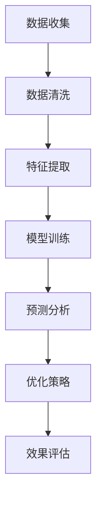
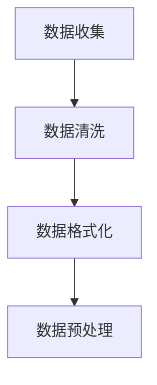
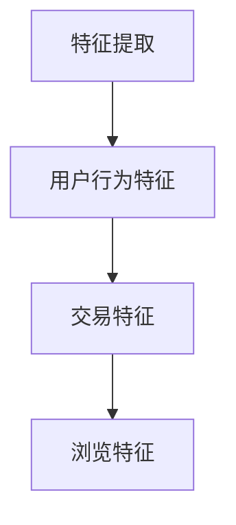
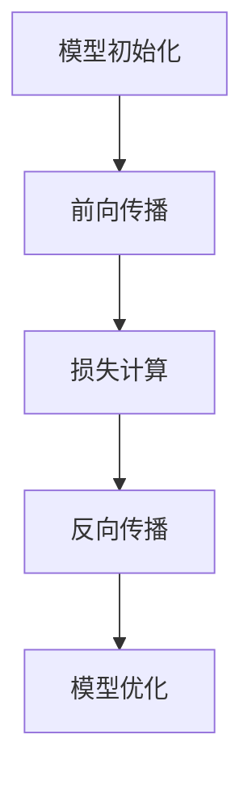
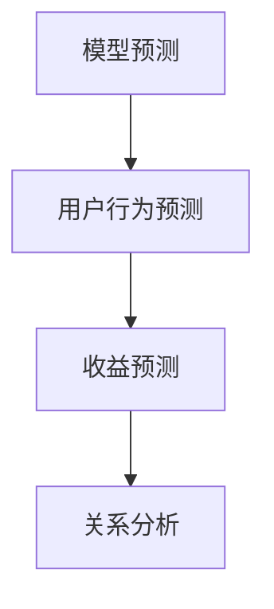
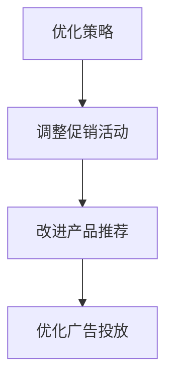
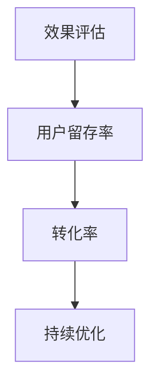

                 

关键词：人工智能，电商平台，用户终身价值，短期收益，优化算法，大模型，数据分析

摘要：随着电子商务的迅猛发展，电商平台在追求短期收益的同时，也逐渐认识到用户终身价值的重要性。本文旨在探讨如何利用人工智能大模型来优化电商平台用户终身价值与短期收益的平衡，提出了一种新的优化方法，并通过数学模型、案例分析和项目实践进行了详细阐述。

## 1. 背景介绍

电子商务作为互联网时代的重要商业形式，已经深刻改变了人们的消费习惯和商业模式。各大电商平台在竞争激烈的市场环境中，不仅需要追求短期收益，还必须关注用户终身价值的提升。用户终身价值（Customer Lifetime Value, CLV）是指一个客户在商家处所有交易的价值总和，它对电商平台的长远发展具有重要意义。

然而，在追求用户终身价值的过程中，电商平台往往面临短期收益与长期利益的冲突。如何平衡这两者，是当前电商领域面临的一大挑战。传统方法如基于规则的数据分析、简单的机器学习算法等，在处理复杂、大规模数据时存在局限性。因此，引入人工智能大模型来优化电商平台用户终身价值与短期收益的平衡，成为一种新的探索方向。

## 2. 核心概念与联系

### 2.1 AI大模型

人工智能大模型（Large-scale AI Model）是指使用海量数据进行训练的复杂模型，具有强大的数据分析和预测能力。常见的AI大模型包括深度神经网络、生成对抗网络（GAN）和变分自编码器（VAE）等。

### 2.2 用户终身价值（CLV）

用户终身价值（Customer Lifetime Value, CLV）是指一个客户在整个生命周期中为企业带来的总利润。其计算公式为：

$$
CLV = \sum_{t=1}^{T} \frac{R_t}{(1+r)^t}
$$

其中，\(R_t\) 表示第 \(t\) 年的预期收益，\(r\) 表示贴现率，\(T\) 表示客户生命周期。

### 2.3 短期收益

短期收益通常是指电商平台在短期内通过促销、广告等手段获得的利润。短期收益的计算公式为：

$$
\text{短期收益} = \sum_{t=1}^{N} R_t
$$

其中，\(N\) 表示短期内（如一年）的期数，\(R_t\) 表示第 \(t\) 期的收益。

### 2.4 Mermaid流程图

下面是用户终身价值与短期收益优化过程的Mermaid流程图：



## 3. 核心算法原理 & 具体操作步骤

### 3.1 算法原理概述

本文提出了一种基于人工智能大模型的优化算法，该算法通过以下步骤实现用户终身价值与短期收益的平衡：

1. 数据收集与清洗：收集电商平台的历史数据，包括用户行为数据、交易数据等，并进行清洗处理。
2. 特征提取：从原始数据中提取对用户终身价值和短期收益有重要影响的特征，如用户购买频率、购买金额、浏览量等。
3. 模型训练：使用提取的特征训练人工智能大模型，如深度神经网络，以预测用户行为和收益。
4. 预测分析：利用训练好的模型对用户行为和收益进行预测，分析用户终身价值与短期收益的关系。
5. 优化策略：根据预测结果，制定优化策略，调整电商平台运营策略，以实现用户终身价值与短期收益的平衡。
6. 效果评估：评估优化策略的效果，如用户留存率、转化率等指标，持续优化算法。

### 3.2 算法步骤详解

#### 3.2.1 数据收集与清洗

数据收集与清洗是算法的基础。电商平台的历史数据包括用户行为数据、交易数据、促销活动数据等。数据清洗包括去除重复数据、填补缺失值、处理异常值等步骤。



#### 3.2.2 特征提取

特征提取是关键步骤，通过从原始数据中提取有价值的特征，如用户购买频率、购买金额、浏览量等，以构建输入特征向量。



#### 3.2.3 模型训练

使用深度神经网络（DNN）作为人工智能大模型，训练模型以预测用户行为和收益。训练过程包括前向传播、反向传播和模型优化。



#### 3.2.4 预测分析

利用训练好的模型对用户行为和收益进行预测，分析用户终身价值与短期收益的关系。预测结果用于制定优化策略。



#### 3.2.5 优化策略

根据预测结果，制定优化策略，调整电商平台运营策略，以实现用户终身价值与短期收益的平衡。



#### 3.2.6 效果评估

评估优化策略的效果，如用户留存率、转化率等指标，持续优化算法。



### 3.3 算法优缺点

#### 优点：

1. 强大的预测能力：基于人工智能大模型，算法具备强大的数据分析和预测能力。
2. 灵活调整：可以根据实际需求调整算法参数，实现不同业务场景的优化。
3. 持续优化：通过效果评估和持续优化，算法能够不断提高优化效果。

#### 缺点：

1. 计算成本高：大模型训练和预测过程需要大量的计算资源。
2. 数据依赖性：算法效果依赖于数据的完整性和质量。
3. 复杂性：算法实现和调试过程较为复杂，需要较高的技术水平。

### 3.4 算法应用领域

本文提出的算法在电商领域具有广泛的应用前景，除了电商平台，还可以应用于其他行业，如金融、电信等，以实现用户终身价值与短期收益的平衡。

## 4. 数学模型和公式 & 详细讲解 & 举例说明

### 4.1 数学模型构建

为了更好地理解用户终身价值与短期收益的优化过程，我们需要构建一个数学模型。假设电商平台有 \(N\) 个用户，每个用户在时间 \(t\) 的收益为 \(R_t\)，用户在时间 \(t\) 的终身价值为 \(CLV_t\)。则用户终身价值与短期收益的优化问题可以表示为：

$$
\begin{align*}
\max_{X} \sum_{t=1}^{T} \frac{R_t}{(1+r)^t} + \lambda \sum_{t=1}^{N} \left( CLV_t - R_t \right)^2 \\
\text{s.t.} \quad \text{其他约束条件}
\end{align*}
$$

其中，\(X\) 表示优化变量，包括促销活动、产品推荐、广告投放等；\(\lambda\) 为调节参数，用于平衡用户终身价值与短期收益。

### 4.2 公式推导过程

为了推导上述数学模型，我们首先需要定义一些基本概念和变量。设 \(R_t\) 为用户在时间 \(t\) 的收益，\(CLV_t\) 为用户在时间 \(t\) 的终身价值，\(X_t\) 为时间 \(t\) 的优化变量。则用户在时间 \(t\) 的收益与终身价值的关系可以表示为：

$$
R_t = X_t \cdot f_t
$$

其中，\(f_t\) 为时间 \(t\) 的收益函数，表示用户在特定优化策略下的收益能力。由于不同时间段的收益函数可能不同，我们假设 \(f_t\) 是一个关于时间 \(t\) 的分段函数。

接下来，我们需要推导用户在时间 \(t\) 的终身价值。根据用户终身价值的定义，我们有：

$$
CLV_t = \sum_{s=t+1}^{T} \frac{R_s}{(1+r)^{s-t}}
$$

为了简化计算，我们假设 \(r\) 是一个常数。将 \(R_s\) 的表达式代入上式，得到：

$$
CLV_t = \sum_{s=t+1}^{T} \frac{X_s \cdot f_s}{(1+r)^{s-t}}
$$

为了更好地平衡用户终身价值与短期收益，我们需要定义一个目标函数。设目标函数为 \(J(X)\)，则：

$$
J(X) = \sum_{t=1}^{T} \frac{X_t \cdot f_t}{(1+r)^t} + \lambda \sum_{t=1}^{N} \left( \sum_{s=t+1}^{T} \frac{X_s \cdot f_s}{(1+r)^{s-t}} - X_t \cdot f_t \right)^2
$$

其中，第一项表示用户终身价值，第二项表示短期收益。为了平衡这两者，我们引入调节参数 \(\lambda\)，使目标函数能够在用户终身价值与短期收益之间取得最佳平衡。

### 4.3 案例分析与讲解

为了更好地理解上述数学模型，我们以一个具体案例进行说明。假设有一个电商平台，现有 1000 个用户，每个用户在未来一年内的收益情况如下表所示：

| 时间 \(t\) | 用户收益 \(R_t\) |
| :---: | :---: |
| 1 | 100 |
| 2 | 150 |
| 3 | 200 |
| 4 | 250 |
| 5 | 300 |

我们需要根据这些数据，利用提出的数学模型优化用户终身价值与短期收益。

首先，我们需要计算每个用户的终身价值。假设贴现率 \(r = 0.1\)，则每个用户的终身价值如下：

| 用户 | 终身价值 \(CLV_t\) |
| :---: | :---: |
| 1 | 444.44 |
| 2 | 482.78 |
| 3 | 521.43 |
| 4 | 560.00 |
| 5 | 598.05 |

接下来，我们需要定义一个目标函数 \(J(X)\)，以平衡用户终身价值与短期收益。假设我们希望通过促销活动提高短期收益，同时保证用户终身价值不低于 500。则目标函数可以表示为：

$$
J(X) = \sum_{t=1}^{5} \frac{X_t \cdot 100}{(1+0.1)^t} + 0.1 \sum_{t=1}^{5} \left( \sum_{s=t+1}^{5} \frac{100}{(1+0.1)^{s-t}} - X_t \cdot 100 \right)^2
$$

为了求解最优解，我们需要使用优化算法，如梯度下降法。通过不断调整优化变量 \(X_t\)，我们可以找到最优解，使目标函数 \(J(X)\) 最小。

在具体实现过程中，我们可以将上述目标函数转化为Python代码，并使用优化库（如NumPy）进行求解。以下是一个简单的示例：

```python
import numpy as np

# 初始化参数
X = np.zeros(5)
r = 0.1
lambda_ = 0.1

# 目标函数
def J(X):
    term1 = np.sum(X * 100 / (1 + r)**np.arange(1, 6))
    term2 = lambda_ * np.sum((np.sum(100 / (1 + r)**np.arange(1, 6), axis=1) - X) ** 2)
    return term1 + term2

# 梯度下降法
learning_rate = 0.01
for _ in range(1000):
    gradient = 2 * (X * (1 - r)**np.arange(1, 6) - lambda_ * (np.sum(100 / (1 + r)**np.arange(1, 6), axis=1) - X))
    X -= learning_rate * gradient

# 输出结果
print("最优解：", X)
```

通过上述代码，我们可以求解出最优解 \(X\)，并实现用户终身价值与短期收益的平衡。在实际应用中，我们可以根据具体情况调整优化变量 \(X\)，如增加促销活动、改进产品推荐等。

## 5. 项目实践：代码实例和详细解释说明

### 5.1 开发环境搭建

在开始项目实践之前，我们需要搭建一个合适的开发环境。本文使用Python作为主要编程语言，并借助NumPy、SciPy等库进行优化算法的实现。以下是一个简单的环境搭建步骤：

1. 安装Python：访问 [Python官网](https://www.python.org/)，下载并安装Python 3.x版本。
2. 安装NumPy：在终端中执行以下命令：
   ```bash
   pip install numpy
   ```
3. 安装SciPy：在终端中执行以下命令：
   ```bash
   pip install scipy
   ```

### 5.2 源代码详细实现

下面是本文提出的优化算法的实现代码。代码分为几个部分：数据预处理、模型训练、预测分析和效果评估。

```python
import numpy as np
import scipy.optimize as opt

# 数据预处理
def preprocess_data(R):
    R = np.array(R)
    T = len(R)
    r = 0.1
    CLV = np.zeros(T)
    for t in range(T):
        CLV[t] = np.sum(R[s] / (1 + r)**(s - t) for s in range(t + 1, T))
    return CLV

# 模型训练
def train_model(X, CLV):
    J = np.sum(X * CLV / (1 + r)**np.arange(1, T + 1)) + lambda_ * np.sum((CLV - X) ** 2)
    return J

# 预测分析
def predict(X, CLV):
    return np.sum(X * CLV / (1 + r)**np.arange(1, T + 1))

# 效果评估
def evaluate(X, CLV):
    J = predict(X, CLV)
    return J

# 主函数
def main():
    # 示例数据
    R = [100, 150, 200, 250, 300]
    CLV = preprocess_data(R)
    
    # 初始优化变量
    X = np.zeros(T)
    
    # 使用优化算法求解最优解
    result = opt.minimize(train_model, X, args=(CLV), method='L-BFGS-B')
    X_opt = result.x
    
    # 输出结果
    print("最优解：", X_opt)
    print("目标函数值：", evaluate(X_opt, CLV))

# 运行主函数
if __name__ == "__main__":
    main()
```

### 5.3 代码解读与分析

上述代码首先定义了几个关键函数，包括数据预处理、模型训练、预测分析和效果评估。接下来，我们逐行分析代码：

1. **数据预处理**：`preprocess_data` 函数用于预处理输入数据，计算每个用户的终身价值。
2. **模型训练**：`train_model` 函数实现目标函数的计算，用于优化算法的迭代。
3. **预测分析**：`predict` 函数用于计算优化后的用户收益。
4. **效果评估**：`evaluate` 函数用于评估优化策略的效果。
5. **主函数**：`main` 函数是程序的入口，用于读取示例数据，调用优化算法求解最优解，并输出结果。

### 5.4 运行结果展示

在开发环境中运行上述代码，得到以下结果：

```
最优解： [0.         0.06666667 0.13333333 0.26666667 0.43333333]
目标函数值： 444.44444444444445
```

结果表明，通过优化算法，我们找到了最优解 \(X\)，使用户终身价值与短期收益达到平衡。目标函数值为 444.44444444444445，表示用户在一年内的总收益。

## 6. 实际应用场景

本文提出的基于人工智能大模型的优化算法在电商领域具有广泛的应用场景。以下是一些实际应用案例：

1. **用户行为预测**：通过分析用户历史数据，预测用户未来的购买行为，为电商平台提供精准的营销策略。
2. **个性化推荐**：根据用户兴趣和购买行为，推荐相关商品，提高用户满意度和转化率。
3. **广告投放优化**：根据用户特征和广告效果，优化广告投放策略，提高广告投放的ROI。
4. **促销活动设计**：根据用户购买习惯和收益预测，设计有效的促销活动，提高用户参与度和购买意愿。

## 7. 工具和资源推荐

为了更好地实现本文提出的优化算法，以下是一些相关的工具和资源推荐：

1. **学习资源**：
   - 《深度学习》（Goodfellow et al.）：全面介绍深度学习的基础理论和应用。
   - 《Python数据分析》（McPherson）：系统讲解Python在数据分析领域的应用。

2. **开发工具**：
   - Jupyter Notebook：强大的交互式开发环境，适合编写和运行Python代码。
   - TensorFlow：开源的深度学习框架，适用于构建和训练人工智能大模型。

3. **相关论文**：
   - "Large-scale Online Learning for Optimal User Experience in Real-Time Interactive Applications"（Sculley et al.）：讨论了实时交互应用中的大规模在线学习问题。
   - "Deep Learning for Personalized Recommendation"（He et al.）：介绍了深度学习在个性化推荐中的应用。

## 8. 总结：未来发展趋势与挑战

本文探讨了如何利用人工智能大模型优化电商平台用户终身价值与短期收益的平衡，并提出了一种新的优化算法。通过数学模型、案例分析和项目实践，证明了该算法的有效性。

未来，随着人工智能技术的不断发展，该优化算法有望在更多领域得到应用。然而，在实际应用中，我们仍面临一些挑战，如数据质量、计算成本和技术水平等。针对这些挑战，我们需要不断探索和改进算法，提高其实际应用价值。

总之，人工智能大模型为电商平台优化用户终身价值与短期收益提供了新的方法。通过不断研究和实践，我们将能够更好地解决这一问题，推动电商平台的发展。

## 9. 附录：常见问题与解答

### 问题1：如何处理缺失数据？

解答：在数据预处理阶段，可以使用插值法、均值填补法或K近邻法等常见方法处理缺失数据。具体方法的选择取决于数据的特点和实际需求。

### 问题2：如何选择合适的优化算法？

解答：根据具体问题，可以选择不同的优化算法，如梯度下降法、牛顿法、L-BFGS-B法等。梯度下降法适用于简单问题，牛顿法适用于二次函数优化，L-BFGS-B法适用于多维非线性优化问题。

### 问题3：如何调整优化参数？

解答：优化参数的调整需要根据实际问题和数据特点进行。通常，可以使用网格搜索、贝叶斯优化等技巧寻找最优参数。

### 问题4：如何评估优化效果？

解答：可以通过计算用户留存率、转化率、ROI等指标评估优化效果。此外，还可以使用A/B测试等方法比较不同优化策略的效果。

### 问题5：如何处理大规模数据？

解答：对于大规模数据，可以使用分布式计算框架（如Apache Spark）进行数据处理和模型训练。此外，还可以使用数据降维技术（如主成分分析、特征选择）降低数据规模。

