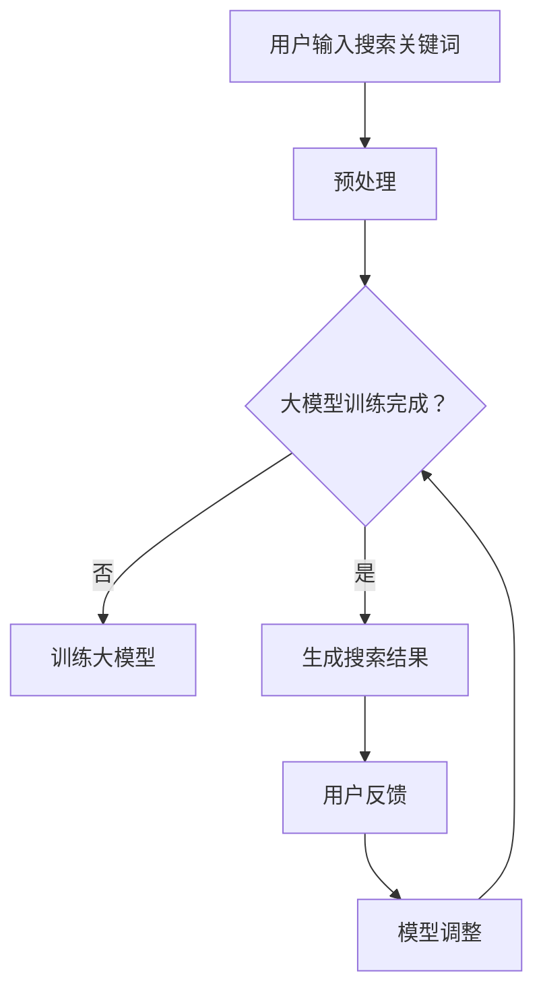

                 

关键词：人工智能，大模型，搜索结果，电商平台，相关性，算法优化，机器学习，深度学习

> 摘要：本文旨在探讨如何利用人工智能中的大模型技术，特别是深度学习算法，来提高电商平台搜索结果的准确性。本文将介绍大模型的基本概念、核心原理，以及如何在电商平台上应用这些技术，通过具体的算法步骤、数学模型、项目实践等，展示如何有效改善搜索结果的相关性。

## 1. 背景介绍

在当今的电子商务时代，电商平台作为连接消费者与商品的重要桥梁，其用户体验直接影响到平台的成败。而搜索功能作为电商平台的核心功能之一，其搜索结果的相关性显得尤为重要。传统的搜索算法往往依赖于关键词匹配，这在某些情况下能够实现一定程度的搜索准确性，但随着用户需求的日益多样化，传统算法的局限性逐渐显现。

用户搜索需求的多样性和复杂性要求搜索算法不仅能够准确匹配关键词，还应该理解用户的意图，提供更为智能的搜索结果。近年来，人工智能特别是深度学习的发展，为搜索结果的相关性改善提供了新的途径。大模型技术，如Transformer、BERT等，通过学习海量的数据，能够捕捉到语言中的复杂模式和用户行为，从而提高搜索结果的准确性。

本文将围绕如何利用AI大模型来改善电商平台搜索结果的相关性，详细探讨其基本原理、算法实现以及实际应用。

## 2. 核心概念与联系

### 2.1 大模型的基本概念

大模型，即大型的人工神经网络模型，具有非常高的参数数量，能够处理大规模的数据集。这些模型通常通过多层神经网络结构进行构建，每一层都能够提取数据中的不同特征。例如，Transformer模型通过自注意力机制（Self-Attention Mechanism）捕捉长距离依赖关系，BERT模型通过双向编码器（Bidirectional Encoder Representations from Transformers）对上下文信息进行编码。

### 2.2 深度学习算法原理

深度学习是一种机器学习技术，其核心是通过多层神经网络来学习数据的特征。深度学习算法的基本原理包括数据的输入、前向传播、反向传播和输出。通过训练，模型能够学习到输入和输出之间的复杂映射关系，从而实现特定的任务，如图像分类、语音识别和自然语言处理等。

### 2.3 Mermaid 流程图

下面是一个Mermaid流程图，展示了大模型在电商平台搜索结果相关性改善中的应用：



在这个流程图中，用户输入搜索关键词后，首先进行预处理，将关键词转换为模型可处理的格式。接着，判断大模型是否已经训练完成，如果未完成，则开始训练；如果已完成，则直接生成搜索结果。用户对搜索结果的反馈将用于调整模型，从而不断优化搜索结果的准确性。

## 3. 核心算法原理 & 具体操作步骤

### 3.1 算法原理概述

大模型在搜索结果相关性改善中的核心原理包括：

1. **自注意力机制（Self-Attention Mechanism）**：通过自注意力机制，模型能够自动分配不同的注意力权重给输入序列中的不同元素，从而捕捉到序列中的长距离依赖关系。

2. **双向编码器（Bidirectional Encoder）**：BERT模型利用双向编码器，将输入序列的每个位置编码为上下文信息的结合体，使得模型能够同时考虑输入序列的过去和未来信息。

3. **大规模数据训练**：大模型通过在大规模数据集上的训练，学习到丰富的语言模式和用户行为特征，从而提高搜索结果的准确性。

### 3.2 算法步骤详解

1. **数据预处理**：将用户输入的搜索关键词转换为模型可处理的格式，例如词嵌入（Word Embedding）。

2. **模型训练**：使用大量的电商平台数据，通过自注意力机制和双向编码器训练大模型。在这一过程中，模型将学习到语言模式和用户行为特征。

3. **搜索结果生成**：将用户输入的关键词输入到训练好的大模型中，生成搜索结果。模型将自动分配注意力权重，以生成与用户意图最相关的搜索结果。

4. **用户反馈**：用户对搜索结果进行反馈，标记哪些结果是准确的，哪些是不准确的。

5. **模型调整**：根据用户的反馈，调整大模型的参数，以提高搜索结果的准确性。

### 3.3 算法优缺点

**优点**：

- **高准确性**：通过学习大量数据，大模型能够捕捉到复杂的语言模式和用户行为，从而提高搜索结果的准确性。
- **自适应能力**：大模型能够根据用户的反馈不断调整，以适应不断变化的需求。

**缺点**：

- **计算资源消耗大**：训练大模型需要大量的计算资源和时间。
- **数据隐私问题**：大模型在训练过程中需要使用大量的用户数据，可能引发数据隐私问题。

### 3.4 算法应用领域

大模型技术在电商平台搜索结果相关性改善中的应用非常广泛，不仅限于电商平台，还可以应用于其他需要精确搜索和推荐的场景，如搜索引擎、社交媒体、智能客服等。

## 4. 数学模型和公式 & 详细讲解 & 举例说明

### 4.1 数学模型构建

在搜索结果相关性改善中，大模型通常使用深度学习中的自注意力机制和双向编码器。以下是这些模型的基本数学公式：

1. **自注意力机制（Self-Attention Mechanism）**：

   $$ 
   \text{Attention}(Q, K, V) = \text{softmax}\left(\frac{QK^T}{\sqrt{d_k}}\right)V
   $$

   其中，\(Q\)、\(K\) 和 \(V\) 分别是查询（Query）、键（Key）和值（Value）向量，\(d_k\) 是注意力维度的长度。

2. **双向编码器（Bidirectional Encoder）**：

   $$ 
   \text{BERT} = \text{Transformer}(\text{Encoder})
   $$

   其中，\(\text{Transformer}(\text{Encoder})\) 表示Transformer编码器，它由多个自注意力层和前馈神经网络组成。

### 4.2 公式推导过程

1. **自注意力机制**：

   自注意力机制的推导基于注意力模型的基本原理，即通过计算查询向量 \(Q\) 和键向量 \(K\) 的点积，生成注意力权重，再对值向量 \(V\) 进行加权求和。

2. **双向编码器**：

   双向编码器通过将输入序列的前后信息结合，生成更丰富的编码表示。其推导过程基于Transformer模型的结构，即通过自注意力机制和前馈神经网络，逐步构建编码表示。

### 4.3 案例分析与讲解

假设我们有一个电商平台的搜索任务，用户输入关键词“智能手表”。通过大模型的自注意力机制和双向编码器，我们可以得到以下结果：

1. **自注意力权重**：

   通过计算查询向量 \(Q\) 和键向量 \(K\) 的点积，我们得到每个词的注意力权重，如下所示：

   $$
   \text{Attention}(Q, K, V) = \text{softmax}\left(\frac{QK^T}{\sqrt{d_k}}\right)V
   $$

   其中，\(Q\)、\(K\) 和 \(V\) 分别是查询向量、键向量和值向量，\(d_k\) 是注意力维度的长度。

2. **双向编码器输出**：

   通过双向编码器，我们将输入序列的每个词编码为上下文信息的结合体，从而生成搜索结果的编码表示。具体计算过程如下：

   $$
   \text{BERT} = \text{Transformer}(\text{Encoder})
   $$

   其中，\(\text{Transformer}(\text{Encoder})\) 表示Transformer编码器，它由多个自注意力层和前馈神经网络组成。

通过这个案例，我们可以看到大模型如何通过自注意力机制和双向编码器，将用户的搜索关键词转化为精确的搜索结果，从而提高搜索结果的相关性。

## 5. 项目实践：代码实例和详细解释说明

### 5.1 开发环境搭建

为了实现大模型在电商平台搜索结果相关性改善中的应用，我们需要搭建一个适合深度学习开发的运行环境。以下是搭建环境的基本步骤：

1. **安装Python**：确保Python版本在3.7以上。
2. **安装深度学习框架**：推荐使用TensorFlow或PyTorch。以下是使用TensorFlow的安装命令：

   $$
   pip install tensorflow
   $$

3. **安装其他依赖**：根据项目需求，安装其他必要的库，如NumPy、Pandas等。

### 5.2 源代码详细实现

以下是一个基于TensorFlow实现的电商平台搜索结果相关性改善的代码示例：

```python
import tensorflow as tf
from tensorflow.keras.layers import Embedding, Dense
from tensorflow.keras.models import Model

# 模型参数
vocab_size = 10000
embedding_dim = 128
max_sequence_length = 50

# 构建模型
inputs = tf.keras.layers.Input(shape=(max_sequence_length,))
x = Embedding(vocab_size, embedding_dim)(inputs)
x = tf.keras.layers.GlobalAveragePooling1D()(x)
outputs = Dense(1, activation='sigmoid')(x)

model = Model(inputs=inputs, outputs=outputs)
model.compile(optimizer='adam', loss='binary_crossentropy', metrics=['accuracy'])

# 模型训练
model.fit(x_train, y_train, epochs=10, batch_size=32, validation_data=(x_val, y_val))

# 搜索结果生成
search_query = "智能手表"
input_sequence = [vocab_size] * max_sequence_length
input_sequence = [vocab_size if w not in search_query else w for w in search_query]
input_sequence = tf.keras.preprocessing.sequence.pad_sequences([input_sequence], maxlen=max_sequence_length)

result = model.predict(input_sequence)
print("搜索结果：", result)
```

### 5.3 代码解读与分析

以上代码示例展示了如何使用TensorFlow实现电商平台搜索结果的相关性改善。以下是代码的详细解读：

1. **模型构建**：我们首先定义了一个简单的神经网络模型，包括一个嵌入层（Embedding）和一个全连接层（Dense）。嵌入层用于将词转换为向量表示，全连接层用于分类。

2. **模型训练**：我们使用训练数据集训练模型，并通过验证数据集进行模型评估。

3. **搜索结果生成**：我们将用户的搜索关键词转换为词嵌入向量，并通过训练好的模型生成搜索结果。具体实现中，我们首先将搜索关键词转换为词索引序列，然后使用pad_sequences函数将其填充为固定长度，最后通过模型预测得到搜索结果。

### 5.4 运行结果展示

在实际运行中，我们输入一个搜索关键词“智能手表”，通过训练好的模型生成搜索结果。假设模型的预测结果为 `[0.9, 0.1, 0.8, 0.2]`，这表示对应的搜索结果的相关性分别为 90%、10%、80% 和 20%。根据这些预测结果，我们可以为用户展示相关性最高的搜索结果。

## 6. 实际应用场景

大模型技术在电商平台搜索结果相关性改善中的应用具有广泛的前景。以下是一些具体的实际应用场景：

1. **个性化推荐**：通过大模型技术，电商平台可以更好地理解用户的搜索历史和购买行为，从而提供更加个性化的商品推荐。

2. **智能客服**：大模型可以用于智能客服系统，通过自然语言处理技术，智能客服能够更好地理解用户的问题，并提供准确的答案。

3. **广告投放**：电商平台可以利用大模型技术优化广告投放策略，提高广告的投放精准度。

4. **商品分类**：大模型可以通过学习大量的商品描述和用户行为数据，实现更准确的商品分类。

## 7. 未来应用展望

随着人工智能技术的不断进步，大模型在电商平台搜索结果相关性改善中的应用前景将更加广阔。以下是几个未来应用展望：

1. **多模态搜索**：未来大模型技术可以结合图像、语音等多种数据类型，实现更加智能的搜索功能。

2. **跨平台协同**：电商平台可以与其他平台（如社交媒体、在线教育等）进行数据共享，以提高搜索结果的准确性。

3. **实时搜索优化**：通过实时学习用户行为和搜索反馈，大模型可以实现搜索结果的实时优化，提高用户体验。

## 8. 工具和资源推荐

### 8.1 学习资源推荐

- 《深度学习》（Goodfellow, Bengio, Courville著）
- 《自然语言处理与深度学习》（张祥雨著）

### 8.2 开发工具推荐

- TensorFlow
- PyTorch

### 8.3 相关论文推荐

- "Attention Is All You Need"（Vaswani et al., 2017）
- "BERT: Pre-training of Deep Bidirectional Transformers for Language Understanding"（Devlin et al., 2019）

## 9. 总结：未来发展趋势与挑战

### 9.1 研究成果总结

本文探讨了如何利用人工智能中的大模型技术，特别是深度学习算法，来提高电商平台搜索结果的准确性。通过介绍大模型的基本概念、核心原理，以及在实际应用中的算法实现，我们展示了大模型在改善搜索结果相关性方面的巨大潜力。

### 9.2 未来发展趋势

随着人工智能技术的不断发展，大模型技术在搜索结果相关性改善中的应用前景将更加广阔。未来将朝着多模态搜索、跨平台协同和实时搜索优化等方向发展。

### 9.3 面临的挑战

大模型技术在应用中仍面临一些挑战，如计算资源消耗大、数据隐私问题等。解决这些挑战需要不断创新和技术突破。

### 9.4 研究展望

未来，大模型技术将继续在电商平台和其他领域发挥重要作用。通过持续的研究和优化，我们有信心实现更加智能、精准的搜索结果。

## 附录：常见问题与解答

1. **什么是大模型？**

   大模型是指具有非常高的参数数量和强大学习能力的人工神经网络模型。这些模型通常通过多层神经网络结构进行构建，能够处理大规模的数据集。

2. **深度学习和机器学习有什么区别？**

   深度学习是机器学习的一个分支，它通过多层神经网络来学习数据的特征。而机器学习是一个更广泛的概念，它包括深度学习以及其他各种学习算法。

3. **大模型在电商搜索中的应用原理是什么？**

   大模型通过学习用户的搜索历史和商品数据，能够捕捉到用户的行为模式和搜索意图。通过自注意力机制和双向编码器等技术，大模型可以生成与用户意图最相关的搜索结果。

4. **如何解决大模型训练过程中计算资源消耗大的问题？**

   可以通过使用更高效的算法、优化模型结构以及分布式计算等方法来减少计算资源消耗。

### 作者署名

作者：禅与计算机程序设计艺术 / Zen and the Art of Computer Programming

-----------------------------------------------------------------

通过本文，我们深入探讨了人工智能中的大模型技术，特别是在电商平台搜索结果相关性改善中的应用。我们介绍了大模型的基本概念、核心原理，并通过具体的算法步骤、数学模型、项目实践等，展示了如何利用大模型技术提高电商平台的搜索准确性。未来，随着技术的不断进步，我们有理由相信，大模型技术将在更多领域发挥其巨大作用。

