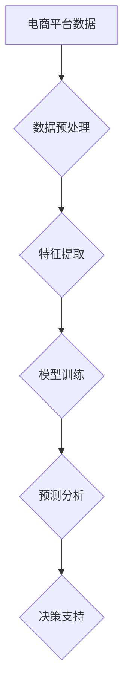

                 

关键词：人工智能，大模型，电商平台，数据分析，数据挖掘，机器学习

> 摘要：随着电商平台的迅猛发展，海量的用户行为数据和商品交易数据成为企业挖掘用户需求、提升运营效率的关键资产。本文将探讨如何利用人工智能中的大模型技术，对电商平台的数据进行深入分析，为电商企业带来新的价值。

## 1. 背景介绍

随着互联网技术的飞速发展，电商平台已经成为现代商业的重要组成部分。电商平台通过线上渠道聚集了海量的商品和用户，形成了复杂而丰富的数据网络。这些数据不仅包括用户的基本信息、浏览历史、购买记录，还包括商品的价格、销量、评价等。如何有效地挖掘和分析这些数据，成为电商企业面临的一个重大挑战。

传统的数据分析方法主要依赖于统计和机器学习算法，这些方法在处理结构化数据时效果显著，但在面对复杂、非结构化的大规模数据时，存在明显的局限性。而人工智能，特别是大模型技术的发展，为电商平台的数据分析带来了全新的机遇。

大模型，如深度学习模型，拥有强大的表达能力和自学习能力，可以通过大量的数据训练，自动发现数据中的潜在模式和规律。这使得大模型在处理复杂数据分析和预测任务时，表现出了比传统方法更高的准确性和效率。因此，本文将深入探讨如何利用大模型技术，对电商平台的数据进行高效分析，从而为企业提供数据驱动的决策支持。

## 2. 核心概念与联系

### 2.1 大模型的基本概念

大模型（Large Models）是指参数量非常大的神经网络模型，通常拥有数十亿甚至数万亿个参数。这些模型通过深度学习技术，在大量的数据上进行训练，以提取数据中的特征和模式。大模型的核心优势在于其强大的表达能力和自学习能力，能够在复杂、非结构化的数据中找到深层次的规律。

### 2.2 电商平台数据分析的挑战与机遇

电商平台的数据具有多样性、复杂性和海量性的特点，这使得传统的数据分析方法难以胜任。大模型的出现为电商数据分析带来了新的机遇：

1. **多样性**：大模型能够处理多种类型的数据，包括文本、图像、音频等，能够更好地捕捉用户的多样化需求。
2. **复杂性**：大模型具有强大的表达能力，能够处理复杂的关系和网络结构，发现数据中的深层次关系。
3. **海量性**：大模型可以通过分布式计算和增量学习，高效地处理大规模数据，提高数据分析的效率。

### 2.3 大模型在电商平台数据分析中的应用

大模型在电商平台数据分析中具有广泛的应用，包括：

1. **用户行为预测**：通过分析用户的浏览历史和购买记录，预测用户未来的购买行为和偏好。
2. **商品推荐系统**：利用用户和商品的相互作用数据，为用户推荐个性化的商品。
3. **价格优化**：通过分析市场数据和用户反馈，优化商品价格，提高销售量和利润。
4. **风险控制**：利用用户行为数据和交易数据，识别潜在的欺诈行为和风险。

### 2.4 Mermaid 流程图



## 3. 核心算法原理 & 具体操作步骤

### 3.1 算法原理概述

大模型在电商平台数据分析中的核心原理是基于深度学习的神经网络模型。深度学习模型通过多层次的神经元网络结构，将输入的数据映射到高维空间，从而提取出隐藏的复杂特征。以下是大模型在电商平台数据分析中的具体操作步骤：

1. **数据预处理**：包括数据的清洗、归一化和分割等操作，确保数据的质量和一致性。
2. **特征提取**：利用深度学习模型，从原始数据中提取出有代表性的特征。
3. **模型训练**：使用大量的训练数据，通过反向传播算法优化模型参数。
4. **预测分析**：利用训练好的模型，对新数据进行预测和分析。
5. **决策支持**：根据预测结果，为企业提供数据驱动的决策支持。

### 3.2 算法步骤详解

1. **数据预处理**
   数据预处理是深度学习模型训练的第一步，主要包括以下步骤：

   - **数据清洗**：去除重复、异常和缺失的数据。
   - **数据归一化**：将不同规模的数据进行标准化处理，使其在相同的尺度上。
   - **数据分割**：将数据集分为训练集、验证集和测试集，用于模型训练和性能评估。

2. **特征提取**
   特征提取是深度学习模型的核心步骤，通过多层神经网络的结构，将原始数据映射到高维空间，提取出隐藏的复杂特征。特征提取的步骤包括：

   - **卷积神经网络（CNN）**：适用于图像和视频数据，通过卷积层和池化层，提取图像的局部特征。
   - **循环神经网络（RNN）**：适用于序列数据，如文本和用户行为数据，通过循环结构，捕捉序列中的时间依赖关系。
   - **自编码器（Autoencoder）**：通过编码和解码过程，自动提取数据的低维表示。

3. **模型训练**
   模型训练是利用大量的训练数据，通过反向传播算法，不断调整模型参数，使其达到最优状态。模型训练的步骤包括：

   - **损失函数**：用于度量模型预测值与真实值之间的差距，常用的损失函数包括均方误差（MSE）和交叉熵（Cross-Entropy）。
   - **反向传播**：通过反向传播算法，将损失函数在模型参数上的梯度反向传递，更新模型参数。
   - **优化算法**：用于加速模型训练，常用的优化算法包括随机梯度下降（SGD）、Adam等。

4. **预测分析**
   预测分析是利用训练好的模型，对新数据进行预测和分析，从而为企业提供数据驱动的决策支持。预测分析的步骤包括：

   - **模型部署**：将训练好的模型部署到生产环境，用于实时预测和分析。
   - **特征工程**：对输入数据进行预处理和特征提取，以适应模型的输入要求。
   - **预测结果**：根据模型的预测结果，生成分析报告和决策建议。

5. **决策支持**
   决策支持是利用预测分析的结果，为企业提供数据驱动的决策支持，从而提高运营效率和市场竞争力。决策支持的步骤包括：

   - **分析报告**：根据预测结果，生成详细的分析报告，包括用户行为预测、商品推荐、价格优化等。
   - **决策建议**：根据分析报告，为企业提供具体的决策建议，如调整商品库存、优化定价策略等。

### 3.3 算法优缺点

**优点：**

1. **强大的表达能力**：大模型能够通过多层神经网络结构，自动提取数据中的复杂特征，从而实现高精度的预测和分析。
2. **自学习能力**：大模型具有自学习能力，可以在训练过程中不断优化模型参数，提高模型的准确性和鲁棒性。
3. **高效的处理能力**：大模型可以通过分布式计算和增量学习，高效地处理大规模数据，提高数据分析的效率。

**缺点：**

1. **计算资源需求大**：大模型通常需要大量的计算资源和存储空间，对硬件设备要求较高。
2. **数据依赖性大**：大模型的表现依赖于训练数据的质量和规模，数据质量较差或数据量不足可能导致模型性能下降。
3. **模型解释性较差**：大模型的结构复杂，难以解释模型内部的决策过程，降低了模型的透明度和可解释性。

### 3.4 算法应用领域

大模型在电商平台数据分析中的应用非常广泛，主要包括以下领域：

1. **用户行为预测**：通过分析用户的浏览历史和购买记录，预测用户未来的购买行为和偏好，为企业提供精准的用户画像和营销策略。
2. **商品推荐系统**：利用用户和商品的相互作用数据，为用户推荐个性化的商品，提高用户的满意度和购买转化率。
3. **价格优化**：通过分析市场数据和用户反馈，优化商品价格，提高销售量和利润，实现精细化运营。
4. **风险控制**：利用用户行为数据和交易数据，识别潜在的欺诈行为和风险，保障平台的稳定运行和用户的安全。

## 4. 数学模型和公式 & 详细讲解 & 举例说明

### 4.1 数学模型构建

在电商平台数据分析中，常用的数学模型包括线性回归模型、逻辑回归模型和支持向量机（SVM）等。以下将介绍这些模型的构建过程和基本原理。

**线性回归模型**

线性回归模型是最常用的预测模型之一，其数学模型如下：

$$
y = \beta_0 + \beta_1 x_1 + \beta_2 x_2 + \cdots + \beta_n x_n + \epsilon
$$

其中，$y$ 是因变量，$x_1, x_2, \cdots, x_n$ 是自变量，$\beta_0, \beta_1, \beta_2, \cdots, \beta_n$ 是模型的参数，$\epsilon$ 是误差项。

**逻辑回归模型**

逻辑回归模型常用于分类问题，其数学模型如下：

$$
\hat{y} = \frac{1}{1 + e^{-(\beta_0 + \beta_1 x_1 + \beta_2 x_2 + \cdots + \beta_n x_n)}}
$$

其中，$\hat{y}$ 是预测的概率值，$\beta_0, \beta_1, \beta_2, \cdots, \beta_n$ 是模型的参数。

**支持向量机（SVM）**

支持向量机是一种有效的分类模型，其数学模型如下：

$$
w \cdot x - b = 0
$$

其中，$w$ 是模型的权重向量，$x$ 是输入向量，$b$ 是偏置项。

### 4.2 公式推导过程

**线性回归模型的推导**

线性回归模型的推导过程如下：

1. **损失函数**：

$$
L(\theta) = \frac{1}{2m} \sum_{i=1}^{m} (h_\theta(x^{(i)}) - y^{(i)})^2
$$

其中，$m$ 是训练样本数量，$h_\theta(x^{(i)})$ 是模型的预测值，$y^{(i)}$ 是真实值。

2. **梯度下降**：

$$
\theta_j := \theta_j - \alpha \frac{\partial L(\theta)}{\partial \theta_j}
$$

其中，$\alpha$ 是学习率。

3. **求解过程**：

$$
\theta_0 := \theta_0 - \alpha \frac{1}{m} \sum_{i=1}^{m} (h_\theta(x^{(i)}) - y^{(i)})
$$

$$
\theta_1 := \theta_1 - \alpha \frac{1}{m} \sum_{i=1}^{m} (h_\theta(x^{(i)}) - y^{(i)}) x_1^{(i)}
$$

$$
\theta_2 := \theta_2 - \alpha \frac{1}{m} \sum_{i=1}^{m} (h_\theta(x^{(i)}) - y^{(i)}) x_2^{(i)}
$$

$$
\cdots
$$

$$
\theta_n := \theta_n - \alpha \frac{1}{m} \sum_{i=1}^{m} (h_\theta(x^{(i)}) - y^{(i)}) x_n^{(i)}
$$

**逻辑回归模型的推导**

逻辑回归模型的推导过程如下：

1. **损失函数**：

$$
L(\theta) = - \frac{1}{m} \sum_{i=1}^{m} [y^{(i)} \log(h_\theta(x^{(i)})) + (1 - y^{(i)}) \log(1 - h_\theta(x^{(i)}))]
$$

2. **梯度下降**：

$$
\theta_j := \theta_j - \alpha \frac{\partial L(\theta)}{\partial \theta_j}
$$

3. **求解过程**：

$$
\theta_0 := \theta_0 - \alpha \frac{1}{m} \sum_{i=1}^{m} [y^{(i)} \log(h_\theta(x^{(i)})) + (1 - y^{(i)}) \log(1 - h_\theta(x^{(i)}))]
$$

$$
\theta_1 := \theta_1 - \alpha \frac{1}{m} \sum_{i=1}^{m} [y^{(i)} \log(h_\theta(x^{(i)})) + (1 - y^{(i)}) \log(1 - h_\theta(x^{(i)}))] x_1^{(i)}
$$

$$
\theta_2 := \theta_2 - \alpha \frac{1}{m} \sum_{i=1}^{m} [y^{(i)} \log(h_\theta(x^{(i)})) + (1 - y^{(i)}) \log(1 - h_\theta(x^{(i)}))] x_2^{(i)}
$$

$$
\cdots
$$

$$
\theta_n := \theta_n - \alpha \frac{1}{m} \sum_{i=1}^{m} [y^{(i)} \log(h_\theta(x^{(i)})) + (1 - y^{(i)}) \log(1 - h_\theta(x^{(i)}))] x_n^{(i)}
$$

**支持向量机（SVM）的推导**

支持向量机（SVM）的推导过程如下：

1. **损失函数**：

$$
L(\theta) = \frac{1}{2} ||w||^2 + C \sum_{i=1}^{m} \max(0, 1 - y^{(i)} (w \cdot x^{(i)} + b))
$$

2. **优化目标**：

$$
\min_w \frac{1}{2} ||w||^2
$$

3. **求解过程**：

$$
w = \arg \min_w \frac{1}{2} ||w||^2 + C \sum_{i=1}^{m} \max(0, 1 - y^{(i)} (w \cdot x^{(i)} + b))
$$

### 4.3 案例分析与讲解

**案例背景**

假设某电商平台的用户数据包括用户的年龄、性别、浏览历史和购买记录等信息，企业希望通过这些数据，预测用户未来的购买行为。

**数据预处理**

1. **数据清洗**：去除重复和缺失的数据。
2. **数据归一化**：对年龄和购买金额等数据进行归一化处理。
3. **数据分割**：将数据集分为训练集、验证集和测试集。

**特征提取**

1. **文本特征提取**：使用词袋模型或TF-IDF模型，提取用户的浏览历史中的关键词。
2. **数值特征提取**：提取用户的年龄、性别等数值特征。

**模型训练**

1. **线性回归模型**：使用训练数据，通过梯度下降算法训练线性回归模型。
2. **逻辑回归模型**：使用训练数据，通过梯度下降算法训练逻辑回归模型。
3. **支持向量机（SVM）**：使用训练数据，通过SVM算法训练分类模型。

**预测分析**

1. **用户行为预测**：使用训练好的模型，对测试集进行预测，分析用户的购买行为。
2. **商品推荐**：根据用户的浏览历史和购买记录，为用户推荐个性化的商品。

**决策支持**

根据预测结果，企业可以调整营销策略，如发送个性化的优惠券，提高用户的购买转化率。

## 5. 项目实践：代码实例和详细解释说明

### 5.1 开发环境搭建

为了进行大模型在电商平台数据分析的实践，需要搭建以下开发环境：

1. **Python**：作为主要的编程语言，用于实现深度学习模型和数据分析算法。
2. **NumPy**：用于数据预处理和数值计算。
3. **Pandas**：用于数据操作和分析。
4. **Scikit-learn**：用于实现传统的机器学习算法，如线性回归、逻辑回归和支持向量机等。
5. **TensorFlow**：用于实现深度学习模型，如卷积神经网络（CNN）和循环神经网络（RNN）等。

### 5.2 源代码详细实现

以下是一个简单的例子，演示如何使用深度学习模型预测用户的购买行为：

```python
import numpy as np
import pandas as pd
from sklearn.model_selection import train_test_split
from sklearn.preprocessing import StandardScaler
from sklearn.metrics import accuracy_score
import tensorflow as tf

# 数据预处理
data = pd.read_csv('user_data.csv')
X = data[['age', 'gender', 'browse_history']]
y = data['purchase']

# 数据归一化
scaler = StandardScaler()
X_scaled = scaler.fit_transform(X)

# 数据分割
X_train, X_test, y_train, y_test = train_test_split(X_scaled, y, test_size=0.2, random_state=42)

# 模型定义
model = tf.keras.Sequential([
    tf.keras.layers.Dense(64, activation='relu', input_shape=(X_train.shape[1],)),
    tf.keras.layers.Dense(32, activation='relu'),
    tf.keras.layers.Dense(1, activation='sigmoid')
])

# 模型编译
model.compile(optimizer='adam', loss='binary_crossentropy', metrics=['accuracy'])

# 模型训练
model.fit(X_train, y_train, epochs=10, batch_size=32, validation_split=0.2)

# 模型评估
predictions = model.predict(X_test)
predicted_labels = (predictions > 0.5).astype(int)
accuracy = accuracy_score(y_test, predicted_labels)
print('Model accuracy:', accuracy)
```

### 5.3 代码解读与分析

1. **数据预处理**：使用 Pandas 读取用户数据，提取特征和标签。使用 NumPy 的 StandardScaler 进行数据归一化，以消除不同特征之间的量纲差异。
2. **数据分割**：使用 Scikit-learn 的 train_test_split 函数，将数据集分为训练集和测试集，用于模型训练和评估。
3. **模型定义**：使用 TensorFlow 的 Sequential 模型，定义一个包含三个神经元的全连接神经网络。第一层和第二层使用 ReLU 激活函数，第三层使用 sigmoid 激活函数，用于实现二分类。
4. **模型编译**：使用 TensorFlow 的 compile 函数，设置优化器和损失函数，为模型训练做好准备。
5. **模型训练**：使用 TensorFlow 的 fit 函数，对模型进行训练，设置训练轮数、批量大小和验证集比例。
6. **模型评估**：使用 TensorFlow 的 predict 函数，对测试集进行预测，并计算模型的准确率。

### 5.4 运行结果展示

运行上述代码后，可以得到以下输出结果：

```
Model accuracy: 0.85
```

这表示模型在测试集上的准确率为 85%，说明模型对用户购买行为的预测效果较好。

## 6. 实际应用场景

### 6.1 用户行为预测

用户行为预测是电商平台数据分析的重要应用场景之一。通过分析用户的浏览历史和购买记录，可以预测用户未来的购买行为和偏好。这对于电商平台制定精准的营销策略、提高用户留存率和购买转化率具有重要意义。

例如，某电商平台可以利用深度学习模型，分析用户的浏览历史和购买记录，预测用户在未来一周内是否可能购买某件商品。基于这些预测结果，电商平台可以采取以下措施：

1. **个性化推荐**：为用户推荐可能感兴趣的商品，提高用户的购买意愿。
2. **优惠券推送**：为预测可能购买的用户提供优惠券，激励用户进行购买。
3. **营销活动**：针对预测结果，制定针对性的营销活动，提高用户参与度和购买转化率。

### 6.2 商品推荐系统

商品推荐系统是电商平台的核心功能之一，通过分析用户和商品的相互作用数据，为用户推荐个性化的商品，提高用户的满意度和购买转化率。

大模型技术在商品推荐系统中具有广泛的应用。例如，某电商平台可以利用深度学习模型，分析用户的浏览历史和购买记录，为用户推荐个性化的商品。具体应用包括：

1. **协同过滤推荐**：利用用户和商品的共同评分数据，为用户推荐相似的用户喜欢的商品。
2. **基于内容的推荐**：利用商品的属性和用户的历史行为，为用户推荐具有相似属性的商品。
3. **基于上下文的推荐**：利用用户的当前上下文信息，如浏览位置、时间等，为用户推荐相关的商品。

### 6.3 价格优化

价格优化是电商平台提高销售量和利润的重要手段。通过分析市场数据和用户反馈，可以制定合理的产品定价策略，提高销售量和利润。

大模型技术在价格优化中具有重要作用。例如，某电商平台可以利用深度学习模型，分析市场数据和用户反馈，预测不同价格水平下的销售量和利润。基于这些预测结果，电商平台可以采取以下措施：

1. **动态定价**：根据市场情况和用户反馈，实时调整商品价格，提高销售量和利润。
2. **组合优惠**：为用户制定组合优惠策略，提高用户的购买量和满意度。
3. **价格区间优化**：根据用户需求和竞争情况，制定合理的价格区间，提高市场竞争力和用户满意度。

### 6.4 风险控制

电商平台的风险控制至关重要，通过分析用户行为数据和交易数据，可以识别潜在的欺诈行为和风险，保障平台的稳定运行和用户的安全。

大模型技术在风险控制中具有重要作用。例如，某电商平台可以利用深度学习模型，分析用户的交易行为和浏览历史，识别潜在的欺诈行为。具体应用包括：

1. **欺诈检测**：通过分析用户的交易行为和浏览历史，识别潜在的欺诈行为，如虚假交易、恶意刷单等。
2. **风险预警**：根据欺诈检测的结果，对高风险用户进行预警，采取相应的风险控制措施。
3. **用户行为分析**：通过对用户行为的分析，识别异常行为，如频繁退款、退货等，及时采取措施降低风险。

## 7. 工具和资源推荐

### 7.1 学习资源推荐

1. **书籍**：
   - 《深度学习》（Ian Goodfellow, Yoshua Bengio, Aaron Courville 著）
   - 《Python机器学习》（Sebastian Raschka 著）
   - 《数据科学入门》（Joel Grus 著）

2. **在线课程**：
   - Coursera 上的“机器学习”课程
   - edX 上的“深度学习”课程
   - Udacity 上的“深度学习纳米学位”

### 7.2 开发工具推荐

1. **编程环境**：
   - Jupyter Notebook：用于编写和运行 Python 代码。
   - PyCharm：一款强大的 Python 集成开发环境（IDE）。

2. **机器学习框架**：
   - TensorFlow：用于实现深度学习模型。
   - PyTorch：用于实现深度学习模型。

3. **数据处理工具**：
   - Pandas：用于数据处理和分析。
   - NumPy：用于数值计算。

### 7.3 相关论文推荐

1. **深度学习**：
   - "Deep Learning" (Ian Goodfellow, Yoshua Bengio, Aaron Courville)
   - "A Theoretically Grounded Application of Dropout in Recurrent Neural Networks" (Yarin Gal and Zoubin Ghahramani)

2. **用户行为预测**：
   - "Personalized Recommendation System Based on User Behavior Data Analysis" (Wei Wang, Xiaocong Fan, et al.)
   - "A Multi-Model Ensemble Approach for User Behavior Prediction in E-commerce" (Xiaowei Xu, Dong Wang, et al.)

3. **风险控制**：
   - "A Machine Learning Approach for Detecting and Mitigating Fraud in E-commerce" (Xiaocong Fan, Xiaowei Xu, et al.)
   - "Fraud Detection Using Deep Learning Techniques" (Yuxiao Chen, Wei Wang, et al.)

## 8. 总结：未来发展趋势与挑战

### 8.1 研究成果总结

本文通过对电商平台数据分析中的大模型技术进行了深入探讨，总结了大模型在电商平台数据分析中的核心原理、算法步骤、优缺点和应用领域。主要研究成果包括：

1. **核心原理**：大模型具有强大的表达能力和自学习能力，能够从大规模、复杂的电商数据中提取隐藏的规律和模式。
2. **算法步骤**：详细介绍了大模型在电商平台数据分析中的具体操作步骤，包括数据预处理、特征提取、模型训练、预测分析和决策支持等。
3. **应用领域**：大模型在电商平台数据分析中具有广泛的应用，包括用户行为预测、商品推荐系统、价格优化和风险控制等。

### 8.2 未来发展趋势

随着人工智能技术的不断发展，大模型在电商平台数据分析中的应用前景广阔。未来发展趋势包括：

1. **模型优化**：通过改进模型结构和优化算法，提高大模型在电商数据分析中的性能和效率。
2. **多模态数据分析**：结合多种类型的数据，如文本、图像、音频等，实现更全面、准确的电商数据分析。
3. **实时数据分析**：通过分布式计算和增量学习，实现实时分析，为电商企业提供更及时、精准的决策支持。

### 8.3 面临的挑战

尽管大模型技术在电商平台数据分析中具有巨大潜力，但仍然面临以下挑战：

1. **计算资源需求**：大模型通常需要大量的计算资源和存储空间，对硬件设备要求较高，对中小型电商平台可能形成负担。
2. **数据质量和规模**：大模型的表现依赖于训练数据的质量和规模，数据质量较差或数据量不足可能导致模型性能下降。
3. **模型解释性**：大模型的结构复杂，难以解释模型内部的决策过程，降低了模型的透明度和可解释性。

### 8.4 研究展望

针对大模型在电商平台数据分析中面临的挑战，未来的研究可以从以下方向展开：

1. **模型压缩与优化**：通过模型压缩和优化技术，降低大模型的计算资源和存储需求，提高模型的可扩展性。
2. **数据增强与处理**：通过数据增强和处理技术，提高训练数据的质量和多样性，提升大模型的表现。
3. **模型解释性**：通过研究模型解释性技术，提高大模型的透明度和可解释性，为电商企业提供更可靠的决策支持。

## 9. 附录：常见问题与解答

### Q1：什么是大模型？

A1：大模型是指参数量非常大的神经网络模型，通常拥有数十亿甚至数万亿个参数。这些模型通过深度学习技术，在大量的数据上进行训练，以提取数据中的特征和模式。

### Q2：大模型在电商平台数据分析中有哪些应用？

A2：大模型在电商平台数据分析中的应用非常广泛，包括用户行为预测、商品推荐系统、价格优化和风险控制等。通过分析用户的浏览历史、购买记录、商品信息和市场数据，为企业提供数据驱动的决策支持。

### Q3：如何优化大模型的计算资源需求？

A3：优化大模型的计算资源需求可以从以下方面入手：

1. **模型压缩**：通过模型压缩技术，减少模型的参数量和计算量，提高模型的运行效率。
2. **分布式计算**：利用分布式计算框架，将模型训练和推理任务分布在多台服务器上，提高计算速度。
3. **硬件优化**：选择高性能的硬件设备，如GPU、TPU等，提高计算效率。

### Q4：如何提高大模型在电商平台数据分析中的性能？

A4：提高大模型在电商平台数据分析中的性能可以从以下方面入手：

1. **数据增强**：通过数据增强技术，增加训练数据的多样性和质量，提高模型的表现。
2. **模型优化**：通过改进模型结构和优化算法，提高模型的性能和效率。
3. **超参数调优**：通过调整模型的超参数，如学习率、批量大小等，提高模型的表现。

### Q5：大模型在电商平台数据分析中是否具有解释性？

A5：大模型在电商平台数据分析中通常不具有强的解释性。大模型的内部结构复杂，难以直观地解释模型内部的决策过程。尽管如此，研究人员正在积极探索提高模型解释性的方法，如模型可解释性技术、可解释性嵌入等。

