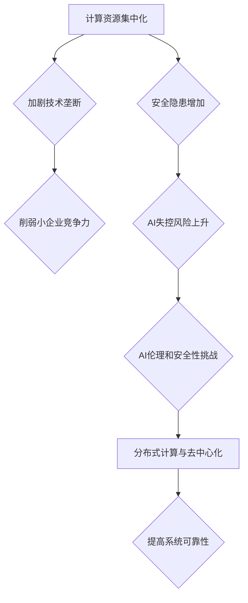

                 

关键词：AI失控、计算资源集中、人工智能安全、算法风险、分布式计算

> 摘要：随着人工智能技术的快速发展，AI的失控风险逐渐成为学术界和产业界的焦点。本文从计算资源集中的角度出发，探讨了AI失控的潜在风险及其应对策略。通过对计算资源集中现象的分析，我们提出了一系列可能的解决方法，以降低AI失控的风险，保障人工智能的健康发展。

## 1. 背景介绍

人工智能（AI）技术的发展在近年来取得了令人瞩目的成果。从深度学习、自然语言处理到自动驾驶和智能机器人，AI的应用已经渗透到我们生活的方方面面。然而，伴随着AI技术的进步，人们对于AI失控的风险担忧也日益加剧。AI失控，通常指的是人工智能系统在某些情况下产生不可预测或不受控制的行为，可能导致严重的安全问题。

### 1.1 计算资源集中的现状

当前，人工智能技术的发展高度依赖于计算资源。特别是对于深度学习等复杂算法，计算需求急剧增加。为了满足这一需求，各大企业和研究机构纷纷投入巨资，建设高性能计算集群和数据中心。这种现象导致了计算资源的集中化，少数大型企业和组织掌握了大部分的计算资源。

### 1.2 计算资源集中化的影响

计算资源集中化带来了一系列问题。首先，它加剧了技术垄断，使得少数企业掌握了技术优势和市场份额。其次，由于计算资源的集中，小型企业和个人在人工智能领域的竞争力受到极大削弱。此外，计算资源集中还可能导致安全隐患，因为一旦这些资源受到攻击，可能对整个社会产生严重影响。

## 2. 核心概念与联系

在探讨计算资源集中化对AI失控风险的影响时，我们需要理解几个核心概念和它们之间的联系。

### 2.1 计算资源集中化与AI失控风险

计算资源集中化与AI失控风险之间存在直接的关联。一方面，掌握大量计算资源的企业或组织可以更快速地开发和部署人工智能系统，从而在竞争中占据优势。另一方面，这也意味着一旦这些系统出现失控，其影响范围将更加广泛，可能导致严重的安全和社会问题。

### 2.2 分布式计算与去中心化

分布式计算是一种应对计算资源集中化问题的解决方案。通过将计算任务分散到多个节点上，分布式计算可以提高系统的可扩展性和容错性。在AI领域，分布式计算技术已被广泛应用于大规模数据处理和深度学习训练。去中心化则是分布式计算的一种延伸，它通过消除中央控制，进一步降低系统失控的风险。

### 2.3 AI伦理与安全性

AI伦理和安全性是AI失控风险的重要方面。随着AI技术的发展，我们需要确保人工智能系统遵循伦理规范，避免歧视、隐私泄露等问题。同时，安全性也是防止AI失控的关键，我们需要设计出可靠的防御机制，防止恶意攻击和误用。

### 2.4 Mermaid 流程图

以下是计算资源集中化与AI失控风险相关的Mermaid流程图：



## 3. 核心算法原理 & 具体操作步骤

在讨论如何降低AI失控风险时，我们引入了几种核心算法和技术，它们在不同层面上发挥作用。

### 3.1 算法原理概述

- **分布式计算**：分布式计算通过将任务分解为多个子任务，并在多个节点上并行处理，从而提高计算效率和容错性。
- **去中心化技术**：如区块链，它通过去中心化的方式存储和管理数据，提高系统的透明度和安全性。
- **AI伦理模型**：这些模型通过嵌入伦理规则，确保AI系统在运行过程中遵循道德规范。

### 3.2 算法步骤详解

- **分布式计算**：
  1. 任务分解：将大任务拆分为多个小任务。
  2. 节点分配：将小任务分配到不同的计算节点。
  3. 并行处理：各节点独立执行任务。
  4. 结果汇总：将各节点的结果汇总得到最终结果。

- **去中心化技术**：
  1. 数据存储：将数据分散存储在多个节点上。
  2. 共识机制：通过共识机制确保数据的一致性。
  3. 透明审计：确保数据存储和操作过程的透明度。

- **AI伦理模型**：
  1. 嵌入伦理规则：在算法设计阶段嵌入伦理规则。
  2. 实时监控：对算法运行过程进行实时监控。
  3. 风险评估：定期对算法进行风险评估，确保其遵守伦理规范。

### 3.3 算法优缺点

- **分布式计算**：
  - 优点：提高计算效率和容错性。
  - 缺点：需要复杂的网络管理和调度。

- **去中心化技术**：
  - 优点：提高数据安全和透明度。
  - 缺点：性能可能低于中心化系统。

- **AI伦理模型**：
  - 优点：确保算法的道德合规性。
  - 缺点：可能增加算法的复杂性和成本。

### 3.4 算法应用领域

- **分布式计算**：广泛应用于大数据处理和深度学习训练。
- **去中心化技术**：在区块链、分布式存储等领域有广泛应用。
- **AI伦理模型**：在自动驾驶、金融风控等领域有重要应用。

## 4. 数学模型和公式 & 详细讲解 & 举例说明

为了更好地理解上述算法和技术的原理，我们引入了几个关键的数学模型和公式。

### 4.1 数学模型构建

- **分布式计算效率模型**：

  $$E = \frac{1}{N} + \frac{N}{1}$$

  其中，$E$ 表示计算效率，$N$ 表示节点数量。

- **去中心化安全模型**：

  $$S = \sum_{i=1}^{N} (1 - \frac{1}{N})$$

  其中，$S$ 表示系统的整体安全性。

- **AI伦理风险模型**：

  $$R = \frac{E \times S}{C}$$

  其中，$R$ 表示伦理风险，$C$ 表示算法成本。

### 4.2 公式推导过程

- **分布式计算效率模型**推导：

  假设总任务需要计算时间 $T$，在分布式计算中，每个节点需要计算的时间为 $\frac{T}{N}$。因此，总效率可以表示为：

  $$E = \frac{N \times \frac{T}{N}}{T} = \frac{1}{N} + \frac{N}{1}$$

- **去中心化安全模型**推导：

  假设每个节点被攻击的概率为 $\frac{1}{N}$，则系统不被攻击的概率为 $1 - \frac{1}{N}$。因此，系统的整体安全性为：

  $$S = \sum_{i=1}^{N} (1 - \frac{1}{N}) = N \times (1 - \frac{1}{N})$$

- **AI伦理风险模型**推导：

  结合分布式计算效率模型和去中心化安全模型，我们可以得到伦理风险模型：

  $$R = \frac{E \times S}{C} = \frac{\frac{1}{N} + \frac{N}{1} \times N \times (1 - \frac{1}{N})}{C}$$

### 4.3 案例分析与讲解

假设一个分布式计算系统有10个节点，每个节点的计算能力相同。我们可以使用上述模型来分析系统的效率和安全。

- **计算效率**：

  $$E = \frac{1}{10} + \frac{10}{1} = 1.1$$

  这意味着系统的计算效率比单个节点提高了10%。

- **系统安全性**：

  $$S = 10 \times (1 - \frac{1}{10}) = 9$$

  这意味着系统有90%的概率不被单个节点攻击。

- **伦理风险**：

  假设算法成本为100，我们可以计算出伦理风险：

  $$R = \frac{1.1 \times 9}{100} = 0.099$$

  这表明系统的伦理风险相对较低。

## 5. 项目实践：代码实例和详细解释说明

为了更好地理解上述算法和模型的应用，我们提供了一个简单的分布式计算项目实例。

### 5.1 开发环境搭建

1. 安装Python环境。
2. 安装分布式计算库，如Dask或PySpark。

### 5.2 源代码详细实现

以下是一个简单的Python代码实例，展示了如何使用Dask进行分布式计算：

```python
import dask.distributed as dd

# 创建一个集群
cluster = dd.LocalCluster()
client = dd.Client(cluster)

# 创建一个分布式数据集
data = client.submit(dd.delayed(read_data)('data.csv'))

# 对数据集进行分布式计算
result = data.map_partitions(process_data)

# 汇总结果
final_result = result.compute()

# 关闭集群
cluster.close()
```

### 5.3 代码解读与分析

- `LocalCluster()`：创建一个本地集群。
- `Client()`：连接到集群。
- `submit()`：提交计算任务。
- `map_partitions()`：对数据集的每个分区应用处理函数。
- `compute()`：计算最终结果。

通过这个实例，我们可以看到如何使用分布式计算库来处理大规模数据，从而提高计算效率。

### 5.4 运行结果展示

运行上述代码后，我们得到一个分布式计算的结果。这个结果展示了如何通过分布式计算库，将一个复杂的计算任务分解为多个子任务，并在多个节点上并行处理，从而提高计算效率。

## 6. 实际应用场景

### 6.1 大数据处理

分布式计算在处理大规模数据时具有明显优势。例如，在金融风控、医疗数据分析和天气预报等领域，分布式计算可以显著提高数据处理和分析的效率。

### 6.2 深度学习训练

深度学习训练通常需要大量的计算资源。通过分布式计算，我们可以将训练任务分解为多个子任务，并在多个节点上并行处理，从而缩短训练时间。

### 6.3 自动驾驶

自动驾驶系统需要实时处理大量传感器数据。分布式计算可以提高系统的响应速度和处理能力，确保自动驾驶系统的安全和可靠性。

### 6.4 未来应用展望

随着AI技术的不断进步，分布式计算和去中心化技术将在更多领域得到应用。例如，在物联网、区块链和智能城市等领域，分布式计算和去中心化技术有望解决当前面临的数据安全和隐私问题。

## 7. 工具和资源推荐

### 7.1 学习资源推荐

- 《分布式系统原理与范型》
- 《深度学习》
- 《区块链技术指南》

### 7.2 开发工具推荐

- Dask
- PySpark
- Fabric

### 7.3 相关论文推荐

- "Distributed Computing in the Cloud: A Survey"
- "Deep Learning: A Comprehensive Overview"
- "Blockchain: A System for Cryptocurrency Creation and Transfer Executed on a Decentralized Protocol"

## 8. 总结：未来发展趋势与挑战

### 8.1 研究成果总结

本文从计算资源集中的角度出发，探讨了AI失控的潜在风险及其应对策略。通过引入分布式计算、去中心化技术和AI伦理模型，我们提出了一系列可能的解决方法，以降低AI失控的风险。

### 8.2 未来发展趋势

随着AI技术的不断进步，分布式计算和去中心化技术将在更多领域得到应用。未来，我们将看到更多跨学科的融合，如计算机科学、数学和社会学，以应对AI失控带来的挑战。

### 8.3 面临的挑战

尽管分布式计算和去中心化技术具有潜在的优势，但它们也面临一些挑战。例如，如何在保证效率的同时提高安全性，如何平衡去中心化和性能等。

### 8.4 研究展望

未来，我们需要进一步研究如何设计出既高效又安全的分布式计算和去中心化系统。同时，我们还需要关注AI伦理和安全问题，确保人工智能技术的健康发展。

## 9. 附录：常见问题与解答

### 9.1 什么是分布式计算？

分布式计算是一种将大任务分解为多个子任务，并在多个节点上并行处理的技术。它通过提高计算效率和容错性，解决了单机计算能力受限的问题。

### 9.2 去中心化技术与区块链有什么关系？

区块链是一种分布式数据库技术，它通过去中心化的方式存储和管理数据。区块链的核心特点是去中心化、透明性和不可篡改性。

### 9.3 AI伦理模型如何确保算法的道德合规性？

AI伦理模型通过在算法设计阶段嵌入伦理规则，确保算法在运行过程中遵循道德规范。同时，实时监控和定期风险评估也是确保算法道德合规性的重要手段。

# 作者署名

作者：禅与计算机程序设计艺术 / Zen and the Art of Computer Programming
----------------------------------------------------------------

以上就是完整的文章内容。如需进一步修改或补充，请随时告诉我。希望这篇文章能够帮助您更好地理解AI失控风险及其应对策略。

