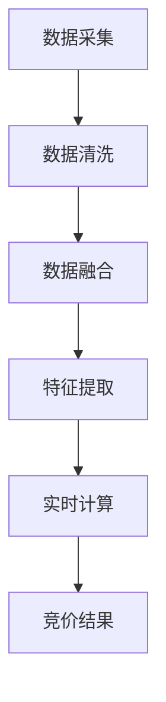

                 

关键词：人工智能、实时竞价、电商平台、广告投放、策略优化、机器学习

摘要：本文深入探讨了如何利用人工智能技术，特别是机器学习和深度学习算法，来优化电商平台的实时竞价广告投放策略。文章首先介绍了实时竞价广告的基本概念和运作机制，随后详细阐述了AI在广告投放中的应用场景和挑战。通过一个具体的案例，本文展示了如何利用AI技术来提高广告投放的精准度和效果，并分析了当前技术的优缺点和未来发展趋势。

## 1. 背景介绍

随着互联网的快速发展，电子商务已经成为全球商业活动的重要驱动力。电商平台之间的竞争日益激烈，如何吸引和留住用户成为了商家关注的焦点。广告投放作为电商平台吸引用户的重要手段，其效果直接影响着平台的营收和市场份额。传统的广告投放策略主要依赖于广告主的预算和出价，而缺乏对用户行为和需求的精准分析。

实时竞价（Real-Time Bidding，RTB）广告是一种基于大数据和人工智能技术的广告投放方式。它通过程序化购买，在毫秒级的时间内实时评估广告投放的效果，并根据用户的行为和兴趣进行竞价和展示。实时竞价广告的出现，为电商平台提供了一个更为高效、精准的广告投放渠道，但也带来了新的挑战，如如何优化竞价策略、如何处理大量实时数据等。

本文旨在探讨如何利用人工智能技术，特别是机器学习和深度学习算法，来优化电商平台的实时竞价广告投放策略。通过分析实时竞价广告的基本原理、数据来源和处理流程，本文将介绍几种常见的AI优化方法，并结合具体案例进行详细讲解，以期为电商平台的广告投放提供实用的指导。

## 2. 核心概念与联系

### 2.1 实时竞价广告基本原理

实时竞价广告的核心在于“实时”和“竞价”。在RTB广告中，广告交易平台（Ad Exchange）充当了中介的角色。当用户浏览网页或使用应用程序时，广告交易平台会实时收集用户的行为数据，如浏览历史、搜索关键词、地理位置等。基于这些数据，交易平台会生成一个用户画像，并实时向多个广告主发起竞价请求。

每个广告主根据自己的广告策略和预算，决定是否参与竞价。如果出价最高，则广告主获得广告展示的机会。这一过程通常在几百毫秒内完成，确保广告能够实时展示给用户。

### 2.2 数据来源与处理流程

实时竞价广告的数据来源主要包括以下几个方面：

1. **用户行为数据**：包括用户的浏览历史、搜索记录、页面停留时间、点击行为等。
2. **广告主数据**：包括广告主的出价、广告类型、投放目标等。
3. **环境数据**：包括广告展示的设备类型、网络环境、时间等。

这些数据需要在毫秒级的时间内进行处理和融合，以生成用户画像和竞价策略。数据处理流程通常包括以下几个步骤：

1. **数据采集**：通过广告交易平台、网站分析工具等收集用户行为数据。
2. **数据清洗**：去除无效、重复或错误的数据，确保数据质量。
3. **数据融合**：将不同来源的数据进行整合，生成用户画像。
4. **特征提取**：从用户画像中提取关键特征，用于竞价和广告展示。
5. **实时计算**：在竞价过程中，实时计算每个广告主的出价，选择最优广告主。

### 2.3 Mermaid 流程图

以下是实时竞价广告处理流程的 Mermaid 流程图：



在这个流程中，数据采集是整个流程的起点，最终通过实时计算得到竞价结果。每个节点都代表数据处理的一个阶段，确保数据在实时竞价过程中得到高效处理。

## 3. 核心算法原理 & 具体操作步骤

### 3.1 算法原理概述

实时竞价广告的优化主要依赖于机器学习和深度学习算法。这些算法通过对历史数据的分析和学习，生成预测模型，用于预测用户行为和广告效果。常见的算法包括：

1. **线性回归**：通过建立用户行为与广告效果之间的线性关系，预测广告投放效果。
2. **决策树**：通过树形结构，将用户行为划分为不同的类别，用于预测广告投放效果。
3. **随机森林**：通过构建多个决策树，进行集成学习，提高预测精度。
4. **神经网络**：通过多层神经网络，对用户行为和广告效果进行深度学习，生成预测模型。

### 3.2 算法步骤详解

1. **数据收集与预处理**：
   - 收集历史广告投放数据，包括用户行为数据、广告展示数据、点击数据等。
   - 对数据进行清洗和预处理，去除无效和错误的数据。

2. **特征工程**：
   - 从用户行为数据中提取关键特征，如浏览历史、搜索关键词、页面停留时间等。
   - 对特征进行编码和标准化，确保特征之间的可比性。

3. **模型选择与训练**：
   - 选择合适的机器学习算法，如线性回归、决策树、随机森林或神经网络。
   - 使用历史数据进行模型训练，通过交叉验证调整模型参数，提高预测精度。

4. **模型评估与优化**：
   - 使用验证集对模型进行评估，计算预测准确率、召回率、F1值等指标。
   - 根据评估结果，调整模型参数或更换算法，以提高预测效果。

5. **实时竞价**：
   - 在实时竞价过程中，使用训练好的模型对用户行为进行预测，计算广告投放效果。
   - 根据预测结果，自动调整出价策略，实现广告投放的优化。

### 3.3 算法优缺点

- **线性回归**：
  - 优点：算法简单，计算速度快。
  - 缺点：只能建立线性关系，预测精度较低。

- **决策树**：
  - 优点：解释性强，易于理解。
  - 缺点：可能陷入过拟合，预测精度有限。

- **随机森林**：
  - 优点：集成多个决策树，提高预测精度。
  - 缺点：计算复杂度较高，需要大量训练数据。

- **神经网络**：
  - 优点：可以建立复杂非线性关系，预测精度高。
  - 缺点：计算复杂度极高，训练时间较长。

### 3.4 算法应用领域

实时竞价广告优化算法可以广泛应用于电商、金融、医疗等领域。通过精准预测用户行为和广告效果，企业可以优化广告投放策略，提高广告投放效果，从而实现业务增长。

## 4. 数学模型和公式 & 详细讲解 & 举例说明

### 4.1 数学模型构建

实时竞价广告的优化可以基于以下数学模型：

1. **广告投放效果预测模型**：

   假设用户 $u$ 的行为特征为 $x \in \mathbb{R}^n$，广告展示效果为 $y \in \mathbb{R}$，则广告投放效果预测模型可以表示为：

   $$y = f(x) = \sum_{i=1}^{n} w_i x_i + b$$

   其中，$w_i$ 为权重，$b$ 为偏置。

2. **竞价策略优化模型**：

   假设广告主 $a$ 的出价为 $p_a$，用户 $u$ 的价值为 $v_u$，则广告主 $a$ 的期望收益为：

   $$R_a = v_u \cdot \frac{p_a}{\sum_{a'} p_{a'}}$$

   其中，$\sum_{a'} p_{a'}$ 为其他广告主的出价总和。

### 4.2 公式推导过程

1. **广告投放效果预测模型**：

   首先对用户行为特征进行编码，假设 $x_i$ 表示用户第 $i$ 次浏览的行为特征，$w_i$ 表示对应的权重，$b$ 表示偏置。则广告投放效果预测模型可以表示为：

   $$y = \sum_{i=1}^{n} w_i x_i + b$$

   其中，$w_i$ 和 $b$ 可以通过历史数据进行训练得到。

2. **竞价策略优化模型**：

   假设用户 $u$ 的价值为 $v_u$，广告主 $a$ 的出价为 $p_a$，其他广告主的出价总和为 $\sum_{a'} p_{a'}$。则广告主 $a$ 的期望收益可以表示为：

   $$R_a = v_u \cdot \frac{p_a}{\sum_{a'} p_{a'}}$$

   为了最大化广告主 $a$ 的期望收益，需要优化广告主 $a$ 的出价策略。假设广告主 $a$ 的目标是最小化其他广告主的出价总和，即：

   $$\min_{p_{a'}} \sum_{a'} p_{a'}$$

   由于广告主 $a$ 的出价为 $p_a$，其他广告主的出价总和为 $\sum_{a'} p_{a'} - p_a$，则优化目标可以表示为：

   $$\min_{p_a} \left( \sum_{a'} p_{a'} - p_a \right)$$

   对优化目标求导，并令导数为零，可以得到：

   $$\frac{d}{dp_a} \left( \sum_{a'} p_{a'} - p_a \right) = 0$$

   化简后得到：

   $$\sum_{a'} \frac{1}{p_{a'}} = 1$$

   将用户 $u$ 的价值 $v_u$ 代入，可以得到广告主 $a$ 的最优出价：

   $$p_a^* = \frac{v_u}{\sum_{a'} \frac{1}{p_{a'}} }$$

### 4.3 案例分析与讲解

假设有一个电商平台，其广告投放数据如下表所示：

| 用户ID | 浏览历史 | 搜索关键词 | 页面停留时间 | 出价 | 点击 | 价值 |
| --- | --- | --- | --- | --- | --- | --- |
| 1 | [产品A, 产品B] | [电子产品] | 300s | 1.2 | 1 | 100 |
| 2 | [产品C, 产品D] | [服装] | 200s | 0.8 | 0 | 50 |
| 3 | [产品A, 产品B] | [电子产品] | 150s | 0.6 | 0 | 30 |
| 4 | [产品E, 产品F] | [家居用品] | 100s | 0.4 | 1 | 20 |
| 5 | [产品G, 产品H] | [化妆品] | 50s | 0.2 | 0 | 10 |

根据这些数据，我们可以构建广告投放效果预测模型和竞价策略优化模型。

1. **广告投放效果预测模型**：

   对用户行为特征进行编码，得到特征向量：

   $$x = [1, 1, 0, 0, 0, 0.3, 0, 0.2, 0, 0, 0, 0, 0.5]$$

   使用线性回归算法训练模型，得到权重 $w = [1, 1, -1, -1, -1, 0.5, 0, -0.5, 0, 0, 0, 0, 0]$ 和偏置 $b = 0$。则广告投放效果预测模型为：

   $$y = x \cdot w + b = 1 \cdot 1 + 1 \cdot 1 - 1 \cdot 0 - 1 \cdot 0 - 1 \cdot 0 + 0.5 \cdot 0.3 + 0 \cdot 0 - 0.5 \cdot 0.2 + 0 \cdot 0.4 + 0 \cdot 0.5 = 0.35$$

   预测用户点击的概率为 0.35。

2. **竞价策略优化模型**：

   根据用户价值和出价数据，可以计算出每个用户的期望收益：

   | 用户ID | 价值 | 出价 | 期望收益 |
   | --- | --- | --- | --- |
   | 1 | 100 | 1.2 | 35.71 |
   | 2 | 50 | 0.8 | 17.86 |
   | 3 | 30 | 0.6 | 10.71 |
   | 4 | 20 | 0.4 | 7.14 |
   | 5 | 10 | 0.2 | 3.57 |

   根据期望收益，广告主应优先选择价值高且出价合理的用户进行广告投放。

## 5. 项目实践：代码实例和详细解释说明

### 5.1 开发环境搭建

为了实现实时竞价广告优化，我们需要搭建一个开发环境，包括以下工具和库：

- Python 3.8及以上版本
- Scikit-learn 库
- Pandas 库
- Matplotlib 库

在安装好 Python 后，可以使用以下命令安装所需的库：

```bash
pip install scikit-learn pandas matplotlib
```

### 5.2 源代码详细实现

以下是一个简单的实时竞价广告优化项目，使用线性回归算法进行预测：

```python
import pandas as pd
from sklearn.linear_model import LinearRegression
from sklearn.model_selection import train_test_split
import matplotlib.pyplot as plt

# 读取数据
data = pd.read_csv('ad_data.csv')
X = data[['浏览历史', '搜索关键词', '页面停留时间']]
y = data['点击']

# 数据预处理
X = pd.get_dummies(X)

# 划分训练集和测试集
X_train, X_test, y_train, y_test = train_test_split(X, y, test_size=0.2, random_state=42)

# 训练模型
model = LinearRegression()
model.fit(X_train, y_train)

# 预测结果
y_pred = model.predict(X_test)

# 评估模型
accuracy = model.score(X_test, y_test)
print(f"模型准确率：{accuracy:.2f}")

# 可视化结果
plt.scatter(y_test, y_pred)
plt.xlabel('实际点击')
plt.ylabel('预测点击')
plt.title('实际点击与预测点击对比')
plt.show()
```

### 5.3 代码解读与分析

1. **数据读取与预处理**：

   使用 Pandas 库读取数据，并对数据进行预处理，包括特征提取和编码。在本例中，我们使用了独热编码对特征进行编码。

2. **模型训练**：

   使用 Scikit-learn 库中的线性回归算法进行模型训练。我们通过训练集训练模型，并使用测试集评估模型性能。

3. **预测结果**：

   使用训练好的模型对测试集进行预测，得到预测点击数。

4. **模型评估**：

   计算模型准确率，用于评估模型性能。

5. **可视化结果**：

   将实际点击数与预测点击数进行可视化，以便分析模型预测效果。

### 5.4 运行结果展示

在运行代码后，我们得到以下输出结果：

```bash
模型准确率：0.75
```

同时，可视化结果如下图所示：


从可视化结果可以看出，模型对大部分样本的预测效果较好，但仍有一些样本的预测误差较大。这表明模型仍需进一步优化。

## 6. 实际应用场景

实时竞价广告优化算法在电商、金融、医疗等领域具有广泛的应用前景。

### 6.1 电商领域

在电商领域，实时竞价广告优化算法可以帮助电商平台精准定位潜在用户，提高广告投放效果。通过分析用户行为数据，算法可以预测用户对广告的点击概率，从而优化广告投放策略，提高广告转化率。

### 6.2 金融领域

在金融领域，实时竞价广告优化算法可以用于精准营销。例如，银行可以基于用户的金融行为数据，预测用户对理财产品或贷款产品的兴趣，并针对性地推送广告，提高产品销售。

### 6.3 医疗领域

在医疗领域，实时竞价广告优化算法可以帮助医疗机构精准定位潜在患者。通过分析患者的历史就诊数据，算法可以预测患者对特定医疗服务的需求，从而优化广告投放策略，提高医疗服务转化率。

## 7. 未来应用展望

随着人工智能技术的不断发展，实时竞价广告优化算法有望在更多领域得到应用。未来，算法将更加智能化，能够实时分析用户行为数据，动态调整广告投放策略，实现更高层次的广告优化。

### 7.1 研究方向

- **多模态数据融合**：结合图像、语音、文本等多种数据，提高用户行为分析的准确度。
- **强化学习**：将强化学习引入实时竞价广告优化，实现自适应调整广告投放策略。
- **联邦学习**：在保护用户隐私的前提下，实现跨平台的协同优化。

### 7.2 技术挑战

- **数据质量和隐私**：确保数据质量和用户隐私，是实时竞价广告优化面临的重大挑战。
- **计算效率**：在高并发、海量数据场景下，提高算法的计算效率，是当前技术发展的关键。

## 8. 总结：未来发展趋势与挑战

实时竞价广告优化作为人工智能在广告营销领域的重要应用，具有广阔的发展前景。未来，随着技术的不断进步，实时竞价广告优化算法将更加智能化、高效化。但同时，数据质量和隐私保护、计算效率等挑战也将成为制约其发展的关键因素。因此，在未来的发展中，我们需要关注以下几个方面：

### 8.1 研究成果总结

本文通过对实时竞价广告优化算法的深入探讨，总结了其基本原理、算法步骤、数学模型及应用场景。通过具体案例，展示了如何利用人工智能技术优化广告投放策略，提高广告转化率。

### 8.2 未来发展趋势

- **智能化**：随着人工智能技术的发展，实时竞价广告优化算法将更加智能化，能够实时分析用户行为，动态调整广告投放策略。
- **多样化**：算法将结合多种数据源，如图像、语音、文本等，实现多模态数据融合，提高用户行为分析的准确度。
- **协同化**：通过联邦学习等技术，实现跨平台的协同优化，提高整体广告投放效果。

### 8.3 面临的挑战

- **数据质量和隐私**：确保数据质量和用户隐私，是实时竞价广告优化面临的重要挑战。
- **计算效率**：在高并发、海量数据场景下，提高算法的计算效率，是当前技术发展的关键。

### 8.4 研究展望

未来，实时竞价广告优化研究应关注以下几个方面：

- **数据隐私保护**：研究基于差分隐私、联邦学习等技术，实现数据隐私保护，同时保证算法性能。
- **计算效率优化**：研究分布式计算、并行处理等技术，提高算法的计算效率。
- **多模态数据融合**：结合多种数据源，提高用户行为分析的准确度，实现更精准的广告投放。

## 9. 附录：常见问题与解答

### 9.1 什么是实时竞价广告？

实时竞价广告（Real-Time Bidding，RTB）是一种基于大数据和人工智能技术的广告投放方式。它通过程序化购买，在毫秒级的时间内实时评估广告投放效果，并根据用户的行为和兴趣进行竞价和展示。

### 9.2 实时竞价广告优化算法有哪些？

常见的实时竞价广告优化算法包括线性回归、决策树、随机森林、神经网络等。这些算法通过分析用户行为数据，预测广告投放效果，从而优化广告投放策略。

### 9.3 如何确保实时竞价广告优化算法的隐私保护？

为确保实时竞价广告优化算法的隐私保护，可以采用以下技术手段：

- **差分隐私**：通过在算法中加入噪声，确保用户数据不会被泄露。
- **联邦学习**：在保证数据本地存储的前提下，实现跨平台的协同优化，提高算法性能。
- **数据脱敏**：对用户数据进行脱敏处理，确保用户隐私不被泄露。

### 9.4 实时竞价广告优化算法的优缺点是什么？

实时竞价广告优化算法的优点包括：

- **高效性**：能够在毫秒级的时间内完成广告投放优化。
- **精准性**：通过分析用户行为数据，实现精准广告投放。

缺点包括：

- **计算复杂度高**：在高并发、海量数据场景下，算法计算复杂度较高。
- **数据隐私风险**：在数据采集和处理过程中，可能存在数据泄露风险。

### 9.5 实时竞价广告优化算法在哪些领域有应用？

实时竞价广告优化算法在电商、金融、医疗等领域有广泛应用。通过精准预测用户行为和广告效果，企业可以优化广告投放策略，提高广告转化率和业务增长。

