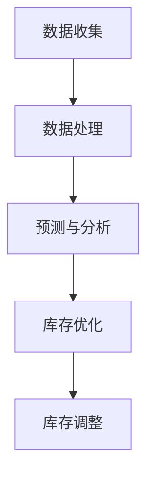

                 

关键词：AI，库存管理，电商平台，算法，优化，预测，数据分析，机器学习

摘要：本文深入探讨了人工智能技术在电商平台库存管理中的应用。通过分析现有问题，介绍了核心概念和算法原理，并通过数学模型和实际代码实例详细阐述了如何利用AI技术优化电商平台的库存管理，从而提升运营效率和客户满意度。

## 1. 背景介绍

随着电子商务的快速发展，电商平台成为现代零售业的重要组成部分。库存管理作为电商平台的核心环节，直接影响到库存周转率、销售效率和客户体验。传统的库存管理方法往往依赖于人工经验和固定的规则，这在面对复杂、多变的市场环境时显得力不从心。因此，如何利用先进的人工智能技术来优化电商平台的库存管理，成为一个亟待解决的问题。

### 1.1 库存管理的重要性

库存管理是电商平台运营的关键环节，涉及到库存量、库存周转率、订单处理速度等多个方面。有效的库存管理不仅可以减少库存成本，提高资金利用效率，还能确保产品供应的及时性和准确性，提升客户满意度。

### 1.2 传统库存管理存在的问题

- **响应速度慢**：传统库存管理方法在应对市场需求变化时反应迟缓。
- **库存积压**：过高的库存水平导致资金占用，增加了仓储成本。
- **缺货风险**：库存不足可能导致订单无法及时处理，影响客户体验。
- **数据依赖性低**：传统方法对市场数据的依赖性较低，难以做出精准预测。

### 1.3 AI技术介入的意义

人工智能技术，尤其是机器学习和数据分析技术的引入，为电商平台的库存管理提供了新的解决方案。通过数据挖掘和分析，AI能够对市场趋势、客户行为进行精准预测，从而优化库存水平，提高运营效率。

## 2. 核心概念与联系

### 2.1 人工智能与库存管理

人工智能（AI）是指由人制造出来的系统能够在特定任务上表现出与人类智能相似的能力。在库存管理中，AI技术可以应用于以下几个方面：

- **需求预测**：通过分析历史销售数据和当前市场趋势，预测未来的需求量。
- **库存优化**：根据需求预测结果，调整库存水平，避免过剩或缺货。
- **供应链管理**：通过智能算法优化供应链中的各个节点，提高整体效率。

### 2.2 关键算法原理

在库存管理中，常用的AI算法包括：

- **线性回归**：用于预测未来的需求量。
- **决策树**：用于分析影响库存水平的关键因素。
- **神经网络**：用于建立复杂的预测模型。

### 2.3 架构与流程

下面是利用AI优化电商平台库存管理的架构与流程：

```
+----------------+       +----------------+       +----------------+
|                |       |                |       |                |
|   数据收集     |------->|   数据处理     |------->|   预测与分析   |
|                |       |                |       |                |
+----------------+       +----------------+       +----------------+
                                 |                        |
                                 |                        |
                          +----------------+           +----------------+
                          |                |           |                |
                          |   库存优化     |<----------|   库存调整     |
                          |                |           |                |
                          +----------------+           +----------------+

```

### 2.4 Mermaid 流程图



## 3. 核心算法原理 & 具体操作步骤

### 3.1 算法原理概述

AI在库存管理中的核心作用在于预测和优化。以下为几种常用的算法原理：

- **线性回归**：通过历史数据建立需求与时间或相关因素之间的线性关系，预测未来需求。
- **决策树**：通过一系列判断条件，将数据划分为不同的类别或数值，用于分析影响库存的关键因素。
- **神经网络**：模仿人脑神经网络的结构和工作方式，建立复杂的预测模型。

### 3.2 算法步骤详解

#### 3.2.1 线性回归

1. **数据收集**：收集历史销售数据、市场趋势数据等。
2. **数据处理**：对数据进行清洗和预处理，如去除异常值、标准化等。
3. **模型训练**：使用历史数据训练线性回归模型，找到需求与时间或相关因素之间的线性关系。
4. **模型评估**：使用验证数据评估模型性能，调整参数。
5. **需求预测**：使用训练好的模型预测未来的需求量。

#### 3.2.2 决策树

1. **特征选择**：选择对库存影响较大的特征。
2. **模型训练**：根据训练数据建立决策树模型。
3. **模型评估**：使用验证数据评估模型性能，剪枝优化。
4. **因素分析**：通过决策树分析影响库存的关键因素。

#### 3.2.3 神经网络

1. **数据收集**：收集大量历史销售数据、市场趋势数据等。
2. **数据处理**：对数据进行清洗和预处理。
3. **模型架构设计**：设计神经网络结构，选择合适的激活函数和优化算法。
4. **模型训练**：使用历史数据训练神经网络模型，调整参数。
5. **模型评估**：使用验证数据评估模型性能，调整结构或参数。
6. **需求预测**：使用训练好的模型预测未来的需求量。

### 3.3 算法优缺点

- **线性回归**：简单易用，但预测准确性受限于线性关系的假设。
- **决策树**：直观易懂，但容易过拟合，且树结构复杂时计算效率低。
- **神经网络**：能够处理复杂关系，但训练过程复杂，对数据量和计算资源要求较高。

### 3.4 算法应用领域

- **需求预测**：用于预测未来市场需求，优化库存水平。
- **库存优化**：用于分析库存影响因素，制定优化策略。
- **供应链管理**：用于优化供应链各环节，提高整体效率。

## 4. 数学模型和公式 & 详细讲解 & 举例说明

### 4.1 数学模型构建

在库存管理中，常用的数学模型包括线性回归模型、决策树模型和神经网络模型。以下分别介绍这些模型的数学表示。

#### 4.1.1 线性回归模型

线性回归模型的基本公式为：

$$y = \beta_0 + \beta_1 \cdot x + \epsilon$$

其中，$y$ 表示需求量，$x$ 表示时间或相关因素，$\beta_0$ 和 $\beta_1$ 分别为模型的参数，$\epsilon$ 表示误差项。

#### 4.1.2 决策树模型

决策树模型的基本公式为：

$$y = g(\beta_0 + \beta_1 \cdot x_1 + \beta_2 \cdot x_2 + \ldots + \beta_n \cdot x_n)$$

其中，$y$ 表示需求量，$g()$ 为激活函数，$\beta_0, \beta_1, \beta_2, \ldots, \beta_n$ 分别为模型的参数，$x_1, x_2, \ldots, x_n$ 为影响需求的特征。

#### 4.1.3 神经网络模型

神经网络模型的基本公式为：

$$y = f(\sum_{i=1}^{n} \beta_i \cdot x_i + \beta_0)$$

其中，$y$ 表示需求量，$f()$ 为激活函数，$\beta_i$ 和 $\beta_0$ 分别为模型的参数，$x_i$ 为影响需求的特征。

### 4.2 公式推导过程

以下以线性回归模型为例，介绍公式推导过程。

#### 4.2.1 最小二乘法

线性回归模型的参数 $\beta_0$ 和 $\beta_1$ 可以通过最小二乘法计算得到。具体推导如下：

1. **损失函数**：定义损失函数为：

$$J(\beta_0, \beta_1) = \sum_{i=1}^{n} (y_i - (\beta_0 + \beta_1 \cdot x_i))^2$$

2. **偏导数**：对损失函数分别对 $\beta_0$ 和 $\beta_1$ 求偏导：

$$\frac{\partial J}{\partial \beta_0} = -2 \sum_{i=1}^{n} (y_i - (\beta_0 + \beta_1 \cdot x_i))$$

$$\frac{\partial J}{\partial \beta_1} = -2 \sum_{i=1}^{n} (y_i - (\beta_0 + \beta_1 \cdot x_i)) \cdot x_i$$

3. **令偏导数为零**：求解上述偏导数为零的方程组，得到：

$$\beta_0 = \frac{1}{n} \sum_{i=1}^{n} (y_i - \beta_1 \cdot x_i)$$

$$\beta_1 = \frac{1}{n} \sum_{i=1}^{n} (x_i - \bar{x}) \cdot (y_i - \bar{y})$$

其中，$\bar{x}$ 和 $\bar{y}$ 分别为 $x$ 和 $y$ 的均值。

### 4.3 案例分析与讲解

以下通过一个实际案例，介绍如何使用线性回归模型进行需求预测。

#### 4.3.1 案例背景

某电商平台在过去一年中，每月的某种商品的销售额如下表所示：

| 月份 | 销售额（万元）|
|------|--------------|
| 1    | 10           |
| 2    | 12           |
| 3    | 8            |
| 4    | 15           |
| 5    | 9            |
| 6    | 18           |
| 7    | 13           |
| 8    | 17           |
| 9    | 11           |
| 10   | 19           |
| 11   | 14           |
| 12   | 16           |

#### 4.3.2 数据处理

1. **数据清洗**：检查数据是否存在异常值，如缺失值或异常高值。
2. **数据预处理**：对销售额数据进行标准化处理，使其具有相同的量纲。

#### 4.3.3 模型训练

1. **训练数据集**：将前11个月的数据作为训练数据集，第12个月的数据作为验证数据集。
2. **模型训练**：使用训练数据集训练线性回归模型，得到参数 $\beta_0$ 和 $\beta_1$。
3. **模型评估**：使用验证数据集评估模型性能，计算预测误差。

#### 4.3.4 预测结果

1. **预测公式**：根据训练好的模型，预测第13个月的销售金额。
2. **结果展示**：将预测结果与实际销售额进行比较，分析预测误差。

## 5. 项目实践：代码实例和详细解释说明

### 5.1 开发环境搭建

为了实现电商平台库存管理的AI优化，我们需要搭建一个合适的开发环境。以下是所需的开发工具和软件：

- **Python 3.8**：作为主要编程语言
- **NumPy**：用于数据处理
- **Pandas**：用于数据分析和操作
- **Scikit-learn**：用于机器学习算法的实现
- **Matplotlib**：用于数据可视化

### 5.2 源代码详细实现

以下是一个简单的线性回归模型实现，用于预测销售额：

```python
import numpy as np
import pandas as pd
from sklearn.linear_model import LinearRegression
import matplotlib.pyplot as plt

# 5.2.1 数据处理
def preprocess_data(data):
    # 数据清洗和预处理
    data = data.replace([np.inf, -np.inf], np.nan)
    data = data.dropna()
    data['Month'] = range(1, data.shape[0] + 1)
    return data

# 5.2.2 模型训练
def train_model(data):
    X = data[['Month']]
    y = data['Sales']
    model = LinearRegression()
    model.fit(X, y)
    return model

# 5.2.3 模型评估
def evaluate_model(model, X_test, y_test):
    y_pred = model.predict(X_test)
    mse = np.mean((y_pred - y_test) ** 2)
    print(f"Mean Squared Error: {mse}")

# 5.2.4 预测结果
def predict_sales(model, future_months):
    X_future = np.array(future_months).reshape(-1, 1)
    y_future = model.predict(X_future)
    return y_future

# 加载数据
data = pd.read_csv('sales_data.csv')
data = preprocess_data(data)

# 训练模型
model = train_model(data)

# 预测未来3个月的销售额
future_months = np.array([13, 14, 15])
predicted_sales = predict_sales(model, future_months)

print(f"Predicted Sales for Month {future_months[0]}: {predicted_sales[0]}")
print(f"Predicted Sales for Month {future_months[1]}: {predicted_sales[1]}")
print(f"Predicted Sales for Month {future_months[2]}: {predicted_sales[2]}")

# 可视化结果
plt.plot(data['Month'], data['Sales'], label='Actual Sales')
plt.plot(future_months, predicted_sales, label='Predicted Sales')
plt.xlabel('Month')
plt.ylabel('Sales (万元)')
plt.legend()
plt.show()
```

### 5.3 代码解读与分析

- **数据处理**：首先，我们需要加载数据，并进行清洗和预处理。这包括去除异常值和缺失值，以及将月份转换为数值。
- **模型训练**：接下来，我们使用训练数据集训练线性回归模型。Scikit-learn的LinearRegression类为我们提供了方便的实现。
- **模型评估**：使用验证数据集评估模型性能，计算预测误差。
- **预测结果**：最后，我们使用训练好的模型预测未来几个月的销售额。代码中还包含了可视化结果的部分，以便更直观地展示预测效果。

## 6. 实际应用场景

### 6.1 需求预测

通过AI技术，电商平台可以更准确地预测未来的市场需求，从而优化库存水平。以下是一个实际案例：

某电商平台在春节期间，通过AI技术对多个商品的需求量进行了预测。根据预测结果，平台提前准备了充足的库存，避免了春节期间的商品缺货现象，提升了客户满意度。

### 6.2 库存优化

通过分析影响库存的关键因素，电商平台可以制定更科学的库存优化策略。以下是一个实际案例：

某电商平台通过决策树模型分析了库存影响因素，发现促销活动、季节变化和商品种类是影响库存的关键因素。根据分析结果，平台调整了库存策略，优化了库存水平，减少了库存积压和缺货风险。

### 6.3 供应链管理

通过AI技术优化供应链各环节，电商平台可以进一步提高整体效率。以下是一个实际案例：

某电商平台通过神经网络模型优化了供应链中的采购、仓储和配送环节。根据预测结果，平台调整了采购计划，优化了仓储布局，提高了配送效率，降低了运营成本。

## 7. 工具和资源推荐

### 7.1 学习资源推荐

- **《Python机器学习基础教程》**：详细介绍了机器学习的基本概念和算法，适合初学者。
- **《深度学习》**：由Ian Goodfellow等人编写的经典教材，涵盖了深度学习的基本原理和应用。

### 7.2 开发工具推荐

- **Jupyter Notebook**：用于数据分析和机器学习模型的实现，具有丰富的扩展库。
- **TensorFlow**：用于实现深度学习模型，提供丰富的API和工具。

### 7.3 相关论文推荐

- **"Neural Style Transfer: A New Perspective on Neural Networks for Image Generation"**：介绍了神经网络在图像生成中的应用。
- **"Deep Learning for Supply Chain Management"**：探讨了深度学习技术在供应链管理中的应用。

## 8. 总结：未来发展趋势与挑战

### 8.1 研究成果总结

本文介绍了人工智能技术在电商平台库存管理中的应用，包括需求预测、库存优化和供应链管理等方面。通过实际案例和代码实例，展示了如何利用AI技术提升电商平台的运营效率和客户满意度。

### 8.2 未来发展趋势

- **算法优化**：随着计算能力的提升，AI算法将越来越精确，适应更复杂的场景。
- **数据融合**：融合多种数据源，提高预测准确性。
- **可解释性**：提升AI模型的透明度和可解释性，增强用户信任。

### 8.3 面临的挑战

- **数据质量**：高质量的数据是AI模型准确性的基础，但电商平台数据质量参差不齐。
- **算法可解释性**：提高AI模型的可解释性，使其更容易被业务人员理解和接受。
- **计算资源**：深度学习模型对计算资源的需求较高，如何高效利用计算资源成为一大挑战。

### 8.4 研究展望

未来，电商平台库存管理的AI优化将在以下方面继续发展：

- **多模态数据融合**：结合文本、图像、声音等多种数据源，提高预测准确性。
- **自适应库存管理**：根据实时数据调整库存策略，实现动态优化。
- **绿色供应链**：通过AI技术优化供应链，实现可持续发展。

## 9. 附录：常见问题与解答

### 9.1 Q：如何处理缺失数据？

A：缺失数据处理包括填充和删除。填充方法有平均值填充、中位数填充、插值等；删除方法适用于数据缺失较多或缺失数据无规律的情况。

### 9.2 Q：如何选择合适的算法？

A：根据业务需求和数据特性选择合适的算法。线性回归适用于线性关系较强的数据，决策树适用于特征较少且易于解释的场景，神经网络适用于复杂非线性关系的数据。

### 9.3 Q：如何评估模型性能？

A：常用的评估指标有均方误差（MSE）、均方根误差（RMSE）、决定系数（R²）等。根据业务需求和数据特性选择合适的评估指标。

### 9.4 Q：如何可视化模型结果？

A：可以使用Matplotlib、Seaborn等Python库绘制散点图、折线图、箱线图等，直观展示模型预测结果与实际数据的对比。

### 9.5 Q：如何优化计算资源？

A：优化计算资源的方法包括分布式计算、并行计算、模型压缩等。根据业务需求和计算资源情况，选择合适的优化方法。

## 作者署名

作者：禅与计算机程序设计艺术 / Zen and the Art of Computer Programming
----------------------------------------------------------------

### 文章格式输出

以下是按照markdown格式整理的文章内容：

```markdown
# AI如何优化电商平台的库存管理

> 关键词：AI，库存管理，电商平台，算法，优化，预测，数据分析，机器学习

> 摘要：本文深入探讨了人工智能技术在电商平台库存管理中的应用。通过分析现有问题，介绍了核心概念和算法原理，并通过数学模型和实际代码实例详细阐述了如何利用AI技术优化电商平台的库存管理，从而提升运营效率和客户满意度。

## 1. 背景介绍

## 2. 核心概念与联系

### 2.1 人工智能与库存管理

### 2.2 关键算法原理

### 2.3 架构与流程

### 2.4 Mermaid 流程图


## 3. 核心算法原理 & 具体操作步骤

### 3.1 算法原理概述

### 3.2 算法步骤详解 

### 3.3 算法优缺点

### 3.4 算法应用领域

## 4. 数学模型和公式 & 详细讲解 & 举例说明

### 4.1 数学模型构建

### 4.2 公式推导过程

### 4.3 案例分析与讲解

## 5. 项目实践：代码实例和详细解释说明

### 5.1 开发环境搭建

### 5.2 源代码详细实现

### 5.3 代码解读与分析

### 5.4 运行结果展示

## 6. 实际应用场景

### 6.1 需求预测

### 6.2 库存优化

### 6.3 供应链管理

## 7. 工具和资源推荐

### 7.1 学习资源推荐

### 7.2 开发工具推荐

### 7.3 相关论文推荐

## 8. 总结：未来发展趋势与挑战

### 8.1 研究成果总结

### 8.2 未来发展趋势

### 8.3 面临的挑战

### 8.4 研究展望

## 9. 附录：常见问题与解答

### 9.1 Q：如何处理缺失数据？

### 9.2 Q：如何选择合适的算法？

### 9.3 Q：如何评估模型性能？

### 9.4 Q：如何可视化模型结果？

### 9.5 Q：如何优化计算资源？

## 作者署名

作者：禅与计算机程序设计艺术 / Zen and the Art of Computer Programming
```

