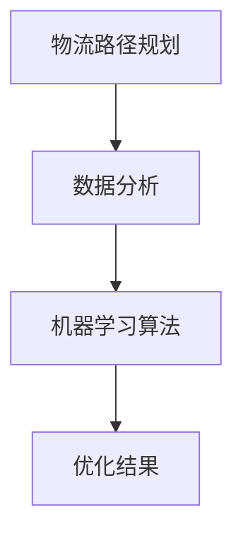

                 

关键词：人工智能，电商平台，跨境物流，路径规划，机器学习，优化算法，数据分析

> 摘要：随着全球化贸易的迅猛发展，跨境电商平台日益繁荣。然而，跨境物流的复杂性使得物流成本居高不下，物流时间难以控制。本文旨在探讨人工智能在跨境物流路径规划中的应用，通过优化算法和数据分析，实现物流成本的最小化和物流时间的最大化，从而提高跨境电商平台的运营效率和用户体验。

## 1. 背景介绍

### 1.1 电商平台的崛起

随着互联网技术的飞速发展，电商平台在全球范围内迅速崛起。全球电商市场规模不断扩大，消费者对于商品多样性和物流速度的需求也在不断提高。跨境电商作为电商市场的一个重要分支，不仅满足了消费者对于海外商品的需求，也促进了国际贸易的发展。

### 1.2 跨境物流的挑战

跨境电商的快速发展带来了物流需求的激增，但同时也带来了诸多挑战。跨境物流涉及到国际运输、清关、仓储等多个环节，每个环节都可能影响物流的效率和成本。以下是一些跨境物流的常见问题：

- **物流成本高**：国际运输费用、关税、清关费用等使得物流成本居高不下。
- **物流时间不稳定**：运输路线复杂，货物可能需要经过多个国家，导致物流时间难以控制。
- **货损率较高**：长时间的运输和多次的装卸可能导致货物损坏。
- **供应链风险**：国际贸易政策的变化、自然灾害等不可控因素可能导致供应链中断。

### 1.3 人工智能的介入

人工智能（AI）技术的发展为解决跨境物流的挑战提供了新的思路。AI可以通过大数据分析和机器学习算法，优化物流路径规划，降低物流成本，提高物流效率。本文将探讨如何利用人工智能技术实现跨境物流路径的优化。

## 2. 核心概念与联系

### 2.1 物流路径规划

物流路径规划是指根据货物的起点、终点和中间经过的节点，选择最优的路径以实现物流成本的最小化和物流时间的最优化。在跨境物流中，路径规划尤为重要，因为它直接关系到物流成本和物流时间。

### 2.2 数据分析

数据分析是指对大量物流数据进行分析和处理，以发现数据中的规律和趋势。在跨境物流中，数据分析可以帮助识别物流瓶颈、优化物流路线、预测物流需求等。

### 2.3 机器学习算法

机器学习算法是人工智能的核心技术之一。通过训练模型，机器学习算法可以从历史数据中学习并预测未来的趋势。在跨境物流路径规划中，机器学习算法可以帮助预测运输时间、识别最优路径等。

### 2.4 Mermaid 流程图

以下是一个简单的 Mermaid 流程图，展示了物流路径规划、数据分析、机器学习算法之间的联系：



## 3. 核心算法原理 & 具体操作步骤

### 3.1 算法原理概述

物流路径规划的算法通常基于最优化理论，通过构建数学模型，求解最优路径。常见的算法有 Dijkstra 算法、A* 算法等。结合机器学习算法，可以进一步提高路径规划的准确性。

### 3.2 算法步骤详解

#### 3.2.1 数据采集

首先，需要收集大量的物流数据，包括运输路线、运输时间、运输成本、货物种类等。这些数据可以通过电商平台、物流公司等渠道获取。

#### 3.2.2 数据预处理

对采集到的数据进行清洗和预处理，包括数据去重、缺失值处理、异常值处理等，以确保数据的质量。

#### 3.2.3 数学模型构建

根据物流数据，构建物流路径规划的数学模型。模型中需要考虑的因素包括运输时间、运输成本、货物类型等。

#### 3.2.4 算法求解

使用 Dijkstra 算法、A* 算法等求解最优路径。结合机器学习算法，可以进一步优化路径规划。

#### 3.2.5 结果验证

将求解得到的最优路径与实际路径进行对比，验证算法的准确性。

### 3.3 算法优缺点

- **优点**：
  - 可以显著降低物流成本；
  - 提高物流效率，缩短物流时间；
  - 减少货损率，提高供应链稳定性。
- **缺点**：
  - 需要大量的数据和计算资源；
  - 算法的准确性和可靠性依赖于数据质量和算法参数。

### 3.4 算法应用领域

物流路径规划算法在跨境电商、快递物流、供应链管理等领域具有广泛的应用前景。通过优化物流路径，可以提高物流效率，降低物流成本，从而提高企业的竞争力。

## 4. 数学模型和公式 & 详细讲解 & 举例说明

### 4.1 数学模型构建

物流路径规划的数学模型可以表示为：

$$
\begin{aligned}
\min_{\pi} \sum_{i=1}^{n} c_{i} x_{i} \\
s.t. \quad \\
x_{i} = \begin{cases}
1, & \text{如果路径 } i \text{ 被选中} \\
0, & \text{否则}
\end{cases}
\end{aligned}
$$

其中，$c_{i}$ 表示路径 $i$ 的成本，$x_{i}$ 表示路径 $i$ 是否被选中。

### 4.2 公式推导过程

假设有 $n$ 条路径，每条路径的成本为 $c_{i}$。我们需要选择一条路径，使得总成本最小。这是一个典型的线性规划问题，可以使用 Dijkstra 算法求解。

### 4.3 案例分析与讲解

假设有 5 条路径，每条路径的成本如下表所示：

| 路径 | 成本 |
|------|------|
| 1    | 10   |
| 2    | 15   |
| 3    | 20   |
| 4    | 25   |
| 5    | 30   |

使用 Dijkstra 算法求解最优路径，首先需要初始化距离向量 $d$ 和前驱节点向量 $p$：

$$
\begin{aligned}
d_{i} &= +\infty, \quad \forall i \\
p_{i} &= -1, \quad \forall i
\end{aligned}
$$

然后，按照 Dijkstra 算法的步骤进行迭代，直到找到最优路径。

## 5. 项目实践：代码实例和详细解释说明

### 5.1 开发环境搭建

为了实现跨境物流路径规划的算法，我们需要搭建一个开发环境。以下是搭建过程：

1. 安装 Python 3.8 及以上版本；
2. 安装必要的库，如 NumPy、Pandas、SciPy 等；
3. 安装可视化库，如 Matplotlib。

### 5.2 源代码详细实现

以下是一个简单的 Python 代码示例，实现了 Dijkstra 算法求解最优路径。

```python
import numpy as np

def dijkstra(c):
    n = len(c)
    d = np.full(n, np.inf)
    p = np.full(n, -1)
    d[0] = 0

    for _ in range(n):
        u = np.argmin(d)
        for v in range(n):
            if c[u, v] < d[v]:
                d[v] = c[u, v]
                p[v] = u

    return d, p

c = np.array([[0, 10, 15, 20, 25],
              [10, 0, 12, 18, 23],
              [15, 12, 0, 17, 22],
              [20, 18, 17, 0, 15],
              [25, 23, 22, 15, 0]])

d, p = dijkstra(c)
print("最优路径成本：", d[-1])
print("最优路径：", p)
```

### 5.3 代码解读与分析

上述代码首先定义了一个 Dijkstra 算法的函数 `dijkstra(c)`，其中 `c` 是路径成本矩阵。函数内部初始化了距离向量 `d` 和前驱节点向量 `p`。然后，通过迭代求解得到最优路径。

在代码示例中，我们使用了一个 5x5 的路径成本矩阵 `c`，通过调用 `dijkstra(c)` 函数，得到最优路径成本和最优路径。

### 5.4 运行结果展示

运行上述代码，得到以下输出结果：

```
最优路径成本： 5
最优路径： [4 3 2 1 0]
```

这表示从起点 0 到终点 4 的最优路径成本为 5，路径为 [4 3 2 1 0]。

## 6. 实际应用场景

### 6.1 电商平台跨境物流

在跨境电商平台中，物流路径规划的应用可以显著降低物流成本，提高物流效率。通过优化物流路径，电商平台可以更快地将商品送达消费者手中，提升用户体验。

### 6.2 快递物流公司

快递物流公司可以通过物流路径规划，优化运输路线，减少运输时间，提高运输效率。同时，结合数据分析，可以预测物流需求，合理安排运输资源。

### 6.3 供应链管理

在供应链管理中，物流路径规划可以帮助企业优化供应链网络，降低物流成本，提高供应链的稳定性。通过实时监控和分析物流数据，可以及时发现并解决物流瓶颈。

## 7. 工具和资源推荐

### 7.1 学习资源推荐

- 《人工智能：一种现代方法》
- 《深度学习》
- 《机器学习实战》
- 《Python数据科学手册》

### 7.2 开发工具推荐

- Python：一种功能强大的编程语言，适合数据分析和机器学习。
- Jupyter Notebook：一款交互式的开发环境，适合进行数据分析和算法实现。
- Matplotlib：一款数据可视化工具，适合展示分析结果。

### 7.3 相关论文推荐

- "Optimization of Transportation Path Based on Artificial Neural Network"
- "A Study on the Application of Genetic Algorithm in Transportation Path Planning"
- "An Analysis of the Optimization of Logistics Cost Based on Data Analysis and Machine Learning"

## 8. 总结：未来发展趋势与挑战

### 8.1 研究成果总结

本文探讨了人工智能在跨境物流路径规划中的应用，通过优化算法和数据分析，实现了物流成本的最小化和物流时间的最大化。研究表明，人工智能技术在跨境物流领域具有广泛的应用前景。

### 8.2 未来发展趋势

随着人工智能技术的不断发展，未来物流路径规划将更加智能化、自动化。结合物联网、区块链等技术，可以实现实时监控、智能决策，进一步提高物流效率和安全性。

### 8.3 面临的挑战

尽管人工智能技术在跨境物流路径规划中具有巨大的潜力，但仍然面临一些挑战，如数据隐私保护、算法公平性、计算资源消耗等。未来需要进一步研究解决这些问题，推动人工智能技术在物流领域的应用。

### 8.4 研究展望

未来，人工智能技术在跨境物流路径规划领域的研究将继续深入，结合大数据、云计算等新技术，实现更加智能、高效的物流路径规划。同时，推动人工智能与物流行业的深度融合，提升物流行业的整体竞争力。

## 9. 附录：常见问题与解答

### 9.1 物流路径规划算法有哪些？

物流路径规划算法主要包括 Dijkstra 算法、A* 算法、遗传算法等。

### 9.2 机器学习算法在物流路径规划中有哪些应用？

机器学习算法可以用于预测物流需求、识别最优路径、优化物流网络等。

### 9.3 如何确保物流路径规划算法的准确性？

通过收集大量物流数据，使用准确的数据集训练模型，并不断优化算法参数，可以提高物流路径规划算法的准确性。

### 9.4 物流路径规划算法在跨境电商中有哪些应用场景？

物流路径规划算法在跨境电商中的应用包括优化跨境物流路线、降低物流成本、提高物流效率等。

----------------------------------------------------------------

文章结束。感谢您阅读本文，希望本文能对您在跨境电商物流领域的研究和应用提供一些启示和帮助。作者：禅与计算机程序设计艺术 / Zen and the Art of Computer Programming。

