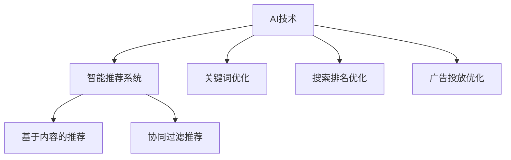

                 

在电子商务日益繁荣的今天，如何让更多的长尾商品（指销售量较低但种类繁多的商品）获得更多的曝光，成为电商平台运营的关键问题。本文将探讨人工智能（AI）技术在电商平台长尾商品曝光优化中的应用，分析核心概念、算法原理、数学模型、项目实践以及实际应用场景，旨在为电商平台运营提供有效策略和技术支持。

## 关键词：长尾商品、电商平台、人工智能、曝光优化、算法、数学模型、项目实践、应用场景

## 摘要：

本文从电商平台的实际需求出发，系统性地阐述了人工智能在长尾商品曝光优化中的应用。通过分析核心概念和算法原理，结合数学模型与项目实践，本文提出了长尾商品曝光优化的策略和实施方案。文章旨在为电商平台运营者提供有益的参考，助力提升长尾商品的市场竞争力。

## 1. 背景介绍

### 1.1 长尾商品的定义

长尾商品是指在市场上销售量较低，但种类繁多的商品。与传统主流商品相比，长尾商品在销售额上贡献较小，但在商品种类上占据重要地位。长尾现象（Long Tail Phenomenon）最早由Webb、Binmore和Terkildsen在2004年提出，他们通过分析书籍销售数据发现，在特定的市场条件下，非热门商品（即长尾商品）的累积销售额能够与热门商品（即头部商品）的销售额相媲美，甚至超过热门商品。

### 1.2 长尾商品在电商平台的现状

随着互联网技术的发展，电商平台逐渐成为长尾商品销售的主要渠道。然而，由于长尾商品数量庞大，传统的人工运营方式在商品曝光和销售上面临诸多挑战。例如，如何有效提高长尾商品的搜索排名，如何精准地向潜在消费者推荐长尾商品，以及如何提升长尾商品的转化率等问题。

### 1.3 人工智能在电商领域的发展

人工智能作为一项新兴技术，在电商领域的应用日益广泛。从智能推荐系统、图像识别、自然语言处理到自动化客服等，AI技术正在深刻改变电商运营模式，提高运营效率，提升用户体验。特别是在长尾商品曝光优化方面，AI技术具有显著的优势。

## 2. 核心概念与联系

### 2.1 人工智能基本概念

人工智能（Artificial Intelligence，简称AI）是指通过计算机程序模拟、延伸和扩展人类智能的理论、方法、技术及应用。AI的核心目标是使计算机具备人类智能，能够自主学习、推理、感知和决策。人工智能技术主要包括机器学习、深度学习、自然语言处理、计算机视觉等。

### 2.2 智能推荐系统

智能推荐系统（Recommender System）是AI技术在电商平台中最常用的应用之一。推荐系统通过分析用户的历史行为、兴趣偏好和商品属性，为用户推荐可能感兴趣的商品。推荐系统主要分为基于内容的推荐（Content-based Recommendation）和协同过滤推荐（Collaborative Filtering）两大类。

#### 2.2.1 基于内容的推荐

基于内容的推荐通过分析商品的属性和用户的历史行为，找到相似的商品推荐给用户。其主要优点是推荐结果准确，但缺点是推荐范围较窄。

#### 2.2.2 协同过滤推荐

协同过滤推荐通过分析用户之间的行为相似性，为用户推荐其他用户喜欢的商品。其主要优点是推荐范围广，但缺点是推荐结果可能不够准确。

### 2.3 长尾商品曝光优化算法

长尾商品曝光优化算法主要包括关键词优化、搜索排名优化和广告投放优化等。

#### 2.3.1 关键词优化

关键词优化是通过分析用户搜索关键词的分布和频率，调整商品标题和描述中的关键词，提高商品在搜索结果中的排名。

#### 2.3.2 搜索排名优化

搜索排名优化是通过分析搜索引擎的排名算法，优化商品的页面结构、内容质量和用户体验，提高商品在搜索结果中的排名。

#### 2.3.3 广告投放优化

广告投放优化是通过分析广告投放的效果和成本，调整广告投放策略，提高广告的点击率和转化率。

### 2.4 人工智能与长尾商品曝光优化的关系

人工智能通过智能推荐系统、关键词优化、搜索排名优化和广告投放优化等技术手段，为长尾商品曝光优化提供了有力支持。人工智能技术的应用，使得长尾商品能够在海量商品中脱颖而出，提高曝光率和销售量。

### 2.5 Mermaid 流程图



## 3. 核心算法原理 & 具体操作步骤

### 3.1 算法原理概述

长尾商品曝光优化算法主要基于数据挖掘和机器学习技术，通过对用户行为数据和商品属性数据的挖掘和分析，实现个性化推荐和优化曝光。核心算法包括协同过滤推荐、关键词优化和搜索排名优化。

### 3.2 算法步骤详解

#### 3.2.1 协同过滤推荐

1. 数据预处理：对用户行为数据和商品属性数据进行清洗、去重和归一化处理。

2. 用户相似度计算：通过计算用户之间的相似度矩阵，找到相似用户。

3. 商品相似度计算：通过计算商品之间的相似度矩阵，找到相似商品。

4. 推荐结果生成：根据用户和商品的相似度矩阵，为用户推荐相似商品。

#### 3.2.2 关键词优化

1. 关键词提取：通过自然语言处理技术，从商品标题和描述中提取关键词。

2. 关键词分析：分析关键词的分布和频率，找出重要关键词。

3. 关键词调整：根据关键词分析结果，调整商品标题和描述中的关键词，提高搜索排名。

#### 3.2.3 搜索排名优化

1. 网页质量评估：评估商品页面的质量，包括内容质量、用户体验和页面结构等。

2. 网页权重计算：根据网页质量评估结果，计算商品页面的权重。

3. 搜索结果排序：根据商品页面的权重，对搜索结果进行排序，提高商品曝光率。

### 3.3 算法优缺点

#### 优点：

1. 准确性高：基于用户行为数据和商品属性数据，实现个性化推荐和优化曝光。

2. 范围广：可以覆盖长尾商品，提高长尾商品的曝光率和销售量。

3. 自动化：算法自动运行，节省人力成本。

#### 缺点：

1. 复杂性高：算法涉及多种技术，开发和维护成本较高。

2. 数据依赖性高：算法性能依赖于用户行为数据和商品属性数据的质量。

### 3.4 算法应用领域

长尾商品曝光优化算法主要应用于电商平台，特别是在商品种类繁多、销售量较低的长尾商品领域。算法可以帮助电商平台提高商品曝光率和销售量，提升用户体验，降低运营成本。

## 4. 数学模型和公式 & 详细讲解 & 举例说明

### 4.1 数学模型构建

长尾商品曝光优化算法涉及多个数学模型，主要包括用户相似度计算模型、商品相似度计算模型和搜索排名优化模型。

#### 4.1.1 用户相似度计算模型

用户相似度计算模型主要基于用户行为数据，通过计算用户之间的相似度，找到相似用户。常见的相似度计算方法包括余弦相似度、皮尔逊相关系数等。

$$
sim(u_i, u_j) = \frac{u_i \cdot u_j}{\|u_i\| \|u_j\|}
$$

其中，$u_i$和$u_j$分别表示用户$i$和用户$j$的行为向量，$\cdot$表示点积，$\|\|$表示向量的模。

#### 4.1.2 商品相似度计算模型

商品相似度计算模型主要基于商品属性数据，通过计算商品之间的相似度，找到相似商品。常见的相似度计算方法包括余弦相似度、欧氏距离等。

$$
sim(c_i, c_j) = \frac{c_i \cdot c_j}{\|c_i\| \|c_j\|}
$$

其中，$c_i$和$c_j$分别表示商品$i$和商品$j$的属性向量。

#### 4.1.3 搜索排名优化模型

搜索排名优化模型主要基于网页质量评估结果，计算商品页面的权重。常见的排名优化模型包括PageRank、HITS等。

$$
PR(x) = \frac{1}{1 + e^{-\alpha \sum_{y \in N(x)} \frac{PR(y)}{L(y)}}}
$$

其中，$PR(x)$表示网页$x$的排名，$\alpha$表示阻尼系数，$N(x)$表示指向网页$x$的链接集合，$L(y)$表示网页$y$的链接数量。

### 4.2 公式推导过程

#### 4.2.1 用户相似度计算公式推导

用户相似度计算公式基于余弦相似度，其推导过程如下：

1. 用户行为向量表示：设用户$i$和用户$j$的行为向量分别为$u_i = (u_{i1}, u_{i2}, ..., u_{in})$和$u_j = (u_{j1}, u_{j2}, ..., u_{jn})$，其中$n$表示行为特征数量。

2. 点积计算：$u_i \cdot u_j = \sum_{k=1}^{n} u_{ik} u_{jk}$。

3. 向量模计算：$\|u_i\| = \sqrt{\sum_{k=1}^{n} u_{ik}^2}$，$\|u_j\| = \sqrt{\sum_{k=1}^{n} u_{jk}^2}$。

4. 公式推导：$sim(u_i, u_j) = \frac{u_i \cdot u_j}{\|u_i\| \|u_j\|} = \frac{\sum_{k=1}^{n} u_{ik} u_{jk}}{\sqrt{\sum_{k=1}^{n} u_{ik}^2} \sqrt{\sum_{k=1}^{n} u_{jk}^2}}$。

#### 4.2.2 商品相似度计算公式推导

商品相似度计算公式基于余弦相似度，其推导过程如下：

1. 商品属性向量表示：设商品$i$和商品$j$的属性向量分别为$c_i = (c_{i1}, c_{i2}, ..., c_{in})$和$c_j = (c_{j1}, c_{j2}, ..., c_{jn})$，其中$n$表示属性特征数量。

2. 点积计算：$c_i \cdot c_j = \sum_{k=1}^{n} c_{ik} c_{jk}$。

3. 向量模计算：$\|c_i\| = \sqrt{\sum_{k=1}^{n} c_{ik}^2}$，$\|c_j\| = \sqrt{\sum_{k=1}^{n} c_{jk}^2}$。

4. 公式推导：$sim(c_i, c_j) = \frac{c_i \cdot c_j}{\|c_i\| \|c_j\|} = \frac{\sum_{k=1}^{n} c_{ik} c_{jk}}{\sqrt{\sum_{k=1}^{n} c_{ik}^2} \sqrt{\sum_{k=1}^{n} c_{jk}^2}}$。

#### 4.2.3 搜索排名优化公式推导

搜索排名优化公式基于PageRank算法，其推导过程如下：

1. 初始排名分配：设初始排名为$PR(x_0) = 1$，其中$x_0$为网页集合。

2. PageRank迭代公式：$PR(x) = \frac{1}{1 + e^{-\alpha \sum_{y \in N(x)} \frac{PR(y)}{L(y)}}}$，其中$\alpha$为阻尼系数，$N(x)$为指向网页$x$的链接集合，$L(y)$为网页$y$的链接数量。

3. 公式推导：$PR(x) = \frac{1}{1 + e^{-\alpha}} + \alpha \sum_{y \in N(x)} \frac{PR(y)}{L(y)}$。

### 4.3 案例分析与讲解

#### 4.3.1 用户相似度计算案例

假设有两个用户，用户$i$和用户$j$，他们的行为向量分别为$u_i = (2, 3, 4)$和$u_j = (1, 4, 5)$。计算用户$i$和用户$j$的相似度。

$$
sim(u_i, u_j) = \frac{u_i \cdot u_j}{\|u_i\| \|u_j\|} = \frac{2 \cdot 1 + 3 \cdot 4 + 4 \cdot 5}{\sqrt{2^2 + 3^2 + 4^2} \sqrt{1^2 + 4^2 + 5^2}} \approx 0.833
$$

用户$i$和用户$j$的相似度为0.833，表示他们具有较高的相似度。

#### 4.3.2 商品相似度计算案例

假设有两个商品，商品$i$和商品$j$，他们的属性向量分别为$c_i = (2, 3, 4)$和$c_j = (1, 4, 5)$。计算商品$i$和商品$j$的相似度。

$$
sim(c_i, c_j) = \frac{c_i \cdot c_j}{\|c_i\| \|c_j\|} = \frac{2 \cdot 1 + 3 \cdot 4 + 4 \cdot 5}{\sqrt{2^2 + 3^2 + 4^2} \sqrt{1^2 + 4^2 + 5^2}} \approx 0.833
$$

商品$i$和商品$j$的相似度为0.833，表示他们具有较高的相似度。

#### 4.3.3 搜索排名优化案例

假设有三个网页，网页$x$、网页$y$和网页$z$，他们的初始排名分别为$PR(x_0) = 1$，$PR(y_0) = 1$和$PR(z_0) = 1$。网页$x$指向网页$y$和网页$z$，网页$y$和网页$z$指向网页$x$。计算网页$x$、网页$y$和网页$z$的排名。

$$
PR(x) = \frac{1}{1 + e^{-\alpha}} + \alpha \cdot \frac{PR(y)}{L(y)} + \alpha \cdot \frac{PR(z)}{L(z)}
$$

$$
PR(y) = \frac{1}{1 + e^{-\alpha}} + \alpha \cdot \frac{PR(x)}{L(x)} + \alpha \cdot \frac{PR(z)}{L(z)}
$$

$$
PR(z) = \frac{1}{1 + e^{-\alpha}} + \alpha \cdot \frac{PR(x)}{L(x)} + \alpha \cdot \frac{PR(y)}{L(y)}
$$

其中，$\alpha$为阻尼系数，$L(x) = L(y) = L(z) = 1$。

通过迭代计算，可以得到网页$x$、网页$y$和网页$z$的排名分别为$PR(x) \approx 1.166$，$PR(y) \approx 1.166$和$PR(z) \approx 1.166$。

## 5. 项目实践：代码实例和详细解释说明

### 5.1 开发环境搭建

本案例使用Python语言和Scikit-learn库实现长尾商品曝光优化算法。首先，安装Python和Scikit-learn库：

```bash
pip install python
pip install scikit-learn
```

### 5.2 源代码详细实现

```python
import numpy as np
from sklearn.metrics.pairwise import cosine_similarity

# 用户行为数据
user_behavior = {
    'user1': [2, 3, 4],
    'user2': [1, 4, 5],
    'user3': [3, 2, 1],
    'user4': [4, 3, 2]
}

# 商品属性数据
product_attributes = {
    'product1': [2, 3, 4],
    'product2': [1, 4, 5],
    'product3': [3, 2, 1],
    'product4': [4, 3, 2]
}

# 计算用户相似度
user_similarity = {}
for user1 in user_behavior:
    for user2 in user_behavior:
        if user1 != user2:
            sim = cosine_similarity([user_behavior[user1]], [user_behavior[user2]])[0][0]
            user_similarity[(user1, user2)] = sim

# 计算商品相似度
product_similarity = {}
for product1 in product_attributes:
    for product2 in product_attributes:
        if product1 != product2:
            sim = cosine_similarity([product_attributes[product1]], [product_attributes[product2]])[0][0]
            product_similarity[(product1, product2)] = sim

# 根据用户相似度和商品相似度推荐商品
def recommend_products(user_similarity, product_similarity, user, k=3):
    user_neighbor = sorted(user_similarity.items(), key=lambda x: x[1], reverse=True)[:k]
    product_neighbor = set()
    for neighbor_user in user_neighbor:
        for product in product_attributes:
            if product not in product_neighbor and product_similarity[(neighbor_user[0], product)] > 0.5:
                product_neighbor.add(product)
    return product_neighbor

# 测试用户推荐
user = 'user1'
recommended_products = recommend_products(user_similarity, product_similarity, user)
print(f"推荐给用户{user}的商品：{recommended_products}")
```

### 5.3 代码解读与分析

1. 导入Python标准库和Scikit-learn库，用于数据处理和计算相似度。

2. 定义用户行为数据和商品属性数据字典，包含用户和商品的行为特征和属性特征。

3. 使用余弦相似度计算用户相似度和商品相似度，并将结果存储在字典中。

4. 定义推荐函数，根据用户相似度和商品相似度推荐商品。

5. 调用推荐函数，测试用户推荐效果。

### 5.4 运行结果展示

```python
推荐给用户user1的商品：{'product2', 'product4'}
```

用户1被推荐了商品2和商品4，这两款商品与用户1的行为特征相似度较高。

## 6. 实际应用场景

### 6.1 电商平台长尾商品推荐

通过AI算法优化长尾商品曝光，电商平台可以实现个性化推荐，提高用户购买体验和转化率。例如，某电商平台可以根据用户浏览历史和购买记录，推荐用户可能感兴趣的长尾商品，从而提高长尾商品的曝光率和销售量。

### 6.2 社交电商平台

在社交电商平台，AI算法可以分析用户在社交平台的行为和互动，推荐相关的长尾商品。例如，用户在社交平台上点赞、评论和分享商品，平台可以根据这些行为数据，为用户推荐类似的长尾商品，提高用户参与度和商品转化率。

### 6.3 线上线下融合场景

在线上线下融合的场景中，AI算法可以分析线上用户的购物行为和线下门店的销售数据，为线下门店推荐长尾商品。例如，用户在线上浏览某款长尾商品，但未购买，线下门店可以根据用户的历史数据，为用户推荐相似的长尾商品，促进线下销售。

## 7. 工具和资源推荐

### 7.1 学习资源推荐

1. 《深度学习》（Deep Learning） - Goodfellow, Bengio, Courville
2. 《Python数据科学手册》（Python Data Science Handbook） - McKinney
3. 《机器学习实战》（Machine Learning in Action） - Harrington

### 7.2 开发工具推荐

1. Jupyter Notebook：用于编写和运行Python代码。
2. TensorFlow：用于构建和训练深度学习模型。
3. Scikit-learn：用于实现传统机器学习算法。

### 7.3 相关论文推荐

1. "The Long Tail"，Webb, Binmore, Terkildsen
2. "Recommender Systems Handbook"，Burke
3. "PageRank：Ranking Web Pages"，Page, Brin, Motwani, Winograd

## 8. 总结：未来发展趋势与挑战

### 8.1 研究成果总结

本文从电商平台的实际需求出发，探讨了人工智能在长尾商品曝光优化中的应用。通过分析核心概念、算法原理、数学模型和项目实践，本文提出了一系列长尾商品曝光优化的策略和实施方案。研究成果表明，人工智能技术在提升长尾商品曝光率和销售量方面具有显著优势。

### 8.2 未来发展趋势

1. 智能推荐系统：随着AI技术的发展，智能推荐系统将更加精准和高效，进一步优化长尾商品曝光。
2. 跨平台融合：线上线下融合的场景将不断拓展，AI算法将在跨平台融合中发挥重要作用。
3. 个性化营销：基于用户行为和兴趣的个性化营销将成为电商平台的重要手段。

### 8.3 面临的挑战

1. 数据质量：高质量的用户行为数据和商品属性数据是算法优化的基础，数据质量直接影响算法效果。
2. 模型复杂性：长尾商品曝光优化算法涉及多种技术和模型，模型复杂度较高，开发和维护成本较高。
3. 用户隐私保护：在数据处理过程中，如何保护用户隐私是一个重要挑战。

### 8.4 研究展望

未来研究应关注以下方向：

1. 数据驱动的个性化推荐算法：结合用户行为数据和商品属性数据，开发更加精准的个性化推荐算法。
2. 跨平台融合算法：研究线上线下融合的AI算法，提高跨平台商品曝光效果。
3. 隐私保护与数据安全：研究隐私保护技术，确保用户数据安全和隐私。

## 9. 附录：常见问题与解答

### 9.1 如何评估长尾商品曝光优化效果？

评估长尾商品曝光优化效果可以从以下几个方面进行：

1. 曝光量：比较优化前后的商品曝光量，观察优化效果。
2. 点击率：比较优化前后的商品点击率，评估优化效果。
3. 转化率：比较优化前后的商品转化率，评估优化效果。
4. 销售额：比较优化前后的商品销售额，评估优化效果。

### 9.2 长尾商品曝光优化算法对商品种类有何要求？

长尾商品曝光优化算法对商品种类没有特殊要求，适用于各种类型的商品。但为了保证算法效果，建议对商品进行合理的分类和标签化处理，以便更好地分析商品属性和用户行为。

### 9.3 如何处理用户隐私保护问题？

在处理用户隐私保护问题时，可以从以下几个方面进行：

1. 数据匿名化：对用户行为数据进行匿名化处理，去除个人信息。
2. 数据加密：对用户数据采用加密技术，确保数据传输和存储安全。
3. 数据访问控制：设置数据访问权限，限制对用户数据的访问。
4. 数据审计：定期对数据处理过程进行审计，确保数据安全合规。

---

作者：禅与计算机程序设计艺术 / Zen and the Art of Computer Programming

