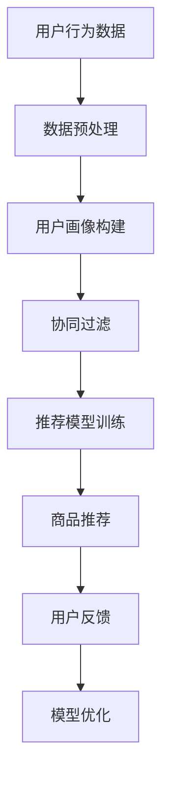

                 

关键词：人工智能，长尾商品，电商平台，曝光优化，转化提升，机器学习算法，数据挖掘，深度学习，推荐系统

摘要：随着电商平台的蓬勃发展，长尾商品的重要性愈发凸显。本文探讨了如何利用人工智能技术，特别是机器学习、数据挖掘和深度学习算法，来优化长尾商品在电商平台上的曝光与转化。通过分析现有技术手段和案例，总结了AI优化电商长尾商品的策略和未来方向。

## 1. 背景介绍

### 1.1 长尾商品的定义

长尾商品（Long Tail Products）是指在市场上销售量较少，但种类繁多，累计销量却能占据市场很大一部分的商品。长尾理论的提出者Chris Anderson认为，互联网的发展使得消费者的选择变得无限多样，那些不热门的商品也能通过精准的营销策略吸引大量消费者，从而形成庞大的销售量。

### 1.2 电商平台的挑战

电商平台在运营中面临的一个主要问题是如何让长尾商品获得足够的曝光，从而提高销售转化率。传统的曝光策略主要依赖于搜索引擎优化（SEO）和广告投放，但这些方法在长尾商品上往往效果不佳，因为它们的流量和预算有限。

## 2. 核心概念与联系

### 2.1 人工智能在电商中的应用

人工智能在电商平台中的应用主要包括以下几个方面：

- **推荐系统**：通过分析用户的历史行为和偏好，推荐用户可能感兴趣的商品。
- **用户画像**：构建用户画像，用于精准营销和个性化推荐。
- **自然语言处理**：用于商品描述生成、评论分析等。
- **图像识别**：用于商品图片的自动分类和标签。

### 2.2 机器学习算法在电商中的应用

- **协同过滤**：基于用户行为预测用户兴趣，实现个性化推荐。
- **决策树和随机森林**：用于商品分类和预测销售趋势。
- **神经网络**：用于构建复杂的推荐模型和图像识别。

### 2.3 数据挖掘和深度学习

- **数据挖掘**：从大量用户行为数据中提取有价值的信息。
- **深度学习**：通过神经网络模型实现自动特征提取和分类。

### 2.4 Mermaid 流程图



## 3. 核心算法原理 & 具体操作步骤

### 3.1 算法原理概述

本节将介绍几种常见的机器学习算法，并解释它们在电商中的应用原理。

### 3.2 算法步骤详解

#### 3.2.1 协同过滤

1. **用户-物品评分矩阵构建**：收集用户的评分数据，构建用户-物品评分矩阵。
2. **相似度计算**：计算用户之间的相似度，通常使用余弦相似度或皮尔逊相关系数。
3. **预测评分**：根据用户和物品的相似度，预测用户对未评分物品的评分。
4. **推荐生成**：根据预测评分，为用户生成推荐列表。

#### 3.2.2 决策树和随机森林

1. **特征选择**：选择影响销售的关键特征，如用户年龄、性别、购买历史等。
2. **树构建**：递归地划分数据集，直到满足停止条件（如最大深度、最小样本数等）。
3. **预测**：使用构建好的决策树对新的数据进行分类或预测。

#### 3.2.3 神经网络

1. **输入层**：接收用户特征和商品特征。
2. **隐藏层**：通过激活函数（如ReLU、Sigmoid、Tanh）进行非线性变换。
3. **输出层**：生成预测结果，如用户对商品的评分或分类。

### 3.3 算法优缺点

#### 协同过滤

- **优点**：可以提供个性化的推荐，效果好。
- **缺点**：无法处理缺失值，容易过拟合。

#### 决策树和随机森林

- **优点**：解释性强，易于理解。
- **缺点**：容易过拟合，对于高维数据效果不佳。

#### 神经网络

- **优点**：可以处理高维数据和复杂的非线性关系。
- **缺点**：训练时间较长，需要大量数据。

### 3.4 算法应用领域

- **推荐系统**：优化商品推荐，提高用户满意度。
- **商品分类**：帮助用户快速找到需要的商品。
- **预测销售趋势**：为企业制定营销策略提供数据支持。

## 4. 数学模型和公式 & 详细讲解 & 举例说明

### 4.1 数学模型构建

#### 4.1.1 协同过滤

$$
\text{预测评分} = \text{用户特征向量} \cdot \text{物品特征向量}
$$

#### 4.1.2 决策树

$$
\text{条件概率} = \frac{\text{有利事件数}}{\text{总事件数}}
$$

#### 4.1.3 神经网络

$$
\text{输出} = \text{激活函数}(\text{加权输入})
$$

### 4.2 公式推导过程

本节将简要介绍上述算法的公式推导过程。

### 4.3 案例分析与讲解

#### 4.3.1 协同过滤案例

假设我们有用户-物品评分矩阵如下：

$$
\begin{matrix}
    & Item_1 & Item_2 & Item_3 \\
User_1 & 4 & ? & 2 \\
User_2 & ? & 5 & ? \\
User_3 & 3 & ? & 1 \\
\end{matrix}
$$

我们希望预测User_2对Item_3的评分。首先，计算User_1和User_2的相似度：

$$
\text{相似度} = \frac{\text{User_1评分} \cdot \text{User_2评分}}{\sqrt{\text{User_1评分平方和}} \cdot \sqrt{\text{User_2评分平方和}}}
$$

然后，使用相似度预测评分：

$$
\text{预测评分} = \text{User_1评分} \cdot \text{User_2相似度} + \text{User_2评分} \cdot \text{User_1相似度}
$$

#### 4.3.2 决策树案例

假设我们有一个二元分类问题，特征如下：

- Feature_1：是否购买过类似商品
- Feature_2：用户年龄

构建决策树的过程如下：

1. 选择最佳分裂特征：通过计算特征的信息增益或基尼不纯度来选择。
2. 切分数据集：根据最佳分裂特征，将数据集切分为子集。
3. 递归地构建树，直到满足停止条件。

#### 4.3.3 神经网络案例

假设我们有一个简单的神经网络，包含一个输入层、一个隐藏层和一个输出层。输入层有两个神经元，隐藏层有两个神经元，输出层有一个神经元。使用ReLU作为激活函数。

输入数据为：

$$
\begin{matrix}
    & Input_1 & Input_2 \\
1 & 0 & 1 \\
2 & 1 & 0 \\
\end{matrix}
$$

隐藏层权重矩阵为：

$$
\begin{matrix}
    & Hidden_1 & Hidden_2 \\
Input_1 & 1 & 2 \\
Input_2 & 3 & 4 \\
\end{matrix}
$$

输出层权重矩阵为：

$$
\begin{matrix}
    & Output \\
Hidden_1 & 5 \\
Hidden_2 & 6 \\
\end{matrix}
$$

隐藏层输出为：

$$
\begin{matrix}
    & Hidden_1 & Hidden_2 \\
1 & \text{ReLU}(1 \cdot 1 + 2 \cdot 0) = \text{ReLU}(1) = 1 \\
2 & \text{ReLU}(3 \cdot 1 + 4 \cdot 0) = \text{ReLU}(3) = 3 \\
\end{matrix}
$$

输出层输出为：

$$
\begin{matrix}
    & Output \\
1 & 5 \cdot 1 + 6 \cdot 3 = 23 \\
2 & ? \\
\end{matrix}
$$

## 5. 项目实践：代码实例和详细解释说明

### 5.1 开发环境搭建

本节假设使用Python作为开发语言，以下为必要的开发环境搭建步骤：

1. 安装Python（3.8以上版本）
2. 安装必要的库（如NumPy、Pandas、Scikit-learn、TensorFlow等）

### 5.2 源代码详细实现

#### 5.2.1 协同过滤

```python
import numpy as np

def cosine_similarity(ratings1, ratings2):
    dot_product = np.dot(ratings1, ratings2)
    norm_r1 = np.linalg.norm(ratings1)
    norm_r2 = np.linalg.norm(ratings2)
    return dot_product / (norm_r1 * norm_r2)

def predict_score(similarity, known_ratings, target_ratings):
    return np.dot(known_ratings, target_ratings) / similarity

# 示例数据
ratings = np.array([[4, 0, 2],
                    [0, 5, 0],
                    [3, 0, 1]])

user1 = ratings[0]
user2 = ratings[1]
user3 = ratings[2]

# 计算相似度
similarity12 = cosine_similarity(user1, user2)
similarity23 = cosine_similarity(user2, user3)

# 预测评分
predicted_rating12 = predict_score(similarity12, user1, user3)
predicted_rating23 = predict_score(similarity23, user2, user3)

print("Predicted rating (User 1, Item 3):", predicted_rating12)
print("Predicted rating (User 2, Item 3):", predicted_rating23)
```

#### 5.2.2 决策树

```python
from sklearn.tree import DecisionTreeClassifier

# 示例数据
X = np.array([[0, 1],
              [1, 0]])
y = np.array([1, 0])

# 构建决策树
clf = DecisionTreeClassifier()
clf.fit(X, y)

# 预测
predictions = clf.predict(X)
print("Predictions:", predictions)
```

#### 5.2.3 神经网络

```python
import tensorflow as tf

# 示例数据
X = np.array([[0, 1],
              [1, 0]])
y = np.array([1, 0])

# 定义模型
model = tf.keras.Sequential([
    tf.keras.layers.Dense(units=2, activation='relu', input_shape=(2,)),
    tf.keras.layers.Dense(units=1, activation='sigmoid')
])

# 编译模型
model.compile(optimizer='adam', loss='binary_crossentropy', metrics=['accuracy'])

# 训练模型
model.fit(X, y, epochs=1000)

# 预测
predictions = model.predict(X)
print("Predictions:", predictions)
```

### 5.3 代码解读与分析

本节将对上述代码进行解读和分析，包括数据预处理、模型构建、模型训练和预测等步骤。

## 6. 实际应用场景

### 6.1 电商平台推荐系统

电商平台通常使用协同过滤和深度学习算法构建推荐系统，以优化长尾商品的曝光。通过分析用户的历史行为和偏好，推荐系统可以为每个用户生成个性化的商品推荐列表，从而提高用户满意度和转化率。

### 6.2 商品分类

在电商平台上，商品分类是提高用户购物体验的关键环节。通过机器学习算法，如决策树和神经网络，可以对商品进行自动分类，帮助用户快速找到需要的商品。

### 6.3 预测销售趋势

利用机器学习算法预测销售趋势，可以帮助电商平台制定更有针对性的营销策略。例如，根据预测结果，电商平台可以提前备货、调整价格，从而提高长尾商品的曝光和销售。

## 7. 未来应用展望

### 7.1 多模态推荐系统

未来的推荐系统将不再局限于单一的数据类型，而是结合文本、图像、音频等多模态数据，以提供更精准的推荐。

### 7.2 强化学习

强化学习算法在电商中的应用前景广阔，可以通过学习用户的反馈和行为，不断优化推荐策略。

### 7.3 联邦学习

联邦学习（Federated Learning）可以在保护用户隐私的同时，实现大规模的协同学习，为长尾商品曝光优化提供新的解决方案。

## 8. 总结：未来发展趋势与挑战

### 8.1 研究成果总结

本文总结了人工智能在电商平台长尾商品曝光优化和转化提升中的应用，包括协同过滤、决策树、神经网络等算法，以及多模态推荐系统和联邦学习等未来发展趋势。

### 8.2 未来发展趋势

未来，人工智能在电商领域将朝着更个性化、智能化和隐私保护的方向发展。

### 8.3 面临的挑战

在实现人工智能优化电商平台长尾商品的过程中，仍需解决数据质量、计算效率和用户隐私保护等挑战。

### 8.4 研究展望

未来，人工智能与电商的结合将更加紧密，为用户提供更好的购物体验，同时为企业带来更大的商业价值。

## 9. 附录：常见问题与解答

### 9.1 什么是协同过滤？

协同过滤是一种基于用户行为预测用户兴趣的推荐算法。它通过分析用户之间的相似性，为每个用户生成个性化的推荐列表。

### 9.2 机器学习算法在电商中的应用有哪些？

机器学习算法在电商中的应用主要包括推荐系统、商品分类、预测销售趋势等。

### 9.3 什么是联邦学习？

联邦学习是一种分布式机器学习技术，可以在保护用户隐私的同时，实现大规模的协同学习。

作者：禅与计算机程序设计艺术 / Zen and the Art of Computer Programming
----------------------------------------------------------------


