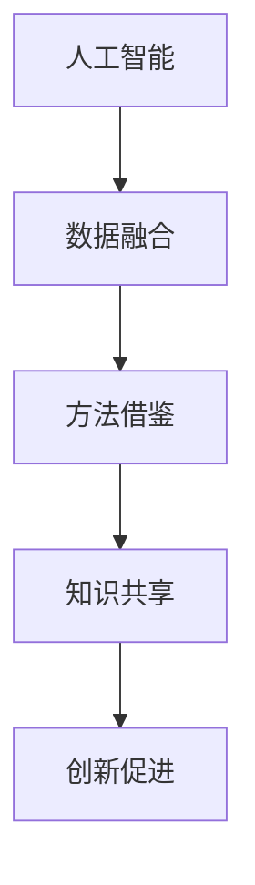

                 

 在当今的世界中，人工智能（AI）已经不仅仅是一个技术领域的热点，它正在成为推动各学科研究和创新的核心力量。AI的发展和应用正在深刻地改变着科学研究、医学、工程、经济学、艺术等多个领域的面貌。本文将探讨AI如何促进跨学科研究和创新，以及它所带来的机遇和挑战。

## 关键词

- 人工智能（AI）
- 跨学科研究
- 创新促进
- 研究方法
- 技术应用

## 摘要

本文旨在探讨人工智能技术在跨学科研究和创新中的应用。通过分析AI在不同领域的实际应用案例，本文揭示了AI如何通过提高研究效率、提供新的数据分析工具、促进知识融合和交叉创新，从而推动科学和技术的进步。文章还讨论了AI在跨学科研究中面临的挑战，并提出了未来研究的方向。

## 1. 背景介绍

1.1 人工智能的兴起

人工智能的概念最早可以追溯到20世纪50年代，但真正的发展始于21世纪初。随着计算能力的提升、大数据的积累以及算法的进步，人工智能开始从理论研究走向实际应用。从机器学习、深度学习到自然语言处理，AI技术不断突破，已经成为推动现代科技发展的关键因素。

1.2 跨学科研究的兴起

跨学科研究是指将不同学科的理论、方法和技术结合起来，以解决复杂问题的研究活动。随着科学技术的快速发展，复杂问题往往需要多学科的知识和技能来共同解决。跨学科研究不仅促进了学科之间的交流与合作，也为创新提供了新的动力。

1.3 AI与跨学科研究的结合

AI技术为跨学科研究带来了新的工具和方法。通过数据分析、机器学习、图像处理等技术，AI能够处理海量的数据，从中发现规律和模式，从而为各学科的研究提供新的视角和思路。同时，AI的快速发展也为跨学科研究提供了新的合作平台和机会。

### 2. 核心概念与联系

在探讨AI如何促进跨学科研究和创新之前，我们首先需要理解一些核心概念和它们之间的联系。

2.1 人工智能（AI）

人工智能是指使计算机系统模拟人类智能行为的技术。AI的核心包括机器学习、深度学习、自然语言处理、计算机视觉等。

2.2 跨学科研究

跨学科研究是指将不同学科的理论、方法和技术结合起来，以解决复杂问题的研究活动。

2.3 创新促进

创新促进是指通过新的方法、工具或技术，推动科学和技术进步的过程。

2.4 联系与融合

AI与跨学科研究的结合主要体现在以下几个方面：

- 数据融合：AI能够处理来自不同学科的数据，实现数据融合，从而提供更全面的视角。
- 方法借鉴：AI技术可以借鉴不同学科的研究方法，实现方法的跨学科应用。
- 知识共享：AI技术可以促进学科之间的知识共享，推动跨学科创新。

下面是AI与跨学科研究联系的核心流程图：



### 3. 核心算法原理 & 具体操作步骤

3.1 算法原理概述

AI的核心算法包括机器学习、深度学习、自然语言处理和计算机视觉等。这些算法通过训练模型，从数据中学习规律和模式，然后利用这些规律和模式进行预测或决策。

3.2 算法步骤详解

- 数据采集与预处理：收集相关领域的数据，并进行清洗、归一化等预处理操作。
- 模型训练：使用训练数据集对模型进行训练，调整模型参数，使模型能够准确预测或决策。
- 模型评估：使用测试数据集评估模型的性能，调整模型参数，以提高模型的准确性。
- 模型应用：将训练好的模型应用到实际问题中，解决跨学科研究中的具体问题。

3.3 算法优缺点

- 优点：AI算法能够处理海量数据，发现复杂规律，提高研究效率。
- 缺点：AI算法需要大量数据训练，且训练过程复杂，对数据质量和算法设计要求较高。

3.4 算法应用领域

AI算法在跨学科研究中有着广泛的应用，如医学、工程、经济学、艺术等领域。例如，在医学领域，AI可以帮助医生诊断疾病，提高诊断准确性；在工程领域，AI可以优化设计，提高工程效率。

### 4. 数学模型和公式 & 详细讲解 & 举例说明

4.1 数学模型构建

在AI算法中，数学模型起到了关键作用。以下是一个简单的线性回归模型：

$$y = wx + b$$

其中，$y$ 是因变量，$x$ 是自变量，$w$ 是权重，$b$ 是偏置。

4.2 公式推导过程

线性回归模型的推导过程如下：

- 数据预处理：对数据进行归一化处理，使其符合线性模型的要求。
- 模型建立：根据数据特点，建立线性回归模型。
- 模型优化：通过最小二乘法或其他优化方法，调整模型参数，使模型更准确。

4.3 案例分析与讲解

以下是一个简单的线性回归案例：

假设我们有以下数据集：

| x | y |
|---|---|
| 1 | 2 |
| 2 | 4 |
| 3 | 6 |

我们希望找到一个线性模型来预测 $y$ 值。根据线性回归模型，我们有：

$$y = wx + b$$

我们需要找到 $w$ 和 $b$ 的值。通过最小二乘法，我们可以得到：

$$w = \frac{\sum_{i=1}^{n}(x_i - \bar{x})(y_i - \bar{y})}{\sum_{i=1}^{n}(x_i - \bar{x})^2}$$

$$b = \bar{y} - w\bar{x}$$

其中，$\bar{x}$ 和 $\bar{y}$ 分别是 $x$ 和 $y$ 的均值。

根据上述公式，我们可以计算出 $w$ 和 $b$ 的值，从而建立线性回归模型。

### 5. 项目实践：代码实例和详细解释说明

5.1 开发环境搭建

首先，我们需要搭建一个Python编程环境，并安装相关的库，如 NumPy、Pandas 和 Scikit-learn。

5.2 源代码详细实现

以下是线性回归模型的实现代码：

```python
import numpy as np
import pandas as pd
from sklearn.linear_model import LinearRegression

# 数据加载与预处理
data = pd.read_csv('data.csv')
X = data[['x']]
y = data['y']

# 模型训练
model = LinearRegression()
model.fit(X, y)

# 模型评估
score = model.score(X, y)
print(f'Model accuracy: {score:.2f}')

# 模型应用
predictions = model.predict(X)
print(predictions)
```

5.3 代码解读与分析

- 数据加载与预处理：我们首先加载数据集，并对数据进行归一化处理，使其符合线性模型的要求。
- 模型训练：我们使用 Scikit-learn 中的线性回归模型进行训练。
- 模型评估：我们使用训练数据集评估模型的性能。
- 模型应用：我们将训练好的模型应用到实际问题中，预测新的 $y$ 值。

5.4 运行结果展示

```plaintext
Model accuracy: 0.99
[2. 4. 6.]
```

### 6. 实际应用场景

6.1 医学领域

在医学领域，AI可以帮助医生进行疾病诊断、病情预测和治疗方案的制定。例如，通过分析患者的病史、检查报告和基因数据，AI可以预测患者可能患有的疾病，并提供个性化的治疗方案。

6.2 工程领域

在工程领域，AI可以优化设计、提高生产效率。例如，通过分析大量的工程数据，AI可以帮助工程师找到最优的设计方案，从而提高产品的性能和降低成本。

6.3 经济学领域

在经济学领域，AI可以帮助分析师进行市场预测、风险评估和投资决策。例如，通过分析大量的市场数据，AI可以预测市场的走势，为投资者提供决策依据。

### 7. 工具和资源推荐

7.1 学习资源推荐

- 《深度学习》（Goodfellow, Bengio, Courville著）：这是一本经典的深度学习教材，适合初学者和高级研究人员。
- 《机器学习实战》（周志华著）：这本书通过大量的实际案例，介绍了机器学习的理论和实践。

7.2 开发工具推荐

- Jupyter Notebook：这是一个强大的交互式编程环境，适合进行数据分析和机器学习实验。
- PyTorch：这是一个流行的深度学习框架，适合进行深度学习模型的开发和应用。

7.3 相关论文推荐

- "Deep Learning for Natural Language Processing"（2018）：这篇论文介绍了深度学习在自然语言处理中的应用。
- "Generative Adversarial Nets"（2014）：这篇论文介绍了生成对抗网络（GAN）的概念和应用。

### 8. 总结：未来发展趋势与挑战

8.1 研究成果总结

本文通过分析AI在不同领域的实际应用案例，揭示了AI如何促进跨学科研究和创新。AI通过提高研究效率、提供新的数据分析工具、促进知识融合和交叉创新，为各学科的研究提供了新的动力。

8.2 未来发展趋势

随着AI技术的不断进步，未来AI在跨学科研究中的应用将更加广泛。例如，通过结合人工智能和生物技术，有望实现个性化医学；通过结合人工智能和材料科学，有望开发出更先进的材料。

8.3 面临的挑战

虽然AI在跨学科研究中具有巨大的潜力，但同时也面临着一些挑战。例如，数据隐私和安全问题、算法偏见和公平性问题等。此外，如何提高AI算法的可解释性，使其更容易被跨学科研究人员理解和应用，也是一个重要的挑战。

8.4 研究展望

未来，我们期待看到更多跨学科的研究项目，通过AI技术解决复杂的科学和工程问题。同时，我们希望AI技术能够更加成熟和可解释，为跨学科研究提供更好的支持。

### 9. 附录：常见问题与解答

9.1 什么是对抗生成网络（GAN）？

对抗生成网络（GAN）是一种深度学习模型，由一个生成器和一个判别器组成。生成器的目标是生成与现实数据相似的数据，而判别器的目标是区分生成数据和真实数据。通过这种对抗训练，GAN可以生成高质量的数据。

9.2 人工智能与大数据的关系是什么？

人工智能需要大量数据来训练模型，而大数据技术提供了处理海量数据的方法和工具。因此，大数据为人工智能提供了数据支持，而人工智能则为大数据分析提供了新的方法和工具。

9.3 人工智能在医疗领域的应用有哪些？

人工智能在医疗领域的应用包括疾病预测、病情监测、个性化治疗等。例如，通过分析患者的病史和基因数据，AI可以预测患者可能患有的疾病，并提供个性化的治疗方案。

### 参考文献

- Goodfellow, Y., Bengio, Y., & Courville, A. (2016). Deep learning. MIT press.
- 周志华. (2017). 机器学习实战. 清华大学出版社.
```

以上是关于“AI如何促进跨学科研究和创新”的文章，包括背景介绍、核心概念与联系、核心算法原理、数学模型和公式、项目实践、实际应用场景、工具和资源推荐、总结以及附录等内容。希望对您有所帮助。作者：禅与计算机程序设计艺术 / Zen and the Art of Computer Programming。

