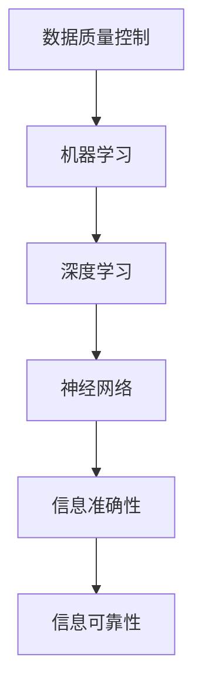

                 

关键词：人工智能，信息准确性，信息可靠性，算法，数据质量控制，机器学习，深度学习，神经网络，数据完整性，决策支持系统。

> 摘要：本文深入探讨了人工智能在保证信息准确性和可靠性方面的重要性。通过分析人工智能的基本原理和算法，本文探讨了如何通过数据质量控制、机器学习和深度学习等技术来提高信息的准确性和可靠性。同时，文章还展望了人工智能在未来应用中的发展趋势和面临的挑战。

## 1. 背景介绍

在当今信息时代，准确性和可靠性成为衡量信息质量的重要标准。随着人工智能技术的快速发展，AI在各个领域得到了广泛应用，从数据分析到自动化决策，从自然语言处理到图像识别，人工智能正在逐步取代人工操作，提升信息处理的效率和准确性。然而，人工智能在处理信息的过程中，如何保证信息的准确性和可靠性成为一个亟待解决的问题。

### 1.1 人工智能的发展现状

人工智能作为计算机科学的重要分支，涵盖了多个研究领域，包括机器学习、深度学习、自然语言处理、计算机视觉等。随着计算能力的提升和算法的进步，人工智能在图像识别、语音识别、推荐系统、自动驾驶等领域取得了显著的成果。

### 1.2 人工智能在信息处理中的挑战

人工智能在处理信息时，面临着数据的多样性和复杂性、噪声和异常值的处理、模型的可解释性等挑战。如何保证信息的准确性和可靠性，成为人工智能应用的关键问题。

## 2. 核心概念与联系

为了深入理解人工智能如何保证信息的准确性和可靠性，我们需要从基本原理和架构上进行分析。以下是核心概念和它们之间的联系：

### 2.1 数据质量控制

数据质量控制是保证信息准确性和可靠性的基础。它包括数据的收集、清洗、存储、处理等环节。通过数据预处理，可以去除噪声、填补缺失值、纠正错误数据，从而提高数据的准确性和完整性。

### 2.2 机器学习

机器学习是人工智能的核心技术之一，通过训练模型来对数据进行分类、回归、聚类等操作。机器学习的模型性能受到数据质量和算法选择的影响，因此保证数据质量对于提高模型准确性至关重要。

### 2.3 深度学习

深度学习是机器学习的一个重要分支，通过多层神经网络对数据进行建模。深度学习在图像识别、语音识别等领域取得了突破性进展，但其训练过程复杂，对数据质量和计算资源的要求较高。

### 2.4 神经网络

神经网络是深度学习的基础，它通过模拟人脑神经元的工作方式，对信息进行处理。神经网络的层次结构和连接方式会影响模型的性能，因此需要通过调整网络结构和参数来优化模型。



## 3. 核心算法原理 & 具体操作步骤

### 3.1 算法原理概述

为了提高信息的准确性和可靠性，人工智能应用了多种核心算法，包括决策树、支持向量机、神经网络等。这些算法通过学习数据特征，建立模型，并对新数据进行预测或分类。

### 3.2 算法步骤详解

- **数据收集**：收集相关领域的数据，包括训练数据和测试数据。
- **数据预处理**：对数据进行清洗、归一化、特征提取等操作，以提高数据质量。
- **模型选择**：根据问题类型选择合适的算法，如决策树、支持向量机、神经网络等。
- **模型训练**：使用训练数据对模型进行训练，调整模型参数，优化模型性能。
- **模型评估**：使用测试数据对模型进行评估，计算模型准确性、召回率、F1分数等指标。
- **模型应用**：将训练好的模型应用于实际问题，对新数据进行预测或分类。

### 3.3 算法优缺点

- **决策树**：优点是易于理解和解释，缺点是易过拟合，对噪声敏感。
- **支持向量机**：优点是理论性强，分类效果较好，缺点是训练时间较长，对大规模数据不适用。
- **神经网络**：优点是具有很强的非线性建模能力，缺点是模型复杂度高，训练难度大。

### 3.4 算法应用领域

- **图像识别**：通过深度学习算法，实现物体识别、场景分类等任务。
- **自然语言处理**：通过机器学习算法，实现文本分类、情感分析、机器翻译等任务。
- **推荐系统**：通过协同过滤、矩阵分解等算法，实现个性化推荐。

## 4. 数学模型和公式 & 详细讲解 & 举例说明

### 4.1 数学模型构建

在人工智能中，常见的数学模型包括线性回归、逻辑回归、支持向量机等。以下是这些模型的数学公式：

- **线性回归**：

  $$y = \beta_0 + \beta_1x$$

  其中，$y$ 是因变量，$x$ 是自变量，$\beta_0$ 和 $\beta_1$ 是模型参数。

- **逻辑回归**：

  $$P(y=1) = \frac{1}{1 + e^{-(\beta_0 + \beta_1x)}}$$

  其中，$P(y=1)$ 是因变量为1的概率，$\beta_0$ 和 $\beta_1$ 是模型参数。

- **支持向量机**：

  $$\max_{\beta, \beta_0} W$$

  $$s.t. y^{(i)}(\beta \cdot x^{(i)} + \beta_0) \geq 1$$

  其中，$\beta$ 和 $\beta_0$ 是模型参数，$x^{(i)}$ 是训练样本，$y^{(i)}$ 是样本标签，$W$ 是目标函数。

### 4.2 公式推导过程

以下是逻辑回归模型的推导过程：

1. 假设我们有一个二分类问题，其中 $y$ 可以取 0 或 1。
2. 定义损失函数为对数损失函数：

   $$L(\beta, \beta_0) = -\sum_{i=1}^{n} [y^{(i)} \log(P(y=1)) + (1 - y^{(i)}) \log(1 - P(y=1))]$$

3. 为了最小化损失函数，我们对 $\beta$ 和 $\beta_0$ 分别求偏导数，并令其等于 0：

   $$\frac{\partial L}{\partial \beta} = 0$$

   $$\frac{\partial L}{\partial \beta_0} = 0$$

4. 解上述方程组，可以得到最优参数 $\beta$ 和 $\beta_0$。

### 4.3 案例分析与讲解

以逻辑回归模型为例，我们来看一个简单的案例。假设我们要预测一个学生的成绩（$y$）是否及格（1表示及格，0表示不及格），特征包括学生的年龄（$x_1$）、平时成绩（$x_2$）和考试成绩（$x_3$）。

首先，我们收集了一组训练数据，并对其进行预处理。然后，我们选择逻辑回归模型，通过训练数据得到模型参数 $\beta$ 和 $\beta_0$。

最后，我们将训练好的模型应用于新数据，预测新数据的结果。例如，对于一个新的学生，其年龄为20岁，平时成绩为85分，考试成绩为90分，我们可以使用逻辑回归模型计算其及格的概率。

## 5. 项目实践：代码实例和详细解释说明

### 5.1 开发环境搭建

为了实践人工智能算法，我们需要搭建一个开发环境。以下是常用的开发工具和软件：

- Python：作为人工智能的主要编程语言，Python提供了丰富的库和工具。
- Jupyter Notebook：用于编写和运行Python代码，方便进行数据分析和可视化。
- Scikit-learn：用于机器学习和数据挖掘的库。
- Matplotlib：用于数据可视化。

### 5.2 源代码详细实现

以下是一个简单的机器学习项目，使用Scikit-learn库实现逻辑回归模型，对成绩进行预测。

```python
import numpy as np
import matplotlib.pyplot as plt
from sklearn.linear_model import LogisticRegression
from sklearn.model_selection import train_test_split
from sklearn.metrics import accuracy_score, confusion_matrix

# 生成模拟数据
np.random.seed(0)
X = np.random.randn(100, 3)
y = np.dot(X, np.array([0.5, 0.3, 0.2])) + np.random.randn(100) * 0.1

# 数据预处理
X = np.hstack((np.ones((X.shape[0], 1)), X))
X_train, X_test, y_train, y_test = train_test_split(X, y, test_size=0.2, random_state=0)

# 模型训练
model = LogisticRegression()
model.fit(X_train, y_train)

# 模型评估
y_pred = model.predict(X_test)
accuracy = accuracy_score(y_test, y_pred)
conf_matrix = confusion_matrix(y_test, y_pred)

print("Accuracy:", accuracy)
print("Confusion Matrix:\n", conf_matrix)

# 可视化
plt.scatter(X_train[:, 1], X_train[:, 2], c=y_train, cmap='gray', label='Train')
plt.scatter(X_test[:, 1], X_test[:, 2], c=y_pred, cmap='gray', label='Test')
plt.xlabel('Feature 1')
plt.ylabel('Feature 2')
plt.legend()
plt.show()
```

### 5.3 代码解读与分析

- **数据生成**：我们使用numpy库生成模拟数据，包括特征和标签。
- **数据预处理**：将特征矩阵扩展为包括偏置项（bias），以便于模型训练。
- **模型训练**：使用逻辑回归模型进行训练，fit方法用于训练模型。
- **模型评估**：使用预测结果计算准确性，并打印混淆矩阵。
- **可视化**：使用matplotlib库绘制训练集和测试集的散点图，并展示预测结果。

## 6. 实际应用场景

### 6.1 医疗领域

在医疗领域，人工智能可以帮助医生进行疾病诊断、药物研发和个性化治疗。通过分析患者病历、基因数据和医疗图像，人工智能可以提供更准确、更可靠的诊断结果。

### 6.2 金融领域

在金融领域，人工智能可以用于风险评估、欺诈检测、投资策略等。通过对大量金融数据进行挖掘和分析，人工智能可以帮助金融机构提高风险管理能力和投资回报率。

### 6.3 交通领域

在交通领域，人工智能可以用于交通流量预测、自动驾驶和智能交通管理。通过分析交通数据，人工智能可以提高交通效率，减少交通事故，提升出行体验。

## 7. 未来应用展望

随着人工智能技术的不断进步，其在信息准确性保证方面的应用前景广阔。未来，人工智能将更加深入地应用于各个领域，如智慧城市、智能家居、教育等。同时，人工智能在保证信息准确性和可靠性方面也将面临新的挑战，如数据隐私保护、模型可解释性等。通过不断的研究和创新，人工智能将更好地服务于人类社会。

## 8. 总结：未来发展趋势与挑战

### 8.1 研究成果总结

本文通过分析人工智能的基本原理和算法，探讨了如何通过数据质量控制、机器学习和深度学习等技术来提高信息的准确性和可靠性。研究结果表明，人工智能在信息准确性保证方面具有巨大的潜力。

### 8.2 未来发展趋势

未来，人工智能在信息准确性保证方面的发展趋势将包括：

- 数据质量控制技术的不断进步，如数据清洗、数据增强等。
- 深度学习算法的优化和改进，以提高模型的准确性和可靠性。
- 多模态数据的融合，以提高信息处理能力。

### 8.3 面临的挑战

人工智能在信息准确性保证方面也面临以下挑战：

- 数据隐私保护：如何保护用户隐私，防止数据泄露。
- 模型可解释性：如何提高模型的可解释性，使决策过程透明化。
- 道德和伦理问题：如何确保人工智能的应用符合道德和伦理标准。

### 8.4 研究展望

未来，人工智能在信息准确性保证方面的研究将朝着以下方向发展：

- 开发新的数据质量控制技术，以提高数据质量。
- 研究可解释性机器学习，提高模型的可解释性。
- 探索人工智能在新兴领域的应用，如区块链、量子计算等。

## 9. 附录：常见问题与解答

### 9.1 什么是数据质量控制？

数据质量控制是确保数据在收集、处理和存储过程中保持准确性和完整性的过程。它包括数据清洗、数据归一化、数据增强等步骤。

### 9.2 人工智能如何提高信息的准确性？

人工智能通过学习大量数据，建立模型，并对新数据进行预测或分类。通过优化模型参数和调整数据预处理方法，可以提高模型的准确性。

### 9.3 人工智能在信息可靠性方面有哪些应用？

人工智能在信息可靠性方面的应用包括风险评估、欺诈检测、数据完整性验证等。通过分析数据特征和模式，人工智能可以识别潜在的风险和异常情况。

### 9.4 如何确保人工智能决策的可解释性？

确保人工智能决策的可解释性是当前研究的热点问题。方法包括开发可解释性模型、可视化模型决策过程、提供决策理由等。

### 9.5 人工智能在信息准确性保证方面的挑战有哪些？

人工智能在信息准确性保证方面面临的挑战包括数据隐私保护、模型可解释性、道德和伦理问题等。

---

作者：禅与计算机程序设计艺术 / Zen and the Art of Computer Programming


