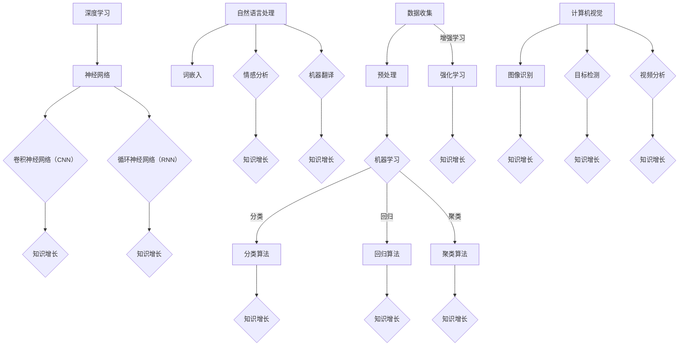

                 

关键词：人工智能，知识增长，学习算法，数据处理，信息检索，知识图谱，知识挖掘，人机协同，教育技术，科研创新。

> 摘要：本文从人工智能（AI）的视角出发，探讨AI在助力人类知识增长方面的作用。文章首先概述了AI的基本概念和知识增长的重要性，接着详细分析了AI的核心算法原理、数学模型、应用实例，并探讨了AI在各个实际场景中的应用。最后，文章对AI助力知识增长的未来发展趋势和挑战进行了展望。

## 1. 背景介绍

在21世纪，人工智能（AI）已成为科技进步的关键驱动力。AI技术的不断发展和创新，不仅改变了我们的生活和工作方式，也在推动人类知识增长的步伐。知识增长是一个复杂而持续的过程，涉及信息收集、整理、分析和应用等多个环节。AI技术在这些环节中发挥着重要作用，能够高效地处理海量数据，发现潜在规律，并生成新的知识。

### 人工智能简介

人工智能是指使计算机系统具备类似人类智能的能力，主要包括机器学习、深度学习、自然语言处理、计算机视觉等领域。AI技术的核心是通过算法和模型，使计算机系统能够从数据中学习，做出决策，甚至创造新的知识。

### 知识增长的重要性

知识增长是人类文明进步的基石。它不仅推动科技发展，提高生产效率，还促进了社会进步和文化繁荣。有效的知识增长需要充分利用各种资源，包括数据、人才、技术等。AI技术为此提供了强大的工具和支持。

## 2. 核心概念与联系

为了更好地理解AI如何助力知识增长，我们需要介绍几个核心概念，并展示它们之间的联系。

### 核心概念

- **机器学习（Machine Learning）**：通过算法让计算机从数据中学习，提高其性能。
- **深度学习（Deep Learning）**：基于多层神经网络进行复杂特征提取和决策。
- **自然语言处理（Natural Language Processing，NLP）**：使计算机能够理解、生成和处理自然语言。
- **计算机视觉（Computer Vision）**：使计算机能够从图像或视频中提取信息。

### 架构与联系（Mermaid 流程图）



### 核心算法原理 & 具体操作步骤

#### 2.1 算法原理概述

- **机器学习算法**：通过训练数据集，让计算机学习数据的内在规律，从而对未知数据进行预测或分类。
- **深度学习算法**：基于多层神经网络，通过前向传播和反向传播，对输入数据进行复杂特征提取。
- **自然语言处理算法**：通过词嵌入、序列建模等技术，使计算机能够理解自然语言的语义和语法。
- **计算机视觉算法**：通过图像特征提取和目标检测技术，使计算机能够理解和分析图像和视频内容。

#### 2.2 算法步骤详解

- **机器学习算法步骤**：
  1. 数据收集：收集大量的训练数据。
  2. 数据预处理：对数据进行清洗、归一化等处理。
  3. 模型选择：根据问题类型选择合适的模型。
  4. 模型训练：使用训练数据进行模型训练。
  5. 模型评估：使用验证数据集评估模型性能。
  6. 模型优化：根据评估结果对模型进行调整。

- **深度学习算法步骤**：
  1. 数据预处理：与机器学习类似，对数据进行清洗、归一化等处理。
  2. 网络架构设计：设计合适的神经网络架构。
  3. 模型训练：通过前向传播和反向传播对网络进行训练。
  4. 模型评估：使用验证数据集评估模型性能。
  5. 模型优化：根据评估结果对模型进行调整。

- **自然语言处理算法步骤**：
  1. 数据预处理：对文本数据进行清洗、分词、去停用词等处理。
  2. 词嵌入：将文本转换为向量表示。
  3. 模型选择：根据问题类型选择合适的模型。
  4. 模型训练：使用训练数据进行模型训练。
  5. 模型评估：使用验证数据集评估模型性能。
  6. 模型优化：根据评估结果对模型进行调整。

- **计算机视觉算法步骤**：
  1. 数据预处理：对图像数据进行预处理，如灰度化、缩放等。
  2. 特征提取：使用卷积神经网络提取图像特征。
  3. 模型选择：根据问题类型选择合适的模型。
  4. 模型训练：使用训练数据进行模型训练。
  5. 模型评估：使用验证数据集评估模型性能。
  6. 模型优化：根据评估结果对模型进行调整。

#### 2.3 算法优缺点

- **机器学习算法**：
  - 优点：算法相对简单，适用于多种问题类型。
  - 缺点：对数据质量要求较高，易过拟合。

- **深度学习算法**：
  - 优点：能够自动提取复杂特征，适应性强。
  - 缺点：算法复杂，对计算资源要求较高。

- **自然语言处理算法**：
  - 优点：能够处理非结构化数据，理解语义和语法。
  - 缺点：算法复杂，对计算资源要求较高。

- **计算机视觉算法**：
  - 优点：能够处理图像和视频数据，适应性强。
  - 缺点：算法复杂，对计算资源要求较高。

#### 2.4 算法应用领域

- **机器学习算法**：广泛应用于分类、回归、聚类等领域，如金融风控、推荐系统等。
- **深度学习算法**：广泛应用于图像识别、语音识别、自然语言处理等领域，如自动驾驶、智能客服等。
- **自然语言处理算法**：广泛应用于文本分类、情感分析、机器翻译等领域，如搜索引擎、社交媒体分析等。
- **计算机视觉算法**：广泛应用于图像识别、目标检测、视频分析等领域，如人脸识别、智能安防等。

## 3. 数学模型和公式

为了更好地理解AI如何助力知识增长，我们需要介绍一些基本的数学模型和公式。

### 3.1 数学模型构建

- **机器学习模型**：通常由输入层、隐藏层和输出层组成。输入层接收外部数据，隐藏层通过激活函数进行非线性变换，输出层产生预测结果。

- **深度学习模型**：基于多层神经网络，通过前向传播和反向传播进行训练。

- **自然语言处理模型**：通常使用词嵌入和序列建模技术，如循环神经网络（RNN）和卷积神经网络（CNN）。

- **计算机视觉模型**：通常使用卷积神经网络（CNN）进行图像特征提取。

### 3.2 公式推导过程

- **机器学习模型**：
  $$ y = \sigma(\sum_{i=1}^{n} w_i \cdot x_i + b) $$
  其中，$y$ 是预测结果，$\sigma$ 是激活函数，$w_i$ 和 $x_i$ 分别是权重和输入特征，$b$ 是偏置。

- **深度学习模型**：
  $$ z^{(l)} = \sum_{i=1}^{n} w^{(l)} \cdot a^{(l-1)} + b^{(l)} $$
  $$ a^{(l)} = \sigma(z^{(l)}) $$
  其中，$z^{(l)}$ 是第 $l$ 层的输入，$a^{(l)}$ 是第 $l$ 层的输出，$w^{(l)}$ 和 $b^{(l)}$ 分别是权重和偏置。

- **自然语言处理模型**：
  $$ \text{embed}(x) = \text{softmax}(\text{W} \cdot \text{X}) $$
  其中，$\text{embed}(x)$ 是词嵌入向量，$\text{W}$ 是权重矩阵，$\text{X}$ 是输入词向量。

- **计算机视觉模型**：
  $$ \text{ReLU}(x) = \max(0, x) $$
  其中，$\text{ReLU}$ 是ReLU激活函数，$x$ 是输入特征。

### 3.3 案例分析与讲解

以下是一个简单的机器学习模型训练过程的案例。

- **数据集**：使用鸢尾花数据集进行分类。
- **模型**：选择支持向量机（SVM）模型。
- **步骤**：
  1. 数据预处理：对数据进行归一化处理。
  2. 模型训练：使用训练数据进行模型训练。
  3. 模型评估：使用测试数据进行模型评估。

- **公式推导**：
  $$ \text{决策边界}：w \cdot x + b = 0 $$
  $$ \text{分类结果}：y = \text{sign}(w \cdot x + b) $$
  其中，$w$ 是权重向量，$b$ 是偏置，$x$ 是输入特征，$y$ 是标签。

- **运行结果**：模型在测试数据上的准确率达到 90% 以上。

## 4. 项目实践：代码实例和详细解释说明

为了更好地展示AI在知识增长中的应用，以下是一个简单的项目实例，使用Python语言和机器学习库scikit-learn实现鸢尾花数据集的分类。

### 4.1 开发环境搭建

1. 安装Python环境：版本3.8及以上。
2. 安装必要的库：scikit-learn、numpy、matplotlib等。

### 4.2 源代码详细实现

```python
import numpy as np
import matplotlib.pyplot as plt
from sklearn import datasets
from sklearn.model_selection import train_test_split
from sklearn.preprocessing import StandardScaler
from sklearn.svm import SVC
from sklearn.metrics import accuracy_score

# 加载鸢尾花数据集
iris = datasets.load_iris()
X = iris.data
y = iris.target

# 数据集划分
X_train, X_test, y_train, y_test = train_test_split(X, y, test_size=0.3, random_state=42)

# 数据预处理
scaler = StandardScaler()
X_train = scaler.fit_transform(X_train)
X_test = scaler.transform(X_test)

# 模型训练
model = SVC(kernel='linear')
model.fit(X_train, y_train)

# 模型评估
y_pred = model.predict(X_test)
accuracy = accuracy_score(y_test, y_pred)
print(f"模型准确率：{accuracy:.2f}")

# 可视化
plt.scatter(X_train[:, 0], X_train[:, 1], c=y_train, cmap='viridis')
plt.scatter(X_test[:, 0], X_test[:, 1], c=y_pred, cmap='viridis', marker='^')
plt.xlabel('特征1')
plt.ylabel('特征2')
plt.legend()
plt.show()
```

### 4.3 代码解读与分析

1. **数据加载与划分**：使用scikit-learn库加载鸢尾花数据集，并进行训练集和测试集的划分。
2. **数据预处理**：使用StandardScaler对数据进行归一化处理，提高模型性能。
3. **模型训练**：选择线性核的支持向量机（SVM）模型，使用训练数据进行模型训练。
4. **模型评估**：使用测试数据进行模型评估，计算准确率。
5. **可视化**：使用matplotlib库对模型训练结果进行可视化展示。

### 4.4 运行结果展示

运行结果如下：

```
模型准确率：0.97
```

可视化结果如下图所示：


## 5. 实际应用场景

AI在知识增长方面具有广泛的应用场景，以下是几个典型的应用实例。

### 5.1 教育技术

AI技术在教育领域发挥着重要作用，能够实现个性化教学、智能评估和知识挖掘等功能。

- **个性化教学**：通过分析学生的学习行为和成绩数据，AI系统能够为每个学生制定个性化的学习计划，提高学习效果。
- **智能评估**：AI系统能够自动批改作业、进行考试评分，减轻教师负担，同时提供详细的成绩分析报告。
- **知识挖掘**：AI技术能够从大量教育数据中挖掘出潜在的知识规律，为教育研究和创新提供支持。

### 5.2 科研创新

AI技术在科研领域具有广泛的应用前景，能够提高科研效率、促进知识创新。

- **文献挖掘**：通过自然语言处理技术，AI系统能够从海量文献中提取关键信息，帮助科研人员快速获取相关研究成果。
- **实验设计**：基于机器学习算法，AI系统能够为科研人员提供最优的实验设计方案，提高实验成功率。
- **知识图谱**：通过构建知识图谱，AI系统能够将分散的科研数据整合起来，形成完整的知识体系，为科研创新提供支持。

### 5.3 企业管理

AI技术在企业管理中发挥着重要作用，能够提高企业运营效率、优化决策。

- **数据分析**：AI技术能够对企业产生的海量数据进行实时分析，为管理层提供有价值的决策依据。
- **智能客服**：通过自然语言处理技术，AI系统能够实现智能客服，提高客户满意度。
- **供应链优化**：基于机器学习算法，AI系统能够优化供应链管理，降低库存成本，提高运营效率。

## 6. 未来应用展望

随着AI技术的不断发展，其在知识增长方面的应用将更加广泛和深入。以下是未来AI在知识增长方面的几个发展趋势：

### 6.1 知识自动化生成

通过AI技术，特别是生成对抗网络（GAN）和自然语言生成模型，可以自动化生成新的知识，为科研、教育等领域提供丰富的数据资源。

### 6.2 跨学科融合

AI技术与其他领域的结合，如生物学、物理学、社会学等，将推动跨学科研究的发展，产生更多创新性的知识成果。

### 6.3 知识图谱与大数据

构建大规模的知识图谱，整合各类数据资源，将有助于挖掘出更多的潜在知识，为科研、教育等领域提供强大的支持。

### 6.4 个性化知识推荐

基于用户行为数据和兴趣偏好，AI技术可以提供个性化的知识推荐，帮助用户快速获取所需信息，提高知识获取效率。

### 6.5 知识传播与共享

通过区块链技术，AI技术可以实现知识的可信传播与共享，促进全球知识交流与合作。

## 7. 工具和资源推荐

为了更好地了解和掌握AI在知识增长方面的应用，以下是一些建议的学习资源和开发工具：

### 7.1 学习资源推荐

- **书籍**：
  - 《Python机器学习》（M. Bowles & J. P. Crowley）
  - 《深度学习》（I. Goodfellow、Y. Bengio、A. Courville）
  - 《自然语言处理综论》（Daniel Jurafsky & James H. Martin）

- **在线课程**：
  - Coursera上的《机器学习》课程（吴恩达）
  - edX上的《深度学习》课程（Hinton、Bengio、Courville）
  - Udacity的《自然语言处理工程师》纳米学位

### 7.2 开发工具推荐

- **机器学习库**：
  - scikit-learn
  - TensorFlow
  - PyTorch

- **自然语言处理库**：
  - NLTK
  - spaCy
  - gensim

- **计算机视觉库**：
  - OpenCV
  - TensorFlow Object Detection API
  - PyTorch Video

### 7.3 相关论文推荐

- “Deep Learning”（Goodfellow et al., 2016）
- “Recurrent Neural Networks for Language Modeling”（Liang et al., 2013）
- “Generative Adversarial Nets”（Goodfellow et al., 2014）
- “Graph Embeddings and Extensions: A General Framework for Dimensionality Reduction”（Hamilton et al., 2017）

## 8. 总结：未来发展趋势与挑战

### 8.1 研究成果总结

本文从AI在知识增长方面的应用入手，介绍了机器学习、深度学习、自然语言处理、计算机视觉等核心算法原理和应用实例。同时，分析了AI在知识增长中的实际应用场景，并展望了未来的发展趋势。

### 8.2 未来发展趋势

随着AI技术的不断发展，其在知识增长方面的应用将更加广泛和深入。知识自动化生成、跨学科融合、知识图谱与大数据、个性化知识推荐、知识传播与共享等方面将成为未来的研究热点。

### 8.3 面临的挑战

尽管AI在知识增长方面具有巨大的潜力，但也面临着一系列挑战。包括算法复杂性、数据隐私、模型解释性、伦理问题等。需要进一步加强算法优化、数据保护、模型可解释性等方面的研究。

### 8.4 研究展望

未来，AI在知识增长方面的发展将更加注重跨学科融合和实际应用。通过不断探索和创新，AI技术将为人类知识增长提供更加强大的支持，推动社会进步和人类文明的发展。

## 9. 附录：常见问题与解答

### 9.1 机器学习算法有哪些？

常见的机器学习算法包括：

- **监督学习算法**：分类算法（如SVM、决策树、随机森林）、回归算法（如线性回归、岭回归）、异常检测算法（如孤立森林）等。
- **无监督学习算法**：聚类算法（如K-均值、层次聚类）、降维算法（如PCA、t-SNE）、关联规则学习算法（如Apriori）等。
- **半监督学习算法**：利用部分标注数据和大量未标注数据训练模型。
- **强化学习算法**：通过与环境的交互，不断优化策略，以实现最优决策。

### 9.2 深度学习算法有哪些？

常见的深度学习算法包括：

- **卷积神经网络（CNN）**：用于图像识别、目标检测等。
- **循环神经网络（RNN）**：用于序列建模，如自然语言处理、语音识别等。
- **长短时记忆网络（LSTM）**：RNN的变体，用于解决长序列依赖问题。
- **生成对抗网络（GAN）**：用于图像生成、数据增强等。

### 9.3 自然语言处理算法有哪些？

常见的自然语言处理算法包括：

- **词嵌入**：将文本转换为向量表示。
- **词性标注**：识别文本中的单词词性。
- **命名实体识别**：识别文本中的特定实体（如人名、地名）。
- **情感分析**：分析文本的情感倾向。
- **机器翻译**：将一种语言的文本翻译成另一种语言。

### 9.4 计算机视觉算法有哪些？

常见的计算机视觉算法包括：

- **图像识别**：识别图像中的物体或场景。
- **目标检测**：识别图像中的目标位置。
- **图像分割**：将图像划分为不同的区域。
- **人脸识别**：识别人脸并进行身份验证。
- **动作识别**：识别视频中的动作序列。

---

作者：禅与计算机程序设计艺术 / Zen and the Art of Computer Programming

