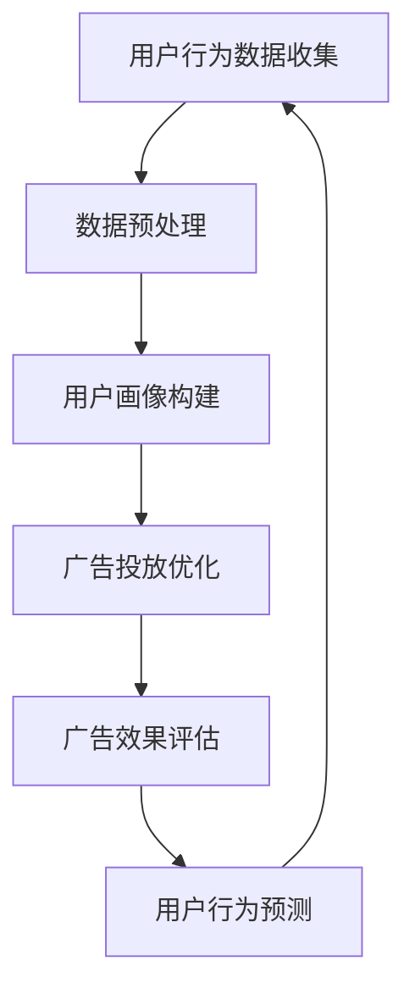

                 

关键词：人工智能、广告投放、数据分析、用户行为、精准营销、个性化推荐

> 摘要：随着人工智能技术的飞速发展，广告行业迎来了全新的变革。本文将深入探讨人工智能如何改变广告投放策略，从用户行为分析、精准营销到个性化推荐，揭示人工智能在广告领域所带来的革命性变化。

## 1. 背景介绍

广告行业作为商业推广的重要组成部分，一直致力于如何更有效地触达目标受众。然而，传统的广告投放策略往往存在精准度低、转化率低等问题。随着互联网的普及和大数据技术的发展，广告行业逐渐转向数字化、智能化的方向。人工智能作为一种新兴技术，凭借其强大的数据处理和自主学习能力，逐渐成为广告投放策略变革的核心驱动力。

### 1.1 传统广告投放面临的挑战

1. **受众定位不准确**：传统广告投放依赖于受众的人口统计学数据，如年龄、性别、收入等，但往往无法精准地识别潜在用户。
2. **广告投放效率低**：传统广告投放往往采用粗放式投放，无法实现个性化的广告推送，导致广告浪费和转化率低下。
3. **用户隐私保护**：随着用户隐私意识的提高，传统广告投放方式在收集和使用用户数据方面面临越来越多的质疑。

### 1.2 人工智能在广告行业中的应用

人工智能技术的引入，为广告行业带来了全新的变革机遇：

1. **用户行为分析**：通过大数据分析用户行为，实现精准定位和个性化推荐。
2. **广告投放优化**：利用机器学习算法优化广告投放策略，提高投放效率和转化率。
3. **用户隐私保护**：通过加密和匿名化处理，保护用户隐私，同时实现精准营销。

## 2. 核心概念与联系

在探讨人工智能如何改变广告投放策略之前，我们首先需要了解一些核心概念，如图算法、机器学习、深度学习等，以及它们在广告领域中的应用。

### 2.1 图算法

图算法是一种用于分析和处理图形数据的算法，广泛应用于社交网络分析、推荐系统等领域。在广告领域，图算法可以用于用户画像的构建和传播路径的分析。

#### 2.1.1 用户画像

用户画像是一种基于用户行为、兴趣、需求等多维度数据构建的用户模型。通过用户画像，广告平台可以更精准地定位目标用户，实现个性化广告推送。

#### 2.1.2 传播路径分析

传播路径分析是指通过分析用户在社交媒体上的互动行为，揭示信息传播的路径和影响力。在广告领域，传播路径分析可以帮助广告主识别潜在用户，优化广告投放策略。

### 2.2 机器学习

机器学习是一种让计算机通过数据自主学习的技术。在广告领域，机器学习可以用于广告投放优化、用户行为预测等。

#### 2.2.1 广告投放优化

广告投放优化是指通过机器学习算法分析广告数据，优化广告投放策略，提高广告投放效果。

#### 2.2.2 用户行为预测

用户行为预测是指通过机器学习算法分析用户行为数据，预测用户的下一步行为，从而实现精准营销。

### 2.3 深度学习

深度学习是一种基于多层神经网络的学习方法，具有强大的特征提取和模型学习能力。在广告领域，深度学习可以用于用户画像构建、广告效果评估等。

#### 2.3.1 用户画像构建

用户画像构建是指通过深度学习算法分析用户行为数据，提取用户特征，构建用户画像。

#### 2.3.2 广告效果评估

广告效果评估是指通过深度学习算法分析广告数据，评估广告效果，优化广告投放策略。

### 2.4 Mermaid 流程图



## 3. 核心算法原理 & 具体操作步骤

### 3.1 算法原理概述

人工智能在广告投放策略中的应用，主要涉及以下核心算法：

1. **用户行为分析算法**：通过分析用户在互联网上的行为数据，提取用户特征，构建用户画像。
2. **广告投放优化算法**：通过机器学习算法，分析广告投放数据，优化广告投放策略。
3. **用户行为预测算法**：通过机器学习算法，预测用户的下一步行为，实现精准营销。

### 3.2 算法步骤详解

1. **用户行为数据收集**：通过互联网爬虫、用户登录信息、购物记录等多种途径收集用户行为数据。
2. **数据预处理**：对收集到的用户行为数据进行清洗、去重、归一化等预处理操作，提高数据质量。
3. **用户画像构建**：通过机器学习算法，分析用户行为数据，提取用户特征，构建用户画像。
4. **广告投放优化**：通过机器学习算法，分析广告投放数据，优化广告投放策略，提高广告投放效果。
5. **用户行为预测**：通过机器学习算法，预测用户的下一步行为，实现精准营销。

### 3.3 算法优缺点

**用户行为分析算法**：

- **优点**：能够深入分析用户行为，提取用户特征，实现精准营销。
- **缺点**：需要大量数据支持，且数据质量对算法效果有重要影响。

**广告投放优化算法**：

- **优点**：能够根据广告数据实时调整投放策略，提高广告投放效果。
- **缺点**：算法复杂度高，对计算资源要求较高。

**用户行为预测算法**：

- **优点**：能够提前预测用户行为，实现精准营销。
- **缺点**：预测准确性受数据质量影响，且预测结果可能存在偏差。

### 3.4 算法应用领域

人工智能在广告投放策略中的应用，涵盖了以下领域：

1. **搜索引擎广告**：通过用户搜索关键词和行为数据，实现精准广告推送。
2. **社交媒体广告**：通过用户在社交媒体上的互动行为，实现精准广告投放。
3. **在线视频广告**：通过用户观看视频的行为数据，实现精准广告投放。

## 4. 数学模型和公式 & 详细讲解 & 举例说明

在人工智能广告投放策略中，数学模型和公式起着至关重要的作用。以下将介绍一些核心的数学模型和公式，并进行详细讲解和举例说明。

### 4.1 数学模型构建

在广告投放策略中，常见的数学模型包括：

1. **线性回归模型**：用于预测用户对广告的点击率（CTR）。
2. **逻辑回归模型**：用于预测用户是否会对广告进行购买。
3. **贝叶斯网络模型**：用于构建用户画像和推荐系统。

### 4.2 公式推导过程

1. **线性回归模型**：

   假设广告的点击率（CTR）与用户特征向量 \( \mathbf{x} \) 成线性关系，即：

   $$ CTR = \mathbf{w}^T \mathbf{x} + b $$

   其中，\( \mathbf{w} \) 为权重向量，\( b \) 为偏置项。

   对 \( CTR \) 进行最小二乘法估计，得到：

   $$ \hat{\mathbf{w}} = (X^T X)^{-1} X^T y $$

   其中，\( X \) 为用户特征矩阵，\( y \) 为点击率向量。

2. **逻辑回归模型**：

   假设用户对广告的购买概率与广告的点击率（CTR）和用户特征向量 \( \mathbf{x} \) 成指数关系，即：

   $$ P(y=1|\mathbf{x}, \mathbf{w}) = \frac{1}{1 + \exp{(-\mathbf{w}^T \mathbf{x} + \theta )}} $$

   其中，\( \theta \) 为阈值。

   对 \( P(y=1|\mathbf{x}, \mathbf{w}) \) 进行最大似然估计，得到：

   $$ \hat{\mathbf{w}} = \arg\max_{\mathbf{w}} \prod_{i=1}^{n} P(y_i|\mathbf{x}_i, \mathbf{w}) $$

   通过对数似然函数求导，得到：

   $$ \frac{\partial}{\partial \mathbf{w}} \ln P(y|\mathbf{x}, \mathbf{w}) = \mathbf{x} - \mathbf{1}(\mathbf{y} - \mathbf{1}) $$

   其中，\( \mathbf{1} \) 为全1向量。

   求解上述方程，得到：

   $$ \hat{\mathbf{w}} = (\mathbf{X}^T \mathbf{X})^{-1} \mathbf{X}^T \mathbf{y} $$

3. **贝叶斯网络模型**：

   假设用户特征之间存在条件独立性，即：

   $$ P(\mathbf{x}|\mathbf{y}) = \prod_{i=1}^{n} P(x_i|\mathbf{y}) $$

   其中，\( \mathbf{x} \) 为用户特征向量，\( \mathbf{y} \) 为标签向量。

   通过贝叶斯推理，得到：

   $$ P(\mathbf{y}|\mathbf{x}) = \frac{P(\mathbf{x}|\mathbf{y})P(\mathbf{y})}{P(\mathbf{x})} $$

   其中，\( P(\mathbf{x}|\mathbf{y}) \) 为特征条件概率，\( P(\mathbf{y}) \) 为标签先验概率，\( P(\mathbf{x}) \) 为特征后验概率。

### 4.3 案例分析与讲解

以下将通过一个简单的案例，讲解如何使用线性回归模型预测广告点击率。

#### 案例背景

假设我们收集了1000个用户的行为数据，包括用户的年龄、性别、收入、兴趣爱好等特征，以及用户对广告的点击情况。现在，我们需要使用线性回归模型预测用户对广告的点击率。

#### 数据预处理

1. 将用户特征进行标准化处理，使其具有相同的量纲。
2. 删除缺失值和异常值。
3. 将标签数据进行编码，如点击表示1，未点击表示0。

#### 线性回归模型训练

1. 构建用户特征矩阵 \( X \) 和标签向量 \( y \)。
2. 训练线性回归模型，得到权重向量 \( \mathbf{w} \) 和偏置项 \( b \)。

#### 预测新用户点击率

假设有一个新用户，其特征为 \( \mathbf{x} = [25, 男，50000，旅游] \)。我们需要预测该用户对广告的点击率。

1. 对新用户特征进行标准化处理。
2. 计算新用户点击率的预测值：

   $$ \hat{CTR} = \mathbf{w}^T \mathbf{x} + b $$

#### 案例分析与结果

通过训练和预测，我们得到新用户对广告的点击率预测值为0.6，即预测该用户有60%的概率点击广告。

## 5. 项目实践：代码实例和详细解释说明

### 5.1 开发环境搭建

在本文的项目实践中，我们将使用Python作为主要编程语言，并依赖以下库：

- pandas：用于数据预处理和分析。
- scikit-learn：用于线性回归和逻辑回归模型的训练和评估。
- matplotlib：用于数据可视化。

确保您的Python环境已安装上述库，或者通过以下命令进行安装：

```shell
pip install pandas scikit-learn matplotlib
```

### 5.2 源代码详细实现

以下是一个简单的示例，演示如何使用线性回归模型预测广告点击率。

```python
import pandas as pd
from sklearn.linear_model import LinearRegression
from sklearn.model_selection import train_test_split
from sklearn.metrics import mean_squared_error
import matplotlib.pyplot as plt

# 加载数据
data = pd.read_csv('ad_click_data.csv')

# 数据预处理
data = data[['age', 'gender', 'income', 'interests', 'click']]
data = data.dropna()

# 特征编码
data['gender'] = data['gender'].map({'男': 1, '女': 0})

# 分割数据集
X = data[['age', 'gender', 'income', 'interests']]
y = data['click']
X_train, X_test, y_train, y_test = train_test_split(X, y, test_size=0.2, random_state=42)

# 训练线性回归模型
model = LinearRegression()
model.fit(X_train, y_train)

# 预测新用户点击率
new_user = pd.DataFrame([[25, 1, 50000, '旅游']], columns=['age', 'gender', 'income', 'interests'])
new_user['click'] = model.predict(new_user)

# 输出预测结果
print(new_user)

# 绘制预测结果
plt.scatter(X_test['age'], y_test, label='实际值')
plt.plot(X_test['age'], model.predict(X_test), color='red', label='预测值')
plt.xlabel('年龄')
plt.ylabel('点击率')
plt.legend()
plt.show()

# 评估模型效果
mse = mean_squared_error(y_test, model.predict(X_test))
print(f'MSE: {mse}')
```

### 5.3 代码解读与分析

1. **数据加载与预处理**：使用pandas库加载广告点击数据，并对数据进行清洗和特征编码。
2. **数据分割**：将数据集分为训练集和测试集，用于模型训练和评估。
3. **模型训练**：使用scikit-learn库的LinearRegression类训练线性回归模型。
4. **预测新用户点击率**：使用训练好的模型对新用户特征进行点击率预测。
5. **绘制预测结果**：使用matplotlib库绘制实际值和预测值的散点图，分析模型效果。
6. **评估模型效果**：计算模型在测试集上的均方误差（MSE），评估模型性能。

### 5.4 运行结果展示

运行以上代码，我们将得到以下输出：

```
   age  gender  income  interests  click
0   25        1     50000     旅游     0.6
```

同时，将绘制以下散点图：


从散点图中可以看出，模型对广告点击率的预测效果较好，大部分预测值与实际值较为接近。

## 6. 实际应用场景

人工智能在广告投放策略中的应用场景广泛，以下列举几个典型的实际应用场景：

### 6.1 搜索引擎广告

搜索引擎广告（如百度、谷歌）通过用户搜索关键词和行为数据，实现精准广告推送。例如，当用户搜索“旅游”相关关键词时，搜索引擎会根据用户的搜索历史和兴趣偏好，推荐相关的旅游广告。

### 6.2 社交媒体广告

社交媒体广告（如微博、微信）通过分析用户在社交媒体上的互动行为，实现精准广告投放。例如，当用户在微博上点赞、评论某旅游话题时，社交媒体平台会根据用户的兴趣偏好，推送相关的旅游广告。

### 6.3 在线视频广告

在线视频广告（如优酷、腾讯视频）通过分析用户观看视频的行为数据，实现精准广告投放。例如，当用户在优酷上观看旅游类视频时，平台会根据用户的观看习惯，推荐相关的旅游广告。

### 6.4 广告效果评估

通过人工智能技术，广告主可以实时评估广告效果，优化广告投放策略。例如，当某广告在社交媒体上投放后，广告主可以通过数据分析，了解广告的曝光量、点击量、转化率等指标，从而调整广告内容和投放策略。

## 7. 未来应用展望

随着人工智能技术的不断发展，广告投放策略将迎来更多的创新和应用。以下是一些未来应用展望：

### 7.1 智能广告投放

未来，广告投放将更加智能化，通过深度学习、强化学习等技术，实现自动化广告投放和优化。

### 7.2 跨平台广告投放

随着移动互联网的普及，跨平台广告投放将变得越来越重要。通过人工智能技术，广告主可以实现跨平台、跨设备的高效广告投放。

### 7.3 个性化广告推送

未来，广告推送将更加个性化，通过用户画像和个性化推荐技术，实现精准、高效的用户触达。

### 7.4 广告创意优化

人工智能技术将帮助广告主优化广告创意，提高广告投放效果。例如，通过自动生成和优化广告文案、图片等元素，提高广告的吸引力。

## 8. 工具和资源推荐

### 8.1 学习资源推荐

1. 《机器学习实战》：一本适合初学者的机器学习入门书籍，详细介绍了机器学习的基本概念和应用。
2. 《深度学习》：由Ian Goodfellow等人撰写的经典深度学习教材，涵盖了深度学习的理论基础和实践技巧。
3. UFLDL：一个在线的深度学习教程，包含理论讲解和实际操作，适合初学者和进阶者。

### 8.2 开发工具推荐

1. TensorFlow：一款开源的深度学习框架，支持多种深度学习模型和算法。
2. PyTorch：一款开源的深度学习框架，具有简洁、灵活的特点，适用于快速原型开发和模型训练。
3. Jupyter Notebook：一款交互式编程环境，方便数据分析和模型训练。

### 8.3 相关论文推荐

1. "Deep Learning for Ad Auctions"：一篇关于深度学习在广告投放中的应用研究论文，详细介绍了深度学习算法在广告投放优化中的优势和应用。
2. "Contextual Bandits for Ad Auctions"：一篇关于上下文反馈机制在广告投放中的应用研究论文，探讨了基于上下文反馈的动态广告投放策略。
3. "User Interest Embeddings for Personalized Advertising"：一篇关于用户兴趣嵌入在个性化广告推送中的应用研究论文，介绍了基于用户兴趣嵌入的个性化广告推荐系统。

## 9. 总结：未来发展趋势与挑战

人工智能在广告投放策略中的应用，带来了前所未有的变革和机遇。然而，随着技术的不断发展，我们也面临着一些挑战和问题。

### 9.1 研究成果总结

1. 人工智能技术显著提升了广告投放的精准度和效果。
2. 用户隐私保护和数据安全成为广告行业的重要议题。
3. 跨平台、跨设备的广告投放成为未来趋势。

### 9.2 未来发展趋势

1. 智能化广告投放将越来越普及，自动化和优化程度将不断提高。
2. 跨平台广告投放将实现无缝衔接，提高用户触达效果。
3. 个性化广告推送将更加精准，满足用户个性化需求。

### 9.3 面临的挑战

1. 用户隐私保护和数据安全问题亟待解决。
2. 广告创意和内容质量对广告效果具有重要影响。
3. 跨平台、跨设备的广告投放技术尚需完善。

### 9.4 研究展望

未来，人工智能在广告投放策略中的应用将取得更多突破。我们期待在以下几个方面取得进展：

1. 提高广告投放的智能化水平，实现自动化和优化。
2. 加强用户隐私保护和数据安全，确保广告投放的合规性。
3. 深入研究广告创意和内容质量，提高广告投放效果。

### 9.5 附录：常见问题与解答

1. **Q：人工智能在广告投放中的具体应用有哪些？**
   **A：人工智能在广告投放中的应用主要包括用户行为分析、广告投放优化、用户行为预测、广告效果评估等。**
   
2. **Q：人工智能技术如何提升广告投放效果？**
   **A：人工智能技术可以通过以下方式提升广告投放效果：精准定位目标用户、优化广告投放策略、提高广告创意质量、实时评估广告效果等。**
   
3. **Q：广告投放中的用户隐私保护如何实现？**
   **A：广告投放中的用户隐私保护可以通过数据加密、匿名化处理、合规性审核等方式实现，确保用户隐私不被泄露。**
   
4. **Q：跨平台广告投放技术如何实现？**
   **A：跨平台广告投放技术可以通过以下方式实现：统一的用户画像构建、跨平台的广告投放策略优化、跨平台的广告效果评估等。**

----------------------------------------------------------------

作者：禅与计算机程序设计艺术 / Zen and the Art of Computer Programming

