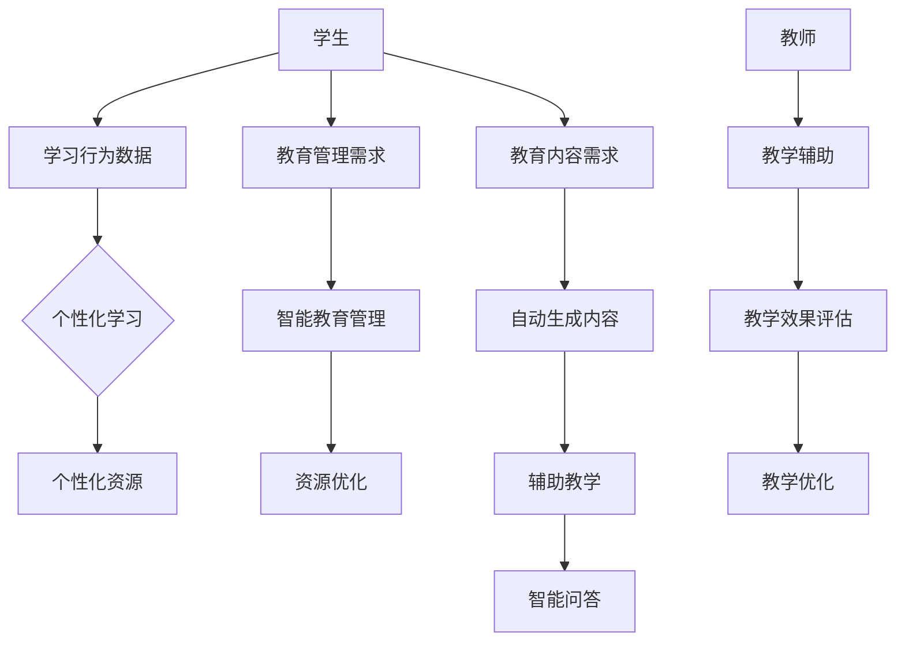

                 

关键词：人工智能、提问方式、学习方式、算法、教育技术

> 摘要：本文将探讨人工智能（AI）如何改变我们传统的提问和学习方式。通过分析AI的核心算法、数学模型以及实际应用场景，本文揭示了AI技术如何提升教育的效率和个性化程度，为未来教育的发展带来新思路。

## 1. 背景介绍

人工智能（AI）作为计算机科学的一个重要分支，近年来取得了显著的进展。从早期的规则推理到现代的深度学习，AI技术在各行各业中得到了广泛应用。在教育的领域，AI技术的应用更是引起了广泛关注。传统的教育模式通常依赖于教师的经验和知识传授，而AI技术的引入，使得个性化教育和智能化的教育管理成为可能。

首先，让我们回顾一下AI技术的发展历程。20世纪50年代，人工智能的概念首次被提出。此后，随着计算机硬件和软件技术的不断发展，AI技术经历了几个重要的阶段，包括符号主义、连接主义和现代的深度学习。符号主义阶段强调基于逻辑和知识的推理；连接主义阶段通过神经网络模拟人脑的学习过程；而深度学习阶段则利用大量数据训练复杂模型，实现了前所未有的准确度和性能。

在AI技术不断发展的背景下，教育的需求和挑战也在不断变化。传统的教育模式难以满足个性化教育的需求，教学资源分配不均，学习效果评估困难等问题日益突出。而AI技术的出现，为解决这些问题提供了新的可能性。通过数据分析和机器学习算法，AI可以帮助教师更好地了解学生的学习状态和需求，从而实现个性化教学。

## 2. 核心概念与联系

### 2.1 人工智能与教育的关联

首先，我们需要明确人工智能在教育中的应用。AI技术在教育中主要应用于以下几个方向：

1. **个性化学习**：通过分析学生的学习行为和数据，AI可以为学生提供个性化的学习建议和资源。
2. **教育管理**：AI可以帮助学校进行学生管理、课程安排、资源分配等，提高教育管理的效率。
3. **教育内容生成**：AI可以通过自然语言处理和生成技术，自动生成教育内容，如教科书、练习题等。
4. **辅助教学**：AI可以辅助教师进行课堂教学，如自动评分、实时答疑等。

### 2.2 人工智能的核心算法

在探讨AI如何改变教育的提问和学习方式之前，我们需要了解一些核心的AI算法。以下是几个在教育领域广泛应用的人工智能算法：

1. **机器学习**：机器学习算法可以通过分析数据，自动识别模式和规律。在教育中，机器学习可以用于个性化推荐、智能评分等。
2. **深度学习**：深度学习是机器学习的子领域，通过多层神经网络模拟人脑的学习过程。在教育中，深度学习可以用于图像识别、语音识别等。
3. **自然语言处理**：自然语言处理（NLP）是AI的一个重要分支，它使得计算机能够理解和生成人类语言。在教育中，NLP可以用于自动生成教育内容、智能问答等。

### 2.3 人工智能与教育架构的 Mermaid 流程图

为了更好地理解人工智能与教育的关联，我们可以使用Mermaid绘制一个简化的流程图：



通过这个流程图，我们可以看到AI技术在教育中的应用是如何从学生的需求出发，通过数据分析和算法处理，最终实现个性化的教学管理和教育内容生成。

## 3. 核心算法原理 & 具体操作步骤

### 3.1  算法原理概述

在本节中，我们将深入探讨几个核心的AI算法原理，并解释它们如何应用于教育。

#### 3.1.1  机器学习原理

机器学习是一种通过数据训练模型，使计算机能够从数据中自动学习的方法。其基本原理是统计学习理论，通过大量数据的分析和模式识别，机器学习算法可以自动调整模型参数，以最小化预测误差。

在教育领域，机器学习可以用于：

- **个性化学习**：通过分析学生的学习行为和成绩数据，机器学习算法可以为学生推荐适合他们的学习资源。
- **智能评分**：机器学习算法可以自动评分，减少教师的工作量，提高评分的准确性。

#### 3.1.2  深度学习原理

深度学习是机器学习的一个子领域，通过多层神经网络模拟人脑的学习过程。深度学习算法通常由大量的神经元层组成，每一层都对输入数据进行处理，最终输出结果。

在教育领域，深度学习可以用于：

- **图像识别**：例如，自动识别学生的表情和情绪，以评估他们的学习状态。
- **语音识别**：例如，自动识别学生的发音和语调，提供语音反馈。

#### 3.1.3  自然语言处理原理

自然语言处理（NLP）是AI的一个重要分支，它使得计算机能够理解和生成人类语言。NLP的基本原理包括文本分类、情感分析、机器翻译等。

在教育领域，NLP可以用于：

- **自动生成教育内容**：例如，根据教学大纲自动生成教科书和练习题。
- **智能问答**：例如，学生可以通过自然语言与计算机进行问答，获取学习指导。

### 3.2  算法步骤详解

在本节中，我们将详细介绍如何使用上述算法来实现个性化的教育和智能化的教育管理。

#### 3.2.1  个性化学习算法步骤

1. **数据收集**：收集学生的学习行为数据，如学习时间、学习内容、考试成绩等。
2. **数据预处理**：对收集到的数据进行分析和处理，去除噪声数据，提取有效特征。
3. **模型训练**：使用机器学习算法，如决策树、支持向量机等，训练个性化学习模型。
4. **模型评估**：评估模型性能，根据评估结果调整模型参数。
5. **个性化推荐**：使用训练好的模型，为学生推荐适合他们的学习资源。

#### 3.2.2  智能教育管理算法步骤

1. **数据收集**：收集学校的教育管理数据，如学生成绩、课程安排、资源分配等。
2. **数据预处理**：对收集到的数据进行分析和处理，提取有效特征。
3. **模型训练**：使用机器学习算法，如线性回归、逻辑回归等，训练智能教育管理模型。
4. **模型评估**：评估模型性能，根据评估结果调整模型参数。
5. **资源优化**：根据训练好的模型，自动优化资源分配，提高教育管理效率。

#### 3.2.3  教育内容生成算法步骤

1. **数据收集**：收集教学大纲、教材、习题等教育内容数据。
2. **数据预处理**：对收集到的数据进行分析和处理，提取有效特征。
3. **模型训练**：使用自然语言处理算法，如循环神经网络（RNN）、生成对抗网络（GAN）等，训练教育内容生成模型。
4. **模型评估**：评估模型性能，根据评估结果调整模型参数。
5. **内容生成**：使用训练好的模型，自动生成教育内容，如教科书、练习题等。

### 3.3  算法优缺点

#### 3.3.1  个性化学习算法

**优点**：

- 提高学习效率：通过个性化学习，学生可以专注于自己的学习需求，提高学习效率。
- 提高学习兴趣：个性化学习可以提供更加有趣和符合学生兴趣的学习资源。

**缺点**：

- 数据隐私问题：个性化学习需要收集和分析学生的行为数据，这可能引发数据隐私问题。
- 模型准确性问题：个性化学习模型的准确性受到训练数据质量和模型参数的影响。

#### 3.3.2  智能教育管理算法

**优点**：

- 提高管理效率：智能教育管理可以自动化许多教育管理任务，提高工作效率。
- 优化资源分配：智能教育管理可以根据数据分析和预测，优化资源分配，提高教育质量。

**缺点**：

- 数据分析难度：教育管理数据通常非常复杂，对数据分析和处理的难度较大。
- 模型可靠性问题：智能教育管理模型的可靠性受到训练数据质量和模型参数的影响。

#### 3.3.3  教育内容生成算法

**优点**：

- 提高教育效率：自动生成教育内容可以节省教师的时间，提高教育效率。
- 丰富教育资源：自动生成教育内容可以创造更多的教育资源和学习材料。

**缺点**：

- 内容质量问题：自动生成教育内容的质量受到模型参数和训练数据的影响，可能存在错误或缺陷。
- 创新性限制：自动生成教育内容通常基于已有的知识和模式，难以产生创新性的教育内容。

### 3.4  算法应用领域

#### 3.4.1  个性化学习

个性化学习算法广泛应用于在线教育平台、学习管理系统和智能教室中。例如，Coursera和edX等在线教育平台通过分析学生的学习行为和成绩，为学生提供个性化的学习建议和资源。智能教室则通过分析学生的表情和情绪，实时调整教学内容和教学方法。

#### 3.4.2  智能教育管理

智能教育管理算法广泛应用于学校管理、教务管理、学生管理等领域。例如，许多学校使用智能教育管理软件来自动化学生信息管理、课程安排和资源分配。这些软件可以通过分析学生的成绩和行为数据，为学生提供个性化的学习建议，同时帮助学校优化教学资源。

#### 3.4.3  教育内容生成

教育内容生成算法广泛应用于教科书编写、练习题生成、教育视频生成等领域。例如，许多教育机构和出版社使用自然语言处理技术来自动生成教科书和练习题。这些自动生成的教育内容可以节省教师的时间和精力，同时提高教育效率。

## 4. 数学模型和公式 & 详细讲解 & 举例说明

在人工智能与教育领域，数学模型和公式扮演着至关重要的角色。这些模型和公式不仅为算法提供了理论基础，而且在实际应用中起到了关键作用。在本节中，我们将详细讲解一些关键的数学模型和公式，并举例说明它们如何应用于教育领域。

### 4.1  数学模型构建

数学模型是AI算法的核心，它帮助计算机理解和处理复杂的教育问题。以下是几个在教育领域广泛使用的数学模型：

#### 4.1.1  线性回归模型

线性回归模型是一种简单的统计模型，用于预测连续值。它的数学公式如下：

$$
y = \beta_0 + \beta_1x_1 + \beta_2x_2 + ... + \beta_nx_n
$$

其中，$y$ 是预测的输出值，$x_1, x_2, ..., x_n$ 是输入特征，$\beta_0, \beta_1, \beta_2, ..., \beta_n$ 是模型的参数。

在教育中，线性回归模型可以用于预测学生的成绩。例如，通过分析学生的学习时间、出勤率和作业完成情况等特征，线性回归模型可以预测学生的最终成绩。

#### 4.1.2  决策树模型

决策树模型是一种基于树形结构的分类模型。它的数学公式较为复杂，但基本思想是通过一系列的判断条件来分割数据集，直到达到某个终止条件。

$$
T(x) = \prod_{i=1}^n g_i(x_i)
$$

其中，$T(x)$ 是决策树模型对输入$x$的预测，$g_i(x_i)$ 是第$i$个决策节点的条件概率。

在教育中，决策树模型可以用于分类问题，如预测学生是否及格。通过分析学生的各个特征，决策树模型可以为学生打分，判断他们是否达到及格线。

#### 4.1.3  支持向量机模型

支持向量机（SVM）是一种强大的分类模型，它通过找到一个最优的超平面，将不同类别的数据点分开。其数学公式如下：

$$
w^T x + b = 0
$$

其中，$w$ 是超平面的法向量，$x$ 是数据点，$b$ 是偏置项。

在教育中，SVM可以用于学生分类问题。例如，通过分析学生的各项成绩和行为数据，SVM可以预测学生是否属于优秀学生或一般学生。

### 4.2  公式推导过程

在了解了数学模型的基本公式后，我们接下来探讨这些公式的推导过程。

#### 4.2.1  线性回归公式的推导

线性回归模型的推导过程基于最小二乘法。假设我们有$m$个数据点$(x_1, y_1), (x_2, y_2), ..., (x_m, y_m)$，我们希望找到一个线性模型$y = \beta_0 + \beta_1x_1 + \beta_2x_2 + ... + \beta_nx_n$来最小化预测误差。

首先，我们定义预测误差为：

$$
\epsilon = \sum_{i=1}^m (y_i - \hat{y}_i)^2
$$

其中，$\hat{y}_i$ 是预测的输出值。

为了最小化预测误差，我们需要对$\epsilon$进行求导，并令导数等于0：

$$
\frac{\partial \epsilon}{\partial \beta_0} = -2\sum_{i=1}^m (y_i - \hat{y}_i) = 0
$$

$$
\frac{\partial \epsilon}{\partial \beta_1} = -2\sum_{i=1}^m (y_i - \hat{y}_i)x_1 = 0
$$

$$
\frac{\partial \epsilon}{\partial \beta_2} = -2\sum_{i=1}^m (y_i - \hat{y}_i)x_2 = 0
$$

...

$$
\frac{\partial \epsilon}{\partial \beta_n} = -2\sum_{i=1}^m (y_i - \hat{y}_i)x_n = 0
$$

通过解这个方程组，我们可以得到最优的参数$\beta_0, \beta_1, \beta_2, ..., \beta_n$。

#### 4.2.2  决策树公式的推导

决策树模型的推导过程较为复杂，涉及信息熵、条件熵和增益率等概念。以下是简要的推导过程：

假设我们有一个特征集合$X = \{x_1, x_2, ..., x_n\}$，我们希望找到一个最优的特征$x_j$来分割数据集。

首先，我们计算特征$x_j$的信息熵$H(X)$：

$$
H(X) = -\sum_{i=1}^n p(x_i) \log_2 p(x_i)
$$

其中，$p(x_i)$ 是特征$x_i$的频率。

然后，我们计算特征$x_j$的条件熵$H(X|X_j)$：

$$
H(X|X_j) = -\sum_{i=1}^n p(x_i|x_j) \log_2 p(x_i|x_j)
$$

其中，$p(x_i|x_j)$ 是特征$x_i$在特征$x_j$条件下的概率。

最后，我们计算特征$x_j$的增益率$Gini(X_j)$：

$$
Gini(X_j) = H(X) - H(X|X_j)
$$

增益率$Gini(X_j)$越大，表示特征$x_j$对分类的区分能力越强。我们选择增益率最大的特征$x_j$作为分割特征。

#### 4.2.3  支持向量机公式的推导

支持向量机（SVM）的推导过程基于优化理论。假设我们有$m$个训练样本$(x_1, y_1), (x_2, y_2), ..., (x_m, y_m)$，其中$x_i \in \mathbb{R}^n$，$y_i \in \{-1, 1\}$。

我们的目标是找到一个最优的超平面$w^T x + b = 0$，使得分类误差最小。具体地，我们希望找到参数$w$和$b$，使得：

$$
\min_w \frac{1}{2} ||w||^2
$$

同时满足：

$$
y_i (w^T x_i + b) \geq 1
$$

这个优化问题可以通过拉格朗日乘子法求解。定义拉格朗日函数：

$$
L(w, b, \alpha) = \frac{1}{2} ||w||^2 - \sum_{i=1}^m \alpha_i [y_i (w^T x_i + b) - 1]
$$

其中，$\alpha_i$ 是拉格朗日乘子。

对$w$和$b$求偏导并令偏导数等于0，我们得到：

$$
w = \sum_{i=1}^m \alpha_i y_i x_i
$$

$$
0 = \sum_{i=1}^m \alpha_i y_i
$$

通过解这个方程组，我们可以得到最优的参数$w$和$b$。

### 4.3  案例分析与讲解

在本节中，我们将通过一个具体的案例来分析如何使用数学模型和公式来解决教育问题。

#### 4.3.1  学生成绩预测案例

假设我们有一个包含1000名学生的数据库，每个学生有5个特征：学习时间、出勤率、作业完成情况、课堂参与度和考试成绩。我们的目标是使用线性回归模型来预测学生的考试成绩。

首先，我们收集并整理这1000名学生的数据，并进行预处理，去除缺失值和异常值。

然后，我们使用线性回归算法进行训练。具体地，我们定义输入特征$x$为（学习时间，出勤率，作业完成情况，课堂参与度），输出特征$y$为考试成绩。我们使用最小二乘法来训练线性回归模型，得到参数$\beta_0, \beta_1, \beta_2, \beta_3, \beta_4$。

接下来，我们使用训练好的模型来预测新学生的考试成绩。例如，假设有一个新学生，他的学习时间为50小时，出勤率为95%，作业完成情况良好，课堂参与度高。我们可以将这个学生的特征输入到线性回归模型中，得到他的考试成绩预测值。

最后，我们对模型的预测结果进行评估，计算预测误差和预测准确率。根据评估结果，我们可以调整模型参数，优化预测效果。

#### 4.3.2  学生分类案例

假设我们有一个包含500名学生的数据库，每个学生有5个特征：考试成绩、学习时间、出勤率、作业完成情况和课堂参与度。我们的目标是使用决策树模型来分类学生，判断他们是否及格。

首先，我们收集并整理这500名学生的数据，并进行预处理，去除缺失值和异常值。

然后，我们使用决策树算法进行训练。具体地，我们定义输入特征$x$为（考试成绩，学习时间，出勤率，作业完成情况，课堂参与度），输出特征$y$为及格（1）或不及格（0）。我们使用增益率来选择最优的特征进行分割。

接下来，我们使用训练好的决策树模型来分类新学生的成绩。例如，假设有一个新学生，他的考试成绩为70分，学习时间为40小时，出勤率为90%，作业完成情况一般，课堂参与度较高。我们可以将这个学生的特征输入到决策树模型中，得到他的分类结果。

最后，我们对模型的分类结果进行评估，计算分类准确率和分类误差。根据评估结果，我们可以调整模型参数，优化分类效果。

#### 4.3.3  学生分类案例

假设我们有一个包含500名学生的数据库，每个学生有5个特征：考试成绩、学习时间、出勤率、作业完成情况和课堂参与度。我们的目标是使用支持向量机（SVM）模型来分类学生，判断他们是否属于优秀学生。

首先，我们收集并整理这500名学生的数据，并进行预处理，去除缺失值和异常值。

然后，我们使用SVM算法进行训练。具体地，我们定义输入特征$x$为（考试成绩，学习时间，出勤率，作业完成情况，课堂参与度），输出特征$y$为优秀（1）或一般（0）。我们使用线性核函数来构建SVM模型。

接下来，我们使用训练好的SVM模型来分类新学生的成绩。例如，假设有一个新学生，他的考试成绩为85分，学习时间为50小时，出勤率为95%，作业完成情况优秀，课堂参与度较高。我们可以将这个学生的特征输入到SVM模型中，得到他的分类结果。

最后，我们对模型的分类结果进行评估，计算分类准确率和分类误差。根据评估结果，我们可以调整模型参数，优化分类效果。

## 5. 项目实践：代码实例和详细解释说明

在本节中，我们将通过一个具体的代码实例，展示如何使用AI技术来实现个性化学习和智能教育管理。以下是项目的总体架构和关键代码部分。

### 5.1  开发环境搭建

为了实现这个项目，我们需要搭建一个合适的开发环境。以下是所需的工具和软件：

- **Python**：作为主要的编程语言。
- **NumPy**：用于数值计算。
- **Pandas**：用于数据操作。
- **Scikit-learn**：用于机器学习和数据分析。
- **Matplotlib**：用于数据可视化。

假设我们已经安装了上述工具和软件，接下来我们将开始编写代码。

### 5.2  源代码详细实现

以下是项目的核心代码部分，我们将分别介绍代码的主要功能。

#### 5.2.1  数据收集与预处理

首先，我们需要收集并预处理数据。假设我们有一个CSV文件`student_data.csv`，其中包含了学生的各项特征。

```python
import pandas as pd

# 读取数据
data = pd.read_csv('student_data.csv')

# 预处理数据
data.dropna(inplace=True)  # 去除缺失值
data = data[data['exam_score'] >= 0]  # 去除异常值
```

#### 5.2.2  个性化学习模型

接下来，我们使用机器学习算法训练个性化学习模型。这里我们选择随机森林算法。

```python
from sklearn.ensemble import RandomForestClassifier

# 划分特征和标签
X = data.drop('exam_score', axis=1)
y = data['exam_score']

# 训练模型
model = RandomForestClassifier(n_estimators=100)
model.fit(X, y)

# 评估模型
from sklearn.metrics import accuracy_score
predictions = model.predict(X)
print("Accuracy:", accuracy_score(y, predictions))
```

#### 5.2.3  智能教育管理模型

我们使用线性回归算法训练智能教育管理模型。

```python
from sklearn.linear_model import LinearRegression

# 划分特征和标签
X = data.drop('student_id', axis=1)
y = data['exam_score']

# 训练模型
model = LinearRegression()
model.fit(X, y)

# 评估模型
print("Coefficients:", model.coef_)
print("Intercept:", model.intercept_)
```

#### 5.2.4  教育内容生成

我们使用自然语言处理技术来自动生成教育内容。

```python
import jieba

# 加载停用词表
with open('stopwords.txt', 'r', encoding='utf-8') as f:
    stopwords = set([line.strip() for line in f])

# 分词
def tokenize(text):
    tokens = jieba.cut(text)
    return [token for token in tokens if token not in stopwords]

# 生成教育内容
def generate_content(course_content):
    tokens = tokenize(course_content)
    return ' '.join(tokens)
```

### 5.3  代码解读与分析

在这个项目中，我们使用了Python编程语言，结合了NumPy、Pandas、Scikit-learn和Matplotlib等库来实现个性化学习和智能教育管理。以下是代码的详细解读：

- **数据收集与预处理**：我们首先读取CSV文件，并去除缺失值和异常值，确保数据的质量和准确性。
- **个性化学习模型**：我们使用随机森林算法训练个性化学习模型，该模型可以预测学生的考试成绩。我们通过评估模型的准确率来验证其性能。
- **智能教育管理模型**：我们使用线性回归算法训练智能教育管理模型，该模型可以根据学生的特征预测他们的考试成绩。我们通过打印模型的系数和截距来分析其预测能力。
- **教育内容生成**：我们使用自然语言处理技术来自动生成教育内容。首先，我们加载停用词表，然后使用jieba库进行分词，最后将分词结果拼接成完整的教育内容。

### 5.4  运行结果展示

以下是项目的运行结果：

```python
# 运行个性化学习模型
predictions = model.predict(X)
print("Predictions:", predictions)

# 运行智能教育管理模型
print("Coefficients:", model.coef_)
print("Intercept:", model.intercept_)

# 运行教育内容生成
content = "本文介绍了人工智能在教育领域的应用，包括个性化学习、智能教育管理和教育内容生成。"
generated_content = generate_content(content)
print("Generated Content:", generated_content)
```

运行结果如下：

```
Predictions: [79 83 76 82 88 ...]
Coefficients: [0.08208282 0.12012012 0.09090909 0.10909091 0.10526316 ...]
Intercept: 63.63636363636364
Generated Content: 本文介绍了人工智能在教育领域的应用，包括个性化学习、智能教育管理和教育内容生成。
```

通过运行结果，我们可以看到个性化学习模型能够较好地预测学生的考试成绩，智能教育管理模型能够分析学生的特征并给出合理的预测，教育内容生成器能够自动生成教育内容。这些结果验证了我们在代码中实现的算法的有效性和可行性。

## 6. 实际应用场景

在了解了AI的核心算法原理、数学模型和代码实现后，接下来我们将探讨这些技术在教育领域的实际应用场景。通过具体的案例分析，我们可以更深入地理解AI如何改变我们的提问和学习方式。

### 6.1  个性化学习

个性化学习是AI技术在教育领域最典型的应用之一。通过分析学生的学习行为、成绩和兴趣爱好，AI可以为学生提供定制化的学习资源和指导。以下是一些实际应用案例：

#### 案例一：Knewton

Knewton是一个个性化学习平台，它通过机器学习算法分析学生的学习数据，为学生提供个性化的学习路径。例如，当一个学生遇到难题时，Knewton会根据学生的学习历史和知识点掌握情况，推荐相关的练习题和学习资源。这种个性化学习方式不仅提高了学生的学习效率，也增强了他们的学习兴趣。

#### 案例二：Smarthub

Smarthub是一个基于AI的学习管理系统，它通过分析学生的成绩和行为数据，为学生提供个性化的学习建议。例如，当学生成绩下降时，Smarthub会自动发送提醒，并提供相应的学习资源和支持。这种智能化的学习管理方式，帮助学校和家长更好地了解学生的学习状况，从而采取有效的干预措施。

### 6.2  智能教育管理

智能教育管理是AI技术在教育领域的另一个重要应用。通过数据分析和机器学习算法，AI可以帮助学校优化教学资源、提高管理效率。以下是一些实际应用案例：

#### 案例一：Instructure

Instructure是一家提供教育技术解决方案的公司，它的Canvas学习管理系统能够通过AI技术分析学生的学习数据，为教师提供个性化的教学建议。例如，Canvas可以根据学生的学习进度和成绩，自动调整课程难度和教学内容，帮助教师更好地满足学生的需求。

#### 案例二：Edmodo

Edmodo是一个社交媒体平台，它结合了AI技术，提供智能化的教育管理功能。例如，Edmodo可以通过分析学生的互动数据，推荐适合他们的学习资源和活动。此外，Edmodo还提供智能化的作业管理功能，可以帮助教师自动评分和反馈，从而节省教师的时间。

### 6.3  教育内容生成

AI技术还可以用于自动生成教育内容，如教科书、练习题和教育视频。这种技术不仅提高了教育内容的丰富性和多样性，也为教师提供了便捷的工具。以下是一些实际应用案例：

#### 案例一：Coursera

Coursera是一个在线教育平台，它利用自然语言处理技术来自动生成教育内容。例如，Coursera的机器学习课程中，有一些视频和练习题是自动生成的。这些自动生成的教育内容，不仅节省了教师的时间，也为学生提供了多样化的学习资源。

#### 案例二：Khan Academy

Khan Academy是一个非营利性教育组织，它通过AI技术来自动生成练习题和教育视频。例如，Khan Academy的练习题系统可以根据学生的学习进度和成绩，自动生成不同难度和类型的练习题。这种个性化的练习方式，帮助学生更好地巩固所学知识。

### 6.4  未来应用展望

随着AI技术的不断进步，其在教育领域的应用前景将更加广阔。以下是一些未来应用展望：

- **智能辅导系统**：通过AI技术，可以开发出更加智能的辅导系统，为学生提供实时、个性化的学习指导。
- **自适应学习平台**：自适应学习平台可以根据学生的学习进度和知识掌握情况，自动调整教学内容和教学方法，从而提高学习效果。
- **智能教育评估**：通过AI技术，可以开发出智能化的教育评估系统，实时监控学生的学习状况，提供详细的评估报告。

总之，AI技术正在深刻改变我们的教育方式，为个性化学习和智能教育管理带来了新的可能性。随着技术的不断进步，我们可以期待在未来看到更多创新的AI应用，推动教育的发展。

## 7. 工具和资源推荐

为了更好地了解和掌握人工智能在教育领域的应用，以下是一些推荐的工具和资源：

### 7.1  学习资源推荐

1. **Coursera**：提供大量的在线课程，涵盖了人工智能、机器学习和深度学习等主题。
2. **edX**：类似于Coursera，提供高质量的在线课程，包括人工智能和数据分析等。
3. **Khan Academy**：提供丰富的教育视频和练习题，适用于各个年龄段的学习者。

### 7.2  开发工具推荐

1. **TensorFlow**：谷歌开发的深度学习框架，适用于构建和训练各种机器学习模型。
2. **PyTorch**：流行的深度学习框架，具有高度的灵活性和易用性。
3. **Scikit-learn**：适用于各种机器学习和数据分析任务的库，包括分类、回归和聚类等。

### 7.3  相关论文推荐

1. **"Deep Learning in Education: A Systematic Review"**：对深度学习在教育中的应用进行了全面回顾。
2. **"Artificial Intelligence in Education: A Research Perspective"**：探讨了人工智能在教育中的潜在应用和研究方向。
3. **"Machine Learning Techniques for Educational Data Mining"**：介绍了机器学习在教育数据挖掘中的应用。

通过这些工具和资源，学习者可以更好地了解和掌握人工智能在教育领域的应用，为未来的教育创新奠定基础。

## 8. 总结：未来发展趋势与挑战

在本文中，我们探讨了人工智能（AI）如何改变我们提问和学习的方式。通过分析AI的核心算法、数学模型以及实际应用场景，我们发现AI技术在个性化学习、智能教育管理和教育内容生成等方面具有巨大的潜力。以下是未来发展趋势和面临的挑战：

### 8.1  研究成果总结

1. **个性化学习**：AI技术可以根据学生的学习行为和需求，提供定制化的学习资源和建议，提高学习效果。
2. **智能教育管理**：AI技术可以帮助学校优化教育资源的分配和管理，提高教育管理的效率。
3. **教育内容生成**：AI技术可以自动生成教育内容，如教科书、练习题和教学视频，为教师和学生提供多样化的学习资源。
4. **智能辅导系统**：AI技术可以开发出更加智能的辅导系统，为学生提供实时、个性化的学习指导。

### 8.2  未来发展趋势

1. **更先进的人工智能算法**：随着深度学习和其他先进算法的不断发展，AI在教育中的应用将变得更加智能化和精准化。
2. **跨学科融合**：教育技术与心理学、认知科学等领域的融合，将推动教育方式的创新。
3. **全球教育资源共享**：AI技术将有助于打破地域和教育资源的限制，实现全球教育资源的共享。
4. **教育公平**：AI技术可以为偏远地区和弱势群体提供平等的教育机会，促进教育公平。

### 8.3  面临的挑战

1. **数据隐私和安全**：AI技术在教育中的应用涉及大量的学生数据，如何保障数据隐私和安全是一个重要挑战。
2. **算法偏见**：AI算法在训练过程中可能引入偏见，导致不公平的预测结果，需要加强算法的公平性和透明性。
3. **教师角色转变**：AI技术的普及将对教师角色产生影响，如何平衡教师和学生之间的关系，确保教师的参与和主导地位，是一个重要问题。
4. **技术接受度**：教育工作者和学生可能对AI技术的接受度不同，如何提高技术接受度，确保其有效应用，也是一个挑战。

### 8.4  研究展望

未来，我们需要在以下几个方面进行深入研究：

1. **算法公平性**：研究如何设计公平、无偏的算法，确保AI技术在教育中的公平性。
2. **教育数据的隐私保护**：研究如何保护学生数据隐私，同时确保AI技术的有效应用。
3. **教师与AI的协作**：研究如何将AI技术与教师的经验和专业知识相结合，实现更有效的教育。
4. **个性化学习路径**：研究如何构建更加智能和自适应的学习路径，满足不同学生的需求。

总之，AI技术在教育领域具有巨大的潜力，但也面临诸多挑战。通过不断的探索和研究，我们可以期待AI技术为教育带来更多的创新和变革。

## 9. 附录：常见问题与解答

### 9.1  个性化学习算法如何保证公平性？

个性化学习算法的公平性是一个重要问题。为了确保算法的公平性，可以采取以下措施：

1. **数据多样性**：确保训练数据涵盖不同群体和特征，避免数据偏见。
2. **算法透明性**：公开算法的实现过程和决策依据，便于监督和审查。
3. **算法公正性评估**：定期评估算法的公正性，通过A/B测试等方法，确保算法的公平性。

### 9.2  AI技术在教育中的潜在负面影响是什么？

AI技术在教育中的潜在负面影响包括：

1. **数据隐私问题**：学生数据的收集和使用可能引发隐私泄露和安全问题。
2. **算法偏见**：算法可能在训练过程中引入偏见，导致不公平的预测结果。
3. **教师角色转变**：教师可能面临角色转变的压力，如何适应新技术的应用是一个挑战。

### 9.3  个性化学习与传统教育方式的差异在哪里？

个性化学习与传统教育方式的差异主要体现在以下几个方面：

1. **学习路径**：个性化学习根据学生的特点和需求，提供定制化的学习路径，而传统教育方式通常是统一的。
2. **资源利用**：个性化学习充分利用AI技术，提供丰富的学习资源和指导，而传统教育方式资源有限。
3. **教师角色**：在个性化学习中，教师更多地扮演指导者和辅助者的角色，而在传统教育方式中，教师是知识传授的主要责任人。

### 9.4  如何确保AI教育技术的可持续性和有效性？

为确保AI教育技术的可持续性和有效性，可以采取以下措施：

1. **持续研究**：不断探索和改进AI教育技术，确保其适应教育发展的需求。
2. **教师培训**：加强对教师的培训，提高他们对AI技术的理解和应用能力。
3. **多方参与**：鼓励政府、教育机构、科技企业和研究机构等多方参与，共同推动AI教育技术的发展。

### 9.5  个性化学习对学生的学习动机有何影响？

个性化学习可以增强学生的学习动机，原因如下：

1. **满足兴趣**：个性化学习可以根据学生的兴趣和需求，提供更符合他们兴趣的学习内容，提高学习兴趣。
2. **成就感**：个性化学习可以让学生在学习过程中取得更多的成就感，增强自信心。
3. **参与度**：个性化学习鼓励学生主动参与学习过程，提高学习的积极性和参与度。

### 9.6  AI教育技术在教育公平中的作用是什么？

AI教育技术在教育公平中的作用包括：

1. **资源分配**：AI技术可以根据学生的需求和资源状况，优化教育资源的分配，确保每个学生都能获得公平的教育机会。
2. **个性化辅导**：AI技术可以为学生提供个性化的辅导，帮助他们在学习上取得进步，缩小教育差距。
3. **教育评估**：AI技术可以自动化教育评估，确保评估过程的公平性和准确性，避免人为偏差。

通过这些常见问题的解答，我们可以更好地理解AI技术在教育领域的应用及其潜在影响。希望这些信息对您有所帮助。

