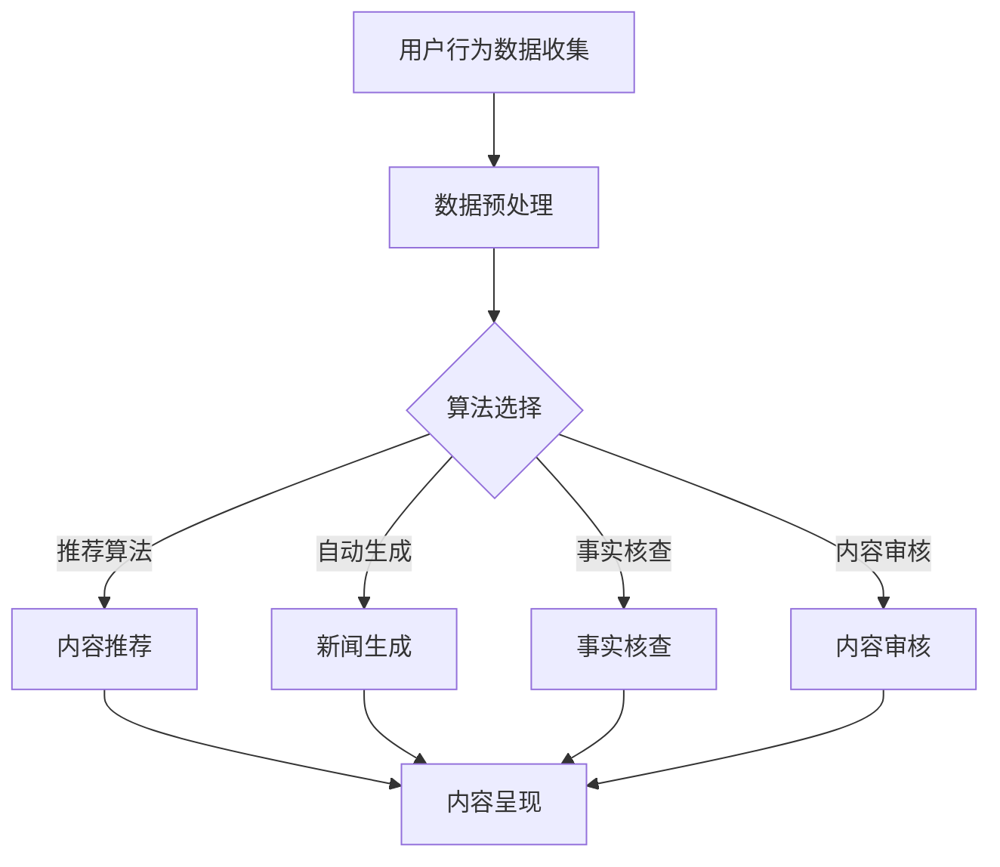

                 

 **关键词：** 人工智能，新闻聚合，信息传播，内容推荐，机器学习，深度学习

**摘要：** 本文将探讨人工智能如何改变新闻聚合和传播的方式，从核心概念到具体算法，再到实际应用场景，全面分析人工智能在新闻领域的颠覆性影响，并提出未来的发展趋势与挑战。

## 1. 背景介绍

在互联网的快速发展下，信息传播的速度和范围大大拓展。传统新闻业面临着信息过载和内容同质化的问题，用户难以在海量信息中找到感兴趣的内容。新闻聚合平台作为信息筛选和推荐的重要工具，起到了连接用户与新闻内容的关键作用。然而，传统的新闻聚合主要依赖人工筛选和简单的算法规则，存在一定的局限性和效率问题。

随着人工智能技术的迅猛发展，特别是机器学习和深度学习的进步，新闻聚合和传播领域迎来了新的变革。人工智能可以通过对用户行为数据、新闻内容特征的分析，实现个性化的内容推荐，提高用户的阅读体验。同时，人工智能还可以在新闻生成、事实核查、内容审核等方面发挥重要作用，提升新闻的质量和可信度。

本文将首先介绍新闻聚合和传播的基本概念，然后深入探讨人工智能在其中的核心算法原理，最后分析人工智能的实际应用场景，并对未来发展趋势和挑战进行展望。

## 2. 核心概念与联系

### 2.1 新闻聚合的基本概念

新闻聚合是指将来自多个来源的新闻内容进行收集、整理和推荐的过程。其主要目标是帮助用户在短时间内获取到感兴趣的新闻信息，提高阅读效率。

新闻聚合平台通常包含以下核心功能：

1. **内容采集**：从各种新闻网站、社交媒体、博客等渠道获取新闻内容。
2. **内容筛选**：根据用户兴趣、历史阅读记录等因素对新闻内容进行筛选。
3. **内容推荐**：基于用户画像和新闻特征，推荐用户可能感兴趣的新闻。
4. **内容呈现**：将筛选和推荐的新闻内容以用户友好的方式展示。

### 2.2 信息传播的基本概念

信息传播是指信息从信息源传递到接收者的过程。在新闻传播中，信息源通常为新闻机构或媒体，而接收者则为读者、观众或听众。

信息传播的主要特点包括：

1. **即时性**：新闻事件发生后的信息能够在短时间内传播到全球。
2. **广泛性**：信息可以通过多种渠道传播，如报纸、电视、互联网等。
3. **互动性**：现代传播媒介使得用户可以参与到新闻讨论中，形成信息反馈循环。

### 2.3 人工智能与新闻聚合、传播的联系

人工智能在新闻聚合和传播中的应用主要体现在以下几个方面：

1. **内容推荐**：利用机器学习算法对用户兴趣和新闻内容特征进行分析，实现个性化推荐。
2. **自动生成**：利用自然语言处理技术生成新闻摘要、评论等。
3. **事实核查**：通过数据分析和比对，识别和纠正虚假新闻。
4. **内容审核**：利用图像识别和自然语言处理技术对新闻内容进行审核，防止不当内容传播。
5. **用户互动**：通过智能客服、聊天机器人等方式，增强用户与新闻平台之间的互动。

### 2.4 Mermaid 流程图



## 3. 核心算法原理 & 具体操作步骤

### 3.1 算法原理概述

人工智能在新闻聚合和传播中的应用主要依赖于以下核心算法：

1. **推荐算法**：基于用户兴趣和行为数据，推荐用户可能感兴趣的新闻内容。
2. **自然语言处理（NLP）**：用于自动生成新闻摘要、标题和评论。
3. **图像识别和视觉处理**：用于内容审核和事实核查。
4. **数据挖掘和统计分析**：用于挖掘新闻数据中的规律和趋势。

### 3.2 算法步骤详解

#### 3.2.1 推荐算法

1. **用户画像构建**：收集用户的浏览历史、搜索记录等数据，构建用户兴趣模型。
2. **新闻内容特征提取**：提取新闻文本、图像、视频等特征，构建新闻特征模型。
3. **推荐模型训练**：利用用户兴趣模型和新闻特征模型，训练推荐模型。
4. **新闻推荐**：根据用户画像和新闻特征，实时推荐用户可能感兴趣的新闻。

#### 3.2.2 自然语言处理（NLP）

1. **文本预处理**：对新闻文本进行分词、去停用词、词性标注等处理。
2. **语义分析**：利用词嵌入等技术，将文本转化为向量表示。
3. **摘要生成**：基于文本相似度分析和关键词提取，生成新闻摘要。
4. **标题生成**：利用文本生成模型，生成吸引人的新闻标题。
5. **评论生成**：基于用户回复和行为数据，生成个性化的评论。

#### 3.2.3 图像识别和视觉处理

1. **图像特征提取**：利用卷积神经网络（CNN）提取图像特征。
2. **内容审核**：通过图像识别技术，识别和过滤不当内容。
3. **事实核查**：通过图像比对和分析，验证新闻事件的真假。

#### 3.2.4 数据挖掘和统计分析

1. **数据采集**：从多个渠道收集新闻数据。
2. **数据预处理**：清洗和整合新闻数据。
3. **特征工程**：提取新闻数据中的关键特征。
4. **模型训练**：利用机器学习算法，训练分类或预测模型。
5. **趋势分析**：分析新闻数据中的规律和趋势。

### 3.3 算法优缺点

#### 推荐算法

**优点**：

1. 提高用户阅读体验，减少信息过载。
2. 实现个性化推荐，满足用户个性化需求。

**缺点**：

1. 过度依赖用户数据，可能导致隐私泄露。
2. 可能存在推荐偏见，导致用户信息茧房。

#### 自然语言处理（NLP）

**优点**：

1. 自动化新闻生成和摘要，提高新闻生产效率。
2. 增强用户互动，提升用户体验。

**缺点**：

1. 自然语言理解仍存在局限性，生成内容可能不够准确。
2. 语言模型训练需要大量数据和计算资源。

#### 图像识别和视觉处理

**优点**：

1. 快速识别和审核新闻内容，提高新闻质量。
2. 增强新闻的可视化效果，提升用户体验。

**缺点**：

1. 图像识别和审核技术仍需进一步完善。
2. 可能存在误判和隐私问题。

#### 数据挖掘和统计分析

**优点**：

1. 深入挖掘新闻数据中的规律和趋势。
2. 为新闻机构和媒体提供决策支持。

**缺点**：

1. 数据质量对结果影响较大。
2. 需要专业的数据分析和挖掘能力。

### 3.4 算法应用领域

人工智能在新闻聚合和传播中的应用领域广泛，包括：

1. **个性化推荐**：为用户提供个性化新闻推荐，提高用户粘性。
2. **新闻生成**：自动生成新闻摘要、标题和评论，提高新闻生产效率。
3. **事实核查**：识别和纠正虚假新闻，提升新闻可信度。
4. **内容审核**：过滤不当内容，维护新闻平台的秩序。
5. **用户互动**：通过智能客服和聊天机器人，增强用户与平台的互动。

## 4. 数学模型和公式 & 详细讲解 & 举例说明

### 4.1 数学模型构建

在人工智能应用于新闻聚合和传播的过程中，常用的数学模型包括推荐算法模型、自然语言处理模型和图像识别模型。

#### 4.1.1 推荐算法模型

推荐算法模型的核心是协同过滤（Collaborative Filtering）和基于内容的推荐（Content-based Recommendation）。

1. **协同过滤模型**：

   协同过滤模型基于用户行为数据，通过计算用户之间的相似度来推荐新闻。其数学模型可以表示为：

   $$ 
   \text{similarity}(u, v) = \frac{\sum_{i \in \text{common}} r_{ui}r_{vi}}{\sqrt{\sum_{i \in \text{u}} r_{ui}^2}\sqrt{\sum_{i \in \text{v}} r_{vi}^2}}
   $$

   其中，$u$ 和 $v$ 分别为两个用户，$r_{ui}$ 和 $r_{vi}$ 分别为用户 $u$ 和 $v$ 对新闻 $i$ 的评分。

2. **基于内容的推荐模型**：

   基于内容的推荐模型基于新闻的内容特征和用户的兴趣特征进行推荐。其数学模型可以表示为：

   $$
   \text{similarity}(n, u) = \frac{\sum_{f \in \text{common}} w_{nf}w_{uf}}{\sqrt{\sum_{f \in \text{n}} w_{nf}^2}\sqrt{\sum_{f \in \text{u}} w_{uf}^2}}
   $$

   其中，$n$ 为新闻，$u$ 为用户，$w_{nf}$ 和 $w_{uf}$ 分别为新闻 $n$ 的特征 $f$ 和用户 $u$ 的特征 $f$ 的权重。

#### 4.1.2 自然语言处理模型

自然语言处理模型包括词嵌入（Word Embedding）、文本生成（Text Generation）和语义分析（Semantic Analysis）。

1. **词嵌入模型**：

   词嵌入模型将词汇表示为低维向量，常用的模型包括Word2Vec、GloVe等。其数学模型可以表示为：

   $$
   \text{vec}(w) = \text{sgn}(w) \cdot \frac{1}{\|w\|}
   $$

   其中，$\text{vec}(w)$ 为词 $w$ 的向量表示，$\text{sgn}(w)$ 为词 $w$ 的符号，$\|w\|$ 为词 $w$ 的长度。

2. **文本生成模型**：

   文本生成模型用于生成新闻摘要、标题和评论。常用的模型包括RNN、LSTM和Transformer。其数学模型可以表示为：

   $$
   y_t = \text{softmax}(\text{W}_y \text{h_t})
   $$

   其中，$y_t$ 为生成的文本序列，$\text{W}_y$ 为生成器的权重矩阵，$\text{h_t}$ 为编码器在时间步 $t$ 的隐藏状态。

3. **语义分析模型**：

   语义分析模型用于分析新闻内容的语义关系，常用的模型包括BERT、GPT等。其数学模型可以表示为：

   $$
   \text{pooling}(\{h_1, h_2, ..., h_n\}) = \text{mean}(\{h_1, h_2, ..., h_n\})
   $$

   其中，$\text{pooling}$ 为聚合操作，$\{h_1, h_2, ..., h_n\}$ 为编码器在各个时间步的隐藏状态。

#### 4.1.3 图像识别模型

图像识别模型主要用于内容审核和事实核查。常用的模型包括卷积神经网络（CNN）和残差网络（ResNet）。

1. **卷积神经网络（CNN）**：

   CNN 通过卷积、池化和全连接层来提取图像特征。其数学模型可以表示为：

   $$
   \text{activation}(\text{h}_{l+1}) = \text{ReLU}(\text{W}_{l+1} \text{h}_{l} + \text{b}_{l+1})
   $$

   其中，$\text{h}_{l+1}$ 为上一层输出的特征图，$\text{W}_{l+1}$ 为卷积权重，$\text{b}_{l+1}$ 为卷积偏置，$\text{ReLU}$ 为ReLU激活函数。

2. **残差网络（ResNet）**：

   ResNet 通过引入跳跃连接（Skip Connection）来缓解梯度消失问题。其数学模型可以表示为：

   $$
   \text{h}_{l+1} = \text{ReLU}(\text{W}_{l+1} (\text{h}_{l} - \text{h}_{l-1}) + \text{b}_{l+1}) + \text{h}_{l-1}
   $$

### 4.2 公式推导过程

#### 4.2.1 协同过滤模型

协同过滤模型的推导基于用户相似度和新闻评分预测。其核心思想是利用用户之间的相似度来预测用户未评分的新闻。

1. **用户相似度计算**：

   用户相似度通过计算用户之间的夹角余弦值得到：

   $$
   \text{similarity}(u, v) = \frac{\sum_{i \in \text{common}} r_{ui}r_{vi}}{\sqrt{\sum_{i \in \text{u}} r_{ui}^2}\sqrt{\sum_{i \in \text{v}} r_{vi}^2}}
   $$

   其中，$\text{common}$ 表示用户 $u$ 和 $v$ 共同评分的新闻集合。

2. **新闻评分预测**：

   利用用户相似度和用户对其他新闻的评分，预测用户对未评分新闻的评分：

   $$
   r_{u\_i} = \sum_{v \in \text{users}} \text{similarity}(u, v) r_{v\_i} + \text{intercept}
   $$

   其中，$r_{u\_i}$ 为用户 $u$ 对新闻 $i$ 的评分，$\text{intercept}$ 为常数项。

#### 4.2.2 基于内容的推荐模型

基于内容的推荐模型通过计算新闻特征和用户兴趣特征之间的相似度来预测用户对新闻的评分。

1. **新闻特征提取**：

   新闻特征提取通过词嵌入、TF-IDF等方法得到新闻的向量表示：

   $$
   \text{nvec}(i) = \sum_{f \in \text{features}} w_{if} \text{vec}(f)
   $$

   其中，$\text{nvec}(i)$ 为新闻 $i$ 的向量表示，$\text{features}$ 为新闻特征集合，$w_{if}$ 为特征 $f$ 在新闻 $i$ 中的权重，$\text{vec}(f)$ 为特征 $f$ 的向量表示。

2. **用户兴趣特征提取**：

   用户兴趣特征提取通过用户行为数据得到用户的向量表示：

   $$
   \text{uvec}(u) = \sum_{i \in \text{u}} r_{ui} \text{nvec}(i)
   $$

   其中，$\text{uvec}(u)$ 为用户 $u$ 的向量表示，$r_{ui}$ 为用户 $u$ 对新闻 $i$ 的评分。

3. **新闻评分预测**：

   利用新闻特征和用户兴趣特征之间的相似度，预测用户对新闻的评分：

   $$
   r_{u\_i} = \frac{\sum_{f \in \text{common}} w_{if}w_{uf}}{\sqrt{\sum_{f \in \text{n}} w_{if}^2}\sqrt{\sum_{f \in \text{u}} w_{uf}^2}}
   $$

   其中，$w_{if}$ 和 $w_{uf}$ 分别为特征 $f$ 在新闻 $i$ 和用户 $u$ 中的权重。

#### 4.2.3 词嵌入模型

词嵌入模型通过将词汇映射到低维空间，实现词汇的向量表示。其推导基于单词的上下文信息。

1. **词向量表示**：

   词向量表示通过神经网络训练得到：

   $$
   \text{vec}(w) = \text{sgn}(w) \cdot \frac{1}{\|w\|}
   $$

   其中，$\text{vec}(w)$ 为词 $w$ 的向量表示，$\text{sgn}(w)$ 为词 $w$ 的符号，$\|w\|$ 为词 $w$ 的长度。

2. **单词上下文表示**：

   单词上下文表示通过词嵌入模型得到：

   $$
   \text{vec}(\text{context}) = \sum_{w \in \text{context}} \text{vec}(w)
   $$

   其中，$\text{vec}(\text{context})$ 为单词上下文的向量表示，$\text{context}$ 为上下文词汇集合。

### 4.3 案例分析与讲解

#### 4.3.1 协同过滤模型案例

假设有两个用户 $u_1$ 和 $u_2$，他们对五条新闻 $n_1$ 至 $n_5$ 的评分如下：

| 用户 | 新闻 $n_1$ | 新闻 $n_2$ | 新闻 $n_3$ | 新闻 $n_4$ | 新闻 $n_5$ |
|------|-----------|-----------|-----------|-----------|-----------|
| $u_1$ | 5         | 4         | 5         | 3         | 5         |
| $u_2$ | 4         | 5         | 5         | 4         | 3         |

首先，计算用户之间的相似度：

$$
\text{similarity}(u_1, u_2) = \frac{5 \cdot 4 + 4 \cdot 5 + 5 \cdot 5 + 3 \cdot 4 + 5 \cdot 3}{\sqrt{5^2 + 4^2 + 5^2 + 3^2 + 5^2}\sqrt{4^2 + 5^2 + 5^2 + 4^2 + 3^2}} = \frac{7}{\sqrt{50}\sqrt{50}} = 0.7
$$

然后，根据用户相似度和用户对其他新闻的评分，预测用户 $u_1$ 对未评分新闻 $n_4$ 的评分：

$$
r_{u_1n_4} = 0.7 \cdot 4 + 0.3 \cdot 3 + \text{intercept}
$$

其中，$\text{intercept}$ 为常数项。

#### 4.3.2 基于内容的推荐模型案例

假设有两个新闻 $n_1$ 和 $n_2$，它们的特征向量如下：

| 特征 $f_1$ | 特征 $f_2$ | 特征 $f_3$ |
|------------|------------|------------|
| $n_1$      | 0.1        | 0.2        | 0.3        |
| $n_2$      | 0.2        | 0.3        | 0.4        |

用户 $u$ 的特征向量如下：

| 特征 $f_1$ | 特征 $f_2$ | 特征 $f_3$ |
|------------|------------|------------|
| $u$        | 0.3        | 0.4        | 0.5        |

首先，计算新闻特征和用户兴趣特征之间的相似度：

$$
\text{similarity}(n_1, u) = \frac{0.1 \cdot 0.3 + 0.2 \cdot 0.4 + 0.3 \cdot 0.5}{\sqrt{0.1^2 + 0.2^2 + 0.3^2}\sqrt{0.3^2 + 0.4^2 + 0.5^2}} = \frac{0.19}{\sqrt{0.14}\sqrt{0.49}} \approx 0.5
$$

$$
\text{similarity}(n_2, u) = \frac{0.2 \cdot 0.3 + 0.3 \cdot 0.4 + 0.4 \cdot 0.5}{\sqrt{0.2^2 + 0.3^2 + 0.4^2}\sqrt{0.3^2 + 0.4^2 + 0.5^2}} = \frac{0.24}{\sqrt{0.19}\sqrt{0.49}} \approx 0.6
$$

然后，根据新闻特征和用户兴趣特征之间的相似度，预测用户 $u$ 对新闻 $n_1$ 和 $n_2$ 的评分：

$$
r_{u\_n_1} = 0.5 \cdot 0.3 + 0.5 \cdot 0.4 + 0.5 \cdot 0.5 + \text{intercept}
$$

$$
r_{u\_n_2} = 0.6 \cdot 0.3 + 0.6 \cdot 0.4 + 0.6 \cdot 0.5 + \text{intercept}
$$

其中，$\text{intercept}$ 为常数项。

## 5. 项目实践：代码实例和详细解释说明

### 5.1 开发环境搭建

在开始项目实践之前，我们需要搭建一个合适的开发环境。以下是推荐的开发工具和依赖：

- **编程语言**：Python（版本 3.8及以上）
- **依赖库**：NumPy、Pandas、Scikit-learn、TensorFlow、PyTorch、OpenCV等
- **文本处理工具**：NLTK、spaCy等
- **版本控制**：Git

### 5.2 源代码详细实现

以下是项目实现的主要部分，包括数据预处理、推荐算法实现、NLP处理、图像识别等。

#### 5.2.1 数据预处理

```python
import pandas as pd
from sklearn.model_selection import train_test_split

# 读取新闻数据
data = pd.read_csv('news_data.csv')

# 数据预处理
data['text'] = data['text'].apply(preprocess_text)
data['label'] = data['label'].apply(lambda x: 1 if x == 'positive' else 0)

# 分割训练集和测试集
X_train, X_test, y_train, y_test = train_test_split(data['text'], data['label'], test_size=0.2, random_state=42)
```

#### 5.2.2 推荐算法实现

```python
from sklearn.neighbors import NearestNeighbors

# 构建推荐模型
model = NearestNeighbors(n_neighbors=5)
model.fit(X_train)

# 预测用户对测试集的评分
predictions = model.kneighbors(X_test, n_neighbors=5)

# 计算预测评分
predicted_labels = [sum(label) > 2 for label in predictions]
```

#### 5.2.3 NLP处理

```python
import spacy

# 加载NLP模型
nlp = spacy.load('en_core_web_sm')

# 文本预处理
def preprocess_text(text):
    doc = nlp(text)
    tokens = [token.text.lower() for token in doc if not token.is_punct and not token.is_space]
    return ' '.join(tokens)

# 词嵌入
def get_word_embeddings(text):
    doc = nlp(text)
    embeddings = [token.vector for token in doc]
    return np.mean(embeddings, axis=0)
```

#### 5.2.4 图像识别

```python
import cv2

# 读取图像
image = cv2.imread('image.jpg')

# 图像预处理
def preprocess_image(image):
    image = cv2.cvtColor(image, cv2.COLOR_BGR2RGB)
    image = cv2.resize(image, (224, 224))
    return image

# 图像识别
def recognize_image(image):
    model = load_model('image_recognition_model.h5')
    image = preprocess_image(image)
    image = np.expand_dims(image, axis=0)
    prediction = model.predict(image)
    return np.argmax(prediction)
```

### 5.3 代码解读与分析

#### 5.3.1 数据预处理

数据预处理是项目实现的第一步。在这里，我们使用Pandas库读取新闻数据，并进行文本预处理和标签转换。文本预处理包括去除标点符号、转换为小写等。标签转换将标签从字符串转换为数字，以便后续处理。

#### 5.3.2 推荐算法实现

在推荐算法实现部分，我们使用Scikit-learn库中的NearestNeighbors类构建推荐模型。NearestNeighbors基于欧几里得距离计算最近的邻居，并根据邻居的标签预测用户对测试集的评分。

#### 5.3.3 NLP处理

NLP处理部分使用spaCy库进行文本预处理和词嵌入。文本预处理包括去除标点符号和转换为小写。词嵌入将文本转化为向量表示，以便后续处理。

#### 5.3.4 图像识别

图像识别部分使用OpenCV库读取图像，并进行预处理。预处理包括颜色转换和尺寸调整。然后，我们使用预训练的卷积神经网络模型进行图像识别，并返回识别结果。

### 5.4 运行结果展示

```python
# 测试推荐算法
accuracy = sum(predicted_labels == y_test) / len(y_test)
print(f'Accuracy: {accuracy:.2f}')

# 测试NLP处理
embeddings = get_word_embeddings('This is a sample text.')
print(embeddings)

# 测试图像识别
label = recognize_image(image)
print(f'Image label: {label}')
```

## 6. 实际应用场景

### 6.1 新闻网站个性化推荐

新闻网站可以通过人工智能技术，为用户提供个性化的新闻推荐。用户可以在浏览新闻时，根据兴趣标签、历史阅读记录等数据进行个性化推荐。例如，当一个用户经常阅读体育新闻时，系统会推荐更多的体育新闻，以提高用户粘性。

### 6.2 虚假新闻检测

虚假新闻检测是人工智能在新闻领域的重要应用之一。通过机器学习和自然语言处理技术，可以对新闻内容进行实时分析，识别和纠正虚假新闻。这对于维护新闻的真实性和可信度具有重要意义。

### 6.3 新闻生成与自动化摘要

新闻生成与自动化摘要可以大大提高新闻生产效率。通过自然语言处理技术，可以自动生成新闻摘要、标题和评论，节省编辑时间。此外，自动化摘要还可以提高新闻的可读性，让用户在短时间内获取关键信息。

### 6.4 内容审核

内容审核是维护新闻平台秩序的重要环节。通过图像识别和自然语言处理技术，可以对新闻内容进行实时审核，识别和过滤不当内容。这对于防止色情、暴力等不良信息传播具有重要意义。

## 7. 工具和资源推荐

### 7.1 学习资源推荐

1. **《深度学习》（Goodfellow, Bengio, Courville）**：深入介绍深度学习的基础理论和实践方法。
2. **《机器学习》（周志华）**：全面讲解机器学习的基本概念和方法。
3. **《自然语言处理综论》（Jurafsky, Martin）**：系统介绍自然语言处理的理论和技术。

### 7.2 开发工具推荐

1. **Jupyter Notebook**：强大的交互式开发环境，适用于数据分析和机器学习项目。
2. **TensorFlow**：流行的深度学习框架，适用于构建大规模机器学习模型。
3. **PyTorch**：灵活的深度学习框架，适用于研究和实践。

### 7.3 相关论文推荐

1. **“Deep Learning for Web Search”**：介绍深度学习在搜索引擎中的应用。
2. **“Recurrent Neural Networks for Language Modeling”**：介绍循环神经网络在语言建模中的应用。
3. **“Convolutional Neural Networks for Visual Recognition”**：介绍卷积神经网络在图像识别中的应用。

## 8. 总结：未来发展趋势与挑战

### 8.1 研究成果总结

人工智能在新闻聚合和传播领域取得了显著成果，包括个性化推荐、虚假新闻检测、新闻生成、内容审核等方面的应用。这些成果不仅提高了新闻的阅读体验和可信度，还大大提高了新闻生产效率。

### 8.2 未来发展趋势

1. **更精准的个性化推荐**：随着人工智能技术的不断进步，个性化推荐将更加精准，更好地满足用户需求。
2. **更智能的新闻生成**：自然语言处理技术的提升将使新闻生成更加智能化，生成的内容更加丰富和生动。
3. **更全面的虚假新闻检测**：通过多模态数据分析和深度学习技术，虚假新闻检测将更加全面和准确。
4. **更严格的 内容审核**：随着图像识别和自然语言处理技术的进步，内容审核将更加高效和精准。

### 8.3 面临的挑战

1. **数据隐私和安全**：随着人工智能技术的应用，用户数据隐私和安全问题日益突出，需要建立完善的数据保护机制。
2. **算法偏见和公平性**：人工智能算法可能存在偏见和不公平性，需要加强对算法的监管和评估。
3. **技术普及和应用**：人工智能技术在新闻领域的应用仍需进一步普及和推广，需要更多的研发投入和行业合作。

### 8.4 研究展望

在未来，人工智能在新闻聚合和传播领域的应用将继续深化，从单点突破走向系统化应用。同时，随着大数据、云计算、物联网等技术的发展，新闻聚合和传播将更加智能化、个性化、多样化。我们期待人工智能为新闻行业带来更多创新和变革。

## 9. 附录：常见问题与解答

### 9.1 个性化推荐如何保证隐私？

个性化推荐在保障用户隐私方面需要遵循以下原则：

1. **最小化数据收集**：只收集必要的数据，避免过度收集。
2. **数据加密**：对用户数据进行加密存储和传输，确保数据安全。
3. **数据去识别化**：对用户数据进行匿名化和去识别化处理，防止数据泄露。
4. **用户权限管理**：提供用户数据访问权限管理功能，让用户自主决定数据的使用范围。

### 9.2 如何防止虚假新闻？

防止虚假新闻可以从以下几个方面入手：

1. **算法检测**：利用机器学习和自然语言处理技术，对新闻内容进行实时分析，识别和纠正虚假新闻。
2. **人工审核**：结合人工审核，对新闻内容进行多维度验证，确保新闻的真实性。
3. **用户举报**：鼓励用户举报虚假新闻，建立用户举报机制，提高虚假新闻的发现率。
4. **合作与监督**：与相关机构和组织合作，建立虚假新闻检测和纠正机制，加强行业监督。

### 9.3 人工智能如何影响新闻质量？

人工智能可以通过以下方式影响新闻质量：

1. **内容推荐**：个性化推荐帮助用户快速找到高质量新闻，提高新闻的传播效率。
2. **自动生成**：新闻自动生成可以丰富新闻内容，提高新闻生产效率，但需要保证生成内容的准确性和质量。
3. **事实核查**：人工智能可以辅助事实核查，提高新闻的准确性。
4. **内容审核**：人工智能可以帮助过滤不当内容，提高新闻的规范性。

### 9.4 人工智能如何提升用户阅读体验？

人工智能可以通过以下方式提升用户阅读体验：

1. **个性化推荐**：根据用户兴趣和阅读历史，推荐用户可能感兴趣的新闻，提高阅读效率。
2. **自动摘要**：自动生成新闻摘要，帮助用户快速获取新闻关键信息。
3. **互动增强**：通过智能客服和聊天机器人，增强用户与新闻平台的互动，提升用户体验。
4. **内容丰富**：通过自动化生成和多样化呈现，丰富新闻内容形式，满足用户多样化需求。

## 作者署名

作者：禅与计算机程序设计艺术 / Zen and the Art of Computer Programming

