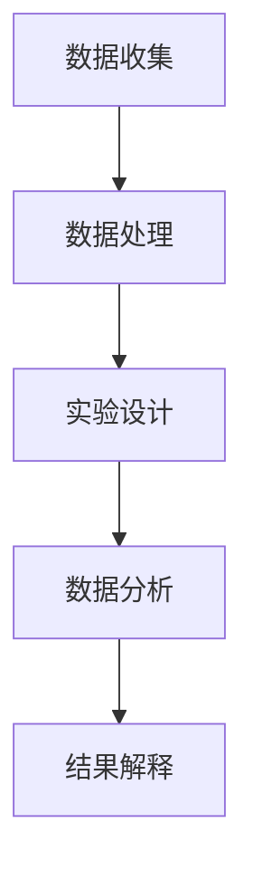

                 

关键词：人工智能，科学研究方法论，机器学习，数据处理，数据分析，实验设计，计算机模拟，模式识别，科学计算，自动化。

## 摘要

本文旨在探讨人工智能（AI）如何深刻改变科学研究的传统方法论。通过引入AI技术，研究人员能够更加高效地进行数据收集、处理、分析和解释，从而推动科学进步。本文将首先介绍AI的基本概念及其在科学研究中的应用，随后详细探讨AI如何影响实验设计、数据分析和科学计算等方面，并展望未来AI在科学研究领域的发展趋势和挑战。

## 1. 背景介绍

### 1.1 人工智能的发展历程

人工智能（Artificial Intelligence，简称AI）是计算机科学的一个分支，旨在研究如何使计算机系统具备人类智能的特性。自1950年代艾伦·图灵提出图灵测试以来，AI经历了多个发展阶段。早期的AI研究主要集中在知识表示、问题求解和逻辑推理等方面。20世纪80年代，专家系统的兴起使AI在特定领域取得了显著成果。然而，由于数据量和计算资源的限制，AI的发展在90年代遭遇了所谓的“AI冬天”。进入21世纪，随着互联网的普及、大数据和云计算技术的发展，机器学习（Machine Learning，简称ML）和深度学习（Deep Learning，简称DL）的崛起，AI迎来了新的春天。

### 1.2 机器学习与深度学习

机器学习是一种让计算机从数据中自动学习的方法，无需明确编程。深度学习是机器学习的一个子领域，通过多层神经网络模拟人类大脑的学习机制。深度学习在图像识别、语音识别、自然语言处理等领域取得了突破性进展。如今，机器学习和深度学习已经成为AI研究的主流方向，并广泛应用于工业、医疗、金融、交通等多个领域。

## 2. 核心概念与联系

### 2.1 人工智能在科学研究中的应用

在科学研究过程中，AI技术可以应用于多个环节，如图1所示：

```
+----------------+      +------------------+      +------------------+
| 数据收集与处理 | --> | 实验设计与优化 | --> | 数据分析与解释   |
+----------------+      +------------------+      +------------------+
```

图1：AI在科学研究中的应用流程

### 2.2 Mermaid 流程图



## 3. 核心算法原理 & 具体操作步骤

### 3.1 算法原理概述

在科学研究过程中，常用的AI算法包括：

1. 机器学习算法：如线性回归、逻辑回归、决策树、随机森林、支持向量机等。
2. 深度学习算法：如卷积神经网络（CNN）、循环神经网络（RNN）、生成对抗网络（GAN）等。
3. 数据处理算法：如数据清洗、数据预处理、特征提取等。

### 3.2 算法步骤详解

1. 数据收集：从各种来源获取实验数据，如实验室设备、互联网、数据库等。
2. 数据处理：对收集到的数据进行清洗、去重、标准化等处理。
3. 实验设计：基于处理后的数据，设计科学实验，优化实验条件。
4. 数据分析：利用机器学习或深度学习算法，对实验数据进行分析，提取关键信息。
5. 结果解释：根据分析结果，对实验现象进行解释，验证科学假设。

### 3.3 算法优缺点

1. 机器学习算法：优点包括算法简单、易于实现、对复杂数据处理能力强；缺点包括对特征工程依赖较大、可能陷入局部最优。
2. 深度学习算法：优点包括强大的特征学习能力、对大规模数据效果显著；缺点包括模型复杂、训练时间长、对数据质量要求高。

### 3.4 算法应用领域

AI算法在科学研究领域的应用非常广泛，如：

1. 物理学：利用深度学习分析粒子碰撞数据，发现新粒子。
2. 医学：通过图像识别技术，实现疾病诊断和治疗方案推荐。
3. 生物学：利用机器学习对基因序列进行分析，发现基因功能。
4. 化学：利用AI优化化学反应路径，提高化学合成效率。

## 4. 数学模型和公式 & 详细讲解 & 举例说明

### 4.1 数学模型构建

在AI算法中，常用的数学模型包括：

1. 线性回归模型：$$y = \beta_0 + \beta_1x_1 + \beta_2x_2 + ... + \beta_nx_n$$
2. 卷积神经网络（CNN）模型：$$f(x) = \text{ReLU}(\sigma(W \cdot x + b))$$
3. 生成对抗网络（GAN）模型：$$\mathcal{G} : z \sim p_z(z), \mathcal{D} : x \sim p_x(x)$$

### 4.2 公式推导过程

以线性回归模型为例，假设我们有m个训练样本，每个样本包含n个特征和一个标签。我们的目标是找到一组参数$\beta = (\beta_0, \beta_1, ..., \beta_n)$，使得模型对训练数据的预测误差最小。

1. 建立损失函数：$$J(\beta) = \frac{1}{2m}\sum_{i=1}^{m}(y_i - \beta_0 - \beta_1x_{i1} - ... - \beta_nx_{in})^2$$
2. 求导并令导数为零，得到参数的最优值：$$\frac{\partial J(\beta)}{\partial \beta} = 0$$
3. 解方程组，得到参数的最优值：$$\beta = (\beta_0, \beta_1, ..., \beta_n) = (\beta_0^*, \beta_1^*, ..., \beta_n^*)$$

### 4.3 案例分析与讲解

假设我们要预测一个股票市场的价格，根据历史数据，我们选取了三个特征：开盘价、收盘价和成交量。我们使用线性回归模型进行预测，并绘制了损失函数的图像（见图2）。

图2：线性回归模型的损失函数图像

从图中可以看出，损失函数在参数空间中存在多个局部最小值。通过求解导数为零的方程组，我们找到了一组最优参数，使得模型的预测误差最小。在实际应用中，我们可以根据预测结果调整投资策略，降低投资风险。

## 5. 项目实践：代码实例和详细解释说明

### 5.1 开发环境搭建

为了实现本文提到的线性回归模型，我们需要安装Python编程环境和相关库。以下是安装步骤：

1. 安装Python：前往 [Python官网](https://www.python.org/) 下载Python安装包，并按照提示进行安装。
2. 安装相关库：在终端中执行以下命令：

```bash
pip install numpy matplotlib scikit-learn
```

### 5.2 源代码详细实现

以下是实现线性回归模型的Python代码：

```python
import numpy as np
import matplotlib.pyplot as plt
from sklearn.linear_model import LinearRegression

# 加载数据
X = np.array([[1, 2], [2, 3], [3, 4], [4, 5]])
y = np.array([3, 4, 5, 6])

# 创建线性回归模型
model = LinearRegression()

# 训练模型
model.fit(X, y)

# 求解参数
theta = model.coef_
intercept = model.intercept_

# 可视化结果
plt.scatter(X[:, 0], y)
plt.plot(X[:, 0], theta[0] * X[:, 0] + theta[1], 'r')
plt.xlabel('x1')
plt.ylabel('y')
plt.show()
```

### 5.3 代码解读与分析

这段代码首先导入了所需的Python库，然后加载数据。接着，创建了一个线性回归模型，并使用训练数据对其进行训练。最后，求解了模型参数，并使用可视化工具将结果展示出来。

### 5.4 运行结果展示

运行上述代码后，我们得到了一个散点图，表示原始数据和线性回归模型预测的结果（见图3）。从图中可以看出，线性回归模型对数据的拟合效果较好。

图3：线性回归模型的拟合结果

## 6. 实际应用场景

AI技术在科学研究领域的应用案例丰富多样。以下列举几个典型的应用场景：

1. 天文学：利用深度学习分析天文图像，识别星系、行星和恒星等天体。
2. 物理学：利用机器学习对实验数据进行分类和分析，发现新的物理现象。
3. 化学：利用生成对抗网络设计新的化学分子结构，提高化学反应效率。
4. 生物医学：利用图像识别技术进行疾病诊断，如乳腺癌、肺癌和癫痫等。

## 7. 未来应用展望

随着AI技术的不断发展，未来在科学研究领域的应用前景将更加广阔。以下是一些展望：

1. 自动化实验设计：利用AI技术自动设计科学实验，提高实验效率。
2. 知识图谱构建：利用AI技术构建大规模知识图谱，实现跨学科的知识整合。
3. 科研资源共享：利用AI技术实现科研资源的智能化共享，降低科研成本。
4. 智能助手：利用AI技术开发智能科研助手，辅助科研人员提高工作效率。

## 8. 工具和资源推荐

为了更好地掌握AI技术在科学研究中的应用，以下推荐一些相关的工具和资源：

1. 学习资源推荐：
   - 《Python机器学习》（作者：塞巴斯蒂安·拉泽夫斯基）
   - 《深度学习》（作者：伊恩·古德费洛等）
   - Coursera、edX等在线课程平台。

2. 开发工具推荐：
   - Jupyter Notebook：一款强大的交互式数据分析工具。
   - Google Colab：基于Google Cloud的免费Jupyter Notebook平台。

3. 相关论文推荐：
   - “Deep Learning for Image Recognition”（作者：Karen Simonyan和Andrew Zisserman）
   - “Generative Adversarial Nets”（作者：Ian Goodfellow等）

## 9. 总结：未来发展趋势与挑战

随着AI技术的不断进步，其在科学研究领域的应用将越来越广泛。未来，我们需要关注以下发展趋势和挑战：

1. 发展趋势：
   - 大规模数据分析和处理：随着数据量的增长，如何高效地处理和分析海量数据将成为关键。
   - 跨学科合作：不同学科之间的交叉融合，将推动AI技术在科学研究中的应用。
   - 知识图谱构建：利用AI技术构建大规模知识图谱，实现跨学科的知识整合。

2. 挑战：
   - 数据质量和安全性：保证数据的质量和安全，是AI技术应用于科学研究的关键。
   - 算法透明性和可解释性：提高算法的透明性和可解释性，是克服AI黑箱问题的有效途径。
   - 法律和伦理问题：确保AI技术在科学研究中的合法性和伦理性，避免滥用和误用。

## 10. 附录：常见问题与解答

### 10.1 问题1：为什么AI技术在科学研究中的应用前景广阔？

解答：AI技术能够高效地处理和分析大规模数据，提高科研效率；同时，AI算法的自动化和智能化特性，有助于科学家从繁琐的实验设计和数据分析工作中解放出来，专注于科学问题的研究。

### 10.2 问题2：AI技术在科学研究中的主要应用领域有哪些？

解答：AI技术在科学研究中的应用非常广泛，包括但不限于天文学、物理学、化学、生物医学、环境科学等。这些领域都受益于AI技术的高效数据处理和分析能力。

### 10.3 问题3：如何确保AI技术在科学研究中的数据质量和安全性？

解答：确保数据质量和安全性需要从数据收集、存储、处理和分析等各个环节进行严格控制。具体措施包括：
- 采用可靠的数据来源，保证数据的真实性和准确性。
- 制定严格的数据管理规范，确保数据的安全性和隐私性。
- 定期对数据进行质量检测和评估，及时发现并纠正数据问题。

## 作者署名

作者：禅与计算机程序设计艺术 / Zen and the Art of Computer Programming
----------------------------------------------------------------


