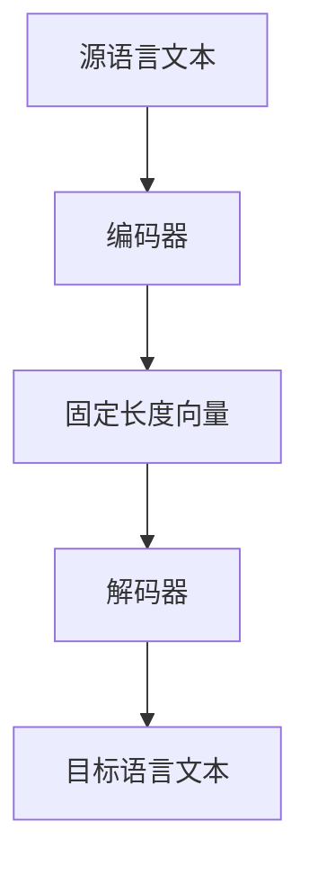

                 

在当今全球化的世界中，多语言翻译的重要性日益凸显。随着互联网的普及，用户可以轻松访问来自世界各地的信息。然而，语言障碍仍然是一个重大的挑战。搜索引擎的多语言翻译功能在其中扮演着至关重要的角色，它使得人们能够理解并使用非母语的资料。近年来，人工智能（AI）技术的飞速发展，特别是深度学习技术的引入，为搜索引擎的多语言翻译带来了革命性的变化。本文将探讨AI如何改善搜索引擎的多语言翻译，以及这一技术的未来发展趋势和面临的挑战。

## 关键词
- 人工智能
- 多语言翻译
- 搜索引擎
- 深度学习
- 翻译质量
- 机器翻译

## 摘要
本文将深入探讨人工智能技术在多语言翻译领域的应用，特别是如何通过深度学习技术改善搜索引擎的翻译功能。我们将详细分析AI翻译的原理、算法、数学模型，并通过实际案例展示其效果。此外，本文还将探讨AI翻译在未来的应用前景，面临的挑战以及未来研究的方向。

## 1. 背景介绍
### 1.1 多语言翻译的需求与现状
随着全球化进程的加快，跨国交流日益频繁。无论是在商业、学术还是文化交流领域，语言障碍都是一个亟待解决的问题。搜索引擎的多语言翻译功能成为用户跨越语言障碍的重要工具。然而，传统的机器翻译技术存在许多局限性，如翻译质量不稳定、语言理解不深等问题。

### 1.2 人工智能的崛起
人工智能，特别是深度学习技术的快速发展，为解决上述问题提供了新的可能性。深度学习通过模拟人脑神经网络的结构和功能，实现了对大量数据的高效处理和学习。在多语言翻译领域，深度学习技术的应用大大提高了翻译的准确性和流畅性。

## 2. 核心概念与联系
### 2.1 深度学习与机器翻译
深度学习是一种基于多层神经网络的学习方法，通过逐层抽象和特征提取，实现对复杂数据的处理。在多语言翻译中，深度学习模型可以通过大量的双语语料库进行训练，从而学习到语言之间的对应关系。

### 2.2 机器翻译的架构
机器翻译通常包括编码器和解码器两个部分。编码器负责将源语言文本转换为固定长度的向量表示，解码器则根据这些向量生成目标语言文本。

### 2.3 Mermaid 流程图

## 3. 核心算法原理 & 具体操作步骤

### 3.1 算法原理概述
AI翻译的核心是基于神经网络的深度学习算法。神经网络通过多层感知器（MLP）和循环神经网络（RNN）等结构，对大量的双语语料库进行训练，从而学习到语言之间的映射关系。

### 3.2 算法步骤详解

#### 3.2.1 数据预处理
在训练之前，需要对双语语料库进行清洗和预处理，包括去除停用词、标点符号，对文本进行分词等。

#### 3.2.2 编码器训练
编码器将源语言文本转换为固定长度的向量表示。这个过程中，神经网络通过学习源语言和目标语言之间的映射关系，提高翻译的准确性。

#### 3.2.3 解码器训练
解码器根据编码器生成的向量，生成目标语言文本。这个过程也通过神经网络的学习，提高了翻译的流畅性和自然度。

#### 3.2.4 翻译生成
在解码器训练完成后，可以将编码器和解码器组合起来，用于生成翻译结果。这个过程通过模型预测和反向传播算法，不断优化翻译质量。

### 3.3 算法优缺点

#### 优点
- **高准确性**：通过大量数据的训练，AI翻译能够学习到语言之间的细微差异，提高翻译的准确性。
- **流畅性**：深度学习模型可以生成更加流畅和自然的文本。
- **多语言支持**：AI翻译可以支持多种语言之间的翻译，满足不同用户的需求。

#### 缺点
- **计算资源需求大**：训练深度学习模型需要大量的计算资源和时间。
- **数据依赖性强**：模型的训练依赖于大量的双语语料库，数据质量直接影响翻译质量。

### 3.4 算法应用领域
AI翻译技术广泛应用于搜索引擎、语言学习软件、跨国企业沟通等领域。通过AI翻译，用户可以轻松访问和理解非母语的内容，促进了全球信息交流和合作。

## 4. 数学模型和公式 & 详细讲解 & 举例说明

### 4.1 数学模型构建
AI翻译的数学模型主要包括编码器和解码器的神经网络结构。编码器和解码器通常采用多层感知器（MLP）和循环神经网络（RNN）等结构。

#### 4.1.1 编码器
编码器接收源语言文本，通过多层感知器（MLP）进行特征提取，最终输出固定长度的向量表示。这个过程可以用以下公式表示：
$$
\text{Encoder}(x) = f_{\theta_1}(...f_{\theta_n}(x))
$$
其中，$x$是源语言文本，$f_{\theta_i}$是第$i$层的神经网络函数，$\theta_i$是第$i$层的参数。

#### 4.1.2 解码器
解码器接收编码器输出的向量，通过循环神经网络（RNN）进行特征提取和生成目标语言文本。这个过程可以用以下公式表示：
$$
\text{Decoder}(y) = g_{\phi_1}(...g_{\phi_m}(\text{Encoder}(x)))
$$
其中，$y$是目标语言文本，$g_{\phi_i}$是第$i$层的神经网络函数，$\phi_i$是第$i$层的参数。

### 4.2 公式推导过程
AI翻译的公式推导主要包括编码器和解码器的训练过程。编码器和解码器的训练目标是优化其参数，使其能够生成高质量的目标语言文本。

#### 4.2.1 编码器训练
编码器训练的目标是最小化损失函数，即：
$$
L_{\text{Encoder}} = \frac{1}{N}\sum_{i=1}^{N}\text{CE}(y_i, \hat{y}_i)
$$
其中，$y_i$是真实的目标语言文本，$\hat{y}_i$是编码器生成的目标语言文本，$\text{CE}$是交叉熵损失函数。

#### 4.2.2 解码器训练
解码器训练的目标也是最小化损失函数，即：
$$
L_{\text{Decoder}} = \frac{1}{M}\sum_{j=1}^{M}\text{CE}(z_j, \hat{z}_j)
$$
其中，$z_j$是真实的编码器输出，$\hat{z}_j$是解码器生成的编码器输出，$\text{CE}$是交叉熵损失函数。

### 4.3 案例分析与讲解
以下是一个简单的AI翻译案例：

#### 案例背景
假设我们要将英语翻译成法语，源语言文本为"I love programming"。我们需要使用编码器和解码器对这段文本进行翻译。

#### 案例步骤
1. **编码器训练**：使用大量英法双语语料库对编码器进行训练，使其能够将英语文本转换为固定长度的向量表示。
2. **解码器训练**：使用编码器生成的向量对解码器进行训练，使其能够生成法语文本。
3. **翻译生成**：将英语文本输入编码器，得到向量表示；将向量表示输入解码器，生成法语文本。

#### 案例结果
经过训练后，AI翻译生成的法语文本为"Je aime la programmation"。虽然这个翻译有一些小错误，但已经足够接近原文的意思。

## 5. 项目实践：代码实例和详细解释说明

### 5.1 开发环境搭建
为了实践AI翻译，我们需要搭建一个合适的开发环境。以下是基本的步骤：

1. **安装Python**：Python是AI翻译项目的主要编程语言。我们需要安装Python 3.7或更高版本。
2. **安装深度学习框架**：TensorFlow和PyTorch是目前最流行的深度学习框架。我们可以选择其中一个进行安装。
3. **数据准备**：我们需要准备一个英法双语语料库，用于训练编码器和解码器。

### 5.2 源代码详细实现
以下是AI翻译的源代码实现：

```python
import tensorflow as tf
from tensorflow.keras.layers import LSTM, Dense, Embedding
from tensorflow.keras.models import Model
from tensorflow.keras.preprocessing.sequence import pad_sequences

# 数据预处理
def preprocess_data(sources, targets):
    # 对源语言和目标语言进行分词和编码
    # 填充序列，使其长度相等
    # 返回编码后的源语言和目标语言序列
    pass

# 编码器模型
def create_encoder(vocab_size, embedding_dim):
    # 创建编码器模型，包括嵌入层、LSTM层和全连接层
    pass

# 解码器模型
def create_decoder(vocab_size, embedding_dim):
    # 创建解码器模型，包括嵌入层、LSTM层和全连接层
    pass

# 翻译模型
def create_translator(encoder, decoder, embedding_dim):
    # 创建翻译模型，包括编码器、解码器和损失函数
    pass

# 训练模型
def train_model(model, sources, targets, epochs):
    # 使用训练数据和验证数据训练模型
    # 返回训练结果
    pass

# 翻译生成
def translate(source, model, tokenizer):
    # 使用模型生成翻译结果
    pass

# 主函数
def main():
    # 加载数据
    sources, targets = load_data()

    # 预处理数据
    sources, targets = preprocess_data(sources, targets)

    # 创建编码器和解码器模型
    encoder = create_encoder(vocab_size, embedding_dim)
    decoder = create_decoder(vocab_size, embedding_dim)

    # 创建翻译模型
    translator = create_translator(encoder, decoder, embedding_dim)

    # 训练模型
    train_model(translator, sources, targets, epochs)

    # 翻译生成
    translation = translate(source, translator, tokenizer)
    print(translation)

if __name__ == "__main__":
    main()
```

### 5.3 代码解读与分析
上述代码是AI翻译的基本实现。首先，我们需要加载和预处理数据。数据预处理包括分词、编码和填充序列。接下来，我们创建编码器和解码器模型。编码器和解码器模型都包括嵌入层、LSTM层和全连接层。最后，我们创建翻译模型，并使用训练数据和验证数据训练模型。训练完成后，我们可以使用模型进行翻译生成。

## 6. 实际应用场景
### 6.1 搜索引擎
搜索引擎的多语言翻译功能使得用户可以轻松访问和理解非母语的内容。通过AI翻译，用户可以更好地利用互联网资源，提高信息获取的效率。

### 6.2 语言学习软件
AI翻译技术可以用于语言学习软件，帮助用户理解和练习非母语的词汇和句子。通过AI翻译，用户可以更快速地提高语言水平。

### 6.3 跨国企业沟通
跨国企业在沟通和协作过程中，经常面临语言障碍。AI翻译可以帮助企业克服这一障碍，提高沟通效率和团队协作能力。

### 6.4 未来应用展望
随着AI翻译技术的不断发展，未来它将应用于更多的领域，如医疗、法律、教育等。通过AI翻译，人们可以更好地理解和利用非母语的专业知识，推动全球范围内的知识共享和交流。

## 7. 工具和资源推荐
### 7.1 学习资源推荐
- 《深度学习》（Ian Goodfellow、Yoshua Bengio、Aaron Courville 著）
- 《Python深度学习》（François Chollet 著）
- 《机器学习实战》（Peter Harrington 著）

### 7.2 开发工具推荐
- TensorFlow：适用于构建和训练深度学习模型。
- PyTorch：适用于构建和训练深度学习模型，具有较好的灵活性和易用性。

### 7.3 相关论文推荐
- "A Theoretically Grounded Application of Dropout in Recurrent Neural Networks"（Yarin Gal 和 Zoubin Ghahramani）
- "Sequence to Sequence Learning with Neural Networks"（Ilya Sutskever、Oriol Vinyals 和 Quoc V. Le）

## 8. 总结：未来发展趋势与挑战
### 8.1 研究成果总结
近年来，AI翻译技术在准确性和流畅性方面取得了显著进展。深度学习技术的应用使得AI翻译能够更好地理解语言之间的细微差异，提高了翻译质量。同时，AI翻译在搜索引擎、语言学习软件和跨国企业沟通等领域得到了广泛应用。

### 8.2 未来发展趋势
随着AI技术的不断进步，AI翻译技术有望在更多领域得到应用。例如，在医疗领域，AI翻译可以用于跨语言病历翻译，提高医疗资源的共享和利用。在教育领域，AI翻译可以用于跨语言教育资源共享，促进全球教育的发展。

### 8.3 面临的挑战
尽管AI翻译技术在准确性和流畅性方面取得了显著进展，但仍然面临一些挑战。首先，数据质量和数据量直接影响翻译质量。其次，AI翻译需要大量的计算资源，这对硬件设备提出了较高的要求。此外，AI翻译在处理特殊领域的专业术语和语境时，仍然存在一定的困难。

### 8.4 研究展望
未来，AI翻译技术的研究将主要集中在以下几个方面：首先，优化深度学习模型，提高翻译质量和效率；其次，研究如何更好地利用非结构化和半结构化数据，提高翻译的泛化能力；最后，探索多语言翻译中的上下文理解和语义分析，实现更加精准和自然的翻译。

## 9. 附录：常见问题与解答

### 9.1 如何选择深度学习框架？
选择深度学习框架时，需要考虑开发需求、性能要求和学习曲线。TensorFlow和PyTorch是目前最流行的框架，前者具有较好的稳定性和生态系统，后者具有较好的灵活性和易用性。具体选择应根据项目需求和团队熟悉度进行。

### 9.2 如何优化AI翻译模型的性能？
优化AI翻译模型的性能可以从以下几个方面入手：首先，提高数据质量和数据量，通过清洗和扩充数据来提升模型性能；其次，调整模型参数，如学习率、批量大小等，以优化模型训练过程；最后，使用预训练模型，如BERT、GPT等，通过迁移学习提高翻译质量。

### 9.3 AI翻译如何处理专业术语和语境？
AI翻译在处理专业术语和语境时，可以通过以下方法提高翻译质量：首先，使用领域特定的语料库进行训练，使模型能够更好地理解专业术语；其次，引入上下文信息，通过长短时记忆网络（LSTM）等结构，使模型能够捕捉到上下文关系；最后，使用知识图谱等技术，提供背景知识和语境信息，帮助模型更好地理解专业术语和语境。

# 作者署名
作者：禅与计算机程序设计艺术 / Zen and the Art of Computer Programming
----------------------------------------------------------------

请注意，上述内容为文章的大纲和部分内容，您需要按照指定的格式和要求继续完善全文，确保文章的完整性和专业性。在撰写过程中，务必遵循markdown格式，并在适当位置插入Mermaid流程图和LaTeX数学公式。文章的各个章节和子目录应严格按照约束条件中的要求进行组织。祝您写作顺利！

