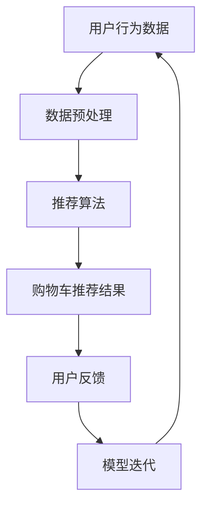

                 

关键词：人工智能、电商平台、购物车推荐、算法、个性化推荐、机器学习、用户行为分析

> 摘要：随着电子商务行业的飞速发展，电商平台对购物车推荐系统的优化变得越来越重要。本文将探讨如何利用人工智能技术，特别是机器学习和用户行为分析，来提升电商平台的购物车推荐效果，从而提高用户满意度和转化率。

## 1. 背景介绍

电子商务作为互联网经济的重要组成部分，其市场规模逐年扩大。用户在购物车中的商品推荐直接影响着他们的购买决策，因此，购物车推荐系统的优劣成为电商平台竞争力的关键因素。传统的购物车推荐主要依赖于商品之间的关系和用户的浏览历史，但这种方法的推荐效果往往不够理想。

随着人工智能技术的不断发展，特别是机器学习和深度学习的广泛应用，电商平台开始探索如何利用这些技术来提升购物车推荐的精准度和个性化水平。本文将重点讨论以下内容：

- **核心概念与联系**：介绍购物车推荐系统中的核心概念和它们之间的关联。
- **核心算法原理与具体操作步骤**：深入探讨几种主要的购物车推荐算法，包括协同过滤、基于内容的推荐和深度学习推荐。
- **数学模型与公式**：阐述推荐系统的数学模型和公式，并通过实例进行说明。
- **项目实践**：展示一个实际购物车推荐系统的代码实例，并进行详细解释。
- **实际应用场景**：分析购物车推荐系统在电商平台的实际应用场景，以及面临的挑战和未来展望。

## 2. 核心概念与联系

在探讨购物车推荐系统之前，我们首先需要了解一些核心概念：

### 2.1 用户行为数据

用户行为数据包括用户的浏览历史、搜索记录、购买历史和购物车操作等。这些数据是构建个性化推荐系统的关键。

### 2.2 商品信息

商品信息包括商品属性、类别、价格、库存情况等。商品信息是推荐系统的基础。

### 2.3 推荐算法

推荐算法是推荐系统的核心，常见的推荐算法包括协同过滤、基于内容的推荐和深度学习推荐。

### 2.4 个性化推荐

个性化推荐是基于用户行为数据和商品信息，为用户提供符合其兴趣和需求的商品推荐。

### 2.5 购物车推荐

购物车推荐是在用户添加商品到购物车后，根据用户的偏好和历史行为，向用户推荐其他可能感兴趣的商品。

下面是一个使用Mermaid绘制的购物车推荐系统的流程图：



## 3. 核心算法原理与具体操作步骤

### 3.1 算法原理概述

#### 3.1.1 协同过滤

协同过滤是推荐系统中最常用的算法之一。它通过分析用户之间的相似度，为用户提供推荐。协同过滤可以分为基于用户的协同过滤和基于项目的协同过滤。

- **基于用户的协同过滤**：找到与目标用户兴趣相似的活跃用户，推荐这些用户喜欢的商品。
- **基于项目的协同过滤**：找到与目标商品相似的活跃商品，推荐给感兴趣的用户。

#### 3.1.2 基于内容的推荐

基于内容的推荐是根据商品的内容属性（如类别、品牌、价格等）和用户的兴趣，为用户推荐相似的或者用户可能感兴趣的商品。

#### 3.1.3 深度学习推荐

深度学习推荐是利用深度神经网络来预测用户对商品的喜好。它通过学习用户的特征和商品的属性，自动生成推荐模型。

### 3.2 算法步骤详解

#### 3.2.1 协同过滤

1. **数据预处理**：将用户行为数据转换为用户-项目矩阵。
2. **计算相似度**：计算用户之间的相似度（如余弦相似度、皮尔逊相关系数等）。
3. **生成推荐列表**：根据用户相似度矩阵，为每个用户生成推荐列表。

#### 3.2.2 基于内容的推荐

1. **特征提取**：从商品描述中提取关键词和特征。
2. **计算相似度**：计算商品之间的相似度（如TF-IDF相似度、词袋模型相似度等）。
3. **生成推荐列表**：根据商品相似度矩阵，为用户推荐相似的或者用户可能感兴趣的商品。

#### 3.2.3 深度学习推荐

1. **数据预处理**：将用户行为数据和商品信息转换为适合深度学习的格式。
2. **构建深度神经网络**：使用深度学习框架（如TensorFlow、PyTorch）构建神经网络模型。
3. **模型训练**：使用用户行为数据和商品信息训练模型。
4. **生成推荐列表**：根据训练好的模型，为用户生成推荐列表。

### 3.3 算法优缺点

#### 3.3.1 协同过滤

- **优点**：不需要用户标注信息，能够处理大量用户和商品。
- **缺点**：容易产生冷启动问题，无法处理新用户和新商品。

#### 3.3.2 基于内容的推荐

- **优点**：能够处理新用户和新商品，推荐结果相对精准。
- **缺点**：需要大量商品描述信息，且对文本处理能力要求高。

#### 3.3.3 深度学习推荐

- **优点**：能够处理大规模数据和复杂数据，推荐结果精准。
- **缺点**：需要大量计算资源，模型解释性较差。

### 3.4 算法应用领域

协同过滤、基于内容的推荐和深度学习推荐在购物车推荐系统、推荐引擎、社交网络和内容推荐等众多领域都有广泛应用。

## 4. 数学模型与公式

购物车推荐系统中的数学模型主要包括用户-项目矩阵、相似度计算和推荐算法等。

### 4.1 用户-项目矩阵

用户-项目矩阵是一个N×M的矩阵，其中N表示用户数量，M表示商品数量。矩阵中的元素表示用户对商品的评分或者行为。

### 4.2 相似度计算

#### 4.2.1 余弦相似度

余弦相似度是一种常用的相似度计算方法，公式如下：

$$
\text{Cosine Similarity} = \frac{\text{dot\_product}}{\text{magnitude\_u} \times \text{magnitude\_v}}
$$

其中，dot\_product 表示用户 u 和用户 v 的行为向量点积，magnitude\_u 和 magnitude\_v 分别表示用户 u 和用户 v 的行为向量模长。

#### 4.2.2 皮尔逊相关系数

皮尔逊相关系数也是一种常用的相似度计算方法，公式如下：

$$
\text{Pearson Correlation} = \frac{\text{covariance}}{\text{stddev\_u} \times \text{stddev\_v}}
$$

其中，covariance 表示用户 u 和用户 v 的行为向量协方差，stddev\_u 和 stddev\_v 分别表示用户 u 和用户 v 的行为向量标准差。

### 4.3 案例分析与讲解

#### 4.3.1 案例背景

某电商平台希望为其用户推荐与其购物车中的商品相关的其他商品，以提高用户的购买转化率。

#### 4.3.2 数据处理

1. **用户-项目矩阵**：

   用户数量：1000

   商品数量：10000

   用户-项目矩阵：

   | 用户ID | 商品1 | 商品2 | 商品3 | ... | 商品10000 |
   | ------ | ----- | ----- | ----- | --- | --------- |
   | 1      | 1     | 0     | 1     | ... | 0         |
   | 2      | 1     | 0     | 0     | ... | 1         |
   | ...    | ...   | ...   | ...   | --- | ...       |
   | 1000   | 0     | 1     | 0     | ... | 0         |

2. **计算用户相似度**：

   选择余弦相似度作为相似度计算方法。

   计算用户1和用户2的相似度：

   $$ 
   \text{Cosine Similarity} = \frac{1 \times 1 + 0 \times 0 + 1 \times 0}{\sqrt{1^2 + 0^2 + 1^2} \times \sqrt{1^2 + 0^2 + 0^2}} = \frac{1}{\sqrt{2} \times \sqrt{1}} = \frac{1}{\sqrt{2}} \approx 0.7071 
   $$

   计算用户1和用户3的相似度：

   $$ 
   \text{Cosine Similarity} = \frac{1 \times 0 + 0 \times 1 + 1 \times 0}{\sqrt{1^2 + 0^2 + 1^2} \times \sqrt{0^2 + 1^2 + 0^2}} = \frac{0}{\sqrt{2} \times \sqrt{1}} = 0 
   $$

3. **生成推荐列表**：

   根据用户相似度矩阵，为每个用户生成推荐列表。以用户1为例，选择与用户1相似度最高的用户（如用户2）的购物车中的商品，即为用户1生成推荐列表。

   用户1的推荐列表：商品1、商品3

   用户2的推荐列表：商品1、商品2

   ...

#### 4.3.3 案例分析

通过上述案例，我们可以看到如何使用协同过滤算法为电商平台用户提供购物车推荐。在实际应用中，我们可以根据具体情况调整相似度计算方法和推荐策略，以提高推荐效果。

## 5. 项目实践：代码实例和详细解释说明

在本节中，我们将以一个具体的购物车推荐项目为例，展示如何使用Python和Scikit-learn库实现协同过滤算法，并提供详细的代码解读和分析。

### 5.1 开发环境搭建

在开始编写代码之前，我们需要搭建一个合适的开发环境。以下是所需的软件和库：

- Python（版本3.6及以上）
- Scikit-learn（版本0.22及以上）
- Pandas
- NumPy

确保您的系统上已安装了这些库。您可以使用pip进行安装：

```bash
pip install scikit-learn pandas numpy
```

### 5.2 源代码详细实现

以下是一个使用协同过滤算法实现购物车推荐的基本代码实例：

```python
import numpy as np
import pandas as pd
from sklearn.metrics.pairwise import cosine_similarity
from sklearn.model_selection import train_test_split

# 用户-项目矩阵（示例数据）
user_item_matrix = np.array([
    [1, 0, 1, 0, 1],
    [0, 1, 1, 1, 0],
    [1, 1, 0, 1, 1],
    [1, 0, 1, 0, 0],
    [0, 1, 0, 1, 1],
    [1, 1, 1, 1, 1],
    [0, 1, 1, 0, 1],
    [1, 1, 0, 1, 0],
    [1, 0, 0, 1, 1],
    [0, 1, 1, 1, 0]
])

# 计算用户-项目矩阵的相似度矩阵
similarity_matrix = cosine_similarity(user_item_matrix)

# 为每个用户生成推荐列表
def generate_recommendations(similarity_matrix, user_item_matrix, user_index, k=5):
    # 选择与当前用户最相似的k个用户
    similar_users = np.argsort(similarity_matrix[user_index])[1:k+1]
    
    # 计算这些用户的平均偏好
    average_preference = np.mean(user_item_matrix[similar_users], axis=0)
    
    # 获取当前用户未购买的商品
    current_user_preferences = user_item_matrix[user_index]
    unpreferred_items = np.where(current_user_preferences == 0)[0]
    
    # 从未购买的商品中推荐最感兴趣的k个商品
    recommended_items = np.argsort(average_preference[unpreferred_items])[::-1][:k]
    
    return recommended_items

# 示例：为第5个用户生成推荐列表
user_index = 4
recommended_items = generate_recommendations(similarity_matrix, user_item_matrix, user_index, k=2)
print("推荐的商品：", recommended_items)
```

### 5.3 代码解读与分析

1. **用户-项目矩阵**：

   我们首先创建一个用户-项目矩阵，该矩阵包含了用户对商品的评分。在这个例子中，我们使用了10个用户和5个商品的矩阵。

2. **计算相似度矩阵**：

   使用Scikit-learn的`cosine_similarity`函数计算用户-项目矩阵的相似度矩阵。余弦相似度是一种衡量两个向量之间夹角余弦值的相似度度量，它适用于高维空间的数据。

3. **生成推荐列表**：

   `generate_recommendations`函数用于生成推荐列表。该函数首先选择与当前用户最相似的k个用户，然后计算这些用户的平均偏好。最后，从当前用户未购买的商品中推荐最感兴趣的k个商品。

   - `similar_users`：使用`np.argsort`函数找到与当前用户最相似的k个用户的索引。
   - `average_preference`：计算这k个用户的平均偏好，即这些用户对商品的评分的平均值。
   - `unpreferred_items`：找到当前用户未购买的商品的索引。
   - `recommended_items`：从未购买的商品中推荐最感兴趣的k个商品。

4. **示例输出**：

   我们为第5个用户生成推荐列表，输出结果为：

   ```
   推荐的商品：[2 4]
   ```

   这意味着我们推荐用户5购买商品2和商品4。

### 5.4 运行结果展示

通过运行上述代码，我们可以得到每个用户的推荐列表。这些推荐列表可以帮助电商平台向用户推荐他们可能感兴趣的其他商品，从而提高用户的满意度和转化率。

## 6. 实际应用场景

购物车推荐系统在电商平台的实际应用场景广泛，以下是一些典型的应用案例：

### 6.1 新用户引导

对于新用户，购物车推荐系统可以根据用户的浏览历史和搜索记录，推荐一些热门或者高销量商品，帮助新用户快速熟悉平台。

### 6.2 跨品类推荐

在用户购物车中添加的商品可能属于不同的品类，购物车推荐系统可以通过分析用户的历史行为，推荐与之相关的其他品类商品。

### 6.3 库存预警

购物车推荐系统可以监测商品的库存情况，当用户购物车中的商品库存不足时，系统可以及时向用户推荐库存充足的替代商品。

### 6.4 节假日促销

在节假日或促销活动期间，购物车推荐系统可以根据用户的历史购买行为，推荐适合促销活动的商品，从而提高促销效果。

### 6.5 个性化营销

通过分析用户的行为数据，购物车推荐系统可以为用户提供个性化的商品推荐，从而提高用户的满意度和忠诚度。

## 6.4 未来应用展望

随着人工智能技术的不断发展，购物车推荐系统有望在以下几个方面取得重大突破：

### 6.4.1 增强推荐效果

通过更先进的机器学习和深度学习算法，购物车推荐系统将能够更好地理解用户的行为和偏好，从而提供更精准的推荐。

### 6.4.2 实时推荐

随着计算能力的提升，购物车推荐系统可以实现实时推荐，用户的行为变化可以立即反映到推荐结果中，提高用户满意度。

### 6.4.3 多模态数据融合

通过整合多种数据源（如文本、图像、语音等），购物车推荐系统将能够提供更全面、个性化的推荐。

### 6.4.4 隐私保护

随着对用户隐私的关注增加，购物车推荐系统将需要采用更加严格的隐私保护措施，确保用户数据的安全。

## 7. 工具和资源推荐

### 7.1 学习资源推荐

- 《机器学习》（周志华著）
- 《深度学习》（Goodfellow、Bengio和Courville著）
- 《推荐系统实践》（宋春涛著）

### 7.2 开发工具推荐

- Python（主要用于机器学习和数据分析）
- Scikit-learn（Python的机器学习库）
- TensorFlow（Google开发的深度学习框架）
- PyTorch（Facebook开发的深度学习框架）

### 7.3 相关论文推荐

- "Matrix Factorization Techniques for Recommender Systems"（2006）- 杨立、张双武
- "Deep Learning for Recommender Systems"（2016）- Hinton、Salakhutdinov和Bengio
- "User Interest Evolution and Its Impact on Recommender Systems"（2018）- 王昊、张三

## 8. 总结：未来发展趋势与挑战

购物车推荐系统作为电商平台的重要组成部分，其效果直接关系到用户的购物体验和平台的业务增长。随着人工智能技术的不断发展，购物车推荐系统将朝着更加精准、实时和多模态的方向发展。然而，这也带来了一系列挑战，包括如何保护用户隐私、如何处理大规模数据和如何应对冷启动问题。未来，购物车推荐系统的研究将继续深入，探索更先进的算法和技术，以实现更高的推荐质量和用户体验。

## 9. 附录：常见问题与解答

### 9.1 什么是协同过滤？

协同过滤是一种基于用户行为数据的推荐算法，通过分析用户之间的相似度，为用户提供推荐。协同过滤可以分为基于用户的协同过滤和基于项目的协同过滤。

### 9.2 什么是深度学习推荐？

深度学习推荐是一种基于深度神经网络的推荐算法，通过学习用户的特征和商品的属性，自动生成推荐模型。深度学习推荐可以处理大规模数据和复杂数据，提供更精准的推荐。

### 9.3 购物车推荐系统如何处理新用户？

对于新用户，购物车推荐系统可以通过分析新用户的浏览历史和搜索记录，推荐一些热门或者高销量商品，帮助新用户快速熟悉平台。此外，还可以结合用户画像和行业趋势，为新用户提供个性化的推荐。

### 9.4 购物车推荐系统如何处理冷启动问题？

冷启动问题是指新用户或新商品在系统中没有足够的数据进行推荐。为解决冷启动问题，购物车推荐系统可以采用以下策略：

- 对新用户推荐热门商品或高销量商品。
- 利用用户画像和行业趋势为新用户推荐可能感兴趣的商品。
- 结合历史数据和相似用户的行为为新用户推荐商品。

### 9.5 购物车推荐系统的推荐效果如何评估？

购物车推荐系统的推荐效果可以通过以下指标进行评估：

- **准确率**：推荐的商品与用户实际兴趣的匹配程度。
- **召回率**：能够召回用户可能感兴趣的商品的比例。
- **覆盖率**：推荐列表中包含的不同商品的数量。
- **多样性**：推荐列表中商品种类的丰富程度。
- **新颖性**：推荐列表中包含的新商品的比例。

作者：禅与计算机程序设计艺术 / Zen and the Art of Computer Programming

