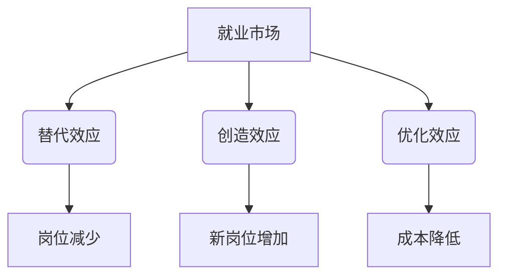

                 

关键词：人工智能、就业、替代、创造、机遇、挑战

摘要：随着人工智能技术的快速发展，其在各个领域的应用越来越广泛。本文将探讨人工智能对就业市场的影响，包括替代与创造两方面。同时，分析面临的机会与挑战，并讨论未来发展趋势。

## 1. 背景介绍

人工智能（AI）作为一门前沿技术，近年来在全球范围内取得了显著的发展。从最初的实验室研究到如今的应用落地，AI已经渗透到各个行业，为人类带来了巨大的便利和改变。然而，随着AI技术的不断进步，人们对它的影响，尤其是对就业市场的影响，产生了极大的关注。

就业是每个国家和地区的重要经济指标，也是社会稳定的基础。然而，随着AI技术的普及，许多传统工作岗位面临着被替代的风险。这种替代效应不仅对劳动者个人造成影响，也可能对整个社会的就业结构产生深远的影响。因此，探讨AI对就业的影响，对于制定相关政策、引导社会舆论具有重要意义。

## 2. 核心概念与联系

### 2.1 人工智能概述

人工智能是一门研究、开发用于模拟、延伸和扩展人的智能的理论、方法、技术及应用系统的技术科学。人工智能的目的是使计算机系统具备人类智能的某些功能，如学习、推理、解决问题、感知和理解自然语言等。

### 2.2 人工智能与就业

人工智能对就业的影响可以从以下几个方面进行分析：

- **替代效应**：人工智能技术可以自动化许多重复性、低技能的工作，从而替代人类劳动力。例如，智能客服、自动驾驶、智能翻译等领域的快速发展，已经导致了一定程度的就业岗位减少。
- **创造效应**：虽然人工智能替代了一些工作岗位，但它同时也创造了新的就业机会。例如，AI算法工程师、数据分析师、AI产品经理等职位的需求不断增长。
- **优化效应**：人工智能可以提高生产效率，减少人力资源的投入，从而为企业节省成本。这种优化效应可能会在一定程度上增加企业的利润，进而带动就业增长。

### 2.3 Mermaid 流程图



## 3. 核心算法原理 & 具体操作步骤

### 3.1 算法原理概述

人工智能的核心在于算法，其中机器学习和深度学习是两大主流方向。机器学习是一种让计算机通过数据学习规律、模式的方法，而深度学习则是通过多层神经网络模拟人脑的学习过程。

### 3.2 算法步骤详解

1. **数据收集与预处理**：收集大量数据，并对数据进行清洗、去重、归一化等预处理操作。
2. **模型选择与训练**：选择合适的模型，对数据进行训练，调整模型参数，使其能够拟合数据。
3. **模型评估与优化**：通过验证集和测试集评估模型性能，对模型进行优化。
4. **模型部署与使用**：将训练好的模型部署到实际应用场景中，进行预测和决策。

### 3.3 算法优缺点

- **优点**：人工智能算法可以提高生产效率，降低成本，提高决策准确性。
- **缺点**：人工智能算法可能对某些工作岗位产生替代效应，造成失业风险。

### 3.4 算法应用领域

人工智能算法广泛应用于各个领域，如金融、医疗、交通、教育等。以金融领域为例，人工智能可以用于风险评估、投资策略、智能投顾等。

## 4. 数学模型和公式 & 详细讲解 & 举例说明

### 4.1 数学模型构建

人工智能的核心是机器学习和深度学习，其数学基础主要包括线性代数、概率论和统计学、微积分等。

### 4.2 公式推导过程

例如，线性回归模型的基本公式为：

$$
y = \beta_0 + \beta_1 \cdot x
$$

其中，$y$ 是预测值，$x$ 是输入特征，$\beta_0$ 和 $\beta_1$ 是模型参数。

### 4.3 案例分析与讲解

以智能客服为例，我们可以通过机器学习算法对大量客服对话数据进行分析，提取对话中的关键信息，并建立对话模型。在实际应用中，当用户提问时，系统可以根据对话模型生成回答，提高客服效率。

## 5. 项目实践：代码实例和详细解释说明

### 5.1 开发环境搭建

- Python 3.8及以上版本
- TensorFlow 2.4及以上版本
- Jupyter Notebook

### 5.2 源代码详细实现

以下是一个简单的线性回归模型实现：

```python
import tensorflow as tf

# 数据准备
x = tf.random.normal([1000, 1])
y = 2 * x + tf.random.normal([1000, 1])

# 模型定义
model = tf.keras.Sequential([
    tf.keras.layers.Dense(units=1, input_shape=[1])
])

# 模型编译
model.compile(optimizer='sgd', loss='mean_squared_error')

# 模型训练
model.fit(x, y, epochs=100)

# 模型预测
x_predict = tf.random.normal([1, 1])
y_predict = model.predict(x_predict)

print(y_predict)
```

### 5.3 代码解读与分析

这段代码首先导入了 TensorFlow 库，然后生成了随机数据作为训练数据。接着定义了一个线性回归模型，并编译模型。最后，训练模型并使用模型进行预测。

### 5.4 运行结果展示

运行代码后，可以得到预测结果。通过对比预测值和实际值，可以验证模型的效果。

## 6. 实际应用场景

人工智能在金融、医疗、交通、教育等领域的实际应用非常广泛。以金融领域为例，人工智能可以用于风险评估、投资策略、智能投顾等。在医疗领域，人工智能可以用于疾病诊断、药物研发等。

## 7. 工具和资源推荐

- **学习资源推荐**：Coursera、edX、Udacity 等在线教育平台提供了丰富的 AI 课程。
- **开发工具推荐**：TensorFlow、PyTorch、Keras 等。
- **相关论文推荐**：《深度学习》、《Python机器学习》等。

## 8. 总结：未来发展趋势与挑战

### 8.1 研究成果总结

人工智能技术在近年来取得了显著的发展，其在各个领域的应用越来越广泛。然而，随着 AI 技术的进步，对就业市场的影响也越来越显著。

### 8.2 未来发展趋势

- **替代效应将继续**：随着人工智能技术的不断进步，越来越多的工作岗位将被替代。
- **创造效应将增强**：人工智能技术将创造更多的新岗位，如 AI 算法工程师、数据分析师等。

### 8.3 面临的挑战

- **失业风险**：大量传统工作岗位被替代，可能导致失业风险增加。
- **技能转型**：劳动者需要不断学习新技能，以适应人工智能时代的要求。

### 8.4 研究展望

未来，人工智能技术将继续发展，为社会带来更多机遇与挑战。研究人工智能对就业的影响，为政策制定和人才培养提供依据，具有重要意义。

## 9. 附录：常见问题与解答

- **问题1**：人工智能会完全取代人类吗？
  **解答**：人工智能是一种工具，它可以模拟人类的某些智能行为，但不可能完全取代人类。人类具有创造力、情感和道德判断等特质，这是人工智能无法替代的。
- **问题2**：人工智能技术会带来失业潮吗？
  **解答**：人工智能技术确实可能导致某些传统工作岗位的减少，但同时也会创造新的就业机会。整体来看，人工智能对就业市场的影响是替代与创造并存的。
- **问题3**：劳动者应该如何应对人工智能时代？
  **解答**：劳动者需要不断学习新技能，提高自身竞争力。同时，政府和企业也应该加强培训和教育，为劳动者提供转型支持。

作者：禅与计算机程序设计艺术 / Zen and the Art of Computer Programming
----------------------------------------------------------------

以上就是本篇文章的完整内容，涵盖了人工智能对就业的影响、算法原理、数学模型、实际应用场景等多个方面。希望通过本文，读者能够对人工智能与就业的关系有更深入的理解。同时，也欢迎大家留言交流，共同探讨人工智能的未来发展趋势。

