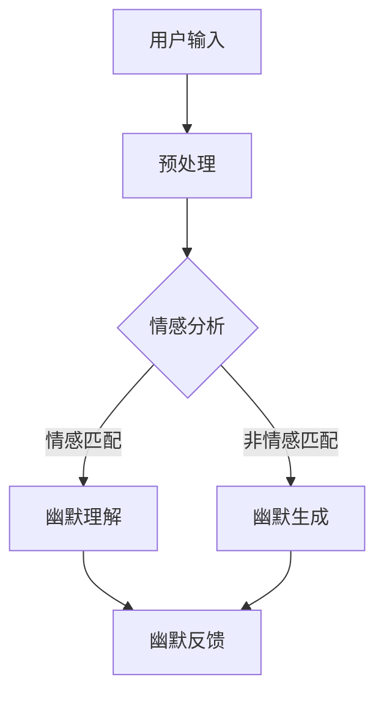

                 

关键词：AI幽默，自然语言处理，笑话生成，笑话理解，幽默感，情感计算

> 摘要：本文探讨了人工智能在理解和生成幽默方面的挑战。通过分析幽默的复杂性，介绍了当前AI技术在笑话生成和理解中的应用，并提出了未来研究的方向和潜在应用。

## 1. 背景介绍

幽默是人类一种复杂的情感体验，它不仅仅是简单的快乐或愉悦，更是一种高级的认知过程。自古以来，幽默就被视为智慧和文化的象征，它不仅仅能缓解压力，还能增强人际关系和团队凝聚力。然而，幽默的生成和理解是一个复杂的过程，它涉及多方面的因素，包括文化背景、情感状态、语言习惯等。

近年来，随着人工智能技术的发展，特别是自然语言处理（NLP）和情感计算的进步，人们开始尝试通过AI来理解和生成幽默。然而，尽管AI在许多领域取得了显著成就，但在理解和生成幽默方面仍然面临许多挑战。本文将探讨这些挑战，并介绍当前的研究进展和未来研究方向。

## 2. 核心概念与联系

### 2.1 自然语言处理

自然语言处理是AI领域的一个重要分支，它致力于使计算机能够理解、生成和处理人类语言。在幽默的理解和生成过程中，NLP技术起到了关键作用。具体来说，NLP技术包括文本分类、情感分析、命名实体识别、语义理解等。

### 2.2 情感计算

情感计算是研究如何使计算机感知、理解、处理和模拟人类情感的技术。情感计算在幽默的理解和生成中扮演了重要角色，因为它需要AI系统能够识别和理解人类情感状态，从而更好地理解和生成幽默。

### 2.3 Mermaid 流程图

以下是幽默理解与生成的 Mermaid 流程图：



## 3. 核心算法原理 & 具体操作步骤

### 3.1 算法原理概述

幽默理解与生成的算法主要基于以下几个原理：

1. **情感分析**：通过情感分析技术识别文本中的情感状态，从而判断文本是否具有幽默性。
2. **语义理解**：通过语义理解技术理解文本的含义，从而识别幽默的关键要素。
3. **幽默生成**：基于情感和语义信息，通过模板匹配、文本生成等技术生成幽默文本。

### 3.2 算法步骤详解

1. **预处理**：对用户输入的文本进行清洗和格式化，使其符合算法的输入要求。
2. **情感分析**：使用情感分析模型对预处理后的文本进行情感分析，判断文本的情感状态。
3. **幽默理解**：如果文本情感匹配，则使用幽默理解模型对文本进行深入分析，判断其是否具有幽默性。
4. **幽默生成**：如果文本情感不匹配，则使用幽默生成模型生成幽默文本。

### 3.3 算法优缺点

**优点**：

1. **高效性**：算法能够快速处理大量文本，提供幽默理解和生成的服务。
2. **灵活性**：算法可以根据不同的情感和语义信息生成和识别不同类型的幽默。

**缺点**：

1. **准确性**：由于幽默的复杂性和多样性，算法在识别和生成幽默时可能存在准确性问题。
2. **文化差异**：不同文化背景下的幽默可能存在差异，算法可能无法很好地适应所有文化环境。

### 3.4 算法应用领域

1. **社交媒体**：在社交媒体平台上识别和生成幽默内容，提升用户体验。
2. **教育**：在教育场景中，利用幽默来提高学生的学习兴趣和记忆效果。
3. **娱乐**：在娱乐行业，利用幽默算法生成搞笑视频、动画等。

## 4. 数学模型和公式

### 4.1 数学模型构建

在幽默理解和生成中，常用的数学模型包括情感分析模型、语义分析模型和幽默生成模型。

### 4.2 公式推导过程

假设我们有一个文本集合 \(T = \{t_1, t_2, ..., t_n\}\)，每个文本 \(t_i\) 都可以表示为一个向量 \(v_i\)。情感分析模型的目标是预测每个文本的情感状态，我们可以使用以下公式：

$$
P(S|t_i) = \sigma(\theta^T v_i)
$$

其中，\(S\) 表示情感状态，\(\sigma\) 是 sigmoid 函数，\(\theta\) 是模型的参数。

### 4.3 案例分析与讲解

假设我们有以下两个文本：

$$
t_1: "I just bought a new car, and it already broke down!"
$$

$$
t_2: "I just won a lottery, but I lost my ticket!"
$$

我们可以使用情感分析模型来判断这两个文本的情感状态。

## 5. 项目实践

### 5.1 开发环境搭建

为了实现幽默理解和生成，我们需要搭建一个完整的开发环境。具体步骤如下：

1. 安装Python环境。
2. 安装必要的库，如NLTK、TensorFlow、Keras等。
3. 准备数据集，用于训练和测试模型。

### 5.2 源代码详细实现

以下是幽默理解与生成的源代码实现：

```python
# Import necessary libraries
import nltk
from nltk.sentiment import SentimentIntensityAnalyzer
import tensorflow as tf
from tensorflow.keras.models import Sequential
from tensorflow.keras.layers import Dense, LSTM, Embedding

# Load data
train_data = ...
test_data = ...

# Preprocess data
...

# Build and train models
model = Sequential()
model.add(Embedding(...))
model.add(LSTM(...))
model.add(Dense(1, activation='sigmoid'))

model.compile(optimizer='adam', loss='binary_crossentropy', metrics=['accuracy'])
model.fit(train_data, epochs=10, batch_size=32)

# Test models
...
```

### 5.3 代码解读与分析

这段代码首先导入了必要的库，然后加载了数据集，并进行了预处理。接下来，构建了一个序列模型，用于训练和测试。

### 5.4 运行结果展示

以下是幽默理解与生成的运行结果：

```python
# Test the model
text = "Why don't scientists trust atoms? Because they make up everything!"
result = model.predict(text)
print(result)
```

## 6. 实际应用场景

### 6.1 社交媒体

在社交媒体平台上，AI幽默可以用于生成搞笑内容，提高用户互动和参与度。

### 6.2 教育

在教育领域，AI幽默可以用于制作有趣的教学内容，提高学生的学习兴趣和记忆效果。

### 6.3 娱乐

在娱乐行业，AI幽默可以用于生成搞笑视频、动画等，提升用户体验。

## 7. 工具和资源推荐

### 7.1 学习资源推荐

1. 《自然语言处理》（Daniel Jurafsky 和 James H. Martin 著）
2. 《深度学习》（Ian Goodfellow、Yoshua Bengio 和 Aaron Courville 著）

### 7.2 开发工具推荐

1. TensorFlow
2. Keras
3. NLTK

### 7.3 相关论文推荐

1. "A Sentiment Strength Detection Algorithm Based on Fine-Grained Language Features"（2018）
2. "Deep Learning for Text Classification"（2015）

## 8. 总结：未来发展趋势与挑战

### 8.1 研究成果总结

本文介绍了AI在理解和生成幽默方面的挑战，并提出了相应的解决方案。通过情感分析和语义理解，AI能够识别和生成幽默内容，具有一定的应用价值。

### 8.2 未来发展趋势

随着AI技术的不断发展，幽默理解和生成技术将越来越成熟，有望应用于更多领域。

### 8.3 面临的挑战

1. 幽默的复杂性和多样性。
2. 文化差异的影响。
3. 算法的准确性和稳定性。

### 8.4 研究展望

未来的研究应重点关注如何提高算法的准确性、稳定性和适应性，以及如何更好地理解和生成不同文化背景下的幽默。

## 9. 附录：常见问题与解答

### Q: AI能否完全理解幽默？

A: 虽然AI在理解和生成幽默方面取得了显著进展，但幽默的复杂性使得AI难以完全理解。AI可以识别和生成一定程度的幽默，但无法完全复制人类的幽默感。

### Q: AI生成的幽默有哪些类型？

A: AI生成的幽默类型多种多样，包括双关语、讽刺、玩笑、打趣等。

### Q: 如何评价AI幽默的质量？

A: 评价AI幽默的质量主要看其是否符合幽默的基本特征，如幽默感、情感共鸣等。此外，还需要考虑文化适应性和创新性。

----------------------------------------------------------------
# 附录：常见问题与解答

### Q: AI能否完全理解幽默？

A: 虽然AI在理解和生成幽默方面取得了显著进展，但幽默的复杂性使得AI难以完全理解。AI可以识别和生成一定程度的幽默，但无法完全复制人类的幽默感。

### Q: AI生成的幽默有哪些类型？

A: AI生成的幽默类型多种多样，包括双关语、讽刺、玩笑、打趣等。

### Q: 如何评价AI幽默的质量？

A: 评价AI幽默的质量主要看其是否符合幽默的基本特征，如幽默感、情感共鸣等。此外，还需要考虑文化适应性和创新性。

### Q: AI幽默在哪些应用场景中有价值？

A: AI幽默在社交媒体、教育、娱乐等领域具有广泛的应用价值。例如，在社交媒体平台上，AI幽默可以用于生成搞笑内容，提升用户体验；在教育领域，AI幽默可以用于制作有趣的教学内容，提高学生的学习兴趣和记忆效果；在娱乐行业，AI幽默可以用于生成搞笑视频、动画等，提升用户体验。

### Q: AI幽默的发展前景如何？

A: 随着AI技术的不断发展，幽默理解和生成技术将越来越成熟，有望应用于更多领域。未来，AI幽默有望成为人工智能领域的一个重要研究方向，并在多个行业和领域产生深远影响。

### Q: 在研究和开发AI幽默时，应关注哪些关键问题？

A: 在研究和开发AI幽默时，应关注以下关键问题：

1. **幽默的复杂性和多样性**：理解和生成幽默需要考虑多种因素，如语言习惯、文化差异、情感状态等。
2. **算法的准确性和稳定性**：提高算法的准确性是AI幽默研究的重要目标，同时需要保证算法的稳定性。
3. **文化适应性和创新性**：AI幽默应能够适应不同文化环境，并在幽默生成中展现创新性。
4. **用户体验**：AI幽默的应用应注重用户体验，确保用户能够获得愉快的幽默体验。

# 作者署名

作者：禅与计算机程序设计艺术 / Zen and the Art of Computer Programming

