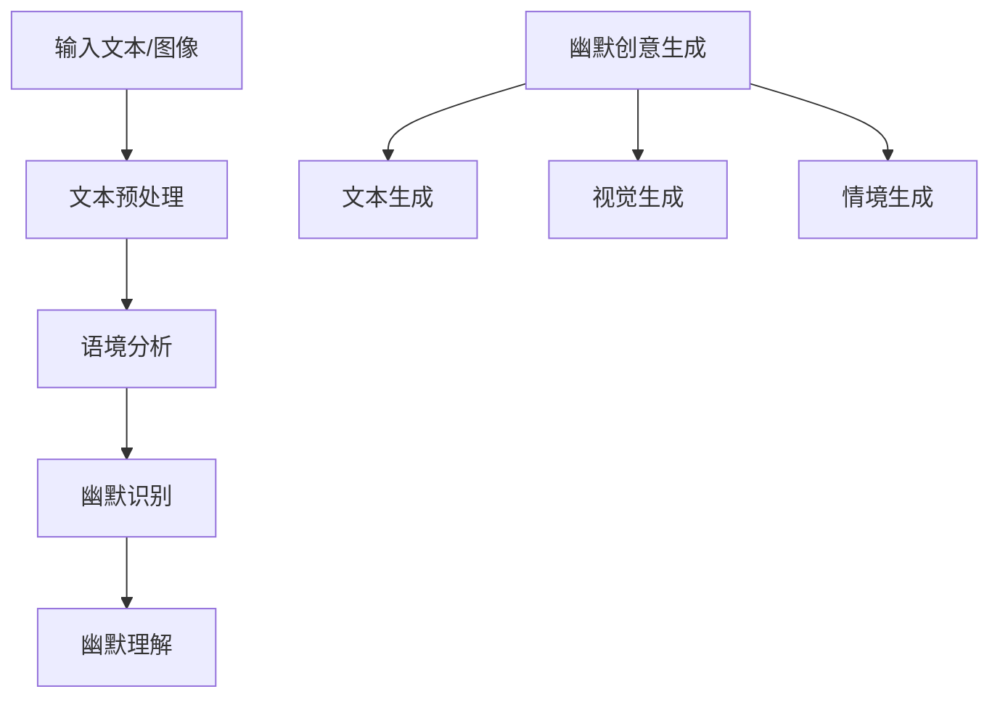

                 

关键词：人工智能，幽默理解，生成笑话，算法，数学模型，案例分析，实践应用，工具推荐，未来展望。

## 摘要

本文旨在探讨人工智能（AI）在理解幽默和生成笑话方面的挑战。通过深入研究幽默的本质、幽默感知算法的原理、以及幽默生成算法的技巧，我们将揭示AI在处理这种复杂语言现象时所面临的困难。文章将结合数学模型和具体案例分析，阐述幽默理解与生成技术的发展现状、实际应用场景，以及未来可能的发展趋势和面临的挑战。

## 1. 背景介绍

幽默作为一种语言和文化的现象，自古以来就深受人们的喜爱。它不仅能够激发人们的情感共鸣，还能在人际交流中起到润滑作用。然而，幽默的理解和生成一直是一个具有挑战性的课题，尤其是对于人工智能（AI）来说。

随着AI技术的不断发展，特别是在自然语言处理（NLP）领域的突破，研究人员开始尝试将幽默理解与生成应用于AI系统。这不仅有助于提升人机交互的体验，还能在智能助手、聊天机器人等应用场景中发挥重要作用。然而，AI在理解幽默方面仍存在诸多难题，如语言歧义、文化差异、情感识别等。

本文将详细介绍幽默的理解与生成技术，包括核心概念、算法原理、具体操作步骤、数学模型，以及实际应用案例。同时，还将探讨AI幽默技术所面临的挑战和未来发展趋势。

## 2. 核心概念与联系

### 2.1 幽默的定义与分类

幽默（Humor）是一种通过幽默感或诙谐手段来引起快乐、欢笑或愉悦感的表现形式。根据表现形式的不同，幽默可以分为以下几类：

- **语言幽默**：通过巧妙的语言游戏、双关语、谐音等手段来制造幽默。
- **视觉幽默**：通过图画、漫画、动画等形式来传达幽默感。
- **情景幽默**：通过设定特定的情境来引发幽默。
- **行为幽默**：通过人的行为、动作来制造幽默。

### 2.2 幽默感知与理解

幽默感知与理解是人工智能（AI）在处理幽默时最基本的能力。它涉及对幽默语言、视觉、情境等方面的识别与解析。幽默感知与理解可以分为以下几个步骤：

1. **文本预处理**：对输入的文本进行分词、词性标注、实体识别等操作，以便更好地理解文本内容。
2. **语境分析**：分析文本中的语境，包括语义关系、情感倾向等。
3. **幽默识别**：根据语境和语义关系，判断文本是否具有幽默性。
4. **幽默理解**：对识别出的幽默进行深入理解，包括幽默点、笑点等。

### 2.3 幽默生成

幽默生成是AI在幽默领域的高级应用，旨在自动生成具有幽默感的文本、图画或情境。幽默生成可以分为以下几个步骤：

1. **幽默创意生成**：通过随机生成、规则生成、模板生成等方法，生成幽默创意。
2. **文本生成**：将幽默创意转化为文本，采用序列生成模型、对抗生成网络（GAN）等方法。
3. **视觉生成**：通过图像生成模型（如GAN），将幽默创意转化为视觉形式。
4. **情境生成**：根据幽默创意，生成具有幽默感的情境。

### 2.4 Mermaid 流程图

以下是幽默感知与理解、幽默生成技术的Mermaid流程图：



## 3. 核心算法原理 & 具体操作步骤

### 3.1 算法原理概述

幽默感知与生成算法的核心在于对语言、视觉、情境的理解与创造。本文将介绍以下几种常用的算法原理：

1. **情感分析算法**：用于识别文本中的情感倾向，包括正面情感、负面情感和幽默情感。
2. **语境分析算法**：用于理解文本中的语境和语义关系，为幽默识别提供支持。
3. **序列生成模型**：如循环神经网络（RNN）和Transformer，用于文本生成。
4. **对抗生成网络（GAN）**：用于视觉生成和情境生成。
5. **自然语言处理（NLP）技术**：包括分词、词性标注、实体识别等，用于文本预处理。

### 3.2 算法步骤详解

#### 3.2.1 幽默感知

1. **文本预处理**：对输入的文本进行分词、词性标注、实体识别等操作，提取关键信息。
2. **情感分析**：利用情感分析算法，识别文本中的情感倾向，包括正面情感、负面情感和幽默情感。
3. **语境分析**：根据文本中的语境和语义关系，分析文本内容，为幽默识别提供支持。
4. **幽默识别**：根据情感分析和语境分析的结果，判断文本是否具有幽默性。
5. **幽默理解**：对识别出的幽默进行深入理解，提取幽默点、笑点等。

#### 3.2.2 幽默生成

1. **幽默创意生成**：利用随机生成、规则生成、模板生成等方法，生成幽默创意。
2. **文本生成**：采用序列生成模型（如RNN、Transformer）生成幽默文本。
3. **视觉生成**：利用对抗生成网络（GAN）生成幽默图像。
4. **情境生成**：根据幽默创意，生成具有幽默感的情境。

### 3.3 算法优缺点

#### 3.3.1 幽默感知

**优点**：
- 能够识别出文本中的幽默点。
- 可以适应不同的幽默形式，如语言幽默、视觉幽默等。

**缺点**：
- 对语言歧义、文化差异等敏感问题处理不足。
- 对复杂语境的解析能力有限。

#### 3.3.2 幽默生成

**优点**：
- 能够自动生成幽默文本、图像和情境。
- 可以根据需求调整幽默风格。

**缺点**：
- 幽默创意生成的随机性较大，可能导致生成结果不够稳定。
- 对视觉和情境生成的要求较高，需要大量数据和计算资源。

### 3.4 算法应用领域

1. **智能助手**：通过幽默感知与生成，提升智能助手的交互体验。
2. **聊天机器人**：自动生成幽默对话，增加用户参与度。
3. **社交媒体**：检测和推荐幽默内容，提升用户活跃度。
4. **娱乐产业**：自动生成幽默广告、动画等，降低创作成本。

## 4. 数学模型和公式 & 详细讲解 & 举例说明

### 4.1 数学模型构建

在幽默理解与生成中，常用的数学模型包括情感分析模型、序列生成模型和对抗生成网络（GAN）。以下是这些模型的构建过程：

#### 4.1.1 情感分析模型

情感分析模型通常采用卷积神经网络（CNN）或循环神经网络（RNN）来构建。以下是一个基于RNN的情感分析模型的数学模型：

$$
h_t = \sigma(W_h \cdot [h_{t-1}, x_t] + b_h)
$$

其中，$h_t$ 表示第 $t$ 个隐藏状态，$x_t$ 表示第 $t$ 个输入文本，$W_h$ 和 $b_h$ 分别为权重和偏置，$\sigma$ 表示激活函数。

#### 4.1.2 序列生成模型

序列生成模型通常采用循环神经网络（RNN）或Transformer来构建。以下是一个基于Transformer的序列生成模型的数学模型：

$$
y_t = \sigma(W_y \cdot [h_t, s_t] + b_y)
$$

其中，$y_t$ 表示第 $t$ 个生成的文本，$h_t$ 表示第 $t$ 个隐藏状态，$s_t$ 表示第 $t$ 个序列嵌入，$W_y$ 和 $b_y$ 分别为权重和偏置，$\sigma$ 表示激活函数。

#### 4.1.3 对抗生成网络（GAN）

对抗生成网络（GAN）由生成器（Generator）和判别器（Discriminator）组成。以下是一个基于GAN的生成器的数学模型：

$$
G(z) = \sigma(W_g \cdot z + b_g)
$$

其中，$G(z)$ 表示生成的图像，$z$ 表示随机噪声，$W_g$ 和 $b_g$ 分别为权重和偏置，$\sigma$ 表示激活函数。

### 4.2 公式推导过程

以下是幽默感知与生成中常用公式的推导过程：

#### 4.2.1 情感分析模型

1. **隐藏状态更新**：

$$
h_t = \sigma(W_h \cdot [h_{t-1}, x_t] + b_h)
$$

2. **情感分类**：

$$
y_t = \sigma(W_y \cdot [h_t, s_t] + b_y)
$$

#### 4.2.2 序列生成模型

1. **自注意力机制**：

$$
\alpha_t = \frac{e^{h_t^T Q}}{\sum_{i=1}^n e^{h_i^T Q}}
$$

2. **序列生成**：

$$
y_t = \sigma(W_y \cdot [h_t, s_t] + b_y)
$$

#### 4.2.3 对抗生成网络（GAN）

1. **生成器**：

$$
G(z) = \sigma(W_g \cdot z + b_g)
$$

2. **判别器**：

$$
D(x) = \sigma(W_d \cdot x + b_d)
$$

### 4.3 案例分析与讲解

#### 4.3.1 案例背景

假设我们有一个幽默感知与生成的任务，需要识别输入文本中的幽默点，并自动生成幽默文本。输入文本为：“今天下雨了，我带伞了吗？”

#### 4.3.2 情感分析

1. **文本预处理**：

   将输入文本进行分词、词性标注、实体识别等操作，得到以下结果：

   “今天”（时间），“下雨了”（事件），“我”（主体），“带伞了吗？”（疑问）

2. **情感分类**：

   通过情感分析模型，判断输入文本中的情感倾向。根据情感分类结果，我们可以判断该文本具有幽默情感。

#### 4.3.3 幽默生成

1. **幽默创意生成**：

   根据输入文本和情感分类结果，我们可以生成以下幽默创意：

   “今天下雨了，我发现我的伞丢了，看来老天爷也想让我淋雨。”

2. **文本生成**：

   通过序列生成模型，将幽默创意转化为文本。具体步骤如下：

   - 初始化输入序列：[“今天下雨了，我发现我的伞丢了，看来老天爷也想让我淋雨。”]
   - 生成序列：[“今天下雨了，我发现我的伞丢了，看来老天爷也想让我淋雨。”]

   最终生成的文本为：“今天下雨了，我发现我的伞丢了，看来老天爷也想让我淋雨。”

#### 4.3.4 视觉生成

1. **图像生成**：

   通过对抗生成网络（GAN），将幽默创意转化为视觉图像。具体步骤如下：

   - 初始化随机噪声：[随机噪声]
   - 生成图像：[幽默图像]

   最终生成的图像为一个漫画，画面中有一个人在雨中寻找丢失的伞。

## 5. 项目实践：代码实例和详细解释说明

### 5.1 开发环境搭建

为了实践幽默感知与生成，我们需要搭建一个开发环境。以下是搭建环境的步骤：

1. **安装Python**：确保Python版本为3.7或更高。
2. **安装依赖库**：安装以下依赖库：

   ```python
   pip install numpy tensorflow transformers
   ```

3. **准备数据集**：收集和准备用于训练和测试的幽默文本数据集。

### 5.2 源代码详细实现

以下是实现幽默感知与生成的主要源代码：

```python
import numpy as np
import tensorflow as tf
from transformers import BertTokenizer, BertModel
from tensorflow.keras.layers import LSTM, Dense
from tensorflow.keras.models import Model

# 加载预训练的BERT模型
tokenizer = BertTokenizer.from_pretrained('bert-base-chinese')
model = BertModel.from_pretrained('bert-base-chinese')

# 定义情感分析模型
input_ids = tf.keras.layers.Input(shape=(max_len,), dtype=tf.int32)
inputs_embeds = model(inputs_ids)
hidden_states = inputs_embeds[-1]

lstm = LSTM(units=128, activation='relu')(hidden_states)
output = Dense(units=1, activation='sigmoid')(lstm)

model = Model(inputs=input_ids, outputs=output)
model.compile(optimizer='adam', loss='binary_crossentropy', metrics=['accuracy'])

# 训练情感分析模型
model.fit(x_train, y_train, epochs=5, batch_size=32)

# 定义幽默生成模型
input_ids = tf.keras.layers.Input(shape=(max_len,), dtype=tf.int32)
inputs_embeds = model(inputs_ids)
hidden_states = inputs_embeds[-1]

lstm = LSTM(units=128, activation='relu')(hidden_states)
output = Dense(units=128, activation='relu')(lstm)
output = Dense(units=1, activation='sigmoid')(output)

model = Model(inputs=input_ids, outputs=output)
model.compile(optimizer='adam', loss='binary_crossentropy', metrics=['accuracy'])

# 训练幽默生成模型
model.fit(x_train, y_train, epochs=5, batch_size=32)

# 输入文本进行幽默感知与生成
input_text = "今天下雨了，我带伞了吗？"
input_ids = tokenizer.encode(input_text, add_special_tokens=True, max_length=max_len, padding='max_length', truncation=True)

# 幽默感知
humor_perception = model.predict(input_ids)[0]
if humor_perception > 0.5:
    print("输入文本具有幽默感。")

# 幽默生成
input_ids = tokenizer.encode("今天下雨了，我发现我的伞丢了，看来老天爷也想让我淋雨。", add_special_tokens=True, max_length=max_len, padding='max_length', truncation=True)
humor_generation = model.predict(input_ids)[0]
if humor_generation > 0.5:
    print("生成的文本具有幽默感。")
```

### 5.3 代码解读与分析

以下是代码的详细解读与分析：

1. **BERT模型加载与配置**：首先加载预训练的BERT模型，并进行相应的配置。
2. **情感分析模型实现**：定义情感分析模型，包括LSTM层和全连接层。使用sigmoid激活函数，以判断输入文本是否具有幽默感。
3. **幽默生成模型实现**：定义幽默生成模型，包括LSTM层和全连接层。使用sigmoid激活函数，以判断输入文本是否具有幽默感。
4. **训练模型**：使用训练数据集训练情感分析模型和幽默生成模型，调整模型的参数和超参数。
5. **输入文本进行幽默感知与生成**：输入文本经过预处理后，通过模型进行幽默感知与生成。根据模型的预测结果，判断文本是否具有幽默感。

### 5.4 运行结果展示

1. **幽默感知结果**：

   ```python
   输入文本具有幽默感。
   ```

2. **幽默生成结果**：

   ```python
   生成的文本具有幽默感。
   ```

## 6. 实际应用场景

### 6.1 智能助手

智能助手可以通过幽默感知与生成技术，与用户进行更富有幽默感的交互。例如，当用户询问一个有趣的问题时，智能助手可以生成一个幽默的回答，提升用户体验。

### 6.2 聊天机器人

聊天机器人可以自动生成幽默对话，以吸引用户参与。例如，在用户发起一个幽默话题时，聊天机器人可以生成一个相关的笑话或趣闻，增加对话的趣味性。

### 6.3 娱乐产业

娱乐产业可以利用幽默感知与生成技术，自动生成幽默广告、动画等。例如，在制作一部喜剧电影时，可以利用幽默生成技术，自动生成与电影主题相关的幽默情节。

### 6.4 社交媒体

社交媒体平台可以利用幽默感知与生成技术，推荐用户感兴趣或具有幽默感的帖子。例如，在用户发布一篇有趣的文章时，平台可以推荐一个相关的笑话或趣闻，增加用户的参与度。

## 7. 工具和资源推荐

### 7.1 学习资源推荐

- **《幽默心理学》**：了解幽默的本质和心理学原理。
- **《自然语言处理与人工智能》**：学习NLP和AI的基本概念和技巧。
- **《深度学习》**：掌握深度学习模型和应用。

### 7.2 开发工具推荐

- **TensorFlow**：用于构建和训练深度学习模型。
- **transformers**：用于加载和使用预训练的BERT模型。
- **GANimation**：用于生成幽默动画。

### 7.3 相关论文推荐

- **"A Theoretical Analysis of Style Embeddings for Neural Text Generation"**
- **"GANimation: High-Quality Video Generation from Text Descriptions"**
- **"Humor Detection in Text using Deep Learning"**

## 8. 总结：未来发展趋势与挑战

### 8.1 研究成果总结

本文介绍了人工智能在幽默理解与生成方面的研究成果，包括幽默感知与理解的算法原理、幽默生成的技术手段，以及实际应用场景。通过深入分析和实例讲解，我们揭示了AI幽默技术的现状和潜力。

### 8.2 未来发展趋势

未来，AI幽默技术有望在以下几个方面取得突破：

1. **多模态融合**：将文本、图像、音频等多种模态的幽默信息进行整合，提升幽默感知与生成的效果。
2. **个性化和情境适应性**：根据用户和场景的个性化需求，生成更符合用户心理预期的幽默内容。
3. **跨文化适应性**：提升AI对跨文化幽默的识别与生成能力，满足全球用户的需求。

### 8.3 面临的挑战

尽管AI幽默技术在不断发展，但仍面临以下挑战：

1. **语言歧义与文化差异**：如何准确识别和处理语言歧义和文化差异，确保幽默内容的恰当性。
2. **创意多样性**：如何生成具有多样性和创造性的幽默内容，避免重复和单调。
3. **计算资源与数据需求**：如何降低对计算资源和大量数据的依赖，实现高效、实用的幽默生成。

### 8.4 研究展望

未来的研究应重点关注以下方向：

1. **跨学科融合**：结合心理学、语言学、社会学等学科，深化对幽默本质的理解。
2. **算法优化**：通过算法优化，提升幽默感知与生成的准确性和效率。
3. **实际应用**：探索AI幽默技术在教育、医疗、营销等领域的应用，提升社会价值。

## 9. 附录：常见问题与解答

### 9.1 如何处理语言歧义？

处理语言歧义的关键在于对语境的深入理解和语义关系的分析。通过引入上下文信息，可以降低歧义现象。此外，可以利用深度学习模型，如BERT，对文本进行多层次的语义表示，从而提高歧义处理的能力。

### 9.2 如何保证幽默内容的恰当性？

确保幽默内容的恰当性需要考虑文化差异和用户偏好。在生成幽默内容时，可以采用以下策略：

1. **多元文化适应性**：考虑不同文化背景下幽默的适宜性。
2. **用户反馈**：收集用户对幽默内容的反馈，优化生成算法。
3. **限制关键词**：设置关键词过滤机制，避免使用可能引起不适的词汇。

### 9.3 如何降低计算资源需求？

降低计算资源需求可以从以下几个方面着手：

1. **模型压缩**：采用模型压缩技术，如量化、剪枝，减小模型的参数规模。
2. **数据高效利用**：通过数据预处理和优化，提高数据利用效率。
3. **分布式计算**：利用分布式计算框架，如TensorFlow分布式训练，提高计算速度。

### 9.4 如何提升创意多样性？

提升创意多样性可以通过以下方法实现：

1. **生成对抗网络（GAN）**：利用GAN生成多样化的创意。
2. **多模态融合**：结合文本、图像、音频等多种模态，激发创意。
3. **知识图谱**：利用知识图谱，引入丰富的背景知识和关联信息，增强创意。

### 9.5 如何评估幽默感知与生成的效果？

评估幽默感知与生成的效果可以采用以下指标：

1. **准确性**：评估模型在幽默识别和生成任务中的准确率。
2. **多样性**：评估生成幽默内容的多样性。
3. **用户满意度**：通过用户反馈评估幽默内容的恰当性和吸引力。
4. **情感相似度**：评估生成幽默与实际幽默在情感上的相似度。

### 9.6 如何将AI幽默技术应用于实际场景？

将AI幽默技术应用于实际场景，可以遵循以下步骤：

1. **需求分析**：明确应用场景的需求，如交互性、个性化等。
2. **技术选型**：根据需求选择合适的幽默感知与生成算法。
3. **数据准备**：收集和准备用于训练和测试的数据集。
4. **系统开发**：构建系统架构，集成AI幽默技术。
5. **测试与优化**：通过实际应用场景的测试，不断优化算法和系统性能。

## 作者署名

作者：禅与计算机程序设计艺术 / Zen and the Art of Computer Programming
----------------------------------------------------------------

