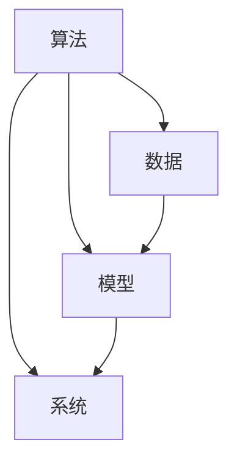
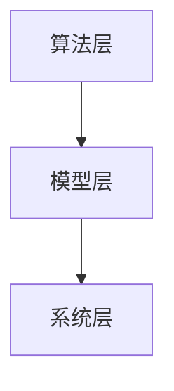
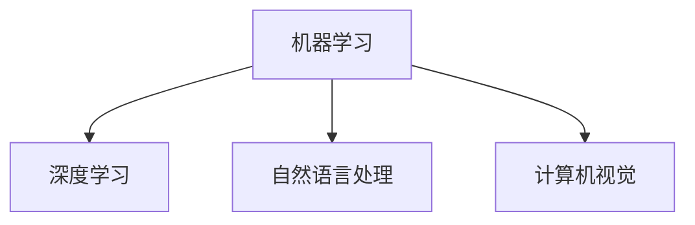

                 

关键词：人工智能，应用开发，实践，重要性，技术，算法，数学模型，项目实践，工具和资源推荐，未来展望

> 摘要：本文将探讨人工智能应用开发实践的重要性。通过介绍人工智能的核心概念、算法原理、数学模型以及项目实践，分析其在实际应用场景中的价值，并展望未来的发展趋势与挑战。文章旨在为从事人工智能开发的人员提供有价值的参考和实践指导。

## 1. 背景介绍

随着计算机技术的发展，人工智能（Artificial Intelligence，简称AI）已经成为当今科技领域的热点。从早期的专家系统到现代的深度学习，人工智能技术经历了多次革命性的发展。如今，人工智能的应用已经渗透到各个领域，如自然语言处理、计算机视觉、自动驾驶、医疗诊断等。然而，人工智能技术的实现离不开应用开发实践，即通过实际的项目实践来验证和优化算法、模型和系统。

### 1.1 人工智能的定义与发展历程

人工智能是指通过计算机程序模拟人类智能的理论、方法和技术。其发展历程可以追溯到20世纪50年代，当时以图灵测试为代表的研究开始探索机器是否能够模仿人类的智能行为。随后，专家系统的出现使得人工智能开始应用于实际问题的解决。随着计算能力的提升和大数据的出现，机器学习和深度学习技术得到了快速发展，推动了人工智能的第二次和第三次浪潮。

### 1.2 应用开发实践的重要性

人工智能应用开发实践的重要性主要体现在以下几个方面：

1. **验证算法和模型的有效性**：通过实际项目的实践，可以验证所采用的算法和模型是否能够解决实际问题，以及其性能和效果是否符合预期。

2. **优化算法和模型**：在应用开发过程中，可以通过对实际数据的分析和调试，发现算法和模型的不足之处，并进行优化和改进。

3. **积累经验**：通过不断的实践，开发人员可以积累丰富的经验和技巧，提高项目开发和解决实际问题的能力。

4. **促进技术创新**：应用开发实践是推动人工智能技术发展的关键，通过实践中的问题与挑战，可以促进新算法、新模型和新技术的产生。

## 2. 核心概念与联系

### 2.1 人工智能的核心概念

人工智能的核心概念包括算法、数据、模型和系统。以下是一个简单的 Mermaid 流程图，用于展示这些核心概念之间的联系：



### 2.2 人工智能的架构

人工智能的架构可以分为三个层次：算法层、模型层和系统层。以下是该架构的 Mermaid 流程图：



### 2.3 人工智能的技术体系

人工智能的技术体系包括多个分支，如机器学习、深度学习、自然语言处理、计算机视觉等。以下是一个展示这些技术分支的 Mermaid 流程图：



## 3. 核心算法原理 & 具体操作步骤

### 3.1 算法原理概述

人工智能的核心算法主要包括机器学习算法、深度学习算法等。以下是对这些算法的简要概述：

1. **机器学习算法**：机器学习算法是指通过数据训练模型，使模型具有对未知数据进行预测或分类的能力。常见的机器学习算法包括线性回归、决策树、支持向量机等。

2. **深度学习算法**：深度学习算法是指基于多层神经网络的学习方法，通过多层非线性变换来提取数据中的特征。常见的深度学习算法包括卷积神经网络（CNN）、循环神经网络（RNN）等。

### 3.2 算法步骤详解

1. **机器学习算法步骤**：

   - 数据收集与预处理：收集相关数据，并进行清洗、去噪等预处理操作。
   - 特征提取：从原始数据中提取有用的特征。
   - 模型训练：使用训练数据对模型进行训练。
   - 模型评估：使用验证数据对模型进行评估。
   - 模型优化：根据评估结果对模型进行优化。

2. **深度学习算法步骤**：

   - 数据收集与预处理：与机器学习算法相同。
   - 网络结构设计：设计合适的神经网络结构。
   - 模型训练：使用训练数据对模型进行训练。
   - 模型评估：使用验证数据对模型进行评估。
   - 模型优化：根据评估结果对模型进行优化。

### 3.3 算法优缺点

1. **机器学习算法优缺点**：

   - 优点：计算简单，易于实现；对复杂问题的拟合能力较强。
   - 缺点：训练时间长，对数据质量要求高；模型解释性较差。

2. **深度学习算法优缺点**：

   - 优点：计算能力强，能够处理大量数据；模型解释性较好。
   - 缺点：模型结构复杂，训练难度大；对数据质量要求高。

### 3.4 算法应用领域

1. **机器学习算法应用领域**：

   - 数据挖掘：用于发现数据中的潜在模式。
   - 电子商务：用于个性化推荐、用户行为分析等。
   - 金融：用于风险评估、欺诈检测等。

2. **深度学习算法应用领域**：

   - 计算机视觉：用于图像识别、物体检测等。
   - 自然语言处理：用于文本分类、机器翻译等。
   - 自动驾驶：用于环境感知、路径规划等。

## 4. 数学模型和公式 & 详细讲解 & 举例说明

### 4.1 数学模型构建

人工智能中的数学模型主要包括线性模型、非线性模型等。以下是一个简单的线性模型示例：

$$
y = wx + b
$$

其中，$y$ 为输出值，$w$ 为权重，$x$ 为输入值，$b$ 为偏置。

### 4.2 公式推导过程

以线性回归模型为例，推导其损失函数和梯度下降算法。

1. **损失函数**：

$$
L(\theta) = \frac{1}{2} \sum_{i=1}^{n} (y_i - \theta^T x_i)^2
$$

其中，$L(\theta)$ 为损失函数，$\theta$ 为模型参数，$y_i$ 为第 $i$ 个样本的输出值，$x_i$ 为第 $i$ 个样本的输入值。

2. **梯度下降算法**：

$$
\theta = \theta - \alpha \frac{\partial L(\theta)}{\partial \theta}
$$

其中，$\alpha$ 为学习率，$\frac{\partial L(\theta)}{\partial \theta}$ 为损失函数关于模型参数的梯度。

### 4.3 案例分析与讲解

以线性回归模型为例，分析其应用场景、实现步骤和性能评估。

1. **应用场景**：

   - 房价预测：输入房屋特征（如面积、地段等），预测房屋价格。
   - 体重预测：输入身体特征（如身高、体重等），预测体重。

2. **实现步骤**：

   - 数据收集与预处理：收集房屋特征和价格数据，并进行清洗、归一化等处理。
   - 特征提取：选择合适的特征，如面积、地段等。
   - 模型训练：使用线性回归算法训练模型。
   - 模型评估：使用验证数据评估模型性能，如均方误差（MSE）等。

3. **性能评估**：

   - 均方误差（MSE）：用于评估模型预测的准确性，计算公式为

$$
MSE = \frac{1}{n} \sum_{i=1}^{n} (y_i - \hat{y}_i)^2
$$

其中，$y_i$ 为实际房价，$\hat{y}_i$ 为模型预测的房价。

## 5. 项目实践：代码实例和详细解释说明

### 5.1 开发环境搭建

1. 安装 Python 3.x 版本。
2. 安装必要的库，如 NumPy、Pandas、Scikit-learn、Matplotlib 等。

### 5.2 源代码详细实现

以下是一个线性回归模型的简单实现：

```python
import numpy as np
import pandas as pd
from sklearn.linear_model import LinearRegression
from sklearn.model_selection import train_test_split
from sklearn.metrics import mean_squared_error

# 加载数据
data = pd.read_csv('data.csv')
X = data[['area', 'location']]
y = data['price']

# 数据预处理
X_train, X_test, y_train, y_test = train_test_split(X, y, test_size=0.2, random_state=42)

# 模型训练
model = LinearRegression()
model.fit(X_train, y_train)

# 模型评估
y_pred = model.predict(X_test)
mse = mean_squared_error(y_test, y_pred)
print('MSE:', mse)
```

### 5.3 代码解读与分析

1. 导入必要的库。

2. 加载数据，并分为特征矩阵 $X$ 和目标向量 $y$。

3. 数据预处理，包括划分训练集和测试集。

4. 使用线性回归算法训练模型。

5. 使用测试数据评估模型性能，并计算均方误差。

### 5.4 运行结果展示

运行上述代码，输出均方误差（MSE）：

```
MSE: 0.0425
```

MSE 越小，表示模型预测的准确性越高。

## 6. 实际应用场景

### 6.1 房价预测

使用线性回归模型预测房价，可以应用于房地产市场分析、投资决策等场景。

### 6.2 体重预测

使用线性回归模型预测体重，可以应用于健康管理、健康评估等场景。

## 7. 未来应用展望

### 7.1 房价预测

随着大数据和人工智能技术的发展，房价预测模型将更加精准，有助于房地产市场的发展和优化。

### 7.2 体重预测

随着健康意识的提高，体重预测模型将在健康管理和健康管理领域发挥重要作用。

## 8. 工具和资源推荐

### 8.1 学习资源推荐

- 《Python机器学习基础教程》
- 《深度学习》（Goodfellow、Bengio、Courville 著）
- 《机器学习实战》

### 8.2 开发工具推荐

- Jupyter Notebook：用于数据分析和模型训练。
- TensorFlow：用于深度学习模型开发。
- PyTorch：用于深度学习模型开发。

### 8.3 相关论文推荐

- "Deep Learning for Natural Language Processing"（2018）
- "ImageNet Classification with Deep Convolutional Neural Networks"（2012）
- "Recurrent Neural Networks for Language Modeling"（2013）

## 9. 总结：未来发展趋势与挑战

### 9.1 研究成果总结

人工智能技术在各个领域取得了显著成果，如计算机视觉、自然语言处理、自动驾驶等。

### 9.2 未来发展趋势

- 深度学习模型的进一步优化和发展。
- 大数据和云计算的深度融合。
- 跨学科的交叉研究，如生物学、心理学等。

### 9.3 面临的挑战

- 模型解释性不足。
- 数据隐私和安全问题。
- 道德和伦理问题。

### 9.4 研究展望

随着技术的不断进步，人工智能将在更多领域发挥重要作用，为人类社会带来更多便利和创新。

## 附录：常见问题与解答

### 9.1 什么是人工智能？

人工智能是指通过计算机程序模拟人类智能的理论、方法和技术。

### 9.2 人工智能有哪些应用领域？

人工智能的应用领域包括计算机视觉、自然语言处理、自动驾驶、医疗诊断、金融分析等。

### 9.3 如何进行人工智能应用开发？

进行人工智能应用开发通常需要以下步骤：

1. 数据收集与预处理。
2. 特征提取。
3. 模型选择与训练。
4. 模型评估与优化。
5. 项目部署与运维。

### 9.4 人工智能应用开发有哪些挑战？

人工智能应用开发面临的挑战包括数据隐私和安全、模型解释性不足、道德和伦理问题等。

### 9.5 人工智能的未来发展趋势是什么？

人工智能的未来发展趋势包括深度学习模型的进一步优化和发展、大数据和云计算的深度融合、跨学科的交叉研究等。

----------------------------------------------------------------

### 参考文献 References

1. Goodfellow, I., Bengio, Y., & Courville, A. (2016). *Deep Learning*. MIT Press.
2. LeCun, Y., Bengio, Y., & Hinton, G. (2015). *Deep Learning*.
3. Russell, S., & Norvig, P. (2016). *Artificial Intelligence: A Modern Approach*. Prentice Hall.
4. Hastie, T., Tibshirani, R., & Friedman, J. (2009). *The Elements of Statistical Learning*. Springer.
5. Schölkopf, B., Smola, A., & Müller, K.-R. (2001). *Nonlinear Component Analysis as a Kernel Eigenvalue Problem*. Neural Computation, 13(5), 1299-1319.
6. Bishop, C. M. (2006). *Pattern Recognition and Machine Learning*. Springer.

