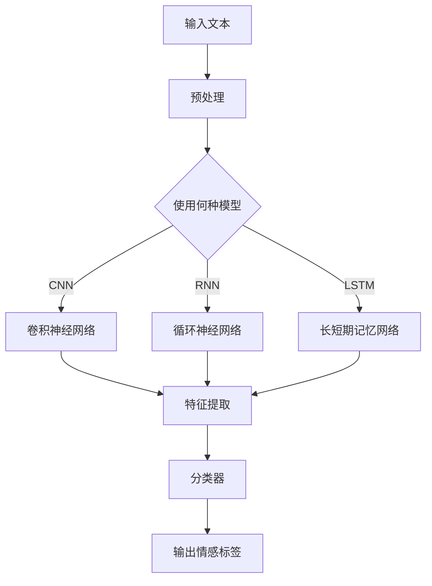

                 

关键词：人工智能、情感分析、机器学习、情感心理学、人类情感理解

> 摘要：随着人工智能技术的不断进步，机器对人类情感的理解变得日益重要。本文将从AI心理学的角度出发，探讨机器如何通过深度学习技术来感知、分析和理解人类的情感，并提出未来的发展方向和面临的挑战。

## 1. 背景介绍

随着信息技术的飞速发展，人工智能（AI）已经成为现代科技领域的研究热点。从早期的规则系统到基于统计模型的机器学习，再到如今深度学习的广泛应用，人工智能技术不断革新，提升了计算机对复杂任务的处理能力。然而，在众多任务中，情感分析成为一个极具挑战性的领域。

情感分析是指使用自然语言处理（NLP）技术，从文本数据中识别和提取情感信息。这些情感信息通常分为正面、负面和中性三种类型，或者更加细致的情感标签，如快乐、悲伤、愤怒等。情感分析在社交媒体监测、市场研究、智能客服、心理健康等领域都有着广泛的应用。

然而，人类情感是复杂多变的，受多种因素影响，如文化背景、个人经历、情绪状态等。这使得情感分析在自然语言处理领域成为一个极具挑战性的任务。为了解决这一问题，AI心理学家们开始探索如何让机器更好地理解人类情感。

## 2. 核心概念与联系

### 2.1. 情感心理学

情感心理学是研究人类情感的产生、发展、表达和调节的学科。它关注情感的本质、功能及其与社会行为的关系。在情感心理学中，情感被定义为一种复杂的心理体验，包括认知、生理和行为反应。

情感心理学的主要研究方向包括情感的类型、情感与社会行为的关系、情感认知加工机制等。情感类型包括基本情感（如快乐、悲伤、愤怒等）和复合情感（如爱、厌恶、恐惧等）。情感与社会行为的关系表现在情感如何影响个体的决策、人际互动和社会适应等方面。

### 2.2. 自然语言处理

自然语言处理（NLP）是人工智能的一个重要分支，旨在使计算机能够理解、生成和处理自然语言。NLP涉及语音识别、文本分类、语义理解、机器翻译等多个领域。在情感分析中，NLP技术被用来从文本数据中提取情感信息。

NLP的核心技术包括词性标注、句法分析、命名实体识别、语义角色标注等。词性标注用于识别文本中的单词类型（如名词、动词、形容词等）；句法分析用于理解句子结构；命名实体识别用于识别文本中的特定实体（如人名、地名、组织名等）；语义角色标注用于识别句子中的动作及其相关实体。

### 2.3. 深度学习

深度学习是一种基于多层神经网络的学习方法，能够在没有明确编程规则的情况下，通过学习大量数据自动提取特征。深度学习在图像识别、语音识别、自然语言处理等领域取得了显著成果。

在情感分析中，深度学习被用来构建复杂的模型，以从文本数据中识别和提取情感信息。深度学习的核心组件包括卷积神经网络（CNN）、循环神经网络（RNN）和长短期记忆网络（LSTM）等。

### 2.4. Mermaid 流程图

以下是情感分析在深度学习中的 Mermaid 流程图：



## 3. 核心算法原理 & 具体操作步骤

### 3.1. 算法原理概述

情感分析的核心目标是自动识别文本中的情感极性。在深度学习中，常用的方法是基于卷积神经网络（CNN）、循环神经网络（RNN）和长短期记忆网络（LSTM）的文本分类模型。

### 3.2. 算法步骤详解

1. **数据预处理**：对输入文本进行分词、去停用词、词干提取等操作，将文本转换为模型可处理的格式。

2. **模型选择**：根据数据特点和研究目标，选择合适的深度学习模型。常见的模型包括CNN、RNN和LSTM。

3. **特征提取**：使用选择的模型对预处理后的文本进行特征提取。在CNN中，使用卷积层提取文本中的局部特征；在RNN和LSTM中，使用循环层对文本序列进行建模。

4. **分类器**：将提取的特征输入到分类器中，对文本的情感极性进行分类。

5. **输出**：根据分类器的输出，得到文本的情感标签。

### 3.3. 算法优缺点

- **优点**：深度学习模型能够自动提取文本中的复杂特征，提高情感分析的准确率。
- **缺点**：深度学习模型需要大量的训练数据和计算资源，且模型的解释性较差。

### 3.4. 算法应用领域

情感分析在多个领域都有广泛的应用，如社交媒体监测、市场研究、智能客服和心理健康等。

## 4. 数学模型和公式

### 4.1. 数学模型构建

在情感分析中，常用的数学模型包括卷积神经网络（CNN）、循环神经网络（RNN）和长短期记忆网络（LSTM）。

- **CNN**：

$$
h_{CNN}(x) = \text{ReLU}(\sum_{k=1}^{K} w_{k} * \text{filter}_{k}(x) + b)
$$

其中，$x$为输入文本，$w_{k}$为卷积核，$\text{filter}_{k}(x)$为卷积操作，$b$为偏置。

- **RNN**：

$$
h_{RNN}(x_{t}) = \text{ReLU}(W_{h} \cdot [h_{t-1}, x_{t}] + b_{h})
$$

其中，$h_{t-1}$为前一时间步的隐藏状态，$W_{h}$为权重矩阵，$[h_{t-1}, x_{t}]$为输入序列，$b_{h}$为偏置。

- **LSTM**：

$$
i_{t} = \sigma(W_{i} \cdot [h_{t-1}, x_{t}] + b_{i}) \\
f_{t} = \sigma(W_{f} \cdot [h_{t-1}, x_{t}] + b_{f}) \\
\gamma_{t} = \sigma(W_{\gamma} \cdot [h_{t-1}, x_{t}] + b_{\gamma}) \\
o_{t} = \sigma(W_{o} \cdot [h_{t-1}, x_{t}] + b_{o}) \\
h_{t} = f_{t} \odot \text{sigmoid}(\gamma_{t} \cdot h_{t-1}) + i_{t} \odot \text{sigmoid}(\gamma_{t} \cdot \text{tanh}(W_{c} \cdot [h_{t-1}, x_{t}] + b_{c})),
$$

其中，$i_{t}$、$f_{t}$、$\gamma_{t}$、$o_{t}$分别为输入门、遗忘门、输出门和隐藏状态，$W_{i}$、$W_{f}$、$W_{\gamma}$、$W_{o}$、$W_{c}$为权重矩阵，$b_{i}$、$b_{f}$、$b_{\gamma}$、$b_{o}$、$b_{c}$为偏置。

### 4.2. 公式推导过程

- **CNN**：CNN的推导过程涉及卷积操作、激活函数和卷积核的学习。

- **RNN**：RNN的推导过程涉及循环操作、激活函数和权重矩阵的学习。

- **LSTM**：LSTM的推导过程涉及门控机制、激活函数和权重矩阵的学习。

### 4.3. 案例分析与讲解

假设我们有一个包含情感极性标注的训练数据集，我们希望使用LSTM模型对新的文本数据进行情感分类。

1. **数据预处理**：将文本数据进行分词、去停用词、词干提取等操作。

2. **构建LSTM模型**：使用TensorFlow或PyTorch等深度学习框架构建LSTM模型。

3. **训练模型**：使用训练数据集训练LSTM模型。

4. **评估模型**：使用验证数据集评估模型性能。

5. **应用模型**：对新的文本数据进行情感分类。

## 5. 项目实践：代码实例和详细解释说明

### 5.1. 开发环境搭建

- 安装Python环境（建议使用Anaconda）
- 安装深度学习框架TensorFlow或PyTorch
- 安装文本预处理库（如NLTK、spaCy）

### 5.2. 源代码详细实现

以下是一个使用TensorFlow构建的LSTM情感分析模型的示例代码：

```python
import tensorflow as tf
from tensorflow.keras.models import Sequential
from tensorflow.keras.layers import Embedding, LSTM, Dense
from tensorflow.keras.preprocessing.sequence import pad_sequences
from tensorflow.keras.preprocessing.text import Tokenizer

# 加载训练数据
train_texts = [...]
train_labels = [...]

# 初始化Tokenizer
tokenizer = Tokenizer(num_words=10000)
tokenizer.fit_on_texts(train_texts)

# 序列化文本数据
train_sequences = tokenizer.texts_to_sequences(train_texts)
train_padded = pad_sequences(train_sequences, maxlen=100, padding='post', truncating='post')

# 构建LSTM模型
model = Sequential()
model.add(Embedding(10000, 16))
model.add(LSTM(32, activation='relu', return_sequences=True))
model.add(LSTM(32, activation='relu'))
model.add(Dense(1, activation='sigmoid'))

# 编译模型
model.compile(optimizer='adam', loss='binary_crossentropy', metrics=['accuracy'])

# 训练模型
model.fit(train_padded, train_labels, epochs=10, batch_size=128, validation_split=0.2)

# 评估模型
test_texts = [...]
test_sequences = tokenizer.texts_to_sequences(test_texts)
test_padded = pad_sequences(test_sequences, maxlen=100, padding='post', truncating='post')
predictions = model.predict(test_padded)
```

### 5.3. 代码解读与分析

- **加载训练数据**：从文件中加载训练数据和标签。
- **初始化Tokenizer**：使用Tokenizer将文本转换为数字序列。
- **序列化文本数据**：将文本数据转换为数字序列。
- **构建LSTM模型**：使用Sequential模型堆叠Embedding、LSTM和Dense层。
- **编译模型**：设置优化器、损失函数和评价指标。
- **训练模型**：使用fit方法训练模型。
- **评估模型**：使用预测方法对新的文本数据进行情感分类。

## 6. 实际应用场景

### 6.1. 社交媒体监测

社交媒体平台上的用户评论和帖子反映了公众对特定事件、产品或服务的情感倾向。通过对这些文本数据进行情感分析，企业可以了解消费者的反馈，优化产品和服务，提高用户满意度。

### 6.2. 市场研究

市场研究机构可以利用情感分析技术对消费者反馈进行分析，识别消费者对产品的情感倾向，为企业提供有针对性的营销策略。

### 6.3. 智能客服

智能客服系统可以使用情感分析技术理解用户的情绪状态，提供更加个性化的服务，提高用户体验。

### 6.4. 心理健康

心理健康领域可以利用情感分析技术对患者的文本数据进行分析，了解患者的情绪状态，为心理治疗提供支持。

## 7. 未来应用展望

随着人工智能技术的不断发展，情感分析在未来将会有更多的应用场景。以下是一些未来应用展望：

- **情感计算**：将情感分析技术应用于智能机器人，实现人机情感交互。
- **个性化推荐**：结合情感分析技术，为用户提供更加个性化的推荐服务。
- **情感教育**：利用情感分析技术，为教育领域提供情感教育支持。

## 8. 总结：未来发展趋势与挑战

随着人工智能技术的不断发展，情感分析在未来将会取得更多突破。然而，面对复杂多变的情感，机器如何更好地理解人类情感仍然是一个巨大的挑战。未来的研究需要关注以下几个方面：

- **情感模型的解释性**：提高情感分析模型的解释性，使其更加透明和可靠。
- **跨模态情感分析**：结合文本、语音、图像等多模态数据，提高情感分析的准确性和全面性。
- **多语言情感分析**：解决多语言情感分析中的挑战，实现跨语言的情感识别。

## 9. 附录：常见问题与解答

### 9.1. 什么是情感分析？

情感分析是指使用自然语言处理（NLP）技术，从文本数据中识别和提取情感信息。

### 9.2. 情感分析有哪些应用场景？

情感分析在社交媒体监测、市场研究、智能客服和心理健康等领域都有广泛的应用。

### 9.3. 情感分析模型的解释性如何提高？

提高情感分析模型的解释性可以通过可视化模型结构、分析特征贡献等方式实现。

### 9.4. 情感分析在心理健康领域有哪些应用？

情感分析可以用于心理健康领域的情绪识别、情感诊断和心理干预等方面。

作者：禅与计算机程序设计艺术 / Zen and the Art of Computer Programming
```

