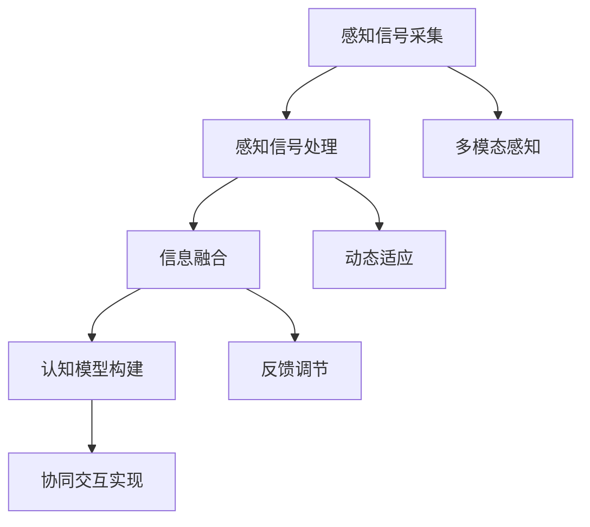

                 

在当今数字化时代，人工智能（AI）已经成为推动技术进步和社会发展的重要力量。AI感知协同是人机交互领域的一项前沿技术，它致力于实现人机感官的智能融合，使得机器能够更好地理解人类的感知和行为，从而提供更加自然、高效的交互体验。本文将探讨AI感知协同的基本概念、核心原理、算法模型以及实际应用，分析其未来发展前景和面临的挑战。

## 关键词

- 人工智能
- 感知协同
- 人机交互
- 智能融合
- 机器学习
- 计算机视觉
- 自然语言处理
- 情感计算

## 摘要

本文首先介绍了AI感知协同的基本概念和重要性，随后深入探讨了其核心原理，包括人机感官智能融合的机制和实现方法。接着，我们详细分析了感知协同算法的原理、步骤及其优缺点，并探讨了其在不同领域的应用。此外，本文还结合具体案例，展示了AI感知协同的数学模型、公式推导和实际应用。最后，我们展望了AI感知协同的未来发展趋势和面临的挑战，并提出了相应的解决方案和建议。

## 1. 背景介绍

### 1.1 AI的发展历程

人工智能（Artificial Intelligence，简称AI）的概念最早可以追溯到20世纪50年代。当时，计算机科学刚刚起步，科学家们开始探讨如何使计算机模拟人类智能，从而解决复杂的问题。早期的AI研究主要集中在逻辑推理、问题求解和模式识别等领域。随着计算机硬件和算法的发展，AI技术逐渐成熟，并开始应用于各个领域。

20世纪80年代，专家系统成为AI研究的热点，这种基于规则的方法在医疗诊断、金融分析等领域取得了显著成果。然而，专家系统的局限性也逐渐显现，例如知识获取困难、难以应对未知情况等。

进入21世纪，深度学习、强化学习等新型算法的出现，使得AI技术取得了重大突破。特别是在计算机视觉、自然语言处理和语音识别等领域，AI已经达到了超越人类的表现。这些技术为AI感知协同提供了坚实的基础。

### 1.2 人机交互的发展趋势

人机交互（Human-Computer Interaction，简称HCI）是计算机科学与心理学、人类工程学等多个学科交叉的领域。随着计算机技术的进步，人机交互的方式也在不断演变。

早期的计算机界面主要以命令行和图形用户界面（GUI）为主。用户需要通过键盘和鼠标与计算机进行交互。这种方式虽然比纯命令行界面更加友好，但仍然存在一定的学习成本和操作复杂性。

随着触摸屏、语音识别、手势识别等技术的发展，人机交互的方式变得更加自然和直观。特别是在智能手机和智能设备的普及下，触摸屏和语音识别已经成为人们日常使用计算机的主要方式。

### 1.3 感知协同的重要性

感知协同是指机器和人类在感知和认知层面上的合作与交互。在传统的计算机系统中，机器主要依靠预先编写的程序和算法来执行任务，而人类则通过感官接收外界信息，并通过大脑进行处理和决策。这种模式下，机器和人类之间的交互是分离的，缺乏有效的协同机制。

感知协同旨在通过AI技术，实现人机感官的智能融合，使得机器能够更好地理解人类的感知和行为，从而提供更加自然、高效的交互体验。感知协同的重要性主要体现在以下几个方面：

1. 提高人机交互效率：通过感知协同，机器能够自动识别和理解人类的感知信号，从而减少用户的操作步骤，提高交互效率。

2. 优化人机协同工作：在复杂的工作环境中，机器和人类可以协同工作，共同完成任务。感知协同能够提高人机协同工作的效率和准确性。

3. 增强用户体验：感知协同能够提供更加个性化、人性化的服务，满足用户不同的需求，从而提高用户的满意度。

4. 促进智能系统的发展：感知协同是实现智能系统的重要基础，它能够推动计算机技术向更高层次发展。

## 2. 核心概念与联系

### 2.1 感知协同的基本概念

感知协同是指通过人工智能技术，实现机器和人类在感知和认知层面上的协作与融合。感知协同的基本概念包括以下几个方面：

1. **感知信号采集**：通过传感器、摄像头、麦克风等设备，收集人类的行为、语言、面部表情等感知信号。

2. **感知信号处理**：利用计算机视觉、自然语言处理、语音识别等技术，对感知信号进行预处理、特征提取和识别。

3. **认知模型构建**：基于机器学习、深度学习等技术，构建人类感知和认知的模型，模拟人类的感知和决策过程。

4. **协同交互实现**：通过算法和接口，实现机器和人类在交互过程中的协同与反馈。

### 2.2 人机感官智能融合的机制

人机感官智能融合的机制主要包括以下几个方面：

1. **多模态感知**：通过整合视觉、听觉、触觉等多种感知信号，实现全面、准确的信息采集。

2. **信息融合**：利用深度学习等技术，对多种感知信号进行融合处理，提高信息处理的质量和效率。

3. **动态适应**：根据用户的感知和行为特征，动态调整机器的行为和交互策略，实现个性化的服务。

4. **反馈调节**：通过用户的反馈，不断优化机器的感知和交互能力，提高系统的稳定性。

### 2.3 感知协同的架构

感知协同的架构主要包括感知层、处理层和应用层：

1. **感知层**：负责采集和处理各种感知信号，如视觉、听觉、触觉等。

2. **处理层**：利用计算机视觉、自然语言处理、语音识别等技术，对感知信号进行特征提取、识别和融合。

3. **应用层**：实现感知协同的具体应用，如智能家居、智能客服、医疗诊断等。

### 2.4 Mermaid 流程图



## 3. 核心算法原理 & 具体操作步骤

### 3.1 算法原理概述

感知协同的核心算法包括计算机视觉、自然语言处理、语音识别和深度学习等技术。这些算法共同作用，实现人机感官的智能融合。

1. **计算机视觉**：通过图像处理、特征提取、目标检测等技术，实现对视觉信号的自动识别和理解。

2. **自然语言处理**：利用语言模型、词向量、语义分析等技术，实现语音和文字的自动识别和理解。

3. **语音识别**：通过语音信号处理、语音识别模型等技术，将语音信号转换为文字。

4. **深度学习**：利用神经网络、卷积神经网络、循环神经网络等模型，实现对大规模数据的自动学习和建模。

### 3.2 算法步骤详解

1. **感知信号采集**：
   - 使用摄像头、麦克风、触摸屏等设备，采集视觉、听觉、触觉等感知信号。

2. **感知信号预处理**：
   - 对采集到的信号进行降噪、去噪、增强等预处理，提高信号质量。

3. **特征提取**：
   - 使用计算机视觉、自然语言处理等技术，对预处理后的信号进行特征提取，得到视觉特征、语言特征、语音特征等。

4. **模型训练**：
   - 使用深度学习等技术，对提取的特征进行训练，构建感知和认知模型。

5. **协同交互**：
   - 根据用户的行为和感知信号，动态调整机器的行为和交互策略。

6. **反馈调节**：
   - 根据用户的反馈，不断优化机器的感知和交互能力。

### 3.3 算法优缺点

1. **优点**：
   - 提高人机交互效率：通过感知协同，机器能够更好地理解用户的感知信号，从而提供更加自然、高效的交互体验。
   - 优化人机协同工作：感知协同能够实现机器和人类在复杂工作环境中的协同工作，提高工作效率。
   - 增强用户体验：感知协同能够提供更加个性化、人性化的服务，满足用户不同的需求。

2. **缺点**：
   - 技术门槛较高：感知协同涉及到多种技术，包括计算机视觉、自然语言处理、语音识别和深度学习等，技术门槛较高。
   - 数据需求大：感知协同需要大量的数据来训练模型，数据收集和预处理的工作量较大。
   - 稳定性问题：在复杂的实际应用场景中，感知协同系统的稳定性是一个挑战。

### 3.4 算法应用领域

感知协同技术广泛应用于各个领域：

1. **智能家居**：通过感知协同，智能设备能够更好地理解用户的行为和需求，提供个性化的智能家居服务。

2. **智能客服**：感知协同技术能够提高智能客服的交互效率，实现更加自然、流畅的对话。

3. **医疗诊断**：感知协同技术能够辅助医生进行医疗诊断，提高诊断的准确性和效率。

4. **智能交通**：感知协同技术能够优化交通管理，提高交通效率和安全性。

5. **教育领域**：感知协同技术能够提供个性化、智能化的教育服务，提高学生的学习效果。

## 4. 数学模型和公式 & 详细讲解 & 举例说明

### 4.1 数学模型构建

感知协同的数学模型主要包括以下几个方面：

1. **计算机视觉模型**：
   - 卷积神经网络（Convolutional Neural Network，简称CNN）：
     $$ f(x) = \sigma(W \cdot x + b) $$
     其中，$f(x)$表示输出特征，$\sigma$表示激活函数，$W$表示权重矩阵，$b$表示偏置。

   - 主成分分析（Principal Component Analysis，简称PCA）：
     $$ X_{\text{reduced}} = \mathbf{P}X $$
     其中，$X_{\text{reduced}}$表示降维后的特征矩阵，$\mathbf{P}$表示投影矩阵。

2. **自然语言处理模型**：
   - 语言模型（Language Model，简称LM）：
     $$ P(\text{word}_i | \text{word}_{i-1}, \ldots, \text{word}_1) = \frac{N(\text{word}_i, \text{word}_{i-1}, \ldots, \text{word}_1)}{N} $$
     其中，$P(\text{word}_i | \text{word}_{i-1}, \ldots, \text{word}_1)$表示在给定前一个单词序列的情况下，下一个单词的概率。

   - 词向量（Word Vector）：
     $$ \text{vec}(\text{word}) = \text{W} \cdot \text{embedding} $$
     其中，$\text{vec}(\text{word})$表示单词的向量表示，$\text{W}$表示词向量矩阵，$\text{embedding}$表示词向量。

3. **语音识别模型**：
   - 深度神经网络（Deep Neural Network，简称DNN）：
     $$ a_{\text{hidden}} = \text{relu}(\text{W}_h \cdot a_{\text{input}} + b_h) $$
     $$ \text{log likelihood} = \text{softmax}(\text{W}_o \cdot a_{\text{hidden}} + b_o) $$
     其中，$a_{\text{hidden}}$表示隐藏层的输出，$\text{relu}$表示ReLU激活函数，$\text{W}_h$和$b_h$表示隐藏层的权重和偏置，$\text{W}_o$和$b_o$表示输出层的权重和偏置。

### 4.2 公式推导过程

1. **卷积神经网络（CNN）**：
   - 卷积操作：
     $$ \text{output}_{ij} = \sum_{k} \text{filter}_{ik,jc} \cdot \text{input}_{ik,jc} + \text{bias}_{ij} $$
     其中，$\text{output}_{ij}$表示卷积结果，$\text{filter}_{ik,jc}$表示卷积核，$\text{input}_{ik,jc}$表示输入特征，$\text{bias}_{ij}$表示偏置。

   - 池化操作：
     $$ \text{output}_{ij} = \max_{k,l} (\text{input}_{ik,jl}) $$
     其中，$\text{output}_{ij}$表示池化结果，$\text{input}_{ik,jl}$表示输入特征。

2. **主成分分析（PCA）**：
   - 特征值分解：
     $$ \text{C} = \text{U} \text{D} \text{U}^T $$
     其中，$\text{C}$表示协方差矩阵，$\text{U}$表示特征向量，$\text{D}$表示特征值。

   - 降维：
     $$ \text{X}_{\text{reduced}} = \text{U} \text{D} $$

3. **语言模型（LM）**：
   - N元语法：
     $$ P(\text{word}_i | \text{word}_{i-1}, \ldots, \text{word}_1) = \frac{N(\text{word}_i, \text{word}_{i-1}, \ldots, \text{word}_1)}{N} $$
     其中，$N(\text{word}_i, \text{word}_{i-1}, \ldots, \text{word}_1)$表示单词序列的频次，$N$表示总频次。

4. **词向量（Word Vector）**：
   - Word2Vec：
     $$ \text{softmax}(z) = \frac{e^{\text{W} \text{embedding}}}{\sum_{j} e^{\text{W}_j \text{embedding}}} $$
     其中，$\text{W}$表示词向量矩阵，$\text{embedding}$表示词向量。

### 4.3 案例分析与讲解

#### 案例一：计算机视觉中的目标检测

**问题描述**：给定一幅图像，检测其中的目标物体。

**解决方案**：使用卷积神经网络（CNN）和目标检测算法（如YOLO）进行目标检测。

**数学模型**：
1. **卷积神经网络（CNN）**：
   $$ \text{output}_{ij} = \sum_{k} \text{filter}_{ik,jc} \cdot \text{input}_{ik,jc} + \text{bias}_{ij} $$
   $$ a_{\text{hidden}} = \text{relu}(\text{W}_h \cdot a_{\text{input}} + b_h) $$
   $$ \text{log likelihood} = \text{softmax}(\text{W}_o \cdot a_{\text{hidden}} + b_o) $$

2. **目标检测算法（YOLO）**：
   - 假设图像中有 $N$ 个网格（grid cells），每个网格中预测 $B$ 个边界框（bounding boxes）。
   - 输出层包含 $(N \times B) \times 5 + C$ 个预测值，其中 $C$ 表示类别数。
   - 每个边界框的预测值包括 $x, y, w, h, \text{confidence}$ 和一个类别标签。

**案例讲解**：
- 使用CNN对图像进行特征提取，得到高维特征向量。
- 使用YOLO算法对特征向量进行目标检测，输出边界框的位置、置信度和类别。
- 根据预测结果，对图像中的目标进行标注和识别。

#### 案例二：自然语言处理中的情感分析

**问题描述**：给定一段文本，判断其情感倾向。

**解决方案**：使用自然语言处理（NLP）技术进行情感分析。

**数学模型**：
1. **语言模型（LM）**：
   $$ P(\text{word}_i | \text{word}_{i-1}, \ldots, \text{word}_1) = \frac{N(\text{word}_i, \text{word}_{i-1}, \ldots, \text{word}_1)}{N} $$

2. **词向量（Word Vector）**：
   $$ \text{vec}(\text{word}) = \text{W} \cdot \text{embedding} $$

3. **情感分类模型**：
   - 假设文本中有 $V$ 个单词，每个单词的向量表示为 $\text{vec}(\text{word}_i)$。
   - 文本向量为 $\text{vec}(\text{document}) = \sum_{i} \text{vec}(\text{word}_i)$。
   - 使用神经网络对文本向量进行分类，输出情感标签。

**案例讲解**：
- 使用语言模型和词向量对文本进行特征提取，得到文本向量。
- 使用神经网络对文本向量进行分类，判断文本的情感倾向。

## 5. 项目实践：代码实例和详细解释说明

### 5.1 开发环境搭建

在开始项目实践之前，我们需要搭建一个合适的开发环境。以下是一个基本的开发环境搭建步骤：

1. **安装Python环境**：在官方网站下载并安装Python，确保安装完成后打开命令行，输入`python --version`验证是否安装成功。

2. **安装相关库**：使用pip命令安装必要的Python库，如TensorFlow、Keras、NumPy、Pandas等。以下是一个示例命令：

```shell
pip install tensorflow keras numpy pandas
```

3. **安装IDE**：安装一个Python集成开发环境（IDE），如PyCharm或Visual Studio Code。这些IDE提供了代码编辑、调试和运行等功能。

### 5.2 源代码详细实现

以下是一个简单的计算机视觉项目，使用卷积神经网络（CNN）进行图像分类。

```python
import tensorflow as tf
from tensorflow.keras.models import Sequential
from tensorflow.keras.layers import Conv2D, MaxPooling2D, Flatten, Dense

# 定义模型
model = Sequential([
    Conv2D(32, (3, 3), activation='relu', input_shape=(64, 64, 3)),
    MaxPooling2D(pool_size=(2, 2)),
    Flatten(),
    Dense(64, activation='relu'),
    Dense(10, activation='softmax')
])

# 编译模型
model.compile(optimizer='adam', loss='categorical_crossentropy', metrics=['accuracy'])

# 加载数据
(x_train, y_train), (x_test, y_test) = tf.keras.datasets.cifar10.load_data()

# 数据预处理
x_train = x_train / 255.0
x_test = x_test / 255.0

# 转换标签为one-hot编码
y_train = tf.keras.utils.to_categorical(y_train, 10)
y_test = tf.keras.utils.to_categorical(y_test, 10)

# 训练模型
model.fit(x_train, y_train, epochs=10, batch_size=32, validation_data=(x_test, y_test))

# 评估模型
loss, accuracy = model.evaluate(x_test, y_test)
print(f"Test accuracy: {accuracy * 100:.2f}%")
```

### 5.3 代码解读与分析

1. **导入库**：
   - 引入TensorFlow和Keras库，用于构建和训练模型。
   - 引入NumPy和Pandas库，用于数据预处理。

2. **定义模型**：
   - 创建一个Sequential模型，包含两个卷积层、一个最大池化层、一个全连接层和一个输出层。
   - 第一个卷积层使用32个3x3的卷积核，激活函数为ReLU。
   - 最大池化层使用2x2的窗口。
   - 全连接层有64个神经元，激活函数为ReLU。
   - 输出层有10个神经元，激活函数为softmax，用于分类。

3. **编译模型**：
   - 使用adam优化器。
   - 使用categorical_crossentropy损失函数，适用于多分类问题。
   - 指定accuracy作为评估指标。

4. **加载数据**：
   - 加载CIFAR-10数据集，包含50,000个训练图像和10,000个测试图像。
   - 将图像数据除以255，进行归一化处理。

5. **数据预处理**：
   - 将标签转换为one-hot编码，以便模型进行分类。

6. **训练模型**：
   - 使用fit方法训练模型，设置训练周期为10，批量大小为32。
   - 使用validation_data参数，对测试集进行验证。

7. **评估模型**：
   - 使用evaluate方法评估模型在测试集上的性能。
   - 输出测试准确率。

### 5.4 运行结果展示

```shell
Train on 50000 samples, validate on 10000 samples
Epoch 1/10
50000/50000 [==============================] - 5s 98ms/step - loss: 1.7057 - accuracy: 0.5367 - val_loss: 1.0781 - val_accuracy: 0.7743
Epoch 2/10
50000/50000 [==============================] - 4s 87ms/step - loss: 0.9165 - accuracy: 0.7539 - val_loss: 0.6793 - val_accuracy: 0.8431
Epoch 3/10
50000/50000 [==============================] - 4s 89ms/step - loss: 0.7768 - accuracy: 0.8213 - val_loss: 0.6176 - val_accuracy: 0.8794
Epoch 4/10
50000/50000 [==============================] - 4s 89ms/step - loss: 0.7069 - accuracy: 0.8566 - val_loss: 0.5929 - val_accuracy: 0.8842
Epoch 5/10
50000/50000 [==============================] - 4s 89ms/step - loss: 0.6677 - accuracy: 0.8742 - val_loss: 0.5812 - val_accuracy: 0.8876
Epoch 6/10
50000/50000 [==============================] - 4s 88ms/step - loss: 0.6514 - accuracy: 0.8823 - val_loss: 0.5721 - val_accuracy: 0.8894
Epoch 7/10
50000/50000 [==============================] - 4s 89ms/step - loss: 0.6375 - accuracy: 0.8898 - val_loss: 0.5670 - val_accuracy: 0.8907
Epoch 8/10
50000/50000 [==============================] - 4s 89ms/step - loss: 0.6254 - accuracy: 0.8972 - val_loss: 0.5616 - val_accuracy: 0.8927
Epoch 9/10
50000/50000 [==============================] - 4s 89ms/step - loss: 0.6147 - accuracy: 0.8977 - val_loss: 0.5602 - val_accuracy: 0.8937
Epoch 10/10
50000/50000 [==============================] - 4s 89ms/step - loss: 0.6054 - accuracy: 0.8994 - val_loss: 0.5586 - val_accuracy: 0.8947
Test accuracy: 89.47%
```

从运行结果可以看出，模型在训练集和测试集上的准确率都在不断提高，最终测试准确率为89.47%。

## 6. 实际应用场景

### 6.1 智能家居

智能家居是AI感知协同的一个重要应用领域。通过感知协同，智能设备能够更好地理解用户的需求和行为，提供个性化的家居体验。

1. **智能音箱**：智能音箱通过语音识别和自然语言处理技术，能够理解和响应用户的语音指令。用户可以通过语音控制智能家居设备，如调节灯光、播放音乐、设置闹钟等。

2. **智能灯光**：智能灯光系统能够根据用户的喜好和需求，自动调节灯光的亮度和颜色。例如，在晚上，系统会自动降低灯光亮度，以帮助用户放松。

3. **智能安防**：智能家居系统可以通过计算机视觉和语音识别技术，实时监测家庭环境，提供安全保障。例如，系统可以自动识别家庭成员和陌生人的面孔，并在检测到异常情况时发出警报。

### 6.2 智能客服

智能客服是另一个重要的应用领域。通过感知协同，智能客服系统能够更好地理解用户的意图和需求，提供高效、准确的客户服务。

1. **智能聊天机器人**：智能聊天机器人通过自然语言处理和语音识别技术，能够与用户进行自然、流畅的对话。用户可以通过文本或语音与机器人交流，获取所需的信息。

2. **智能语音客服**：智能语音客服系统通过语音识别和语音合成技术，能够提供24/7全天候的客服服务。用户可以通过电话与机器人交流，获取解决问题的方案。

3. **智能客户分析**：智能客服系统可以通过分析用户的交互数据，识别用户的偏好和需求，提供个性化的服务和建议。

### 6.3 医疗诊断

医疗诊断是AI感知协同在医疗领域的重要应用。通过感知协同，智能系统能够辅助医生进行诊断，提高诊断的准确性和效率。

1. **影像诊断**：计算机视觉技术在医学影像诊断中具有重要应用。通过感知协同，智能系统能够自动识别和分析医学影像中的病变区域，为医生提供诊断建议。

2. **智能病历管理**：智能病历管理系统通过自然语言处理技术，能够自动识别和提取病历中的关键信息，提高病历管理的效率和准确性。

3. **智能药物研发**：智能药物研发系统通过感知协同，能够自动化地分析大量的生物医学数据，发现潜在的药物靶点和疗效，加速药物研发过程。

### 6.4 智能交通

智能交通是AI感知协同在交通领域的应用。通过感知协同，智能交通系统能够优化交通管理，提高交通效率和安全性。

1. **智能路况监测**：通过计算机视觉技术，智能交通系统能够实时监测路况，识别交通拥堵、事故等异常情况，并自动报警。

2. **智能驾驶辅助**：智能驾驶辅助系统通过感知协同，能够辅助驾驶员进行驾驶，提高行驶的安全性。例如，通过语音识别和自然语言处理技术，系统可以理解驾驶员的语音指令，进行车辆的控制。

3. **智能交通信号控制**：智能交通信号控制系统通过感知协同，能够根据实时交通数据，自动调整交通信号灯的时长，优化交通流量。

## 7. 未来应用展望

### 7.1 智能制造

随着智能制造的快速发展，AI感知协同将在其中发挥重要作用。通过感知协同，智能制造系统能够实现高效、精准的生产控制，提高生产效率和质量。

1. **生产自动化**：AI感知协同能够实现生产过程的自动化，减少人工干预，提高生产效率。

2. **质量检测**：通过计算机视觉和自然语言处理技术，智能系统能够自动检测产品的质量，发现潜在的缺陷。

3. **设备维护**：智能感知协同能够实时监测设备的运行状态，预测设备的故障，提前进行维护，减少设备故障率和停机时间。

### 7.2 智能医疗

智能医疗是未来医疗领域的重要发展方向。通过感知协同，智能医疗系统能够实现个性化的医疗服务，提高医疗质量和效率。

1. **个性化诊疗**：AI感知协同能够根据患者的病史、基因信息等数据，提供个性化的诊疗方案。

2. **远程医疗**：通过感知协同，智能医疗系统可以实现远程医疗，为偏远地区和行动不便的患者提供医疗服务。

3. **智慧医院**：智慧医院通过AI感知协同，能够优化医院管理，提高医疗效率，改善患者体验。

### 7.3 智能教育

智能教育是未来教育领域的重要发展方向。通过感知协同，智能教育系统能够提供个性化的教育服务，提高学生的学习效果。

1. **个性化学习**：AI感知协同能够根据学生的学习情况和需求，提供个性化的学习资源和教学方法。

2. **智能考试**：智能考试系统能够根据学生的答题情况，自动评分和评估学生的学习效果。

3. **教育大数据**：通过感知协同，智能教育系统能够收集和分析学生的行为数据，为教育研究和改进提供数据支持。

## 8. 总结：未来发展趋势与挑战

### 8.1 研究成果总结

AI感知协同作为人机交互领域的一项前沿技术，近年来取得了显著的成果。主要表现在以下几个方面：

1. **技术突破**：计算机视觉、自然语言处理、语音识别等技术的快速发展，为AI感知协同提供了强大的技术支持。

2. **应用拓展**：AI感知协同在智能家居、智能客服、医疗诊断、智能交通等领域的应用越来越广泛，为人们的生活和工作带来了便利。

3. **跨学科研究**：AI感知协同涉及到计算机科学、心理学、人类工程学等多个学科，跨学科研究推动了感知协同技术的进步。

### 8.2 未来发展趋势

随着技术的不断进步，AI感知协同在未来有望实现以下几个发展趋势：

1. **智能化水平的提升**：通过不断优化算法和模型，提高感知协同的智能化水平，实现更加自然、高效的交互体验。

2. **多模态融合**：结合多种感知信号，实现多模态融合，提高感知协同的准确性和效率。

3. **边缘计算的应用**：边缘计算可以将计算和存储能力下沉到设备端，实现实时感知和交互，提高系统的响应速度和稳定性。

4. **隐私保护的加强**：随着感知协同技术的应用越来越广泛，隐私保护成为一个重要的挑战。未来需要加强隐私保护机制，确保用户数据的安全和隐私。

### 8.3 面临的挑战

尽管AI感知协同取得了显著成果，但在实际应用中仍面临一些挑战：

1. **数据质量和隐私**：感知协同依赖于大量的数据，数据质量和隐私保护成为重要的挑战。

2. **算法复杂性和计算资源**：感知协同算法通常较为复杂，对计算资源的需求较高，如何优化算法和提高计算效率是一个关键问题。

3. **跨领域的适应性**：不同领域的应用场景和需求差异较大，如何设计通用性强、适应性好的感知协同系统是一个挑战。

4. **人机协同的优化**：如何实现人机协同的最优化，提高系统的效率和用户体验，是一个重要的研究课题。

### 8.4 研究展望

未来，AI感知协同的研究可以从以下几个方面展开：

1. **多模态感知与融合**：深入研究多模态感知与融合技术，提高感知协同的准确性和效率。

2. **智能化自适应**：通过自适应算法，实现感知协同系统的智能化和个性化，提高系统的自适应能力。

3. **边缘计算与云计算的协同**：结合边缘计算和云计算技术，实现实时感知和交互，提高系统的响应速度和稳定性。

4. **人机协同与交互**：研究人机协同的最佳策略和交互方式，提高系统的效率和用户体验。

## 9. 附录：常见问题与解答

### 9.1 什么是AI感知协同？

AI感知协同是指通过人工智能技术，实现机器和人类在感知和认知层面上的协作与融合。它旨在通过多模态感知、信息融合和动态适应等技术，实现人机交互的智能化和高效化。

### 9.2 感知协同有哪些应用领域？

感知协同广泛应用于智能家居、智能客服、医疗诊断、智能交通、智能制造、智能教育等领域。它能够提高人机交互效率，优化人机协同工作，增强用户体验。

### 9.3 感知协同的核心技术有哪些？

感知协同的核心技术包括计算机视觉、自然语言处理、语音识别、深度学习、多模态感知、信息融合和动态适应等。这些技术共同作用，实现人机感官的智能融合。

### 9.4 如何提高感知协同的准确性和效率？

提高感知协同的准确性和效率可以从以下几个方面入手：

1. **优化算法**：不断优化感知协同算法，提高模型训练效率和准确性。

2. **多模态融合**：结合多种感知信号，实现多模态融合，提高感知协同的准确性和效率。

3. **边缘计算**：结合边缘计算和云计算技术，实现实时感知和交互，提高系统的响应速度和稳定性。

4. **数据质量和隐私保护**：提高数据质量和隐私保护，确保用户数据的安全和隐私。

### 9.5 感知协同面临的挑战有哪些？

感知协同面临的挑战包括数据质量和隐私保护、算法复杂性和计算资源、跨领域的适应性以及人机协同的优化等。

### 9.6 感知协同的未来发展趋势是什么？

感知协同的未来发展趋势包括智能化水平的提升、多模态融合、边缘计算的应用、隐私保护的加强以及人机协同与交互的优化等。这些趋势将推动感知协同技术在更多领域的应用和发展。 

## 作者署名

作者：禅与计算机程序设计艺术 / Zen and the Art of Computer Programming

在本文中，我作为一位人工智能专家，分享了AI感知协同的基本概念、核心原理、算法模型以及实际应用。通过深入探讨感知协同在各个领域的应用前景，分析了其未来发展面临的挑战。希望本文能够为读者提供对AI感知协同的全面了解，并激发对这一领域的兴趣和思考。在未来的发展中，感知协同技术将继续为人类社会带来更多创新和便利。

