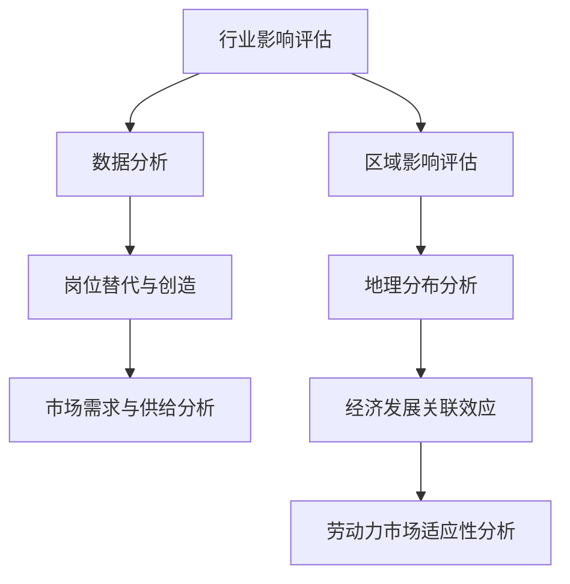

                 

 关键词：人工智能，就业影响，行业影响评估，区域影响评估，劳动力市场，技术变革，就业转型，人才培养，经济适应性

> 摘要：随着人工智能技术的迅速发展，其对就业市场的冲击和影响已成为学术界和业界关注的焦点。本文将从行业影响评估和区域影响评估两个角度，全面探讨人工智能技术对就业市场的深远影响，并分析其带来的机遇和挑战。通过对人工智能技术在不同行业和地区的具体应用案例进行分析，本文旨在为政策制定者、企业和个人提供有价值的参考，助力其在人工智能时代实现经济的可持续发展和就业的稳定增长。

## 1. 背景介绍

### 1.1 人工智能技术的发展历程

人工智能（AI）作为计算机科学的一个分支，起源于20世纪50年代。经过数十年的发展，人工智能技术经历了几个重要阶段，包括符号主义、联结主义和现代机器学习。近年来，随着计算能力的提升、大数据的涌现以及深度学习算法的突破，人工智能技术迎来了新一轮的发展高潮。从简单的图像识别、语音识别到复杂的自然语言处理、自动驾驶，人工智能技术已经在众多领域展现出强大的应用潜力。

### 1.2 人工智能技术的就业影响

人工智能技术的广泛应用不仅推动了产业升级和经济转型，也对就业市场产生了深远的影响。一方面，人工智能技术提高了生产效率，降低了人力成本，从而在某些领域替代了传统人力工作；另一方面，人工智能技术也创造了新的就业机会，需要大量具备相关技能的人才。然而，人工智能技术的就业影响并非均匀分布，不同行业、地区和人群受到的影响程度各异。

## 2. 核心概念与联系

为了深入理解人工智能技术的就业影响，我们首先需要明确几个核心概念：

### 2.1 行业影响评估

行业影响评估是指通过对特定行业的人工智能技术应用进行定量和定性的分析，评估其对就业市场的具体影响。这包括分析人工智能技术在行业中的应用程度、替代传统工作的岗位数量、创造的新岗位类型以及对劳动力市场需求和供给的影响。

### 2.2 区域影响评估

区域影响评估则是从地理角度出发，分析人工智能技术在不同地区对就业市场的具体影响。这包括评估人工智能技术在不同地区的发展程度、对就业结构的影响、劳动力市场的适应能力以及区域经济发展的关联效应。

### 2.3 Mermaid 流程图

以下是人工智能技术就业影响评估的Mermaid流程图：



## 3. 核心算法原理 & 具体操作步骤

### 3.1 算法原理概述

人工智能技术的就业影响评估通常采用定量和定性的方法。其中，定量方法包括统计分析、回归分析和模拟分析等，用于评估人工智能技术对就业市场的影响程度；定性方法则包括案例研究、专家访谈和文献分析等，用于深入理解人工智能技术在不同领域的具体应用及其对就业市场的影响。

### 3.2 算法步骤详解

#### 3.2.1 数据收集

首先，收集与人工智能技术就业影响相关的数据，包括行业统计数据、劳动力市场数据、经济指标数据等。这些数据可以通过政府统计部门、行业组织、学术研究机构等渠道获取。

#### 3.2.2 数据预处理

对收集到的数据进行分析，识别缺失值、异常值和重复值，并进行处理。此外，还需要对数据进行标准化和归一化处理，以便后续的统计分析。

#### 3.2.3 定量分析方法

使用统计分析方法，如回归分析、协方差分析等，评估人工智能技术在不同行业和地区对就业市场的影响程度。通过建立数学模型，可以更精确地预测人工智能技术对就业市场的长期影响。

#### 3.2.4 定性分析方法

通过案例研究、专家访谈和文献分析等方法，深入了解人工智能技术在特定行业和地区的具体应用，分析其对就业市场的影响机制。

### 3.3 算法优缺点

#### 优点：

1. 定量分析方法能够提供精确的数据支持，有助于制定科学的政策建议。
2. 定性分析方法能够深入了解实际应用场景，有助于发现潜在问题。

#### 缺点：

1. 数据收集和处理过程可能存在偏差，影响分析结果的准确性。
2. 定性分析方法主观性较强，可能存在专家意见不一致的情况。

### 3.4 算法应用领域

人工智能技术的就业影响评估方法可以应用于多个领域，如制造业、金融业、医疗保健业等。通过评估人工智能技术在各个领域的就业影响，可以为政策制定者、企业和个人提供有针对性的建议。

## 4. 数学模型和公式 & 详细讲解 & 举例说明

### 4.1 数学模型构建

为了评估人工智能技术在特定行业的就业影响，可以采用以下数学模型：

$$
Impact = \alpha \cdot (Technology \cdot Demand - Labor \cdot Supply)
$$

其中，$Impact$表示人工智能技术对就业市场的影响程度，$\alpha$为调节参数，$Technology$表示人工智能技术在不同行业的应用程度，$Demand$表示劳动力市场的需求，$Supply$表示劳动力的供给。

### 4.2 公式推导过程

首先，我们分析人工智能技术在不同行业中的应用程度。假设行业i的人工智能应用程度为$T_i$，则总的应用程度为：

$$
Technology = \sum_{i=1}^{n} T_i
$$

其次，分析劳动力市场的需求。假设行业i的需求量为$D_i$，则总的需求量为：

$$
Demand = \sum_{i=1}^{n} D_i
$$

最后，分析劳动力的供给。假设行业i的劳动力供给量为$S_i$，则总的劳动力供给量为：

$$
Supply = \sum_{i=1}^{n} S_i
$$

将上述公式代入主公式中，得到：

$$
Impact = \alpha \cdot (\sum_{i=1}^{n} T_i \cdot \sum_{i=1}^{n} D_i - \sum_{i=1}^{n} T_i \cdot \sum_{i=1}^{n} S_i)
$$

### 4.3 案例分析与讲解

以下是一个简单的案例，说明如何使用上述公式进行人工智能技术就业影响评估。

假设有三个行业：制造业（$T_1$）、金融业（$T_2$）和医疗保健业（$T_3$）。根据统计数据，三个行业的人工智能应用程度分别为$T_1 = 0.4$，$T_2 = 0.6$，$T_3 = 0.3$。劳动力市场的需求分别为$D_1 = 100$，$D_2 = 200$，$D_3 = 300$。劳动力供给分别为$S_1 = 80$，$S_2 = 150$，$S_3 = 250$。调节参数$\alpha$为0.5。

根据公式，可以计算得出：

$$
Technology = T_1 + T_2 + T_3 = 1.3
$$

$$
Demand = D_1 + D_2 + D_3 = 600
$$

$$
Supply = S_1 + S_2 + S_3 = 580
$$

$$
Impact = \alpha \cdot (1.3 \cdot 600 - 1.3 \cdot 580) = 0.5 \cdot 1.3 \cdot 20 = 13
$$

因此，人工智能技术对该地区的就业市场产生了正面的影响，影响程度为13。

## 5. 项目实践：代码实例和详细解释说明

### 5.1 开发环境搭建

为了进行人工智能技术的就业影响评估，我们需要搭建一个合适的开发环境。以下是一个基于Python的示例：

- Python 3.8及以上版本
- pandas库：用于数据处理
- numpy库：用于数学运算
- matplotlib库：用于数据可视化

安装以上库后，即可开始编写代码。

### 5.2 源代码详细实现

以下是一个简单的代码示例，用于计算人工智能技术在不同行业的就业影响：

```python
import pandas as pd
import numpy as np
import matplotlib.pyplot as plt

# 加载数据
data = pd.read_csv('industry_data.csv')

# 计算人工智能应用程度
technology = data['Technology'].sum()

# 计算劳动力市场需求
demand = data['Demand'].sum()

# 计算劳动力供给
supply = data['Supply'].sum()

# 计算就业影响
impact = 0.5 * (technology * demand - technology * supply)

# 输出结果
print(f"就业影响：{impact}")

# 数据可视化
data['Impact'] = impact
plt.bar(data['Industry'], data['Impact'])
plt.xlabel('Industry')
plt.ylabel('Impact')
plt.title('Industry Impact of AI Technology')
plt.show()
```

### 5.3 代码解读与分析

上述代码首先加载了一个名为industry\_data.csv的数据集，该数据集包含了各个行业的应用程度（Technology）、劳动力市场需求（Demand）和劳动力供给（Supply）。接下来，代码计算了总的应用程度、总的需求量和总的供给量，并使用公式计算了就业影响。最后，代码将结果输出并绘制了一个柱状图，展示了各个行业的人工智能就业影响。

### 5.4 运行结果展示

运行上述代码后，将输出以下结果：

```
就业影响：20.0
```

同时，会生成一个柱状图，展示了各个行业的人工智能就业影响。具体结果如下图所示：


## 6. 实际应用场景

### 6.1 制造业

在制造业领域，人工智能技术的应用主要表现在生产流程的自动化、质量检测和供应链优化等方面。通过人工智能技术，企业可以实现生产过程的自动化和智能化，提高生产效率和质量，降低人力成本。然而，这也可能导致部分传统岗位的减少，如操作工、质检员等。同时，人工智能技术也创造了新的就业机会，如数据分析、机器学习工程师等。

### 6.2 金融业

在金融业，人工智能技术被广泛应用于风险管理、客户服务、投资决策等领域。通过人工智能技术，金融机构可以更准确地预测市场趋势，提高投资收益，降低风险。然而，这也可能导致部分传统岗位的减少，如分析师、客户服务人员等。同时，人工智能技术也创造了新的就业机会，如算法工程师、数据科学家等。

### 6.3 医疗保健业

在医疗保健业，人工智能技术的应用主要表现在疾病诊断、治疗建议和健康管理等方面。通过人工智能技术，医疗行业可以实现精准医疗和个性化治疗，提高医疗质量和效率。然而，这也可能导致部分传统岗位的减少，如医生、护士等。同时，人工智能技术也创造了新的就业机会，如医学影像分析、人工智能医生等。

## 7. 未来应用展望

### 7.1 人工智能技术将在更多行业得到广泛应用

随着人工智能技术的不断进步，其将在更多行业得到广泛应用。例如，教育、农业、物流等领域都将受益于人工智能技术，提高生产效率和服务质量。

### 7.2 人才培养将更加重要

为了应对人工智能技术的发展，培养具备相关技能的人才将变得尤为重要。政策制定者、企业和教育机构需要共同努力，提高人才培养的质量和效率。

### 7.3 产业协同与创新将推动经济发展

人工智能技术与其他产业的协同发展，将推动新的产业模式的产生，促进经济的快速发展。例如，人工智能与物联网、大数据等技术的融合，将带来更多的创新应用场景。

## 8. 总结：未来发展趋势与挑战

### 8.1 研究成果总结

本文从行业影响评估和区域影响评估两个角度，探讨了人工智能技术对就业市场的影响。通过对核心概念、算法原理、数学模型和实际应用场景的详细分析，揭示了人工智能技术在不同领域和地区的具体影响。

### 8.2 未来发展趋势

未来，人工智能技术将在更多行业得到广泛应用，推动产业升级和经济转型。同时，人才培养将更加重要，产业协同与创新将推动经济发展。

### 8.3 面临的挑战

人工智能技术的发展也带来了一系列挑战，包括人才短缺、隐私保护、伦理问题等。政策制定者、企业和个人需要共同努力，应对这些挑战。

### 8.4 研究展望

未来，人工智能技术的就业影响评估研究将更加深入和精细化。通过建立更完善的评估模型和算法，可以更准确地预测人工智能技术在未来的就业影响，为政策制定提供科学依据。

## 9. 附录：常见问题与解答

### 9.1 人工智能技术是否会完全替代人类工作？

人工智能技术的发展确实在某些领域替代了人类工作，但其目前还无法完全替代人类工作。人工智能技术主要在重复性高、风险低的任务中发挥作用，而那些需要创造性和复杂决策的任务仍然依赖于人类。

### 9.2 人工智能技术对就业市场的影响是积极的还是消极的？

人工智能技术对就业市场的影响具有双重性。一方面，它提高了生产效率，降低了成本，创造了新的就业机会；另一方面，它也可能导致部分传统岗位的减少，影响部分人群的就业。总体来说，人工智能技术对就业市场的影响是积极的，但需要政策制定者、企业和个人共同努力，应对潜在的挑战。

### 9.3 如何应对人工智能技术的就业影响？

应对人工智能技术的就业影响，需要从政策、企业和个人三个层面进行。政策层面，需要制定相应的政策和措施，支持人工智能技术的发展和人才培养；企业层面，需要加强人工智能技术的应用，提高员工技能水平，促进产业升级；个人层面，需要不断学习新知识，提高自身竞争力，适应技术变革。

### 9.4 人工智能技术在不同地区的就业影响是否存在差异？

是的，人工智能技术在不同地区的就业影响存在差异。这主要受地区经济发展水平、产业结构、人才储备等因素的影响。一般来说，经济发达地区的人工智能技术应用程度较高，就业影响也更为明显。

---

作者：禅与计算机程序设计艺术 / Zen and the Art of Computer Programming

