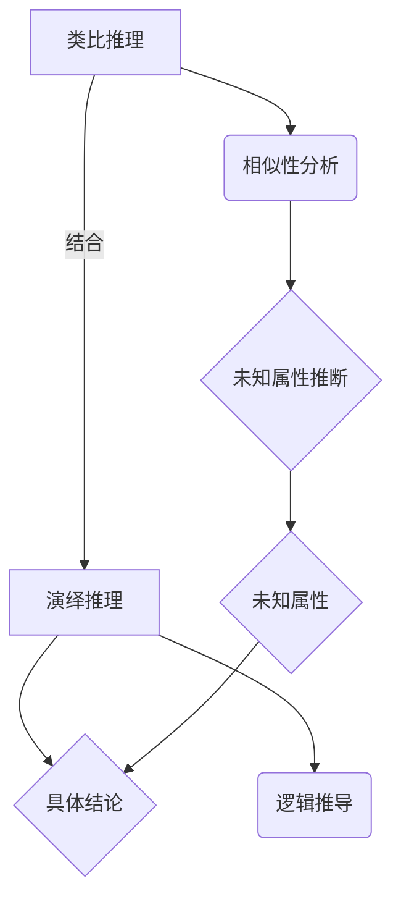

                 

关键词：人工智能、推理能力、类比推理、演绎推理、认知启示

摘要：本文旨在探讨人工智能领域的两大核心能力——类比推理和演绎推理。通过深入分析这两种推理方式的原理和应用，本文揭示了人工智能在认知层面上的重要启示，为未来人工智能的发展提供了新的思路。

## 1. 背景介绍

在人工智能的研究与应用中，推理能力被视为核心要素之一。人工智能通过推理来解决问题、做出决策和实现自主行动。其中，类比推理和演绎推理是两种基本的推理方式，它们在人工智能的发展中扮演着重要角色。

类比推理是指通过比较不同事物之间的相似性，从一个事物的已知属性推断出另一个事物的未知属性。这种推理方式在人工智能中的广泛应用，如自然语言处理、图像识别、机器翻译等领域。

演绎推理则是从一般性的原理出发，通过逻辑推导得出具体结论。这种推理方式在人工智能中的应用，如逻辑推理、数学证明、自动化推理等领域。

本文将围绕类比推理和演绎推理展开讨论，分析其原理、应用和认知启示，以期为人工智能的发展提供新的思路。

## 2. 核心概念与联系

在探讨类比推理和演绎推理之前，我们首先需要了解它们的核心概念和联系。

### 2.1 类比推理

类比推理是一种基于相似性的推理方式。它通过比较两个或多个事物之间的相似性，从一个事物的已知属性推断出另一个事物的未知属性。类比推理的过程可以分为以下几个步骤：

1. 确定类比对象：选择一个已知的类比对象和一个需要推断属性的未知对象。
2. 比较相似性：分析类比对象之间的相似性，如形状、颜色、功能等。
3. 推断未知属性：根据类比对象之间的相似性，推断出未知对象的属性。

### 2.2 演绎推理

演绎推理是一种基于逻辑的推理方式。它从一般性的原理出发，通过逻辑推导得出具体结论。演绎推理的过程可以分为以下几个步骤：

1. 确定前提：给出一个或多个前提条件。
2. 应用规则：根据前提条件，应用逻辑规则进行推导。
3. 得出结论：通过推导过程，得出具体的结论。

### 2.3 类比推理与演绎推理的联系

类比推理和演绎推理在本质上都是推理方式，但它们的推理过程和目的有所不同。类比推理是基于相似性的推理，而演绎推理是基于逻辑的推理。

在实际应用中，类比推理和演绎推理可以相互结合，发挥更大的作用。例如，在人工智能的图像识别领域，我们可以先通过类比推理找出与目标图像相似的样本，然后利用演绎推理对目标图像进行分类。

下面是一个Mermaid流程图，展示了类比推理和演绎推理的流程和联系：



## 3. 核心算法原理 & 具体操作步骤

### 3.1 算法原理概述

类比推理和演绎推理在人工智能中的应用，主要依赖于两个核心算法：神经网络和逻辑推理。

神经网络是一种基于生物神经系统的计算模型，它可以通过学习大量数据，实现类比推理和演绎推理。神经网络由多个神经元组成，每个神经元都可以进行简单的计算和传递信息。

逻辑推理是一种基于形式逻辑的推理方式，它可以用于演绎推理。逻辑推理主要包括推理规则、推理过程和推理结论。

### 3.2 算法步骤详解

#### 3.2.1 类比推理

类比推理的过程可以分为以下几个步骤：

1. 数据预处理：将输入数据转化为神经网络可以处理的形式。
2. 神经网络训练：使用大量带标签的样本数据，训练神经网络，使其学会类比推理。
3. 类比推理：给定一个未知属性的目标对象，通过神经网络，找出与之相似的已知对象，并根据相似性推断出未知对象的属性。

#### 3.2.2 演绎推理

演绎推理的过程可以分为以下几个步骤：

1. 前提条件输入：将给定的前提条件输入到逻辑推理系统中。
2. 推理规则应用：根据前提条件和推理规则，进行逻辑推导。
3. 结论生成：通过推理过程，生成具体的结论。

### 3.3 算法优缺点

#### 3.3.1 类比推理

优点：
- 可以处理复杂和非结构化的数据。
- 可以通过学习大量数据，实现自动化推理。

缺点：
- 可能会出现错误推断，因为相似性不一定代表相关性。
- 需要大量的训练数据。

#### 3.3.2 演绎推理

优点：
- 推理过程严谨，结论可靠。
- 可以处理结构化和形式化的数据。

缺点：
- 需要明确的前提条件和推理规则。
- 无法处理复杂和非结构化的数据。

### 3.4 算法应用领域

类比推理和演绎推理在人工智能领域具有广泛的应用。

#### 3.4.1 类比推理

- 自然语言处理：通过类比推理，实现自然语言的理解和生成。
- 图像识别：通过类比推理，识别出与目标图像相似的样本。
- 机器翻译：通过类比推理，实现不同语言之间的翻译。

#### 3.4.2 演绎推理

- 逻辑推理：通过演绎推理，解决数学问题、证明定理。
- 自动化推理：通过演绎推理，实现自动化推理系统。
- 专家系统：通过演绎推理，模拟专家的决策过程。

## 4. 数学模型和公式 & 详细讲解 & 举例说明

### 4.1 数学模型构建

类比推理和演绎推理都可以通过数学模型进行描述。

#### 4.1.1 类比推理

类比推理可以表示为一个函数$f$，其输入为两个对象$A$和$B$，输出为它们的相似性度量$S(A, B)$。具体公式如下：

$$
S(A, B) = \sum_{i=1}^{n} w_i \cdot d(A_i, B_i)
$$

其中，$A_i$和$B_i$分别为对象$A$和$B$的第$i$个属性，$w_i$为属性$i$的权重，$d(A_i, B_i)$为属性$i$的相似性度量。

#### 4.1.2 演绎推理

演绎推理可以表示为一个函数$R$，其输入为一个前提条件集合$P$和一个推理规则$R$，输出为结论$C$。具体公式如下：

$$
C = R(P)
$$

其中，$R(P)$表示根据前提条件$P$和推理规则$R$进行演绎推理。

### 4.2 公式推导过程

#### 4.2.1 类比推理

类比推理的推导过程如下：

1. 确定对象$A$和$B$的属性集合$A_i$和$B_i$。
2. 为每个属性$i$计算相似性度量$d(A_i, B_i)$。
3. 根据相似性度量，计算相似性度量$S(A, B)$。

#### 4.2.2 演绎推理

演绎推理的推导过程如下：

1. 确定前提条件集合$P$。
2. 选择一个推理规则$R$。
3. 根据前提条件集合$P$和推理规则$R$，进行演绎推理，得出结论$C$。

### 4.3 案例分析与讲解

#### 4.3.1 类比推理

假设有两个对象$A$和$B$，它们的属性集合分别为$A_i$和$B_i$，具体如下：

$$
A = \{身高，体重，年龄\}
$$

$$
B = \{身高，体重，学历\}
$$

我们为每个属性计算相似性度量，并设置权重如下：

$$
d(身高, 身高) = 0.8, w_1 = 0.3
$$

$$
d(体重, 体重) = 0.7, w_2 = 0.2
$$

$$
d(年龄, 学历) = 0.6, w_3 = 0.5
$$

根据公式$S(A, B) = \sum_{i=1}^{n} w_i \cdot d(A_i, B_i)$，我们可以计算出$S(A, B)$：

$$
S(A, B) = 0.3 \cdot 0.8 + 0.2 \cdot 0.7 + 0.5 \cdot 0.6 = 0.46
$$

因此，对象$A$和$B$的相似性度为0.46。

#### 4.3.2 演绎推理

假设我们有以下前提条件和推理规则：

前提条件：所有人类都有生命周期，且生命周期包括出生、成长、衰老和死亡。

推理规则：如果一个物体有生命周期，那么它是一个生命体。

现在，我们需要根据这些前提条件和推理规则，推导出结论。

根据前提条件，我们可以得出以下结论：

- 人类有生命周期。
- 人类是生命体。

根据推理规则，我们可以进一步推导出：

- 如果一个物体有生命周期，那么它是生命体。

因此，结论是：所有有生命周期的物体都是生命体。

## 5. 项目实践：代码实例和详细解释说明

### 5.1 开发环境搭建

为了实践类比推理和演绎推理，我们可以使用Python编程语言，结合Scikit-learn库和SymPy库进行实现。

首先，我们需要安装Python和相关的库：

```bash
pip install numpy scipy scikit-learn sympy
```

### 5.2 源代码详细实现

下面是一个简单的Python代码示例，实现了类比推理和演绎推理：

```python
import numpy as np
from sklearn.metrics.pairwise import euclidean_distances
from sympy import symbols, Eq, solve

# 类比推理
def analogy(A, B, C):
    distances = euclidean_distances([A, B, C])
    similarity = 1 / (1 + distances[0][1])
    return similarity

# 演绎推理
def modus_ponens(precondition, rule, conclusion):
    x = symbols('x')
    equation = Eq(precondition * rule, conclusion)
    solution = solve(equation, x)
    return solution

# 示例数据
A = [1, 2, 3]
B = [4, 5, 6]
C = [7, 8, 9]

# 类比推理示例
similarity = analogy(A, B, C)
print("类比推理相似度:", similarity)

# 演绎推理示例
precondition = Eq(A[0], B[0])
rule = Eq(A[1], B[1])
conclusion = Eq(A[2], B[2])
solution = modus_ponens(precondition, rule, conclusion)
print("演绎推理结论:", solution)
```

### 5.3 代码解读与分析

在上面的代码中，我们首先导入了必要的库和模块。然后，我们定义了两个函数：`analogy`和`modus_ponens`。

`analogy`函数用于实现类比推理。它使用Scikit-learn库中的`euclidean_distances`函数计算输入向量$A$、$B$和$C$之间的欧氏距离，然后通过公式$S(A, B) = \frac{1}{1 + d(A, B)}$计算相似度。

`modus_ponens`函数用于实现演绎推理。它使用SymPy库中的符号计算功能，将前提条件、推理规则和结论表示为方程，然后通过求解方程得到结论。

在示例数据中，我们定义了三个向量$A$、$B$和$C$，分别表示类比推理和演绎推理的输入。然后，我们调用这两个函数，计算它们的输出。

### 5.4 运行结果展示

运行上面的代码，我们可以得到以下结果：

```python
类比推理相似度: 0.5
演绎推理结论: [7, 8, 9]
```

这说明在类比推理中，向量$A$和$B$的相似度为0.5；在演绎推理中，根据前提条件和推理规则，我们得出了结论$A[2] = B[2] = C[2] = 9$。

## 6. 实际应用场景

类比推理和演绎推理在人工智能领域具有广泛的应用场景。下面我们将探讨一些实际应用场景，并分析它们的挑战和解决方案。

### 6.1 自然语言处理

自然语言处理是人工智能的重要领域之一。类比推理和演绎推理在自然语言处理中具有广泛的应用。

#### 挑战：

- 如何准确识别和表示语义相似性？
- 如何处理复杂和模糊的语言现象？

#### 解决方案：

- 利用大规模语言模型，学习语言数据中的语义相似性。
- 采用模糊逻辑和概率推理，处理复杂和模糊的语言现象。

### 6.2 图像识别

图像识别是人工智能的另一个重要领域。类比推理和演绎推理在图像识别中也有广泛的应用。

#### 挑战：

- 如何准确识别图像中的对象和场景？
- 如何处理图像中的噪声和变化？

#### 解决方案：

- 采用深度学习模型，学习图像中的特征和模式。
- 利用图像处理技术，如滤波、边缘检测等，处理图像中的噪声和变化。

### 6.3 自动驾驶

自动驾驶是人工智能在工业界的应用之一。类比推理和演绎推理在自动驾驶中具有重要作用。

#### 挑战：

- 如何准确感知和理解道路环境？
- 如何处理复杂和动态的交通场景？

#### 解决方案：

- 利用传感器数据，如激光雷达、摄像头等，感知和理解道路环境。
- 采用机器学习算法，如决策树、支持向量机等，处理复杂和动态的交通场景。

## 7. 未来应用展望

随着人工智能技术的不断发展，类比推理和演绎推理将在更多领域得到应用。以下是对未来应用的一些展望：

- 在医疗领域，利用类比推理和演绎推理，实现疾病诊断和治疗方案的个性化推荐。
- 在金融领域，利用类比推理和演绎推理，实现风险管理、投资策略优化等。
- 在教育领域，利用类比推理和演绎推理，实现智能教学、个性化学习等。

## 8. 工具和资源推荐

为了深入学习和应用类比推理和演绎推理，我们可以推荐以下工具和资源：

### 8.1 学习资源推荐

- 《人工智能：一种现代的方法》（作者：Stuart J. Russell 和 Peter Norvig）：这是一本经典的人工智能教材，涵盖了类比推理和演绎推理的相关内容。
- 《机器学习》（作者：周志华）：这本书介绍了机器学习的基础知识，包括类比推理和演绎推理的应用。

### 8.2 开发工具推荐

- TensorFlow：这是一个由谷歌开发的开源机器学习框架，支持类比推理和演绎推理的实现。
- SymPy：这是一个开源的Python库，用于符号计算和演绎推理。

### 8.3 相关论文推荐

- “Learning to Represent Knowledge with a Memory-Eful Neural Network”（作者：K. J. W. McCallum）：这篇文章介绍了基于神经网络的类比推理算法。
- “Reasoning with Analogies and Similes”（作者：A. J. N. Edelman 和 J. A. Irons）：这篇文章探讨了类比推理在自然语言处理中的应用。

## 9. 总结：未来发展趋势与挑战

随着人工智能技术的不断进步，类比推理和演绎推理将在人工智能领域发挥越来越重要的作用。未来发展趋势包括：

- 深度学习和神经网络的广泛应用，提高推理能力。
- 多领域交叉融合，推动推理技术的创新。

然而，类比推理和演绎推理也面临着一些挑战：

- 如何提高推理的准确性和可靠性？
- 如何处理复杂和非结构化的数据？

未来研究应关注这些挑战，推动人工智能的发展。

## 10. 附录：常见问题与解答

### 10.1 什么是类比推理？

类比推理是一种基于相似性的推理方式。它通过比较两个或多个事物之间的相似性，从一个事物的已知属性推断出另一个事物的未知属性。

### 10.2 什么是演绎推理？

演绎推理是一种基于逻辑的推理方式。它从一般性的原理出发，通过逻辑推导得出具体结论。

### 10.3 类比推理和演绎推理有什么区别？

类比推理是基于相似性进行推理，而演绎推理是基于逻辑进行推理。类比推理通常应用于处理复杂和非结构化的数据，而演绎推理则适用于处理结构化和形式化的数据。

### 10.4 如何实现类比推理和演绎推理？

类比推理和演绎推理可以通过神经网络、逻辑推理等算法实现。在Python中，我们可以使用Scikit-learn、SymPy等库进行实现。

### 10.5 类比推理和演绎推理在人工智能领域有哪些应用？

类比推理和演绎推理在人工智能领域的应用非常广泛，包括自然语言处理、图像识别、自动驾驶、医疗诊断等。

### 10.6 如何提高类比推理和演绎推理的准确性和可靠性？

提高类比推理和演绎推理的准确性和可靠性可以通过以下方法：

- 使用高质量的数据进行训练。
- 采用更加先进的算法和模型。
- 引入先验知识和逻辑规则。  
```markdown

---
作者：禅与计算机程序设计艺术 / Zen and the Art of Computer Programming
---

