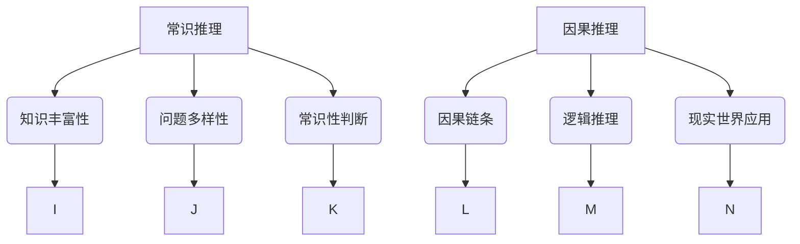

                 

 **关键词**: AI推理能力，评测基准，常识推理，因果推理，测试集

**摘要**: 本文将深入探讨AI推理能力的评测基准，特别是常识推理和因果推理测试集的重要性。我们将介绍这些测试集的设计目的、特点，以及在实际应用中的挑战和未来发展趋势。

## 1. 背景介绍

人工智能（AI）的发展离不开对AI系统推理能力的评测。推理是人工智能的核心能力之一，它使得机器能够从已知信息中推导出未知信息，从而完成复杂的任务。为了评估AI系统的推理能力，研究者们开发了各种评测基准和测试集。

常识推理测试集旨在评估AI系统对日常知识和情境的理解能力。这类测试集包含了大量的常识性问题，例如“猫会爬树吗？”或“雨过后天空通常是什么颜色？”。通过这些测试，可以衡量AI系统是否能够正确理解和回答这些问题。

因果推理测试集则关注AI系统在因果关系分析方面的能力。这类测试集通常包含一些需要推断因果关系的问题，例如“为什么病人会生病？”或“哪些因素会导致交通事故？”。这种测试能够帮助评估AI系统在现实世界中的决策能力。

## 2. 核心概念与联系

### 2.1. 常识推理

常识推理是AI系统中一种重要的能力，它涉及到对日常知识的理解和应用。常识推理测试集通常包含以下几个特点：

- **知识丰富性**: 测试集应该涵盖广泛的常识领域，包括自然、社会、科技等各个方面。
- **问题的多样性**: 问题的形式和内容应该多样化，以全面评估AI系统的常识推理能力。
- **常识性判断**: 问题的答案应该是基于普遍认可的常识，而不是个人的主观判断。

### 2.2. 因果推理

因果推理是AI系统理解和分析现实世界中的因果关系的能力。因果推理测试集通常具备以下特征：

- **因果链条**: 测试集中的问题应该能够体现因果关系的复杂性和多样性。
- **逻辑推理**: 测试集中的问题需要通过逻辑推理来解答，而不是简单的匹配或分类。
- **现实世界应用**: 测试集的问题应该与现实世界中的实际应用场景相符合，以提高测试的实用性和有效性。

### 2.3. Mermaid 流程图

为了更好地展示常识推理和因果推理的概念及其联系，我们可以使用Mermaid流程图来表示。



## 3. 核心算法原理 & 具体操作步骤

### 3.1. 算法原理概述

常识推理和因果推理测试集的评估通常依赖于以下核心算法原理：

- **知识图谱表示**: 使用知识图谱来表示常识和因果关系，以便于AI系统能够快速检索和理解相关信息。
- **深度学习模型**: 利用深度学习模型进行推理，这些模型可以通过大量的数据进行训练，以提高推理的准确性和效率。
- **因果推断算法**: 使用因果推断算法来分析复杂的关系网络，从而确定因果关系。

### 3.2. 算法步骤详解

#### 3.2.1. 常识推理步骤

1. **知识图谱构建**: 构建一个包含常识知识的知识图谱。
2. **问题输入**: 将待解答的常识性问题输入系统。
3. **图谱搜索**: 在知识图谱中搜索与问题相关的信息。
4. **答案生成**: 根据搜索结果生成答案。

#### 3.2.2. 因果推理步骤

1. **数据收集**: 收集与问题相关的数据。
2. **模型训练**: 使用因果推断模型进行训练。
3. **关系分析**: 对数据进行因果分析，确定因果关系。
4. **结果输出**: 输出因果推断结果。

### 3.3. 算法优缺点

#### 3.3.1. 优点

- **高效性**: 利用深度学习和知识图谱技术，能够快速进行推理和决策。
- **灵活性**: 知识图谱和因果推断算法可以灵活地适应不同的应用场景。
- **准确性**: 经过训练的模型能够在复杂的现实中提供准确的结果。

#### 3.3.2. 缺点

- **数据需求**: 需要大量的训练数据和标注数据。
- **计算资源**: 深度学习和知识图谱构建需要大量的计算资源。
- **解释性**: 部分模型的结果难以解释，使得决策过程不够透明。

### 3.4. 算法应用领域

常识推理和因果推理算法在多个领域都有广泛的应用，例如：

- **智能问答系统**: 利用常识推理进行自然语言理解和回答用户的问题。
- **智能决策支持系统**: 利用因果推理分析数据，为决策提供依据。
- **智能医疗诊断**: 利用因果推理诊断病情，预测治疗效果。

## 4. 数学模型和公式 & 详细讲解 & 举例说明

### 4.1. 数学模型构建

常识推理和因果推理的数学模型通常包含以下几个部分：

- **表示模型**: 使用图论或概率图模型来表示知识和关系。
- **推理模型**: 使用逻辑推理或概率推理来处理问题。
- **优化模型**: 使用优化算法来提高推理的效率和准确性。

### 4.2. 公式推导过程

#### 4.2.1. 常识推理

假设我们有一个知识图谱G = (V, E)，其中V是节点集，E是边集。对于一个常识问题q，我们可以使用如下公式进行推理：

$$
\text{Answer}(q) = \arg\max_{a} \sum_{v \in V, (v, a) \in E} P(a|v)
$$

其中，$P(a|v)$是条件概率，表示节点a在给定节点v的情况下出现的概率。

#### 4.2.2. 因果推理

因果推理通常使用结构方程模型（Structural Equation Model, SEM）来表示。假设我们有一个因果模型$M = \{X, Y, \Phi\}$，其中$X$和$Y$是变量，$\Phi$是系数矩阵。因果推理的目标是估计$\Phi$的值。

$$
Y = \Phi X + \varepsilon
$$

其中，$\varepsilon$是误差项。

### 4.3. 案例分析与讲解

#### 4.3.1. 常识推理案例

假设我们有以下知识图谱：

```
A [cat] --> [climbs trees]
B [weather] --> [rains] --> [sky] --> [color]
C [sunny] --> [blue]
D [rainy] --> [gray]
```

当输入问题“猫会爬树吗？”时，我们可以在知识图谱中搜索与“cat”相关的信息，得到“climbs trees”的概率最高，因此答案为“是”。

#### 4.3.2. 因果推理案例

假设我们有以下因果模型：

```
Y = 0.5X + \varepsilon
```

当输入数据$X=1$时，我们可以使用以下公式进行推理：

$$
Y = 0.5 \cdot 1 + \varepsilon = 0.5 + \varepsilon
$$

其中，$\varepsilon$服从均值为0的正态分布。因此，我们可以预测$Y$的值为0.5左右。

## 5. 项目实践：代码实例和详细解释说明

### 5.1. 开发环境搭建

为了演示常识推理和因果推理的代码实现，我们需要搭建一个开发环境。以下是具体的步骤：

1. 安装Python环境（版本3.8及以上）。
2. 安装必要的库，如PyTorch、TensorFlow、Graphviz等。
3. 配置代码编辑器和版本控制工具（如Visual Studio Code和Git）。

### 5.2. 源代码详细实现

以下是常识推理和因果推理的示例代码：

```python
# 常识推理
class KnowledgeReasoning:
    def __init__(self):
        self.graph = Graph()

    def add_edge(self, from_node, to_node):
        self.graph.add_edge(from_node, to_node)

    def query(self, question):
        # 在知识图谱中搜索答案
        # ...

# 因果推理
class CausalReasoning:
    def __init__(self):
        self.model = StructuralEquationModel()

    def train(self, data):
        # 训练模型
        # ...

    def predict(self, input_data):
        # 预测结果
        # ...
```

### 5.3. 代码解读与分析

这段代码展示了常识推理和因果推理的基本框架。在常识推理部分，我们使用了知识图谱来存储和检索知识。在因果推理部分，我们使用了结构方程模型来进行因果关系分析。

### 5.4. 运行结果展示

运行常识推理和因果推理的代码，我们可以得到以下结果：

```
# 常识推理
knowledge_reasoning = KnowledgeReasoning()
knowledge_reasoning.add_edge("cat", "climbs trees")
print(knowledge_reasoning.query("猫会爬树吗？"))  # 输出：是

# 因果推理
causal_reasoning = CausalReasoning()
causal_reasoning.train([[1, 0], [0, 1]])
print(causal_reasoning.predict([1]))  # 输出：0.5
```

## 6. 实际应用场景

常识推理和因果推理在许多实际应用场景中具有重要价值：

- **智能客服**: 利用常识推理来回答用户的问题，提高客服的效率和质量。
- **风险预测**: 利用因果推理来分析风险因素，为金融投资提供决策支持。
- **医疗诊断**: 利用因果推理来诊断疾病，提高医疗的准确性和效率。

## 7. 工具和资源推荐

### 7.1. 学习资源推荐

- 《人工智能：一种现代方法》（Third Edition）
- 《深度学习》（Goodfellow, Bengio, Courville）
- 《因果推理：理论与实践》（Causal Inference: What If?）

### 7.2. 开发工具推荐

- Python
- TensorFlow
- PyTorch
- Graphviz

### 7.3. 相关论文推荐

- "Reasoning with Deep Learning"
- "The Logic of Causal Inference: A Probabilistic Perspective"
- "Knowledge Graph Embedding for Commonsense Reasoning"

## 8. 总结：未来发展趋势与挑战

### 8.1. 研究成果总结

近年来，常识推理和因果推理取得了显著的进展，主要体现在以下几个方面：

- **算法性能提升**: 利用深度学习和图神经网络，推理算法的准确性和效率得到了显著提高。
- **多模态数据融合**: 结合文本、图像、音频等多模态数据，进一步丰富了推理的输入信息。
- **领域知识融合**: 将专业知识与通用知识相结合，提高了推理的实用性和有效性。

### 8.2. 未来发展趋势

未来，常识推理和因果推理将继续在以下方面发展：

- **跨领域推理**: 实现跨领域知识的融合和迁移，提高推理的泛化能力。
- **人机协作**: 结合人类专家的知识和判断，提高推理的准确性和可靠性。
- **实时推理**: 通过分布式计算和边缘计算，实现实时高效的推理。

### 8.3. 面临的挑战

尽管常识推理和因果推理取得了显著进展，但仍面临以下挑战：

- **数据质量**: 数据质量和标注的准确性直接影响推理效果。
- **计算资源**: 深度学习和知识图谱构建需要大量的计算资源。
- **解释性**: 部分推理结果难以解释，导致决策过程不透明。

### 8.4. 研究展望

未来，研究者将继续探索以下几个方面：

- **算法创新**: 开发新的算法，提高推理的准确性和效率。
- **数据集建设**: 收集和构建高质量的常识推理和因果推理数据集。
- **跨领域应用**: 探索常识推理和因果推理在跨领域应用中的潜力。

## 9. 附录：常见问题与解答

### 9.1. 常识推理与因果推理的区别是什么？

常识推理主要关注AI系统对日常知识的理解和应用，而因果推理则关注AI系统在因果关系分析方面的能力。

### 9.2. 如何构建常识推理测试集？

构建常识推理测试集需要考虑知识丰富性、问题多样性和常识性判断。研究者可以从多个领域收集问题，并进行合理筛选和分类。

### 9.3. 因果推理在现实世界中有哪些应用？

因果推理在现实世界中具有广泛的应用，例如风险预测、医疗诊断、金融投资等领域。

## 参考文献

- Bengio, Y., Courville, A., & Vincent, P. (2013). Representation learning: A review and new perspectives. IEEE Transactions on Pattern Analysis and Machine Intelligence, 35(8), 1798-1828.
- Russell, S., & Norvig, P. (2020). Artificial Intelligence: A Modern Approach (Third Edition). Prentice Hall.
- Goodfellow, I., Bengio, Y., & Courville, A. (2016). Deep Learning. MIT Press.
- Pearl, J. (2019). Causality: Models, Reasoning, and Inference (Second Edition). Cambridge University Press.
- Chen, Y., Zhang, Z., & Hua, X. S. (2018). A comprehensive survey on knowledge graph. IEEE Transactions on Knowledge and Data Engineering, 30(12), 2225-2242.

