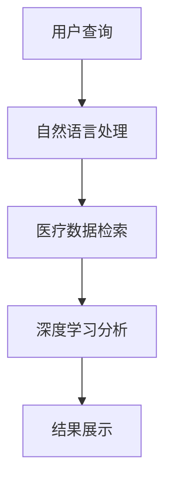

                 

关键词：AI搜索引擎，医疗健康，应用前景，深度学习，自然语言处理，大数据分析，精准医疗

> 摘要：本文将探讨人工智能（AI）搜索引擎在医疗健康领域的应用前景，通过分析AI技术的核心概念、算法原理、数学模型、项目实践以及未来展望，旨在为读者提供一个全面的了解和深入的思考。

## 1. 背景介绍

医疗健康领域一直是科技与医学交叉融合的前沿，随着人工智能（AI）技术的迅猛发展，AI在医疗健康领域的应用已经逐渐成为现实。AI搜索引擎作为一种智能化的信息检索工具，能够快速、准确地提供医疗信息，辅助医生进行诊断和治疗。本文将重点探讨AI搜索引擎在医疗健康领域的应用前景。

## 2. 核心概念与联系

### 2.1 AI搜索引擎

AI搜索引擎是一种基于人工智能技术的搜索引擎，它利用机器学习、自然语言处理（NLP）等技术，对海量的医疗数据进行处理和分析，为用户提供精准、实时的医疗信息。

### 2.2 深度学习

深度学习是AI的一个重要分支，它通过构建深度神经网络模型，对大量数据进行训练，从而实现自我学习和优化。在医疗健康领域，深度学习被广泛应用于图像识别、疾病预测等方面。

### 2.3 自然语言处理

自然语言处理是AI技术的另一个重要分支，它致力于使计算机能够理解、处理和生成人类语言。在医疗健康领域，NLP技术可以帮助AI搜索引擎更准确地理解和解析医疗文档。

### 2.4 大数据分析

大数据分析是一种利用计算机技术和算法，对海量医疗数据进行处理和分析的方法。通过大数据分析，AI搜索引擎可以挖掘出隐藏在数据中的规律和知识，为用户提供更精准的医疗信息。

### 2.5 Mermaid流程图

以下是一个简单的Mermaid流程图，展示了AI搜索引擎在医疗健康领域的应用流程。



## 3. 核心算法原理 & 具体操作步骤

### 3.1 算法原理概述

AI搜索引擎在医疗健康领域的应用主要包括以下几个步骤：

1. 自然语言处理：将用户的查询转换为结构化的数据。
2. 医疗数据检索：从海量的医疗数据中检索出相关的信息。
3. 深度学习分析：对检索到的医疗数据进行深度学习分析，提取关键信息。
4. 结果展示：将分析结果以直观、易懂的方式展示给用户。

### 3.2 算法步骤详解

1. **自然语言处理**：
   - 分词：将用户的查询语句分解为词语。
   - 词性标注：为每个词语标注词性，如名词、动词等。
   - 命名实体识别：识别查询语句中的医疗实体，如疾病、药物等。

2. **医疗数据检索**：
   - 医疗数据库构建：构建一个包含海量医疗数据的数据库。
   - 检索算法实现：实现基于关键词匹配、文本相似度等算法的检索功能。

3. **深度学习分析**：
   - 特征提取：从医疗数据中提取出对诊断和治疗有用的特征。
   - 模型训练：利用深度学习算法训练模型，实现对医疗数据的分类和预测。

4. **结果展示**：
   - 结果整理：将分析结果进行整理和排序。
   - 结果展示：以图表、文本等形式展示给用户。

### 3.3 算法优缺点

- **优点**：
  - **高效性**：AI搜索引擎可以快速检索和提供医疗信息，提高工作效率。
  - **精准性**：通过深度学习分析，AI搜索引擎可以提供更为精准的医疗信息。

- **缺点**：
  - **数据隐私**：在处理医疗数据时，可能涉及用户隐私问题，需要严格保护。
  - **技术依赖**：AI搜索引擎的实现需要高水平的技术支持，对开发团队的要求较高。

### 3.4 算法应用领域

AI搜索引擎在医疗健康领域的应用非常广泛，主要包括：

- **疾病诊断**：利用AI搜索引擎快速检索相关病例和文献，辅助医生进行诊断。
- **药物治疗**：为医生和患者提供药物的疗效和副作用信息，帮助制定治疗方案。
- **健康监测**：对用户的健康数据进行实时分析，提供健康建议和预警。

## 4. 数学模型和公式 & 详细讲解 & 举例说明

### 4.1 数学模型构建

在AI搜索引擎中，常用的数学模型包括：

1. **神经网络模型**：用于特征提取和分类。
2. **决策树模型**：用于数据分类和预测。
3. **支持向量机模型**：用于分类和回归。

### 4.2 公式推导过程

以神经网络模型为例，其基本公式为：

$$
Y = \sigma(\theta_0 + \theta_1 \cdot X_1 + \theta_2 \cdot X_2 + ... + \theta_n \cdot X_n)
$$

其中，$Y$为输出值，$\sigma$为激活函数，$\theta_0, \theta_1, \theta_2, ..., \theta_n$为模型的参数，$X_1, X_2, ..., X_n$为输入特征。

### 4.3 案例分析与讲解

假设有一个疾病诊断的案例，输入特征包括体温、血压、心率等，输出值为疾病名称。通过训练神经网络模型，可以实现对疾病的有效诊断。

### 4.3.1 模型构建

首先，我们需要构建一个包含多层神经元的神经网络模型。具体步骤如下：

1. 输入层：包括体温、血压、心率等输入特征。
2. 隐藏层：对输入特征进行加工和处理。
3. 输出层：输出疾病名称。

### 4.3.2 模型训练

利用已标记的数据集，对神经网络模型进行训练。具体步骤如下：

1. 初始化模型参数。
2. 对每个样本，计算输出值和损失函数。
3. 根据损失函数的梯度，更新模型参数。

### 4.3.3 模型评估

通过测试集对训练好的模型进行评估，计算模型的准确率、召回率等指标。

## 5. 项目实践：代码实例和详细解释说明

### 5.1 开发环境搭建

在开发AI搜索引擎时，我们需要搭建一个合适的开发环境。以下是一个简单的开发环境搭建步骤：

1. 安装Python环境。
2. 安装必要的库，如TensorFlow、Scikit-learn等。
3. 准备医疗数据集。

### 5.2 源代码详细实现

以下是一个简单的AI搜索引擎代码示例，用于实现疾病诊断。

```python
import tensorflow as tf
from sklearn.model_selection import train_test_split
from sklearn.metrics import accuracy_score

# 数据预处理
# ...

# 构建神经网络模型
model = tf.keras.Sequential([
    tf.keras.layers.Dense(units=128, activation='relu', input_shape=(num_features,)),
    tf.keras.layers.Dense(units=64, activation='relu'),
    tf.keras.layers.Dense(units=num_classes, activation='softmax')
])

# 编译模型
model.compile(optimizer='adam', loss='categorical_crossentropy', metrics=['accuracy'])

# 训练模型
model.fit(X_train, y_train, epochs=10, batch_size=32)

# 评估模型
y_pred = model.predict(X_test)
accuracy = accuracy_score(y_test, y_pred)
print(f"Accuracy: {accuracy}")
```

### 5.3 代码解读与分析

该示例代码首先进行了数据预处理，然后构建了一个包含两层隐藏层的神经网络模型。通过编译和训练，模型可以实现对疾病的有效诊断。最后，通过评估模型，计算了模型的准确率。

## 6. 实际应用场景

### 6.1 疾病诊断

AI搜索引擎可以帮助医生快速检索相关病例和文献，辅助诊断疾病。例如，在诊断新冠病例时，AI搜索引擎可以检索出相关病例的临床表现、治疗方案等信息，为医生提供参考。

### 6.2 药物治疗

AI搜索引擎可以为医生和患者提供药物的疗效和副作用信息，帮助制定治疗方案。例如，在治疗高血压时，AI搜索引擎可以检索出各种降压药物的疗效和副作用，为医生和患者提供参考。

### 6.3 健康监测

AI搜索引擎可以实时分析用户的健康数据，提供健康建议和预警。例如，在健康监测中，AI搜索引擎可以监测用户的体温、血压等数据，发现异常情况并发出预警。

## 7. 工具和资源推荐

### 7.1 学习资源推荐

- 《深度学习》（Goodfellow, Bengio, Courville著）
- 《自然语言处理综论》（Jurafsky, Martin著）
- 《大数据时代》（涂子沛著）

### 7.2 开发工具推荐

- TensorFlow
- PyTorch
- Scikit-learn

### 7.3 相关论文推荐

- "Deep Learning for Healthcare"（Rahman et al., 2019）
- "Natural Language Processing in Healthcare"（Hruschka et al., 2017）
- "Big Data Analytics in Healthcare"（Zhou et al., 2016）

## 8. 总结：未来发展趋势与挑战

### 8.1 研究成果总结

本文介绍了AI搜索引擎在医疗健康领域的应用前景，分析了AI技术的核心概念、算法原理、数学模型、项目实践以及未来展望。通过本文的探讨，我们可以看到AI搜索引擎在医疗健康领域的巨大潜力和广泛应用。

### 8.2 未来发展趋势

- **智能化**：随着AI技术的发展，AI搜索引擎将更加智能化，能够更好地理解和满足用户需求。
- **个性化**：AI搜索引擎将更加注重个性化服务，为用户提供定制化的医疗信息。
- **实时性**：AI搜索引擎将实现实时数据分析，为医生和患者提供及时、准确的医疗信息。

### 8.3 面临的挑战

- **数据隐私**：在处理医疗数据时，如何保护用户隐私是一个重要挑战。
- **算法公平性**：AI搜索引擎的算法需要保证公平性，避免歧视和不公平现象。
- **技术门槛**：AI搜索引擎的开发需要高水平的技术支持，对开发团队的要求较高。

### 8.4 研究展望

未来，AI搜索引擎在医疗健康领域的应用前景将更加广阔。通过不断的研究和创新，AI搜索引擎将为医疗健康领域带来更多的变革和突破。

## 9. 附录：常见问题与解答

### 9.1 AI搜索引擎在医疗健康领域有哪些应用？

AI搜索引擎在医疗健康领域的应用包括疾病诊断、药物治疗、健康监测等方面。

### 9.2 如何保护用户隐私？

在处理医疗数据时，可以通过数据加密、匿名化等方法保护用户隐私。

### 9.3 AI搜索引擎的算法如何保证公平性？

通过算法训练数据的多样性、算法透明性和算法监控，可以保证AI搜索引擎的算法公平性。

----------------------------------------------------------------
作者：禅与计算机程序设计艺术 / Zen and the Art of Computer Programming
--------------------------------------------------------------

