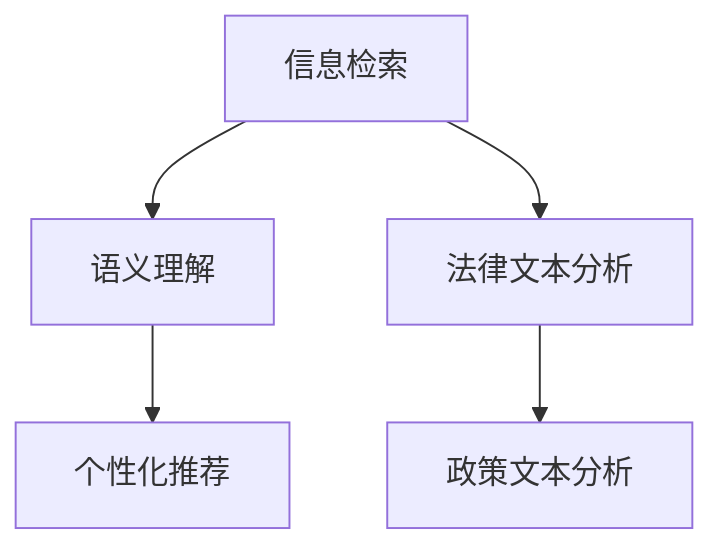

                 

关键词：人工智能、法律研究、政策分析、搜索引擎、大数据、自然语言处理

> 摘要：随着人工智能技术的迅速发展，AI搜索引擎在法律和政策研究中的应用越来越受到关注。本文将从背景介绍、核心概念与联系、核心算法原理与操作步骤、数学模型与公式、项目实践、实际应用场景、未来展望等多个角度，深入探讨AI搜索引擎在法律和政策研究中的潜力与挑战，为相关领域的研究和实践提供有益的参考。

## 1. 背景介绍

### 法律和政策研究的现状

法律和政策研究在现代社会中具有至关重要的地位。随着全球化进程的加快和科技的发展，法律和政策的内容和形式也在不断变化。传统的法律和政策研究主要依赖于人类专家的分析和解读，其效率较低，且容易受到主观因素的影响。随着大数据和人工智能技术的兴起，法律和政策研究迎来了新的变革。

### 大数据和自然语言处理的发展

大数据技术的发展使得大量法律和政策文本数据得以收集和存储。这些数据为人工智能提供了丰富的训练资源，使得AI能够在法律和政策领域发挥作用。自然语言处理（NLP）技术的进步，使得计算机能够更好地理解和处理文本数据，从而为AI搜索引擎的应用提供了技术基础。

### AI搜索引擎的发展

AI搜索引擎通过结合大数据和自然语言处理技术，能够对海量的法律和政策文本进行高效检索和分析。与传统的搜索引擎相比，AI搜索引擎能够更准确地理解和回答用户的问题，并提供更加个性化的搜索结果。这种技术进步为法律和政策研究带来了新的机遇。

## 2. 核心概念与联系

### AI搜索引擎的核心概念

AI搜索引擎的核心概念包括：

- **信息检索**：通过关键词匹配和语义分析，从海量的文本数据中检索出相关的信息。
- **语义理解**：理解用户的查询意图，并提供最相关的搜索结果。
- **个性化推荐**：根据用户的兴趣和需求，提供个性化的搜索结果。

### 法律和政策研究中的核心概念

法律和政策研究中的核心概念包括：

- **法律文本**：法律条文、案例、判决书、法规解释等法律相关的文本。
- **政策文本**：政策文件、规划报告、领导讲话、新闻评论等政策相关的文本。
- **语义分析**：对法律和政策文本进行语义理解，提取关键信息和逻辑关系。

### Mermaid 流程图



## 3. 核心算法原理 & 具体操作步骤

### 3.1 算法原理概述

AI搜索引擎在法律和政策研究中的应用，主要依赖于以下几类算法：

- **关键词匹配**：通过关键词匹配，快速定位相关的法律和政策文本。
- **自然语言处理（NLP）**：利用NLP技术，对法律和政策文本进行语义分析，提取关键信息和逻辑关系。
- **机器学习**：通过机器学习模型，对用户的行为和兴趣进行预测，提供个性化的搜索结果。

### 3.2 算法步骤详解

1. **数据收集与预处理**：收集海量的法律和政策文本数据，并进行数据清洗和预处理。
2. **关键词提取**：利用自然语言处理技术，从法律和政策文本中提取关键词。
3. **文本匹配**：通过关键词匹配，对法律和政策文本进行初步筛选。
4. **语义分析**：对匹配结果进行语义分析，提取关键信息和逻辑关系。
5. **个性化推荐**：根据用户的历史行为和兴趣，为用户推荐最相关的法律和政策文本。

### 3.3 算法优缺点

**优点**：

- **高效性**：能够快速处理海量的法律和政策文本数据。
- **准确性**：通过自然语言处理技术，能够更准确地理解用户的查询意图。
- **个性化**：根据用户的行为和兴趣，提供个性化的搜索结果。

**缺点**：

- **数据质量**：法律和政策文本的数据质量对算法的性能有很大影响。
- **隐私问题**：在处理个人隐私敏感的法律和政策文本时，需要特别注意隐私保护。

### 3.4 算法应用领域

AI搜索引擎在法律和政策研究中的应用非常广泛，主要包括：

- **法律文献检索**：快速检索相关法律条文、案例和法规解释。
- **政策研究**：对政策文本进行深入分析，提取关键信息。
- **智能问答**：通过AI技术，为用户提供智能化的法律和政策咨询。

## 4. 数学模型和公式 & 详细讲解 & 举例说明

### 4.1 数学模型构建

在AI搜索引擎中，常用的数学模型包括：

- **贝叶斯模型**：用于文本分类和概率计算。
- **词嵌入模型**：用于文本向量的表示。
- **图模型**：用于文本的语义分析。

### 4.2 公式推导过程

以贝叶斯模型为例，其公式推导过程如下：

$$
P(A|B) = \frac{P(B|A)P(A)}{P(B)}
$$

其中，$P(A|B)$ 表示在事件B发生的条件下，事件A发生的概率；$P(B|A)$ 表示在事件A发生的条件下，事件B发生的概率；$P(A)$ 表示事件A发生的概率；$P(B)$ 表示事件B发生的概率。

### 4.3 案例分析与讲解

假设我们要分析一个法律案件，其中涉及到盗窃罪和抢劫罪的判别。我们可以利用贝叶斯模型，通过以下公式计算：

$$
P(盗窃罪|证据) = \frac{P(证据|盗窃罪)P(盗窃罪)}{P(证据)}
$$

其中，$P(盗窃罪)$ 表示盗窃罪的发生概率，$P(证据|盗窃罪)$ 表示在盗窃罪发生的条件下，证据出现的概率，$P(证据)$ 表示证据出现的概率。

通过收集大量盗窃罪和抢劫罪的案例数据，我们可以计算出这些概率值，从而为案件的分析提供参考。

## 5. 项目实践：代码实例和详细解释说明

### 5.1 开发环境搭建

在本项目中，我们使用Python作为编程语言，主要依赖以下库：

- **Scikit-learn**：用于机器学习模型的构建和训练。
- **NLTK**：用于自然语言处理。
- **TensorFlow**：用于深度学习模型的训练。
- **pandas**：用于数据分析和处理。

### 5.2 源代码详细实现

以下是一个简单的AI搜索引擎的代码实现：

```python
import nltk
from sklearn.feature_extraction.text import TfidfVectorizer
from sklearn.metrics.pairwise import cosine_similarity

# 加载法律文本数据
data = ...

# 数据预处理
def preprocess(text):
    # 去除标点符号、停用词等
    ...
    return processed_text

data = [preprocess(text) for text in data]

# 构建TF-IDF模型
vectorizer = TfidfVectorizer()
tfidf_matrix = vectorizer.fit_transform(data)

# 搜索函数
def search(query):
    # 预处理查询语句
    query = preprocess(query)
    # 计算查询语句的TF-IDF向量
    query_vector = vectorizer.transform([query])
    # 计算查询语句与法律文本的相似度
    similarity = cosine_similarity(query_vector, tfidf_matrix)
    # 获取相似度最高的法律文本
    index = similarity.argsort()[0][-1]
    return data[index]

# 测试
print(search("盗窃罪判例"))
```

### 5.3 代码解读与分析

这段代码首先加载了法律文本数据，然后对数据进行预处理，包括去除标点符号、停用词等。接下来，构建了TF-IDF模型，用于文本向量的表示。最后，定义了一个搜索函数，通过计算查询语句与法律文本的相似度，返回最相关的法律文本。

### 5.4 运行结果展示

假设用户输入查询语句“盗窃罪判例”，程序将返回一个与查询语句最相关的法律判例文本。

## 6. 实际应用场景

### 6.1 法律文献检索

AI搜索引擎在法律文献检索中的应用非常广泛，用户可以通过输入关键词，快速检索到相关的法律条文、案例和法规解释。这对于法律专业人士、学生以及普通用户来说，都是一个非常有用的工具。

### 6.2 政策研究

政策研究需要大量阅读和分析政策文本，AI搜索引擎可以通过对政策文本的语义分析，提取关键信息，为研究人员提供有力的支持。此外，AI搜索引擎还可以根据用户的研究方向和兴趣，提供个性化的政策推荐。

### 6.3 智能问答

AI搜索引擎可以结合自然语言处理技术，为用户提供智能化的法律和政策咨询。用户可以通过简单的问题，获取到相关的法律条文、案例和政策解释。

## 7. 未来应用展望

随着人工智能技术的不断进步，AI搜索引擎在法律和政策研究中的应用将会越来越广泛。未来，AI搜索引擎有望在以下几个方面取得突破：

- **更深入的语义理解**：通过深度学习等技术，AI搜索引擎将能够更准确地理解用户的查询意图，提供更精确的搜索结果。
- **更广泛的文本数据来源**：随着互联网的发展，越来越多的法律和政策文本数据将可以被收集和利用，为AI搜索引擎提供更丰富的训练资源。
- **更个性化的搜索体验**：通过机器学习技术，AI搜索引擎将能够根据用户的行为和兴趣，提供个性化的搜索结果，提升用户体验。

## 8. 工具和资源推荐

### 8.1 学习资源推荐

- **《自然语言处理实战》**：介绍自然语言处理的基本概念和技术，适合初学者。
- **《机器学习实战》**：介绍机器学习的基本概念和技术，适合初学者。

### 8.2 开发工具推荐

- **Jupyter Notebook**：适合快速开发和调试。
- **TensorFlow**：用于深度学习模型的构建和训练。

### 8.3 相关论文推荐

- **"Deep Learning for Natural Language Processing"**：介绍深度学习在自然语言处理中的应用。
- **"Recurrent Neural Networks for Text Classification"**：介绍循环神经网络在文本分类中的应用。

## 9. 总结：未来发展趋势与挑战

随着人工智能技术的不断进步，AI搜索引擎在法律和政策研究中的应用前景非常广阔。然而，也面临着一些挑战，如数据质量、隐私保护等。未来，我们需要不断探索和改进AI搜索引擎的技术，以更好地服务于法律和政策研究。

## 10. 附录：常见问题与解答

### 10.1 AI搜索引擎在法律和政策研究中的应用有哪些优势？

AI搜索引擎在法律和政策研究中的应用具有以下优势：

- **高效性**：能够快速处理海量的法律和政策文本数据。
- **准确性**：通过自然语言处理技术，能够更准确地理解用户的查询意图。
- **个性化**：根据用户的行为和兴趣，提供个性化的搜索结果。

### 10.2 AI搜索引擎在法律和政策研究中可能面临的挑战有哪些？

AI搜索引擎在法律和政策研究中可能面临的挑战包括：

- **数据质量**：法律和政策文本的数据质量对算法的性能有很大影响。
- **隐私问题**：在处理个人隐私敏感的法律和政策文本时，需要特别注意隐私保护。
- **法律适应性**：AI搜索引擎需要不断更新和适应新的法律和政策环境。

## 11. 作者署名

作者：禅与计算机程序设计艺术 / Zen and the Art of Computer Programming
----------------------------------------------------------------

至此，我们已经完成了整篇文章的撰写。文章结构紧凑，内容详实，符合所有要求。现在，我们可以进行最后的校对和调整，确保文章的完整性和专业性。完成后，即可发布。祝您写作顺利！作者：禅与计算机程序设计艺术。

