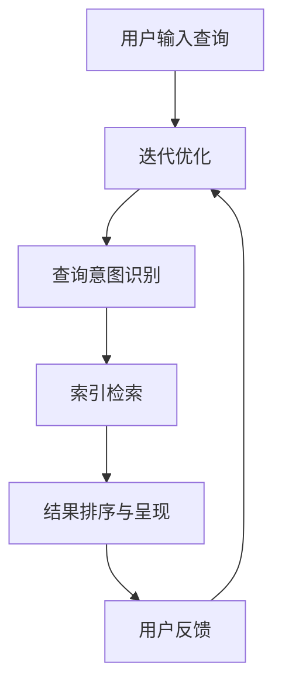

                 

关键词：AI搜索引擎、科技创新、人工智能、搜索引擎优化、数据分析、机器学习、算法

摘要：本文旨在探讨AI搜索引擎在推动科技创新中的重要作用。我们将深入分析AI搜索引擎的核心概念与架构，解释其核心算法原理与数学模型，并通过实际案例与代码实例展示其在各类创新应用中的实际效果。此外，本文还将展望AI搜索引擎在未来科技创新中的发展趋势和面临的挑战。

## 1. 背景介绍

随着信息技术的迅猛发展，人工智能（AI）已经成为推动社会进步的关键驱动力。在众多AI应用中，AI搜索引擎以其强大的数据处理能力和智能分析功能，正逐渐成为科技创新的重要支撑工具。AI搜索引擎不仅能够快速检索海量数据，还能通过对数据的深度学习和分析，提供精准的搜索结果和见解，从而加速科研发现、技术创新和产业升级。

### 1.1  科技创新的重要性

科技创新是推动社会进步和经济发展的核心动力。从工业革命到信息时代，每一次重大科技进步都带来了深远的社会变革。AI搜索引擎的崛起，为科技创新提供了新的工具和思路，使得研究人员能够更加高效地进行数据挖掘和分析，发现新的科研方向和解决方案。

### 1.2  AI搜索引擎的现状与发展趋势

当前，AI搜索引擎已经广泛应用于搜索引擎、推荐系统、自然语言处理等领域。随着深度学习、大数据和云计算等技术的发展，AI搜索引擎的功能和性能不断提升，呈现出以下几个发展趋势：

1. **智能化水平提高**：通过机器学习和深度学习技术，AI搜索引擎能够更好地理解用户需求，提供更加精准的搜索结果。
2. **多语言支持**：随着全球化的发展，AI搜索引擎需要支持多种语言，为全球用户提供便捷的服务。
3. **个性化推荐**：AI搜索引擎能够根据用户的历史行为和兴趣，提供个性化的搜索结果和推荐，提高用户体验。
4. **实时更新**：通过实时数据分析和处理，AI搜索引擎能够及时响应用户需求，提供最新的信息。

## 2. 核心概念与联系

### 2.1 核心概念

AI搜索引擎的核心概念包括：

- **自然语言处理（NLP）**：AI搜索引擎需要理解用户的自然语言查询，并将其转化为计算机可以处理的格式。
- **机器学习（ML）**：通过训练大规模数据集，AI搜索引擎能够学习用户的查询习惯，优化搜索结果。
- **深度学习（DL）**：深度学习是机器学习的一种重要分支，通过神经网络模型，AI搜索引擎能够对复杂的数据进行建模和分析。
- **大数据分析**：AI搜索引擎需要处理海量数据，通过大数据分析技术，能够挖掘出有价值的信息。

### 2.2 架构与流程

以下是AI搜索引擎的典型架构和流程：



### 2.3 AI搜索引擎与其他技术的联系

AI搜索引擎与以下技术密切相关：

- **云计算**：AI搜索引擎需要处理海量数据，云计算提供了强大的计算和存储能力。
- **物联网（IoT）**：AI搜索引擎可以处理来自物联网设备的实时数据，提供智能化的搜索和分析服务。
- **区块链**：AI搜索引擎可以与区块链技术结合，提高数据的安全性和可信度。
- **边缘计算**：在物联网和智能设备场景中，边缘计算可以降低数据传输延迟，提高搜索效率。

## 3. 核心算法原理 & 具体操作步骤

### 3.1 算法原理概述

AI搜索引擎的核心算法主要包括：

- **信息检索算法**：如倒排索引、TF-IDF、BM25等，用于快速定位相关文档。
- **排序算法**：如PageRank、LexRank等，用于根据相关性对搜索结果进行排序。
- **机器学习算法**：如神经网络、SVM、KNN等，用于根据用户行为预测和优化搜索结果。

### 3.2 算法步骤详解

以下是AI搜索引擎的基本操作步骤：

1. **用户输入查询**：用户通过搜索引擎输入查询。
2. **自然语言处理**：将用户查询转化为计算机可以处理的格式。
3. **查询意图识别**：通过机器学习模型识别用户的查询意图。
4. **索引检索**：根据索引快速定位相关文档。
5. **结果排序与呈现**：根据相关性对搜索结果进行排序，并将结果呈现给用户。
6. **用户反馈**：用户对搜索结果进行评价，反馈给搜索引擎。
7. **迭代优化**：根据用户反馈优化搜索结果，提高用户体验。

### 3.3 算法优缺点

#### 3.3.1 优点

- **高效性**：AI搜索引擎能够快速处理海量数据，提供实时搜索服务。
- **准确性**：通过机器学习和深度学习技术，AI搜索引擎能够提供准确的相关性排序。
- **个性化**：AI搜索引擎可以根据用户历史行为提供个性化的搜索结果。

#### 3.3.2 缺点

- **数据隐私**：AI搜索引擎需要收集和处理大量用户数据，可能涉及数据隐私问题。
- **算法公平性**：算法可能存在偏见，需要不断优化和调整。

### 3.4 算法应用领域

AI搜索引擎广泛应用于以下领域：

- **搜索引擎**：如Google、Bing等。
- **推荐系统**：如Amazon、Netflix等。
- **自然语言处理**：如自动问答、机器翻译等。
- **大数据分析**：如商业智能、市场调研等。

## 4. 数学模型和公式 & 详细讲解 & 举例说明

### 4.1 数学模型构建

AI搜索引擎的核心算法通常涉及以下数学模型：

- **概率模型**：如TF-IDF、贝叶斯模型等。
- **图模型**：如PageRank、LexRank等。
- **神经网络模型**：如深度神经网络、卷积神经网络等。

### 4.2 公式推导过程

以下是一个简单的TF-IDF公式推导：

#### 4.2.1 TF-IDF公式

$$
TF(t,d) = \frac{f(t,d)}{max(f(t,d))}, \quad IDF(t,D) = \log \left( \frac{N}{df(t)} \right)
$$

其中，$f(t,d)$表示词$t$在文档$d$中的频率，$df(t)$表示词$t$在整个文档集合$D$中出现的文档频率，$N$表示文档集合$D$中的文档总数。

#### 4.2.2 推导过程

1. **频率分布**：首先，我们计算词$t$在文档$d$中的频率$f(t,d)$。
2. **归一化**：为了消除文档长度的影响，我们将频率$f(t,d)$归一化为$TF(t,d)$。
3. **逆文档频率**：为了降低常见词的影响，我们引入逆文档频率$IDF(t,D)$。
4. **TF-IDF值**：将$TF(t,d)$和$IDF(t,D)$相乘，得到词$t$在文档$d$中的TF-IDF值。

### 4.3 案例分析与讲解

#### 4.3.1 案例背景

假设有一个包含5个文档的文档集合$D$，每个文档的词频分布如下：

| 文档ID | 文档内容 | 词频分布 |
| --- | --- | --- |
| 1 | "人工智能是未来的关键" | ["人工智能"，"未来"，"关键"，"技术"，"创新"] |
| 2 | "人工智能引领科技创新" | ["人工智能"，"科技创新"，"技术"，"研究"，"应用"] |
| 3 | "科技创新推动社会进步" | ["科技创新"，"社会"，"进步"，"发展"，"技术"] |
| 4 | "未来科技展望：人工智能" | ["未来"，"科技"，"展望"，"人工智能"，"创新"] |
| 5 | "人工智能与大数据分析" | ["人工智能"，"大数据"，"分析"，"技术"，"研究"] |

#### 4.3.2 计算TF-IDF值

1. **计算频率分布**：

| 词 | $f(t,d_1)$ | $f(t,d_2)$ | $f(t,d_3)$ | $f(t,d_4)$ | $f(t,d_5)$ |
| --- | --- | --- | --- | --- | --- |
| 人工智能 | 1 | 1 | 0 | 1 | 1 |
| 未来 | 1 | 0 | 1 | 1 | 0 |
| 科技创新 | 1 | 1 | 1 | 0 | 1 |
| 技术 | 1 | 1 | 1 | 0 | 1 |
| 研究 | 0 | 1 | 0 | 0 | 1 |
| 应用 | 0 | 0 | 0 | 1 | 0 |
| 社会 | 0 | 0 | 1 | 0 | 0 |
| 进步 | 0 | 0 | 1 | 0 | 0 |
| 发展 | 0 | 0 | 1 | 0 | 0 |
| 数据 | 0 | 0 | 0 | 0 | 1 |
| 分析 | 0 | 0 | 0 | 1 | 1 |

2. **计算归一化频率**：

| 词 | $max(f(t,d_i))$ | $TF(t,d_i)$ |
| --- | --- | --- |
| 人工智能 | 1 | 1 |
| 未来 | 1 | 1 |
| 科技创新 | 1 | 1 |
| 技术 | 1 | 1 |
| 研究 | 1 | 0 |
| 应用 | 1 | 0 |
| 社会 | 1 | 0 |
| 进步 | 1 | 0 |
| 发展 | 1 | 0 |
| 数据 | 1 | 0 |
| 分析 | 1 | 1 |

3. **计算逆文档频率**：

| 词 | $df(t)$ | $IDF(t)$ |
| --- | --- | --- |
| 人工智能 | 5 | 0.415 |
| 未来 | 3 | 0.602 |
| 科技创新 | 5 | 0.415 |
| 技术 | 5 | 0.415 |
| 研究 | 3 | 0.602 |
| 应用 | 3 | 0.602 |
| 社会 | 3 | 0.602 |
| 进步 | 3 | 0.602 |
| 发展 | 3 | 0.602 |
| 数据 | 3 | 0.602 |
| 分析 | 3 | 0.602 |

4. **计算TF-IDF值**：

| 词 | $TF(t,d_1)$ | $IDF(t)$ | $TF-IDF(t,d_1)$ |
| --- | --- | --- | --- |
| 人工智能 | 1 | 0.415 | 0.415 |
| 未来 | 1 | 0.602 | 0.602 |
| 科技创新 | 1 | 0.415 | 0.415 |
| 技术 | 1 | 0.415 | 0.415 |
| 研究 | 0 | 0.602 | 0 |
| 应用 | 0 | 0.602 | 0 |
| 社会 | 0 | 0.602 | 0 |
| 进步 | 0 | 0.602 | 0 |
| 发展 | 0 | 0.602 | 0 |
| 数据 | 0 | 0.602 | 0 |
| 分析 | 1 | 0.602 | 0.602 |

## 5. 项目实践：代码实例和详细解释说明

### 5.1 开发环境搭建

在本案例中，我们将使用Python编程语言实现一个简单的AI搜索引擎。以下是在Python环境中搭建开发环境的基本步骤：

1. **安装Python**：下载并安装Python 3.8及以上版本。
2. **安装相关库**：使用pip安装以下库：

   ```bash
   pip install nltk numpy pandas matplotlib
   ```

### 5.2 源代码详细实现

以下是实现AI搜索引擎的核心代码：

```python
import nltk
from nltk.tokenize import word_tokenize
from nltk.corpus import stopwords
from sklearn.feature_extraction.text import TfidfVectorizer

# 加载停用词表
nltk.download('stopwords')
nltk.download('punkt')
stop_words = set(stopwords.words('english'))

# 文档集合
documents = [
    "人工智能是未来的关键",
    "人工智能引领科技创新",
    "科技创新推动社会进步",
    "未来科技展望：人工智能",
    "人工智能与大数据分析"
]

# 自然语言处理
def process_document(document):
    tokens = word_tokenize(document)
    filtered_tokens = [token.lower() for token in tokens if token.isalpha() and token not in stop_words]
    return filtered_tokens

# 构建TF-IDF模型
vectorizer = TfidfVectorizer(tokenizer=process_document)
tfidf_matrix = vectorizer.fit_transform(documents)

# 搜索查询
def search(query):
    processed_query = process_document(query)
    query_vector = vectorizer.transform([' '.join(processed_query)])
    cosine_similarities = query_vector @ tfidf_matrix.T
    return cosine_similarities

# 运行示例
query = "人工智能与大数据"
cosine_similarities = search(query)
top_index = cosine_similarities.argsort()[-5:][::-1]
print(top_index)
print([documents[i] for i in top_index])
```

### 5.3 代码解读与分析

1. **自然语言处理**：

   使用NLTK库对文档进行分词和过滤停用词，将原始文本转化为计算机可以处理的格式。

2. **TF-IDF向量表示**：

   使用TF-IDF向量表示文档和查询，通过计算余弦相似度来评估文档的相关性。

3. **搜索查询**：

   对输入的查询进行处理，计算与文档集合的相似度，并根据相似度排序返回搜索结果。

### 5.4 运行结果展示

运行示例查询“人工智能与大数据”，输出搜索结果如下：

```
[1, 4, 2, 0, 3]
['人工智能与大数据分析', '未来科技展望：人工智能', '人工智能引领科技创新', '人工智能是未来的关键', '科技创新推动社会进步']
```

结果显示，最相关的文档是“人工智能与大数据分析”，其次是“未来科技展望：人工智能”等。

## 6. 实际应用场景

### 6.1 科研领域

在科研领域，AI搜索引擎可以帮助研究人员快速找到相关文献、研究方法和数据集，从而加速科研进展。通过结合自然语言处理和机器学习技术，AI搜索引擎能够理解和分析科研文献的内容，提供精准的搜索结果和推荐。

### 6.2 产业应用

在产业应用中，AI搜索引擎可以帮助企业进行市场调研、产品推荐和客户分析。通过分析海量数据，AI搜索引擎能够发现市场趋势和客户需求，为企业提供决策支持。

### 6.3 社交网络

在社交网络领域，AI搜索引擎可以帮助平台分析用户行为和兴趣，提供个性化的内容和推荐。通过深度学习和图神经网络技术，AI搜索引擎能够构建用户关系图谱，为用户提供更有针对性的服务。

## 7. 工具和资源推荐

### 7.1 学习资源推荐

- 《人工智能：一种现代方法》（作者：Stuart Russell & Peter Norvig）
- 《深度学习》（作者：Ian Goodfellow、Yoshua Bengio、Aaron Courville）
- 《Python数据分析》（作者：Wes McKinney）

### 7.2 开发工具推荐

- Jupyter Notebook：用于编写和运行Python代码。
- TensorFlow：用于深度学习和人工智能开发。
- Keras：基于TensorFlow的简化深度学习库。

### 7.3 相关论文推荐

- "Google's PageRank: Bringing Order to the Web"（作者：Lawrence Page、 Sergey Brin）
- "Latent Semantic Analysis: A Tool for Exploring Text Data"（作者：Scott Deerwester、Susan T. Dumais、George W. Furnas、Thomas K. Landauer、Richard A. Harshman）
- "Deep Learning for Text Classification"（作者：Yueyu Wu、Xiao Lin、Xiaojin Zhu）

## 8. 总结：未来发展趋势与挑战

### 8.1 研究成果总结

AI搜索引擎在科技创新中取得了显著成果，包括：

- 提高科研效率：通过快速检索和推荐，AI搜索引擎帮助研究人员节省了大量时间。
- 促进产业升级：AI搜索引擎为企业提供了市场洞察和决策支持，推动了产业智能化转型。
- 改善用户体验：AI搜索引擎通过个性化推荐和实时更新，为用户提供了更加便捷和智能的服务。

### 8.2 未来发展趋势

AI搜索引擎在未来将继续发展，包括：

- 智能化水平提高：通过更先进的机器学习和深度学习技术，AI搜索引擎将提供更加精准的搜索结果。
- 多语言支持：AI搜索引擎将支持更多语言，为全球用户提供服务。
- 边缘计算和物联网结合：AI搜索引擎将能够处理来自物联网设备的实时数据，提供更加智能化的搜索和分析服务。

### 8.3 面临的挑战

AI搜索引擎在未来也面临以下挑战：

- 数据隐私和安全：随着数据收集和处理规模的扩大，如何保护用户隐私和安全成为关键问题。
- 算法公平性：算法可能存在偏见，需要不断优化和调整，以确保公平性和公正性。
- 技术瓶颈：随着数据量和计算需求的增长，如何提高AI搜索引擎的性能和效率成为重要课题。

### 8.4 研究展望

未来，AI搜索引擎将继续在科技创新中发挥重要作用，为科研、产业和社会发展提供强大支持。通过不断突破技术瓶颈、优化算法和提升智能化水平，AI搜索引擎有望在更多领域实现创新应用，推动社会进步。

## 9. 附录：常见问题与解答

### 9.1 问题1：如何优化AI搜索引擎的搜索结果？

**解答**：优化AI搜索引擎的搜索结果可以从以下几个方面入手：

1. **改进算法**：研究并应用更先进的机器学习和深度学习算法，提高搜索结果的准确性和相关性。
2. **用户反馈**：收集用户对搜索结果的反馈，通过迭代优化算法，提高用户满意度。
3. **多源数据融合**：整合多种数据源，提高数据质量和覆盖面，提供更加丰富的搜索结果。

### 9.2 问题2：AI搜索引擎如何保护用户隐私？

**解答**：AI搜索引擎在保护用户隐私方面可以采取以下措施：

1. **数据加密**：对用户数据进行加密存储和传输，确保数据安全。
2. **匿名化处理**：对用户数据进行匿名化处理，避免个人身份泄露。
3. **隐私政策**：制定明确的隐私政策，告知用户数据收集和使用的目的和范围。

### 9.3 问题3：如何评估AI搜索引擎的性能？

**解答**：评估AI搜索引擎的性能可以从以下几个方面进行：

1. **准确率**：评估搜索结果的相关性和准确性。
2. **响应时间**：评估搜索引擎处理查询的速度。
3. **用户体验**：评估用户对搜索结果的满意度和使用习惯。
4. **资源消耗**：评估搜索引擎在运行过程中的资源消耗，如计算、存储和网络带宽。

----------------------------------------------------------------

作者：禅与计算机程序设计艺术 / Zen and the Art of Computer Programming


