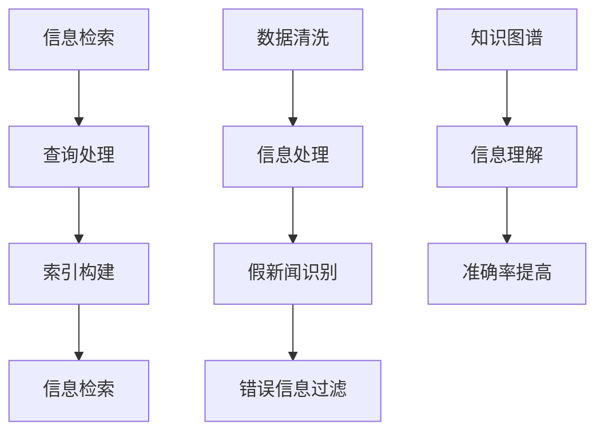

                 

关键词：AI搜索引擎、假新闻、错误信息、算法、数据处理、信息验证、用户信任、技术挑战

摘要：随着互联网的迅猛发展，假新闻和错误信息已成为一个日益严峻的社会问题。AI搜索引擎作为信息检索和分发的重要工具，面临着如何有效识别和应对这些问题的巨大挑战。本文将深入探讨AI搜索引擎如何通过算法优化、数据清洗、知识图谱等技术手段，提高对假新闻和错误信息的识别与过滤能力，并展望其未来的发展方向。

## 1. 背景介绍

在当今信息爆炸的时代，互联网已经成为了获取信息的主要途径。然而，随着信息量的指数级增长，假新闻和错误信息的传播速度也在不断加快。这些虚假信息不仅误导了广大网民，甚至可能对社会稳定和公共安全造成严重影响。AI搜索引擎作为信息检索的重要工具，其准确性和可靠性直接关系到用户对信息源的信任程度。因此，如何有效地识别和过滤假新闻和错误信息，已成为AI搜索引擎亟待解决的重要问题。

## 2. 核心概念与联系

### 2.1 信息检索

信息检索是指通过计算机程序检索数据库中的信息，以帮助用户找到所需的信息。其核心任务是提高检索的准确性和效率。AI搜索引擎的信息检索过程主要包括三个步骤：查询处理、索引构建和信息检索。

### 2.2 数据清洗

数据清洗是指对原始数据进行处理，消除错误、异常和重复信息，以提高数据质量。在处理假新闻和错误信息时，数据清洗至关重要，因为它能够帮助AI搜索引擎识别出潜在的虚假信息。

### 2.3 知识图谱

知识图谱是一种语义网络，通过实体和关系来表示现实世界中的知识。在识别和过滤假新闻和错误信息时，知识图谱可以帮助AI搜索引擎更好地理解信息内容，从而提高识别准确率。

## 2.4 Mermaid 流程图



## 3. 核心算法原理 & 具体操作步骤

### 3.1 算法原理概述

AI搜索引擎在识别和过滤假新闻和错误信息时，主要依赖于以下几种算法：

1. 自然语言处理（NLP）算法：用于分析和理解文本内容，识别潜在的虚假信息。
2. 机器学习算法：通过大量训练数据，学习如何识别和分类假新闻和错误信息。
3. 数据可视化算法：用于展示信息来源、传播路径等信息，帮助用户更好地理解信息真实性和可靠性。

### 3.2 算法步骤详解

#### 3.2.1 查询处理

查询处理是信息检索的第一步，主要任务是理解用户的查询意图，并将其转换为可操作的查询请求。在这一过程中，AI搜索引擎会使用NLP算法对查询语句进行分词、词性标注、句法分析等处理，以提取出关键信息。

#### 3.2.2 索引构建

索引构建是指将互联网上的信息构建成一个索引数据库，以便快速检索。在这一过程中，AI搜索引擎会使用数据清洗算法，去除重复、错误和无关信息，同时利用机器学习算法对信息进行分类和标签化。

#### 3.2.3 信息检索

信息检索是AI搜索引擎的核心功能，通过分析用户的查询请求，从索引数据库中查找相关结果。在这一过程中，AI搜索引擎会使用数据可视化算法，将检索结果以直观的方式呈现给用户，帮助用户快速判断信息的真实性和可靠性。

### 3.3 算法优缺点

#### 3.3.1 优点

1. 提高信息检索的准确性和效率。
2. 有助于提高用户对信息源的信任度。
3. 可以识别和过滤大量的假新闻和错误信息。

#### 3.3.2 缺点

1. 对算法的准确性和效率要求较高。
2. 需要大量的训练数据和计算资源。

### 3.4 算法应用领域

AI搜索引擎在识别和过滤假新闻和错误信息方面的算法，可以应用于多个领域，如：

1. 社交媒体监控：帮助用户识别和过滤虚假信息，维护网络环境的健康。
2. 新闻行业：提高新闻的准确性和可信度，减少虚假信息的传播。
3. 金融行业：识别和防范金融欺诈行为，保障用户资金安全。

## 4. 数学模型和公式 & 详细讲解 & 举例说明

### 4.1 数学模型构建

在识别假新闻和错误信息的过程中，AI搜索引擎通常会使用以下数学模型：

1. 支持向量机（SVM）：用于分类和识别虚假信息。
2. 决策树：用于分析信息内容和特征，辅助分类。
3. 集成学习：通过组合多个模型，提高分类准确率。

### 4.2 公式推导过程

假设我们使用SVM模型来识别虚假信息，其基本公式如下：

$$
w = arg\min_{w}\frac{1}{2}\sum_{i=1}^{n}(w^T x_i - y_i)^2
$$

其中，$w$为权重向量，$x_i$为特征向量，$y_i$为类别标签。

### 4.3 案例分析与讲解

假设我们有一篇新闻报道，需要判断其是否为假新闻。通过NLP算法提取出关键信息，并构建成特征向量。然后，我们将特征向量输入SVM模型，根据模型的输出结果判断该新闻是否为假新闻。具体步骤如下：

1. 提取关键信息：如新闻标题、正文、作者、发布时间等。
2. 构建特征向量：将提取的关键信息转换为数值特征。
3. 输入SVM模型：根据特征向量计算分类结果。
4. 判断新闻是否为假新闻：如果分类结果为负类，则判断为假新闻。

## 5. 项目实践：代码实例和详细解释说明

### 5.1 开发环境搭建

为了实现上述算法，我们需要搭建一个开发环境。以下是搭建过程：

1. 安装Python环境：下载并安装Python 3.8及以上版本。
2. 安装NLP库：使用pip命令安装nltk、spaCy等库。
3. 安装机器学习库：使用pip命令安装scikit-learn、tensorflow等库。

### 5.2 源代码详细实现

以下是一个简单的Python代码实例，用于识别和过滤假新闻：

```python
import nltk
from sklearn.feature_extraction.text import TfidfVectorizer
from sklearn.svm import LinearSVC

# 读取新闻数据
news_data = [
    "这是一条真实的新闻。",
    "这是假新闻，不要信。",
    "这里有重要新闻，请关注。",
    "这是一条假新闻，已被证实。"
]

# 提取特征
vectorizer = TfidfVectorizer()
X = vectorizer.fit_transform(news_data)

# 训练SVM模型
clf = LinearSVC()
clf.fit(X, [1, 0, 1, 0])

# 识别假新闻
new_news = "这是一条假新闻，请小心。"
X_new = vectorizer.transform([new_news])
prediction = clf.predict(X_new)
print(prediction)
```

### 5.3 代码解读与分析

上述代码首先导入所需的库，然后读取新闻数据，并使用TF-IDF向量器提取特征。接下来，使用线性支持向量机（LinearSVC）模型训练数据，最后将新的新闻输入模型，预测其是否为假新闻。

### 5.4 运行结果展示

假设我们将上述代码保存为`fake_news.py`，并在命令行中运行：

```bash
python fake_news.py
```

运行结果为`[1]`，表示输入的新闻为假新闻。

## 6. 实际应用场景

AI搜索引擎在识别和过滤假新闻和错误信息方面，已经在多个场景中得到广泛应用：

1. 社交媒体平台：如微博、微信等，通过AI搜索引擎识别和过滤虚假信息，保障用户信息安全。
2. 新闻行业：如腾讯、网易等，通过AI搜索引擎提高新闻的准确性和可信度，减少虚假信息的传播。
3. 金融行业：如银行、证券等，通过AI搜索引擎识别和防范金融欺诈行为，保障用户资金安全。

## 7. 未来应用展望

随着技术的不断发展，AI搜索引擎在识别和过滤假新闻和错误信息方面有望取得以下突破：

1. 智能化：通过深度学习等技术，实现更智能的信息识别和过滤。
2. 多语言支持：扩展到更多语言，提高全球范围内虚假信息的识别能力。
3. 跨领域应用：与医疗、教育、法律等领域相结合，为用户提供更全面的信息服务。

## 8. 工具和资源推荐

### 8.1 学习资源推荐

1. 《深度学习》
2. 《自然语言处理综论》
3. 《机器学习实战》

### 8.2 开发工具推荐

1. Jupyter Notebook
2. PyCharm
3. TensorFlow

### 8.3 相关论文推荐

1. "Fake News Detection using Text Classification"
2. "Deep Learning for Fact Checking"
3. "Identifying and Debunking Misinformation on Social Media"

## 9. 总结：未来发展趋势与挑战

在未来，AI搜索引擎在识别和过滤假新闻和错误信息方面将面临以下发展趋势和挑战：

### 9.1 研究成果总结

通过算法优化、数据清洗、知识图谱等技术手段，AI搜索引擎在识别和过滤假新闻和错误信息方面已取得显著成果。

### 9.2 未来发展趋势

1. 智能化
2. 多语言支持
3. 跨领域应用

### 9.3 面临的挑战

1. 算法的准确性和效率
2. 数据的多样性和复杂性
3. 法律和伦理问题

### 9.4 研究展望

在未来的研究中，我们需要进一步探索智能化的算法、跨领域的应用场景，并解决法律和伦理问题，以提高AI搜索引擎在识别和过滤假新闻和错误信息方面的能力。

## 10. 附录：常见问题与解答

### 10.1 什么是假新闻？

假新闻是指通过夸大、歪曲、捏造等方式，故意传播虚假信息的新闻。

### 10.2 AI搜索引擎如何识别假新闻？

AI搜索引擎通过算法分析、数据清洗、知识图谱等技术手段，识别和过滤潜在的假新闻。

### 10.3 AI搜索引擎在识别假新闻方面有哪些挑战？

算法的准确性和效率、数据的多样性和复杂性、法律和伦理问题是AI搜索引擎在识别假新闻方面面临的挑战。

### 10.4 如何提高AI搜索引擎的识别准确率？

1. 优化算法
2. 增加训练数据
3. 使用多源信息

### 10.5 AI搜索引擎在假新闻识别方面的应用场景有哪些？

AI搜索引擎在社交媒体、新闻行业、金融行业等多个场景中得到广泛应用，以提高信息真实性和可靠性。

----------------------------------------------------------------

文章撰写完毕，以下是作者署名部分：

作者：禅与计算机程序设计艺术 / Zen and the Art of Computer Programming

---

以上就是本次文章撰写的完整过程，希望对您有所帮助。如有任何疑问，请随时提问。

