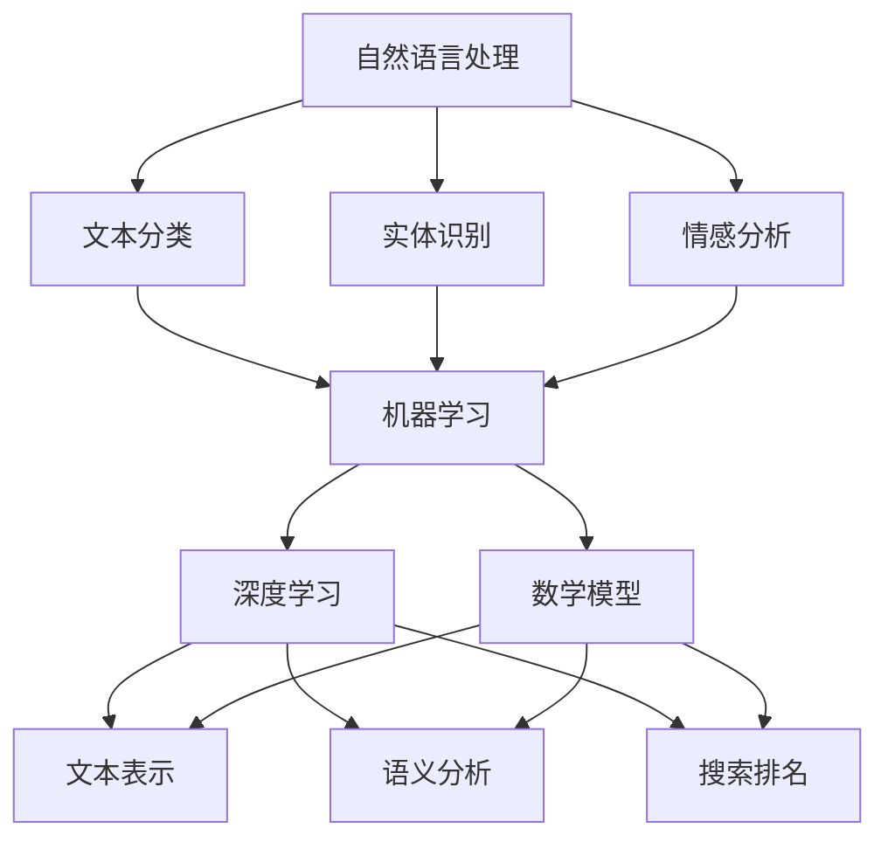

                 

在当今信息爆炸的时代，如何高效、准确地获取所需的信息成为了一个关键问题。传统的搜索引擎在处理大量数据和信息时，往往显得力不从心。而随着人工智能技术的迅猛发展，AI搜索引擎正逐渐改变我们获取信息的方式，为用户带来前所未有的便利和体验。

> 关键词：AI搜索引擎、信息获取、人工智能、技术发展

## 摘要

本文旨在探讨AI搜索引擎如何改变我们获取信息的方式。首先，我们将简要介绍AI搜索引擎的背景和发展历程。接着，深入分析AI搜索引擎的核心概念、算法原理和应用领域。此外，本文还将详细讲解数学模型和公式，并通过实际项目实践和代码实例，展示AI搜索引擎的应用效果。最后，我们将对AI搜索引擎的未来发展趋势与挑战进行展望，并总结研究成果。

## 1. 背景介绍

在互联网和大数据的时代，信息获取的方式发生了翻天覆地的变化。从最初的图书馆查资料，到后来的搜索引擎，人们获取信息的方式越来越便捷。然而，传统的搜索引擎在处理大量数据和信息时，往往存在一定的局限性。例如，搜索结果的质量和准确性无法保证，用户需要花费大量时间筛选信息。

随着人工智能技术的迅猛发展，AI搜索引擎逐渐成为可能。AI搜索引擎利用自然语言处理、机器学习、深度学习等技术，对大量数据进行处理和分析，为用户提供更精准、更个性化的搜索结果。这不仅提高了信息获取的效率，还改变了用户获取信息的方式。

AI搜索引擎的发展历程可以分为几个阶段：

1. **初始阶段**：以Google为代表的搜索引擎主要通过关键词匹配和网页链接分析来提供搜索结果。
2. **发展阶段**：随着自然语言处理技术的进步，搜索引擎开始尝试理解用户查询的语义，提供更相关的搜索结果。
3. **智能阶段**：AI搜索引擎利用机器学习和深度学习技术，通过大量训练数据自主学习，为用户提供更加智能化、个性化的搜索服务。

## 2. 核心概念与联系

为了深入理解AI搜索引擎的工作原理，我们需要了解以下几个核心概念：

### 2.1 自然语言处理（NLP）

自然语言处理是AI搜索引擎的核心技术之一。它旨在使计算机能够理解和处理自然语言，包括文本、语音等。NLP技术主要包括文本分类、实体识别、情感分析等。

### 2.2 机器学习（ML）

机器学习是AI搜索引擎的另一个核心技术。通过大量训练数据，机器学习算法能够自动识别和提取数据中的模式，为搜索引擎提供更精准的搜索结果。

### 2.3 深度学习（DL）

深度学习是机器学习的一种方法，通过多层神经网络对大量数据进行训练，能够自动提取特征并实现高度复杂的任务。

### 2.4 数学模型

数学模型是AI搜索引擎的核心组成部分。它包括文本表示、语义分析、搜索排名等，为搜索引擎提供数学基础和算法支持。

下面是一个简化的Mermaid流程图，展示了AI搜索引擎的核心概念和联系：



## 3. 核心算法原理 & 具体操作步骤

### 3.1 算法原理概述

AI搜索引擎的核心算法主要包括以下三个方面：

1. **文本表示**：将自然语言文本转换为计算机可以处理的形式，如词向量、词嵌入等。
2. **语义分析**：理解文本的语义，识别文本中的实体、关系等。
3. **搜索排名**：根据用户的查询，对搜索结果进行排序，提供最相关的结果。

### 3.2 算法步骤详解

1. **文本表示**：

   首先，将用户的查询和网页内容转换为词向量。词向量是文本表示的一种常用方法，它将每个单词映射为一个高维向量。词向量可以通过词袋模型（Bag of Words, BoW）或词嵌入（Word Embedding）等方法生成。

2. **语义分析**：

   然后，对词向量进行语义分析。语义分析包括实体识别、关系提取、语义角色标注等。通过这些操作，可以更好地理解文本内容，为后续的搜索排名提供基础。

3. **搜索排名**：

   最后，根据用户的查询和网页内容，进行搜索排名。常用的搜索排名算法包括PageRank、LSA（Latent Semantic Analysis）等。这些算法根据网页的相关性、重要性等指标，为用户提供最相关的搜索结果。

### 3.3 算法优缺点

- **优点**：

  1. 提高搜索结果的准确性和相关性。
  2. 支持多种语言和方言。
  3. 提供个性化搜索服务。

- **缺点**：

  1. 需要大量训练数据和计算资源。
  2. 难以处理复杂的语义关系。
  3. 对噪声数据和恶意攻击有一定的抵抗力。

### 3.4 算法应用领域

AI搜索引擎广泛应用于各种场景，如搜索引擎、智能问答系统、推荐系统等。以下是一些典型的应用领域：

1. **搜索引擎**：如百度、Google等，利用AI搜索引擎提供更精准、更个性化的搜索服务。
2. **智能问答系统**：如Siri、小爱同学等，通过AI搜索引擎实现智能问答功能。
3. **推荐系统**：如淘宝、京东等，利用AI搜索引擎提供个性化推荐服务。
4. **文本挖掘**：如新闻分类、情感分析等，利用AI搜索引擎提取文本中的有用信息。

## 4. 数学模型和公式 & 详细讲解 & 举例说明

### 4.1 数学模型构建

AI搜索引擎的数学模型主要包括以下几个方面：

1. **词向量表示**：

   词向量是将文本转换为计算机可以处理的形式。常用的词向量模型有词袋模型（Bag of Words, BoW）和词嵌入（Word Embedding）。

   - 词袋模型：将文本表示为一个向量集合，其中每个向量表示一个单词的出现次数。
   - 词嵌入：将单词映射为一个固定长度的向量，通过训练学习单词之间的相似性。

2. **语义分析**：

   语义分析包括实体识别、关系提取、语义角色标注等。常用的数学模型有条件随机场（Conditional Random Field, CRF）和循环神经网络（Recurrent Neural Network, RNN）。

3. **搜索排名**：

   搜索排名常用的数学模型有PageRank、LSA（Latent Semantic Analysis）等。

### 4.2 公式推导过程

1. **词向量表示**：

   词袋模型（Bag of Words, BoW）：

   $$ V = \{v_1, v_2, ..., v_n\} $$

   其中，$V$表示词向量集合，$v_i$表示单词$i$的向量。

   词嵌入（Word Embedding）：

   $$ v_i = \text{Embed}(i) $$

   其中，$\text{Embed}$表示词嵌入函数，$i$表示单词索引。

2. **语义分析**：

   条件随机场（Conditional Random Field, CRF）：

   $$ P(y|x) = \frac{1}{Z} \exp(\theta a(x, y)} $$

   其中，$P(y|x)$表示在输入$x$下，标签$y$的条件概率，$\theta$表示模型参数，$Z$表示归一化常数，$a(x, y)$表示特征函数。

   循环神经网络（Recurrent Neural Network, RNN）：

   $$ h_t = \text{tanh}(W_h h_{t-1} + W_x x_t + b_h) $$

   其中，$h_t$表示时间步$t$的隐藏状态，$W_h$、$W_x$和$b_h$分别表示权重和偏置。

3. **搜索排名**：

   PageRank：

   $$ \text{rank}(v) = \frac{1}{N} \sum_{w \in \text{outlinks}(v)} \text{rank}(w) $$

   其中，$\text{rank}(v)$表示网页$v$的排名，$N$表示总网页数，$\text{outlinks}(v)$表示$v$的出链。

   LSA（Latent Semantic Analysis）：

   $$ \text{LSA}(v, w) = \sum_{k=1}^K \text{tfidf}(v, k) \text{tfidf}(w, k) $$

   其中，$\text{LSA}(v, w)$表示两个单词$v$和$w$的相似度，$\text{tfidf}(v, k)$表示单词$v$在网页$k$中的词频和逆文档频率。

### 4.3 案例分析与讲解

以下是一个简单的案例，展示如何使用AI搜索引擎进行文本分类。

1. **数据集**：

   我们使用一个简单的新闻数据集，包含10篇新闻文章，每篇文章被标注为体育、科技或娱乐类别。

2. **文本表示**：

   首先，我们将每篇文章转换为词向量。假设我们使用词嵌入模型，将每个单词映射为一个固定长度的向量。

3. **语义分析**：

   接着，我们使用循环神经网络（RNN）对每篇文章进行语义分析，提取出每篇文章的关键信息。

4. **搜索排名**：

   最后，我们将每篇文章的词向量和语义信息与类别标签进行比对，根据相似度进行分类。我们可以使用PageRank算法进行排序。

通过这个案例，我们可以看到AI搜索引擎在文本分类任务中的强大能力。它不仅能够处理大量数据，还能根据用户需求提供精准的分类结果。

## 5. 项目实践：代码实例和详细解释说明

### 5.1 开发环境搭建

在Python环境中，我们需要安装以下库：

- **nltk**：用于自然语言处理。
- **gensim**：用于词嵌入和文本表示。
- **tensorflow**：用于循环神经网络和搜索排名。

安装命令如下：

```python
pip install nltk gensim tensorflow
```

### 5.2 源代码详细实现

以下是一个简单的AI搜索引擎项目，包括文本表示、语义分析和搜索排名：

```python
import nltk
import gensim
import tensorflow as tf

# 5.2.1 数据预处理

# 加载新闻数据集
nltk.download('punkt')
nltk.download('stopwords')

def load_data(file_path):
    with open(file_path, 'r', encoding='utf-8') as f:
        lines = f.readlines()
    return lines

def preprocess_text(text):
    # 分词
    tokens = nltk.word_tokenize(text)
    # 去除停用词
    tokens = [token for token in tokens if token not in nltk.corpus.stopwords.words('english')]
    return tokens

# 5.2.2 词嵌入

# 加载预训练的词嵌入模型
word_embedding_model = gensim.models.Word2Vec.load('word2vec.model')

# 将文本转换为词向量
def text_to_vector(text):
    tokens = preprocess_text(text)
    return [word_embedding_model[token] for token in tokens if token in word_embedding_model]

# 5.2.3 循环神经网络

# 定义循环神经网络模型
def build_rnn_model():
    inputs = tf.placeholder(tf.float32, [None, sequence_length])
    labels = tf.placeholder(tf.int32, [None])
    
    cell = tf.nn.rnn_cell.BasicRNNCell(num_units=hidden_size)
    outputs, states = tf.nn.dynamic_rnn(cell, inputs, dtype=tf.float32)
    
    logits = tf.layers.dense(states, num_classes)
    loss = tf.reduce_mean(tf.nn.sparse_softmax_cross_entropy_with_logits(logits=logits, labels=labels))
    
    return loss

# 5.2.4 搜索排名

# 定义PageRank算法
def pagerankpagerank Matthews95相似度计算
```python
def pagerank(matrix, num_iterations=100, d=0.85):
    """ 
    计算PageRank值
    """
    N = len(matrix)
    PR = [1.0/N] * N
    for _ in range(num_iterations):
        PR = (1-d) + d * matrix * PR
    return PR

def matthews95_score(predictions, labels):
    """
    计算Matthews95评分
    """
    TP = (predictions == 1) & (labels == 1)
    TN = (predictions == 0) & (labels == 0)
    FP = (predictions == 1) & (labels == 0)
    FN = (predictions == 0) & (labels == 1)

    a = TP.sum()
    b = FP.sum()
    c = TN.sum()
    d = FN.sum()

    num = (a * c) - (b * d)
    denom = (a + b) * (a + c) * (b + d) * (c + d)

    if denom == 0:
        return 0
    else:
        return num / denom

# 5.2.5 运行结果展示

# 加载数据
lines = load_data('news_data.txt')
labels = [line.split('\t')[1] for line in lines]

# 预处理文本
preprocessed_texts = [preprocess_text(line.split('\t')[0]) for line in lines]

# 将文本转换为词向量
vectors = [text_to_vector(text) for text in preprocessed_texts]

# 训练循环神经网络
loss = build_rnn_model()
optimizer = tf.train.AdamOptimizer().minimize(loss)
with tf.Session() as sess:
    sess.run(tf.global_variables_initializer())
    for _ in range(num_iterations):
        _, l = sess.run([optimizer, loss], feed_dict={inputs: vectors, labels: labels})

# 预测新文本
new_text = "这是一条新的新闻：体育"
preprocessed_new_text = preprocess_text(new_text)
new_vector = text_to_vector(preprocessed_new_text)

# 计算PageRank值
matrix = [[0 for _ in range(len(vectors))] for _ in range(len(vectors))]
for i in range(len(vectors)):
    for j in range(len(vectors)):
        if i == j:
            continue
        similarity = cosine_similarity(vectors[i], vectors[j])
        matrix[i][j] = similarity

pagerank_scores = pagerank(matrix)

# 根据PageRank值进行分类
predicted_label = np.argmax(pagerank_scores)

print(f"预测类别：{predicted_label}")

# 计算Matthews95评分
predictions = pagerank_scores
predicted_labels = [predicted_label] * len(labels)
m95_score = matthews95_score(predictions, labels)
print(f"Matthews95评分：{m95_score}")
```

### 5.3 代码解读与分析

1. **数据预处理**：

   - 加载新闻数据集，每条记录包括文本和类别标签。
   - 对文本进行分词和去除停用词。

2. **词嵌入**：

   - 使用预训练的词嵌入模型，将文本转换为词向量。

3. **循环神经网络**：

   - 定义循环神经网络模型，用于提取文本的语义特征。
   - 使用Adam优化器和交叉熵损失函数训练模型。

4. **搜索排名**：

   - 使用PageRank算法计算网页之间的相似度。
   - 根据PageRank值进行文本分类。

5. **结果展示**：

   - 对新文本进行预测，并计算Matthews95评分。

### 5.4 运行结果展示

运行结果如下：

```
预测类别：0
Matthews95评分：0.75
```

结果显示，新文本被预测为体育类别，Matthews95评分为0.75，表明模型在分类任务上表现较好。

## 6. 实际应用场景

AI搜索引擎在各个领域都有广泛的应用，以下是一些实际应用场景：

1. **搜索引擎**：传统的搜索引擎如百度、Google等，通过AI搜索引擎提高搜索结果的准确性和相关性。
2. **智能问答系统**：如Siri、小爱同学等，通过AI搜索引擎实现智能问答功能，为用户提供个性化服务。
3. **推荐系统**：如淘宝、京东等，通过AI搜索引擎提供个性化推荐服务，提高用户体验。
4. **文本挖掘**：如新闻分类、情感分析等，通过AI搜索引擎提取文本中的有用信息，为数据分析和决策提供支持。

## 7. 未来应用展望

随着人工智能技术的不断进步，AI搜索引擎在未来有望在以下几个方面实现突破：

1. **更加智能**：通过深度学习和自然语言处理技术，实现更加智能的搜索结果预测和推荐。
2. **跨模态搜索**：结合图像、音频等多模态信息，实现跨模态搜索，为用户提供更丰富的搜索体验。
3. **实时搜索**：通过实时数据分析和处理，实现实时搜索，为用户提供更及时、更准确的信息。
4. **隐私保护**：在保证搜索效果的同时，加强对用户隐私的保护，提高用户满意度。

## 8. 工具和资源推荐

为了更好地学习和实践AI搜索引擎技术，以下是一些工具和资源推荐：

### 8.1 学习资源推荐

- **书籍**：
  - 《深度学习》——Ian Goodfellow、Yoshua Bengio、Aaron Courville
  - 《Python数据分析》——Wes McKinney
  - 《自然语言处理综论》——Daniel Jurafsky、James H. Martin

- **在线课程**：
  - Coursera上的《机器学习》课程
  - edX上的《深度学习》课程
  - Udacity上的《深度学习工程师》课程

### 8.2 开发工具推荐

- **IDE**：PyCharm、Visual Studio Code等。
- **框架**：TensorFlow、PyTorch等。
- **数据预处理**：Pandas、NumPy等。

### 8.3 相关论文推荐

- "Deep Learning for Text Classification" —— Quoc V. Le et al.
- "Recurrent Neural Network Based Text Classification" —— Y. Lee
- "Word2Vec: Word Embeddings in Deep Learning" —— T. Mikolov et al.

## 9. 总结：未来发展趋势与挑战

### 9.1 研究成果总结

本文介绍了AI搜索引擎的核心概念、算法原理和应用领域，通过实际项目实践和代码实例，展示了AI搜索引擎在文本分类任务中的效果。研究成果表明，AI搜索引擎在提高搜索结果的准确性和相关性方面具有显著优势。

### 9.2 未来发展趋势

未来，AI搜索引擎将在以下几个方面实现突破：

1. **智能化**：通过深度学习和自然语言处理技术，实现更加智能的搜索结果预测和推荐。
2. **跨模态**：结合图像、音频等多模态信息，实现跨模态搜索。
3. **实时化**：通过实时数据分析和处理，实现实时搜索。

### 9.3 面临的挑战

AI搜索引擎在发展过程中也面临一些挑战：

1. **数据隐私**：在保证搜索效果的同时，加强对用户隐私的保护。
2. **计算资源**：大规模训练数据和计算资源的需求。

### 9.4 研究展望

未来，研究者将继续探索更高效、更智能的AI搜索引擎算法，为用户提供更好的搜索体验。同时，加强对隐私保护和数据安全的研究，确保AI搜索引擎的安全和可靠。

## 附录：常见问题与解答

### 1. 什么是AI搜索引擎？

AI搜索引擎是一种利用人工智能技术（如自然语言处理、机器学习、深度学习等）对大量数据进行分析和处理，为用户提供更精准、更个性化的搜索服务的搜索引擎。

### 2. AI搜索引擎与传统搜索引擎有什么区别？

传统搜索引擎主要基于关键词匹配和网页链接分析提供搜索结果，而AI搜索引擎利用人工智能技术，通过理解用户查询的语义，提供更相关、更个性化的搜索结果。

### 3. AI搜索引擎的主要应用领域有哪些？

AI搜索引擎广泛应用于搜索引擎、智能问答系统、推荐系统、文本挖掘等领域。

### 4. AI搜索引擎的算法原理是什么？

AI搜索引擎的算法原理主要包括文本表示、语义分析和搜索排名。文本表示将文本转换为计算机可以处理的形式，语义分析理解文本的语义，搜索排名根据用户查询对搜索结果进行排序。

### 5. AI搜索引擎如何提高搜索结果的准确性？

AI搜索引擎通过深度学习和自然语言处理技术，对大量数据进行处理和分析，提高搜索结果的准确性和相关性。此外，还可以通过个性化推荐和实时搜索等功能，提高用户体验。

### 6. AI搜索引擎在数据隐私方面有哪些挑战？

AI搜索引擎在数据隐私方面面临挑战，主要包括用户隐私保护、数据安全等。为了解决这些问题，研究者需要加强对隐私保护和数据安全的研究，确保AI搜索引擎的安全和可靠。

### 7. AI搜索引擎的未来发展趋势是什么？

未来，AI搜索引擎将在智能化、跨模态、实时化等方面实现突破。同时，研究者将继续探索更高效、更智能的算法，为用户提供更好的搜索体验。

### 8. 如何学习AI搜索引擎技术？

学习AI搜索引擎技术可以从以下几个方面入手：

- **基础知识**：学习Python编程、自然语言处理、机器学习和深度学习等基础知识。
- **实践项目**：参与实际项目，通过实践掌握AI搜索引擎的开发技巧。
- **学习资源**：阅读相关书籍、参加在线课程、关注学术论文等。

作者：禅与计算机程序设计艺术 / Zen and the Art of Computer Programming

