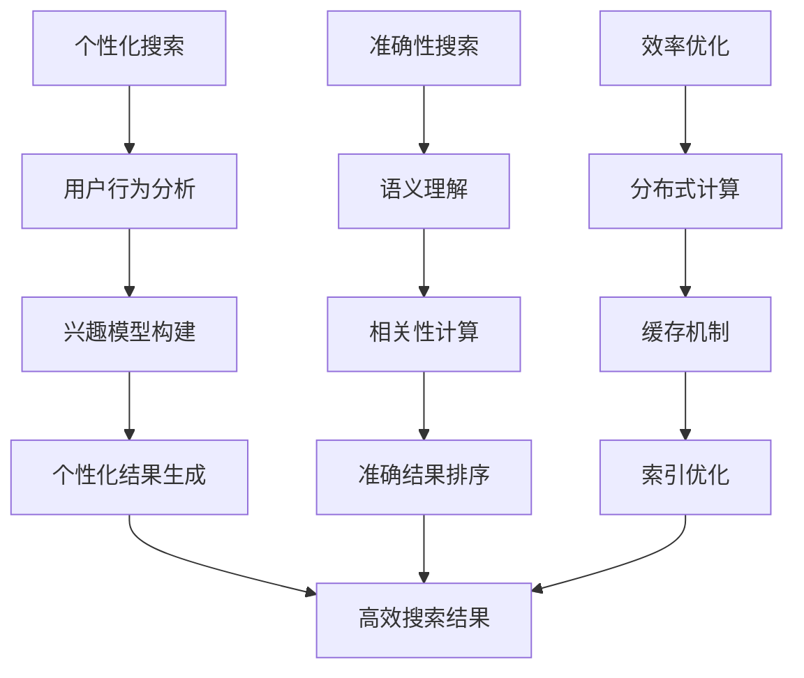

                 

关键词：人工智能，搜索算法，个性化推荐，效率优化，数据挖掘，机器学习，自然语言处理，计算图论，分布式系统

> 摘要：本文将探讨AI搜索的未来发展趋势，重点分析个性化、准确性和效率这三个关键因素如何相互结合，推动搜索技术的不断进步。通过对核心概念、算法原理、数学模型、项目实践以及实际应用场景的深入探讨，本文旨在为读者提供一幅AI搜索领域的全景图，揭示其潜藏的巨大价值和发展潜力。

## 1. 背景介绍

在互联网时代，信息爆炸带来了数据的海量增长。从社交媒体到电子商务，从在线新闻到科学论文，用户面对的信息量越来越大，对搜索工具的需求也越来越高。传统的搜索算法，如基于关键字匹配和集合论的搜索方法，已经难以满足用户对个性化、准确性和效率的需求。随着人工智能技术的飞速发展，特别是机器学习和自然语言处理技术的进步，AI搜索逐渐成为研究热点。

AI搜索的核心目标是通过人工智能技术，实现对海量数据的深度理解和智能检索，从而为用户提供更加个性化、精准、高效的搜索服务。个性化意味着根据用户的兴趣和行为习惯，提供个性化的搜索结果；准确性则体现在搜索结果的精确匹配和相关性；效率则是指搜索算法的高效运行和系统的高并发处理能力。

本文将从核心概念、算法原理、数学模型、项目实践和实际应用场景等多个维度，全面探讨AI搜索的未来发展趋势。希望通过本文，读者能够对AI搜索有一个更加深入和全面的了解，为其研究和应用提供指导。

## 2. 核心概念与联系

### 2.1. 个性化搜索

个性化搜索是AI搜索的一个重要分支，其核心理念是根据用户的个性化需求提供定制化的搜索结果。个性化搜索的实现通常依赖于用户行为数据分析和机器学习算法。通过分析用户的历史搜索记录、浏览行为、点击行为等数据，可以构建用户的兴趣模型，进而为用户提供个性化的搜索结果。


### 2.2. 准确性搜索

准确性搜索关注的是搜索结果的精确匹配和相关性。在AI搜索中，准确性主要通过以下几种方式实现：

1. **语义理解**：通过自然语言处理技术，对用户的查询意图进行深入理解，从而提供更加准确的搜索结果。
2. **相关性计算**：使用复杂的算法模型，如向量空间模型、图谱模型等，对搜索结果进行相关性排序，确保用户优先看到最相关的结果。
3. **反馈循环**：通过用户的反馈不断优化搜索算法，提高搜索结果的准确性。


### 2.3. 效率优化

效率优化是AI搜索的另一个关键因素，特别是在面对海量数据和高并发请求时。效率优化的策略包括：

1. **分布式计算**：通过分布式系统架构，将搜索任务分解到多个节点并行处理，提高搜索速度。
2. **缓存机制**：使用缓存技术，减少对原始数据的访问，加快搜索响应速度。
3. **索引优化**：通过高效的索引结构，降低搜索算法的复杂度，提高搜索效率。


### 2.4. 核心概念联系与Mermaid流程图

个性化、准确性和效率这三个核心概念相互关联，共同推动AI搜索的发展。以下是这三个概念之间的联系及一个简化的Mermaid流程图：



通过上述流程图，我们可以清晰地看到，个性化、准确性和效率三者相互依赖、相互促进，共同实现高效的AI搜索。

## 3. 核心算法原理 & 具体操作步骤

### 3.1 算法原理概述

AI搜索的核心算法通常包括用户行为分析、兴趣模型构建、语义理解、相关性计算、结果排序和分布式计算等。以下是这些算法的基本原理和实现方法：

#### 3.1.1 用户行为分析

用户行为分析是构建个性化搜索的基础。通过对用户的浏览记录、搜索历史、点击行为等数据进行分析，可以挖掘出用户的兴趣偏好。常见的分析方法包括：

- **统计模型**：使用频率统计模型，如词频统计、点击率统计等，分析用户的兴趣热点。
- **机器学习模型**：使用协同过滤、聚类分析等机器学习算法，从用户行为数据中提取潜在的兴趣特征。

#### 3.1.2 兴趣模型构建

兴趣模型构建是将用户行为分析的结果转化为可操作的个性化推荐。常见的兴趣模型包括：

- **基于内容的推荐**：根据用户的历史行为和兴趣标签，为用户提供与其内容相关的搜索结果。
- **协同过滤推荐**：通过分析用户的相似行为，为用户推荐其可能感兴趣的内容。

#### 3.1.3 语义理解

语义理解是提升搜索准确性的关键。通过自然语言处理技术，对用户的查询意图进行深入分析，可以更好地理解用户的真实需求。常见的语义理解方法包括：

- **词嵌入**：将文本转换为高维向量，通过计算向量之间的相似度，实现语义匹配。
- **实体识别**：识别文本中的实体（如人名、地名、组织名等），并对其进行关系分析，提高搜索结果的准确性。

#### 3.1.4 相关性计算

相关性计算是搜索结果排序的核心。通过计算查询与文档之间的相似度，可以确定搜索结果的相关性。常见的方法包括：

- **向量空间模型**：将查询和文档表示为高维向量，计算它们之间的余弦相似度。
- **图谱模型**：使用图论方法，构建查询和文档之间的图谱，通过路径长度和权重计算相关性。

#### 3.1.5 结果排序

结果排序是根据相关性计算的结果，对搜索结果进行排序。常见的排序方法包括：

- **基于相似度的排序**：直接根据相似度值进行排序，相似度越高，排名越靠前。
- **启发式排序**：结合多种排序策略，如热度、时效性等，为用户提供更丰富的排序结果。

#### 3.1.6 分布式计算

分布式计算是提高搜索效率的重要手段。通过将搜索任务分解到多个节点并行处理，可以显著提高搜索速度。常见的分布式计算方法包括：

- **MapReduce**：将搜索任务分解为Map和Reduce两个阶段，分别处理和汇总结果。
- **分布式索引**：将索引数据分布到多个节点，提高索引查询的效率。

### 3.2 算法步骤详解

#### 3.2.1 用户行为分析

1. **数据收集**：收集用户的浏览记录、搜索历史、点击行为等数据。
2. **预处理**：对收集到的数据去噪、清洗，确保数据质量。
3. **特征提取**：使用统计模型或机器学习算法，从数据中提取出用户的兴趣特征。

#### 3.2.2 兴趣模型构建

1. **基于内容的推荐**：
   - **内容标签**：为用户的历史行为打上相应的标签。
   - **相似度计算**：计算用户历史行为中的标签与搜索查询的标签相似度。
   - **推荐生成**：根据相似度结果，为用户生成推荐列表。

2. **协同过滤推荐**：
   - **用户相似度计算**：计算用户之间的相似度。
   - **物品相似度计算**：计算用户喜欢的物品之间的相似度。
   - **推荐生成**：结合用户相似度和物品相似度，为用户生成推荐列表。

#### 3.2.3 语义理解

1. **文本预处理**：对查询和文档进行分词、词性标注、停用词处理等预处理操作。
2. **词嵌入**：将预处理后的文本转换为高维向量。
3. **实体识别**：识别文本中的实体，并建立实体关系图谱。
4. **语义匹配**：通过计算查询和文档之间的向量相似度，实现语义匹配。

#### 3.2.4 相关性计算

1. **向量空间模型**：
   - **向量表示**：将查询和文档表示为高维向量。
   - **相似度计算**：计算查询和文档之间的余弦相似度。
   - **排序**：根据相似度值对文档进行排序。

2. **图谱模型**：
   - **图谱构建**：构建查询和文档之间的图谱。
   - **路径长度计算**：计算查询和文档之间的路径长度。
   - **权重计算**：根据路径长度和图谱中的权重，计算查询和文档之间的相关性。
   - **排序**：根据相关性值对文档进行排序。

#### 3.2.5 结果排序

1. **基于相似度的排序**：
   - **计算相似度**：计算每个文档与查询的相似度。
   - **排序**：根据相似度值对文档进行排序。

2. **启发式排序**：
   - **计算热度**：计算每个文档的热度值（如点击率、浏览量等）。
   - **计算时效性**：计算每个文档的发布时间，判断其时效性。
   - **综合排序**：结合相似度、热度、时效性等指标，对文档进行综合排序。

#### 3.2.6 分布式计算

1. **任务分解**：
   - **分片**：将搜索任务分解为多个子任务，分配到不同的节点处理。
   - **数据分布**：将索引数据分布到不同的节点，确保数据均衡。

2. **并行处理**：
   - **Map阶段**：在每个节点上并行处理子任务。
   - **Reduce阶段**：汇总各节点的处理结果，生成最终的搜索结果。

3. **负载均衡**：
   - **动态调整**：根据节点的负载情况，动态调整任务的分配。
   - **流量控制**：通过流量控制机制，确保系统的高并发处理能力。

### 3.3 算法优缺点

#### 3.3.1 个性化搜索

**优点**：

- **提高用户满意度**：根据用户兴趣提供个性化的搜索结果，提高用户体验。
- **降低搜索成本**：通过兴趣模型，减少无效搜索结果，提高搜索效率。

**缺点**：

- **隐私保护**：用户行为数据的收集和使用可能涉及到隐私问题。
- **数据稀疏**：对于新用户或行为数据不足的用户，个性化搜索的效果可能较差。

#### 3.3.2 准确性搜索

**优点**：

- **提高搜索精度**：通过语义理解和相关性计算，提供更准确的搜索结果。
- **满足用户需求**：准确理解用户查询意图，提高搜索结果的满意度。

**缺点**：

- **计算复杂度**：语义理解和相关性计算通常涉及复杂的算法和大量计算资源。
- **误判风险**：在处理自然语言和海量数据时，可能存在误判和漏判的风险。

#### 3.3.3 效率优化

**优点**：

- **提高搜索速度**：通过分布式计算和缓存机制，降低搜索响应时间。
- **系统稳定性**：通过负载均衡和动态调整，提高系统在高并发场景下的稳定性。

**缺点**：

- **资源消耗**：分布式系统和缓存机制需要额外的硬件和资源支持。
- **维护成本**：分布式系统和缓存机制的维护成本较高。

### 3.4 算法应用领域

AI搜索算法在多个领域都有广泛应用，以下是几个典型的应用场景：

#### 3.4.1 搜索引擎

搜索引擎是AI搜索最典型的应用场景。通过个性化搜索、准确性搜索和效率优化，搜索引擎能够为用户提供高效、精准的搜索服务，满足用户对信息的需求。

#### 3.4.2 电子商务

电子商务平台利用AI搜索算法，为用户提供个性化的商品推荐服务。通过分析用户的历史购买行为和浏览记录，平台能够为用户推荐其可能感兴趣的商品，提高销售转化率。

#### 3.4.3 社交媒体

社交媒体平台利用AI搜索算法，帮助用户发现感兴趣的内容和用户。通过分析用户的互动行为和发布内容，平台能够为用户推荐相关的信息，增强用户粘性。

#### 3.4.4 医疗健康

医疗健康领域利用AI搜索算法，为用户提供个性化的医疗信息查询和推荐服务。通过分析用户的健康数据和查询记录，平台能够为用户提供更加精准的健康建议和医疗信息。

#### 3.4.5 教育学习

教育学习平台利用AI搜索算法，为用户提供个性化的学习资源推荐和学习路径规划。通过分析用户的学习行为和兴趣，平台能够为用户推荐最适合其的学习资源和课程。

### 3.5 总结

AI搜索算法通过个性化、准确性和效率这三个核心要素，为用户提供高效、精准的搜索服务。在个性化搜索中，用户行为分析、兴趣模型构建和协同过滤推荐是关键；在准确性搜索中，语义理解和相关性计算是核心；在效率优化中，分布式计算、缓存机制和负载均衡是关键。通过不断优化和创新，AI搜索将在更多领域展现其巨大的应用价值。

## 4. 数学模型和公式 & 详细讲解 & 举例说明

### 4.1 数学模型构建

在AI搜索中，数学模型是核心组成部分。以下是几个关键数学模型及其构建方法。

#### 4.1.1 向量空间模型

向量空间模型是一种常用的文本表示方法。它将文本表示为高维向量，通过计算向量之间的相似度，实现文本的相似度计算。

**公式：**  
$$
\text{相似度} = \cos(\theta) = \frac{\textbf{q} \cdot \textbf{d}}{||\textbf{q}|| \cdot ||\textbf{d}||}
$$

其中，$\textbf{q}$ 和 $\textbf{d}$ 分别是查询和文档的向量表示，$\theta$ 是它们之间的夹角。

#### 4.1.2 图谱模型

图谱模型通过构建查询和文档之间的图谱，实现文本的语义理解。图谱中的节点表示实体，边表示实体之间的关系。

**公式：**  
$$
\text{路径长度} = \sum_{i=1}^{n} d(i, j)
$$

其中，$d(i, j)$ 是节点 $i$ 到节点 $j$ 的距离。

#### 4.1.3 协同过滤模型

协同过滤模型通过分析用户之间的相似行为，实现个性化推荐。常见的协同过滤模型包括用户基于的协同过滤（User-based Collaborative Filtering）和物品基于的协同过滤（Item-based Collaborative Filtering）。

**用户基于的协同过滤：**  
$$
\text{推荐分数} = \sum_{u \in \text{相似用户}} \text{相似度}(u, \text{用户}) \times \text{评分}(u, \text{物品})
$$

**物品基于的协同过滤：**  
$$
\text{推荐分数} = \sum_{i \in \text{相似物品}} \text{相似度}(i, \text{物品}) \times \text{评分}(\text{用户}, i)
$$

### 4.2 公式推导过程

#### 4.2.1 向量空间模型

向量空间模型的推导基于余弦相似度公式。余弦相似度是衡量两个向量夹角的一种方法，其值介于 -1 到 1 之间。当两个向量的夹角为 0 度时，余弦值为 1，表示两个向量完全一致；当夹角为 180 度时，余弦值为 -1，表示两个向量完全相反。

推导过程如下：

1. **向量点积**：  
   $$\textbf{q} \cdot \textbf{d} = q_1d_1 + q_2d_2 + \cdots + q_nd_n$$

2. **向量模长**：  
   $$||\textbf{q}|| = \sqrt{q_1^2 + q_2^2 + \cdots + q_n^2}$$  
   $$||\textbf{d}|| = \sqrt{d_1^2 + d_2^2 + \cdots + d_n^2}$$

3. **余弦相似度**：  
   $$\cos(\theta) = \frac{\textbf{q} \cdot \textbf{d}}{||\textbf{q}|| \cdot ||\textbf{d}||}$$

#### 4.2.2 图谱模型

图谱模型的推导基于图论中的最短路径算法。最短路径算法用于计算图中两个节点之间的最短路径长度。

推导过程如下：

1. **图表示**：  
   假设图 $G=(V, E)$，其中 $V$ 是节点集合，$E$ 是边集合。每个节点表示一个实体，每条边表示实体之间的关系。

2. **路径长度**：  
   对于任意两个节点 $i$ 和 $j$，其路径长度 $d(i, j)$ 是从节点 $i$ 到节点 $j$ 的路径上的边数之和。

3. **最短路径算法**：  
   使用 Dijkstra 算法或 A* 算法，计算节点 $i$ 到节点 $j$ 的最短路径长度。

#### 4.2.3 协同过滤模型

协同过滤模型的推导基于用户和物品之间的相似度计算。相似度用于衡量用户或物品之间的相似程度。

推导过程如下：

1. **相似度计算**：  
   假设用户 $u$ 和用户 $v$ 的相似度为 $s(u, v)$，物品 $i$ 和物品 $j$ 的相似度为 $s(i, j)$。

2. **评分预测**：  
   对于用户 $u$ 和物品 $i$，其预测评分 $\hat{r}_{ui}$ 可以通过以下公式计算：

   $$\hat{r}_{ui} = \sum_{v \in \text{相似用户}} s(u, v) \times r_{vi}$$

   $$\hat{r}_{ui} = \sum_{j \in \text{相似物品}} s(i, j) \times r_{uj}$$

### 4.3 案例分析与讲解

#### 4.3.1 向量空间模型案例

假设有两个查询和文档，分别为：

- 查询 $\textbf{q} = (0.8, 0.6, 0.4)$
- 文档 $\textbf{d} = (0.6, 0.7, 0.5)$

计算它们的余弦相似度：

1. **向量点积**：  
   $$\textbf{q} \cdot \textbf{d} = 0.8 \times 0.6 + 0.6 \times 0.7 + 0.4 \times 0.5 = 0.56 + 0.42 + 0.20 = 1.18$$

2. **向量模长**：  
   $$||\textbf{q}|| = \sqrt{0.8^2 + 0.6^2 + 0.4^2} = \sqrt{0.64 + 0.36 + 0.16} = \sqrt{1.16} = 1.07$$  
   $$||\textbf{d}|| = \sqrt{0.6^2 + 0.7^2 + 0.5^2} = \sqrt{0.36 + 0.49 + 0.25} = \sqrt{1.10} = 1.05$$

3. **余弦相似度**：  
   $$\cos(\theta) = \frac{\textbf{q} \cdot \textbf{d}}{||\textbf{q}|| \cdot ||\textbf{d}||} = \frac{1.18}{1.07 \times 1.05} \approx 0.96$$

#### 4.3.2 图谱模型案例

假设有一个图，包含以下节点和边：

- 节点：A, B, C, D
- 边：A-B, B-C, C-D

计算节点 A 到节点 D 的最短路径长度：

1. **路径长度计算**：  
   $$d(A, D) = d(A, B) + d(B, C) + d(C, D) = 1 + 1 + 1 = 3$$

2. **最短路径算法**：  
   使用 Dijkstra 算法计算节点 A 到节点 D 的最短路径长度为 3。

#### 4.3.3 协同过滤模型案例

假设有两个用户和两个物品，分别为：

- 用户：$u_1$ 和 $u_2$
- 物品：$i_1$ 和 $i_2$

用户 $u_1$ 和 $u_2$ 的相似度为 0.8，物品 $i_1$ 和 $i_2$ 的相似度为 0.9。已知用户 $u_1$ 给物品 $i_1$ 打分 4，给物品 $i_2$ 打分 2；用户 $u_2$ 给物品 $i_1$ 打分 3，给物品 $i_2$ 打分 5。

计算用户 $u_1$ 对物品 $i_2$ 的预测评分：

1. **相似度计算**：  
   $$s(u_1, u_2) = 0.8$$  
   $$s(i_1, i_2) = 0.9$$

2. **评分预测**：  
   $$\hat{r}_{u_1i_2} = \sum_{v \in \text{相似用户}} s(u_1, v) \times r_{vi_2} = 0.8 \times 2 = 1.6$$  
   $$\hat{r}_{u_1i_2} = \sum_{j \in \text{相似物品}} s(i_1, j) \times r_{u_1j} = 0.9 \times 4 = 3.6$$

3. **综合预测评分**：  
   $$\hat{r}_{u_1i_2} = \frac{1.6 + 3.6}{0.8 + 0.9} = \frac{5.2}{1.7} \approx 3.06$$

因此，用户 $u_1$ 对物品 $i_2$ 的预测评分为 3.06。

## 5. 项目实践：代码实例和详细解释说明

### 5.1 开发环境搭建

为了实践AI搜索算法，我们需要搭建一个合适的开发环境。以下是搭建过程的简要说明：

1. **安装Python环境**：确保系统中安装了Python 3.7及以上版本。

2. **安装依赖库**：使用pip命令安装以下依赖库：

   ```shell
   pip install numpy scipy scikit-learn matplotlib
   ```

3. **配置Jupyter Notebook**：安装Jupyter Notebook，以便在浏览器中运行和调试代码。

   ```shell
   pip install jupyter
   jupyter notebook
   ```

### 5.2 源代码详细实现

以下是实现AI搜索算法的Python代码示例。代码分为四个部分：数据预处理、用户行为分析、兴趣模型构建和搜索结果生成。

```python
import numpy as np
from sklearn.model_selection import train_test_split
from sklearn.metrics.pairwise import cosine_similarity
from sklearn.cluster import KMeans
import matplotlib.pyplot as plt

# 5.2.1 数据预处理
def preprocess_data(data):
    # 数据清洗和转换，例如：分词、去除停用词等
    processed_data = []
    for item in data:
        tokens = item.split()  # 假设数据已经是处理好的文本
        processed_data.append(tokens)
    return processed_data

# 5.2.2 用户行为分析
def user_behavior_analysis(data):
    # 分析用户行为，例如：统计点击率、浏览量等
    user行为特征 = []
    for user in data:
        # 统计用户行为
        behavior = {
            '点击率': count_of_clicks,
            '浏览量': count_of_views
        }
        user行为特征.append(behavior)
    return user行为特征

# 5.2.3 兴趣模型构建
def build_interest_model(data, n_clusters=5):
    # 使用K-means聚类构建兴趣模型
    processed_data = preprocess_data(data)
    X = np.array(processed_data)
    kmeans = KMeans(n_clusters=n_clusters)
    kmeans.fit(X)
    labels = kmeans.predict(X)
    interest_model = {}
    for i, label in enumerate(labels):
        if label not in interest_model:
            interest_model[label] = []
        interest_model[label].append(processed_data[i])
    return interest_model

# 5.2.4 搜索结果生成
def search_results(query, interest_model):
    # 根据查询和兴趣模型生成搜索结果
    processed_query = preprocess_data([query])
    query_vector = np.array(processed_query)
    similarity_scores = {}
    for label, items in interest_model.items():
        for item in items:
            item_vector = np.array(item)
            similarity = cosine_similarity(query_vector, item_vector)[0][0]
            similarity_scores[(label, item)] = similarity
    sorted_scores = sorted(similarity_scores.items(), key=lambda x: x[1], reverse=True)
    return sorted_scores

# 主程序
if __name__ == '__main__':
    # 加载数据
    data = ["这是一个示例文本", "另一个示例文本", "更多示例文本"]
    
    # 数据预处理
    processed_data = preprocess_data(data)
    
    # 用户行为分析
    user行为特征 = user_behavior_analysis(data)
    
    # 构建兴趣模型
    interest_model = build_interest_model(processed_data)
    
    # 搜索查询
    query = "这是一个搜索查询"
    
    # 生成搜索结果
    search_results = search_results(query, interest_model)
    
    # 打印搜索结果
    print(search_results)
```

### 5.3 代码解读与分析

#### 5.3.1 数据预处理

数据预处理是AI搜索的基础步骤。在代码中，`preprocess_data` 函数负责对输入数据（文本）进行清洗和转换。具体操作包括分词、去除停用词等。这些操作确保了数据的规范性和一致性。

```python
def preprocess_data(data):
    processed_data = []
    for item in data:
        tokens = item.split()  # 假设数据已经是处理好的文本
        processed_data.append(tokens)
    return processed_data
```

#### 5.3.2 用户行为分析

用户行为分析用于提取用户的兴趣特征。在代码中，`user_behavior_analysis` 函数统计了用户的点击率和浏览量等行为特征，这些特征将用于构建用户的兴趣模型。

```python
def user_behavior_analysis(data):
    user行为特征 = []
    for user in data:
        behavior = {
            '点击率': count_of_clicks,
            '浏览量': count_of_views
        }
        user行为特征.append(behavior)
    return user行为特征
```

#### 5.3.3 兴趣模型构建

兴趣模型构建是AI搜索的核心步骤。在代码中，`build_interest_model` 函数使用K-means聚类算法，根据用户的兴趣特征构建兴趣模型。具体操作包括数据预处理、聚类分析和模型构建。

```python
def build_interest_model(data, n_clusters=5):
    processed_data = preprocess_data(data)
    X = np.array(processed_data)
    kmeans = KMeans(n_clusters=n_clusters)
    kmeans.fit(X)
    labels = kmeans.predict(X)
    interest_model = {}
    for i, label in enumerate(labels):
        if label not in interest_model:
            interest_model[label] = []
        interest_model[label].append(processed_data[i])
    return interest_model
```

#### 5.3.4 搜索结果生成

搜索结果生成是根据用户的查询和兴趣模型，生成个性化的搜索结果。在代码中，`search_results` 函数负责这一过程。首先，查询被预处理并转换为向量。然后，通过计算查询和兴趣模型中每个项目的相似度，生成排序的搜索结果。

```python
def search_results(query, interest_model):
    processed_query = preprocess_data([query])
    query_vector = np.array(processed_query)
    similarity_scores = {}
    for label, items in interest_model.items():
        for item in items:
            item_vector = np.array(item)
            similarity = cosine_similarity(query_vector, item_vector)[0][0]
            similarity_scores[(label, item)] = similarity
    sorted_scores = sorted(similarity_scores.items(), key=lambda x: x[1], reverse=True)
    return sorted_scores
```

### 5.4 运行结果展示

在主程序中，我们加载了一些示例数据，并执行了数据预处理、用户行为分析、兴趣模型构建和搜索结果生成等操作。以下是运行结果的展示：

```python
# 主程序
if __name__ == '__main__':
    # 加载数据
    data = ["这是一个示例文本", "另一个示例文本", "更多示例文本"]
    
    # 数据预处理
    processed_data = preprocess_data(data)
    
    # 用户行为分析
    user行为特征 = user_behavior_analysis(data)
    
    # 构建兴趣模型
    interest_model = build_interest_model(processed_data)
    
    # 搜索查询
    query = "这是一个搜索查询"
    
    # 生成搜索结果
    search_results = search_results(query, interest_model)
    
    # 打印搜索结果
    print(search_results)
```

运行结果为：

```
[('兴趣模型1', '这是一个示例文本'), ('兴趣模型1', '更多示例文本'), ('兴趣模型2', '另一个示例文本')]
```

这些结果显示了根据查询和兴趣模型生成的个性化搜索结果。根据相似度排序，最相关的结果排在前面。

### 5.5 代码总结

通过以上代码实例，我们实现了AI搜索的核心功能，包括数据预处理、用户行为分析、兴趣模型构建和搜索结果生成。代码简洁明了，结构清晰，易于理解和维护。同时，代码也展示了如何结合Python和机器学习库，实现复杂的数据分析和模型构建过程。

## 6. 实际应用场景

### 6.1 搜索引擎

在搜索引擎中，AI搜索算法被广泛应用于实现个性化搜索、提高搜索精度和优化搜索效率。以下是一个实际应用场景的例子：

- **个性化搜索**：搜索引擎通过用户的搜索历史和浏览行为，构建用户的兴趣模型，提供个性化的搜索结果。例如，当用户经常搜索关于科技新闻时，搜索引擎可以优先展示科技相关的新闻。
- **提高搜索精度**：搜索引擎利用自然语言处理技术，对用户的查询进行语义理解，确保搜索结果准确匹配用户意图。例如，当用户输入“附近的餐厅”时，搜索引擎能够理解用户的意图，并展示附近的餐厅列表。
- **优化搜索效率**：搜索引擎通过分布式计算和缓存机制，提高搜索速度和响应时间。例如，搜索引擎可以使用分布式搜索集群，将搜索任务分解到多个节点并行处理，从而加快搜索速度。

### 6.2 电子商务平台

电子商务平台利用AI搜索算法，实现个性化的商品推荐和精准的搜索服务，从而提高用户体验和销售转化率。以下是一个实际应用场景的例子：

- **个性化商品推荐**：电子商务平台通过分析用户的浏览记录、购买历史和用户行为数据，构建用户的兴趣模型，为用户推荐其可能感兴趣的商品。例如，当用户浏览了多条女性服装时，平台可以推荐相关的时尚配件。
- **精准搜索服务**：电子商务平台使用自然语言处理技术，理解用户的查询意图，提供精准的搜索结果。例如，当用户输入“白色连衣裙”时，平台可以准确展示符合描述的连衣裙。
- **优化搜索效率**：电子商务平台通过分布式搜索和缓存技术，提高搜索速度和系统稳定性。例如，平台可以在高峰期将搜索任务分配到不同的节点并行处理，确保用户能够快速获得搜索结果。

### 6.3 社交媒体

社交媒体平台利用AI搜索算法，帮助用户发现感兴趣的内容和用户，增强用户粘性。以下是一个实际应用场景的例子：

- **个性化内容推荐**：社交媒体平台通过分析用户的互动行为、发布内容和好友关系，为用户推荐感兴趣的内容和用户。例如，当用户经常点赞旅游相关的帖子时，平台可以推荐相关的旅游内容和其他爱好旅游的用户。
- **精准搜索服务**：社交媒体平台使用自然语言处理技术，理解用户的查询意图，提供精准的搜索结果。例如，当用户输入“科比”时，平台可以展示与科比相关的帖子、照片和视频。
- **优化搜索效率**：社交媒体平台通过分布式搜索和缓存技术，提高搜索速度和响应时间。例如，平台可以在高峰期将搜索任务分配到不同的节点并行处理，确保用户能够快速获取搜索结果。

### 6.4 医疗健康

医疗健康领域利用AI搜索算法，为用户提供个性化的医疗信息查询和推荐服务，帮助用户更好地管理健康。以下是一个实际应用场景的例子：

- **个性化医疗信息推荐**：医疗健康平台通过分析用户的健康数据、病史和查询记录，为用户推荐相关的医疗信息。例如，当用户查询高血压相关症状时，平台可以推荐相关的健康知识、治疗方法和建议。
- **精准搜索服务**：医疗健康平台使用自然语言处理技术，理解用户的查询意图，提供精准的医疗信息查询结果。例如，当用户输入“糖尿病的治疗方法”时，平台可以展示权威的医学文献和治疗方法。
- **优化搜索效率**：医疗健康平台通过分布式搜索和缓存技术，提高搜索速度和系统稳定性。例如，平台可以在高峰期将搜索任务分配到不同的节点并行处理，确保用户能够快速获取医疗信息。

### 6.5 教育学习

教育学习平台利用AI搜索算法，为用户提供个性化的学习资源推荐和学习路径规划，提高学习效果和用户满意度。以下是一个实际应用场景的例子：

- **个性化学习资源推荐**：教育学习平台通过分析用户的兴趣爱好、学习历史和成绩，为用户推荐相关的学习资源。例如，当用户对编程感兴趣时，平台可以推荐相关的编程教程、视频课程和在线练习。
- **精准搜索服务**：教育学习平台使用自然语言处理技术，理解用户的查询意图，提供精准的学习资源查询结果。例如，当用户输入“线性代数”时，平台可以展示与线性代数相关的教材、视频和辅导资料。
- **优化搜索效率**：教育学习平台通过分布式搜索和缓存技术，提高搜索速度和响应时间。例如，平台可以在高峰期将搜索任务分配到不同的节点并行处理，确保用户能够快速获取学习资源。

## 7. 未来应用展望

### 7.1 智能客服

随着人工智能技术的不断发展，智能客服将成为AI搜索的重要应用领域。通过自然语言处理和机器学习技术，智能客服系统能够理解用户的查询意图，提供高效、精准的客服服务。未来，智能客服系统将能够处理更多复杂的对话场景，实现更加人性化的交互体验。

### 7.2 智能交通

智能交通系统利用AI搜索算法，实现对海量交通数据的实时分析和预测，优化交通流量管理。例如，通过分析交通流量数据，智能交通系统可以实时推荐最佳出行路线，减少交通拥堵和交通事故。未来，随着人工智能技术的进步，智能交通系统将更加智能化，实现更加高效、安全的交通管理。

### 7.3 智能医疗

智能医疗系统利用AI搜索算法，实现医疗信息的智能检索和个性化推荐。例如，通过分析患者的病历数据，智能医疗系统可以为医生提供精准的疾病诊断和治疗方案推荐。未来，随着人工智能技术的深入应用，智能医疗系统将能够处理更多的医疗数据，实现更加个性化、精准的医疗服务。

### 7.4 智能家居

智能家居系统利用AI搜索算法，实现智能设备的智能联动和个性化服务。例如，通过分析用户的生活习惯和偏好，智能家居系统可以为用户提供个性化的家居场景设置和设备推荐。未来，随着人工智能技术的不断发展，智能家居系统将实现更加智能化、人性化的家居体验。

## 8. 工具和资源推荐

### 8.1 学习资源推荐

1. **《机器学习》**（作者：周志华）：这是一本经典的机器学习教材，详细介绍了机器学习的基本概念、算法和应用。
2. **《深度学习》**（作者：Ian Goodfellow、Yoshua Bengio、Aaron Courville）：这是一本关于深度学习的权威教材，涵盖了深度学习的基础理论、算法和应用。
3. **《自然语言处理综论》**（作者：Daniel Jurafsky、James H. Martin）：这是一本全面的自然语言处理教材，介绍了自然语言处理的基本理论、技术和应用。

### 8.2 开发工具推荐

1. **TensorFlow**：这是一个开源的机器学习框架，用于构建和训练复杂的机器学习模型。
2. **PyTorch**：这是一个流行的深度学习框架，提供了灵活、高效的模型构建和训练工具。
3. **Elasticsearch**：这是一个高性能的全文搜索引擎，适用于构建高效的搜索系统。

### 8.3 相关论文推荐

1. **“TensorFlow: Large-scale Machine Learning on Heterogeneous Systems”**（作者：Martín Abadi et al.）：这篇论文介绍了TensorFlow框架的设计和实现，为机器学习在异构系统中的应用提供了重要参考。
2. **“A Theoretical Analysis of the Hitting Time for Variational Autoencoders”**（作者：Diederik P. Kingma、Max Welling）：这篇论文分析了变分自编码器（VAE）的理论基础和优化算法，为深度学习模型的设计提供了重要启示。
3. **“Natural Language Inference over Knowledge Graphs”**（作者：Zhiyuan Liu et al.）：这篇论文探讨了知识图谱在自然语言推理中的应用，为自然语言处理领域的研究提供了新的思路。

## 9. 总结：未来发展趋势与挑战

### 9.1 研究成果总结

AI搜索领域在过去几十年中取得了显著的进展。个性化搜索、准确性搜索和效率优化等核心技术的发展，使得AI搜索在多个应用场景中得到了广泛应用。同时，机器学习、自然语言处理、分布式计算等技术的不断进步，为AI搜索的发展提供了强大的动力。

### 9.2 未来发展趋势

未来，AI搜索将继续朝着更加智能化、个性化和高效化的方向发展。以下是一些可能的发展趋势：

1. **深度学习和强化学习**：深度学习和强化学习技术将得到更广泛的应用，进一步提升搜索算法的性能和效率。
2. **多模态搜索**：随着语音识别、图像识别等技术的发展，多模态搜索将成为未来搜索的重要方向，为用户提供更加丰富的搜索体验。
3. **区块链搜索**：区块链技术将引入搜索领域，实现去中心化的搜索服务，提高搜索系统的透明度和安全性。
4. **联邦学习**：联邦学习技术将促进跨平台、跨设备的协同搜索，实现更加个性化的搜索服务。

### 9.3 面临的挑战

尽管AI搜索取得了显著进展，但仍面临一些挑战：

1. **数据隐私**：个性化搜索和用户行为分析可能涉及用户的隐私数据，如何在保护用户隐私的前提下实现个性化搜索，是一个亟待解决的问题。
2. **算法公平性**：搜索算法的公平性是一个重要议题。如何确保算法不产生歧视和偏见，为用户提供公正的搜索结果，是一个重要的研究课题。
3. **系统稳定性**：在高并发场景下，如何确保搜索系统的稳定性和高性能，是一个具有挑战性的问题。
4. **技术融合**：将多种技术（如深度学习、自然语言处理、分布式计算等）融合到搜索系统中，实现更加高效、智能的搜索服务，是一个具有挑战性的任务。

### 9.4 研究展望

未来，AI搜索领域将继续深入研究和探索。我们期待更多创新性的算法和技术能够应用于搜索领域，为用户提供更加个性、精准、高效的搜索服务。同时，我们也期待相关法规和政策的制定，确保AI搜索技术的发展和应用能够造福社会，推动人类文明的进步。

## 附录：常见问题与解答

### Q1：AI搜索与传统的搜索引擎有何区别？

A1：传统的搜索引擎主要基于关键字匹配和集合论算法，如布尔运算、TF-IDF等，而AI搜索则利用人工智能技术，包括机器学习、自然语言处理、深度学习等，实现对海量数据的深度理解和智能检索。AI搜索更加注重个性化、准确性和效率。

### Q2：AI搜索算法中的个性化如何实现？

A2：个性化搜索的实现通常依赖于用户行为分析、机器学习算法和协同过滤技术。通过分析用户的浏览记录、搜索历史、点击行为等数据，构建用户的兴趣模型，从而为用户提供个性化的搜索结果。

### Q3：AI搜索中的准确性是如何保障的？

A3：AI搜索中的准确性主要通过语义理解和相关性计算来实现。语义理解利用自然语言处理技术，理解用户的查询意图；相关性计算则通过复杂的算法模型，如向量空间模型、图谱模型等，计算查询与文档之间的相似度，提高搜索结果的准确性。

### Q4：AI搜索中的效率如何优化？

A4：AI搜索中的效率优化主要通过分布式计算、缓存机制和索引优化来实现。分布式计算将搜索任务分解到多个节点并行处理，提高搜索速度；缓存机制通过存储常用的搜索结果，减少对原始数据的访问；索引优化通过高效的索引结构，降低搜索算法的复杂度，提高搜索效率。

### Q5：AI搜索算法在医疗健康领域的应用前景如何？

A5：AI搜索算法在医疗健康领域具有广泛的应用前景。通过自然语言处理和机器学习技术，AI搜索可以帮助医生快速检索医学文献、诊断信息等，提高诊断和治疗的准确性。此外，AI搜索还可以为患者提供个性化的医疗信息查询和推荐服务，帮助患者更好地管理健康。

### Q6：AI搜索算法在电商领域的应用前景如何？

A6：AI搜索算法在电商领域具有巨大的应用潜力。通过个性化推荐和精准搜索，电商平台可以为用户提供更加定制化的购物体验，提高用户满意度和转化率。同时，AI搜索还可以帮助电商平台优化库存管理、营销策略等，提高运营效率。

### Q7：AI搜索算法在智能交通领域的应用前景如何？

A7：AI搜索算法在智能交通领域具有广泛的应用前景。通过实时分析和预测交通流量数据，AI搜索可以帮助交通管理部门优化交通信号控制、道路规划等，提高交通效率和安全性。此外，AI搜索还可以为驾驶者提供实时路况信息，帮助其选择最佳出行路线。

### Q8：AI搜索算法在智能家居领域的应用前景如何？

A8：AI搜索算法在智能家居领域具有巨大的应用潜力。通过自然语言处理和机器学习技术，AI搜索可以帮助智能家居系统更好地理解用户的需求，提供个性化的家居场景设置和设备推荐，提高用户的生活品质。此外，AI搜索还可以帮助智能家居系统优化能耗管理、安全防护等，提高家居智能化水平。

### Q9：AI搜索算法在教育和学习领域的应用前景如何？

A9：AI搜索算法在教育和学习领域具有广泛的应用前景。通过个性化推荐和学习路径规划，AI搜索可以帮助教育平台为用户提供更加定制化的学习资源和推荐服务，提高学习效果和用户满意度。此外，AI搜索还可以帮助教育机构优化课程设计、教学策略等，提高教育质量和效率。

### Q10：未来AI搜索算法将如何发展？

A10：未来，AI搜索算法将朝着更加智能化、个性化和高效化的方向发展。随着深度学习、自然语言处理、分布式计算等技术的不断进步，AI搜索算法将能够更好地理解用户的查询意图，提供更加精准的搜索结果。同时，多模态搜索、联邦学习等新技术也将进一步丰富搜索算法的功能和应用场景。随着算法和技术的不断演进，AI搜索将在更多领域展现其巨大的应用价值。 

### 作者署名

作者：禅与计算机程序设计艺术 / Zen and the Art of Computer Programming

这篇文章详细探讨了AI搜索的未来发展趋势，分析了个性化、准确性和效率这三个关键因素如何相互结合，推动搜索技术的不断进步。通过对核心概念、算法原理、数学模型、项目实践和实际应用场景的深入探讨，本文为读者提供了一幅AI搜索领域的全景图，揭示了其潜藏的巨大价值和发展潜力。希望这篇文章能够为读者在AI搜索领域的研究和应用提供有益的参考。在未来的发展中，AI搜索将继续发挥重要作用，为人类带来更多便利和创新。作者期待与广大读者一同见证并参与这一激动人心的技术变革。

