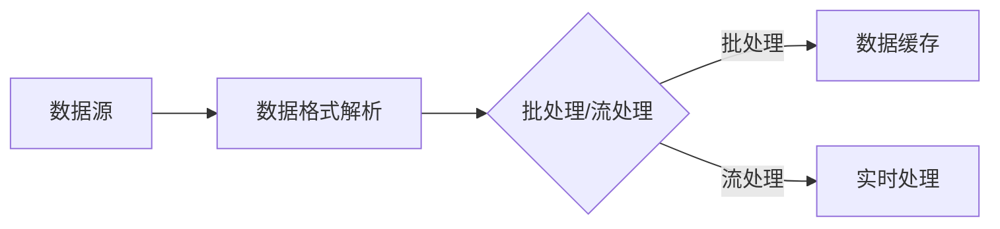
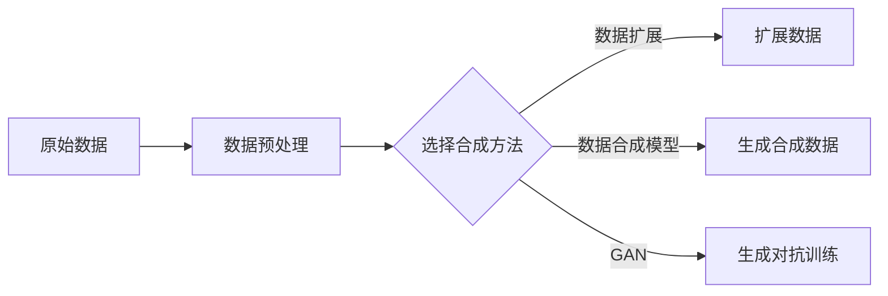

                 

关键词：AI数据集处理，数据加载，数据合成，数据生成，数据预处理

> 摘要：本文将深入探讨AI数据集处理的关键步骤，从数据加载、清洗、预处理到合成生成，详细解析每个阶段的技术和挑战。我们将讨论如何优化数据处理流程，提高模型的训练效果，并展望未来的发展方向。

## 1. 背景介绍

随着人工智能（AI）技术的迅猛发展，数据集的质量和规模对于AI模型的性能至关重要。无论是图像识别、自然语言处理（NLP）还是推荐系统，一个高质量、多样化和规模适中的数据集都是训练高性能模型的基础。然而，从现实世界获取的原始数据往往存在噪声、异常值和偏差，这需要通过一系列的数据处理步骤来清洗、转换和增强，以确保数据集的质量和一致性。

数据处理过程通常包括以下几个关键步骤：

1. **数据加载**：从各种数据源（如数据库、文件系统或网络）中加载原始数据。
2. **数据清洗**：识别和修正数据中的错误、缺失值和不一致性。
3. **数据预处理**：将数据转换为适合训练模型的格式，包括标准化、归一化、数据增强等。
4. **数据合成**：通过模拟或合成方法生成新的数据样本，以丰富数据集的多样性和平衡性。
5. **数据存储**：将处理后的数据集存储到高效的数据库或文件系统，以供后续模型训练和评估使用。

本文将重点关注数据加载和合成这两个环节，探讨其技术细节和挑战，并提出优化策略。

## 2. 核心概念与联系

### 数据加载

数据加载是将数据从其原始存储位置读取到内存或数据处理系统的过程。这个过程通常涉及以下核心概念：

- **数据源**：数据可以从多种数据源加载，包括关系数据库、NoSQL数据库、文件系统、API等。
- **数据格式**：常见的文件格式包括CSV、JSON、Parquet、HDF5等，每种格式都有其特定的解析方法和性能特点。
- **批处理与流处理**：批处理通常用于处理大量的静态数据，而流处理则适用于实时或近实时数据。

下面是一个简单的Mermaid流程图，展示了数据加载的基本步骤：



### 数据合成

数据合成是通过模拟或合成方法生成新的数据样本，以丰富数据集的多样性和平衡性。核心概念包括：

- **合成方法**：常见的合成方法有数据扩展、数据合成模型、GAN（生成对抗网络）等。
- **多样性**：合成数据应尽可能多样，以避免数据集中存在过于明显的偏差。
- **平衡性**：数据集中各类样本的分布应尽量平衡，以提高模型的泛化能力。

下面是一个Mermaid流程图，展示了数据合成的基本步骤：



## 3. 核心算法原理 & 具体操作步骤

### 3.1 算法原理概述

#### 数据加载

数据加载的核心算法通常涉及以下原理：

- **多线程读取**：利用多线程或并行处理技术提高数据加载速度。
- **缓冲区管理**：通过设置缓冲区，平衡读取和处理的节奏，避免数据处理速度成为瓶颈。
- **数据压缩与解压缩**：对于大体积数据，使用适当的压缩算法可以显著减少加载时间。

#### 数据合成

数据合成的算法原理包括：

- **同质合成**：基于现有样本生成相似的新样本，如数据扩展。
- **异质合成**：通过结合不同来源的数据生成新的样本，如GAN。
- **交互式合成**：用户可以参与合成过程，提供反馈以指导合成算法生成更符合预期的新样本。

### 3.2 算法步骤详解

#### 数据加载

数据加载的具体操作步骤如下：

1. **配置数据源**：确定数据源的类型和访问方式。
2. **初始化读取器**：根据数据格式初始化读取器。
3. **多线程读取**：使用多线程技术并行读取数据。
4. **缓冲区管理**：设置缓冲区大小，调整读取和处理的速度比。
5. **数据预处理**：在加载过程中进行必要的预处理，如数据清洗、格式转换等。

#### 数据合成

数据合成的具体操作步骤如下：

1. **数据预处理**：对原始数据进行预处理，包括数据清洗、归一化等。
2. **选择合成方法**：根据应用场景选择合适的数据合成方法。
3. **生成新样本**：根据选定的方法生成新样本。
4. **多样性评估**：评估生成数据的多样性，确保数据集的丰富性。
5. **平衡性调整**：根据样本分布情况调整合成参数，提高数据集的平衡性。

### 3.3 算法优缺点

#### 数据加载

- **优点**：高效、可靠的数据加载可以提高数据处理的整体效率。
- **缺点**：对于非常大或非常复杂的数据集，数据加载可能成为瓶颈。

#### 数据合成

- **优点**：可以显著增加数据集的规模和多样性，提高模型的泛化能力。
- **缺点**：合成的数据可能无法完全模拟真实数据的分布，存在一定偏差。

### 3.4 算法应用领域

- **数据加载**：广泛应用于机器学习、数据挖掘、推荐系统等领域。
- **数据合成**：在图像识别、语音识别、自然语言处理等领域具有广泛的应用。

## 4. 数学模型和公式 & 详细讲解 & 举例说明

### 4.1 数学模型构建

在数据加载和合成过程中，我们常常需要使用数学模型来描述数据处理的方法和策略。以下是一个简单的数学模型，用于描述数据加载过程中的缓冲区管理：

$$
\text{缓冲区大小} = k \cdot (\text{数据速率} - \text{处理速率})
$$

其中，$k$ 是一个常数，用于调整缓冲区的大小，以平衡数据读取和处理的速度。

### 4.2 公式推导过程

为了推导上述公式，我们首先定义以下变量：

- $\text{数据速率}$：单位时间内加载的数据量。
- $\text{处理速率}$：单位时间内处理的数据量。
- $\text{缓冲区大小}$：缓冲区中的数据量。

假设在时间 $t$ 时，缓冲区中的数据量为 $B(t)$，那么缓冲区的大小可以表示为：

$$
\text{缓冲区大小} = B(t)
$$

为了使缓冲区中的数据量保持稳定，我们希望数据速率等于处理速率，即：

$$
\text{数据速率} = \text{处理速率}
$$

如果处理速率小于数据速率，那么缓冲区会逐渐增加，可能导致处理延迟。如果处理速率大于数据速率，那么缓冲区会逐渐减少，可能导致数据饥饿。因此，我们需要一个平衡点，使得缓冲区中的数据量保持在一个合理的范围内。

我们可以使用以下公式来调整缓冲区大小：

$$
\text{缓冲区大小} = k \cdot (\text{数据速率} - \text{处理速率})
$$

其中，$k$ 是一个常数，用于调整缓冲区的大小，以平衡数据读取和处理的速度比。

### 4.3 案例分析与讲解

假设我们有一个数据集，数据速率为100 MB/s，处理速率为50 MB/s。我们可以使用上述公式计算缓冲区的大小：

$$
\text{缓冲区大小} = k \cdot (100 \text{ MB/s} - 50 \text{ MB/s}) = 50k \text{ MB}
$$

假设 $k=2$，那么缓冲区的大小为：

$$
\text{缓冲区大小} = 50 \text{ MB} \cdot 2 = 100 \text{ MB}
$$

这意味着在处理速率低于数据速率时，缓冲区将保持100 MB的数据量，以避免处理延迟。当处理速率提高到100 MB/s时，缓冲区将逐渐减少，以避免数据饥饿。

### 5. 项目实践：代码实例和详细解释说明

#### 5.1 开发环境搭建

在开始项目实践之前，我们需要搭建一个适合数据处理和模型训练的开发环境。以下是一个简单的环境搭建步骤：

1. 安装Python 3.8或更高版本。
2. 安装必要的依赖库，如NumPy、Pandas、Scikit-learn等。
3. 安装深度学习框架，如TensorFlow或PyTorch。
4. 配置GPU加速（如果使用），安装CUDA和cuDNN。

#### 5.2 源代码详细实现

以下是数据加载和数据合成的Python代码实例：

```python
import pandas as pd
import numpy as np
from sklearn.model_selection import train_test_split
from tensorflow.keras.preprocessing.image import ImageDataGenerator

# 数据加载
def load_data(file_path):
    df = pd.read_csv(file_path)
    return df

# 数据预处理
def preprocess_data(df):
    # 数据清洗、格式转换等
    # ...
    return df

# 数据合成
def generate_data(df, n_samples):
    datagen = ImageDataGenerator(
        rotation_range=20,
        width_shift_range=0.2,
        height_shift_range=0.2,
        horizontal_flip=True
    )
    generator = datagen.flow_from_dataframe(
        dataframe=df,
        x_col='image_path',
        y_col='label',
        target_size=(128, 128),
        batch_size=n_samples
    )
    return generator

# 实例化数据集
file_path = 'data.csv'
df = load_data(file_path)
df = preprocess_data(df)

# 分割数据集
train_df, test_df = train_test_split(df, test_size=0.2, random_state=42)

# 生成训练数据
train_generator = generate_data(train_df, n_samples=32)
test_generator = generate_data(test_df, n_samples=32)
```

#### 5.3 代码解读与分析

在上面的代码中，我们首先定义了三个函数：`load_data`、`preprocess_data` 和 `generate_data`。这些函数分别负责数据加载、预处理和数据合成。

- `load_data` 函数从CSV文件中加载数据，使用 Pandas 库的 `read_csv` 方法。
- `preprocess_data` 函数对加载数据进行清洗、格式转换等预处理操作。
- `generate_data` 函数使用 Keras 的 `ImageDataGenerator` 类进行数据合成。这里使用了数据增强技术，如随机旋转、水平翻转等，以增加数据的多样性。

在实例化数据集时，我们首先加载并预处理原始数据，然后使用 `train_test_split` 方法将数据集分为训练集和测试集。最后，我们调用 `generate_data` 函数生成训练数据和测试数据。

#### 5.4 运行结果展示

运行上述代码后，我们将生成一个新的训练数据集和测试数据集。这些数据集将包含通过数据合成方法生成的样本。我们可以使用以下代码来检查生成数据的质量：

```python
import matplotlib.pyplot as plt

# 查看生成的训练数据
for i in range(10):
    plt.subplot(2, 5, i+1)
    plt.imshow(train_generator[i][0])
    plt.title(train_generator[i][1])
plt.show()
```

这将展示生成的10个训练样本及其标签，通过可视化我们可以评估合成数据的质量和多样性。

## 6. 实际应用场景

数据集处理在AI应用中扮演着至关重要的角色。以下是一些典型的应用场景：

### 图像识别

在图像识别任务中，数据集的多样性和规模直接影响模型的性能。通过数据合成方法，如GAN，可以生成大量具有不同姿态、光照和背景的图像，从而提高模型的泛化能力。

### 自然语言处理

在NLP任务中，数据集的质量和多样性同样至关重要。数据合成可以用于生成具有不同语法结构、词汇和语义的文本，从而丰富数据集，提高模型的鲁棒性。

### 推荐系统

推荐系统需要处理大量用户行为数据。数据合成可以用于模拟不同的用户行为模式，从而生成新的用户行为数据，用于训练和评估推荐模型。

### 机器人学习

在机器人学习领域，数据集的质量直接影响机器人的决策能力和导航效果。通过数据合成，可以生成模拟不同环境和障碍物的场景，从而训练机器人应对复杂环境的能力。

## 7. 工具和资源推荐

为了高效地处理数据集，以下是一些推荐的工具和资源：

### 学习资源推荐

- 《深度学习》（Goodfellow, Bengio, Courville著）
- 《Python机器学习》（Raschka著）
- 《数据科学手册》（Monson-Haefel著）

### 开发工具推荐

- TensorFlow
- PyTorch
- Keras

### 相关论文推荐

- “Unsupervised Representation Learning with Deep Convolutional Generative Adversarial Networks” - Radford et al., 2015
- “Diving into Data Synthesis: A Survey of GANs in Text” - Zhang et al., 2019
- “Data Augmentation: A Complete Guide” - Fast.ai, 2020

## 8. 总结：未来发展趋势与挑战

### 8.1 研究成果总结

近年来，数据集处理技术在AI领域取得了显著进展。通过数据加载和合成的优化，我们能够更高效地处理大规模、多样化和高质量的数据集，从而提升AI模型的性能。特别是GAN等数据合成技术的出现，为数据集的扩展和多样化提供了强大的支持。

### 8.2 未来发展趋势

未来，数据集处理技术将继续朝着更高效、更智能和更自动化的方向发展。以下是一些发展趋势：

- **增强现实与虚拟现实**：数据合成技术将在增强现实和虚拟现实领域发挥重要作用，为这些应用提供逼真的虚拟环境和交互数据。
- **边缘计算**：随着边缘计算的兴起，数据集处理将更加注重实时性和低延迟，以满足边缘设备对数据处理的高要求。
- **隐私保护**：在处理敏感数据时，隐私保护将成为数据集处理的关键挑战和趋势。

### 8.3 面临的挑战

尽管数据集处理技术在不断进步，但仍面临以下挑战：

- **数据质量**：确保数据集的质量和一致性是数据集处理的首要任务，但随着数据来源的多样性和复杂性增加，数据质量保障变得更加困难。
- **计算资源**：数据合成通常需要大量的计算资源，特别是对于复杂的模型如GAN，如何高效地利用现有计算资源是一个重要问题。
- **算法偏差**：数据合成技术可能引入算法偏差，导致模型在特定场景下表现不佳。如何平衡多样性、平衡性和算法偏差之间的关系是一个重要课题。

### 8.4 研究展望

未来，数据集处理技术的研究将继续深入，特别是在以下几个方面：

- **高效合成算法**：开发更高效、更鲁棒的数据合成算法，以减少计算资源需求。
- **算法优化**：结合深度学习、强化学习等技术，优化数据集处理流程，提高数据处理效率。
- **跨领域应用**：探索数据集处理技术在金融、医疗、工业等领域的应用，解决特定领域的数据集处理问题。

## 9. 附录：常见问题与解答

### Q：数据合成是否会降低模型的泛化能力？

A：数据合成可以增加数据集的多样性和规模，从而提高模型的泛化能力。然而，如果合成的数据过于偏离真实数据的分布，可能会导致模型泛化能力下降。因此，在设计数据合成方法时，需要确保合成数据的多样性和分布与真实数据保持一致。

### Q：如何平衡数据合成和计算资源的使用？

A：可以在数据合成过程中使用动态调整策略，根据当前的计算资源状况调整合成参数。例如，当计算资源紧张时，可以减少合成数据的复杂度或降低合成频率。此外，利用分布式计算和GPU加速技术也可以提高数据合成的效率。

### Q：如何评估数据集的质量？

A：评估数据集的质量可以从多个角度进行，如数据的完整性、一致性、多样性和代表性。常见的方法包括数据分布分析、异常值检测和交叉验证等。通过综合评估指标，可以全面了解数据集的质量。

作者：禅与计算机程序设计艺术 / Zen and the Art of Computer Programming
```

