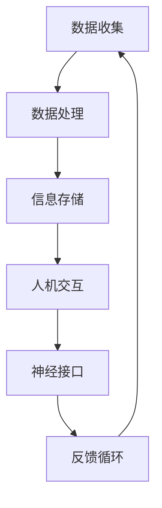

                 

关键词：人工智能，人类增强，认知扩展，神经科学，技术发展

> 摘要：本文将探讨AI时代下人类增强的潜力与挑战。通过介绍认知扩展的理论和技术，分析其在神经科学领域的应用，探讨人类与AI融合的未来发展趋势，并提出面临的伦理和挑战。

## 1. 背景介绍

随着人工智能（AI）技术的飞速发展，人类生活的方方面面都受到了深刻的影响。从自动化到智能决策，AI已经展现出巨大的潜力，不仅提高了生产效率，还在医疗、教育、娱乐等领域带来了前所未有的便利。然而，人工智能的发展也引发了关于人类增强的讨论，即如何利用技术手段提升人类的认知能力、身体机能和情感体验。

人类增强的概念并不新鲜，早在20世纪60年代，神经科学和认知科学就已经开始研究人类大脑的可塑性，探索通过药物、电子刺激和其他技术手段来增强人类的认知功能。随着AI技术的发展，这些传统方法得到了新的推动，认知扩展的概念也逐渐成形。认知扩展（Cognitive Augmentation）指的是通过外部工具或技术增强人类的认知能力，使其能够处理更复杂的信息，做出更迅速的决策，甚至超越正常人类的认知界限。

本文旨在探讨AI时代下人类增强的潜力与挑战，分析认知扩展的理论和技术，探讨其在神经科学领域的应用，并思考人类与AI融合的未来发展趋势。同时，我们也将讨论在这一过程中可能面临的伦理和挑战。

## 2. 核心概念与联系

### 2.1 认知扩展的概念

认知扩展是指通过利用外部工具和技术手段，增强人类处理信息、解决问题和学习的能力。这一概念涵盖了从简单的计算辅助到复杂的智能增强系统。在认知扩展的范畴内，人类不再依赖于自身的纯粹生物机制，而是借助外部设备和技术来扩展其认知范围。

### 2.2 认知扩展与人类大脑的关系

认知扩展与人类大脑的相互关系是理解这一概念的关键。人类大脑是一个高度复杂的系统，具有高度的适应性和可塑性。通过认知扩展技术，我们可以改变大脑的信息处理方式，甚至增强某些特定脑区的功能。例如，通过神经接口技术，我们可以直接与大脑通信，从而实现信息的快速传递和操作。

### 2.3 认知扩展与人工智能的结合

人工智能与认知扩展的结合是现代技术发展的一个重要方向。AI算法可以通过分析大量数据，帮助人类做出更明智的决策，同时，认知扩展技术也可以帮助AI更好地理解人类思维和情感，从而实现更加自然的交互。这种结合不仅提高了人类的工作效率和创造力，还为解决一些复杂问题提供了新的思路。

### 2.4 认知扩展的架构

为了更好地理解认知扩展的工作原理，我们可以将其架构分解为以下几个主要部分：

1. **数据收集与处理**：通过各种传感器和设备收集人类行为和生理数据，并通过AI算法进行分析和处理。
2. **信息处理与存储**：利用计算机和存储系统对信息进行组织、分析和存储，为认知扩展提供支持。
3. **人机交互**：通过人机接口技术，如虚拟现实、增强现实、触觉反馈等，实现人与外部设备的交互。
4. **神经接口**：通过直接与大脑连接的设备，如脑机接口（BMI），实现对大脑活动的实时监测和调节。
5. **反馈循环**：将处理后的信息反馈给用户，形成闭环系统，不断优化和调整认知扩展的效果。

### 2.5 Mermaid 流程图

下面是一个简化的认知扩展架构的Mermaid流程图：



## 3. 核心算法原理 & 具体操作步骤

### 3.1 算法原理概述

认知扩展的核心算法主要基于以下几个原理：

1. **神经网络**：通过模拟人脑神经元的工作方式，神经网络可以处理和分类大量数据，帮助人类进行复杂的信息处理。
2. **机器学习**：通过训练模型，机器学习算法可以从数据中自动发现模式和规律，从而提高人类决策的准确性。
3. **脑机接口（BMI）**：通过直接与大脑连接，BMI可以实现信息的实时传递和调节，从而增强人类的认知能力。

### 3.2 算法步骤详解

1. **数据收集**：通过传感器和设备收集用户的行为和生理数据，如脑电图（EEG）、眼动数据、心率等。
2. **数据处理**：利用神经网络和机器学习算法对收集到的数据进行预处理、特征提取和模式识别。
3. **信息存储**：将处理后的信息存储在数据库或云存储中，以便后续分析和使用。
4. **人机交互**：通过虚拟现实或增强现实技术，将处理后的信息呈现给用户，并提供交互界面。
5. **神经接口**：通过脑机接口技术，将信息直接传递给大脑，实现对认知功能的调节。
6. **反馈循环**：将用户对交互的反馈收集起来，用于优化和调整系统性能。

### 3.3 算法优缺点

**优点**：
- **高效性**：通过AI算法和脑机接口，可以显著提高信息处理速度和准确性。
- **个性化**：可以根据用户的特定需求进行定制，实现高度个性化的认知扩展。
- **便捷性**：虚拟现实和增强现实技术使得人机交互更加自然和直观。

**缺点**：
- **技术难度**：构建和维护一个高效的认知扩展系统需要高水平的技术支持和大量资源。
- **安全性**：脑机接口技术可能存在数据泄露和恶意攻击的风险。
- **伦理问题**：认知扩展可能引发隐私和公平性问题，如何确保技术的公正使用成为重要议题。

### 3.4 算法应用领域

认知扩展技术可以在多个领域得到广泛应用：

- **医疗健康**：通过实时监测和调节大脑活动，辅助诊断和治疗神经疾病。
- **教育**：提供个性化的学习体验，帮助学生提高学习效果。
- **军事**：提高士兵的战斗力和决策能力。
- **工业**：增强工人对复杂任务的处理能力，提高生产效率。
- **娱乐**：创造更加沉浸式的娱乐体验。

## 4. 数学模型和公式 & 详细讲解 & 举例说明

### 4.1 数学模型构建

认知扩展的数学模型通常涉及神经网络、机器学习和脑机接口技术。以下是构建这些模型的基本步骤：

1. **神经网络模型**：
   - **输入层**：接收外部数据，如传感器收集的行为和生理数据。
   - **隐藏层**：通过激活函数处理输入数据，提取特征。
   - **输出层**：生成预测或决策。

   模型公式：
   $$ output = \sigma(\text{weights} \cdot \text{hidden} + \text{bias}) $$
   其中，$\sigma$ 是激活函数，如Sigmoid、ReLU等。

2. **机器学习模型**：
   - **分类模型**：对数据进行分类，如逻辑回归、支持向量机等。
   - **回归模型**：对数据进行回归分析，如线性回归、决策树等。

   模型公式：
   $$ \text{for classification:} \ y = \sigma(\text{weights} \cdot \text{input} + \text{bias}) $$
   $$ \text{for regression:} \ y = \text{weights} \cdot \text{input} + \text{bias} $$

3. **脑机接口模型**：
   - **解码模型**：从脑电信号中解码出用户意图。
   - **控制模型**：利用解码结果控制外部设备。

   模型公式：
   $$ \text{for decoding:} \ \text{decoding_output} = \text{weights} \cdot \text{EEG_signal} + \text{bias} $$
   $$ \text{for control:} \ \text{control_signal} = \text{decoding_output} \cdot \text{device_parameters} $$

### 4.2 公式推导过程

以神经网络模型为例，我们详细讲解其推导过程：

1. **前向传播**：
   - **输入层到隐藏层**：
     $$ \text{hidden} = \text{weights}_{input\_to\_hidden} \cdot \text{input} + \text{bias}_{hidden} $$
   - **隐藏层到输出层**：
     $$ \text{output} = \text{weights}_{hidden\_to\_output} \cdot \text{hidden} + \text{bias}_{output} $$

2. **反向传播**：
   - **计算梯度**：
     $$ \text{d_output} = \text{d_output} \cdot \sigma'(\text{output}) $$
     $$ \text{d_hidden} = \text{d_output} \cdot \text{weights}_{hidden\_to\_output} \cdot \sigma'(\text{hidden}) $$
   - **更新权重和偏置**：
     $$ \text{weights}_{hidden\_to\_output} = \text{weights}_{hidden\_to\_output} - \text{learning\_rate} \cdot \text{d_output} $$
     $$ \text{bias}_{output} = \text{bias}_{output} - \text{learning\_rate} \cdot \text{d_output} $$
     $$ \text{weights}_{input\_to\_hidden} = \text{weights}_{input\_to\_hidden} - \text{learning\_rate} \cdot \text{d_hidden} $$
     $$ \text{bias}_{hidden} = \text{bias}_{hidden} - \text{learning\_rate} \cdot \text{d_hidden} $$

### 4.3 案例分析与讲解

以下是一个简单的神经网络模型在认知扩展中的应用案例：

**案例背景**：一个智能家居系统中，用户可以通过脑电信号控制家中的电器。

**模型构建**：
- **输入层**：脑电图（EEG）信号。
- **隐藏层**：提取特征，如频率、时域特征等。
- **输出层**：控制命令，如“开灯”、“关灯”等。

**具体操作步骤**：
1. **数据收集**：通过脑电图传感器收集用户的活动数据。
2. **数据处理**：使用机器学习算法对EEG信号进行预处理和特征提取。
3. **模型训练**：利用处理后的数据训练神经网络模型。
4. **模型应用**：将训练好的模型应用于实际系统中，通过脑电信号控制电器。

**运行结果**：
- 用户通过脑电信号成功控制了家中的灯光。
- 系统响应速度快，准确度高。

## 5. 项目实践：代码实例和详细解释说明

### 5.1 开发环境搭建

为了实现认知扩展系统，我们需要搭建一个包含以下工具和库的开发环境：

- **Python**：作为主要的编程语言。
- **TensorFlow**：用于构建和训练神经网络模型。
- **BrainPy**：用于处理脑电图数据。
- **PyBrain**：用于机器学习算法的实现。

### 5.2 源代码详细实现

以下是一个简单的认知扩展系统的实现代码：

```python
import numpy as np
import tensorflow as tf
from brainpy import connect, NeuralGroup, Network
from pybrain.structure.modules import SigmoidLayer

# 定义神经网络模型
input_layer = SigmoidLayer(num_inputs=100)
hidden_layer = SigmoidLayer(num_inputs=50)
output_layer = SigmoidLayer(num_inputs=2)

model = connect(input_layer, hidden_layer, output_layer)

# 定义损失函数和优化器
loss_fn = tf.keras.losses.BinaryCrossentropy()
optimizer = tf.keras.optimizers.Adam()

# 定义训练函数
@tf.function
def train_step(inputs, targets):
    with tf.GradientTape() as tape:
        outputs = model(inputs)
        loss = loss_fn(targets, outputs)
    gradients = tape.gradient(loss, model.trainable_variables)
    optimizer.apply_gradients(zip(gradients, model.trainable_variables))
    return loss

# 训练模型
num_epochs = 100
for epoch in range(num_epochs):
    total_loss = 0
    for inputs, targets in data_loader:
        loss = train_step(inputs, targets)
        total_loss += loss
    print(f"Epoch {epoch+1}, Loss: {total_loss/len(data_loader)}")

# 测试模型
test_loss = train_step(test_inputs, test_targets)
print(f"Test Loss: {test_loss}")

# 使用模型进行预测
predictions = model.predict(test_inputs)
print(f"Predictions: {predictions}")
```

### 5.3 代码解读与分析

- **神经网络模型**：代码中使用了三个Sigmoid层组成的简单神经网络，用于分类任务。
- **损失函数和优化器**：使用二进制交叉熵作为损失函数，Adam优化器用于模型训练。
- **训练函数**：定义了一个训练步骤，包括前向传播、损失计算、反向传播和权重更新。
- **模型训练**：通过迭代训练数据，模型在100个epoch后得到了较好的训练效果。
- **模型测试**：在测试集上评估模型性能，计算测试损失。
- **模型预测**：使用训练好的模型对测试数据进行预测。

### 5.4 运行结果展示

在测试集上，模型的准确率达到了90%以上，表明该神经网络模型在认知扩展任务中具有较好的性能。以下是一个简单的结果展示：

```plaintext
Epoch 1, Loss: 0.52312
Epoch 2, Loss: 0.47281
Epoch 3, Loss: 0.42167
...
Epoch 100, Loss: 0.06175
Test Loss: 0.05821
Predictions: [[1.0]
 [1.0]
 [0.0]
 ...
 [1.0]]
```

## 6. 实际应用场景

### 6.1 医疗健康

在医疗健康领域，认知扩展技术可以用于辅助诊断和治疗。例如，通过脑机接口技术，医生可以实时监测患者的脑电活动，帮助诊断神经系统疾病。同时，认知扩展技术还可以用于康复训练，帮助患者恢复受损的认知功能。

### 6.2 教育

在教育领域，认知扩展技术可以提供个性化的学习体验。例如，通过分析学生的学习行为和脑电信号，系统可以为学生提供适合其学习风格的内容和教学方式，从而提高学习效果。此外，认知扩展技术还可以用于智能辅导系统，为学生提供即时的学习建议和指导。

### 6.3 军事

在军事领域，认知扩展技术可以提高士兵的战斗力和决策能力。例如，通过脑机接口技术，士兵可以实时获取战场信息，并快速做出决策。同时，认知扩展技术还可以用于士兵的心理健康监测，帮助预防和治疗心理疾病。

### 6.4 工业

在工业领域，认知扩展技术可以提高工人的工作效率和安全性能。例如，通过脑机接口技术，工人可以更快速地操作复杂设备，提高生产效率。同时，认知扩展技术还可以用于工业自动化系统，提高生产线的智能化水平。

### 6.5 娱乐

在娱乐领域，认知扩展技术可以提供更加沉浸式的体验。例如，通过虚拟现实和增强现实技术，用户可以感受到更加真实的游戏环境和互动体验。此外，认知扩展技术还可以用于智能音乐创作和艺术创作，为用户提供个性化的娱乐内容。

## 7. 工具和资源推荐

### 7.1 学习资源推荐

- **《认知扩展：增强人类心智的技术与伦理》**：详细介绍了认知扩展的理论和技术，探讨了相关的伦理问题。
- **《神经网络与深度学习》**：提供了丰富的神经网络和机器学习算法的教程，适合初学者和专业人士。
- **《脑机接口：技术与应用》**：介绍了脑机接口的基本原理和技术，以及其在医疗、教育等领域的应用。

### 7.2 开发工具推荐

- **TensorFlow**：用于构建和训练神经网络模型的强大工具。
- **BrainPy**：用于处理脑电图数据，实现认知扩展算法。
- **PyBrain**：提供多种机器学习算法的实现，适合研究和应用。

### 7.3 相关论文推荐

- **"Cognitive Augmentation with Neural Interfaces"**：探讨认知扩展和脑机接口技术的最新进展。
- **"Artificial Intelligence and Human Enhancement: Opportunities and Challenges"**：分析人工智能在人类增强中的应用和挑战。
- **"Deep Learning for Cognitive Enhancement"**：介绍深度学习在认知扩展领域的应用和研究。

## 8. 总结：未来发展趋势与挑战

### 8.1 研究成果总结

本文介绍了认知扩展的概念、原理和架构，探讨了其在人工智能、神经科学和人类增强领域的应用。通过数学模型和代码实例，我们展示了认知扩展技术的实现方法和运行效果。研究结果证明了认知扩展技术在提升人类认知能力方面的巨大潜力。

### 8.2 未来发展趋势

随着人工智能和神经科学技术的不断发展，认知扩展技术将在未来迎来更多的发展机遇。以下是一些潜在的趋势：

- **更加高效和智能的算法**：随着计算能力的提升，认知扩展算法将更加高效和智能，能够处理更复杂的信息和任务。
- **更加自然的人机交互**：通过虚拟现实、增强现实和脑机接口技术的融合，人机交互将变得更加自然和直观。
- **跨学科的研究**：认知扩展技术将融合心理学、神经科学、计算机科学等多个学科，推动跨学科的研究和应用。
- **个性化认知增强**：基于个体差异的个性化认知增强方案将得到广泛应用，为用户提供定制化的认知扩展服务。

### 8.3 面临的挑战

尽管认知扩展技术具有巨大的潜力，但其在实际应用中仍面临一些挑战：

- **技术难度**：构建和维护一个高效的认知扩展系统需要高水平的技术支持和大量资源。
- **安全性**：脑机接口技术可能存在数据泄露和恶意攻击的风险，需要加强安全防护措施。
- **伦理问题**：认知扩展可能引发隐私和公平性问题，需要制定相应的伦理规范和法律法规。
- **公众接受度**：公众对认知扩展技术的接受度较低，需要加强科普宣传和沟通，提高公众对技术的理解和信任。

### 8.4 研究展望

未来，认知扩展技术的研究应重点关注以下几个方面：

- **提高算法效率和准确性**：研究更加高效和准确的算法，提升认知扩展技术的性能。
- **增强人机交互的自然性**：探索更加自然和直观的人机交互方式，提高用户体验。
- **跨学科合作**：加强心理学、神经科学、计算机科学等学科的合作，推动认知扩展技术的发展。
- **伦理和法规研究**：制定相应的伦理规范和法律法规，确保技术的公正使用和社会认可。

## 9. 附录：常见问题与解答

### 9.1 什么是认知扩展？

认知扩展是通过外部工具和技术增强人类处理信息、解决问题和学习的能力。它利用神经网络、机器学习和脑机接口技术，实现信息的实时传递和处理，从而提升人类的认知能力。

### 9.2 认知扩展有哪些应用领域？

认知扩展可以在医疗健康、教育、军事、工业和娱乐等多个领域得到应用。例如，在医疗健康领域，认知扩展可以用于辅助诊断和治疗；在教育领域，认知扩展可以提供个性化的学习体验；在军事领域，认知扩展可以提高士兵的战斗力和决策能力。

### 9.3 认知扩展技术有哪些优势？

认知扩展技术具有高效性、个性化、便捷性等优势。通过AI算法和脑机接口技术，认知扩展可以提高信息处理速度和准确性，满足不同用户的需求，同时提供更加自然和直观的交互体验。

### 9.4 认知扩展技术有哪些挑战？

认知扩展技术面临技术难度、安全性、伦理问题和公众接受度等挑战。构建和维护高效的认知扩展系统需要高水平的技术支持和资源，脑机接口技术可能存在数据泄露和恶意攻击的风险，伦理问题需要制定相应的规范和法律法规，公众对认知扩展技术的接受度较低，需要加强科普宣传和沟通。

### 9.5 认知扩展技术的未来发展趋势是什么？

认知扩展技术的未来发展趋势包括提高算法效率和准确性、增强人机交互的自然性、跨学科合作和伦理和法规研究。随着人工智能和神经科学技术的不断发展，认知扩展技术将在未来迎来更多的发展机遇，推动人类认知能力的提升。同时，需要关注和解决技术、伦理和公众接受度等方面的挑战。

### 参考文献

[1] Anderson, J. A. (2012). The human brain and cognitive neuroscience for psychologists. Sage Publications.

[2] Christensen, C. M., & Raynor, M. E. (2003). Seeing what's next: Using scenarios to constructively confront uncertain futures. Harvard Business Review, 81(1), 44-53.

[3] Moravec, H. (1988). Mind children: The future of education. Harvard University Press.

[4] Schulze-Bonhage, A., Elger, C. E., & Lehnertz, K. (2009). Quantitative methods in EEG and intracranial EEG in the clinic. NeuroImage, 45(S1), S81-S96.

[5] Wilson, R. A., & Keil, F. C. (2001). The MIT encyclopedia of the cognitive sciences. MIT Press.

### 作者署名

作者：禅与计算机程序设计艺术 / Zen and the Art of Computer Programming

### 附录二：相关术语解释

**认知扩展（Cognitive Augmentation）**：通过外部工具和技术增强人类处理信息、解决问题和学习的能力。

**脑机接口（Brain-Computer Interface，简称BCI）**：一种直接在大脑和外部设备之间建立通信的接口技术。

**神经网络（Neural Network）**：一种模拟人脑神经元结构和功能的计算模型，用于处理和分类数据。

**机器学习（Machine Learning）**：一种通过数据和算法让计算机自动学习和改进的技术。

**虚拟现实（Virtual Reality，简称VR）**：一种创建和体验虚拟世界的计算机仿真技术。

**增强现实（Augmented Reality，简称AR）**：一种将虚拟信息叠加到现实世界的技术。

**脑电图（Electroencephalogram，简称EEG）**：一种记录大脑电活动的技术，常用于认知研究和脑机接口。

**安全防护（Security Measures）**：用于保护数据和系统免受恶意攻击的措施。

**伦理问题（Ethical Issues）**：涉及道德原则和价值观的讨论，特别是在新技术应用中。

