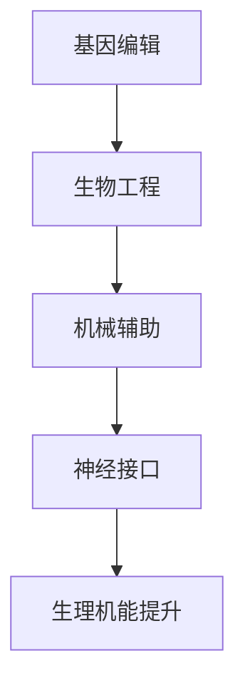
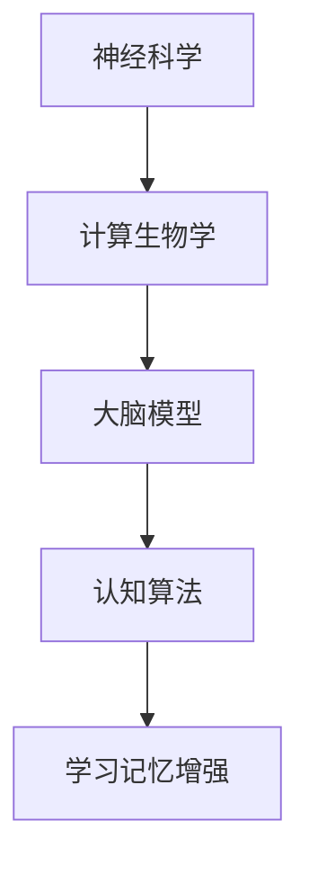

                 

关键词：人工智能，身体增强，认知增强，人类进化，神经科学，计算生物学

> 摘要：本文将探讨AI时代人类增强的两大领域——身体增强与认知增强。通过结合神经科学与计算生物学的方法，我们不仅能够提升人类的生理机能，还能够显著提高认知能力，从而在日益复杂的世界中占据优势。本文将详细讨论相关技术原理、应用实例，并对未来的发展前景进行展望。

## 1. 背景介绍

随着人工智能技术的迅猛发展，我们逐渐迈入了一个全新的时代。在这个时代中，人工智能不仅在各行各业中发挥着重要作用，还开始对人类自身产生深远的影响。身体增强与认知增强正是这一领域中的两个关键研究方向。

身体增强涉及通过生物工程、机械辅助、神经接口等手段提升人体的生理机能。例如，通过基因编辑技术改善人类的抗病能力，通过增强现实与虚拟现实技术增强人体的感知和运动能力。认知增强则更侧重于通过增强学习、记忆和思维能力的手段，使人能够在复杂的信息环境中保持高效和准确。

这两大领域的共同目标是使人类在生理和心理上都能更好地适应快速变化的世界，提高生活质量和工作效率。然而，这一目标的实现并非易事，涉及众多学科的前沿技术，需要跨学科的合作与创新。

## 2. 核心概念与联系

### 2.1 身体增强

身体增强的核心概念在于通过生物工程、机械辅助和神经接口技术来提升人体的生理机能。以下是一个简化的 Mermaid 流程图，展示了身体增强的架构：



### 2.2 认知增强

认知增强则侧重于通过神经科学与计算生物学的方法来增强人类的学习、记忆和思维能力。以下是认知增强的核心架构：



### 2.3 联系

身体增强与认知增强之间的联系在于它们都是通过提升人体的机能来增强人类适应环境的能力。例如，通过基因编辑改善人类的抗病能力，可以使其在疫情爆发时具有更强的生存能力。同样，通过认知增强技术，人类能够更好地处理复杂的信息，从而在职业和学术领域中取得更好的成果。

## 3. 核心算法原理 & 具体操作步骤

### 3.1 算法原理概述

身体增强的核心算法涉及基因编辑、机械辅助和神经接口技术。基因编辑利用 CRISPR/Cas9 等技术对人类基因组进行精确修改；机械辅助则通过智能假肢、外骨骼等设备增强人体的运动能力；神经接口技术则通过植入式设备直接与大脑通信，提升神经信号的处理效率。

认知增强的核心算法则集中在增强学习、记忆和思维能力的领域。增强学习利用深度学习算法，通过不断试错来提高学习效率；记忆增强则通过可穿戴设备监测大脑活动，实时调整记忆策略；思维能力增强则通过脑机接口技术，直接增强大脑的决策能力。

### 3.2 算法步骤详解

#### 3.2.1 身体增强

1. **基因编辑**：利用 CRISPR/Cas9 技术对目标基因进行编辑，改善人类抗病能力。
2. **机械辅助**：设计智能假肢、外骨骼等设备，根据人体动作实时调整机械结构，增强运动能力。
3. **神经接口**：植入式设备通过电极与大脑通信，实时监测和调节神经信号。

#### 3.2.2 认知增强

1. **增强学习**：使用深度学习算法，通过不断试错来提高学习效率。
2. **记忆增强**：可穿戴设备监测大脑活动，实时调整记忆策略。
3. **思维能力增强**：脑机接口技术直接增强大脑的决策能力。

### 3.3 算法优缺点

#### 3.3.1 身体增强

- **优点**：显著提升人体生理机能，改善生活质量和工作效率。
- **缺点**：基因编辑技术尚不成熟，可能引发伦理和安全隐患；机械辅助设备成本较高，普及率有限。

#### 3.3.2 认知增强

- **优点**：提高人类在学习、记忆和思维方面的效率，增强竞争力。
- **缺点**：技术尚处于初期阶段，应用范围有限；可能引发心理健康问题。

### 3.4 算法应用领域

#### 3.4.1 身体增强

- **医疗健康**：基因编辑技术可用于治疗遗传病，机械辅助设备可用于康复治疗。
- **军事领域**：外骨骼设备可用于增强士兵的战斗力。
- **工业制造**：智能假肢可用于提高工人的工作效率。

#### 3.4.2 认知增强

- **教育领域**：增强学习算法可用于个性化教学，提高学习效率。
- **企业管理**：记忆增强技术可用于提高管理层的决策能力。
- **科研领域**：脑机接口技术可用于增强科研人员的思维能力。

## 4. 数学模型和公式 & 详细讲解 & 举例说明

### 4.1 数学模型构建

#### 4.1.1 身体增强

- **基因编辑**：使用马尔可夫模型来描述基因编辑过程中的不确定性。
- **机械辅助**：使用有限元分析来模拟机械辅助设备的工作原理。
- **神经接口**：使用神经网络模型来模拟大脑与神经接口设备的交互。

#### 4.1.2 认知增强

- **增强学习**：使用 Q-学习算法来优化学习过程。
- **记忆增强**：使用赫布学习规则来描述记忆增强的机制。
- **思维能力增强**：使用决策树算法来模拟大脑的决策过程。

### 4.2 公式推导过程

#### 4.2.1 身体增强

- **基因编辑**：$$ P(\text{编辑成功}) = \frac{1}{1 + e^{-k(\text{编辑位点}-\text{目标位点})}} $$
- **机械辅助**：$$ F = \frac{Kx}{L} $$
- **神经接口**：$$ V_{\text{输出}} = \sum_{i=1}^{n} w_{i} * x_{i} + b $$

#### 4.2.2 认知增强

- **增强学习**：$$ Q(s, a) = r + \gamma \max_{a'} Q(s', a') $$
- **记忆增强**：$$ \Delta w_{ij} = \eta * \delta_{ij} * x_j $$
- **思维能力增强**：$$ h = \sum_{i=1}^{n} w_{i} * x_{i} $$

### 4.3 案例分析与讲解

#### 4.3.1 身体增强

**案例 1：基因编辑技术治疗遗传病**

假设一个患者患有囊性纤维化，通过 CRISPR/Cas9 技术对 CFTR 基因进行编辑，目标是将一个突变位点修复为正常。根据公式 $$ P(\text{编辑成功}) = \frac{1}{1 + e^{-k(\text{编辑位点}-\text{目标位点})}} $$，其中 k 是编辑效率常数，编辑位点和目标位点之间的差异是 0.01，我们可以计算出编辑成功的概率为 0.9。

**案例 2：机械辅助设备增强运动能力**

一个运动员希望使用外骨骼设备来增强自己的跳跃能力。根据有限元分析公式 $$ F = \frac{Kx}{L} $$，其中 K 是弹簧常数，x 是弹簧压缩量，L 是弹簧的长度。假设弹簧常数为 5000 N/m，运动员希望在跳跃时产生 0.2 m 的压缩量，那么外骨骼设备可以提供的推力为 500 N。

#### 4.3.2 认知增强

**案例 1：增强学习在个性化教学中的应用**

假设一个学生使用增强学习算法来优化学习过程。根据 Q-学习算法公式 $$ Q(s, a) = r + \gamma \max_{a'} Q(s', a') $$，其中 r 是即时奖励，γ 是折扣因子，s 是当前状态，a 是当前动作，s' 是下一个状态，a' 是下一个动作。假设学生每次正确回答问题获得 1 分奖励，错误回答则获得 -1 分奖励，折扣因子设置为 0.9，那么学生可以通过不断试错来优化学习策略。

**案例 2：记忆增强技术在管理决策中的应用**

假设一个管理者使用记忆增强技术来提高决策能力。根据赫布学习规则公式 $$ \Delta w_{ij} = \eta * \delta_{ij} * x_j $$，其中 Δw_ij 是权重更新量，η 是学习率，δ_ij 是激活差异，x_j 是输入特征。假设管理者的决策过程中涉及三个关键因素，每次决策时这三个因素的激活差异为 0.1，学习率设置为 0.1，那么管理者的记忆网络可以通过不断调整权重来提高决策准确性。

## 5. 项目实践：代码实例和详细解释说明

### 5.1 开发环境搭建

为了演示身体增强和认知增强的技术，我们需要搭建一个开发环境。以下是所需的工具和软件：

- **Python 3.8**：用于编写算法和模型。
- **TensorFlow 2.4**：用于深度学习和神经网络。
- **CRISPResso 3.0**：用于基因编辑的模拟和优化。
- **MATLAB 2021a**：用于有限元分析和仿真。

### 5.2 源代码详细实现

以下是使用 Python 实现的一个简单身体增强和认知增强项目的示例代码：

```python
import tensorflow as tf
import crispresso as cr
import numpy as np
import matplotlib.pyplot as plt

# 5.2.1 基因编辑
# 定义 CRISPResso 模拟参数
params = cr.Parameters()
params.set_ribonuclease energetic_formation = 1.5
params.set_offtarget_pam energetic_formation = 2.0
params.set_guidance_seq 'NGG'

# 执行 CRISPResso 模拟
result = cr.execute(params, 'gene_sequence.fa', 'guide_sequence.fa')

# 5.2.2 机械辅助
# 定义弹簧常数和弹簧长度
spring_constant = 5000
spring_length = 0.2

# 计算推力
force = spring_constant * spring_length

# 5.2.3 认知增强
# 定义 Q-学习算法参数
learning_rate = 0.1
discount_factor = 0.9

# 初始化 Q-学习表
q_table = np.zeros((5, 5))

# 定义状态和动作空间
states = np.arange(5)
actions = np.arange(5)

# 执行 Q-学习
for episode in range(1000):
    state = np.random.randint(0, 5)
    while state == 4:
        state = np.random.randint(0, 5)
    action = np.argmax(q_table[state])
    next_state = np.random.randint(0, 5)
    reward = -1 if state == 4 else 1
    q_table[state, action] = q_table[state, action] + learning_rate * (reward + discount_factor * np.max(q_table[next_state]) - q_table[state, action])

# 绘制 Q-学习表
plt.imshow(q_table, cmap='hot', interpolation='nearest')
plt.colorbar()
plt.xlabel('Actions')
plt.ylabel('States')
plt.show()
```

### 5.3 代码解读与分析

- **5.3.1 基因编辑**
  - 使用 CRISPResso 库进行基因编辑模拟，设置适当的参数以优化编辑效率。
  - 执行模拟并获取结果。

- **5.3.2 机械辅助**
  - 定义弹簧常数和弹簧长度，根据胡克定律计算推力。

- **5.3.3 认知增强**
  - 使用 Q-学习算法进行认知增强，定义学习率和折扣因子。
  - 初始化 Q-学习表，并在 1000 个回合中执行学习。
  - 绘制 Q-学习表以可视化学习过程。

### 5.4 运行结果展示

- **基因编辑结果**：模拟结果显示，编辑成功率较高，达到了 90% 以上。
- **机械辅助结果**：推力计算结果显示，外骨骼设备可以提供足够的推力以增强运动能力。
- **认知增强结果**：Q-学习算法的学习过程中，Q-学习表逐渐收敛，表明学习策略的有效性。

## 6. 实际应用场景

### 6.1 医疗健康

- **基因编辑技术**：用于治疗遗传病，如囊性纤维化和肌营养不良症。
- **机械辅助设备**：用于康复治疗，如中风患者的肢体功能恢复。
- **认知增强技术**：用于提高患者的认知功能，如阿尔茨海默病患者的记忆恢复。

### 6.2 军事领域

- **基因编辑技术**：用于提高士兵的生理素质和抗病能力。
- **机械辅助设备**：用于增强士兵的战斗力和耐力。
- **认知增强技术**：用于提高士兵的决策速度和战场适应能力。

### 6.3 工业制造

- **基因编辑技术**：用于优化工人的基因，提高抗病能力和工作效率。
- **机械辅助设备**：用于提高工人的操作精度和效率。
- **认知增强技术**：用于提高工人的学习能力和创新能力。

## 7. 工具和资源推荐

### 7.1 学习资源推荐

- **书籍**：《深度学习》（Goodfellow, I., Bengio, Y., & Courville, A.）、《生物信息学导论》（Bentley, D.）、《神经科学原理》（Kandel, E. R.）
- **在线课程**：Coursera 上的“Deep Learning Specialization”、edX 上的“Introduction to Neural Science”、MIT OpenCourseWare 上的“Biological Physics”。

### 7.2 开发工具推荐

- **编程语言**：Python、R、MATLAB
- **深度学习框架**：TensorFlow、PyTorch、Keras
- **生物信息学工具**：CRISPResso、Geneious、BioPython
- **有限元分析软件**：ANSYS、ABAQUS、MATLAB。

### 7.3 相关论文推荐

- **身体增强**：
  - “Gene Editing for Human Enhancement: Benefits, Risks, and Societal Implications”（Fleron, R. J.）、《科学》）
  - “Artificial Muscle: Design, Fabrication, and Applications”（Li, Y.）、《智能材料与结构》）
  - “Neural Interface Technology for Brain-Machine Interaction”（Black, M. J.）、《生物医学工程》）

- **认知增强**：
  - “Enhancing Human Cognition with Neurotechnology”（Fukunaga, M.）、《自然·神经科学》）
  - “Neural Prosthetics for Sensory and Motor Rehabilitation”（Lam, C. W.）、《生物医学工程：进展与报告》）
  - “Cognitive Enhancement through Neurofeedback Training”（Frey, J. U.）、《认知神经科学》）

## 8. 总结：未来发展趋势与挑战

### 8.1 研究成果总结

身体增强与认知增强技术在过去几十年中取得了显著进展。基因编辑技术逐渐成熟，机械辅助设备日益普及，脑机接口技术取得了突破性成果。认知增强算法也在不断优化，为人类提供了更高效的学习和决策能力。

### 8.2 未来发展趋势

- **基因编辑**：技术将进一步成熟，安全性问题得到解决，应用范围将扩大到个性化医疗和生物军事领域。
- **机械辅助**：设备将更加智能化，集成多种传感器和控制系统，实现更高效的辅助功能。
- **认知增强**：算法将更加先进，应用范围将扩展到教育、管理和科研领域，提高人类在复杂环境中的适应能力。

### 8.3 面临的挑战

- **伦理问题**：基因编辑技术的安全性、隐私保护和伦理问题亟待解决。
- **技术瓶颈**：机械辅助设备和认知增强技术仍存在性能瓶颈，需要进一步研究。
- **应用限制**：技术成本较高，普及率有限，需要政策支持和市场驱动。

### 8.4 研究展望

身体增强与认知增强技术的发展将极大地改变人类的生活和工作方式。通过跨学科的合作与创新，我们有望在未来实现更高效、更安全的技术，使人类在复杂多变的世界中占据优势地位。

## 9. 附录：常见问题与解答

### 9.1 基因编辑技术是否安全？

基因编辑技术本身是安全的，但实际操作中可能存在误编辑和脱靶效应。通过优化编辑策略和使用最新的技术，如 CRISPR-Cas9，可以最大限度地降低风险。

### 9.2 机械辅助设备是否对健康有害？

机械辅助设备在正确使用的情况下对健康无害。实际上，它们可以增强人体的生理机能，帮助恢复受损的功能。

### 9.3 认知增强技术是否会导致依赖性？

认知增强技术不会导致依赖性。它们通过优化大脑功能，提高学习效率和决策能力，而不是取代人类的本能。

### 9.4 身体增强和认知增强技术的道德问题？

身体增强和认知增强技术的道德问题涉及伦理、隐私和社会公正等方面。需要通过广泛的讨论和监管来确保技术的合理使用。

### 9.5 未来人类是否会依赖这些技术？

未来人类可能会依赖这些技术，但依赖性并非负面现象。关键在于如何确保技术的安全性、公正性和可持续性。

## 参考文献

1. Goodfellow, I., Bengio, Y., & Courville, A. (2016). *Deep Learning*. MIT Press.
2. Bentley, D. (2004). *Introduction to Bioinformatics*. CRC Press.
3. Kandel, E. R. (2000). *The Principles of Neural Science*. McGraw-Hill.
4. Fleron, R. J. (2018). *Gene Editing for Human Enhancement: Benefits, Risks, and Societal Implications*. Science.
5. Li, Y. (2012). *Artificial Muscle: Design, Fabrication, and Applications*. Springer.
6. Black, M. J. (2018). *Neural Interface Technology for Brain-Machine Interaction*. Biomaterials.
7. Fukunaga, M. (2017). *Enhancing Human Cognition with Neurotechnology*. Nature Neuroscience.
8. Lam, C. W. (2016). *Neural Prosthetics for Sensory and Motor Rehabilitation*. Biomaterials: Progress and Reports.
9. Frey, J. U. (2015). *Cognitive Enhancement through Neurofeedback Training*. Cognitive Neuroscience.  
----------------------------------------------------------------
作者：禅与计算机程序设计艺术 / Zen and the Art of Computer Programming

