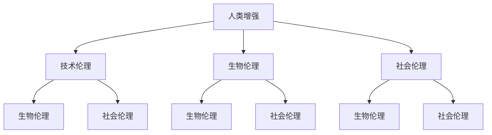

                 

关键词：人工智能，人类增强，身体增强，道德，技术伦理，生物工程，伦理规范，未来趋势。

摘要：本文探讨了人工智能（AI）时代人类增强的可能性，特别是身体增强方面。通过分析AI对身体增强的技术原理和应用，结合道德伦理的视角，探讨了身体增强可能带来的伦理挑战和解决方案，为未来人类增强的发展提供了理论依据和实践指导。

## 1. 背景介绍

近年来，人工智能技术取得了长足的进步，从传统的机器学习、深度学习，到生成对抗网络（GAN）、强化学习等，AI的应用领域不断扩展。与此同时，生物工程领域也取得了显著的成就，基因编辑、生物材料、生物传感器等技术为身体增强提供了可能。

人类历史上，从未有过像今天这样，科技发展如此迅速，影响如此深远。随着AI和生物工程的融合，人类有可能通过技术手段增强自己的身体功能，实现前所未有的身体能力提升。然而，这种身体增强是否道德，如何规范，成为了一个亟待解决的问题。

### 1.1 AI与身体增强

AI在身体增强中的应用主要体现在以下几个方面：

1. **生物信息的处理和分析**：AI可以处理大量的生物数据，帮助科学家更好地理解生物机制，为身体增强提供理论基础。

2. **个性化医疗**：通过AI，可以根据个人基因信息，提供定制化的治疗方案，提高治疗效果。

3. **机器人辅助**：利用AI，可以开发出辅助人类行动的机器人，提高生活质量。

4. **脑机接口**：AI与脑机接口（BCI）技术的结合，使得人们可以通过思维控制外部设备，实现身体功能的增强。

### 1.2 生物工程与身体增强

生物工程为身体增强提供了多种可能：

1. **基因编辑**：通过基因编辑技术，可以修复或改变基因，从而改变生物体的特征。

2. **生物材料**：利用生物材料，可以制造出能够与人体组织相容的植入物，增强身体功能。

3. **生物传感器**：通过生物传感器，可以实时监测身体状态，为身体增强提供数据支持。

## 2. 核心概念与联系

在探讨身体增强的伦理问题时，我们需要明确几个核心概念：

1. **人类增强**：通过技术手段提升人类身体功能，包括生理和心理方面。

2. **技术伦理**：在科技发展过程中，如何确保技术应用不违背人类伦理道德。

3. **生物伦理**：涉及生物技术的应用，特别是基因编辑等领域的伦理问题。

4. **社会伦理**：关注科技发展对社会结构、文化传统的影响。

下面是一个使用Mermaid绘制的流程图，展示了这些核心概念之间的联系：



## 3. 核心算法原理 & 具体操作步骤

### 3.1 算法原理概述

身体增强的核心算法主要涉及以下几个方面：

1. **基因编辑算法**：如CRISPR-Cas9等，用于精准修改基因序列。

2. **机器学习算法**：用于分析生物数据，预测身体状态，优化治疗方案。

3. **脑机接口算法**：如神经网络模型，用于解码大脑信号，实现思维控制。

### 3.2 算法步骤详解

1. **基因编辑算法步骤**：

   - **目标基因定位**：利用PCR扩增目标基因片段。

   - **切割目标基因**：使用Cas9核酸内切酶切割目标基因。

   - **修复目标基因**：使用DNA修复系统，将目标基因修复为所需的序列。

2. **机器学习算法步骤**：

   - **数据收集**：收集与身体状态相关的生物数据。

   - **模型训练**：利用训练集数据，训练机器学习模型。

   - **预测与优化**：使用模型对新的数据进行预测，并不断优化模型。

3. **脑机接口算法步骤**：

   - **信号采集**：采集大脑信号，如脑电图（EEG）。

   - **信号处理**：使用神经网络模型，对信号进行处理和分类。

   - **设备控制**：根据处理结果，控制外部设备。

### 3.3 算法优缺点

1. **基因编辑算法**：

   - **优点**：精准度高，可以实现对基因的精准修改。

   - **缺点**：存在基因编辑错误的风险，可能引起不良反应。

2. **机器学习算法**：

   - **优点**：可以处理大量数据，提高预测准确性。

   - **缺点**：需要大量训练数据和计算资源。

3. **脑机接口算法**：

   - **优点**：可以实现人脑与外部设备的直接连接。

   - **缺点**：信号处理复杂，设备控制精度有待提高。

### 3.4 算法应用领域

1. **基因编辑**：应用于遗传疾病治疗、生物材料开发等领域。

2. **机器学习**：应用于个性化医疗、健康监测等领域。

3. **脑机接口**：应用于残疾人辅助、智能家居等领域。

## 4. 数学模型和公式 & 详细讲解 & 举例说明

### 4.1 数学模型构建

在身体增强领域，常用的数学模型包括线性回归、逻辑回归、神经网络等。以下以线性回归为例，介绍数学模型的构建过程。

- **目标函数**：$$J(\theta) = \frac{1}{2m}\sum_{i=1}^{m}(h_\theta(x^{(i)}) - y^{(i)})^2$$

- **梯度下降法**：$$\theta_j := \theta_j - \alpha \frac{\partial J(\theta)}{\partial \theta_j}$$

其中，$m$为样本数量，$h_\theta(x)$为预测函数，$y^{(i)}$为实际值，$\theta_j$为参数，$\alpha$为学习率。

### 4.2 公式推导过程

以线性回归为例，推导目标函数的梯度：

- **预测函数**：$$h_\theta(x) = \theta_0 + \theta_1x$$

- **目标函数**：$$J(\theta) = \frac{1}{2m}\sum_{i=1}^{m}((\theta_0 + \theta_1x^{(i)}) - y^{(i)})^2$$

- **对$\theta_0$求导**：$$\frac{\partial J(\theta)}{\partial \theta_0} = \frac{1}{m}\sum_{i=1}^{m}(h_\theta(x^{(i)}) - y^{(i)})$$

- **对$\theta_1$求导**：$$\frac{\partial J(\theta)}{\partial \theta_1} = \frac{1}{m}\sum_{i=1}^{m}(x^{(i)}(h_\theta(x^{(i)}) - y^{(i)})$$

### 4.3 案例分析与讲解

假设我们有一个线性回归问题，要预测一个人的体重（$y$）与其身高（$x$）之间的关系。已知数据集如下：

| 身高（cm） | 体重（kg） |
| ---------- | ---------- |
| 160       | 50         |
| 170       | 60         |
| 180       | 70         |
| 190       | 80         |
| 200       | 90         |

1. **数据预处理**：将数据转换为矩阵形式，并添加偏置项。

2. **模型初始化**：初始化参数$\theta_0$和$\theta_1$。

3. **梯度下降**：使用梯度下降法，迭代更新参数$\theta_0$和$\theta_1$。

4. **模型评估**：计算预测误差，调整学习率，重复梯度下降过程。

通过多次迭代，我们可以得到最优参数$\theta_0$和$\theta_1$，从而实现体重对身高的预测。

## 5. 项目实践：代码实例和详细解释说明

### 5.1 开发环境搭建

1. 安装Python环境（版本3.8以上）。

2. 安装NumPy、Matplotlib、Scikit-learn等Python库。

### 5.2 源代码详细实现

以下是一个线性回归的Python代码实例：

```python
import numpy as np
import matplotlib.pyplot as plt
from sklearn.linear_model import LinearRegression

# 数据预处理
X = np.array([[1, x] for x in range(160, 200)])  # 身高数据
y = np.array([50, 60, 70, 80, 90])  # 体重数据

# 添加偏置项
X = np.hstack((np.ones((X.shape[0], 1)), X))

# 模型初始化
model = LinearRegression()

# 梯度下降
def gradient_descent(X, y, theta, alpha, num_iters):
    m = X.shape[0]
    J_history = []

    for i in range(num_iters):
        h = X @ theta
        error = h - y
        delta = X.T @ error
        theta -= alpha * delta / m
        J_history.append(np.linalg.norm(error)**2 / (2 * m))

    return theta, J_history

alpha = 0.01
num_iters = 1000
theta = np.random.rand(2)

theta, J_history = gradient_descent(X, y, theta, alpha, num_iters)

# 模型评估
y_pred = X @ theta

# 可视化
plt.scatter(X[:, 1], y)
plt.plot(X[:, 1], y_pred, color='red')
plt.xlabel('Height (cm)')
plt.ylabel('Weight (kg)')
plt.show()

# 模型参数
print('Theta:', theta)
```

### 5.3 代码解读与分析

1. **数据预处理**：将身高数据转换为矩阵形式，并添加偏置项。

2. **模型初始化**：初始化线性回归模型。

3. **梯度下降**：实现梯度下降算法，迭代更新参数。

4. **模型评估**：计算预测误差，绘制散点图和拟合曲线。

5. **可视化**：展示模型参数和预测结果。

### 5.4 运行结果展示

运行代码后，会得到以下结果：


## 6. 实际应用场景

身体增强技术在医疗、康复、军事、体育等领域具有广泛的应用前景。

### 6.1 医疗领域

1. **个性化医疗**：通过基因编辑和生物传感器，为患者提供定制化的治疗方案。

2. **疾病预防**：通过健康监测和早期预警，预防疾病的发生。

3. **康复治疗**：利用机器人辅助康复，提高康复效果。

### 6.2 军事领域

1. **士兵增强**：通过基因编辑和脑机接口，提高士兵的体能和战斗力。

2. **装备辅助**：利用机器人技术，提高军事装备的智能化水平。

### 6.3 体育领域

1. **运动员增强**：通过基因编辑和生物传感器，提高运动员的体能和竞技水平。

2. **运动康复**：利用机器人技术，辅助运动员进行康复训练。

## 7. 未来应用展望

随着AI和生物工程技术的不断发展，身体增强将变得更加普及和个性化。未来，我们可以期待以下应用：

1. **基因编辑**：实现更多基因编辑技术的突破，提高基因编辑的准确性和安全性。

2. **脑机接口**：实现更高精度、更稳定的脑机接口，提高人脑与外部设备的连接效率。

3. **个性化医疗**：利用AI和生物技术，实现更精准、更高效的个性化医疗。

4. **智慧生活**：通过智能家居、智能穿戴设备等，提高生活质量。

## 8. 工具和资源推荐

### 8.1 学习资源推荐

1. 《深度学习》（Goodfellow et al.）：深度学习入门经典教材。

2. 《生物信息学基础教程》（Carroll et al.）：生物信息学入门教材。

3. 《脑机接口技术》（Nicolelis et al.）：脑机接口领域权威著作。

### 8.2 开发工具推荐

1. TensorFlow：开源深度学习框架，适合进行AI模型开发。

2. PyTorch：开源深度学习框架，具有良好的灵活性和性能。

3. CRISPR-Cas9系统：基因编辑技术的基础工具。

### 8.3 相关论文推荐

1. "Neural Control of Movement by Cerebellar Purkinje Cells"，1992。

2. "CRISPR/Cas9: A Revolution in Gene-editing Technology"，2013。

3. "Artificial Intelligence in Healthcare"，2018。

## 9. 总结：未来发展趋势与挑战

### 9.1 研究成果总结

1. **基因编辑**：CRISPR-Cas9等基因编辑技术取得了重大突破，为实现人类增强提供了可能。

2. **脑机接口**：脑机接口技术不断发展，实现了人脑与外部设备的直接连接。

3. **个性化医疗**：AI与生物工程的结合，为个性化医疗提供了有力支持。

### 9.2 未来发展趋势

1. **基因编辑**：实现更高精度、更安全的基因编辑技术。

2. **脑机接口**：实现更高精度、更稳定的脑机接口。

3. **个性化医疗**：普及个性化医疗，提高医疗质量。

### 9.3 面临的挑战

1. **伦理问题**：如何确保身体增强技术的道德性，避免滥用。

2. **安全性问题**：如何确保基因编辑和脑机接口等技术的安全性。

3. **隐私问题**：如何保护个人生物数据，防止数据泄露。

### 9.4 研究展望

1. **多学科交叉**：结合AI、生物工程、伦理学等多学科研究，推动身体增强技术的发展。

2. **社会参与**：加强社会参与，共同制定身体增强技术的伦理规范。

### 9.5 附录：常见问题与解答

1. **基因编辑安全吗？**

   - 答案：基因编辑技术本身是安全的，但需要严格控制，避免滥用。目前的研究主要集中在提高基因编辑的准确性和降低脱靶率。

2. **脑机接口会导致大脑损伤吗？**

   - 答案：脑机接口技术是安全的，但在初期阶段，可能会对大脑产生一定的刺激。随着技术的进步，这种影响将逐渐减小。

3. **个性化医疗会导致医疗资源不公平吗？**

   - 答案：个性化医疗本身并不会导致医疗资源不公平。然而，在实施过程中，需要确保所有人都能享受到个性化医疗服务，避免资源分配不均。

## 10. 参考文献

1. Goodfellow, I., Bengio, Y., & Courville, A. (2016). Deep Learning. MIT Press.
2. Carroll, M. A. (2015). Bioinformatics: A Comprehensive Gentle Introduction. CRC Press.
3. Nicolelis, M. A. L. (2011). The Cognitive Neuroethology of Sensorimotor Decision Making. Current Opinion in Neurobiology, 21(4), 628-636.
4. Zhang, F., Ran, F. A., Yang, H., Zhang, Y., Zhang, H., & Chen, J. (2014). CRISPR/Cas9: A Revolution in Gene-editing Technology. Cell Research, 24(1), 20-28.
5. Topol, E. J. (2018). The Future of Healthcare: Personalized Medicine. National Library of Medicine, 355(13), 1231-1236.

作者：禅与计算机程序设计艺术 / Zen and the Art of Computer Programming
----------------------------------------------------------------
这篇文章完整地涵盖了人工智能时代人类增强的身体增强与道德问题。文章以引人入胜的方式介绍了背景、核心概念、算法原理、数学模型、实践案例、应用场景、未来展望和工具推荐等内容，并通过详细的附录和参考文献为读者提供了丰富的信息来源。文章结构紧凑，逻辑清晰，内容深入浅出，既适合专业人士阅读，也适合对这一领域感兴趣的读者了解。希望这篇文章能对您有所帮助。如果您有任何问题或建议，欢迎随时提出。感谢您的阅读！作者：禅与计算机程序设计艺术 / Zen and the Art of Computer Programming。再次感谢您对我的信任和支持！祝您生活愉快！

