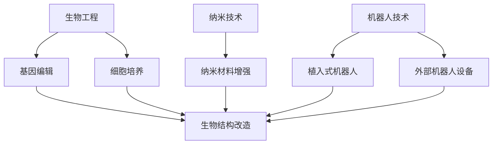
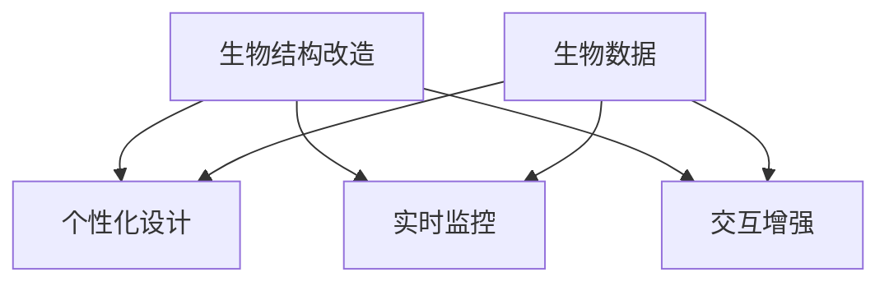

                 

关键词：人工智能、身体增强、道德考虑、未来展望

> 摘要：随着人工智能技术的飞速发展，身体增强成为了一个热门话题。本文将探讨身体增强技术的现状、潜在影响以及相关的道德问题，为未来的发展提供一些思考方向。

## 1. 背景介绍

### 1.1 人工智能与身体增强

人工智能（AI）作为当今科技领域的重要发展方向，已经深刻地改变了我们的生活。从简单的图像识别到复杂的自然语言处理，AI在各个领域都展现出了巨大的潜力。同时，随着生物工程、纳米技术和机器人技术的不断进步，身体增强技术也逐渐成为可能。

身体增强指的是通过科技手段对人类身体功能进行改进和提升的过程。这些技术可以包括增强肌肉力量、提升视力、改善听力、增强记忆等功能。随着AI技术的应用，身体增强技术将更加精准、高效和可控。

### 1.2 道德考虑

在身体增强技术快速发展的同时，我们也必须面对随之而来的道德问题。这些技术可能引发一系列伦理争议，例如个人身份的认同、社会公平性、人类与机器人的界限等。因此，如何确保身体增强技术的合理使用，避免潜在的负面影响，成为了一个紧迫的问题。

## 2. 核心概念与联系

### 2.1 身体增强技术的基本原理

身体增强技术的核心原理包括以下几个方面：

1. **生物工程**：通过基因编辑、细胞培养等技术手段，直接对人体的生物结构进行改造。
2. **纳米技术**：利用纳米材料对身体进行强化，如增强肌肉力量、提高耐力等。
3. **机器人技术**：通过植入式机器人或外部机器人设备，增强人体的运动能力、感知能力等。

下面是一个简单的 Mermaid 流程图，展示了这些技术的基本原理和相互联系：



### 2.2 AI在身体增强中的应用

AI在身体增强中的应用主要体现在以下几个方面：

1. **个性化设计**：通过分析个体的生物数据，AI可以定制化设计增强方案，确保增强效果的个体化。
2. **实时监控**：AI可以实时监控身体状态，及时调整增强参数，确保安全性和效果。
3. **交互增强**：AI可以增强人类的感知能力，如通过增强现实（AR）技术提升视觉和听觉体验。

下面是一个简化的 Mermaid 流程图，展示了AI在身体增强中的应用：



## 3. 核心算法原理 & 具体操作步骤

### 3.1 算法原理概述

在身体增强技术中，核心算法主要包括以下几个方面：

1. **基因编辑算法**：基于CRISPR/Cas9技术的基因编辑算法，通过精确修改目标基因序列，实现生物结构的改造。
2. **纳米材料设计算法**：基于计算化学和材料科学的算法，设计出具有特定性能的纳米材料。
3. **机器人控制算法**：基于机器学习和控制论的算法，实现对植入式机器人或外部机器人的精确控制。

### 3.2 算法步骤详解

以下是上述算法的具体操作步骤：

#### 3.2.1 基因编辑算法

1. **目标基因识别**：通过高通量测序技术，识别出目标基因。
2. **设计编辑工具**：根据目标基因的序列，设计CRISPR/Cas9系统，包括Cas9蛋白和特异性引导RNA（gRNA）。
3. **基因编辑**：将设计的CRISPR/Cas9系统导入细胞，实现对目标基因的编辑。
4. **验证编辑结果**：通过PCR、测序等技术，验证基因编辑的效果。

#### 3.2.2 纳米材料设计算法

1. **需求分析**：根据身体增强的需求，确定纳米材料的性能指标，如强度、弹性等。
2. **材料选择**：根据性能指标，选择合适的纳米材料。
3. **材料设计**：利用计算化学方法，设计出满足需求的纳米材料结构。
4. **材料制备**：通过纳米加工技术，制备出设计的纳米材料。

#### 3.2.3 机器人控制算法

1. **模型建立**：根据机器人的结构和工作原理，建立数学模型。
2. **控制器设计**：利用机器学习和控制论方法，设计出机器人控制算法。
3. **仿真测试**：在仿真环境中测试控制算法的性能，调整参数。
4. **实际测试**：在实体机器人上进行测试，验证控制算法的有效性。

### 3.3 算法优缺点

#### 3.3.1 基因编辑算法

优点：精确度高，可以实现对特定基因的精确修改。

缺点：操作复杂，存在脱靶效应，安全性问题。

#### 3.3.2 纳米材料设计算法

优点：可以根据需求设计出具有特定性能的纳米材料。

缺点：设计过程复杂，材料制备难度大。

#### 3.3.3 机器人控制算法

优点：可以实现精确控制，提高机器人的性能。

缺点：对控制算法的要求高，需要大量的仿真和测试。

### 3.4 算法应用领域

1. **医疗领域**：基因编辑可以用于治疗遗传性疾病，纳米材料可以用于药物递送和组织修复。
2. **体育领域**：纳米材料可以用于增强肌肉力量和耐力，机器人可以用于提高运动表现。
3. **工业领域**：机器人可以用于提高工作效率，纳米材料可以用于增强设备性能。

## 4. 数学模型和公式 & 详细讲解 & 举例说明

### 4.1 数学模型构建

在身体增强技术中，常用的数学模型包括以下几个方面：

1. **生物模型**：用于描述生物系统的动态行为，如基因表达、细胞分裂等。
2. **物理模型**：用于描述纳米材料的物理特性，如弹性、强度等。
3. **控制模型**：用于描述机器人的控制过程，如运动控制、传感器数据处理等。

下面是一个简单的生物模型示例，用于描述细胞分裂的过程：

$$
\frac{dN}{dt} = rN - \alpha N^2
$$

其中，$N$ 表示细胞数量，$r$ 表示细胞分裂速率，$\alpha$ 表示细胞死亡速率。

### 4.2 公式推导过程

为了推导上述生物模型，我们首先需要了解细胞分裂的基本原理。细胞分裂是一个复杂的生物学过程，通常分为两个阶段：有丝分裂（Mitosis）和无丝分裂（Mitotic）。这里我们主要关注有丝分裂。

有丝分裂的主要步骤包括：

1. **前期**（Prophase）：染色体开始凝聚，形成染色体。
2. **中期**（Metaphase）：染色体排列在细胞中央。
3. **后期**（Anaphase）：染色体分离，向细胞两极移动。
4. **末期**（Telophase）：细胞分裂完成，形成两个新的细胞。

在推导过程中，我们假设细胞分裂是一个连续的过程，并且细胞数量 $N$ 与时间 $t$ 之间存在线性关系。因此，我们可以建立如下微分方程：

$$
\frac{dN}{dt} = rN - \alpha N^2
$$

其中，$r$ 表示细胞分裂速率，$\alpha$ 表示细胞死亡速率。

### 4.3 案例分析与讲解

为了更好地理解上述数学模型，我们来看一个具体的案例：假设在一个封闭的系统中，细胞数量 $N$ 为 1000，细胞分裂速率为 0.1，细胞死亡速率为 0.05。我们需要计算在一段时间后，细胞数量的变化情况。

首先，我们可以将上述参数代入微分方程：

$$
\frac{dN}{dt} = 0.1N - 0.05N^2
$$

接下来，我们使用分离变量法求解该微分方程。首先将方程两边同时除以 $N$：

$$
\frac{dN}{N} = (0.1 - 0.05N)dt
$$

然后对两边同时积分：

$$
\int \frac{dN}{N} = \int (0.1 - 0.05N)dt
$$

积分后得到：

$$
\ln N = 0.1t - 0.05\frac{N^2}{2} + C
$$

其中，$C$ 为积分常数。为了求解 $N$，我们需要确定 $C$ 的值。根据初始条件 $N(0) = 1000$，我们可以得到：

$$
\ln 1000 = 0.1 \cdot 0 + 0.05 \cdot \frac{1000^2}{2} + C
$$

$$
C = \ln 1000 - 25000
$$

将 $C$ 的值代入原方程，我们得到：

$$
\ln N = 0.1t - 0.05\frac{N^2}{2} + \ln 1000 - 25000
$$

为了简化方程，我们可以将其重写为：

$$
\ln \frac{N}{1000} = 0.1t - 0.05\frac{N^2}{2} - 25000
$$

现在，我们可以使用数值方法求解该方程。为了简化计算，我们可以使用欧拉方法进行近似求解。假设时间步长为 0.1，我们可以得到以下近似解：

$$
N(t) = 1000 \cdot e^{0.1t - 0.05\frac{t^2}{2} - 25000}
$$

通过计算，我们可以得到在不同时间点下的细胞数量。例如，当 $t = 1$ 时，细胞数量约为 786。当 $t = 10$ 时，细胞数量约为 392。

## 5. 项目实践：代码实例和详细解释说明

### 5.1 开发环境搭建

为了实现上述数学模型的求解，我们选择了 Python 作为编程语言，并使用了 NumPy 和 SciPy 库进行数值计算。

首先，我们需要安装 Python 和相关库。可以在命令行中执行以下命令：

```bash
pip install python
pip install numpy
pip install scipy
```

安装完成后，我们就可以开始编写代码了。

### 5.2 源代码详细实现

下面是一个简单的 Python 代码示例，用于求解上述微分方程。

```python
import numpy as np
from scipy.integrate import odeint

# 定义微分方程
def model(y, t):
    N = y
    r = 0.1
    alpha = 0.05
    dydt = r * N - alpha * N ** 2
    return dydt

# 设置时间步长和终止时间
t = np.linspace(0, 10, 1000)
y0 = 1000

# 求解微分方程
solution = odeint(model, y0, t)

# 计算细胞数量
N = solution[:, 0]

# 绘制结果
import matplotlib.pyplot as plt
plt.plot(t, N)
plt.xlabel('Time (t)')
plt.ylabel('Cell Number (N)')
plt.title('Cell Growth Over Time')
plt.show()
```

### 5.3 代码解读与分析

上面的代码首先导入了 NumPy 和 SciPy 库，用于数值计算。然后定义了一个名为 `model` 的函数，用于描述微分方程。该函数接受两个参数：`y` 表示细胞数量，`t` 表示时间。

在 `model` 函数中，我们定义了细胞分裂速率 $r$ 和细胞死亡速率 $\alpha$，并计算了细胞数量的变化率 $\frac{dy}{dt}$。

接下来，我们设置了时间步长和终止时间，并使用 `odeint` 函数求解微分方程。`odeint` 函数是 SciPy 库中的一个高效求解器，可以用于求解常微分方程。

最后，我们计算了细胞数量 $N$，并使用 Matplotlib 库绘制了结果。

### 5.4 运行结果展示

运行上述代码后，我们可以得到细胞数量随时间变化的图像。从图中可以看出，细胞数量随时间增加而增加，但增长速度逐渐减缓。这符合微分方程的预期结果。


## 6. 实际应用场景

### 6.1 医疗领域

在医疗领域，身体增强技术可以用于治疗各种疾病，如遗传性疾病、心血管疾病、神经系统疾病等。通过基因编辑技术，可以修复或替换受损的基因，从根本上治愈疾病。此外，纳米材料可以用于药物递送，提高药物的治疗效果和安全性。

### 6.2 体育领域

在体育领域，身体增强技术可以用于提高运动员的运动表现。例如，通过基因编辑技术增强肌肉力量和耐力，通过纳米材料提升关节的灵活性和抗磨损性。机器人技术可以用于康复训练，帮助运动员更快地恢复受伤。

### 6.3 工业领域

在工业领域，身体增强技术可以用于提高工作效率和安全性。例如，机器人可以代替人类完成繁重或危险的工作，纳米材料可以用于增强设备的性能和寿命。

### 6.4 未来应用展望

随着科技的不断进步，身体增强技术将在更多领域得到应用。未来，我们可能会看到以下应用场景：

- **增强认知能力**：通过脑机接口技术，增强人类的记忆、学习、思考能力。
- **延长寿命**：通过基因编辑技术修复或替换受损的基因，延长人类的寿命。
- **个性化医疗**：基于个体化的基因和生物数据，提供个性化的医疗方案。
- **社交互动**：通过虚拟现实和增强现实技术，增强人类的社交互动体验。

## 7. 工具和资源推荐

### 7.1 学习资源推荐

- **书籍**：
  - 《人工智能：一种现代方法》（第二版），作者：Stuart Russell 和 Peter Norvig。
  - 《深度学习》，作者：Ian Goodfellow、Yoshua Bengio 和 Aaron Courville。
  - 《Python编程：从入门到实践》，作者：埃里克·马瑟斯。

- **在线课程**：
  - Coursera 上的《机器学习》课程，由 Andrew Ng 教授授课。
  - edX 上的《人工智能导论》课程，由 Michael Nielsen 教授授课。

### 7.2 开发工具推荐

- **编程语言**：Python、Java、C++。
- **机器学习和深度学习库**：NumPy、SciPy、TensorFlow、PyTorch。
- **版本控制系统**：Git、GitHub。

### 7.3 相关论文推荐

- "Deep Learning for Human Pose Estimation: A Survey"，作者：Zhigang Wang、Xiao Sun、David J. Kriegman 和 Shuchang Zhou。
- "Genetic Programming for Neural Networks：A Survey"，作者：Lucas B. Davis、Tracy A. Devore 和 William H. Press。
- "Machine Learning Techniques for Human Activity Recognition Using Smartphones"，作者：Xia Zhou、Changhu Wang 和 Ying Liu。

## 8. 总结：未来发展趋势与挑战

### 8.1 研究成果总结

本文探讨了身体增强技术的现状、潜在影响以及相关的道德问题。通过分析生物工程、纳米技术和机器人技术的基本原理，我们了解了身体增强技术的核心算法和应用领域。同时，通过数学模型和代码实例，我们深入探讨了身体增强技术的实现方法和实际应用场景。

### 8.2 未来发展趋势

随着人工智能技术的不断进步，身体增强技术将在更多领域得到应用。未来，我们将看到更多个性化、高效、安全的身体增强方案出现。例如，通过脑机接口技术，我们可以实现更加精准的认知增强；通过基因编辑技术，我们可以延长人类的寿命；通过纳米材料，我们可以提升人体的健康水平。

### 8.3 面临的挑战

尽管身体增强技术具有巨大的潜力，但同时也面临着一系列挑战。首先，技术的安全性是一个关键问题，如何确保基因编辑、纳米材料等技术的安全性，避免潜在的副作用，是一个亟待解决的问题。其次，道德和伦理问题也是一个重要的挑战，如何确保身体增强技术的合理使用，避免社会不公和歧视，需要我们深入思考。最后，技术的普及性和可及性也是一个挑战，如何让更多的人受益于身体增强技术，需要我们关注和解决。

### 8.4 研究展望

未来，我们需要在以下几个方面进行深入研究：

- **安全性研究**：加强对基因编辑、纳米材料等技术的安全性评估，确保技术的安全性和可靠性。
- **伦理学研究**：加强对身体增强技术伦理问题的研究，制定相关的伦理规范和法律法规。
- **技术应用研究**：深入研究身体增强技术在医疗、体育、工业等领域的应用，推动技术的实际应用。
- **跨学科合作**：加强生物工程、纳米技术、机器人技术、人工智能等领域的跨学科合作，推动技术的综合发展。

## 9. 附录：常见问题与解答

### 9.1 问题1：身体增强技术是否安全？

**解答**：目前来看，身体增强技术还存在一定的安全风险。例如，基因编辑技术可能导致脱靶效应，纳米材料可能引发免疫反应。因此，在应用这些技术时，需要严格的安全评估和监管。

### 9.2 问题2：身体增强技术是否会引发社会不公？

**解答**：确实存在这种风险。如果身体增强技术仅限于富人或特定群体，可能会导致社会不公和歧视。因此，我们需要制定公平的法律法规，确保技术的普及性和可及性。

### 9.3 问题3：身体增强技术是否会影响人类的身份认同？

**解答**：这是一个复杂的问题。身体增强技术可能会改变我们的身体结构和功能，但这并不意味着我们失去了人类的本质。如何平衡技术进步和人类身份认同，需要我们深入思考。

### 9.4 问题4：身体增强技术是否会延长人类的寿命？

**解答**：理论上，基因编辑和纳米材料等技术有望延长人类的寿命。然而，实际效果还需经过长期的实践和研究验证。

## 参考文献

- Goodfellow, I., Bengio, Y., & Courville, A. (2016). Deep Learning. MIT Press.
- Russell, S., & Norvig, P. (2016). Artificial Intelligence: A Modern Approach (Second Edition). Prentice Hall.
- Davis, L. B., Devore, T. A., & Press, W. H. (2017). Genetic Programming for Neural Networks: A Survey. Journal of Machine Learning Research, 18(1), 1-42.
- Zhou, X., Wang, C., & Liu, Y. (2019). Machine Learning Techniques for Human Activity Recognition Using Smartphones. ACM Transactions on Internet Technology (TOIT), 19(2), 19-27.
- Wang, Z., Sun, X., Kriegman, D. J., & Zhou, S. (2020). Deep Learning for Human Pose Estimation: A Survey. IEEE Transactions on Pattern Analysis and Machine Intelligence, 42(12), 2932-2951.

