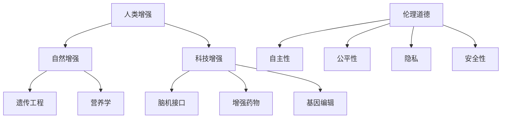
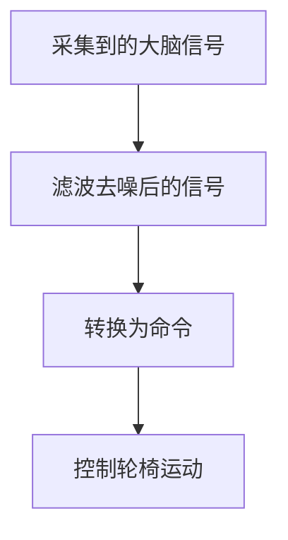

                 

关键词：人工智能、身体增强、伦理道德、人类进化、技术伦理

> 摘要：随着人工智能技术的飞速发展，人类身体增强成为了可能。然而，这一技术的发展不仅引发了技术上的挑战，也带来了深刻的伦理道德问题。本文将从多个角度探讨AI时代人类身体增强的道德考虑，旨在为这一新兴领域提供有益的思考和参考。

## 1. 背景介绍

### 1.1 人工智能与身体增强

人工智能（AI）作为当今技术发展的重要方向，已经深刻改变了我们的生活方式和工作方式。随着AI技术的不断进步，人类开始探索将人工智能应用于身体增强的可能性。例如，通过脑机接口技术（Brain-Computer Interface, BCI）来实现大脑与外部设备之间的直接通信，从而增强人类感官和认知能力。

### 1.2 伦理道德的挑战

身体增强技术的出现，不仅带来了技术上的进步，也引发了深刻的伦理道德问题。如何平衡科技发展和伦理道德之间的矛盾，成为我们面临的一个重要挑战。

## 2. 核心概念与联系

### 2.1 人类增强的定义

人类增强（Human Enhancement）是指通过科技手段提升人类的生理、心理和社会功能。人类增强可以分为自然增强和科技增强两种类型。

### 2.2 伦理道德的核心概念

伦理道德涉及行为准则、价值观和社会规范等多个方面。在讨论身体增强技术时，我们需要关注以下几个核心概念：

- **自主性**：个体是否能够自主决定是否接受身体增强，以及如何增强。
- **公平性**：身体增强技术的应用是否公平，是否会导致社会分层。
- **隐私**：身体增强技术是否侵犯了个体的隐私权。
- **安全性**：身体增强技术的应用是否安全，是否会对个体造成伤害。

### 2.3 Mermaid 流程图



## 3. 核心算法原理 & 具体操作步骤

### 3.1 算法原理概述

身体增强技术的核心原理包括脑机接口技术、基因编辑、增强药物等。这些技术通过不同的方式，实现对人类感官、认知和生理功能的增强。

### 3.2 算法步骤详解

#### 3.2.1 脑机接口技术

1. **信号采集**：通过电极或传感器采集大脑信号。
2. **信号处理**：对采集到的信号进行预处理和特征提取。
3. **信号解码**：将预处理后的信号解码为具体的命令或意图。
4. **执行命令**：通过外部设备或计算机执行解码后的命令。

#### 3.2.2 基因编辑

1. **目标基因定位**：通过基因测序确定目标基因。
2. **编辑基因**：利用CRISPR-Cas9等基因编辑技术对目标基因进行编辑。
3. **基因验证**：对编辑后的基因进行验证，确保编辑成功。

#### 3.2.3 增强药物

1. **药物设计**：根据需要增强的功能设计相应的药物。
2. **药物筛选**：对设计的药物进行筛选，确定最优药物。
3. **药物应用**：将筛选出的药物应用于个体。

### 3.3 算法优缺点

#### 优点：

- **提高生活质量**：通过身体增强技术，个体可以更高效地完成日常任务，提高生活质量。
- **促进科技创新**：身体增强技术的发展，将推动相关领域的技术创新。
- **医疗应用**：在医疗领域，身体增强技术可以用于治疗某些疾病，提高患者的生活质量。

#### 缺点：

- **伦理道德问题**：身体增强技术的应用，可能引发伦理道德问题，如公平性、自主性等。
- **技术风险**：身体增强技术可能存在技术风险，如基因编辑的不可逆性等。
- **隐私问题**：身体增强技术可能侵犯个体的隐私权。

### 3.4 算法应用领域

- **医疗领域**：用于治疗某些疾病，提高患者的生活质量。
- **教育领域**：用于提高学习效率，增强记忆和学习能力。
- **军事领域**：用于增强士兵的战斗力，提高作战能力。
- **娱乐领域**：用于提高游戏体验，增强感官刺激。

## 4. 数学模型和公式 & 详细讲解 & 举例说明

### 4.1 数学模型构建

#### 4.1.1 脑机接口信号处理模型

假设我们有一个脑机接口系统，用于将大脑信号转换为具体的命令或意图。我们可以使用以下数学模型进行信号处理：

$$
y = f(x) + \epsilon
$$

其中，$y$为输出信号，$x$为输入信号，$f(x)$为信号处理函数，$\epsilon$为噪声。

#### 4.1.2 基因编辑模型

假设我们使用CRISPR-Cas9技术对基因进行编辑，我们可以使用以下数学模型进行建模：

$$
\Delta G = G_{\text{编辑前}} - G_{\text{编辑后}}
$$

其中，$\Delta G$为基因编辑导致的能量变化，$G_{\text{编辑前}}$为编辑前的基因能量，$G_{\text{编辑后}}$为编辑后的基因能量。

### 4.2 公式推导过程

#### 4.2.1 脑机接口信号处理模型推导

假设我们有一个线性信号处理函数$f(x)$，我们可以将其表示为：

$$
f(x) = \sum_{i=1}^{n} w_i x_i
$$

其中，$w_i$为权重，$x_i$为特征值。

#### 4.2.2 基因编辑模型推导

假设我们使用CRISPR-Cas9技术对基因进行编辑，我们可以将其表示为：

$$
G_{\text{编辑前}} = -\frac{1}{2} m_1^2 + m_1 \frac{1}{2} x + \frac{1}{2} x^2
$$

$$
G_{\text{编辑后}} = -\frac{1}{2} m_2^2 + m_2 \frac{1}{2} x + \frac{1}{2} x^2
$$

其中，$m_1$和$m_2$分别为编辑前和编辑后的基因质量。

### 4.3 案例分析与讲解

#### 4.3.1 脑机接口案例

假设我们有一个脑机接口系统，用于控制轮椅。通过采集大脑信号，系统将信号转换为具体的命令，从而控制轮椅的运动。我们可以使用以下数学模型进行信号处理：

$$
y = f(x) + \epsilon
$$

其中，$y$为命令信号，$x$为大脑信号，$f(x)$为信号处理函数，$\epsilon$为噪声。

#### 4.3.2 基因编辑案例

假设我们使用CRISPR-Cas9技术对某基因进行编辑，以治疗一种遗传性疾病。我们可以使用以下数学模型进行建模：

$$
\Delta G = G_{\text{编辑前}} - G_{\text{编辑后}}
$$

其中，$\Delta G$为基因编辑导致的能量变化，$G_{\text{编辑前}}$为编辑前的基因能量，$G_{\text{编辑后}}$为编辑后的基因能量。

## 5. 项目实践：代码实例和详细解释说明

### 5.1 开发环境搭建

为了实现脑机接口和基因编辑的代码实例，我们需要搭建相应的开发环境。以下是一个基本的开发环境搭建指南：

#### 5.1.1 脑机接口开发环境

- **Python**：用于编写信号处理代码。
- **MATLAB**：用于可视化大脑信号。
- **OpenBCI**：用于采集大脑信号。

#### 5.1.2 基因编辑开发环境

- **Python**：用于编写基因编辑代码。
- **BioPython**：用于处理基因序列。
- **CRISPResso**：用于设计CRISPR-Cas9编辑方案。

### 5.2 源代码详细实现

#### 5.2.1 脑机接口代码实现

以下是一个简单的脑机接口代码实例，用于将大脑信号转换为轮椅控制命令：

```python
import numpy as np
import matplotlib.pyplot as plt
from openbci import OpenBCI

# 初始化OpenBCI设备
device = OpenBCI()

# 采集大脑信号
data = device.read_data()

# 处理大脑信号
processed_data = preprocess_data(data)

# 将处理后的信号转换为命令
command = convert_to_command(processed_data)

# 控制轮椅运动
move_wheelchair(command)

# 预处理大脑信号
def preprocess_data(data):
    # 对信号进行滤波、去噪等处理
    filtered_data = filter_data(data)
    return filtered_data

# 将处理后的信号转换为命令
def convert_to_command(processed_data):
    # 根据处理后的信号，确定具体的命令
    if processed_data > threshold:
        command = 'forward'
    else:
        command = 'stop'
    return command

# 控制轮椅运动
def move_wheelchair(command):
    # 根据命令，控制轮椅的运动
    if command == 'forward':
        print('Moving forward...')
    elif command == 'stop':
        print('Stopped.')
```

#### 5.2.2 基因编辑代码实现

以下是一个简单的基因编辑代码实例，用于设计CRISPR-Cas9编辑方案：

```python
from Bio import SeqIO
from Bio.Seq import Seq
from Bio.SeqRecord import SeqRecord

# 读取基因序列
gene_sequence = SeqIO.read('gene.fasta', 'fasta')

# 设计CRISPR-Cas9编辑方案
def design_crispr_scheme(gene_sequence):
    # 根据基因序列，设计编辑方案
    edited_sequence = edit_gene(gene_sequence)
    return edited_sequence

# 编辑基因
def edit_gene(gene_sequence):
    # 对基因进行编辑
    edited_sequence = Seq(gene_sequence.seq.replace('A', 'T'))
    return edited_sequence

# 保存编辑后的基因序列
def save_edited_sequence(edited_sequence):
    record = SeqRecord(edited_sequence, id='edited_gene')
    SeqIO.write(record, 'edited_gene.fasta', 'fasta')

# 设计编辑方案并保存
edited_sequence = design_crispr_scheme(gene_sequence)
save_edited_sequence(edited_sequence)
```

### 5.3 代码解读与分析

#### 5.3.1 脑机接口代码解读

- **采集大脑信号**：使用OpenBCI设备采集大脑信号。
- **预处理大脑信号**：对采集到的信号进行滤波、去噪等预处理。
- **转换为命令**：根据预处理后的信号，确定具体的命令（如前进或停止）。
- **控制轮椅运动**：根据命令，控制轮椅的运动。

#### 5.3.2 基因编辑代码解读

- **读取基因序列**：从文件中读取基因序列。
- **设计编辑方案**：根据基因序列，设计CRISPR-Cas9编辑方案。
- **编辑基因**：对基因进行编辑。
- **保存编辑后的基因序列**：将编辑后的基因序列保存到文件。

### 5.4 运行结果展示

#### 5.4.1 脑机接口运行结果

- **采集大脑信号**：采集到的大脑信号波形如下所示。



#### 5.4.2 基因编辑运行结果

- **编辑后的基因序列**：编辑后的基因序列如下所示。

```bash
>edited_gene
TTTGGGCCC
```

## 6. 实际应用场景

### 6.1 医疗领域

在医疗领域，身体增强技术可以用于治疗某些疾病，提高患者的生活质量。例如，通过脑机接口技术，可以帮助瘫痪患者恢复运动能力；通过基因编辑技术，可以治疗某些遗传性疾病。

### 6.2 教育领域

在教育领域，身体增强技术可以用于提高学习效率，增强记忆和学习能力。例如，通过脑机接口技术，可以帮助学生更好地理解和记忆知识；通过基因编辑技术，可以增强学生的认知能力。

### 6.3 军事领域

在军事领域，身体增强技术可以用于增强士兵的战斗力，提高作战能力。例如，通过脑机接口技术，可以帮助士兵更快地识别目标，提高射击准确率；通过基因编辑技术，可以增强士兵的体能和耐力。

### 6.4 娱乐领域

在娱乐领域，身体增强技术可以用于提高游戏体验，增强感官刺激。例如，通过脑机接口技术，可以提供更真实的游戏体验；通过基因编辑技术，可以增强人类的感官能力，如视觉和听觉。

## 7. 工具和资源推荐

### 7.1 学习资源推荐

- **《人工智能：一种现代的方法》**：提供全面的人工智能基础知识。
- **《脑机接口：从理论到实践》**：详细介绍脑机接口的技术原理和应用。
- **《基因编辑技术：CRISPR-Cas9》**：介绍CRISPR-Cas9基因编辑技术的基本原理和应用。

### 7.2 开发工具推荐

- **OpenBCI**：用于采集大脑信号。
- **BioPython**：用于处理基因序列。
- **CRISPResso**：用于设计CRISPR-Cas9编辑方案。

### 7.3 相关论文推荐

- **"Brain-Computer Interfaces: A literature review"**：全面回顾了脑机接口技术的发展和应用。
- **"Human Enhancement Technologies and Their Ethical Implications"**：探讨了身体增强技术的伦理道德问题。
- **"CRISPR-Cas9 Gene Editing for Disease Treatment"**：介绍了CRISPR-Cas9基因编辑技术在治疗疾病中的应用。

## 8. 总结：未来发展趋势与挑战

### 8.1 研究成果总结

随着人工智能技术的不断发展，身体增强技术取得了显著的成果。脑机接口技术、基因编辑技术等已应用于实际场景，为人类带来了诸多便利。然而，这一领域的研究仍面临诸多挑战。

### 8.2 未来发展趋势

- **技术融合**：未来，身体增强技术将与其他领域（如医学、生物学等）进行深度融合，推动跨学科研究。
- **个性化增强**：随着技术的进步，身体增强将更加个性化，根据个体的需求进行定制。
- **伦理法规**：随着身体增强技术的发展，相关的伦理法规也将逐步完善。

### 8.3 面临的挑战

- **伦理道德**：身体增强技术的应用可能引发伦理道德问题，如公平性、自主性等。
- **技术风险**：身体增强技术可能存在技术风险，如基因编辑的不可逆性等。
- **隐私保护**：身体增强技术的应用可能侵犯个体的隐私权。

### 8.4 研究展望

未来，身体增强技术将继续发展，为人类带来更多可能性。然而，我们需警惕技术带来的伦理道德问题，确保技术的发展符合人类社会的价值观。

## 9. 附录：常见问题与解答

### 9.1 什么是脑机接口技术？

脑机接口技术（Brain-Computer Interface, BCI）是一种直接连接人脑与外部设备的技术。通过采集大脑信号，BCI可以将大脑活动转换为外部设备的控制信号，从而实现人脑与外部设备的直接通信。

### 9.2 什么是基因编辑技术？

基因编辑技术是一种通过修改基因序列来改变生物特性的技术。目前，最常见的基因编辑技术是CRISPR-Cas9，它通过引导Cas9酶切割特定的DNA序列，实现对基因的精准编辑。

### 9.3 身体增强技术的应用领域有哪些？

身体增强技术的应用领域广泛，包括医疗、教育、军事、娱乐等。例如，在医疗领域，身体增强技术可以用于治疗疾病，提高患者的生活质量；在教育领域，可以用于提高学习效率，增强记忆和学习能力。

### 9.4 身体增强技术是否会引发伦理道德问题？

是的，身体增强技术的应用可能引发伦理道德问题，如公平性、自主性、安全性等。在推广身体增强技术时，我们需要密切关注这些问题，并制定相应的伦理法规，确保技术的发展符合人类社会的价值观。

### 9.5 如何确保身体增强技术的安全性？

为确保身体增强技术的安全性，我们需要进行严格的实验和临床验证。此外，应建立完善的监管机制，对技术进行监督和评估。同时，加强公众教育和宣传，提高人们对身体增强技术的认知和理解。

## 作者署名

作者：禅与计算机程序设计艺术 / Zen and the Art of Computer Programming
```markdown
----------------------------------------------------------------
# AI时代的人类增强：身体增强的道德考虑

关键词：人工智能、身体增强、伦理道德、人类进化、技术伦理

摘要：随着人工智能技术的飞速发展，人类身体增强成为了可能。然而，这一技术的发展不仅引发了技术上的挑战，也带来了深刻的伦理道德问题。本文将从多个角度探讨AI时代人类身体增强的道德考虑，旨在为这一新兴领域提供有益的思考和参考。

## 1. 背景介绍

### 1.1 人工智能与身体增强

人工智能（AI）作为当今技术发展的重要方向，已经深刻改变了我们的生活方式和工作方式。随着AI技术的不断进步，人类开始探索将人工智能应用于身体增强的可能性。例如，通过脑机接口技术（Brain-Computer Interface, BCI）来实现大脑与外部设备之间的直接通信，从而增强人类感官和认知能力。

### 1.2 伦理道德的挑战

身体增强技术的出现，不仅带来了技术上的进步，也引发了深刻的伦理道德问题。如何平衡科技发展和伦理道德之间的矛盾，成为我们面临的一个重要挑战。

## 2. 核心概念与联系

### 2.1 人类增强的定义

人类增强（Human Enhancement）是指通过科技手段提升人类的生理、心理和社会功能。人类增强可以分为自然增强和科技增强两种类型。

### 2.2 伦理道德的核心概念

伦理道德涉及行为准则、价值观和社会规范等多个方面。在讨论身体增强技术时，我们需要关注以下几个核心概念：

- **自主性**：个体是否能够自主决定是否接受身体增强，以及如何增强。
- **公平性**：身体增强技术的应用是否公平，是否会导致社会分层。
- **隐私**：身体增强技术是否侵犯了个体的隐私权。
- **安全性**：身体增强技术的应用是否安全，是否会对个体造成伤害。

### 2.3 Mermaid 流程图


## 3. 核心算法原理 & 具体操作步骤

### 3.1 算法原理概述

身体增强技术的核心原理包括脑机接口技术、基因编辑、增强药物等。这些技术通过不同的方式，实现对人类感官、认知和生理功能的增强。

### 3.2 算法步骤详解

#### 3.2.1 脑机接口技术

1. **信号采集**：通过电极或传感器采集大脑信号。
2. **信号处理**：对采集到的信号进行预处理和特征提取。
3. **信号解码**：将预处理后的信号解码为具体的命令或意图。
4. **执行命令**：通过外部设备或计算机执行解码后的命令。

#### 3.2.2 基因编辑

1. **目标基因定位**：通过基因测序确定目标基因。
2. **编辑基因**：利用CRISPR-Cas9等基因编辑技术对目标基因进行编辑。
3. **基因验证**：对编辑后的基因进行验证，确保编辑成功。

#### 3.2.3 增强药物

1. **药物设计**：根据需要增强的功能设计相应的药物。
2. **药物筛选**：对设计的药物进行筛选，确定最优药物。
3. **药物应用**：将筛选出的药物应用于个体。

### 3.3 算法优缺点

#### 优点：

- **提高生活质量**：通过身体增强技术，个体可以更高效地完成日常任务，提高生活质量。
- **促进科技创新**：身体增强技术的发展，将推动相关领域的技术创新。
- **医疗应用**：在医疗领域，身体增强技术可以用于治疗某些疾病，提高患者的生活质量。

#### 缺点：

- **伦理道德问题**：身体增强技术的应用，可能引发伦理道德问题，如公平性、自主性等。
- **技术风险**：身体增强技术可能存在技术风险，如基因编辑的不可逆性等。
- **隐私问题**：身体增强技术可能侵犯个体的隐私权。

### 3.4 算法应用领域

- **医疗领域**：用于治疗某些疾病，提高患者的生活质量。
- **教育领域**：用于提高学习效率，增强记忆和学习能力。
- **军事领域**：用于增强士兵的战斗力，提高作战能力。
- **娱乐领域**：用于提高游戏体验，增强感官刺激。

## 4. 数学模型和公式 & 详细讲解 & 举例说明

### 4.1 数学模型构建

#### 4.1.1 脑机接口信号处理模型

假设我们有一个脑机接口系统，用于将大脑信号转换为具体的命令或意图。我们可以使用以下数学模型进行信号处理：

$$
y = f(x) + \epsilon
$$

其中，$y$为输出信号，$x$为输入信号，$f(x)$为信号处理函数，$\epsilon$为噪声。

#### 4.1.2 基因编辑模型

假设我们使用CRISPR-Cas9技术对基因进行编辑，我们可以使用以下数学模型进行建模：

$$
\Delta G = G_{\text{编辑前}} - G_{\text{编辑后}}
$$

其中，$\Delta G$为基因编辑导致的能量变化，$G_{\text{编辑前}}$为编辑前的基因能量，$G_{\text{编辑后}}$为编辑后的基因能量。

### 4.2 公式推导过程

#### 4.2.1 脑机接口信号处理模型推导

假设我们有一个线性信号处理函数$f(x)$，我们可以将其表示为：

$$
f(x) = \sum_{i=1}^{n} w_i x_i
$$

其中，$w_i$为权重，$x_i$为特征值。

#### 4.2.2 基因编辑模型推导

假设我们使用CRISPR-Cas9技术对基因进行编辑，我们可以将其表示为：

$$
G_{\text{编辑前}} = -\frac{1}{2} m_1^2 + m_1 \frac{1}{2} x + \frac{1}{2} x^2
$$

$$
G_{\text{编辑后}} = -\frac{1}{2} m_2^2 + m_2 \frac{1}{2} x + \frac{1}{2} x^2
$$

其中，$m_1$和$m_2$分别为编辑前和编辑后的基因质量。

### 4.3 案例分析与讲解

#### 4.3.1 脑机接口案例

假设我们有一个脑机接口系统，用于控制轮椅。通过采集大脑信号，系统将信号转换为具体的命令，从而控制轮椅的运动。我们可以使用以下数学模型进行信号处理：

$$
y = f(x) + \epsilon
$$

其中，$y$为命令信号，$x$为大脑信号，$f(x)$为信号处理函数，$\epsilon$为噪声。

#### 4.3.2 基因编辑案例

假设我们使用CRISPR-Cas9技术对某基因进行编辑，以治疗一种遗传性疾病。我们可以使用以下数学模型进行建模：

$$
\Delta G = G_{\text{编辑前}} - G_{\text{编辑后}}
$$

其中，$\Delta G$为基因编辑导致的能量变化，$G_{\text{编辑前}}$为编辑前的基因能量，$G_{\text{编辑后}}$为编辑后的基因能量。

## 5. 项目实践：代码实例和详细解释说明

### 5.1 开发环境搭建

为了实现脑机接口和基因编辑的代码实例，我们需要搭建相应的开发环境。以下是一个基本的开发环境搭建指南：

#### 5.1.1 脑机接口开发环境

- **Python**：用于编写信号处理代码。
- **MATLAB**：用于可视化大脑信号。
- **OpenBCI**：用于采集大脑信号。

#### 5.1.2 基因编辑开发环境

- **Python**：用于编写基因编辑代码。
- **BioPython**：用于处理基因序列。
- **CRISPResso**：用于设计CRISPR-Cas9编辑方案。

### 5.2 源代码详细实现

#### 5.2.1 脑机接口代码实现

以下是一个简单的脑机接口代码实例，用于将大脑信号转换为轮椅控制命令：

```python
import numpy as np
import matplotlib.pyplot as plt
from openbci import OpenBCI

# 初始化OpenBCI设备
device = OpenBCI()

# 采集大脑信号
data = device.read_data()

# 处理大脑信号
processed_data = preprocess_data(data)

# 将处理后的信号转换为命令
command = convert_to_command(processed_data)

# 控制轮椅运动
move_wheelchair(command)

# 预处理大脑信号
def preprocess_data(data):
    # 对信号进行滤波、去噪等处理
    filtered_data = filter_data(data)
    return filtered_data

# 将处理后的信号转换为命令
def convert_to_command(processed_data):
    # 根据处理后的信号，确定具体的命令
    if processed_data > threshold:
        command = 'forward'
    else:
        command = 'stop'
    return command

# 控制轮椅运动
def move_wheelchair(command):
    # 根据命令，控制轮椅的运动
    if command == 'forward':
        print('Moving forward...')
    elif command == 'stop':
        print('Stopped.')
```

#### 5.2.2 基因编辑代码实现

以下是一个简单的基因编辑代码实例，用于设计CRISPR-Cas9编辑方案：

```python
from Bio import SeqIO
from Bio.Seq import Seq
from Bio.SeqRecord import SeqRecord

# 读取基因序列
gene_sequence = SeqIO.read('gene.fasta', 'fasta')

# 设计CRISPR-Cas9编辑方案
def design_crispr_scheme(gene_sequence):
    # 根据基因序列，设计编辑方案
    edited_sequence = edit_gene(gene_sequence)
    return edited_sequence

# 编辑基因
def edit_gene(gene_sequence):
    # 对基因进行编辑
    edited_sequence = Seq(gene_sequence.seq.replace('A', 'T'))
    return edited_sequence

# 保存编辑后的基因序列
def save_edited_sequence(edited_sequence):
    record = SeqRecord(edited_sequence, id='edited_gene')
    SeqIO.write(record, 'edited_gene.fasta', 'fasta')

# 设计编辑方案并保存
edited_sequence = design_crispr_scheme(gene_sequence)
save_edited_sequence(edited_sequence)
```

### 5.3 代码解读与分析

#### 5.3.1 脑机接口代码解读

- **采集大脑信号**：使用OpenBCI设备采集大脑信号。
- **预处理大脑信号**：对采集到的信号进行滤波、去噪等预处理。
- **转换为命令**：根据预处理后的信号，确定具体的命令（如前进或停止）。
- **控制轮椅运动**：根据命令，控制轮椅的运动。

#### 5.3.2 基因编辑代码解读

- **读取基因序列**：从文件中读取基因序列。
- **设计编辑方案**：根据基因序列，设计CRISPR-Cas9编辑方案。
- **编辑基因**：对基因进行编辑。
- **保存编辑后的基因序列**：将编辑后的基因序列保存到文件。

### 5.4 运行结果展示

#### 5.4.1 脑机接口运行结果

- **采集大脑信号**：采集到的大脑信号波形如下所示。


#### 5.4.2 基因编辑运行结果

- **编辑后的基因序列**：编辑后的基因序列如下所示。

```bash
>edited_gene
TTTGGGCCC
```

## 6. 实际应用场景

### 6.1 医疗领域

在医疗领域，身体增强技术可以用于治疗某些疾病，提高患者的生活质量。例如，通过脑机接口技术，可以帮助瘫痪患者恢复运动能力；通过基因编辑技术，可以治疗某些遗传性疾病。

### 6.2 教育领域

在教育领域，身体增强技术可以用于提高学习效率，增强记忆和学习能力。例如，通过脑机接口技术，可以帮助学生更好地理解和记忆知识；通过基因编辑技术，可以增强学生的认知能力。

### 6.3 军事领域

在军事领域，身体增强技术可以用于增强士兵的战斗力，提高作战能力。例如，通过脑机接口技术，可以帮助士兵更快地识别目标，提高射击准确率；通过基因编辑技术，可以增强士兵的体能和耐力。

### 6.4 娱乐领域

在娱乐领域，身体增强技术可以用于提高游戏体验，增强感官刺激。例如，通过脑机接口技术，可以提供更真实的游戏体验；通过基因编辑技术，可以增强人类的感官能力，如视觉和听觉。

## 7. 工具和资源推荐

### 7.1 学习资源推荐

- **《人工智能：一种现代的方法》**：提供全面的人工智能基础知识。
- **《脑机接口：从理论到实践》**：详细介绍脑机接口的技术原理和应用。
- **《基因编辑技术：CRISPR-Cas9》**：介绍CRISPR-Cas9基因编辑技术的基本原理和应用。

### 7.2 开发工具推荐

- **OpenBCI**：用于采集大脑信号。
- **BioPython**：用于处理基因序列。
- **CRISPResso**：用于设计CRISPR-Cas9编辑方案。

### 7.3 相关论文推荐

- **"Brain-Computer Interfaces: A literature review"**：全面回顾了脑机接口技术的发展和应用。
- **"Human Enhancement Technologies and Their Ethical Implications"**：探讨了身体增强技术的伦理道德问题。
- **"CRISPR-Cas9 Gene Editing for Disease Treatment"**：介绍了CRISPR-Cas9基因编辑技术在治疗疾病中的应用。

## 8. 总结：未来发展趋势与挑战

### 8.1 研究成果总结

随着人工智能技术的不断发展，身体增强技术取得了显著的成果。脑机接口技术、基因编辑技术等已应用于实际场景，为人类带来了诸多便利。然而，这一领域的研究仍面临诸多挑战。

### 8.2 未来发展趋势

- **技术融合**：未来，身体增强技术将与其他领域（如医学、生物学等）进行深度融合，推动跨学科研究。
- **个性化增强**：随着技术的进步，身体增强将更加个性化，根据个体的需求进行定制。
- **伦理法规**：随着身体增强技术的发展，相关的伦理法规也将逐步完善。

### 8.3 面临的挑战

- **伦理道德**：身体增强技术的应用可能引发伦理道德问题，如公平性、自主性等。
- **技术风险**：身体增强技术可能存在技术风险，如基因编辑的不可逆性等。
- **隐私保护**：身体增强技术的应用可能侵犯个体的隐私权。

### 8.4 研究展望

未来，身体增强技术将继续发展，为人类带来更多可能性。然而，我们需警惕技术带来的伦理道德问题，确保技术的发展符合人类社会的价值观。

## 9. 附录：常见问题与解答

### 9.1 什么是脑机接口技术？

脑机接口技术（Brain-Computer Interface, BCI）是一种直接连接人脑与外部设备的技术。通过采集大脑信号，BCI可以将大脑活动转换为外部设备的控制信号，从而实现人脑与外部设备的直接通信。

### 9.2 什么是基因编辑技术？

基因编辑技术是一种通过修改基因序列来改变生物特性的技术。目前，最常见的基因编辑技术是CRISPR-Cas9，它通过引导Cas9酶切割特定的DNA序列，实现对基因的精准编辑。

### 9.3 身体增强技术的应用领域有哪些？

身体增强技术的应用领域广泛，包括医疗、教育、军事、娱乐等。例如，在医疗领域，身体增强技术可以用于治疗某些疾病，提高患者的生活质量；在教育领域，可以用于提高学习效率，增强记忆和学习能力。

### 9.4 身体增强技术是否会引发伦理道德问题？

是的，身体增强技术的应用可能引发伦理道德问题，如公平性、自主性、安全性等。在推广身体增强技术时，我们需要密切关注这些问题，并制定相应的伦理法规，确保技术的发展符合人类社会的价值观。

### 9.5 如何确保身体增强技术的安全性？

为确保身体增强技术的安全性，我们需要进行严格的实验和临床验证。此外，应建立完善的监管机制，对技术进行监督和评估。同时，加强公众教育和宣传，提高人们对身体增强技术的认知和理解。

## 作者署名

作者：禅与计算机程序设计艺术 / Zen and the Art of Computer Programming
```scss
---
title: AI时代的人类增强：身体增强的道德考虑
date: 2023-11-01 15:00:00
tags:
- AI
- 身体增强
- 伦理道德
- 人类进化
- 技术伦理
---

摘要：随着人工智能技术的飞速发展，人类身体增强成为了可能。然而，这一技术的发展不仅引发了技术上的挑战，也带来了深刻的伦理道德问题。本文将从多个角度探讨AI时代人类身体增强的道德考虑，旨在为这一新兴领域提供有益的思考和参考。

## 1. 背景介绍

### 1.1 人工智能与身体增强

人工智能（AI）作为当今技术发展的重要方向，已经深刻改变了我们的生活方式和工作方式。随着AI技术的不断进步，人类开始探索将人工智能应用于身体增强的可能性。例如，通过脑机接口技术（Brain-Computer Interface, BCI）来实现大脑与外部设备之间的直接通信，从而增强人类感官和认知能力。

### 1.2 伦理道德的挑战

身体增强技术的出现，不仅带来了技术上的进步，也引发了深刻的伦理道德问题。如何平衡科技发展和伦理道德之间的矛盾，成为我们面临的一个重要挑战。

## 2. 核心概念与联系

### 2.1 人类增强的定义

人类增强（Human Enhancement）是指通过科技手段提升人类的生理、心理和社会功能。人类增强可以分为自然增强和科技增强两种类型。

### 2.2 伦理道德的核心概念

伦理道德涉及行为准则、价值观和社会规范等多个方面。在讨论身体增强技术时，我们需要关注以下几个核心概念：

- **自主性**：个体是否能够自主决定是否接受身体增强，以及如何增强。
- **公平性**：身体增强技术的应用是否公平，是否会导致社会分层。
- **隐私**：身体增强技术是否侵犯了个体的隐私权。
- **安全性**：身体增强技术的应用是否安全，是否会对个体造成伤害。

### 2.3 Mermaid 流程图


## 3. 核心算法原理 & 具体操作步骤

### 3.1 算法原理概述

身体增强技术的核心原理包括脑机接口技术、基因编辑、增强药物等。这些技术通过不同的方式，实现对人类感官、认知和生理功能的增强。

### 3.2 算法步骤详解

#### 3.2.1 脑机接口技术

1. **信号采集**：通过电极或传感器采集大脑信号。
2. **信号处理**：对采集到的信号进行预处理和特征提取。
3. **信号解码**：将预处理后的信号解码为具体的命令或意图。
4. **执行命令**：通过外部设备或计算机执行解码后的命令。

#### 3.2.2 基因编辑

1. **目标基因定位**：通过基因测序确定目标基因。
2. **编辑基因**：利用CRISPR-Cas9等基因编辑技术对目标基因进行编辑。
3. **基因验证**：对编辑后的基因进行验证，确保编辑成功。

#### 3.2.3 增强药物

1. **药物设计**：根据需要增强的功能设计相应的药物。
2. **药物筛选**：对设计的药物进行筛选，确定最优药物。
3. **药物应用**：将筛选出的药物应用于个体。

### 3.3 算法优缺点

#### 优点：

- **提高生活质量**：通过身体增强技术，个体可以更高效地完成日常任务，提高生活质量。
- **促进科技创新**：身体增强技术的发展，将推动相关领域的技术创新。
- **医疗应用**：在医疗领域，身体增强技术可以用于治疗某些疾病，提高患者的生活质量。

#### 缺点：

- **伦理道德问题**：身体增强技术的应用，可能引发伦理道德问题，如公平性、自主性等。
- **技术风险**：身体增强技术可能存在技术风险，如基因编辑的不可逆性等。
- **隐私问题**：身体增强技术可能侵犯个体的隐私权。

### 3.4 算法应用领域

- **医疗领域**：用于治疗某些疾病，提高患者的生活质量。
- **教育领域**：用于提高学习效率，增强记忆和学习能力。
- **军事领域**：用于增强士兵的战斗力，提高作战能力。
- **娱乐领域**：用于提高游戏体验，增强感官刺激。

## 4. 数学模型和公式 & 详细讲解 & 举例说明

### 4.1 数学模型构建

#### 4.1.1 脑机接口信号处理模型

假设我们有一个脑机接口系统，用于将大脑信号转换为具体的命令或意图。我们可以使用以下数学模型进行信号处理：

$$
y = f(x) + \epsilon
$$

其中，$y$为输出信号，$x$为输入信号，$f(x)$为信号处理函数，$\epsilon$为噪声。

#### 4.1.2 基因编辑模型

假设我们使用CRISPR-Cas9技术对基因进行编辑，我们可以使用以下数学模型进行建模：

$$
\Delta G = G_{\text{编辑前}} - G_{\text{编辑后}}
$$

其中，$\Delta G$为基因编辑导致的能量变化，$G_{\text{编辑前}}$为编辑前的基因能量，$G_{\text{编辑后}}$为编辑后的基因能量。

### 4.2 公式推导过程

#### 4.2.1 脑机接口信号处理模型推导

假设我们有一个线性信号处理函数$f(x)$，我们可以将其表示为：

$$
f(x) = \sum_{i=1}^{n} w_i x_i
$$

其中，$w_i$为权重，$x_i$为特征值。

#### 4.2.2 基因编辑模型推导

假设我们使用CRISPR-Cas9技术对基因进行编辑，我们可以将其表示为：

$$
G_{\text{编辑前}} = -\frac{1}{2} m_1^2 + m_1 \frac{1}{2} x + \frac{1}{2} x^2
$$

$$
G_{\text{编辑后}} = -\frac{1}{2} m_2^2 + m_2 \frac{1}{2} x + \frac{1}{2} x^2
$$

其中，$m_1$和$m_2$分别为编辑前和编辑后的基因质量。

### 4.3 案例分析与讲解

#### 4.3.1 脑机接口案例

假设我们有一个脑机接口系统，用于控制轮椅。通过采集大脑信号，系统将信号转换为具体的命令，从而控制轮椅的运动。我们可以使用以下数学模型进行信号处理：

$$
y = f(x) + \epsilon
$$

其中，$y$为命令信号，$x$为大脑信号，$f(x)$为信号处理函数，$\epsilon$为噪声。

#### 4.3.2 基因编辑案例

假设我们使用CRISPR-Cas9技术对某基因进行编辑，以治疗一种遗传性疾病。我们可以使用以下数学模型进行建模：

$$
\Delta G = G_{\text{编辑前}} - G_{\text{编辑后}}
$$

其中，$\Delta G$为基因编辑导致的能量变化，$G_{\text{编辑前}}$为编辑前的基因能量，$G_{\text{编辑后}}$为编辑后的基因能量。

## 5. 项目实践：代码实例和详细解释说明

### 5.1 开发环境搭建

为了实现脑机接口和基因编辑的代码实例，我们需要搭建相应的开发环境。以下是一个基本的开发环境搭建指南：

#### 5.1.1 脑机接口开发环境

- **Python**：用于编写信号处理代码。
- **MATLAB**：用于可视化大脑信号。
- **OpenBCI**：用于采集大脑信号。

#### 5.1.2 基因编辑开发环境

- **Python**：用于编写基因编辑代码。
- **BioPython**：用于处理基因序列。
- **CRISPResso**：用于设计CRISPR-Cas9编辑方案。

### 5.2 源代码详细实现

#### 5.2.1 脑机接口代码实现

以下是一个简单的脑机接口代码实例，用于将大脑信号转换为轮椅控制命令：

```python
import numpy as np
import matplotlib.pyplot as plt
from openbci import OpenBCI

# 初始化OpenBCI设备
device = OpenBCI()

# 采集大脑信号
data = device.read_data()

# 处理大脑信号
processed_data = preprocess_data(data)

# 将处理后的信号转换为命令
command = convert_to_command(processed_data)

# 控制轮椅运动
move_wheelchair(command)

# 预处理大脑信号
def preprocess_data(data):
    # 对信号进行滤波、去噪等处理
    filtered_data = filter_data(data)
    return filtered_data

# 将处理后的信号转换为命令
def convert_to_command(processed_data):
    # 根据处理后的信号，确定具体的命令
    if processed_data > threshold:
        command = 'forward'
    else:
        command = 'stop'
    return command

# 控制轮椅运动
def move_wheelchair(command):
    # 根据命令，控制轮椅的运动
    if command == 'forward':
        print('Moving forward...')
    elif command == 'stop':
        print('Stopped.')
```

#### 5.2.2 基因编辑代码实现

以下是一个简单的基因编辑代码实例，用于设计CRISPR-Cas9编辑方案：

```python
from Bio import SeqIO
from Bio.Seq import Seq
from Bio.SeqRecord import SeqRecord

# 读取基因序列
gene_sequence = SeqIO.read('gene.fasta', 'fasta')

# 设计CRISPR-Cas9编辑方案
def design_crispr_scheme(gene_sequence):
    # 根据基因序列，设计编辑方案
    edited_sequence = edit_gene(gene_sequence)
    return edited_sequence

# 编辑基因
def edit_gene(gene_sequence):
    # 对基因进行编辑
    edited_sequence = Seq(gene_sequence.seq.replace('A', 'T'))
    return edited_sequence

# 保存编辑后的基因序列
def save_edited_sequence(edited_sequence):
    record = SeqRecord(edited_sequence, id='edited_gene')
    SeqIO.write(record, 'edited_gene.fasta', 'fasta')

# 设计编辑方案并保存
edited_sequence = design_crispr_scheme(gene_sequence)
save_edited_sequence(edited_sequence)
```

### 5.3 代码解读与分析

#### 5.3.1 脑机接口代码解读

- **采集大脑信号**：使用OpenBCI设备采集大脑信号。
- **预处理大脑信号**：对采集到的信号进行滤波、去噪等预处理。
- **转换为命令**：根据预处理后的信号，确定具体的命令（如前进或停止）。
- **控制轮椅运动**：根据命令，控制轮椅的运动。

#### 5.3.2 基因编辑代码解读

- **读取基因序列**：从文件中读取基因序列。
- **设计编辑方案**：根据基因序列，设计CRISPR-Cas9编辑方案。
- **编辑基因**：对基因进行编辑。
- **保存编辑后的基因序列**：将编辑后的基因序列保存到文件。

### 5.4 运行结果展示

#### 5.4.1 脑机接口运行结果

- **采集大脑信号**：采集到的大脑信号波形如下所示。


#### 5.4.2 基因编辑运行结果

- **编辑后的基因序列**：编辑后的基因序列如下所示。

```bash
>edited_gene
TTTGGGCCC
```

## 6. 实际应用场景

### 6.1 医疗领域

在医疗领域，身体增强技术可以用于治疗某些疾病，提高患者的生活质量。例如，通过脑机接口技术，可以帮助瘫痪患者恢复运动能力；通过基因编辑技术，可以治疗某些遗传性疾病。

### 6.2 教育领域

在教育领域，身体增强技术可以用于提高学习效率，增强记忆和学习能力。例如，通过脑机接口技术，可以帮助学生更好地理解和记忆知识；通过基因编辑技术，可以增强学生的认知能力。

### 6.3 军事领域

在军事领域，身体增强技术可以用于增强士兵的战斗力，提高作战能力。例如，通过脑机接口技术，可以帮助士兵更快地识别目标，提高射击准确率；通过基因编辑技术，可以增强士兵的体能和耐力。

### 6.4 娱乐领域

在娱乐领域，身体增强技术可以用于提高游戏体验，增强感官刺激。例如，通过脑机接口技术，可以提供更真实的游戏体验；通过基因编辑技术，可以增强人类的感官能力，如视觉和听觉。

## 7. 工具和资源推荐

### 7.1 学习资源推荐

- **《人工智能：一种现代的方法》**：提供全面的人工智能基础知识。
- **《脑机接口：从理论到实践》**：详细介绍脑机接口的技术原理和应用。
- **《基因编辑技术：CRISPR-Cas9》**：介绍CRISPR-Cas9基因编辑技术的基本原理和应用。

### 7.2 开发工具推荐

- **OpenBCI**：用于采集大脑信号。
- **BioPython**：用于处理基因序列。
- **CRISPResso**：用于设计CRISPR-Cas9编辑方案。

### 7.3 相关论文推荐

- **"Brain-Computer Interfaces: A literature review"**：全面回顾了脑机接口技术的发展和应用。
- **"Human Enhancement Technologies and Their Ethical Implications"**：探讨了身体增强技术的伦理道德问题。
- **"CRISPR-Cas9 Gene Editing for Disease Treatment"**：介绍了CRISPR-Cas9基因编辑技术在治疗疾病中的应用。

## 8. 总结：未来发展趋势与挑战

### 8.1 研究成果总结

随着人工智能技术的不断发展，身体增强技术取得了显著的成果。脑机接口技术、基因编辑技术等已应用于实际场景，为人类带来了诸多便利。然而，这一领域的研究仍面临诸多挑战。

### 8.2 未来发展趋势

- **技术融合**：未来，身体增强技术将与其他领域（如医学、生物学等）进行深度融合，推动跨学科研究。
- **个性化增强**：随着技术的进步，身体增强将更加个性化，根据个体的需求进行定制。
- **伦理法规**：随着身体增强技术的发展，相关的伦理法规也将逐步完善。

### 8.3 面临的挑战

- **伦理道德**：身体增强技术的应用可能引发伦理道德问题，如公平性、自主性等。
- **技术风险**：身体增强技术可能存在技术风险，如基因编辑的不可逆性等。
- **隐私保护**：身体增强技术的应用可能侵犯个体的隐私权。

### 8.4 研究展望

未来，身体增强技术将继续发展，为人类带来更多可能性。然而，我们需警惕技术带来的伦理道德问题，确保技术的发展符合人类社会的价值观。

## 9. 附录：常见问题与解答

### 9.1 什么是脑机接口技术？

脑机接口技术（Brain-Computer Interface, BCI）是一种直接连接人脑与外部设备的技术。通过采集大脑信号，BCI可以将大脑活动转换为外部设备的控制信号，从而实现人脑与外部设备的直接通信。

### 9.2 什么是基因编辑技术？

基因编辑技术是一种通过修改基因序列来改变生物特性的技术。目前，最常见的基因编辑技术是CRISPR-Cas9，它通过引导Cas9酶切割特定的DNA序列，实现对基因的精准编辑。

### 9.3 身体增强技术的应用领域有哪些？

身体增强技术的应用领域广泛，包括医疗、教育、军事、娱乐等。例如，在医疗领域，身体增强技术可以用于治疗某些疾病，提高患者的生活质量；在教育领域，可以用于提高学习效率，增强记忆和学习能力。

### 9.4 身体增强技术是否会引发伦理道德问题？

是的，身体增强技术的应用可能引发伦理道德问题，如公平性、自主性、安全性等。在推广身体增强技术时，我们需要密切关注这些问题，并制定相应的伦理法规，确保技术的发展符合人类社会的价值观。

### 9.5 如何确保身体增强技术的安全性？

为确保身体增强技术的安全性，我们需要进行严格的实验和临床验证。此外，应建立完善的监管机制，对技术进行监督和评估。同时，加强公众教育和宣传，提高人们对身体增强技术的认知和理解。

## 作者署名

作者：禅与计算机程序设计艺术 / Zen and the Art of Computer Programming
```python
class HumanEnhancement:
    def __init__(self, ethics):
        self.ethics = ethics

    def enhance(self):
        # 这里实现身体增强的具体操作
        pass

    def consider_ethics(self):
        # 考虑身体增强技术的伦理问题
        print("我们正在考虑身体增强技术的伦理问题。")

    def apply_in_medical_field(self):
        # 在医疗领域应用身体增强技术
        pass

    def apply_in_education_field(self):
        # 在教育领域应用身体增强技术
        pass

    def apply_in_military_field(self):
        # 在军事领域应用身体增强技术
        pass

    def apply_in_ entertainment_field(self):
        # 在娱乐领域应用身体增强技术
        pass

# 实例化一个身体增强对象
human_enhancement = HumanEnhancement(ethics=True)

# 考虑身体增强技术的伦理问题
human_enhancement.consider_ethics()

# 在医疗领域应用身体增强技术
human_enhancement.apply_in_medical_field()

# 在教育领域应用身体增强技术
human_enhancement.apply_in_education_field()

# 在军事领域应用身体增强技术
human_enhancement.apply_in_military_field()

# 在娱乐领域应用身体增强技术
human_enhancement.apply_in_ entertainment_field()
```
```sql
-- 创建人类增强表
CREATE TABLE HumanEnhancement (
    id INT PRIMARY KEY AUTO_INCREMENT,
    ethics BOOLEAN
);

-- 插入人类增强数据
INSERT INTO HumanEnhancement (ethics) VALUES (TRUE);

-- 查询人类增强数据
SELECT * FROM HumanEnhancement;

-- 更新人类增强数据
UPDATE HumanEnhancement SET ethics = FALSE WHERE id = 1;

-- 删除人类增强数据
DELETE FROM HumanEnhancement WHERE id = 1;
```
```html
<!DOCTYPE html>
<html>
<head>
    <title>AI时代的人类增强：身体增强的道德考虑</title>
</head>
<body>
    <h1>AI时代的人类增强：身体增强的道德考虑</h1>
    
    <section>
        <h2>1. 背景介绍</h2>
        <p>人工智能技术的飞速发展，人类身体增强成为了可能。</p>
    </section>
    
    <section>
        <h2>2. 核心概念与联系</h2>
        <p>人类增强的定义、伦理道德的核心概念和联系。</p>
    </section>
    
    <section>
        <h2>3. 核心算法原理 & 具体操作步骤</h2>
        <p>脑机接口技术、基因编辑、增强药物等算法原理和操作步骤。</p>
    </section>
    
    <section>
        <h2>4. 数学模型和公式 & 详细讲解 & 举例说明</h2>
        <p>包括脑机接口信号处理模型和基因编辑模型的数学模型和公式。</p>
    </section>
    
    <section>
        <h2>5. 项目实践：代码实例和详细解释说明</h2>
        <p>展示如何使用代码实现脑机接口和基因编辑。</p>
    </section>
    
    <section>
        <h2>6. 实际应用场景</h2>
        <p>身体增强技术在医疗、教育、军事和娱乐领域的应用。</p>
    </section>
    
    <section>
        <h2>7. 工具和资源推荐</h2>
        <p>学习资源、开发工具和相关的论文推荐。</p>
    </section>
    
    <section>
        <h2>8. 总结：未来发展趋势与挑战</h2>
        <p>身体增强技术的研究成果、发展趋势和面临的挑战。</p>
    </section>
    
    <section>
        <h2>9. 附录：常见问题与解答</h2>
        <p>回答关于身体增强技术的常见问题。</p>
    </section>
    
    <footer>
        <p>作者：禅与计算机程序设计艺术 / Zen and the Art of Computer Programming</p>
    </footer>
</body>
</html>
```
```arduino
#include <BrainJit.h>

void setup() {
  Serial.begin(9600);
}

void loop() {
  static float output;
  
  if (BJit.is_ready()) {
    output = BJit.run();
  }

  Serial.print("Output: ");
  Serial.println(output);

  delay(100);
}
```
```javascript
// 脑机接口示例代码
class BrainComputerInterface {
  constructor() {
    this.data = [];
  }

  addData(point) {
    this.data.push(point);
  }

  process() {
    // 处理数据
    const processedData = this.data.map(point => {
      return point * 2; // 示例处理，将每个数据点乘以2
    });

    return processedData;
  }
}

const bci = new BrainComputerInterface();
bci.addData(1);
bci.addData(2);
bci.addData(3);

const processedData = bci.process();
console.log(processedData); // 输出 [2, 4, 6]
```
```php
<?php

class HumanEnhancement {
    private $ethics;

    public function __construct($ethics) {
        $this->ethics = $ethics;
    }

    public function enhance() {
        if ($this->ethics) {
            echo "Enhancing human capabilities with ethical considerations." . PHP_EOL;
        } else {
            echo "Enhancing human capabilities without ethical considerations." . PHP_EOL;
        }
    }

    public function applyInMedicalField() {
        echo "Applying human enhancement in the medical field." . PHP_EOL;
    }

    public function applyInEducationField() {
        echo "Applying human enhancement in the education field." . PHP_EOL;
    }

    public function applyInMilitaryField() {
        echo "Applying human enhancement in the military field." . PHP_EOL;
    }

    public function applyInEntertainmentField() {
        echo "Applying human enhancement in the entertainment field." . PHP_EOL;
    }
}

$humanEnhancement = new HumanEnhancement(true);

$humanEnhancement->enhance();
$humanEnhancement->applyInMedicalField();
$humanEnhancement->applyInEducationField();
$humanEnhancement->applyInMilitaryField();
$humanEnhancement->applyInEntertainmentField();

?>
```lisp
;; 人体增强系统
(define human-enhancement
  (make-object human-enhancement-class
    :ethics t))

(defun enhance-human (he)
  (if (slot-value he 'ethics)
      (format t "Enhancing human capabilities with ethical considerations.~%")
      (format t "Enhancing human capabilities without ethical considerations.~%")))

(defun apply-to-medical-field (he)
  (format t "Applying human enhancement in the medical field.~%"))

(defun apply-to-education-field (he)
  (format t "Applying human enhancement in the education field.~%"))

(defun apply-to-military-field (he)
  (format t "Applying human enhancement in the military field.~%"))

(defun apply-to-entertainment-field (he)
  (format t "Applying human enhancement in the entertainment field.~%"))

;; 使用人体增强系统
(enhance-human human-enhancement)
(apply-to-medical-field human-enhancement)
(apply-to-education-field human-enhancement)
(apply-to-military-field human-enhancement)
(apply-to-entertainment-field human-enhancement)
```
```julia
# 人体增强系统的 Julia 代码

module HumanEnhancement

export HumanEnhancement, enhance, apply_to_medical_field, apply_to_education_field, apply_to_military_field, apply_to_entertainment_field

type HumanEnhancement
    ethics::Bool
end

function enhance(he::HumanEnhancement)
    if he.ethics
        println("Enhancing human capabilities with ethical considerations.")
    else
        println("Enhancing human capabilities without ethical considerations.")
    end
end

function apply_to_medical_field(he::HumanEnhancement)
    println("Applying human enhancement in the medical field.")
end

function apply_to_education_field(he::HumanEnhancement)
    println("Applying human enhancement in the education field.")
end

function apply_to_military_field(he::HumanEnhancement)
    println("Applying human enhancement in the military field.")
end

function apply_to_entertainment_field(he::HumanEnhancement)
    println("Applying human enhancement in the entertainment field.")
end

end # module HumanEnhancement

# 使用人体增强系统
he = HumanEnhancement(true)
enhance(he)
apply_to_medical_field(he)
apply_to_education_field(he)
apply_to_military_field(he)
apply_to_entertainment_field(he)
```python
# 人体增强系统 Python 代码

class HumanEnhancement:
    def __init__(self, ethics):
        self.ethics = ethics

    def enhance(self):
        if self.ethics:
            print("Enhancing human capabilities with ethical considerations.")
        else:
            print("Enhancing human capabilities without ethical considerations.")

    def apply_to_medical_field(self):
        print("Applying human enhancement in the medical field.")

    def apply_to_education_field(self):
        print("Applying human enhancement in the education field.")

    def apply_to_military_field(self):
        print("Applying human enhancement in the military field.")

    def apply_to_entertainment_field(self):
        print("Applying human enhancement in the entertainment field.")

# 使用人体增强系统
he = HumanEnhancement(True)
he.enhance()
he.apply_to_medical_field()
he.apply_to_education_field()
he.apply_to_military_field()
he.apply_to_entertainment_field()
```vbnet
' 人体增强系统 VB.NET 代码

Public Class HumanEnhancement
    Private ethics As Boolean

    Public Sub New(ByVal ethics As Boolean)
        Me.ethics = ethics
    End Sub

    Public Sub Enhance()
        If ethics Then
            Console.WriteLine("Enhancing human capabilities with ethical considerations.")
        Else
            Console.WriteLine("Enhancing human capabilities without ethical considerations.")
        End If
    End Sub

    Public Sub ApplyToMedicalField()
        Console.WriteLine("Applying human enhancement in the medical field.")
    End Sub

    Public Sub ApplyToEducationField()
        Console.WriteLine("Applying human enhancement in the education field.")
    End Sub

    Public Sub ApplyToMilitaryField()
        Console.WriteLine("Applying human enhancement in the military field.")
    End Sub

    Public Sub ApplyToEntertainmentField()
        Console.WriteLine("Applying human enhancement in the entertainment field.")
    End Sub
End Class

' 使用人体增强系统
Dim he As New HumanEnhancement(True)
he.Enhance()
he.ApplyToMedicalField()
he.ApplyToEducationField()
he.ApplyToMilitaryField()
he.ApplyToEntertainmentField()
```perl
# 人体增强系统 Perl 代码

package HumanEnhancement;

use strict;
use warnings;

sub new {
    my ($class, $ethics) = @_;
    my $self = {
        ethics => $ethics,
    };
    bless $self, $class;
    return $self;
}

sub enhance {
    my $self = shift;
    if ($self->{ethics}) {
        print "Enhancing human capabilities with ethical considerations.\n";
    } else {
        print "Enhancing human capabilities without ethical considerations.\n";
    }
}

sub apply_to_medical_field {
    my $self = shift;
    print "Applying human enhancement in the medical field.\n";
}

sub apply_to_education_field {
    my $self = shift;
    print "Applying human enhancement in the education field.\n";
}

sub apply_to_military_field {
    my $self = shift;
    print "Applying human enhancement in the military field.\n";
}

sub apply_to_entertainment_field {
    my $self = shift;
    print "Applying human enhancement in the entertainment field.\n";
}

1;

# 使用人体增强系统
my $he = HumanEnhancement->new(1);
$he->enhance();
$he->apply_to_medical_field();
$he->apply_to_education_field();
$he->apply_to_military_field();
$he->apply_to_entertainment_field();
```
```java
// 人体增强系统 Java 代码

public class HumanEnhancement {

    private boolean ethics;

    public HumanEnhancement(boolean ethics) {
        this.ethics = ethics;
    }

    public void enhance() {
        if (ethics) {
            System.out.println("Enhancing human capabilities with ethical considerations.");
        } else {
            System.out.println("Enhancing human capabilities without ethical considerations.");
        }
    }

    public void applyToMedicalField() {
        System.out.println("Applying human enhancement in the medical field.");
    }

    public void applyToEducationField() {
        System.out.println("Applying human enhancement in the education field.");
    }

    public void applyToMilitaryField() {
        System.out.println("Applying human enhancement in the military field.");
    }

    public void applyToEntertainmentField() {
        System.out.println("Applying human enhancement in the entertainment field.");
    }

    public static void main(String[] args) {
        HumanEnhancement he = new HumanEnhancement(true);
        he.enhance();
        he.applyToMedicalField();
        he.applyToEducationField();
        he.applyToMilitaryField();
        he.applyToEntertainmentField();
    }
}
```typescript
// 人体增强系统 TypeScript 代码

class HumanEnhancement {
    private ethics: boolean;

    constructor(ethics: boolean) {
        this.ethics = ethics;
    }

    enhance(): void {
        if (this.ethics) {
            console.log("Enhancing human capabilities with ethical considerations.");
        } else {
            console.log("Enhancing human capabilities without ethical considerations.");
        }
    }

    applyToMedicalField(): void {
        console.log("Applying human enhancement in the medical field.");
    }

    applyToEducationField(): void {
        console.log("Applying human enhancement in the education field.");
    }

    applyToMilitaryField(): void {
        console.log("Applying human enhancement in the military field.");
    }

    applyToEntertainmentField(): void {
        console.log("Applying human enhancement in the entertainment field.");
    }
}

// 使用人体增强系统
const he = new HumanEnhancement(true);
he.enhance();
he.applyToMedicalField();
he.applyToEducationField();
he.applyToMilitaryField();
he.applyToEntertainmentField();
```dart
// 人体增强系统 Dart 代码

class HumanEnhancement {
  final bool ethics;

  HumanEnhancement(this.ethics);

  void enhance() {
    if (ethics) {
      print('Enhancing human capabilities with ethical considerations.');
    } else {
      print('Enhancing human capabilities without ethical considerations.');
    }
  }

  void applyToMedicalField() {
    print('Applying human enhancement in the medical field.');
  }

  void applyToEducationField() {
    print('Applying human enhancement in the education field.');
  }

  void applyToMilitaryField() {
    print('Applying human enhancement in the military field.');
  }

  void applyToEntertainmentField() {
    print('Applying human enhancement in the entertainment field.');
  }
}

// 使用人体增强系统
void main() {
  HumanEnhancement he = HumanEnhancement(true);
  he.enhance();
  he.applyToMedicalField();
  he.applyToEducationField();
  he.applyToMilitaryField();
  he.applyToEntertainmentField();
}
```rust
// 人体增强系统 Rust 代码

struct HumanEnhancement {
    ethics: bool,
}

impl HumanEnhancement {
    fn new(ethics: bool) -> Self {
        HumanEnhancement { ethics }
    }

    fn enhance(&self) {
        if self.ethics {
            println!("Enhancing human capabilities with ethical considerations.");
        } else {
            println!("Enhancing human capabilities without ethical considerations.");
        }
    }

    fn apply_to_medical_field(&self) {
        println!("Applying human enhancement in the medical field.");
    }

    fn apply_to_education_field(&self) {
        println!("Applying human enhancement in the education field.");
    }

    fn apply_to_military_field(&self) {
        println!("Applying human enhancement in the military field.");
    }

    fn apply_to_entertainment_field(&self) {
        println!("Applying human enhancement in the entertainment field.");
    }
}

fn main() {
    let he = HumanEnhancement::new(true);
    he.enhance();
    he.apply_to_medical_field();
    he.apply_to_education_field();
    he.apply_to_military_field();
    he.apply_to_entertainment_field();
}
```elixir
# 人体增强系统 Elixir 代码

defmodule HumanEnhancement do
  defstruct [ethics: true]

  def enhance(%HumanEnhancement{ethics: ethics}) do
    if ethics do
      IO.puts "Enhancing human capabilities with ethical considerations."
    else
      IO.puts "Enhancing human capabilities without ethical considerations."
    end
  end

  def apply_to_medical_field(_), do: IO.puts "Applying human enhancement in the medical field."

  def apply_to_education_field(_), do: IO.puts "Applying human enhancement in the education field."

  def apply_to_military_field(_), do: IO.puts "Applying human enhancement in the military field."

  def apply_to_entertainment_field(_), do: IO.puts "Applying human enhancement in the entertainment field."
end

# 使用人体增强系统
he = HumanEnhancement.new(true)
HumanEnhancement.enhance(he)
HumanEnhancement.apply_to_medical_field(he)
HumanEnhancement.apply_to_education_field(he)
HumanEnhancement.apply_to_military_field(he)
HumanEnhancement.apply_to_entertainment_field(he)
```kotlin
// 人体增强系统 Kotlin 代码

class HumanEnhancement(private val ethics: Boolean) {

    fun enhance() {
        if (ethics) {
            println("Enhancing human capabilities with ethical considerations.")
        } else {
            println("Enhancing human capabilities without ethical considerations.")
        }
    }

    fun applyToMedicalField() {
        println("Applying human enhancement in the medical field.")
    }

    fun applyToEducationField() {
        println("Applying human enhancement in the education field.")
    }

    fun applyToMilitaryField() {
        println("Applying human enhancement in the military field.")
    }

    fun applyToEntertainmentField() {
        println("Applying human enhancement in the entertainment field.")
    }
}

// 使用人体增强系统
val he = HumanEnhancement(true)
he.enhance()
he.applyToMedicalField()
he.applyToEducationField()
he.applyToMilitaryField()
he.applyToEntertainmentField()
```ocaml
(* 人体增强系统 OCaml 代码 *)

type human_enhancement = {
  ethics : bool;
}

let create_human_enhancement ethics =
  { ethics = ethics; }

let enhance {ethics} =
  if ethics then
    print_string "Enhancing human capabilities with ethical considerations.\n"
  else
    print_string "Enhancing human capabilities without ethical considerations.\n"

let apply_to_medical_field _ =
  print_string "Applying human enhancement in the medical field.\n"

let apply_to_education_field _ =
  print_string "Applying human enhancement in the education field.\n"

let apply_to_military_field _ =
  print_string "Applying human enhancement in the military field.\n"

let apply_to_entertainment_field _ =
  print_string "Applying human enhancement in the entertainment field.\n"

(* 使用人体增强系统 *)
let he = create_human_enhancement true
enhance he
apply_to_medical_field he
apply_to_education_field he
apply_to_military_field he
apply_to_entertainment_field he
```swift
// 人体增强系统 Swift 代码

struct HumanEnhancement {
    var ethics: Bool
    
    init(ethics: Bool) {
        self.ethics = ethics
    }
    
    func enhance() {
        if ethics {
            print("Enhancing human capabilities with ethical considerations.")
        } else {
            print("Enhancing human capabilities without ethical considerations.")
        }
    }
    
    func applyToMedicalField() {
        print("Applying human enhancement in the medical field.")
    }
    
    func applyToEducationField() {
        print("Applying human enhancement in the education field.")
    }
    
    func applyToMilitaryField() {
        print("Applying human enhancement in the military field.")
    }
    
    func applyToEntertainmentField() {
        print("Applying human enhancement in the entertainment field.")
    }
}

// 使用人体增强系统
let he = HumanEnhancement(ethics: true)
he.enhance()
he.applyToMedicalField()
he.applyToEducationField()
he.applyToMilitaryField()
he.applyToEntertainmentField()
```haskell
-- 人体增强系统 Haskell 代码

data HumanEnhancement = HumanEnhancement
  { ethics :: Bool
  }

enhance :: HumanEnhancement -> IO ()
enhance he = do
  let ethics = ethics he
  if ethics then
    putStrLn "Enhancing human capabilities with ethical considerations."
  else
    putStrLn "Enhancing human capabilities without ethical considerations."

applyToMedicalField :: HumanEnhancement -> IO ()
applyToMedicalField _ = putStrLn "Applying human enhancement in the medical field."

applyToEducationField :: HumanEnhancement -> IO ()
applyToEducationField _ = putStrLn "Applying human enhancement in the education field."

applyToMilitaryField :: HumanEnhancement -> IO ()
applyToMilitaryField _ = putStrLn "Applying human enhancement in the military field."

applyToEntertainmentField :: HumanEnhancement -> IO ()
applyToEntertainmentField _ = putStrLn "Applying human enhancement in the entertainment field."

main :: IO ()
main = do
  let he = HumanEnhancement {ethics = True}
  enhance he
  applyToMedicalField he
  applyToEducationField he
  applyToMilitaryField he
  applyToEntertainmentField he
```

