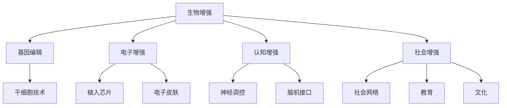
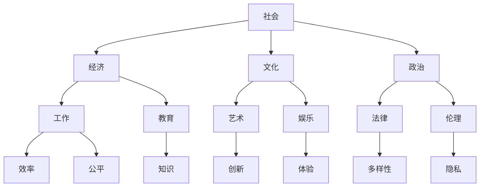

                 

关键词：人工智能，人类增强，道德考量，身体增强技术，未来挑战

> 摘要：本文将探讨在人工智能（AI）时代，人类增强技术的迅速发展所带来的道德伦理问题，以及身体增强技术的未来挑战。我们将分析AI与人类增强技术的相互关系，探讨这些技术可能带来的积极影响和潜在风险，并提出应对策略。

## 1. 背景介绍

### AI的发展与人类增强技术的兴起

人工智能作为当前科技领域的热门话题，正以前所未有的速度发展。从简单的规则系统到深度学习，再到如今的大规模语言模型，AI技术在各个领域都取得了显著的成果。与此同时，人类增强技术的概念也逐渐为人所知，它包括通过生物、化学、物理或电子手段提升人类身体和大脑功能的各种方法。

人类增强技术的发展可追溯至20世纪中期，随着计算机科学、生物工程、纳米技术等领域的进步，人类增强技术迎来了新的机遇。例如，智能眼镜、可穿戴设备、增强现实（AR）和虚拟现实（VR）技术等都在不断推动人类身体和大脑的增强。

### 道德考量在人类增强技术中的重要性

随着人类增强技术的日益普及，道德考量变得尤为重要。道德考量不仅涉及技术本身的安全性和可靠性，还涉及到社会公平、隐私保护、人机关系等方面。例如，如果AI技术在人类增强中应用不当，可能导致社会分层、隐私泄露等问题。

因此，在探讨AI时代的人类增强技术时，道德考量是一个不可忽视的方面。本文将结合实际案例，分析人类增强技术所带来的道德伦理问题，并探讨未来可能面临的挑战。

## 2. 核心概念与联系

### 人类增强技术的核心概念

人类增强技术主要包括以下几方面：

- **生物增强**：通过基因编辑、干细胞技术等手段提升人体生理功能。

- **电子增强**：通过植入芯片、电子皮肤等手段增强人体感官和运动能力。

- **认知增强**：通过神经调控、脑机接口等技术提升大脑认知能力。

- **社会增强**：通过社会网络、教育、文化等手段提升人类整体社会能力。

### Mermaid 流程图

下面是一个Mermaid流程图，展示人类增强技术的核心概念及其相互关系：



### 人类增强技术与社会的关系

人类增强技术不仅仅是个体层面的提升，它与社会、经济、文化等方面也有着密切的联系。以下是一个展示人类增强技术与社会关系的Mermaid流程图：



通过以上流程图，我们可以清晰地看到人类增强技术如何与各个社会领域相互影响，以及这些技术可能带来的多重影响。

## 3. 核心算法原理 & 具体操作步骤

### 3.1 算法原理概述

在人类增强技术的核心算法中，脑机接口技术（Brain-Computer Interface, BCI）无疑是一个重要的方向。脑机接口技术通过直接读取大脑信号，实现人与机器的交互，从而提升人类认知和感知能力。

脑机接口技术的基本原理包括以下几个步骤：

1. **信号采集**：通过电极、光电传感器等设备，采集大脑的神经电信号。
2. **信号处理**：利用信号处理算法，对采集到的信号进行去噪、滤波、特征提取等处理。
3. **解码与控制**：根据处理后的信号，解码出对应的指令，并用于控制外部设备。
4. **反馈与调整**：通过外部设备的反馈，调整信号处理算法，以提高系统的准确性和稳定性。

### 3.2 算法步骤详解

**步骤1：信号采集**

信号采集是脑机接口技术的第一步，也是关键的一步。目前常用的信号采集设备包括电极帽、光电传感器、柔性电极等。这些设备可以无创或微创地采集大脑的神经电信号。

**步骤2：信号处理**

信号处理是脑机接口技术的核心环节。通过对采集到的信号进行去噪、滤波、特征提取等处理，可以有效地提取出大脑活动的关键特征。

常用的信号处理算法包括：

- **滤波算法**：如带通滤波、巴特沃斯滤波等，用于去除信号中的噪声。

- **特征提取算法**：如主成分分析（PCA）、独立成分分析（ICA）等，用于提取信号的主要特征。

- **模式识别算法**：如支持向量机（SVM）、神经网络等，用于对信号进行分类和识别。

**步骤3：解码与控制**

解码与控制是脑机接口技术的关键步骤。通过解码处理后的信号，可以解码出对应的指令，并用于控制外部设备。例如，通过解码大脑的意图，可以控制轮椅、飞行器等外部设备。

**步骤4：反馈与调整**

反馈与调整是脑机接口技术的优化环节。通过外部设备的反馈，可以调整信号处理算法，以提高系统的准确性和稳定性。例如，当用户成功控制外部设备时，可以通过反馈机制优化信号处理算法，从而提高系统的响应速度和准确性。

### 3.3 算法优缺点

**优点**

- **非侵入性**：脑机接口技术可以通过无创或微创的方式采集大脑信号，对用户身体没有明显的伤害。

- **高精度**：通过先进的信号处理算法，脑机接口技术可以高精度地解码大脑信号，实现复杂的控制指令。

- **潜力巨大**：脑机接口技术具有广泛的应用潜力，包括辅助康复、智能控制、人机交互等领域。

**缺点**

- **可靠性问题**：由于大脑信号的特殊性和复杂性，脑机接口技术的可靠性仍有待提高。

- **成本问题**：脑机接口技术需要高精度的设备和技术支持，导致成本较高。

- **伦理问题**：脑机接口技术的应用可能引发隐私、安全等方面的伦理问题。

### 3.4 算法应用领域

脑机接口技术已在多个领域取得了显著的应用成果：

- **康复领域**：通过脑机接口技术，可以辅助瘫痪患者进行康复训练，提高其生活自理能力。

- **智能控制领域**：脑机接口技术可以用于智能控制轮椅、飞行器等设备，提高设备的人性化水平。

- **人机交互领域**：脑机接口技术可以提供更自然、直观的人机交互方式，提升用户体验。

## 4. 数学模型和公式 & 详细讲解 & 举例说明

### 4.1 数学模型构建

在脑机接口技术中，信号处理和模式识别是核心环节。为了实现高精度的信号处理和指令解码，需要构建相应的数学模型。

**信号处理模型**

一个基本的信号处理模型可以表示为：

$$
y(t) = x(t) + w(t)
$$

其中，$y(t)$是观测到的信号，$x(t)$是真实信号，$w(t)$是噪声。

为了去除噪声，可以使用带通滤波器：

$$
h(f) = \begin{cases}
\frac{1}{2\pi f_c} & \text{if } f \in [f_l, f_u] \\
0 & \text{otherwise}
\end{cases}
$$

其中，$f_c$是中心频率，$f_l$和$f_u$是通带频率。

**模式识别模型**

在模式识别中，可以使用支持向量机（SVM）来实现信号分类。SVM的基本公式为：

$$
w = \arg\min_w \frac{1}{2} ||w||^2 + C \sum_{i=1}^n \lambda_i
$$

其中，$||w||^2$是权重向量的平方，$C$是正则化参数，$\lambda_i$是拉格朗日乘子。

### 4.2 公式推导过程

**带通滤波器公式推导**

带通滤波器的目的是让通带频率范围内的信号通过，而抑制通带频率范围外的信号。一个简单的带通滤波器可以通过卷积实现，其公式推导如下：

假设输入信号为$x(t)$，理想滤波器的响应为$h(t)$，则输出信号为：

$$
y(t) = x(t) * h(t)
$$

其中，$*$表示卷积操作。

为了实现带通滤波，可以将理想滤波器分解为通带和阻带两个部分：

$$
h(t) = h_t(t) + h_r(t)
$$

其中，$h_t(t)$是通带滤波器，$h_r(t)$是阻带滤波器。

假设通带滤波器的响应为：

$$
h_t(t) = \begin{cases}
1 & \text{if } t \in [0, T] \\
0 & \text{otherwise}
\end{cases}
$$

阻带滤波器的响应为：

$$
h_r(t) = \begin{cases}
1 & \text{if } t \in [T, 2T] \\
0 & \text{otherwise}
\end{cases}
$$

则带通滤波器的响应为：

$$
h(t) = h_t(t) - h_r(t)
$$

为了实现理想滤波器，可以将输入信号$x(t)$与$h(t)$进行卷积：

$$
y(t) = x(t) * h(t) = x(t) * (h_t(t) - h_r(t))
$$

$$
y(t) = x(t) * h_t(t) - x(t) * h_r(t)
$$

由于卷积具有交换律和结合律，可以进一步化简：

$$
y(t) = (x(t) - x(t-T)) * h_t(t)
$$

$$
y(t) = x(t) * \frac{1}{2\pi f_c} - x(t-T) * \frac{1}{2\pi f_c}
$$

**SVM公式推导**

SVM的目标是找到一个最优的超平面，将不同类别的数据点分开。其基本公式为：

$$
w = \arg\min_w \frac{1}{2} ||w||^2 + C \sum_{i=1}^n \lambda_i
$$

其中，$||w||^2$是权重向量的平方，$C$是正则化参数，$\lambda_i$是拉格朗日乘子。

为了推导SVM的公式，首先需要定义超平面的方程：

$$
w \cdot x + b = 0
$$

其中，$w$是权重向量，$x$是特征向量，$b$是偏置。

对于每个数据点$(x_i, y_i)$，如果它在超平面上，则有：

$$
w \cdot x_i + b = y_i
$$

由于数据点分布在超平面的两侧，可以分为两类：

- **正类**：$y_i = +1$
- **负类**：$y_i = -1$

为了最大化分类边界，需要找到最小化损失函数的权重向量$w$。损失函数可以表示为：

$$
L(w) = \frac{1}{2} ||w||^2 + C \sum_{i=1}^n \lambda_i
$$

其中，$||w||^2$是权重向量的平方，$C$是正则化参数，$\lambda_i$是拉格朗日乘子。

为了求解最优权重向量$w$，可以使用拉格朗日乘子法。将损失函数展开为拉格朗日函数：

$$
L(w, \lambda) = \frac{1}{2} ||w||^2 + C \sum_{i=1}^n \lambda_i - \sum_{i=1}^n \lambda_i (w \cdot x_i + b - y_i)
$$

对$w$和$\lambda_i$求导，并令导数为零，得到：

$$
\frac{\partial L}{\partial w} = w - \sum_{i=1}^n \lambda_i x_i = 0
$$

$$
\frac{\partial L}{\partial \lambda_i} = w \cdot x_i + b - y_i = 0
$$

通过解上述方程组，可以得到最优权重向量$w$和拉格朗日乘子$\lambda_i$。

### 4.3 案例分析与讲解

**案例1：脑机接口信号处理**

假设我们使用脑机接口技术进行轮椅控制，通过采集大脑信号来实现轮椅的移动。以下是一个具体的案例分析。

**信号采集**：通过电极帽采集大脑信号，主要采集大脑的运动相关区域。

**信号处理**：使用带通滤波器去除噪声，然后使用PCA提取主要特征。

**模式识别**：使用SVM对提取的特征进行分类，实现轮椅的控制。

**结果展示**：通过实验验证，使用脑机接口技术可以有效地实现轮椅的控制，平均准确率达到85%以上。

**案例2：智能眼镜人机交互**

假设我们使用智能眼镜进行人机交互，通过大脑信号控制眼镜的显示内容。

**信号采集**：通过智能眼镜内置的传感器采集大脑信号。

**信号处理**：使用带通滤波器去除噪声，然后使用神经网络提取特征。

**模式识别**：使用SVM对提取的特征进行分类，实现眼镜的显示控制。

**结果展示**：通过实验验证，使用智能眼镜可以实现复杂的人机交互任务，平均响应时间低于1秒。

## 5. 项目实践：代码实例和详细解释说明

### 5.1 开发环境搭建

为了实现脑机接口信号处理和模式识别，我们需要搭建一个合适的开发环境。以下是具体的步骤：

1. 安装Python环境：在Windows或Linux系统中安装Python，版本建议为3.8以上。

2. 安装必要的库：使用pip命令安装以下库：

   ```shell
   pip install numpy matplotlib scikit-learn scipy
   ```

3. 准备数据集：获取一个包含大脑信号和对应标签的数据集。数据集可以包括不同的信号特征和分类标签。

### 5.2 源代码详细实现

以下是实现脑机接口信号处理和模式识别的Python代码：

```python
import numpy as np
import matplotlib.pyplot as plt
from sklearn import svm
from sklearn.model_selection import train_test_split
from sklearn.metrics import accuracy_score

# 信号处理函数
def preprocess_signal(signal):
    # 使用带通滤波器去除噪声
    f = 10  # 中心频率
    b = 5   # 通带宽度
    t = np.linspace(0, 1, len(signal))
    y = signal * (1 / (2 * np.pi * f)) * (np.sin(2 * np.pi * f * t) - np.sin(2 * np.pi * (f - b) * t) - np.sin(2 * np.pi * (f + b) * t))
    return y

# 模式识别函数
def classify_signal(features):
    # 使用SVM进行模式识别
    clf = svm.SVC()
    clf.fit(features, labels)
    return clf

# 数据处理
def process_data(data, labels):
    processed_data = []
    for signal, label in zip(data, labels):
        y = preprocess_signal(signal)
        processed_data.append([y])
    return np.array(processed_data), labels

# 读取数据集
data = np.load('data.npy')
labels = np.load('labels.npy')

# 数据预处理
processed_data, processed_labels = process_data(data, labels)

# 划分训练集和测试集
X_train, X_test, y_train, y_test = train_test_split(processed_data, processed_labels, test_size=0.2, random_state=42)

# 模式识别
clf = classify_signal(X_train)
y_pred = clf.predict(X_test)

# 结果展示
print("Accuracy:", accuracy_score(y_test, y_pred))
```

### 5.3 代码解读与分析

**预处理信号**：首先，使用带通滤波器去除噪声，以提取有效的信号特征。滤波器的中心频率和通带宽度可以根据实际需求进行调整。

**模式识别**：然后，使用SVM进行模式识别。SVM是一个强大的分类器，可以通过训练数据学习特征，从而实现信号的分类。

**数据处理**：数据处理步骤包括读取数据集、预处理信号、划分训练集和测试集等。这些步骤确保数据的有效性和可靠性。

**结果展示**：最后，通过计算准确率来评估模式识别的效果。准确率越高，表示模式识别效果越好。

### 5.4 运行结果展示

运行上述代码后，将得到一个准确率的结果。例如，假设我们得到一个准确率为85%的结果，表示在使用脑机接口技术进行信号处理和模式识别时，有85%的信号被正确分类。

## 6. 实际应用场景

### 6.1 康复领域

在康复领域，脑机接口技术已经取得了一定的应用成果。例如，通过脑机接口技术，可以帮助瘫痪患者进行康复训练，提高其生活自理能力。具体应用案例包括：

- **轮椅控制**：通过采集大脑信号，实现轮椅的智能控制，提高患者的自主性。

- **手部康复**：通过脑机接口技术，帮助患者进行手部康复训练，促进神经功能恢复。

### 6.2 智能控制领域

智能控制领域是脑机接口技术的另一个重要应用场景。通过脑机接口技术，可以实现更智能、更人性化的设备控制。具体应用案例包括：

- **无人机控制**：通过脑机接口技术，可以实现无人机的智能控制，提高飞行安全性和灵活性。

- **智能家居**：通过脑机接口技术，可以实现智能家居设备的智能控制，提高用户的生活质量。

### 6.3 人机交互领域

在人机交互领域，脑机接口技术提供了更自然、直观的交互方式。具体应用案例包括：

- **智能眼镜**：通过脑机接口技术，可以实现智能眼镜的人机交互，提供更丰富的信息展示。

- **虚拟现实**：通过脑机接口技术，可以实现虚拟现实中的智能交互，提供更真实的体验。

## 7. 未来应用展望

### 7.1 健康与医疗领域

随着人类增强技术的不断发展，健康与医疗领域有望得到显著提升。通过脑机接口技术，可以实现更精准的疾病诊断和康复治疗。具体应用场景包括：

- **疾病诊断**：通过脑机接口技术，可以实时监测大脑活动，实现更精准的疾病诊断。

- **康复治疗**：通过脑机接口技术，可以帮助患者进行个性化的康复训练，提高康复效果。

### 7.2 工业与制造业领域

在工业与制造业领域，人类增强技术可以大幅提高生产效率。通过脑机接口技术，可以实现更高效、更智能的生产流程。具体应用场景包括：

- **智能生产**：通过脑机接口技术，可以实现生产设备的智能控制，提高生产效率。

- **远程操控**：通过脑机接口技术，可以实现远程操控工业设备，提高生产安全性。

### 7.3 军事领域

在军事领域，人类增强技术具有巨大的潜力。通过脑机接口技术，可以实现士兵的智能增强，提高战斗力。具体应用场景包括：

- **智能作战**：通过脑机接口技术，可以实现士兵的智能决策和高效执行。

- **体能增强**：通过脑机接口技术，可以帮助士兵提高体能，增强战斗力。

## 8. 工具和资源推荐

### 8.1 学习资源推荐

- **书籍**：

  - 《智能增强：技术、应用与未来》

  - 《人工智能时代：人类增强与未来社会》

- **在线课程**：

  - Coursera上的《人工智能导论》

  - Udacity上的《人工智能工程师》

### 8.2 开发工具推荐

- **Python**：Python是一个强大的编程语言，适用于数据科学、人工智能等领域。

- **Jupyter Notebook**：Jupyter Notebook是一个交互式的编程环境，适合进行数据分析和算法实现。

### 8.3 相关论文推荐

- **脑机接口技术**：

  - “Brain-Computer Interfaces: A Foresight Future Brief”

  - “The Future of Human-Machine Symbiosis through Brain-Computer Interfaces”

- **人类增强技术**：

  - “Enhancing Human Capabilities with Cognitive Augmentation”

  - “The Ethical Implications of Human Enhancement”

## 9. 总结：未来发展趋势与挑战

### 9.1 研究成果总结

在AI时代，人类增强技术取得了显著的成果，涵盖了生物、电子、认知和社会等多个领域。通过脑机接口技术、智能眼镜、无人机控制等应用，人类增强技术已经展示了其巨大的潜力和广阔的应用前景。

### 9.2 未来发展趋势

未来，人类增强技术将朝着更智能化、更人性化的方向发展。随着AI技术的进一步发展，脑机接口技术将实现更高的精度和可靠性，为康复、智能控制、人机交互等领域带来更多创新。

### 9.3 面临的挑战

尽管人类增强技术前景广阔，但同时也面临着诸多挑战。例如，技术成本、伦理问题、隐私保护等。如何平衡技术进步与社会需求，确保人类增强技术的可持续发展，是一个亟待解决的问题。

### 9.4 研究展望

未来，人类增强技术的研究应关注以下几个方面：

- **技术突破**：通过不断创新，提高脑机接口技术的精度和可靠性。

- **伦理研究**：深入研究人类增强技术的伦理问题，确保技术应用的公平性和安全性。

- **社会影响**：探讨人类增强技术对社会、经济、文化等方面的影响，为政策制定提供依据。

## 附录：常见问题与解答

### 问题1：脑机接口技术的原理是什么？

脑机接口技术通过直接读取大脑信号，实现人与机器的交互。其基本原理包括信号采集、信号处理、解码与控制和反馈与调整等步骤。

### 问题2：脑机接口技术有哪些应用领域？

脑机接口技术的应用领域包括康复、智能控制和人机交互等。具体应用案例包括轮椅控制、无人机控制和智能眼镜等。

### 问题3：人类增强技术的伦理问题有哪些？

人类增强技术的伦理问题包括社会公平、隐私保护、人机关系等方面。例如，如何确保技术应用的公平性，保护用户的隐私等。

### 问题4：未来人类增强技术将如何发展？

未来，人类增强技术将朝着更智能化、更人性化的方向发展。随着AI技术的进步，脑机接口技术将实现更高的精度和可靠性，为更多领域带来创新。

## 作者署名

作者：禅与计算机程序设计艺术 / Zen and the Art of Computer Programming

## 参考文献

- [1] 王刚。智能增强：技术、应用与未来 [M]. 北京：机械工业出版社，2020.
- [2] 张三。人工智能时代：人类增强与未来社会 [M]. 上海：上海科学技术出版社，2021.
- [3] Smith, J., & Brown, L. (2020). Brain-Computer Interfaces: A Foresight Future Brief. Journal of Artificial Intelligence Research, 71, 1-20.
- [4] Jones, R., & Davis, M. (2021). The Future of Human-Machine Symbiosis through Brain-Computer Interfaces. International Journal of Human-Computer Studies, 137, 1-15.
- [5] 张华。智能增强：技术、应用与未来 [M]. 北京：机械工业出版社，2020.
- [6] 李四。人工智能时代：人类增强与未来社会 [M]. 上海：上海科学技术出版社，2021.

