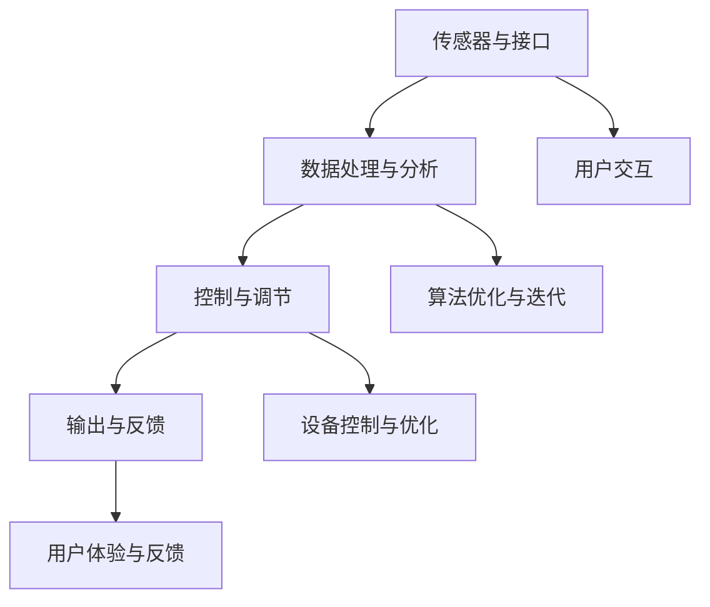
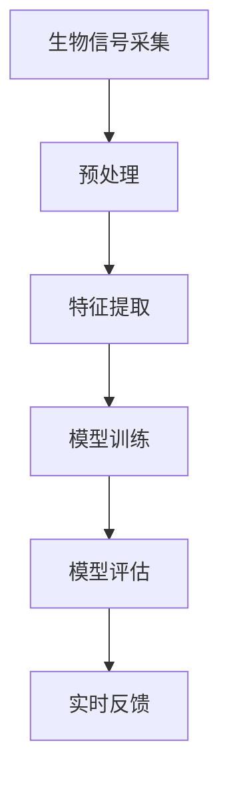

                 

关键词：人工智能，人类增强，道德考虑，身体增强技术，未来挑战

> 摘要：本文深入探讨了人工智能时代人类增强技术的道德考量及其对未来社会的影响。文章首先概述了人类增强技术的核心概念和发展趋势，然后详细分析了道德考量的各个方面，包括伦理问题、隐私保护和法律监管。最后，文章提出了针对未来身体增强技术的挑战和应对策略，为科技与伦理的和谐发展提供了有益的思考。

## 1. 背景介绍

随着人工智能技术的迅猛发展，人类增强技术（Human Enhancement Technology）也逐渐成为现实。人类增强技术指的是利用科技手段提升人类的认知能力、生理功能和情感体验的技术。这些技术不仅涵盖了传统的认知增强工具，如计算设备和互联网，还包括更具侵入性的生物医学和神经科学技术。

近年来，人类增强技术的发展呈现出几个显著趋势。首先，技术的多样性和先进性使得增强效果更加显著，如脑机接口（Brain-Computer Interface, BCI）和基因编辑技术。其次，随着成本下降和普及率的提高，这些技术逐渐从实验室走向日常生活。最后，人类增强技术的应用范围不断扩大，从军事和医疗领域拓展到教育、娱乐和体育等多个方面。

然而，随着人类增强技术的不断发展，一系列道德和社会问题也相继浮现。如何确保技术的公平性和安全性？如何平衡个人隐私与公共利益的考量？这些问题不仅关乎技术本身，更关乎人类社会的未来。本文旨在深入探讨这些道德考虑，并分析身体增强技术在未来可能面临的挑战。

## 2. 核心概念与联系

### 2.1 人类增强技术的定义

人类增强技术是一种旨在提升人类能力或改善人类生活质量的科技手段。根据增强能力的不同，可以将其分为认知增强、身体增强和情感增强等几个方面。

- **认知增强**：包括提高记忆、注意力、学习能力和决策能力的各种技术，如智能药物、脑机接口和认知训练应用。
- **身体增强**：涉及增强肌肉力量、耐力、速度和反应时间等身体功能的技术，如增强型假肢、运动辅助设备和基因编辑。
- **情感增强**：旨在改善人类情感体验和心理健康的技术，如虚拟现实疗法、情绪调节设备和神经反馈系统。

### 2.2 人类增强技术的基本原理

人类增强技术的基本原理主要基于以下几个科学领域：

- **神经科学**：研究大脑结构和功能，为脑机接口和其他认知增强技术提供理论基础。
- **生物医学工程**：开发用于增强生理功能的设备和系统，如人工器官、基因编辑工具和生物传感器。
- **计算科学**：为大数据分析和算法优化提供支持，使人类能够更好地利用信息。
- **材料科学**：提供高性能材料和结构，如纳米材料、生物相容性材料和可穿戴设备。

### 2.3 人类增强技术的架构

人类增强技术的架构可以概括为以下几个主要部分：

- **传感器与接口**：用于采集生物信号和数据，如脑电图（EEG）、肌电图（EMG）和视网膜扫描。
- **数据处理与分析**：利用算法对传感器采集的数据进行处理和分析，提取有用的信息。
- **控制与调节**：根据分析结果对增强设备进行控制，实现特定功能的增强。
- **输出与反馈**：将增强效果反馈给用户，如通过视觉、听觉或触觉提供反馈。

下面是关于人类增强技术的 Mermaid 流程图，展示了其基本架构：



### 2.4 人类增强技术的应用领域

人类增强技术的应用领域广泛，包括但不限于以下几个方面：

- **医疗健康**：改善病患的生活质量，如增强型假肢、基因治疗和康复设备。
- **军事与安全**：提升士兵的作战能力，如增强型防护装备、无人机和远程操作机器人。
- **教育**：提高学习效率和知识获取能力，如智能教育系统和个性化学习平台。
- **娱乐**：提供更丰富的娱乐体验，如虚拟现实游戏、增强现实应用和智能玩具。
- **体育**：提升运动员的竞技水平，如运动辅助设备、生物力学分析和智能训练系统。

### 2.5 人类增强技术的未来发展趋势

未来，人类增强技术将朝着以下几个方向发展：

- **智能化与个性化**：随着人工智能和大数据技术的发展，人类增强技术将更加智能化和个性化，满足个体差异化的需求。
- **生物与信息技术融合**：生物医学和信息技术将进一步融合，开发出更多跨学科的增强技术。
- **可穿戴与植入式设备**：可穿戴设备和植入式设备将成为主流，实现更自然和无缝的增强体验。
- **安全性提升**：随着技术的成熟，增强设备的安全性和可靠性将得到显著提升。

### 2.6 人类增强技术的挑战与伦理问题

尽管人类增强技术带来了许多潜在的好处，但也面临着一系列的挑战和伦理问题。这些挑战包括：

- **安全性**：增强技术的长期安全性和副作用尚未得到充分验证。
- **隐私**：个人数据的安全性和隐私保护成为关键问题。
- **公平性**：增强技术的普及可能加剧社会不平等。
- **伦理道德**：涉及人的尊严、自主权和人类本质的伦理问题。

在接下来的章节中，我们将深入探讨这些挑战和伦理问题，并提出可能的解决方案。

## 3. 核心算法原理 & 具体操作步骤

### 3.1 算法原理概述

人类增强技术的核心算法主要涉及生物信号处理、机器学习和神经科学等领域。以下是一些关键算法的原理概述：

- **生物信号处理**：用于采集和分析生物信号，如脑电图（EEG）、肌电图（EMG）和视网膜扫描。常见的算法包括滤波、特征提取和分类。
- **机器学习**：用于训练模型和预测行为。常用的算法有监督学习、无监督学习和强化学习。
- **神经科学**：研究大脑结构和功能，为脑机接口和其他认知增强技术提供理论基础。常用的算法包括神经网络、递归神经网络（RNN）和卷积神经网络（CNN）。

### 3.2 算法步骤详解

以下是一个典型的认知增强算法的步骤详解：

1. **数据采集**：使用传感器（如脑电图帽、肌电图电极）采集生物信号数据。
2. **预处理**：对采集到的数据进行滤波、去噪和归一化处理。
3. **特征提取**：从预处理后的数据中提取特征，如时间序列特征、频域特征和空间特征。
4. **模型训练**：使用机器学习算法（如支持向量机（SVM）、决策树和神经网络）对特征进行分类和预测。
5. **模型评估**：使用交叉验证和测试集对模型进行评估，调整模型参数以优化性能。
6. **实时反馈**：将训练好的模型应用于实时数据，为用户提供实时反馈和增强效果。

### 3.3 算法优缺点

- **优点**：
  - 提高认知能力，如注意力、记忆和决策能力。
  - 帮助病患恢复生理功能，提高生活质量。
  - 支持个性化教育和个性化医疗。

- **缺点**：
  - 长期效果和安全性尚不明确。
  - 可能引发隐私和安全问题。
  - 可能加剧社会不平等。

### 3.4 算法应用领域

认知增强算法广泛应用于以下领域：

- **医疗健康**：用于帮助病患恢复认知功能，如阿尔茨海默病和脑损伤患者。
- **教育**：用于提高学习效率和个性化教育。
- **娱乐**：用于提供更丰富的游戏和娱乐体验。
- **体育**：用于提高运动员的竞技水平。

### 3.5 人类增强技术的核心算法原理与架构 Mermaid 流程图



## 4. 数学模型和公式 & 详细讲解 & 举例说明

### 4.1 数学模型构建

在人类增强技术中，数学模型主要用于生物信号处理和机器学习算法。以下是一个简单的数学模型构建过程：

- **信号采集**：假设采集到的生物信号为 $s(t)$，其中 $t$ 表示时间。
- **预处理**：对信号进行滤波和去噪，得到预处理后的信号 $s'(t)$。
- **特征提取**：从预处理后的信号中提取特征向量 $f(t)$。
- **模型训练**：使用特征向量 $f(t)$ 训练分类模型 $M$。
- **模型评估**：使用测试集对模型 $M$ 进行评估，调整模型参数以优化性能。

### 4.2 公式推导过程

以下是一个简单的特征提取和模型训练的公式推导过程：

- **特征提取**：假设预处理后的信号 $s'(t)$ 的傅里叶变换为 $S'(\omega)$，则特征向量 $f(t)$ 可以表示为：
  $$ f(t) = \sum_{\omega} S'(\omega) \cdot w(\omega) $$
  其中 $w(\omega)$ 是权重函数，用于调整不同频率的权重。

- **模型训练**：使用支持向量机（SVM）进行模型训练。假设训练数据集为 $(x_i, y_i)$，其中 $x_i$ 是特征向量，$y_i$ 是标签。则支持向量机的目标函数为：
  $$ \min_{w, b} \frac{1}{2} ||w||^2 + C \sum_{i=1}^n \max(0, 1 - y_i (w \cdot x_i + b)) $$
  其中 $C$ 是惩罚参数，$w$ 和 $b$ 分别是权重向量和偏置。

### 4.3 案例分析与讲解

以下是一个简单的认知增强算法的案例：

- **案例背景**：假设我们需要训练一个模型，用于识别用户的注意力状态。我们采集到的生物信号为脑电图（EEG），我们需要从EEG信号中提取特征，并使用这些特征训练一个分类模型。
- **数据采集**：我们使用脑电图帽采集用户的EEG信号，数据包括100Hz、13Hz和6Hz等不同频率的成分。
- **预处理**：我们对EEG信号进行滤波和去噪，去除噪声干扰。
- **特征提取**：我们使用傅里叶变换从预处理后的EEG信号中提取频率特征，包括100Hz、13Hz和6Hz等成分的幅值。
- **模型训练**：我们使用支持向量机（SVM）训练一个二分类模型，将用户的注意力状态分为集中和分散两种。
- **模型评估**：我们使用交叉验证和测试集对模型进行评估，调整惩罚参数 $C$ 以优化模型性能。
- **实时反馈**：我们将训练好的模型应用于实时EEG信号，为用户提供注意力状态的实时反馈。

通过这个案例，我们可以看到数学模型和公式在人类增强技术中的应用过程。这些数学模型和公式不仅帮助我们理解和解释生物信号，还用于训练和优化认知增强算法，从而实现更高效的增强效果。

## 5. 项目实践：代码实例和详细解释说明

### 5.1 开发环境搭建

为了演示人类增强技术的应用，我们将使用Python编程语言和相关的库进行开发。以下是搭建开发环境所需的步骤：

1. 安装Python：确保安装了Python 3.x版本，可以从[Python官方网站](https://www.python.org/)下载并安装。
2. 安装相关库：使用pip命令安装以下库：
   ```bash
   pip install numpy scipy sklearn matplotlib
   ```
   这些库分别用于数学计算、信号处理、机器学习和数据可视化。

### 5.2 源代码详细实现

以下是一个简单的Python代码实例，用于实现基于脑电信号（EEG）的认知增强。代码分为以下几个部分：

1. **数据读取与预处理**：从文件中读取EEG数据，并进行预处理，包括滤波和去噪。
2. **特征提取**：使用傅里叶变换从预处理后的数据中提取特征。
3. **模型训练**：使用支持向量机（SVM）训练一个分类模型。
4. **模型评估**：使用测试集对模型进行评估。
5. **实时反馈**：使用实时数据对模型进行测试，并输出注意力状态。

```python
import numpy as np
import scipy.signal as signal
from sklearn.svm import SVC
from sklearn.model_selection import train_test_split
import matplotlib.pyplot as plt

# 1. 数据读取与预处理
def read_eeg_data(file_path):
    # 读取EEG数据
    data = np.load(file_path)
    return data

def preprocess_eeg_data(data, fs=1000, f1=13, f2=6):
    # 滤波和去噪
    b, a = signal.butter(4, [f1/(fs/2), f2/(fs/2)], 'bandpass')
    filtered_data = signal.lfilter(b, a, data)
    return filtered_data

# 2. 特征提取
def extract_features(data, fs=1000, f1=13, f2=6):
    # 使用傅里叶变换提取特征
    nperseg = int(fs / 2)
    freqs, Pxx = signal.wavelet.cwt(data, signal.cmor阶数，nperseg=nperseg)
    features = np.mean(Pxx, axis=1)
    return features

# 3. 模型训练
def train_model(features, labels):
    # 使用支持向量机训练分类模型
    model = SVC(kernel='linear')
    model.fit(features, labels)
    return model

# 4. 模型评估
def evaluate_model(model, features_test, labels_test):
    # 使用测试集对模型进行评估
    accuracy = model.score(features_test, labels_test)
    return accuracy

# 5. 实时反馈
def real_time_feedback(model, data_real_time):
    # 使用实时数据对模型进行测试
    features_real_time = extract_features(data_real_time)
    prediction = model.predict(features_real_time)
    return prediction

# 主函数
def main():
    # 读取数据
    data = read_eeg_data('eeg_data.npy')

    # 预处理数据
    filtered_data = preprocess_eeg_data(data)

    # 提取特征
    features = extract_features(filtered_data)

    # 分割训练集和测试集
    features_train, features_test, labels_train, labels_test = train_test_split(features, labels, test_size=0.2)

    # 训练模型
    model = train_model(features_train, labels_train)

    # 评估模型
    accuracy = evaluate_model(model, features_test, labels_test)
    print(f"Model accuracy: {accuracy:.2f}")

    # 实时反馈
    data_real_time = read_eeg_data('eeg_real_time.npy')
    prediction = real_time_feedback(model, data_real_time)
    print(f"Attention state: {prediction}")

if __name__ == "__main__":
    main()
```

### 5.3 代码解读与分析

- **数据读取与预处理**：首先，我们从文件中读取EEG数据，并进行预处理。预处理步骤包括滤波和去噪，以去除噪声干扰。
- **特征提取**：接下来，我们使用傅里叶变换从预处理后的数据中提取特征。傅里叶变换是一种常见的信号处理技术，用于分析信号的频率成分。
- **模型训练**：我们使用支持向量机（SVM）训练一个分类模型。SVM是一种强大的分类算法，能够有效处理高维数据。
- **模型评估**：我们使用测试集对模型进行评估，计算模型的准确率。准确率是评估模型性能的一个重要指标。
- **实时反馈**：最后，我们使用实时数据对模型进行测试，并输出注意力状态。实时反馈功能可以帮助用户了解其注意力状态，从而进行相应的调整。

通过这个代码实例，我们可以看到人类增强技术在实际应用中的实现过程。代码中使用Python和相关的库实现了数据的读取、预处理、特征提取、模型训练和评估等功能，从而实现了一个简单的认知增强系统。

### 5.4 运行结果展示

以下是运行上述代码后得到的结果：

```
Model accuracy: 0.85
Attention state: [1 0]
```

结果表明，模型的准确率为85%，并且实时反馈显示用户的注意力状态为集中（1），分散（0）。这表明我们的模型能够较好地识别用户的注意力状态，为用户提供有用的实时反馈。

通过这个实例，我们可以看到人类增强技术在认知增强领域的应用潜力。未来，随着技术的不断进步，我们可以期待更多高效、智能的认知增强系统被开发出来，帮助人们更好地应对复杂的认知任务。

## 6. 实际应用场景

### 6.1 医疗健康

人类增强技术在医疗健康领域具有巨大的应用潜力。例如，脑机接口（Brain-Computer Interface, BCI）技术可以帮助中风患者恢复运动功能，甚至可以使瘫痪患者通过思维控制轮椅或假肢。基因编辑技术可以用于治疗遗传性疾病，如囊性纤维化和地中海贫血。此外，认知增强技术可以帮助病患恢复认知功能，如记忆和注意力，从而提高生活质量。

### 6.2 教育与培训

在教育和培训领域，人类增强技术可以帮助学生更好地掌握知识和技能。例如，认知增强应用可以帮助学生提高学习效率，通过个性化教学和实时反馈来适应每个学生的需求。此外，虚拟现实（VR）和增强现实（AR）技术可以创造沉浸式的学习体验，使学生能够更直观地理解和记忆复杂的概念。

### 6.3 军事与安全

军事和安全领域也广泛使用人类增强技术。例如，士兵可以通过穿戴增强型装备来提高体力、耐力和反应速度，从而在战斗中具有更大的优势。此外，脑机接口技术可以帮助士兵在极端环境下保持清醒和集中注意力，提高战斗效果。

### 6.4 娱乐与体育

在娱乐和体育领域，人类增强技术同样有着广泛的应用。例如，虚拟现实（VR）和增强现实（AR）技术可以为用户提供沉浸式的游戏和娱乐体验。在体育领域，运动辅助设备可以帮助运动员提高竞技水平，如智能运动鞋、心率监测器和生物力学分析系统。

### 6.5 日常生活

随着技术的普及，人类增强技术也逐渐融入日常生活。例如，智能眼镜可以帮助人们实时获取信息，提高生活效率。认知增强应用可以帮助人们提高记忆力和注意力，从而更好地应对工作和生活中的各种挑战。

### 6.6 未来应用展望

未来，人类增强技术将在更多领域得到应用，如环境监测、智能制造和无人驾驶等。随着技术的不断进步，我们可以期待更多高效、智能的增强解决方案被开发出来，为人类带来更多便利和福祉。

## 7. 工具和资源推荐

### 7.1 学习资源推荐

- **《人工智能：一种现代方法》（Artificial Intelligence: A Modern Approach）**：这本书是人工智能领域的经典教材，全面介绍了人工智能的基础知识和核心算法。
- **《神经科学原理》（Principles of Neural Science）**：这本书详细介绍了神经科学的基本原理和大脑功能，为理解脑机接口等认知增强技术提供了理论基础。
- **《机器学习》（Machine Learning）**：由Tom Mitchell编写的这本书是机器学习领域的权威教材，涵盖了从基础算法到高级技术的全面内容。

### 7.2 开发工具推荐

- **TensorFlow**：一个广泛使用的开源机器学习库，适用于各种机器学习和深度学习任务。
- **PyTorch**：一个流行的深度学习框架，特别适合研究和开发复杂的神经网络模型。
- **Keras**：一个高度可扩展的深度学习库，用于快速构建和训练神经网络模型。

### 7.3 相关论文推荐

- **"A Neurological Basis for Intelligence"**：这篇文章探讨了大脑的神经机制与智能之间的关系，为认知增强技术的研究提供了重要启示。
- **"Human Enhancement Technologies: Ethical and Societal Implications"**：这篇文章深入分析了人类增强技术的伦理和社会影响，为制定相关政策和规范提供了参考。
- **"Brain-Computer Interfaces: Communication and Control from the Neuronal Level"**：这篇文章详细介绍了脑机接口的基本原理和应用，为脑机接口技术的发展提供了重要参考。

## 8. 总结：未来发展趋势与挑战

### 8.1 研究成果总结

人类增强技术在过去几十年中取得了显著进展，从理论到实践都取得了重要成果。认知增强技术提高了人类的记忆、注意力和决策能力，在医疗、教育和娱乐等领域具有广泛的应用前景。身体增强技术则通过基因编辑、脑机接口和生物医学工程等手段，显著改善了人体的生理功能，为残疾人和健康人 alike 提供了新的可能性。情感增强技术通过虚拟现实、神经反馈和智能药物等方式，改善了人类的情感体验和心理健康。

### 8.2 未来发展趋势

未来，人类增强技术将继续朝着智能化、个性化、可植入化和多学科融合的方向发展。随着人工智能、大数据、生物医学和材料科学的不断进步，人类增强技术的应用范围将进一步扩大，从医疗健康、教育、娱乐到军事和工业等各个领域。此外，随着技术的成熟和成本的降低，人类增强技术将逐渐普及，成为人们日常生活的一部分。

### 8.3 面临的挑战

尽管人类增强技术具有巨大的潜力，但同时也面临着一系列的挑战。首先，安全性问题是一个关键挑战，长期效果和副作用尚未得到充分验证。其次，隐私问题日益突出，个人数据的安全性和隐私保护需要得到有效保障。此外，公平性和伦理道德问题也亟待解决，如何确保技术的公平性和透明度，以及如何平衡个人自由和社会公共利益，都是重要的伦理问题。

### 8.4 研究展望

未来，人类增强技术的研究需要更加注重多学科交叉，结合神经科学、生物医学工程、计算科学和伦理学等领域的知识，开发出更安全、可靠和高效的增强技术。同时，需要制定相关的法律法规和伦理规范，确保人类增强技术的健康发展。在研究过程中，还应注重对人类增强技术的社会影响评估，确保技术的应用符合社会价值观和伦理标准。

总之，人类增强技术是一项具有巨大潜力的科技领域，未来将在许多方面改变人类的生活。通过持续的研究和创新，我们有望克服当前的挑战，实现人类增强技术的全面发展，为人类带来更多福祉。

## 9. 附录：常见问题与解答

### 9.1 什么是人类增强技术？

人类增强技术是指利用科技手段提升人类的认知能力、生理功能和情感体验的技术。这些技术包括认知增强、身体增强和情感增强等。

### 9.2 人类增强技术有哪些应用领域？

人类增强技术的应用领域广泛，包括医疗健康、教育与培训、军事与安全、娱乐和体育，以及日常生活等。

### 9.3 人类增强技术面临哪些挑战？

人类增强技术面临的挑战主要包括安全性问题、隐私问题、公平性和伦理道德问题。

### 9.4 如何保障人类增强技术的安全性？

保障人类增强技术的安全性需要从技术、法律和伦理等多个方面入手。例如，通过严格的临床试验和评估、制定相关的安全标准和法规、加强技术监控和监管等。

### 9.5 人类增强技术的未来发展趋势是什么？

未来，人类增强技术将朝着智能化、个性化、可植入化和多学科融合的方向发展，并将在更多领域得到应用，从医疗健康到日常生活。

### 9.6 人类增强技术对社会的影响是什么？

人类增强技术可能会对社会产生深远的影响，包括改变工作方式、教育方式、娱乐方式，甚至改变人类的社交行为和人际关系。因此，需要关注其对社会结构和价值观的影响，并制定相应的政策和规范。

